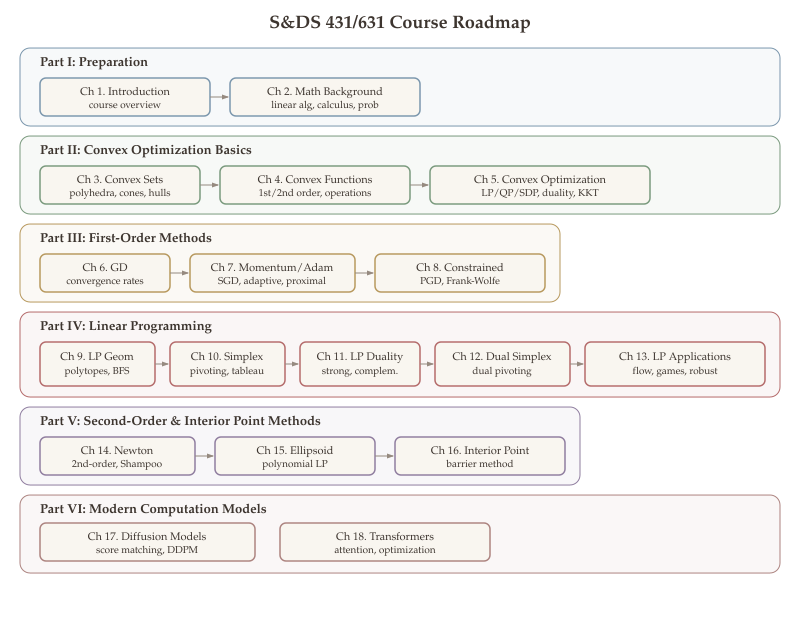

## Welcome {.unnumbered}

Optimization is the engine behind machine learning, data science, and modern engineering. Every time a neural network trains, a recommendation system updates, or a supply chain reconfigures, an optimization problem is being solved. This course provides a rigorous introduction to the theory and algorithms that make it all work.

These interactive lecture notes cover the full arc from foundations --- convex sets, convex functions, duality, and the geometry of linear programming --- through the simplex and interior point methods that power industrial solvers, the first-order methods (gradient descent, proximal, subgradient, Frank-Wolfe) that drive modern large-scale computation, and modern computation models including diffusion models and transformers. Each chapter includes formal definitions and theorems with cross-references, interactive Plotly visualizations for geometric intuition, and Python code blocks you can run in Jupyter or Google Colab.

## Course Flow {.unnumbered}

{#fig-course-flow}

## Course Overview {.unnumbered}

### Part I: Preparation

- **[Introduction and Motivation](lectures/01-introduction.qmd)** --- Why does optimization matter? A tour of applications --- from training neural networks to portfolio allocation --- and a formalization of what it means to minimize an objective subject to constraints.

- **[Mathematical Background](lectures/02-math-background.qmd)** --- The essential toolkit: norms and inner products, eigenvalues and spectral decompositions, gradients, Hessians, Taylor expansions, and the chain rule for backpropagation.

### Part II: Convex Optimization Basics

- **[Convex Sets](lectures/03-convex-sets.qmd)** --- Solution concepts, the Weierstrass theorem, convex sets (halfspaces, polyhedra, cones, ellipsoids), operations preserving convexity, convex combinations, and convex hulls.

- **[Convex Functions](lectures/04-convex-functions.qmd)** --- Convex functions (first- and second-order characterizations), operations preserving convexity of functions, sublevel sets, and the key consequence that every local minimum is a global minimum.

- **[Convex Optimization](lectures/05-convex-optimization.qmd)** --- Convex optimization in standard form, the hierarchy of convex programs (LP, QP, SOCP, SDP), Lagrangian duality, weak and strong duality, Slater's condition, and KKT conditions.

### Part III: First-Order Methods

- **[Gradient Descent](lectures/06-gradient-descent.qmd)** --- How do we find a minimum iteratively? The descent lemma, convergence rates for smooth ($O(1/k)$) and strongly convex ($O(\rho^k)$) objectives, step size selection, and the role of the condition number.

- **[Momentum, Adaptive Methods, SGD, and Proximal Gradient](lectures/07-momentum-adaptive-sgd.qmd)** --- Beyond vanilla gradient descent: momentum methods, Nesterov's accelerated gradient, adaptive methods (AdaGrad, RMSProp, Adam), stochastic gradient descent, proximal gradient methods for composite objectives, and modern matrix optimizers (Muon, Shampoo, SOAP) that exploit the spectral geometry of neural network weights.

- **[Constrained First-Order Methods](lectures/08-constrained-first-order.qmd)** --- Optimizing over constrained domains: projected subgradient descent for non-smooth problems, and the Frank-Wolfe (conditional gradient) method when projection is expensive but linear minimization is cheap.

### Part IV: Linear Programming

- **[LP Formulation and Geometry](lectures/09-lp-formulation-geometry.qmd)** --- What does a linear program look like? Standard and equational forms, polyhedra, vertices, extreme points, basic feasible solutions, and the fundamental theorem of LP.

- **[The Simplex Method](lectures/10-simplex-method.qmd)** --- The most famous algorithm in optimization: pivot along edges of the polytope, improving the objective at each step. We develop the full tableau method and analyze its correctness.

- **[LP Duality](lectures/11-lp-duality.qmd)** --- Every LP has a dual. Weak duality gives a bound, strong duality gives equality, and complementary slackness links primal and dual solutions.

- **[The Dual Simplex Method](lectures/12-dual-simplex.qmd)** --- Working from the dual side: the dual simplex maintains dual feasibility while pushing toward primal feasibility. Essential for sensitivity analysis and warm-starting.

- **[LP Applications and Game Theory](lectures/13-lp-applications.qmd)** --- LP in action: max-flow/min-cut, network flow, totally unimodular matrices, robust optimization, and the minimax theorem for two-player zero-sum games.

### Part V: Second-Order and Interior Point Methods

- **[Newton's Method](lectures/14-newton-method.qmd)** --- Exploiting curvature: Newton's method achieves quadratic convergence via the Hessian. We develop the affine-invariant Newton decrement, backtracking line search, and self-concordance theory that underpins the interior point methods in the next chapter.

- **[The Ellipsoid Method](lectures/15-ellipsoid-method.qmd)** --- The algorithm that settled the polynomial-time solvability of LP: maintain an ellipsoid containing the optimum, and shrink it at each step via a separating hyperplane.

- **[Interior Point Methods](lectures/16-interior-point-methods.qmd)** --- The modern workhorse for constrained optimization: logarithmic barriers, the central path, and Newton-based path-following with $O(\sqrt{m}\log(1/\varepsilon))$ iteration complexity.

### Part VI: Modern Computation Models

- **[Diffusion Models](lectures/17-diffusion-models.qmd)** --- How do generative AI models create images from noise? The forward noising process, score matching, denoising score matching, reverse-time SDEs, DDPM, and connections to optimal transport.

- **[Transformers](lectures/18-transformers.qmd)** --- The architecture behind GPT and modern AI: self-attention as a softmax-weighted projection, positional encoding, multi-head attention, and parameter counting for GPT-scale models.

## Textbooks {.unnumbered}

The following texts serve as the primary references for this course:

- **Stephen Boyd and Lieven Vandenberghe, [Convex Optimization](https://web.stanford.edu/~boyd/cvxbook/bv_cvxbook.pdf)**, Cambridge University Press, 2004.
  The standard reference for convex sets, convex functions, duality theory, and interior point methods (Parts II, III, and V of this course). Freely available online.

- **Dimitris Bertsimas and John Tsitsiklis, Introduction to Linear Optimization**, Athena Scientific, 1997.
  The definitive text for linear programming: the simplex method, LP duality, network flows, and the ellipsoid method (Parts IV and V of this course).

## Prerequisites {.unnumbered}

This course assumes familiarity with:

- Linear algebra (vectors, matrices, eigenvalues)
- Multivariable calculus (partial derivatives, gradients)
- Basic probability and statistics
- Some exposure to programming (Python)

## Acknowledgments {.unnumbered}

Part of these lecture notes are based on previous versions of this course taught by [Anna Gilbert](https://annacgilbert.github.io/) and [Dan Spielman](http://cs-www.cs.yale.edu/homes/spielman/). I am grateful to both for their foundational contributions to the course material.
