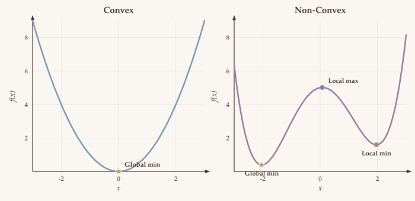
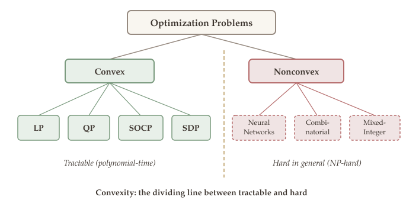

Optimization is the mathematical engine behind nearly every quantitative discipline. Whenever a statistician fits a model, a machine learning engineer trains a neural network, or a financial analyst constructs a portfolio, the core computational task is an optimization problem: find the best decision from a set of alternatives. What distinguishes a good practitioner from a great one is understanding *which* optimization problem is being solved, *what* algorithms are available, and *how* to certify that a solution is correct.

In this chapter we survey a collection of motivating examples drawn from statistics, machine learning, and finance. The goal is not yet to solve these problems but to see how naturally they arise and to appreciate the common mathematical structure they share. By the end you will have a clear map of the landscape of optimization and know where each topic in the course fits within it.

The overarching theme is that **convex optimization** occupies a sweet spot: it is rich enough to model a wide range of practical problems, yet structured enough to admit efficient, well-understood algorithms.

::: {.callout-tip}
## Companion Notebooks

Hands-on Python notebooks accompany this chapter. Click a badge to open in Google Colab.

- [](https://colab.research.google.com/github/ZhuoranYang/zhuoran-yale-teaching/blob/main/SDS431/notebooks/01a-svm-cvxpy-gradient-descent.ipynb) **SVM via CVXPY and Gradient Descent** --- comparing constrained and regularized formulations of support vector machines
:::

## Motivating Examples {#sec-motivating-examples}

Why study optimization? Because **every** statistical estimation problem involves optimization. We begin with the most fundamental example.

### Maximum Likelihood Estimation {#sec-mle}

::: {#exm-mle}
## Maximum Likelihood Estimation
Suppose $X_1, X_2, \ldots, X_n \stackrel{\text{iid}}{\sim} P_{\theta^*}$ (e.g., $\mathcal{N}(\theta^*, I_d)$).

We want to **estimate** $\theta^*$ based on data $\{X_i\}_{i=1}^n$.

The **MLE estimator** is defined as:

$$\widehat{\theta}_{\text{MLE}} = \arg\min_{\theta \in \Theta} \; -\sum_{i=1}^{n} \log P_\theta(X_i).$$ {#eq-mle}

From a statistics perspective: how accurate is $\widehat{\theta}_{\text{MLE}}$?

From an optimization perspective: how do we actually *compute* $\widehat{\theta}_{\text{MLE}}$?
:::

### Least-Squares Regression {#sec-least-squares}

::: {#exm-least-squares}
## Least-Squares Regression
**Model:**

$$y = X\beta^* + \varepsilon, \qquad \varepsilon \sim \mathcal{N}(0, I_n),$$ {#eq-linear-model}

where $y \in \mathbb{R}^{n \times 1}$, $X \in \mathbb{R}^{n \times d}$, $\beta^* \in \mathbb{R}^{d}$, $\varepsilon \in \mathbb{R}^{n \times 1}$. Here $n$ is the number of samples and $d$ is the dimension of the parameter.

To estimate the true parameter $\beta^*$, we compute the conditional log-likelihood. Since

$$P_\beta(y \mid X) \propto \exp\!\left(-\frac{\|y - X\beta\|_2^2}{2}\right),$$

the negative log-likelihood is:

$$\mathcal{L}(\beta) = -\log P_\beta(y \mid X) = \tfrac{1}{2}\|y - X\beta\|_2^2 + \text{Constant},$$

where the constant does not involve $\beta$. Recall $\|v\|_2^2 = \sum_{i=1}^{n} v_i^2$.
:::

::: {.callout-note appearance="simple"}
Therefore, **MLE** for the linear model is equivalent to **least-squares**:

$$\min_\beta \; \|y - X\beta\|_2^2.$$ {#eq-least-squares}
:::

### Variants of Regression {#sec-regression-variants}

Ordinary least-squares has a clean closed-form solution, but it breaks down in three common scenarios:

1. **Multicollinearity.** When features are highly correlated, $X^\top X$ is nearly singular and the OLS estimates become wildly unstable --- small perturbations in the data produce large swings in $\widehat{\beta}$.
2. **High dimensionality.** When the number of features $d$ exceeds the number of samples $n$, OLS is underdetermined: infinitely many $\beta$ achieve zero training loss, and OLS cannot distinguish signal from noise.
3. **Interpretability.** A practitioner with 500 features wants to know *which ones matter*. OLS gives a nonzero coefficient to every feature, offering no guidance.

Each of the following regression variants addresses one or more of these failures by modifying the optimization problem. Crucially, each modification leads to a *different class* of optimization problem, previewing the algorithmic landscape of this course.

::: {#def-least-squares-mle}
## Least-Squares (MLE)
$$\arg\min_{\beta \in \mathbb{R}^d} \; \|y - X\beta\|_2^2$$

Minimizes the $\ell_2$-error. This is a **convex optimization** problem.
:::

Least-squares is our baseline: it has the closed-form solution $\widehat{\beta} = (X^\top X)^{-1} X^\top y$ whenever $X^\top X$ is invertible. But when features are correlated or $d$ is large, we need to go further.

::: {#def-ridge-regression}
## Ridge Regression
$$\arg\min_{\beta \in \mathbb{R}^d} \; \|y - X\beta\|_2^2 + \lambda \|\beta\|_2^2$$

This is a **regularized least-squares** problem. It is **strongly convex**.
:::

Ridge regression directly attacks the multicollinearity problem: the $\ell_2$-penalty $\lambda \|\beta\|_2^2$ adds $\lambda I$ to $X^\top X$, making the system always invertible and the solution always unique. Geometrically, ridge shrinks all coefficients toward zero, trading a small increase in bias for a large decrease in variance. From an optimization perspective, the $\ell_2$-penalty makes the objective **strongly convex** --- a property that guarantees faster convergence rates for iterative algorithms, as we will see in [Gradient Descent](06-gradient-descent.qmd).

::: {#def-lasso}
## Lasso ($\ell_1$-Regularized Least-Squares)
$$\arg\min_{\beta \in \mathbb{R}^d} \; \|y - X\beta\|_2^2 + \lambda \|\beta\|_1, \qquad \|\beta\|_1 = \sum_{j=1}^{d} |\beta_j|.$$

This is a **convex** problem, specifically a **cone program**.
:::

The Lasso addresses the high-dimensionality and interpretability problems simultaneously. By replacing the $\ell_2$-penalty with an $\ell_1$-penalty, it encourages **sparsity**: many coefficients are driven to *exactly* zero, performing automatic feature selection. Why does $\ell_1$ produce zeros but $\ell_2$ does not? The geometry is the key: the $\ell_1$-ball is a diamond with corners on the coordinate axes, and the level sets of the loss function are far more likely to first touch the constraint boundary at a corner (where some coordinates are zero) than along a smooth face. The Lasso is convex but **non-smooth** --- the $|\beta_j|$ terms are not differentiable at zero --- which means gradient descent does not directly apply. Solving the Lasso efficiently requires **proximal gradient methods**, a topic we develop in detail later in the course.

```{=html}
<div class="figure-container">
  <div id="fig-regression-comparison"></div>
  <div class="figure-caption">Comparison of regression coefficients for OLS, Ridge, and Lasso on a problem with a sparse true parameter vector &beta;* = (3, &minus;1.5, 0, 0, 2). Lasso produces exact zeros for the irrelevant features, performing automatic feature selection.</div>
</div>
<script>
document.addEventListener('DOMContentLoaded', () => {
  const features = ['\u03B2\u2081', '\u03B2\u2082', '\u03B2\u2083', '\u03B2\u2084', '\u03B2\u2085'];
  const betaTrue = [3.0, -1.5, 0.0, 0.0, 2.0];
  const betaOLS = [3.05, -1.52, -0.06, 0.03, 1.97];
  const betaRidge = [2.58, -1.28, -0.05, 0.02, 1.67];
  const betaLasso = [2.72, -1.22, 0.0, 0.0, 1.70];

  const traces = [
    { x: features, y: betaTrue, type: 'bar', name: 'True \u03B2*',
      marker: {color: css('--fig-axis'), line: {width: 1, color: css('--fig-plot-bg')}}, opacity: 0.5 },
    { x: features, y: betaOLS, type: 'bar', name: 'OLS',
      marker: {color: css('--fig-region-stroke'), line: {width: 1, color: css('--fig-plot-bg')}} },
    { x: features, y: betaRidge, type: 'bar', name: 'Ridge (\u03BB=1)',
      marker: {color: css('--fig-contour'), line: {width: 1, color: css('--fig-plot-bg')}} },
    { x: features, y: betaLasso, type: 'bar', name: 'Lasso (\u03BB=5)',
      marker: {color: css('--fig-sage-stroke'), line: {width: 1, color: css('--fig-plot-bg')}} },
  ];
  const layout = themeLayout({
    xaxis: themeAxis('Coefficient', {type: 'category'}),
    yaxis: themeAxis('Value', {}),
    barmode: 'group',
    showlegend: true, legend: Object.assign({x: 0.6, y: 1}, legendStyle()),
    margin: {t: 20, b: 50, l: 55, r: 20},
  });
  Plotly.newPlot('fig-regression-comparison', traces, layout, plotlyConfig);
});
</script>
```

### Linear Programming ($\ell_1$/$\ell_\infty$-Minimization) {#sec-linear-programming}

::: {#exm-linf-regression}
## $\ell_\infty$-Regression
Given data points $(x_i, y_i)$ for $i \in [n] = \{1, 2, \ldots, n\}$, with
$y = \begin{pmatrix} y_1 \\ \vdots \\ y_n \end{pmatrix}$ and
$X = \begin{pmatrix} x_1^\top \\ x_2^\top \\ \vdots \\ x_n^\top \end{pmatrix}$,
the $\ell_\infty$-norm is $\|v\|_\infty = \max_i |v_i|$. Then:

$$\|y - X\beta\|_\infty = \max_i |y_i - x_i^\top \beta|.$$

The $\ell_\infty$-regression problem becomes:

$$\arg\min_\beta \; \left\{\max_i |y_i - x_i^\top \beta|\right\}.$$ {#eq-linf-regression}
:::

::: {#exm-l1-regression}
## $\ell_1$-Regression
The $\ell_1$-norm is $\|v\|_1 = \sum_{i=1}^{n} |v_i|$. The $\ell_1$-regression problem is:

$$\arg\min_{\beta \in \mathbb{R}^d} \; \|y - X\beta\|_1 = \arg\min_{\beta \in \mathbb{R}^d} \; \sum_{i=1}^{n} |y_i - x_i^\top \beta|.$$ {#eq-l1-regression}

Both $\ell_1$- and $\ell_\infty$-regression can be reformulated as **linear programs**.
:::

```{=html}
<div class="figure-container">
  <div id="fig-regression-norms"></div>
  <div class="figure-caption">The &#x2113;<sub>1</sub>, &#x2113;<sub>2</sub>, and &#x2113;<sub>&infin;</sub> unit balls in 2D. The diamond shape of the &#x2113;<sub>1</sub>-ball explains why Lasso produces sparse solutions: its corners lie on the coordinate axes, making it likely that the optimal point has zero entries.</div>
</div>
<script>
document.addEventListener('DOMContentLoaded', () => {
  const N = 200;
  const l2x = [], l2y = [];
  for (let i = 0; i <= N; i++) {
    const t = 2 * Math.PI * i / N;
    l2x.push(Math.cos(t));
    l2y.push(Math.sin(t));
  }
  const l1x = [1, 0, -1, 0, 1];
  const l1y = [0, 1, 0, -1, 0];
  const linfx = [1, 1, -1, -1, 1];
  const linfy = [1, -1, -1, 1, 1];

  const traces = [
    { x: l1x, y: l1y, fill: 'toself', fillcolor: css('--fig-lavender'), line: {color: css('--fig-lavender-stroke'), width: 2.5}, name: '\u2113\u2081 ball (diamond)', mode: 'lines' },
    { x: l2x, y: l2y, fill: 'toself', fillcolor: css('--fig-sage'), line: {color: css('--fig-sage-stroke'), width: 2.5}, name: '\u2113\u2082 ball (circle)', mode: 'lines' },
    { x: linfx, y: linfy, fill: 'toself', fillcolor: css('--fig-region'), line: {color: css('--fig-region-stroke'), width: 2.5}, name: '\u2113\u221E ball (square)', mode: 'lines' },
  ];
  const layout = themeLayout({
    xaxis: themeAxis('x\u2081', {range: [-1.5, 1.5], zeroline: true, scaleanchor: 'y'}),
    yaxis: themeAxis('x\u2082', {range: [-1.5, 1.5], zeroline: true}),
    showlegend: true, legend: Object.assign({x: 0.55, y: 1}, legendStyle()),
    margin: {t: 20, b: 50, l: 55, r: 20},
  });
  Plotly.newPlot('fig-regression-norms', traces, layout, plotlyConfig);
});
</script>
```

### Sparse Regression ($\ell_0$-Regularization) {#sec-sparse-regression}

::: {#exm-sparse-regression}
## $\ell_0$-Regularized Least-Squares / Sparse Regression
The $\ell_0$-"norm" counts nonzero entries: $\|v\|_0 = \#\{i : v_i \neq 0\}$.

The $\ell_0$-regularized least-squares problem is:

$$\arg\min_{\beta \in \mathbb{R}^d} \; \|y - X\beta\|_2^2 + \lambda \|\beta\|_0.$$ {#eq-l0-regularized}

This problem is **NP-hard**. We need to relax or approximate it. Two common relaxations are:

- **Constrained form:** $\displaystyle\arg\min_{\beta \in \mathbb{R}^d} \|y - X\beta\|_2 \quad \text{s.t.} \quad \|\beta\|_0 \leq k$, where $k$ is an integer.
- **Inverse form:** $\displaystyle\arg\min_{\beta \in \mathbb{R}^d} \|\beta\|_0 \quad \text{s.t.} \quad \|y - X\beta\|_2 \leq \varepsilon$.
:::

### Empirical Risk Minimization {#sec-erm}

All of the regression variants above share a common pattern: choose a loss function, optionally add a regularizer, and minimize the resulting objective over the data. The Empirical Risk Minimization (ERM) framework captures this pattern in full generality, providing a single template that encompasses least-squares, ridge, Lasso, and many other estimators.

::: {#def-erm}
## Empirical Risk Minimization Framework
Given data points $\{(x_i, y_i)\}_{i \in [n]}$, define:

- $h_\theta : \mathbb{R}^d \to \mathbb{R}$ --- hypothesis parameterized by $\theta \in \Theta$ (e.g., $h_\theta(x) = x^\top \theta$).
- $\ell : \mathbb{R} \times \mathbb{R} \to \mathbb{R}$ --- loss function (e.g., $\ell(u, v) = (u - v)^2$).
- $R : \Theta \to \mathbb{R}$ --- regularizer.

**Regularized ERM:**

$$\min_{\theta \in \Theta} \; \left\{\sum_{i=1}^{n} \ell\!\left(h_\theta(x_i),\, y_i\right) + \lambda \cdot R(\theta)\right\}.$$ {#eq-regularized-erm}

**Constrained ERM:**

$$\min_{\theta} \; \sum_{i=1}^{n} \ell\!\left(h_\theta(x_i),\, y_i\right) \quad \text{s.t.} \quad R(\theta) \leq \lambda.$$ {#eq-constrained-erm}
:::

::: {.callout-tip}
## Remark
All the regression variants above --- least-squares, ridge, Lasso, $\ell_1$/$\ell_\infty$-regression --- are special cases of the ERM framework with particular choices of loss and regularizer.
:::

### LLM Pretraining as MLE {#sec-llm-pretraining}

::: {#exm-llm-pretraining}
## Maximum Likelihood Estimation for Language Models

Let $\mathbf{x}$ be a document corpus, $\mathbf{x} = (x_1, x_2, x_3, \ldots, x_T)$. An **autoregressive language model** predicts $x_t$ given $x_1, \ldots, x_{t-1}$ using a neural network $f_\theta(\,\cdot \mid x_{1:t-1})$.

The MLE objective is:

$$\min_\theta \; -\sum_{t=1}^{T} \log f_\theta(x_t \mid x_{1:t-1}).$$

When $f_\theta$ is a **transformer**, this is exactly the **pretraining of LLMs** (Large Language Models).
:::

::: {.callout-tip}
## Remark: How Language Models Work

A language model takes previous words (context) as input and outputs a probability distribution over the next word/token. For example:

- Input context: "The boy went to the"
- Output probabilities: Cafe (0.1), Hospital (0.05), **Playground (0.4)**, Park (0.15), School (0.3)

The probability $P(\text{Playground} \mid \text{The boy went to the}) = 0.4$.
:::

### Markowitz Portfolio Selection {#sec-portfolio}

::: {#exm-portfolio}
## Markowitz's Portfolio Selection Model

Suppose we have 3 assets. Their returns are random variables $X = (X_1, X_2, X_3)^\top$ with:

$$\mathbb{E}[X] = \mu = \begin{pmatrix} \mu_1 \\ \mu_2 \\ \mu_3 \end{pmatrix}, \quad \text{Cov}(X) = \Sigma = \begin{pmatrix} \Sigma_{11} & \Sigma_{12} & \Sigma_{13} \\ - & - & - \\ - & \cdots & \Sigma_{33}\end{pmatrix}.$$

Let $w \in \mathbb{R}^3$ be a weight vector specifying how we invest in these three assets, with $\sum_{i=1}^{3} w_i = 1$ and $w_i \geq 0$. Our portfolio return is:

$$Y_w = \sum_{i=1}^{3} w_i \cdot X_i, \quad \mathbb{E}[Y_w] = w^\top \mu, \quad \text{Var}(Y_w) = w^\top \Sigma\, w.$$

**Goal:** Choose the best $w$ that minimizes $\text{Var}(Y_w)$ while achieving a desired return $R$:

$$\begin{aligned}
\min_{w} \quad & w^\top \Sigma\, w \\
\text{s.t.} \quad & w^\top \mu \geq R \\
& \textstyle\sum w_i = 1 \\
& w_i \geq 0, \quad i = 1, 2, 3.
\end{aligned}$$

This is a **constrained quadratic optimization** problem.
:::

```{=html}
<div class="figure-container">
  <div id="fig-portfolio"></div>
  <div class="figure-caption">Markowitz efficient frontier. Each point represents a portfolio; the frontier (gold curve) shows the minimum variance achievable for each level of expected return. Diversification allows portfolios that are less risky than any individual asset.</div>
</div>
<script>
document.addEventListener('DOMContentLoaded', () => {
  const mu = [0.08, 0.12, 0.15];
  const Sigma = [[0.04, 0.006, 0.002], [0.006, 0.09, 0.018], [0.002, 0.018, 0.16]];
  function portfolioVar(w) {
    let v = 0;
    for (let i = 0; i < 3; i++) for (let j = 0; j < 3; j++) v += w[i] * w[j] * Sigma[i][j];
    return v;
  }
  function portfolioRet(w) { return w[0]*mu[0] + w[1]*mu[1] + w[2]*mu[2]; }

  const allRet = [], allStd = [];
  const N = 80;
  for (let i = 0; i <= N; i++) {
    for (let j = 0; j <= N - i; j++) {
      const k = N - i - j;
      const w = [i/N, j/N, k/N];
      allRet.push(portfolioRet(w));
      allStd.push(Math.sqrt(portfolioVar(w)));
    }
  }

  const retLevels = [];
  const frontierStd = [];
  for (let r = 0.08; r <= 0.151; r += 0.002) {
    retLevels.push(r);
    let bestVar = Infinity;
    for (let i = 0; i <= N; i++) {
      for (let j = 0; j <= N - i; j++) {
        const k = N - i - j;
        const w = [i/N, j/N, k/N];
        const ret = portfolioRet(w);
        if (ret >= r - 0.001) {
          const v = portfolioVar(w);
          if (v < bestVar) bestVar = v;
        }
      }
    }
    frontierStd.push(Math.sqrt(bestVar));
  }

  const traces = [
    { x: allStd, y: allRet, mode: 'markers', marker: {color: css('--fig-axis'), size: 3, opacity: 0.3}, name: 'All portfolios', hoverinfo: 'skip' },
    { x: frontierStd, y: retLevels, mode: 'lines+markers', line: {color: css('--fig-optimal'), width: 3}, marker: {color: css('--fig-optimal'), size: 6}, name: 'Efficient frontier' },
    { x: [Math.sqrt(Sigma[0][0])], y: [mu[0]], mode: 'markers+text', marker: {color: css('--fig-sage-stroke'), size: 12, symbol: 'diamond'}, text: ['Asset 1'], textposition: 'top right', name: 'Asset 1', textfont: {size: 11, color: css('--fig-text')} },
    { x: [Math.sqrt(Sigma[1][1])], y: [mu[1]], mode: 'markers+text', marker: {color: css('--fig-line2'), size: 12, symbol: 'diamond'}, text: ['Asset 2'], textposition: 'top right', name: 'Asset 2', textfont: {size: 11, color: css('--fig-text')} },
    { x: [Math.sqrt(Sigma[2][2])], y: [mu[2]], mode: 'markers+text', marker: {color: css('--fig-lavender-stroke'), size: 12, symbol: 'diamond'}, text: ['Asset 3'], textposition: 'top right', name: 'Asset 3', textfont: {size: 11, color: css('--fig-text')} },
  ];
  const layout = themeLayout({
    xaxis: themeAxis('Standard Deviation (Risk)', {range: [0, 0.45]}),
    yaxis: themeAxis('Expected Return', {range: [0.06, 0.17], tickformat: '.0%'}),
    showlegend: true, legend: Object.assign({x: 0.55, y: 0.3}, legendStyle()),
    margin: {t: 20, b: 55, l: 65, r: 20},
  });
  Plotly.newPlot('fig-portfolio', traces, layout, plotlyConfig);
});
</script>
```

## General Form of Optimization {#sec-general-optimization}

We have seen that statistical estimation, machine learning, and finance all lead to optimization problems with shared mathematical structure. The general form of an optimization problem is:

$$\begin{aligned}
\min_{x} \quad & f(x) & & \text{(objective function)} \\
\text{s.t.} \quad & g_i(x) \leq b_i, & & i = 1, 2, \ldots, m \\
& h_j(x) = 0, & & j = 1, 2, \ldots, \ell \\
& x \in \mathcal{X}
\end{aligned}$$

In a more abstract form: $\min_x \; f(x) \quad \text{s.t.} \quad x \in \text{Constraint}.$

But optimization in general is NP-hard --- there is no hope of efficiently solving arbitrary problems. The key insight is that a large and practically important class of problems, called **convex optimization** problems, can always be solved efficiently.

## Convex Optimization {#sec-convex-optimization}

::: {#def-convex-optimization}
## General Form of Convex Optimization
A convex optimization problem takes the general form:

$$\begin{aligned}
\min_{x} \quad & f(x) && \text{(convex objective function)} \\
\text{s.t.} \quad & g_i(x) \leq b_i, && i = 1, 2, \ldots, m \\
& h_j(x) = 0, && j = 1, 2, \ldots, \ell \\
& x \in \mathcal{X}
\end{aligned}$$ {#eq-convex-optimization}

where $f$ is a **convex objective function** and the constraints $g_i(x) \leq b_i$, $h_j(x) = 0$ define a **convex feasible set**.
:::

A convex optimization problem is one where both the objective function and the feasible region are convex. This structure is powerful because it guarantees that any local minimum is automatically a global minimum, which makes the problem tractable for efficient algorithms.

::: {.callout-tip}
## Remark: Why Convexity Matters
A key geometric property of convex sets: for any two points $x, y$ in a convex set, the line segment connecting them lies entirely within the set. That is, $\lambda x + (1-\lambda)y$ is in the set for all $\lambda \in [0,1]$.

For convex functions: **every local minimum is a global minimum**. This makes convex optimization problems tractable (solvable in polynomial time), while general optimization is typically NP-hard.
:::

{#fig-optimization-landscape}

{#fig-convex-vs-nonconvex}

```{=html}
<div class="figure-container">
  <div id="fig-saddle-point-3d"></div>
  <div class="figure-caption">Figure 1.3: A saddle point of f(x,y) = x² − y² at the origin. Along the x-direction (blue curve), the surface curves upward — the origin is a local minimum. Along the y-direction (red curve), the surface curves downward — the origin is a local maximum. The Hessian at the origin has one positive and one negative eigenvalue.</div>
</div>
<script>
document.addEventListener('DOMContentLoaded', () => {
  const N = 60;
  const vals = [];
  for (let i = 0; i < N; i++) vals.push(-2 + 4 * i / (N - 1));

  // Saddle surface: f(x,y) = x^2 - y^2
  const zSaddle = [];
  for (let j = 0; j < N; j++) {
    const row = [];
    for (let i = 0; i < N; i++) {
      row.push(vals[i]*vals[i] - vals[j]*vals[j]);
    }
    zSaddle.push(row);
  }

  // Cross-section along x-axis (y=0): f(x,0) = x^2 (parabola up)
  const xSlice = [], zXslice = [], yZeros = [];
  for (let x = -2; x <= 2; x += 0.05) {
    xSlice.push(x); zXslice.push(x*x); yZeros.push(0);
  }

  // Cross-section along y-axis (x=0): f(0,y) = -y^2 (parabola down)
  const ySlice = [], zYslice = [], xZeros = [];
  for (let y = -2; y <= 2; y += 0.05) {
    ySlice.push(y); zYslice.push(-y*y); xZeros.push(0);
  }

  const traces = [
    {
      type: 'surface', x: vals, y: vals, z: zSaddle,
      colorscale: [[0, '#907ea0'], [0.5, '#e0d9d1'], [1, '#b8995e']],
      showscale: false, opacity: 0.75, name: 'f(x,y) = x² − y²',
      contours: {x: {show: true, color: '#e0d9d1', width: 1}, y: {show: true, color: '#e0d9d1', width: 1}},
    },
    {
      type: 'scatter3d', x: xSlice, y: yZeros, z: zXslice,
      mode: 'lines', line: {color: '#7b97ad', width: 6},
      name: 'Along x (local min)',
    },
    {
      type: 'scatter3d', x: xZeros, y: ySlice, z: zYslice,
      mode: 'lines', line: {color: '#b56b6b', width: 6},
      name: 'Along y (local max)',
    },
    {
      type: 'scatter3d', x: [0], y: [0], z: [0],
      mode: 'markers', marker: {color: '#b8995e', size: 7, symbol: 'diamond'},
      name: 'Saddle point',
    },
  ];

  const layout = themeLayout({
    scene: {
      xaxis: {title: 'x', backgroundcolor: css('--fig-plot-bg'), gridcolor: css('--fig-grid'), color: css('--fig-axis')},
      yaxis: {title: 'y', backgroundcolor: css('--fig-plot-bg'), gridcolor: css('--fig-grid'), color: css('--fig-axis')},
      zaxis: {title: 'f(x,y)', backgroundcolor: css('--fig-plot-bg'), gridcolor: css('--fig-grid'), color: css('--fig-axis')},
      camera: {eye: {x: 1.8, y: 1.2, z: 0.9}},
    },
    showlegend: true,
    legend: Object.assign({x: 0.02, y: 0.95}, legendStyle()),
    margin: {t: 10, b: 10, l: 10, r: 10},
  });

  Plotly.newPlot('fig-saddle-point-3d', traces, layout, plotlyConfig);
});
</script>
```

::: {.callout-tip}
## Remark: Saddle Points in High Dimensions

In high-dimensional non-convex optimization (e.g., training deep neural networks), most critical points are **saddle points**, not true local minima or maxima. A saddle point is a critical point where the Hessian has both positive and negative eigenvalues — the function curves upward in some directions and downward in others, as shown in the 3D figure above. In $d$ dimensions, a random critical point is exponentially more likely to be a saddle point than a local minimum, since each eigenvalue of the Hessian is independently likely to be positive or negative.
:::

{#fig-optimization-taxonomy}

## Course Overview {#sec-course-overview}

::: {.callout-note appearance="simple"}
**Focus:** We will mainly focus on **convex optimization**.

- Optimization is generally **hard** (NP-hard).
- But we can always **solve** convex optimization (in polynomial time).
:::

What do we mean by "hard" or "solve"? This is formalized through run-time complexity and oracle computation models. The course is organized around three main questions:

::: {.callout-note appearance="simple"}
**Three main questions:**

1. **What optimization problems?**
2. **What algorithms?**
3. **How do we know we have solved the problem?**
:::

### 1. What Optimization Problems?

- We will cover **theory & algorithms of convex optimization**.
  - Why? This is a class of **tractable** problems that can be solved in a principled fashion.
- We will also cover some **nonconvex optimization** problems:
  - With important applications in **deep learning & AI**
  - Interesting phenomena not present in the convex world

### 2. What Algorithms?

a. **Unconstrained optimization**
   - **First-order methods** (gradient descent, stochastic gradient descent, projected gradient descent)
   - Second-order methods
b. **Constrained optimization**
   - Linear programming $\rightarrow$ Simplex method, Ellipsoid method
   - General constrained problems $\rightarrow$ Interior point methods

### 3. How Do We Know We Have Solved the Problem?

- **Duality**, **Lagrange multipliers**, **KKT conditions**

```{=html}
<div class="figure-container">
  <div id="fig-optimization-landscape-plotly"></div>
  <div class="figure-caption">Figure 0.3: The landscape of optimization problems covered in this course, from linear programs to general convex optimization and beyond.</div>
</div>
<script>
document.addEventListener('DOMContentLoaded', () => {
  const figFontHeading = '"Crimson Pro", Georgia, serif';

  // ---- Figure: Optimization Landscape ----
  const traces = [
    { x: [0, 10, 10, 0, 0], y: [0, 0, 7, 7, 0], fill: 'toself',
      fillcolor: css('--fig-lavender'), line: {color: css('--fig-lavender-stroke'), width: 2.5},
      mode: 'lines', hoverinfo: 'none' },
    { x: [0.5, 9.5, 9.5, 0.5, 0.5], y: [0.3, 0.3, 6, 6, 0.3], fill: 'toself',
      fillcolor: css('--fig-sage'), line: {color: css('--fig-sage-stroke'), width: 2.5},
      mode: 'lines', hoverinfo: 'none' },
    { x: [1, 6, 6, 1, 1], y: [0.6, 0.6, 5.2, 5.2, 0.6], fill: 'toself',
      fillcolor: css('--fig-region'), line: {color: css('--fig-region-stroke'), width: 2},
      mode: 'lines', hoverinfo: 'none' },
    { x: [1.5, 5.5, 5.5, 1.5, 1.5], y: [0.9, 0.9, 4.2, 4.2, 0.9], fill: 'toself',
      fillcolor: css('--highlight-bg'), line: {color: css('--highlight-border'), width: 2.5},
      mode: 'lines', hoverinfo: 'none' },
  ];
  const layout = themeLayout({
    xaxis: themeAxis('', {showgrid: false, zeroline: false, showticklabels: false, range: [-0.5, 10.5]}),
    yaxis: themeAxis('', {showgrid: false, zeroline: false, showticklabels: false, range: [-0.5, 7.5], scaleanchor: 'x'}),
    showlegend: false,
    margin: {t: 15, b: 15, l: 15, r: 15},
    annotations: [
      {x: 3.5, y: 2.55, text: '<b>LP</b><br>Simplex', showarrow: false, font: {family: figFontHeading, size: 14, color: css('--fig-text')}, align: 'center'},
      {x: 3.5, y: 4.7, text: '<b>QP / Cone</b>', showarrow: false, font: {family: figFontHeading, size: 13, color: css('--fig-text')}},
      {x: 8, y: 3.2, text: '<b>Convex</b><br>GD, SGD<br>Ellipsoid, Interior Point', showarrow: false, font: {family: figFontHeading, size: 13, color: css('--fig-text')}, align: 'center'},
      {x: 5, y: 6.6, text: '<b>General Optimization</b> (NP-hard)', showarrow: false, font: {family: figFontHeading, size: 13, color: css('--fig-text')}, align: 'center'},
    ]
  });
  Plotly.newPlot('fig-optimization-landscape-plotly', traces, layout, plotlyConfig);
});
</script>
```

## Summary {.unnumbered}

- **Optimization as a unifying framework.** Many statistical and machine learning problems --- maximum likelihood estimation, OLS, Ridge, Lasso regression, LLM pretraining, and portfolio optimization --- reduce to minimizing an objective $\min_{x} f(x)$ subject to constraints, placing them under the umbrella of mathematical optimization.
- **Empirical risk minimization (ERM).** Supervised learning seeks parameters $\theta$ that minimize the empirical risk $\frac{1}{n}\sum_{i=1}^{n}\ell(h_\theta(x_i), y_i)$; the choice of loss $\ell$ and hypothesis class $h_\theta$ determines the optimization landscape.
- **Key problem classes.** Linear programs (LP), quadratic programs (QP), and general convex programs each carry different structural guarantees; recognizing the class determines which algorithms and solvers apply.
- **Convex vs. nonconvex problems.** Convex problems (e.g., OLS, Ridge, Lasso) admit global solutions efficiently because every local minimum is a global minimum. Nonconvex problems (e.g., neural network training) lack this guarantee and require careful algorithm design.
- **Role of regularization.** Adding a penalty term --- $\|\theta\|_2^2$ for Ridge or $\|\theta\|_1$ for Lasso --- controls model complexity and induces desirable structure such as sparsity.
- **Course roadmap.** The course progresses from convex analysis and duality theory, through first- and second-order algorithms, to LP-specific methods (simplex, interior point) and modern applications (diffusion models, transformers).
