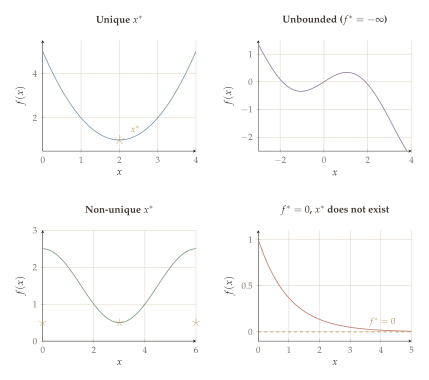
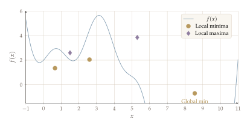
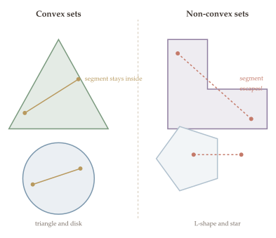
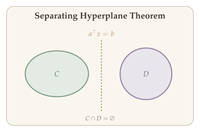
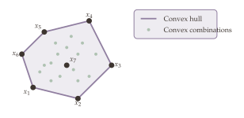

Before we can solve optimization problems, we need to agree on what a "solution" actually means. Does a minimum always exist? If it does, is it the best we can do globally or only locally? These questions are not mere formalities --- they determine which algorithms are trustworthy and which guarantees we can rely on. In this chapter we pin down the fundamental vocabulary of optimization: optimal solutions, optimal values, and the critical distinction between local and global minima.

With these concepts in hand, we turn to the geometric foundation of tractable optimization: **convex sets**. The feasible region of every well-behaved optimization problem --- from linear programs to semidefinite programs --- is built from convex sets. Understanding convexity is essential because it is the single property that makes an optimization problem "tractable": on convex sets, local information reliably points toward global solutions. We develop the theory of convex sets here and will build on it throughout the rest of the course.

## What Will Be Covered {#sec-convex-sets-overview}

- Basics of optimization: the oracle computation model, runtime and accuracy trade-offs
- Solution concepts: optimal solutions, optimal values, local and global minima
- Topology: interior, boundary, compact sets, and the Weierstrass extreme value theorem
- Convex sets: definitions, examples, and operations that preserve convexity
- Convex combinations and convex hulls

## Basics of Optimization {#sec-basics-of-optimization}

The general optimization problem is:

$$\min_{x} \; f(x) \quad \text{subject to} \quad g_i(x) \leq 0, \; i=1,\ldots,m, \quad h_i(x)=0, \; i=1,\ldots,k, \quad x \in \mathcal{X} \subseteq \mathbb{R}^n.$$

Here $f$ is the **objective function**, $x$ is the **decision variable**, $g_i$ are **inequality constraint functions**, $h_i$ are **equality constraint functions**, and $\mathcal{X}$ is the **constraint set**.

We can write this more abstractly as:

$$(\text{OPT}) \quad \min_{x \in \mathbb{R}^n} f(x) \quad \text{subject to} \quad x \in \Omega,$$

where $\Omega = \bigcap_{i=1}^{m}\{x : g_i(x) \leq 0\} \cap \bigcap_{i=1}^{k}\{x : h_i(x)=0\} \cap \mathcal{X}$ is the **feasible set**.

::: {.callout-tip}
## Remark: Minimization vs. Maximization

$\max_{x \in \Omega} f(x) = -\min_{x \in \Omega}\{-f(x)\}$. Thus we can focus on either minimization or maximization without loss of generality.
:::

Every optimization algorithm takes an input (problem data) and produces an approximate solution $\widehat{x}$. To compare algorithms, we need to measure their performance along two axes:

::: {.callout-important}
## Q1: Accuracy

How close is $\widehat{x}$ to the true optimizer $x^*$? We measure accuracy by either

$$
\|\widehat{x} - x^*\| \leq \varepsilon \qquad \text{or} \qquad f(\widehat{x}) - f(x^*) \leq \varepsilon.
$$

The first is **distance to the optimizer**; the second is **suboptimality gap** (how far the objective value is from optimal).
:::

::: {.callout-important}
## Q2: Computational Cost

How many resources does the algorithm consume to achieve $\varepsilon$-accuracy? This includes both **time** (number of operations) and **memory** (storage for iterates, gradients, etc.).
:::

These two quantities are fundamentally **coupled**: demanding higher accuracy ($\varepsilon \to 0$) requires more computation. The central question in optimization theory is therefore:

> **Given accuracy $\varepsilon$, what is the minimum computational cost to achieve it?**

This is the question that complexity theory for optimization aims to answer.

### Oracle Computation Model {#sec-oracle-model}

Counting individual arithmetic operations ($+, -, \times, /$) is too fine-grained to be useful for comparing optimization algorithms. A gradient descent step and a Newton step both involve arithmetic, but they differ fundamentally in what **information** they use about the objective function. The right abstraction is to count the number of **information queries** an algorithm makes.

We model an iterative optimization algorithm as a dialogue between an **optimizer** and an **oracle**. At each iteration $t$, the optimizer queries the oracle at a point $x_t$ and receives information about $f$ at that point. Different oracle models capture different levels of information:

::: {.callout-note appearance="simple"}
- **Zeroth-order oracle** $\mathcal{O}_0(x)$: returns $f(x)$ (function value only)
- **First-order oracle** $\mathcal{O}_1(x)$: returns $f(x)$ and $\nabla f(x)$ (value + gradient)
- **Second-order oracle** $\mathcal{O}_2(x)$: returns $f(x)$, $\nabla f(x)$, and $\nabla^2 f(x)$ (value + gradient + Hessian)
- **Stochastic gradient oracle** $\text{SG}(x)$: returns a random vector $g$ with $\mathbb{E}[g]=\nabla f(x)$ and $\text{cov}(g) \preceq \sigma^2 I$
:::

::: {#def-oracle-complexity}
## Oracle Complexity (Iteration Complexity)

The **oracle complexity** of an algorithm is the number of oracle calls required to find an $\varepsilon$-accurate solution. This is also called the **iteration complexity**, since each iteration typically makes one oracle call.
:::

This abstraction is powerful because it separates the **algorithmic strategy** (how to choose the next query point $x_{t+1}$ given past information) from the **per-query cost** (how expensive it is to evaluate $\nabla f$). The total runtime is then:

$$
\text{total cost} \;=\; \underbrace{\text{(number of iterations)}}_{\text{oracle complexity}} \;\times\; \underbrace{\text{(cost per oracle call)}}_{\text{problem-dependent}}.
$$

For example, **gradient descent** uses a first-order oracle: at each iteration, query $\nabla f(x_t)$ and update $x_{t+1} = x_t - \alpha_t \nabla f(x_t)$. The oracle complexity (how many iterations to reach $\varepsilon$-accuracy) depends only on properties of $f$ like smoothness and strong convexity --- not on how $\nabla f$ is computed. This separation lets us analyze algorithms in a unified way across different problem domains.

Throughout this course, we characterize algorithm performance by: (a) **asymptotic growth** of oracle complexity as a function of problem dimension $n$ and accuracy $\varepsilon$, and (b) **worst-case** guarantees over a function class.

## Solution Concepts in Optimization {#sec-solution-concepts}

### Optimal Solution and Optimal Value {#sec-optimal-solution}

::: {#def-optimal-solution}
## Optimal Solution

An **optimal solution** $x^*$ is defined as $\operatorname{argmin} f(x)$ subject to $x \in \Omega$. Also called the "solution" or "global solution". $x^*$ is the point in $\Omega$ that minimizes $f$:

$$f(x^*) \leq f(x) \quad \forall \, x \in \Omega.$$

Note:

- $x^*$ may not exist.
- $x^*$ may not be unique.
:::

In words, an optimal solution is a feasible point that achieves the smallest possible objective value. The two caveats -- non-existence and non-uniqueness -- are important to keep in mind throughout optimization theory.

::: {#def-optimal-value}
## Optimal Value

The **optimal value** $f^*$ is defined as:

$$f^* = \inf \{y \in \mathbb{R} : \exists \, x \in \Omega \;\text{s.t.}\; y = f(x)\}.$$

$f^*$ is the largest number satisfying $f^* \leq f(x)$ for all $x \in \Omega$.

- $f^*$ may not exist (unbounded).
- It is possible that $f^*$ exists while $x^*$ does not.
:::

The optimal value captures the "best achievable cost" over the feasible set. Unlike the optimal solution, $f^*$ is always well-defined (possibly $\pm\infty$), so it serves as a useful benchmark even when no minimizer exists.

::: {#exm-various-cases}
## Various Cases

These four scenarios illustrate the different things that can go wrong (or go right) when we look for the minimum of a function over a feasible set.

1. **$x^*$ exists and is unique.** Consider $f(x) = (x - 3)^2$ on $\Omega = [0, 5]$. The function is continuous and strictly convex, and its unique minimizer $x^* = 3$ lies in the interior of $\Omega$. This is the "best case" for optimization: the solution exists, is unique, and algorithms can certify they have found it.

2. **$x^*$ does not exist, $f^* = -\infty$.** Consider $f(x) = -x$ on $\Omega = [0, +\infty)$. As $x \to +\infty$, $f(x) = -x \to -\infty$, so the problem is **unbounded below**. No finite minimizer exists because we can always find a feasible point with a smaller objective value. Unboundedness signals a modeling error -- the constraints are too loose.

3. **$x^*$ exists but is not unique.** Consider $f(x) = \cos(x)$ on $\Omega = [-4\pi, 4\pi]$. The minimum value $f^* = -1$ is attained at $x = -3\pi, -\pi, \pi, 3\pi$, giving four distinct minimizers. Non-uniqueness is common in practice, especially for symmetric or periodic objectives. In such cases, algorithms may converge to different minimizers depending on initialization.

4. **$f^*$ exists but $x^*$ does not.** Consider $f(x) = e^{-x}$ on $\Omega = \mathbb{R}$. As $x \to +\infty$, $f(x) \to 0$, so $f^* = \inf_{x \in \mathbb{R}} e^{-x} = 0$. But there is no finite $x^*$ at which $f(x^*) = 0$ -- the infimum is never attained. This pathology arises because $\Omega$ is unbounded: any minimizing sequence $x_k \to +\infty$ "escapes" the feasible set. The Weierstrass theorem (below) rules out exactly this scenario by requiring compactness.
:::

{#fig-solution-cases}

::: {.callout-tip}
## Remark: Guarantee of Existence
An important case where $x^*$ (and $f^*$) are guaranteed to exist: when $f$ is **continuous** and $\Omega$ is **compact** (closed and bounded). This is the **Weierstrass Theorem**.
:::

### Local and Global Minima {#sec-local-global}

Even when an optimal solution exists, a practical algorithm typically has access only to local information -- the function value and gradient at the current iterate. This raises a fundamental concern: the algorithm may find a point that looks optimal "nearby" but is far from the true global optimum. The following definitions make the distinction between local and global optimality precise.

::: {#def-local-global-minima}
## Local and Global Minima

Consider the optimization problem $\min_x f(x)$ subject to $x \in \Omega$. A point $\bar{x}$ is said to be a:

- **Local minimum** if $\bar{x} \in \Omega$ and there exists $\varepsilon > 0$ such that
  $$f(\bar{x}) \leq f(x) \quad \forall \, x \in B(\bar{x}, \varepsilon) \cap \Omega,$$
  where $B(\bar{x}, \varepsilon) = \{y : \|y - \bar{x}\|_2 \leq \varepsilon\}$.
- **Strict local minimum** if $\bar{x} \in \Omega$ and there exists $\varepsilon > 0$ such that
  $$f(\bar{x}) < f(x) \quad \forall \, x \in B(\bar{x}, \varepsilon) \cap \Omega, \; x \neq \bar{x}.$$
- **Global minimum** if $\bar{x} \in \Omega$ and $f(\bar{x}) \leq f(x)$ for all $x \in \Omega$.
- **Strict global minimum** if $\bar{x} \in \Omega$ and $f(\bar{x}) < f(x)$ for all $x \in \Omega$, $x \neq \bar{x}$.
:::

Intuitively, a local minimum is "the best point in its neighborhood," while a global minimum is "the best point overall." The distinction matters greatly: most algorithms can only guarantee finding local minima, so a central question in optimization is when local minima are also global.

::: {.callout-note appearance="simple"}
The hierarchy of minima:

- Strict local (global) minima $\subseteq$ Local (global) minima
- (Strict) global minima $\subseteq$ (Strict) local minima
:::

::: {.callout-tip}
## Remarks on Local Minima

1. $\bar{x}$ is a local minimum if we can find a neighborhood $B(\bar{x}, \varepsilon)$ such that $f(\bar{x})$ is the minimum value within $B(\bar{x}, \varepsilon)$.
2. A strict local (global) minimum is also a local (global) minimum.
3. A global minimum is also a local minimum.
4. The definition of local minimum uses the $\ell_2$-ball $B(\bar{x}, \varepsilon) = \{y : \|y - \bar{x}\|_2 \leq \varepsilon\}$, but we can use any $\ell_p$-norm because of the **equivalence of $\ell_p$-norms** in $\mathbb{R}^n$.
:::

{#fig-local-global}

### Compact Sets and the Weierstrass Theorem {#sec-compact-sets}

To state the Weierstrass theorem -- our first major existence result for optimization -- we need a few topological concepts. The notions of interior, boundary, and compactness tell us about the "shape" of the feasible set and whether minimizing sequences can escape or converge to points outside it.

::: {#def-interior}
## Interior

For $S \subseteq \mathbb{R}^n$, $x$ is in the **interior** of $S$ if there exists $\varepsilon > 0$ such that $B(x, \varepsilon) \subseteq S$.
:::

An interior point has "room to move" in every direction without leaving the set. This matters in optimization because at an interior point, we can explore small perturbations freely; at a boundary point, some directions may be blocked by constraints.

::: {#def-boundary}
## Boundary

A point $x \in \mathbb{R}^n$ is on the **boundary** of $S$ (denoted $\partial S$) if for all $\varepsilon > 0$, $B(x, \varepsilon)$ contains points in $S$ and points not in $S$. Note that $x$ itself need not belong to $S$.
:::

A boundary point is one that sits "on the edge" of the set: no matter how small a ball you draw around it, the ball always straddles the inside and outside of $S$.

::: {#exm-boundary}
## Boundary Example

$S = \{x \mid 0 < x \leq 1\}$. Then $\partial S = \{0, 1\}$.
:::

The distinction between open and closed sets matters because closed sets "contain their boundary," which is exactly the property needed to trap minimizing sequences inside the feasible region.

::: {#def-closed-open-set}
## Closed Set, Open Set

- $S$ is **closed** if $\partial S \subseteq S$. E.g., $[0,1]$.
- $S$ is **open** if $S = \text{interior}(S)$. E.g., $(0,1)$.

There are sets that are neither open nor closed, e.g., $(0,1] = \{t : 0 < t \leq 1\}$.
:::

Closedness alone is not enough to guarantee that a minimum exists -- the set $[0, \infty)$ is closed but a decreasing function can still escape to infinity. We also need boundedness. The combination of both properties is called compactness.

::: {#def-bounded-compact-set}
## Bounded, Compact Set

- $S$ is **bounded** if there exists $r$ such that $S \subseteq B(0, r)$, i.e., for all $x \in S$, $\|x\|_2 \leq r$.
- $S \subseteq \mathbb{R}^n$ is **compact** if $S$ is bounded and closed.

**Property:** If $\{a_n\}_{n \geq 1} \subseteq S$ is a sequence with a limit $a^* = \lim_{n \to \infty} a_n$, and $S$ is compact, then $a^* \in S$.
:::

Compactness is the key topological property that guarantees limits stay inside the set. In optimization, compact feasible sets ensure that minimizing sequences cannot "escape to infinity" (ruled out by boundedness) or converge to a boundary point outside the set (ruled out by closedness). Both failure modes appeared in @exm-various-cases: Case 2 showed escape to infinity on an unbounded set, and Case 4 showed a minimizing sequence whose limit lies outside the domain.

With compactness in hand, we can now state the most fundamental existence result in optimization. The Weierstrass theorem answers a question that has been implicit since we introduced optimal solutions: under what conditions can we be sure that a minimizer actually exists, rather than having an infimum that is never attained?

::: {#thm-weierstrass}
## Weierstrass Extreme Value Theorem

If $S$ is a nonempty compact set and $f$ is a continuous function, then there exists $x^*$ such that

$$f(x^*) = \inf\{f(x) : x \in S\}.$$

That is, the infimum is attained in the set.
:::

The Weierstrass theorem provides the most fundamental existence guarantee in optimization: if you minimize a continuous function over a closed and bounded set, a minimizer must exist. This is the theoretical justification for many optimization formulations -- by ensuring compactness of the feasible set, we know the problem has a solution.

::: {.proof}
**Proof of the Weierstrass Theorem.**

*Strategy.* We construct a sequence of points whose objective values approach $f^*$, use compactness to extract a convergent subsequence, and then use continuity to show that the limit point achieves $f^*$.

Since $S$ is nonempty and bounded (compact = closed + bounded), and $f$ is continuous, then $f(S) = \{f(x) : x \in S\} \subseteq \mathbb{R}$ is a bounded set. Thus $f^* = \inf\{f(x) : x \in S\}$ exists.

Now, for any $j = 1, 2, \ldots$, we define

$$S_j = \{x \in S : f^* \leq f(x) \leq f^* + 2^{-j}\}.$$

By the definition of infimum, $S_j$ is not empty. Then we can choose $x_j \in S_j \cap S$. Note that $\{x_j\}_{j \geq 1}$ is an infinite sequence in a bounded set. By the Bolzano--Weierstrass theorem, it has a convergent subsequence $\{y_k\} = \{x_{n_k}\}_{k \geq 1}$ that has a limit $\widehat{x}$.

Since $\{y_k\} = \{x_{n_k}\}_{k \geq 1}$ is a convergent subsequence lying in the compact set $S$, and compact sets are closed, the limit $\widehat{x} \in S$.

In the following, we show that $f(\widehat{x}) = f^*$. To see this, since

$$f^* \leq f(y_k) = f^* + 2^{-n_k}.$$

Since $n_k \to \infty$ as $k \to \infty$,

$$\lim_{k \to \infty} f(y_k) = f^*. \quad \text{(1)}$$

Meanwhile, $f$ is continuous, thus

$$\lim_{k \to \infty} f(y_k) = f\!\left(\lim_{k \to \infty} y_k\right) = f(\widehat{x}). \quad \text{(2)}$$

Combining (1) and (2), we observe that $f^* = f(\widehat{x})$. Since $\widehat{x} \in S$, this shows that the infimum is attained at $\widehat{x}$. Hence we conclude the proof. $\blacksquare$
:::

## Convex Sets {#sec-convex-sets}

The Weierstrass theorem tells us *when* a minimizer exists, but it says nothing about *how hard* it is to find one. As we saw, a function can have many local minima, and a generic optimization algorithm has no way to distinguish a local minimum from the global one. This is where **convexity** changes the story entirely. When the feasible set (and later, the objective function) is convex, every local minimum is automatically a global minimum. This single property is what separates "tractable" optimization from "intractable" optimization, and it is the reason convexity occupies a central place in this course.

We have seen that the feasible set of an LP in canonical form ($\min c^\top x$ s.t. $Ax \leq b$, $x \geq 0$) is an intersection of halfspaces. To understand the geometry of such feasible sets, we now develop the theory of convex sets, which will be used throughout the remainder of the course.

### Definition and Examples {#sec-convex-def}

::: {#def-convex-set}
## Convex Set

A set $C \subseteq \mathbb{R}^n$ is **convex** if for all $x, y \in C$ and all $t \in [0, 1]$,

$$t \, x + (1 - t) \, y \in C.$$ {#eq-convex-set-def}

In other words, the *line segment from $x$ to $y$* is entirely contained in $C$.
:::

Convexity captures the intuitive notion of a set having "no dents" or "no holes." If you can draw a straight line between any two points in the set without leaving it, the set is convex. This property is central to optimization because it ensures that local information (such as gradients) reliably guides us toward global solutions.

{#fig-convex-sets}

::: {#exm-convex-sets}
## Examples of Convex Sets

The following sets are all convex. The first few are elementary building blocks; the later ones arise frequently in machine learning and control.

1. **Empty set** $\emptyset$ and **singleton** $\{a\}$ --- both are convex vacuously (there are no two distinct points to connect).
2. **Hyperplane:** $\{x : a^\top x = b\}$, $a \in \mathbb{R}^n$, $a \neq 0$, $b \in \mathbb{R}$. A hyperplane divides $\mathbb{R}^n$ into two halfspaces and is the boundary between them.
3. **Halfspace:** $\{x : a^\top x \leq b\}$, $a \in \mathbb{R}^n$, $a \neq 0$, $b \in \mathbb{R}$. Each linear inequality constraint in an optimization problem defines a halfspace.
4. **Norm balls:** $\{x \in \mathbb{R}^n : \|x\| \leq r\}$ for any norm $\|\cdot\|$ is convex. This also applies to matrix norms: $\{A \in \mathbb{R}^{m \times n} : \|A\| \leq r\}$. Norm ball constraints arise in regularized optimization (e.g., $\ell_1$-ball for sparse models, nuclear norm ball for low-rank matrices).
5. **Positive semidefinite matrices:** $\{A : x^\top A x \geq 0 \;\; \forall \, x \in \mathbb{R}^n\}$. This is a convex cone, and it is the feasible set of semidefinite programs (SDPs).
6. **Copositive matrices:** $\{A : x^\top A x \geq 0 \;\; \forall \, x \geq 0\}$. A larger cone than positive semidefinite matrices, but optimizing over it is NP-hard in general.
7. **Affine subspace:** $\{x : Ax = b\}$, $A \in \mathbb{R}^{m \times n}$. Equality constraints define affine subspaces.
8. **Polyhedron:** $\{x : Ax \leq b\}$. The feasible set of any linear program is a polyhedron -- an intersection of finitely many halfspaces.
:::

::: {.proof}
**Proof that Halfspaces are Convex.**

For all $x, y$ satisfying $a^\top x \leq b$ and $a^\top y \leq b$, and for all $t \in [0, 1]$, we have

$$a^\top (t \, x + (1-t) \, y) = t \cdot a^\top x + (1-t) \cdot a^\top y \leq t \cdot b + (1-t) \cdot b = b,$$

where the inequality follows from $a^\top x \leq b$ and $a^\top y \leq b$ together with $t, (1-t) \geq 0$. Thus $t \, x + (1-t) \, y$ satisfies the halfspace inequality, so the halfspace is convex. This completes the proof. $\blacksquare$
:::

::: {.proof}
**Proof that Norm Balls are Convex.**

Let $S = \{x : \|x\| \leq r\}$. For all $x, y \in S$ and $t \in [0,1]$:

$$\|t \, x + (1-t) \, y\| \leq \|t \, x\| + \|(1-t) \, y\| \quad \text{(triangle inequality)}$$

where the first step applies the triangle inequality. By homogeneity of the norm, this equals

$$= t \cdot \|x\| + (1-t) \cdot \|y\| \quad \text{(homogeneity)}$$

Since $\|x\| \leq r$ and $\|y\| \leq r$, we obtain

$$\leq t \cdot r + (1-t) \cdot r = r.$$

Therefore $t\,x + (1-t)\,y \in S$, and the norm ball is convex. This completes the proof. $\blacksquare$
:::

The proofs above share a common pattern: take two arbitrary points $x, y$ in the set, form the convex combination $tx + (1-t)y$, and verify that the defining property of the set still holds. While this direct approach works for simple sets like halfspaces and norm balls, it becomes tedious for more complex sets. The next section provides a toolkit of *operations* that preserve convexity, letting us build up complicated feasible sets from simpler pieces without repeating this argument each time.

### Operations That Preserve Convexity of Sets {#sec-operations-convex-sets}

::: {#thm-operations-convex-sets}
## Operations Preserving Convexity of Sets

The following operations preserve convexity:

1. **Intersection:** If $C_1, C_2$ are convex, then $C_1 \cap C_2$ is convex. More generally, $\bigcap_{\alpha \in A} C_\alpha$ is convex for any (possibly infinite) index set $A$.
2. **Affine image:** If $C$ is convex and $f(x) = Ax + b$ is an affine map, then $f(C) = \{Ax + b : x \in C\}$ is convex.
3. **Affine preimage:** If $C$ is convex and $f$ is affine, then $f^{-1}(C) = \{x : Ax + b \in C\}$ is convex.
4. **Scaling & translation:** If $C$ is convex, then $\alpha C + \beta = \{\alpha x + \beta : x \in C\}$ is convex for any $\alpha \in \mathbb{R}, \beta \in \mathbb{R}^n$.
5. **Cartesian product:** If $C_1, C_2$ are convex, then $C_1 \times C_2$ is convex.
6. **Sum:** If $C_1, C_2$ are convex, then $C_1 + C_2 = \{x + y : x \in C_1, y \in C_2\}$ is convex.
:::

These rules are the building blocks for establishing that complex feasible sets are convex without going back to the definition each time. For instance, the feasible set of a linear program $\{x : Ax \leq b\}$ is convex because it is an intersection of halfspaces (rule 1), and the image of a convex set under a linear map remains convex (rule 2). By composing these rules, one can handle most constraint sets encountered in practice.

::: {.proof}
**Proof (Intersection preserves convexity).**

Let $x, y \in C_1 \cap C_2$ and $\lambda \in [0,1]$. Since $x, y \in C_1$ and $C_1$ is convex, we have $\lambda x + (1-\lambda)y \in C_1$. By the same reasoning applied to $C_2$, we get $\lambda x + (1-\lambda)y \in C_2$. Therefore $\lambda x + (1-\lambda)y \in C_1 \cap C_2$, confirming that the intersection satisfies the definition of convexity. This completes the proof. $\blacksquare$
:::

::: {.callout-tip}
## Remark

A polyhedron $\{x : Ax \leq b\}$ is convex because it is the intersection of halfspaces, each of which is convex. This is a direct consequence of the intersection rule.
:::

An important geometric consequence of convexity is that disjoint convex sets can always be separated by a hyperplane. The **separating hyperplane theorem** states that if two convex sets $C$ and $D$ are disjoint ($C \cap D = \emptyset$), then there exists a hyperplane $\{x : a^\top x = b\}$ such that $a^\top x \leq b$ for all $x \in C$ and $a^\top x \geq b$ for all $x \in D$. This result is fundamental to duality theory and to the geometric understanding of optimality conditions: at an optimal point of a constrained problem, the objective's level set is "separated" from the feasible set by a supporting hyperplane.

{#fig-separating-hyperplane}

### Convex Combination and Convex Hull {#sec-convex-combination}

The definition of a convex set requires that the line segment between any two points stays inside the set. A natural generalization asks: what about "weighted averages" of more than two points? This leads to the notion of convex combinations, which in turn lets us define the convex hull -- the smallest convex set containing a given collection of points.

::: {#def-convex-combination}
## Convex Combination

Given $x_1, x_2, \ldots, x_k \in \mathbb{R}^n$, a **convex combination** of $x_1, \ldots, x_k$ is a point

$$x = \sum_{i=1}^{k} t_i \, x_i, \quad t_i \geq 0 \;\; \forall \, i \in [k], \quad \sum_{i=1}^{k} t_i = 1.$$
:::

In other words, a convex combination is a weighted average where the weights are nonnegative and sum to one. When $k = 2$, this recovers the line segment $tx_1 + (1-t)x_2$ from the definition of a convex set. For $k = 3$, convex combinations trace out a filled triangle; for general $k$, they fill out a polytope. One can show by induction that a set is convex if and only if it contains all convex combinations of its points.

Given a finite set of points, we often want to describe the "tightest" convex region enclosing them. This is the convex hull, which plays a central role in the geometry of linear programming -- the vertices of an LP feasible region are precisely the points whose convex hull forms the polyhedron.

::: {#def-convex-hull}
## Convex Hull

The **convex hull** $\text{CH}(x_1, \ldots, x_k)$ is the set of all possible convex combinations:

$$\text{CH}(x_1, \ldots, x_k) = \left\{\sum_{i=1}^{k} t_i \, x_i \;\middle|\; t_i \geq 0, \; \sum_{i=1}^{k} t_i = 1 \right\}.$$
:::

::: {#thm-convex-hull-is-convex}
## Convex Hull is Convex

The convex hull is always a convex set.
:::

The convex hull of a set of points is the smallest convex set containing all of them. Geometrically, it is the shape you get by "stretching a rubber band" around the points. This theorem confirms that forming convex combinations of convex combinations still yields a convex combination.

::: {.proof}
*Strategy.* We take two arbitrary points in the convex hull, form their convex combination, and verify that the result is again a convex combination of the original points $x_1, \ldots, x_k$.

Suppose $u, v \in \text{CH}(x_1, \ldots, x_k)$. Then we have

$$u = \sum_{i=1}^{k} t_i \, x_i, \quad v = \sum_{i=1}^{k} s_i \, x_i,$$

where $t_i \geq 0$, $s_i \geq 0$, $\sum t_i = 1$, $\sum s_i = 1$.

For $\lambda \in [0,1]$, we have

$$\lambda \, u + (1-\lambda) \, v = \sum_{i=1}^{k} \underbrace{(\lambda \, t_i + (1-\lambda) \, s_i)}_{w_i} \cdot x_i.$$

We need to verify: $w_i \geq 0$ (yes, since all terms are nonnegative), and

$$\sum_{i=1}^{k} w_i = \lambda \sum_{i=1}^{k} t_i + (1-\lambda) \sum_{i=1}^{k} s_i = \lambda + (1-\lambda) = 1.$$

Thus $\lambda \, u + (1-\lambda) \, v$ is itself a convex combination of $x_1, \ldots, x_k$, so it belongs to $\text{CH}(x_1, \ldots, x_k)$. Hence we conclude the proof. $\blacksquare$
:::

{#fig-convex-hull}

## Summary {.unnumbered}

- **Solution concepts.** Feasible, locally optimal, and globally optimal solutions are distinguished; the Weierstrass theorem guarantees existence of an optimum when the feasible set is compact and the objective is continuous.
- **Convex sets.** A set $C$ is convex if $\lambda x + (1-\lambda)y \in C$ for all $x,y \in C$ and $\lambda \in [0,1]$; intersections, affine images, and Minkowski sums preserve convexity.
- **Building blocks.** Halfspaces, polyhedra, norm balls, ellipsoids, and cones are all convex. The feasible set of any linear program is a polyhedron (intersection of halfspaces).
- **Convex hulls.** The convex hull $\operatorname{conv}(S)$ is the smallest convex set containing $S$; it is itself convex and plays a central role in the geometry of linear programming.
