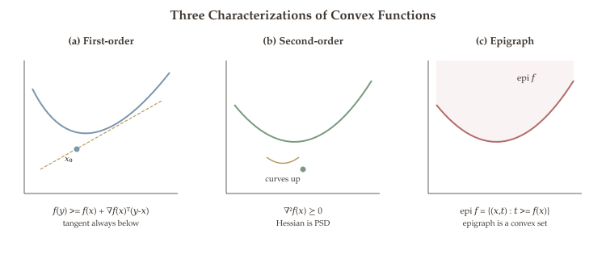

Having established the theory of convex sets in the previous chapter --- including the convexity definition (@eq-convex-set-def) and the preservation rules in @thm-operations-convex-sets --- we now turn to the functions we optimize over them. A convex function is one whose graph "curves upward," ensuring that there are no hidden valleys or local minima that could trap an optimization algorithm.

We develop the theory of convex functions through three equivalent characterizations --- the chord inequality, the tangent-line condition, and the Hessian test --- culminating in powerful preservation rules that let us establish convexity of complex objectives without resorting to direct computation. These tools will be used in every subsequent chapter of the course.

::: {.callout-tip}
## Companion Notebooks

Hands-on Python notebooks accompany this chapter. Click a badge to open in Google Colab.

- [](https://colab.research.google.com/github/ZhuoranYang/zhuoran-yale-teaching/blob/main/SDS431/notebooks/03-convex-functions.ipynb) **Convex Function Properties** --- visualizing epigraphs, level sets, and tangent-line characterizations
- [](https://colab.research.google.com/github/ZhuoranYang/zhuoran-yale-teaching/blob/main/SDS431/notebooks/04-convex-functions-3d.ipynb) **3D Convex Geometry** --- interactive 3D plots of convex sets, ellipsoids, convex hulls, and level sets
:::

## Definition and the Chord Inequality {#sec-convex-func-def}

The most basic way to express "curving upward" is the **chord inequality**: the function value at any mixture of two points lies below the chord connecting them. The formal definition below makes this intuition precise.

::: {#def-convex-function}
## Definition 4.7 (Convex Function)

A function $f : \mathbb{R}^n \to \mathbb{R}$ is **convex** if $\text{dom}(f)$ is a convex set and for all $x, y \in \text{dom}(f)$ and $\lambda \in [0,1]$,

$$f(\lambda x + (1-\lambda)y) \leq \lambda f(x) + (1-\lambda)f(y).$$ {#eq-convex-function-def}

Geometrically: the function value at any convex combination lies below (or on) the chord connecting $(x, f(x))$ and $(y, f(y))$.

$f$ is **strictly convex** if the inequality is strict for $\lambda \in (0,1)$ and $x \neq y$.

$f$ is **concave** if $-f$ is convex.
:::

The defining inequality (@eq-convex-function-def) says that the graph of a convex function always lies **below** any chord drawn between two of its points. Equivalently, a convex function "bows upward." This simple geometric property has profound algorithmic consequences: it ensures that every local minimum is a global minimum, which is the reason convex optimization problems are tractable.

```{=html}
<div class="figure-container">
  <div id="fig-convex-function"></div>
  <div class="figure-caption">Figure 4.2: A convex function in 3D: f(x₁,x₂) = x₁² + x₂². The surface lies below any chord, and every sublevel set is convex.</div>
</div>

<script>
document.addEventListener('DOMContentLoaded', () => {
  const plotlyConfig = {responsive: true, displayModeBar: false};

  function css(v) { return getComputedStyle(document.documentElement).getPropertyValue(v).trim() || null; }

  const N = 40;
  const xv = [], yv = [], zv = [];
  for (let i = 0; i < N; i++) {
    const row_x = [], row_y = [], row_z = [];
    for (let j = 0; j < N; j++) {
      const x = -2 + 4 * i / (N - 1);
      const y = -2 + 4 * j / (N - 1);
      row_x.push(x); row_y.push(y); row_z.push(x * x + y * y);
    }
    xv.push(row_x); yv.push(row_y); zv.push(row_z);
  }
  const p1 = [-1.5, -1.0], p2 = [1.5, 1.0];
  const chord_x = [], chord_y = [], chord_z = [];
  for (let t = 0; t <= 1; t += 0.02) {
    const cx = p1[0] + t * (p2[0] - p1[0]);
    const cy = p1[1] + t * (p2[1] - p1[1]);
    chord_x.push(cx); chord_y.push(cy);
    chord_z.push((p1[0]*p1[0]+p1[1]*p1[1]) + t * ((p2[0]*p2[0]+p2[1]*p2[1]) - (p1[0]*p1[0]+p1[1]*p1[1])));
  }

  const traces = [
    {
      type: 'surface',
      z: zv, x: xv, y: yv,
      opacity: 0.85,
      colorscale: [[0, '#dfe8ef'], [0.5, '#7b97ad'], [1, '#b8995e']],
      showscale: false, hoverinfo: 'z',
    },
    {
      type: 'scatter3d', mode: 'lines',
      x: chord_x, y: chord_y, z: chord_z,
      line: {color: '#b56b6b', width: 6}, name: 'Chord (above surface)',
    },
    {
      type: 'scatter3d', mode: 'markers',
      x: [p1[0], p2[0]], y: [p1[1], p2[1]], z: [p1[0]*p1[0]+p1[1]*p1[1], p2[0]*p2[0]+p2[1]*p2[1]],
      marker: {color: '#b56b6b', size: 5}, name: 'Endpoints', showlegend: false,
    }
  ];
  const layout = {
    paper_bgcolor: 'rgba(0,0,0,0)',
    font: { family: '"Source Serif 4", Georgia, serif', size: 14 },
    scene: {
      xaxis: {title: 'x\u2081', gridcolor: '#e0d9d1'},
      yaxis: {title: 'x\u2082', gridcolor: '#e0d9d1'},
      zaxis: {title: 'f(x)', gridcolor: '#e0d9d1'},
      camera: {eye: {x: 1.6, y: 1.6, z: 1.0}},
    },
    showlegend: true, legend: { x: 0.7, y: 0.95, font: {size: 13} },
    margin: {t: 10, b: 10, l: 10, r: 10},
  };
  Plotly.newPlot('fig-convex-function', traces, layout, plotlyConfig);
});
</script>
```

::: {#exm-common-convex-concave-functions}
## Common Convex and Concave Functions

**Convex functions:**

- Affine: $f(x) = a^\top x + b$ (also concave)
- Quadratic: $f(x) = x^\top Q x$ for $Q \succeq 0$
- Norms: $f(x) = \|x\|_p$ for $p \geq 1$
- Exponential: $f(x) = e^{ax}$
- Log-sum-exp: $f(x) = \log\left(\sum_i e^{x_i}\right)$
- Max function: $f(x) = \max(x_1, \ldots, x_n)$

**Concave functions:** $\log(x)$ on $x > 0$, $\sqrt{x}$ on $x \geq 0$.
:::

With the definition and examples in hand, we now ask: how do we *verify* convexity in practice? The chord inequality requires checking all pairs of points, which is impractical. For differentiable functions, there is a far more useful equivalent condition involving only the gradient.

## First-Order Condition {#sec-first-order-condition}

For differentiable functions, convexity is equivalent to a single elegant condition: the tangent hyperplane at any point must lie below the function everywhere. This **first-order condition** is the workhorse for proving optimality in convex optimization.

::: {#thm-first-order-condition}
## Theorem 4.5 (First-Order Condition)

Suppose $f$ is differentiable and $\text{dom}(f)$ is convex. Then $f$ is convex if and only if

$$f(y) \geq f(x) + \nabla f(x)^\top (y - x) \quad \forall\, x, y \in \text{dom}(f).$$ {#eq-first-order-convexity}

Geometrically: the tangent line (first-order Taylor approximation) at any point is a **global underestimator** of $f$.
:::

![First-order condition: at every point the tangent line lies below the graph of a convex function. The gap $f(y) - [f(x) + \nabla f(x)^\top(y-x)]$ is non-negative everywhere, and equals zero only at $y = x$.](figures/ch01-first-order-condition.svg){#fig-first-order-condition}

The first-order condition provides an equivalent characterization of convexity for differentiable functions. It says that the tangent hyperplane at any point lies entirely below the graph of $f$. This is a much stronger statement than the chord condition in the definition: it must hold globally, not just between two specific points. This property is the key reason why gradient-based methods work so well for convex functions.

An immediate and powerful consequence of @eq-first-order-convexity is that, for convex functions, the familiar necessary condition $\nabla f(x^*) = 0$ becomes *sufficient* for global optimality. This is the fundamental reason why convex optimization is tractable.

::: {#cor-optimality-convex}
## Corollary 4.1 (Optimality Condition for Convex Functions)

If $f$ is convex and differentiable, then $\nabla f(x^*) = 0$ implies $x^*$ is a **global** minimizer. That is, for convex functions, every local minimum is a global minimum.
:::

::: {.proof}
If $\nabla f(x^*) = 0$, then by @eq-first-order-convexity, for every $y$ we have $f(y) \geq f(x^*) + \nabla f(x^*)^\top(y - x^*) = f(x^*) + 0 = f(x^*)$. Since this holds for all $y$, the point $x^*$ achieves the smallest possible function value. Hence we conclude the proof. $\blacksquare$
:::

The first-order condition characterizes convexity through the gradient, but checking it still requires verifying an inequality at every pair of points. For twice-differentiable functions, there is an even more convenient test that involves only a local computation: checking the sign of the Hessian.

## Second-Order Condition {#sec-second-order-condition}

Since the Hessian captures local curvature, requiring it to be positive semidefinite everywhere is equivalent to saying the function curves upward in every direction at every point --- which is exactly convexity. This gives the most computationally convenient characterization of the three.

::: {#thm-second-order-condition}
## Theorem 4.6 (Second-Order Condition)

Suppose $f$ is twice differentiable and $\text{dom}(f)$ is convex. Then:

$$f \text{ is convex} \iff \nabla^2 f(x) \succeq 0 \quad \forall\, x \in \text{dom}(f).$$

That is, the Hessian matrix is positive semidefinite everywhere.

Furthermore, if $\nabla^2 f(x) \succ 0$ for all $x$ (Hessian is positive definite), then $f$ is **strictly convex**.
:::

The second-order condition gives the most practical test for convexity of smooth functions: simply compute the Hessian and check whether all its eigenvalues are nonnegative. For quadratic functions the Hessian is constant, so one eigenvalue check suffices. For more general functions the Hessian varies with $x$, and one must verify positive semidefiniteness at every point in the domain.

::: {#exm-hessian-convexity}
## Verifying Convexity via the Hessian

Consider $f(x) = x^\top Q x + b^\top x + c$ where $Q \in \mathbb{R}^{n \times n}$ is symmetric.

$\nabla f(x) = 2Qx + b$ and $\nabla^2 f(x) = 2Q$.

Thus $f$ is convex $\iff$ $2Q \succeq 0$ $\iff$ $Q \succeq 0$ (all eigenvalues of $Q$ are nonnegative).
:::

@fig-convex-function-characterization summarizes the three characterizations side by side: each gives a different lens on the same underlying property, and the choice among them depends on what information is available (function values, gradients, or Hessians).

{#fig-convex-function-characterization}

The three characterizations above --- chord inequality, first-order condition, and second-order condition --- give us ways to verify that a single function is convex. But in practice, objective functions arise as combinations of simpler pieces. Rather than checking convexity of the final expression from scratch, we can certify it compositionally using preservation rules.

## Operations That Preserve Convexity {#sec-operations-convex-funcs}

Just as we built complex convex sets from simpler ones (@thm-operations-convex-sets), we can establish convexity of complicated objective functions by decomposing them into simpler convex components. The following rules are the function-level analogue of those set operations: they let us certify convexity compositionally, without ever computing a Hessian.

::: {#thm-operations-convex-functions}
## Theorem 4.7 (Operations Preserving Convexity of Functions)

1. **Nonnegative weighted sum:** If $f_1, \ldots, f_k$ are convex and $w_1, \ldots, w_k \geq 0$, then $\sum_{i=1}^k w_i f_i$ is convex.
2. **Composition with affine:** If $f$ is convex, then $g(x) = f(Ax + b)$ is convex.
3. **Pointwise maximum:** If $f_1, \ldots, f_k$ are convex, then $f(x) = \max_i f_i(x)$ is convex.
4. **Pointwise supremum:** If $f(x,y)$ is convex in $x$ for each $y$, then $g(x) = \sup_y f(x,y)$ is convex.
5. **Composition rules:**
   - If $h$ is convex & nondecreasing and $g$ is convex, then $h(g(x))$ is convex.
   - If $h$ is convex & nonincreasing and $g$ is concave, then $h(g(x))$ is convex.
6. **Partial minimization:** If $f(x,y)$ is convex in $(x,y)$, then $g(x) = \inf_y f(x,y)$ is convex (provided the infimum is attained or handled properly).
:::

::: {.callout-tip}
## Remark: Why These Rules Matter

These rules let us establish convexity of complex functions *without* computing derivatives. For instance, $\|Ax - b\|_2$ is convex because the norm is convex and $Ax - b$ is affine (rule 2). The max of linear functions is convex (rule 3), which shows that piecewise-linear convex functions arise naturally.
:::

Having developed tools for building and recognizing convex functions, we now circle back to convex sets. It turns out that convex functions naturally produce convex sets when we "slice" their graphs at a fixed height. This connection is central to constrained optimization, where feasible regions are often defined by inequalities of the form $f(x) \leq \alpha$.

## Sublevel Sets and Quasiconvexity {#sec-sublevel-sets}

Sublevel sets describe the region where a function takes values at or below a given threshold --- precisely the kind of set that arises as a feasible region when we impose an inequality constraint $f(x) \leq \alpha$.

::: {#def-sublevel-set}
## Definition 4.8 (Sublevel Set)

The **$\alpha$-sublevel set** of a function $f : \mathbb{R}^n \to \mathbb{R}$ is

$$C_\alpha = \{x \in \text{dom}(f) : f(x) \leq \alpha\}.$$
:::

A natural and important consequence of function convexity is that cutting the graph at any height produces a convex "slice." This means that constraints of the form $f(x) \leq \alpha$, where $f$ is convex, always yield convex feasible regions.

::: {#thm-sublevel-sets-convex}
## Theorem 4.8 (Sublevel Sets of Convex Functions Are Convex)

If $f$ is convex, then every sublevel set $C_\alpha = \{x : f(x) \leq \alpha\}$ is convex.
:::

::: {.proof}
Let $x, y \in C_\alpha$, so $f(x) \leq \alpha$ and $f(y) \leq \alpha$. For any $\lambda \in [0,1]$, applying the convexity definition (@eq-convex-function-def) gives the first inequality below, and the assumption $f(x), f(y) \leq \alpha$ gives the second:

$$f(\lambda x + (1-\lambda)y) \leq \lambda f(x) + (1-\lambda)f(y) \leq \lambda\alpha + (1-\lambda)\alpha = \alpha.$$

Hence $\lambda x + (1-\lambda)y \in C_\alpha$, so the sublevel set is convex. This completes the proof. $\blacksquare$
:::

::: {.callout-tip}
## Remark: Converse Does Not Hold

The converse is **not** true: a function can have convex sublevel sets without being convex. For example, $f(x) = -e^{-x^2}$ has convex sublevel sets (intervals) but is not a convex function. The property of having convex sublevel sets is called **quasiconvexity**.
:::

The function classes we have encountered --- convex, strongly convex, Lipschitz continuous, and smooth --- form a hierarchy of regularity conditions. Each additional property gives optimization algorithms more structure to exploit, leading to faster convergence guarantees. The diagram below summarizes the inclusion relationships among these classes and their key implications for optimization.

{#fig-function-hierarchy}

```{=html}
<div class="figure-container">
  <div id="fig-sublevel-sets"></div>
  <div class="figure-caption">Figure 4.3: Sublevel sets of f(x₁,x₂) = x₁² + 2x₂² at levels α = 1, 2, 4. Each sublevel set is an ellipse (convex).</div>
</div>

<script>
document.addEventListener('DOMContentLoaded', () => {
  const plotlyConfig = {responsive: true, displayModeBar: false};

  const alphas = [1, 2, 4];
  const colors = ['rgba(122,154,126,0.2)', 'rgba(123,143,163,0.18)', 'rgba(144,126,160,0.18)'];
  const strokes = ['#7a9a7e', '#7b97ad', '#907ea0'];

  const tracesFilled = alphas.map((alpha, idx) => {
    const pts = 80;
    const ex = [], ey = [];
    for (let k = 0; k <= pts; k++) {
      const t = 2 * Math.PI * k / pts;
      ex.push(Math.sqrt(alpha) * Math.cos(t));
      ey.push(Math.sqrt(alpha / 2) * Math.sin(t));
    }
    return {
      x: ex, y: ey, fill: 'toself', fillcolor: colors[idx],
      line: {color: strokes[idx], width: 2.5},
      name: '\u03B1 = ' + alpha, mode: 'lines',
    };
  }).reverse();

  const layout = {
    paper_bgcolor: 'rgba(0,0,0,0)',
    plot_bgcolor: 'rgba(0,0,0,0)',
    font: { family: '"Source Serif 4", Georgia, serif', size: 14 },
    xaxis: { title: {text: 'x\u2081'}, range: [-3, 3], zeroline: true, gridcolor: '#e0d9d1', linecolor: '#968a80', tickfont: {size: 12} },
    yaxis: { title: {text: 'x\u2082'}, range: [-2.2, 2.2], zeroline: true, scaleanchor: 'x', gridcolor: '#e0d9d1', linecolor: '#968a80', tickfont: {size: 12} },
    showlegend: true, legend: { x: 0.75, y: 1, font: {size: 13} },
    margin: {t: 20, b: 50, l: 55, r: 20},
  };
  Plotly.newPlot('fig-sublevel-sets', tracesFilled, layout, plotlyConfig);
});
</script>
```

We now have a complete toolkit for recognizing and building convex functions: three equivalent characterizations (chord inequality, first-order condition, Hessian test), a library of preservation rules, and the connection back to convex sets through sublevel sets. In the next chapter, we assemble these ingredients into the formal framework of convex optimization problems --- standard forms, duality theory, and KKT optimality conditions --- where the payoff of convexity becomes fully apparent.

## Summary {.unnumbered}

- **Convex functions.** A function $f$ is convex if $f(\lambda x + (1-\lambda)y) \leq \lambda f(x) + (1-\lambda)f(y)$; equivalently, its epigraph is a convex set. First-order condition: $f(y) \geq f(x) + \nabla f(x)^\top(y-x)$; second-order condition: $\nabla^2 f(x) \succeq 0$.
- **Preservation rules.** Nonnegative weighted sums, compositions with affine maps, and pointwise suprema of convex functions remain convex --- these rules let us verify convexity of complex objectives without computing the Hessian.
- **Key consequence.** For convex functions, $\nabla f(x^*) = 0$ implies $x^*$ is a global minimizer. This is why convex optimization is tractable: every local minimum is a global minimum.
- **Sublevel sets.** Every sublevel set $\{x : f(x) \leq \alpha\}$ of a convex function is convex, which guarantees that the feasible region of a convex inequality constraint is a convex set.
