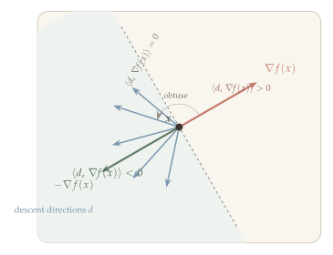
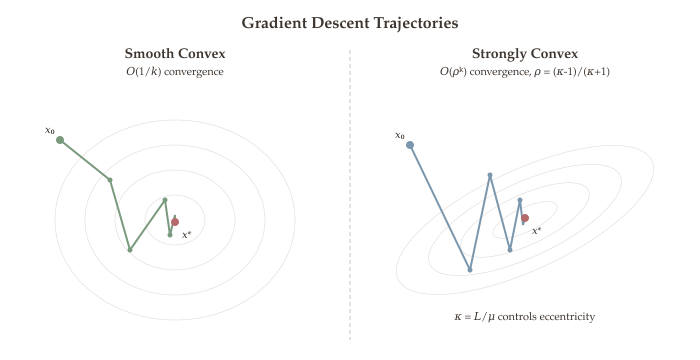

In the previous chapters we developed a rich theory of convex optimization -- convex sets, convex functions, and problem formulations -- that tells us *what* an optimal solution looks like (for instance, a point where the gradient vanishes). But how do we actually *find* one? For most problems of practical interest, closed-form solutions do not exist, and we must turn to iterative algorithms that start from an initial guess and progressively improve it.

The most natural idea is to use the gradient. The gradient of a function at a point tells us the direction of steepest ascent; moving in the opposite direction decreases the function value. This simple principle -- "follow the negative gradient" -- is the basis of **gradient descent**, one of the most fundamental algorithms in all of computational mathematics. It is the workhorse of modern machine learning (training neural networks), statistics (fitting models), and scientific computing.

But gradient descent is just one member of a larger family. By choosing different descent directions (coordinate descent, Newton's method) and different step size strategies (constant, diminishing, line search), we obtain a rich design space of first-order and second-order methods with different tradeoffs between computational cost per iteration and convergence speed. Understanding this design space is essential for choosing the right algorithm in practice.

::: {.callout-tip}
## Companion Notebooks

Hands-on Python notebooks accompany this chapter. Click a badge to open in Google Colab.

- [](https://colab.research.google.com/github/ZhuoranYang/sds431-notes/blob/main/notebooks/06a-steepest-descent.ipynb) **Steepest Descent** --- steepest descent on quadratics with varying condition numbers
- [](https://colab.research.google.com/github/ZhuoranYang/sds431-notes/blob/main/notebooks/06b-gradient-descent-learning-rates.ipynb) **Learning Rate Analysis** --- how learning rate and curvature interact in gradient descent convergence
- [](https://colab.research.google.com/github/ZhuoranYang/sds431-notes/blob/main/notebooks/06c-gd-visualization.ipynb) **GD Visualization** --- animated gradient descent trajectories on various objective landscapes
:::

## What Will Be Covered {.unnumbered}

- Unconstrained optimization setup: stationary points and optimality conditions
- The general iterative framework: descent directions and step sizes
- Steepest descent under different norms: $\ell_2$ (gradient descent), $\ell_1$ (coordinate descent), $\ell_\infty$ (sign gradient descent), spectral norm (Muon optimizer)
- Newton's method and diagonally scaled descent (preview)
- Step size strategies: constant, diminishing, and backtracking line search
- Convergence analysis: smoothness, strong convexity, the condition number, and the descent lemma
- Three convergence cases: nonconvex + smooth, convex + smooth, strongly convex + smooth
- The Polyak--Łojasiewicz condition and linear convergence without convexity

## Unconstrained Optimization Setup {#setup}

We consider the unconstrained optimization problem:

$$\min_{x \in \mathbb{R}^n} f(x),$$

where $f$ is continuously differentiable ($f \in C^1$).

::: {.callout-tip}
## Remark: Convexity and Local Minima

When $f$ is **convex**, global minimum = local minimum.

In the unconstrained case, $x^*$ is a local minimum $\iff$ $\nabla f(x^*) = 0$.
:::

### Stationary Points {#stationary-points}

The key insight that connects calculus to optimization is that, for convex functions, the familiar condition "derivative equals zero" is both necessary and sufficient for optimality. This means that finding the minimum of a convex function reduces to finding a point where the gradient vanishes.

::: {#thm-optimality-convex}
## Optimality Condition for Convex Functions

Let $f$ be convex and differentiable. Then $x_0$ is a local minimum of $f$ if and only if $\nabla f(x_0) = 0$.
:::

::: {.proof}
**($\Rightarrow$):** Define a univariate function $g(t) = f(x_0 - t \cdot \nabla f(x_0))$. Since $x_0$ is a local minimum of $f$, $t = 0$ is a local minimum of $g$. Therefore:

$$0 = g'(t)\big|_{t=0} = -\|\nabla f(x_0)\|^2 \implies \nabla f(x_0) = 0.$$

**($\Leftarrow$):** On the other hand, if $\nabla f(x_0) = 0$, then by the first-order characterization of convexity:

$$f(x) \geq f(x_0) + \langle \nabla f(x_0),\, x - x_0 \rangle = f(x_0) + 0 = f(x_0) \quad \forall\, x \in \mathbb{R}^n,$$

where the second equality uses $\nabla f(x_0) = 0$. This shows $x_0$ is a global minimizer. Hence we conclude the proof. $\blacksquare$
:::

For nonconvex functions, the condition $\nabla f(x) = 0$ does not guarantee a global minimum -- it could also be a local minimum, a local maximum, or a saddle point. Nevertheless, finding stationary points is still the primary goal of first-order algorithms, since it is the best we can guarantee without convexity.

::: {#def-stationary-point}
## Stationary Point

For any differentiable $f$ (possibly nonconvex), $x$ is called a **stationary point** of $f$ if $\nabla f(x) = 0$.
:::

::: {.callout-important}
## Optimality $\iff$ Stationarity (Unconstrained Convex Case)

For **unconstrained minimization of a convex, differentiable** $f$, @thm-optimality-convex shows that the following are equivalent:

$$x^* \text{ is a global minimizer of } f \quad \iff \quad \nabla f(x^*) = 0.$$

This is the key reduction that makes convex optimization tractable: instead of searching over all of $\mathbb{R}^n$ for a global minimum, we only need to **find a stationary point**. The entire algorithmic program of this chapter --- gradient descent, coordinate descent, Newton's method --- is built on this equivalence. Each method is simply a different strategy for solving the nonlinear equation $\nabla f(x) = 0$.
:::

### Motivation for Iterative Methods {#motivation}

To minimize a convex and differentiable $f$, it suffices to find a **stationary point**. Finding a stationary point is equivalent to solving the equation $\nabla f(x) = 0$.

This can be done by **"local" algorithms** --- iterative algorithms that update using "local information" at each iterate. The three levels of local information, in order of increasing richness, are:

- **Function value** --- zeroth-order information (the cheapest to evaluate).
- **Gradient** --- first-order information (the workhorse of most practical methods).
- **Hessian** --- second-order information (the most expensive, but captures curvature).

### General Iterative Framework {#iterative-form}

With the goal of finding a stationary point established, we now introduce the general iterative framework that all descent methods share. Every method we study in this chapter---gradient descent, coordinate descent, Newton's method---is a special case of this template.

::: {.callout-note appearance="simple"}
The general form of the iterative algorithm is:

$$x^{k+1} = x^k + \alpha^k \cdot d^k$$ {#eq-iterative-update}
:::

where we write $k$ as the superscript (iteration index):

- $k \in \{1, 2, \ldots\}$: index of the iteration number.
- $x^k \in \mathbb{R}^n$: current point (current iterate).
- $x^{k+1} \in \mathbb{R}^n$: next point.
- $d^k \in \mathbb{R}^n$: direction to move along at iteration $k$ (**descent direction**).
- $d^k$ uses the local information at $x^k$.
- $\alpha^k > 0$: step size at iteration $k$.

The two design choices---the descent direction $d^k$ and the step size $\alpha^k$---determine the algorithm's behavior. The next several sections address these choices in turn: first, which directions guarantee descent; then, specific algorithmic instantiations; and finally, how to pick the step size.

## Descent Directions and the Gradient {#gradient-based}

The descent direction $d^k$ is based on the gradient $\nabla f(x^k)$ (and maybe other information such as the Hessian $\nabla^2 f(x^k)$, previous gradients $\{\nabla f(x^j)\}_{j < k}$, etc.).

The simplest and most natural choice is $d^k = -\nabla f(x^k)$. Why?

### Why the Negative Gradient? {#steepest-descent-lemma}

The idea comes from **linearization**. Near the current point $x$, Taylor expansion gives

$$f(x + \alpha\, d) \approx f(x) + \alpha \cdot \langle \nabla f(x),\, d \rangle.$$

If we want to decrease $f$ as fast as possible, we should choose $d$ to minimize the linear term $\langle \nabla f(x), d \rangle$. Of course, without a constraint on $\|d\|$, we could make this arbitrarily negative. So the natural question is: **among all unit-norm directions, which one decreases $f$ at the fastest rate?**

::: {#thm-steepest-descent}
## Steepest Descent Direction

Assuming $d \in B_2(1) = \{v \in \mathbb{R}^n \mid \|v\|_2 \leq 1\}$, the direction that decreases $f$ at the **fastest rate** within $B_2(1)$ is given by

$$d^* = -\frac{\nabla f(x)}{\|\nabla f(x)\|_2}.$$ {#eq-steepest-descent}
:::

This is why gradient descent is also called the "method of **steepest descent**."

::: {.proof}
We want to maximize the instantaneous rate of decrease $-\langle \nabla f(x), d \rangle$ over unit-norm directions, i.e., solve

$$\min_{d \in B_2(1)} \; d^\top \nabla f(x).$$

By the Cauchy--Schwarz inequality, $d^\top \nabla f(x) \geq -\|d\|_2 \cdot \|\nabla f(x)\|_2$, with equality when $d$ is a negative scalar multiple of $\nabla f(x)$. Since $\|d\|_2 \leq 1$, the minimizer is $d^* = -\nabla f(x) / \|\nabla f(x)\|_2$. $\blacksquare$
:::

::: {.callout-tip}
## Remark: Magnitude of the Direction

When we talk about the search direction $d$, its magnitude does not matter. $5\,\nabla f(x)$, $0.01\,\nabla f(x)$, $\frac{\nabla f(x)}{\|f(x)\|}$ are all in the same direction. We use the step size $\alpha$ to adjust the magnitude.
:::

### General Descent Directions {#descent-directions}

The negative gradient is the steepest descent direction, but it is not the only direction that decreases the function. Any direction that makes an acute angle with the negative gradient -- equivalently, an obtuse angle with the gradient -- will also decrease the objective for a sufficiently small step. This flexibility is important because alternative descent directions (such as Newton's direction) can converge much faster in practice.

::: {#def-descent-direction}
## Descent Direction

For a given point $x \in \mathbb{R}^n$, a direction $d \in \mathbb{R}^n$ is called a **descent direction** if there exists $\bar{\alpha} > 0$ such that

$$f(x + \alpha \cdot d) < f(x) \qquad \forall\, \alpha \in (0, \bar{\alpha}).$$

Intuitively, $d$ is a descent direction means we can move at least a small step along $d$ and decrease the objective function.
:::

### Descent Condition {#descent-lemma}

The definition above is existential --- it says *some* small step works, but doesn't tell us how to check. The following lemma gives a **simple, checkable condition**: its inner product with the gradient must be negative.

::: {#thm-descent-condition}
## Descent Condition

Consider a point $x \in \mathbb{R}^n$. Any direction $d$ satisfying

$$\langle d, \nabla f(x) \rangle < 0$$ {#eq-descent-condition}

is a descent direction. Geometrically, $d$ and $\nabla f(x)$ form an **obtuse angle**.
:::

Why does this work? The gradient $\nabla f(x)$ points in the direction of steepest *increase*. Any direction $d$ that makes an obtuse angle with $\nabla f(x)$ has a negative projection onto the gradient --- so the linear approximation $f(x) + \langle \nabla f(x), d \rangle$ decreases. The proof below makes this precise by showing the linear term dominates the higher-order remainder for small steps.

This condition is much more permissive than steepest descent: the negative gradient is the *best* descent direction, but the entire **half-space** of directions opposite to $\nabla f(x)$ also works. This flexibility is what allows us to use alternative descent directions (such as Newton's direction or coordinate descent directions) that may converge faster.

{#fig-descent-direction}

::: {.proof}
Define $g(\alpha) = f(x + \alpha \cdot d)$. By Taylor expansion at $\alpha = 0$:

$$g(\alpha) = g(0) + g'(0) \cdot \alpha + o(\alpha) \qquad \text{where } \lim_{\alpha \to 0} \frac{|o(\alpha)|}{\alpha} = 0.$$

Therefore:

$$f(x + \alpha \cdot d) - f(x) = \alpha \cdot \langle d,\, \nabla f(x) \rangle + o(\alpha),$$

where the leading term $\alpha \cdot \langle d, \nabla f(x) \rangle$ is negative by assumption. Since $\frac{|o(\alpha)|}{\alpha} \to 0$, the higher-order remainder becomes negligible for small $\alpha$. Specifically, there exists $\bar{\alpha} > 0$ such that

$$\frac{|o(\alpha)|}{\alpha} < |\langle d,\, \nabla f(x) \rangle| \qquad \forall\, \alpha \in (0, \bar{\alpha}).$$

Therefore, for all $\alpha \in (0, \bar{\alpha})$:

$$f(x + \alpha \cdot d) - f(x) = \alpha \cdot \langle d,\, \nabla f(x) \rangle + o(\alpha) < 0,$$

which shows that $d$ is a descent direction. This completes the proof. $\blacksquare$
:::

### Positive Definite Scaling {#pd-lemma}

We now know that *any* direction satisfying $\langle d, \nabla f(x) \rangle < 0$ works. A natural and powerful way to produce such directions is to premultiply the gradient by a **positive definite matrix** $B$: setting $d = -B\nabla f(x)$ automatically satisfies the descent condition. Different choices of $B$ give different algorithms --- this single idea unifies gradient descent, Newton's method, and quasi-Newton methods.

::: {#thm-pd-descent}
## Positive Definite Descent

Let $B \in \mathbb{R}^{n \times n}$ be a positive definite matrix. For any point $x$ with $\nabla f(x) \neq 0$, $d = -B\,\nabla f(x)$ is a descent direction.
:::

::: {.proof}
With $d = -B\,\nabla f(x)$:

$$d^\top \nabla f(x) = -\nabla f(x)^\top B\,\nabla f(x) < 0,$$

where the strict inequality follows from positive definiteness ($v^\top B v > 0$ for all $v \neq 0$) and $\nabla f(x) \neq 0$. By the descent condition (@eq-descent-condition), $d$ is a descent direction. $\blacksquare$
:::

By choosing different positive definite matrices $B^k$ at each iteration, we recover a family of algorithms under the general update rule:

::: {.callout-note appearance="simple"}
$$x^{k+1} = x^k - \alpha^k \cdot B^k\, \nabla f(x^k).$$ {#eq-general-update}
:::

## Common Choices of Descent Directions {#choices-directions}

Having established the general framework, we now explore specific choices. The unifying idea is **steepest descent under different norms**: given a norm $\|\cdot\|$ on $\mathbb{R}^n$, find the direction that decreases the linear approximation the fastest within the unit ball:

$$d^* = \operatorname{argmin}_{d:\,\|d\| \leq 1} \langle \nabla f(x),\, d \rangle.$$

Different norms yield different unit balls, which yield different optimal directions. The $\ell_2$-ball is a sphere (giving gradient descent), the $\ell_1$-ball is a diamond (giving coordinate descent), and the $\ell_\infty$-ball is a cube (giving sign gradient descent). Each can also be viewed as a different choice of $B^k$ in the general update @eq-general-update.

### Steepest Descent with $\ell_2$-norm (Gradient Descent) {#steepest-l2}

With the $\ell_2$-norm:

$$\operatorname{argmin}_{d:\,\|d\|_2 \leq 1} \langle \nabla f(x),\, d \rangle = -\frac{\nabla f(x)}{\|\nabla f(x)\|_2}.$$

This corresponds to $B^k = I$, giving the standard **gradient descent** update:

$$x^{k+1} = x^k - \alpha^k \cdot \nabla f(x^k).$$ {#eq-gradient-descent}

::: {.callout-tip}
## Remark: Sensitivity to Condition Number

This is the simplest direction but **not always the fastest**. It has poor performance when the **condition number** $\frac{\lambda_{\max}(\nabla^2 f)}{\lambda_{\min}(\nabla^2 f)}$ is large. The iterates oscillate in the dimension with the large eigenvalue and make fast progress in the dimension with the small eigenvalue.
:::

{#fig-condition-number}

```{=html}
<div class="figure-container">
  <div id="fig-gd-contours"></div>
  <div class="figure-caption">Figure 6.1: Gradient descent on an ill-conditioned quadratic. The iterates oscillate perpendicular to the valley and make slow progress along it.</div>
</div>
```

### Oscillation Analysis {#gd-oscillation}

::: {#exm-1d-quadratic}
## Example: 1D Quadratic

Consider the 1D case: $f(x) = \tfrac{1}{2}a\,x^2$, so $f'(x) = a\,x$ and $f''(x) = a$.

Solution: $x^* = 0$. Gradient descent gives:

$$x' = x - \alpha \cdot f'(x) = (1 - a \cdot \alpha) \cdot x.$$

Therefore $|x'| = |1 - a \cdot \alpha| \cdot |x|$, and after $k$ steps:

$$|x^k| = |1 - a \cdot \alpha|^k \cdot |x^0|.$$ {#eq-1d-gd-convergence}

- If $\alpha$ is large such that $|1 - a \cdot \alpha| \geq 1$: **Non-convergence**.
- If $|1 - a \cdot \alpha| < 1$: **Exponential (linear rate) convergence**. To get $|x^k| \leq \varepsilon$, need $k = O(\log(1/\varepsilon))$.

So we need $0 < \alpha < 2/a$:

- If $\alpha \in (0, 1/a)$: $1 - a\alpha \in (0,1)$, and $\{x^k\}$ **monotonically converges** to 0.
- If $\alpha \in (1/a, 2/a)$: $1 - a\alpha \in (-1,0)$, and $\{x^k\}$ **oscillates** to 0.
:::

The convergence rate is controlled by the **contraction factor** $|1 - a\alpha|$: it depends on both the curvature $a$ and the step size $\alpha$. The optimal choice $\alpha^* = 1/a$ gives $|1-a\alpha^*| = 0$, so GD solves the 1D problem in **one step**. But in higher dimensions, we cannot simultaneously zero out the contraction factor for all eigenvalues.

::: {#exm-2d-quadratic-zigzag}
## Example: 2D Quadratic --- Zig-Zag Behavior

Consider the 2D case: $f(x, y) = \tfrac{1}{2}(a\,x^2 + b\,y^2)$ with $a < b$. GD gives:

$$\begin{pmatrix} x' \\ y' \end{pmatrix} = \begin{pmatrix} (1 - a \cdot \alpha)\, x \\ (1 - b \cdot \alpha)\, y \end{pmatrix}.$$

To get convergence, we need $|1 - a\alpha| < 1$ and $|1 - b\alpha| < 1$, which gives $\alpha \in (0, 2/b)$.

If $\alpha \in (1/b, 2/b)$: $\{x^k\}$ monotonically converges to 0 (since $1-a\alpha > 0$), while $\{y^k\}$ oscillates to 0 (since $1-b\alpha < 0$). This produces a **zig-zag trajectory**.

**What is the best step size?** The overall convergence rate is controlled by the *worst* contraction factor:

$$\rho(\alpha) = \max\{|1 - a\alpha|,\; |1 - b\alpha|\}.$$

We want to choose $\alpha$ to minimize $\rho(\alpha)$. As $\alpha$ increases from $0$, $|1-a\alpha|$ decreases while $|1-b\alpha|$ decreases faster then increases. The optimal $\alpha$ balances the two:

$$1 - a\alpha = -(1 - b\alpha) \;\implies\; \alpha^* = \frac{2}{a + b}.$$

At this step size, the contraction factor is:

$$\rho^* = 1 - a \cdot \frac{2}{a+b} = \frac{b - a}{b + a} = \frac{\kappa - 1}{\kappa + 1}, \qquad \text{where } \kappa = b/a$$

is the **condition number** of the Hessian. When $\kappa \approx 1$ (nearly equal curvatures), $\rho^* \approx 0$ and GD converges quickly. When $\kappa \gg 1$ (very different curvatures), $\rho^* \approx 1$ and convergence is slow. This quadratic warm-up foreshadows the general theory: **the condition number $\kappa$ governs the convergence speed of gradient descent**.
:::

```{=html}
<div class="figure-container">
  <div id="fig-zigzag"></div>
  <div class="figure-caption">Figure 6.2: Zig-zag trajectory of gradient descent on a 2D quadratic with different eigenvalues. The iterate oscillates in the y-direction while progressing monotonically in x.</div>
</div>
```

{#fig-gradient-descent-convergence}

{#fig-convergence-rates}

### GD as Quadratic Upper Bound Minimization {#sec-gd-surrogate}

There is a deeper way to understand the GD update that will be the key to all convergence proofs. Two observations:

1. **The GD update minimizes a simple surrogate.** Define

$$g_{\alpha}(x) = f(x^k) + \langle \nabla f(x^k),\, x - x^k \rangle + \frac{1}{2\alpha} \|x - x^k\|_2^2.$$

This is the first-order Taylor expansion of $f$ at $x^k$, plus a **proximity penalty** that prevents us from moving too far. Setting the gradient to zero: $\nabla f(x^k) + \frac{1}{\alpha}(x - x^k) = 0$, which gives $x = x^k - \alpha \nabla f(x^k)$. This is exactly the GD update! So:

$$x^{k+1} = \operatorname{argmin}_{x \in \mathbb{R}^n}\; g_{\alpha^k}(x).$$

2. **When $\alpha$ is small enough, the surrogate upper-bounds $f$.** When $\alpha \leq 1/\lambda_{\max}(\nabla^2 f(x^k))$, the quadratic penalty $\frac{1}{2\alpha}\|x - x^k\|_2^2$ dominates the true curvature, so $g_\alpha(x) \geq f(x)$ for all $x$.

Combining these two observations: **GD minimizes a quadratic upper bound of $f$**. Since $f(x^{k+1}) \leq g_\alpha(x^{k+1}) \leq g_\alpha(x^k) = f(x^k)$, each step is guaranteed to decrease the objective. This is the intuition behind the descent lemma that we will prove formally in @thm-descent-lemma.

{#fig-quadratic-upper-bound}

### Steepest Descent with $\ell_1$-norm (Coordinate Descent) {#steepest-l1}

With the $\ell_1$-norm, the unit ball $\{d : \|d\|_1 \leq 1\}$ is a diamond (cross-polytope). Its extreme points are the standard basis vectors $\pm e_j$. Since the linear objective $\langle \nabla f(x), d \rangle$ is minimized at an extreme point, the solution picks a single coordinate:

$$\operatorname{argmin}_{d:\,\|d\|_1 \leq 1} \langle d,\, \nabla f(x) \rangle.$$

**Solution:** $d^* \in \mathbb{R}^n$ has only **one nonzero entry**:

$$d^*_j = \begin{cases} -\operatorname{sign}\!\bigl(\frac{\partial f}{\partial x_j}(x)\bigr) & \text{if } j = \operatorname{argmax}_j \bigl|\frac{\partial f}{\partial x_j}(x)\bigr| \\[4pt] 0 & \text{otherwise.} \end{cases}$$

Note that the magnitude does not matter. We can choose $d^*$ with magnitude:

$$d^*_j = -\bigl|\tfrac{\partial f}{\partial x_j}(x)\bigr| \cdot \operatorname{sign}\!\bigl(\tfrac{\partial f}{\partial x_j}(x)\bigr) = -\tfrac{\partial f}{\partial x_j}(x).$$

This gives the **coordinate descent** update: pick $i = \operatorname{argmax}_j \bigl|\frac{\partial f}{\partial x_j}(x^k)\bigr|$, then

$$(x^{k+1})_i = (x^k)_i - \alpha^k \cdot \frac{\partial f}{\partial x_i}(x^k), \qquad (x^{k+1})_\ell = (x^k)_\ell \quad \forall\, \ell \neq i.$$

::: {.callout-tip}
## Remark: Coordinate Descent

This algorithm is called **coordinate descent** because we update only one coordinate of $x$ at each iteration. In general, at the $k$-th iteration:

- Pick a coordinate $i \in [n]$ according to some rule.
- Update: $(x^{k+1})_i = (x^k)_i - \alpha^k \cdot \frac{\partial f}{\partial x_i}(x^k)$ (only update coordinate $x_i$).

This corresponds to $B^k$ being a diagonal matrix with a single nonzero entry.
:::

### Steepest Descent with $\ell_\infty$-norm (Sign Gradient Descent) {#sign-gd}

The $\ell_\infty$-ball $\{d : \|d\|_\infty \leq 1\}$ is a cube. Its extreme points are the corners $\{\pm 1\}^n$. The linear objective is minimized by choosing each coordinate independently: $d_j^* = -\operatorname{sign}(\partial f / \partial x_j)$.

With the $\ell_\infty$-norm:

$$\operatorname{argmin}_{d:\,\|d\|_\infty \leq 1} \langle d,\, \nabla f(x) \rangle = -\operatorname{sign}(\nabla f(x)) = -\begin{pmatrix} \operatorname{sign}\!\bigl(\frac{\partial f}{\partial x_1}(x)\bigr) \\ \operatorname{sign}\!\bigl(\frac{\partial f}{\partial x_2}(x)\bigr) \\ \vdots \\ \operatorname{sign}\!\bigl(\frac{\partial f}{\partial x_n}(x)\bigr) \end{pmatrix} \in \{\pm 1\}^n.$$

The update is:

$$x^{k+1} = x^k - \alpha^k \cdot \operatorname{sign}(\nabla f(x^k)).$$

::: {.callout-tip}
## Remark: Sign Gradient Descent and Adam

This algorithm is called **sign gradient descent**. It only uses the sign of each partial derivative, ignoring magnitudes. It is related to the Adam optimizer commonly used in deep learning.
:::

### Steepest Descent with Spectral Norm (Matrix Optimization) {#steepest-spectral}

When the optimization variable is a **matrix** $W \in \mathbb{R}^{m \times n}$ --- for example, a weight matrix in a neural network --- we can choose the **spectral norm** (operator norm) $\|D\|_{\mathrm{op}} = \sigma_{\max}(D)$ as the geometry:

$$d^* = \operatorname{argmin}_{D:\,\|D\|_{\mathrm{op}} \leq 1} \langle \nabla f(W),\, D \rangle_F,$$

where $\langle A, B \rangle_F = \operatorname{tr}(A^\top B)$ is the Frobenius inner product. This is the natural norm for the matrix viewed as a linear operator, treating all singular-value directions on an equal footing.

**Solution.** Let $\nabla f(W) = U \Sigma V^\top$ be the (compact) singular value decomposition. By the duality between the spectral norm and the nuclear norm $\|G\|_* = \sum_i \sigma_i(G)$, the minimizer is

$$d^* = -U V^\top.$$

The steepest descent update becomes:

$$W^{k+1} = W^k - \alpha^k \cdot U^k (V^k)^\top,$$

where $\nabla f(W^k) = U^k \Sigma^k (V^k)^\top$. The update direction $UV^\top$ is a partial isometry (orthogonal matrix when $m = n$): it retains only the *directional* information of the gradient, discarding all singular value magnitudes. Contrast this with standard gradient descent on matrices, which uses the Frobenius norm $\|D\|_F$ (equivalent to $\ell_2$ on the vectorized matrix) and simply sets $d^* = -\nabla f(W) / \|\nabla f(W)\|_F$ --- preserving the (often skewed) singular value profile.

::: {.callout-tip}
## Remark: The Muon Optimizer

The **Muon** (Momentum + Orthogonalization) optimizer combines spectral steepest descent with [Nesterov momentum](07-momentum-adaptive.qmd):

1. Update momentum buffer: $M \leftarrow \beta M + \nabla f(W)$.
2. **Orthogonalize:** compute the SVD $M = U\Sigma V^\top$ and set the update direction to $UV^\top$.
3. Update: $W \leftarrow W - \alpha \cdot UV^\top$.

Computing the full SVD at every step would be prohibitively expensive for large weight matrices. In practice, the orthogonalization $M \mapsto UV^\top$ is approximated efficiently using a **Newton--Schulz iteration** --- a simple matrix recurrence that converges to $UV^\top$ without explicitly computing singular values. We discuss such numerical methods in the [second-order methods](14-newton-method.qmd) part of this book.

The related **SOAP** optimizer combines spectral preconditioning with adaptive learning rates in a similar spirit. These spectral methods have shown strong empirical performance for training large-scale neural networks, where the weight matrices are naturally high-dimensional linear operators.
:::

### Newton's Method {#newton-direction}

The previous methods used only first-order (gradient) information. **Newton's method** incorporates second-order information --- the Hessian matrix --- to adapt the search direction to the local curvature. Set $B^k = (\nabla^2 f(x^k))^{-1}$:

::: {.callout-important}
## Algorithm: Newton's Method

$$x^{k+1} = x^k - \bigl(\nabla^2 f(x^k)\bigr)^{-1} \nabla f(x^k).$$ {#eq-newton-update}
:::

The intuition: recall from @sec-gd-surrogate that GD minimizes a quadratic surrogate with an isotropic proximity penalty $\frac{1}{2\alpha}\|x - x^k\|^2$. Newton's method replaces this with the **exact local curvature** by minimizing the second-order Taylor expansion

$$g_{x^k}(x) = f(x^k) + \langle \nabla f(x^k),\, x - x^k \rangle + \tfrac{1}{2}(x - x^k)^\top \nabla^2 f(x^k)\, (x - x^k).$$

Setting $\nabla g_{x^k}(x) = 0$ recovers the Newton update. Since the surrogate matches $f$ up to second order, Newton's method achieves **quadratic convergence** near the solution (the number of correct digits doubles per step), at the cost of computing and inverting the $n \times n$ Hessian ($O(n^3)$ per iteration). If $f$ is quadratic, the second-order Taylor expansion is exact, so Newton's method converges in **one step**.

We develop the full theory of Newton's method --- convergence analysis, damped Newton steps, and the connection to interior-point methods --- in [Chapter 14](14-newton-method.qmd).

### Diagonally Scaled Steepest Descent {#diag-scaled}

Set $B^k = \operatorname{diag}(b_1, b_2, \ldots, b_n)$, for example:

$$b_j = \Bigl(\frac{\partial^2 f(x^k)}{\partial x_j^2}\Bigr)^{-1},$$

i.e.,

$$d^k = \bigl[\operatorname{diag}\bigl(\nabla^2 f(x^k)\bigr)\bigr]^{-1} \nabla f(x^k).$$

::: {.callout-tip}
## Remark: Diagonal Hessian Approximation

This approximates $\nabla^2 f(x^k)$ using only its **diagonal part**, avoiding the cost of a full matrix inversion. It captures per-coordinate curvature information and is related to adaptive methods like AdaGrad.
:::

We have now assembled a toolbox of descent directions---from the simple negative gradient to the curvature-aware Newton direction. But choosing the direction is only half of the update rule @eq-iterative-update; the other half is the step size $\alpha^k$. A good direction paired with a poor step size can lead to slow convergence or even divergence, as the oscillation analysis in @exm-2d-quadratic-zigzag illustrated. We turn to step size strategies next.

## Choice of Step Sizes {#step-sizes}

The step size $\alpha^k$ controls how far we move along the descent direction at each iteration. A good step size must balance two competing goals: making enough progress toward the optimum (large $\alpha$) without overshooting and increasing the objective (small $\alpha$).

To see why this balance matters, recall the 1D quadratic example (@exm-1d-quadratic): on $f(x) = \frac{1}{2}ax^2$, the update $x' = (1 - a\alpha)x$ converges only when $\alpha < 2/a$, and converges fastest at $\alpha^* = 1/a$. In higher dimensions, the curvature varies across directions, so no single step size is optimal everywhere --- but the principle remains: **the step size must be calibrated to the curvature of $f$**. A step that is safe for the flattest direction may be far too aggressive for the steepest one.

The three strategies below represent fundamentally different approaches to this calibration problem: ignore curvature entirely (constant), adapt conservatively over time (diminishing), or estimate the right scale at each step (line search).

### Constant Step Size {#constant-step}

The simplest strategy: fix $\alpha^k = \alpha$ for all $k \geq 1$.

- **Simple to implement** --- no per-iteration computation of step sizes, no function evaluations beyond the gradient.
- **Requires knowledge of the problem.** The convergence theory (see @thm-descent-lemma below) will show that the step size $\alpha = 1/L$ --- the reciprocal of the smoothness constant --- guarantees descent. But $L$ may not be known in advance. If $\alpha$ is too large, the iterates overshoot and diverge; if too small, each step makes negligible progress.
- **Most common in practice for neural network training**, where $\alpha$ (the "learning rate") is treated as a hyperparameter tuned via grid search or heuristics.

::: {#exm-constant-step-quadratic}
## Example: Constant Step Size on a Quadratic

For $f(x) = \frac{1}{2}x^\top Q\,x$ with eigenvalues $\mu \leq \lambda_1 \leq \cdots \leq \lambda_n \leq L$, the GD update is $x^{k+1} = (I - \alpha Q)x^k$. Convergence requires all eigenvalues of $I - \alpha Q$ to have magnitude less than 1, i.e., $\alpha < 2/L$. The optimal constant step size $\alpha^* = 2/(\mu + L)$ gives contraction factor $\frac{\kappa - 1}{\kappa + 1}$ (as derived in @exm-2d-quadratic-zigzag), where $\kappa = L/\mu$.
:::

### Diminishing Step Size {#diminishing-step}

When the smoothness constant $L$ is unknown and line search is too expensive, a **diminishing step size** provides a safe default: the step sizes shrink to zero, so the algorithm eventually takes steps small enough to avoid overshooting any curvature. Formally, the step sizes satisfy two conditions:

$$\alpha^k \to 0 \qquad \text{and} \qquad \sum_{k=1}^{\infty} \alpha^k = +\infty.$$

For example, $\alpha^k = c/k$ for some constant $c > 0$, or $\alpha^k = c/\sqrt{k}$.

**Why both conditions?** They serve complementary roles:

- **$\sum \alpha^k = +\infty$ (sufficient travel).** The total distance the algorithm can travel is $\sum_k \alpha^k \|\nabla f(x^k)\|$. If $\sum \alpha^k < \infty$, the iterates could converge to a non-stationary point simply because they run out of "fuel" before reaching the optimum. The divergence condition ensures the algorithm can always travel far enough.
- **$\alpha^k \to 0$ (eventual caution).** As the iterates approach the optimum, the gradient becomes small and the linear approximation is valid only in a shrinking neighborhood. Decaying step sizes ensure the algorithm does not overshoot in this delicate regime.

::: {.callout-tip}
## Remark: Diminishing vs. Constant Step Sizes

Diminishing step sizes are most important for **stochastic** gradient descent (SGD), where the gradient estimate is noisy. The noise does not vanish as $x^k \to x^*$, so a constant step size causes the iterates to oscillate around the optimum rather than converging. Diminishing steps average out the noise. For deterministic GD with a known smoothness constant, the constant step size $\alpha = 1/L$ is typically preferred.
:::

### Line Search {#line-search}

The most adaptive strategy: at each iteration, **choose $\alpha^k$ by approximately solving a 1D optimization problem** along the descent direction. This automatically calibrates the step size to the local curvature without requiring global knowledge of $L$.

**Exact line search** solves the 1D problem exactly:

$$\alpha^k = \operatorname{argmin}_{\alpha \geq 0}\; f(x^k + \alpha \cdot d^k).$$

Three observations make this practical:

- It is a **1D optimization** problem --- much simpler than the original $n$-dimensional problem.
- There is no need to solve it *exactly* --- approximate solutions suffice (and are cheaper).
- When $f$ is convex, the line search problem is also convex (restricting a convex function to a line preserves convexity).

However, even 1D optimization requires multiple function evaluations per iteration, which can be expensive. In practice, we use **inexact line search** methods that find a "good enough" step size with only a few function evaluations.

**The Armijo condition (sufficient decrease).** The key idea behind inexact line search is the **Armijo condition**: accept a step size $\alpha$ if it achieves a *sufficient* decrease in $f$, meaning the actual decrease is at least a fixed fraction of the decrease predicted by the linear approximation:

$$f(x^k + \alpha\, d^k) \leq f(x^k) + c \cdot \alpha \cdot \langle \nabla f(x^k),\, d^k \rangle, \qquad c \in (0, 1).$$ {#eq-armijo}

The parameter $c$ controls how much decrease we demand. With $c = 0$ we accept any decrease at all (too permissive); with $c = 1$ we demand the full linear prediction (too strict, since the linear approximation over-predicts for smooth functions). A typical choice is $c = 1/2$.

::: {.callout-important}
## Algorithm: Backtracking Line Search

**Input:** current point $x^k$, descent direction $d^k$, shrinkage factor $\beta \in (0,1)$, Armijo parameter $c \in (0,1)$.

1. Initialize $\alpha \leftarrow 1$.
2. **While** $f(x^k + \alpha\, d^k) > f(x^k) + c \cdot \alpha\,\langle d^k,\, \nabla f(x^k) \rangle$:

$$\alpha \leftarrow \beta \cdot \alpha \qquad \text{(shrink step size)}$$

3. **Return** $\alpha$.

**Idea:** Try step sizes $\alpha \in \{1,\, \beta,\, \beta^2,\, \ldots\}$ and accept the first one satisfying the Armijo condition @eq-armijo.
:::

**Why does backtracking terminate?** Since $d^k$ is a descent direction, $\langle \nabla f(x^k), d^k \rangle < 0$. By continuity, for sufficiently small $\alpha$:

$$f(x^k + \alpha\,d^k) = f(x^k) + \alpha\,\langle \nabla f(x^k), d^k\rangle + o(\alpha) < f(x^k) + c\,\alpha\,\langle \nabla f(x^k), d^k\rangle,$$

so the Armijo condition is eventually satisfied. The algorithm terminates in at most $O(\log(1/\alpha_{\min}))$ function evaluations.

The following figure lets you see the backtracking procedure in action. We plot the one-dimensional function $\varphi(\alpha) = f(x^k + \alpha d^k)$ against the sufficient-decrease line (the Armijo condition). The algorithm tests $\alpha = 1, \beta, \beta^2, \ldots$ and accepts the first $\alpha$ for which $\varphi(\alpha)$ drops below the Armijo line.

```{=html}
<style>
  .interactive-figure-container {
    font-family: 'Palatino Linotype', 'Palatino', 'Book Antiqua', 'Georgia', serif;
    background: #f0ebe5;
    border-radius: 8px;
    padding: 24px 20px 16px 20px;
    margin: 28px auto;
    max-width: 900px;
    box-shadow: 0 2px 12px rgba(61,53,48,0.08);
  }
  .interactive-figure-container h3 {
    font-family: 'Palatino Linotype', 'Palatino', 'Book Antiqua', 'Georgia', serif;
    color: #3d3530; font-size: 1.15em; font-weight: 600; margin: 0 0 6px 0;
  }
  .interactive-figure-container .fig-subtitle {
    color: #968a80; font-size: 0.92em; margin: 0 0 16px 0; line-height: 1.5;
  }
  .interactive-figure-container .slider-row {
    display: flex; align-items: center; gap: 14px; margin: 14px 0 8px 0; flex-wrap: wrap;
  }
  .interactive-figure-container .slider-row label {
    font-size: 0.95em; color: #3d3530; min-width: 80px;
  }
  .interactive-figure-container .slider-row input[type="range"] {
    flex: 1; min-width: 180px; max-width: 420px; accent-color: #7b97ad; height: 6px;
  }
  .interactive-figure-container .slider-row .slider-value {
    font-size: 0.95em; color: #b8995e; font-weight: 600; min-width: 60px;
  }
  .interactive-figure-container .info-box {
    background: #faf7f3; border-left: 3px solid #7b97ad; border-radius: 0 4px 4px 0;
    padding: 10px 14px; margin: 10px 0 4px 0; font-size: 0.88em; color: #3d3530; line-height: 1.6;
  }
</style>

<div class="interactive-figure-container" id="bt-wrapper">
  <h3>Backtracking Line Search Explorer</h3>
  <p class="fig-subtitle">
    f(x) = e<sup>x/2</sup> + x&sup2; &ensp;|&ensp;
    x<sub>k</sub> = 1.5, &ensp; d<sub>k</sub> = &minus;&nabla;f(x<sub>k</sub>)
    &emsp;|&emsp; Armijo parameter c = &frac12;
  </p>
  <div class="slider-row">
    <label for="bt-beta">&beta; =</label>
    <input type="range" id="bt-beta" min="0.2" max="0.9" step="0.01" value="0.5">
    <span class="slider-value" id="bt-beta-val">0.50</span>
  </div>
  <div id="bt-plot"></div>
  <div class="info-box" id="bt-info">
    Drag the slider to change the shrinkage factor &beta;.
  </div>
</div>

<script>
(function() {
  var C = {
    bg: '#f0ebe5', plotBg: '#faf7f3', text: '#3d3530', grid: '#e0d9d1',
    axis: '#968a80', blue: '#7b97ad', gold: '#b8995e', sage: '#7a9a7e',
    terracotta: '#c47a6a', lavender: '#907ea0', rosewood: '#ad8480'
  };
  var font = {family: "'Palatino Linotype','Palatino','Book Antiqua','Georgia',serif", color: C.text};

  var xk = 1.5;
  function f(x) { return Math.exp(0.5*x) + x*x; }
  function gradf(x) { return 0.5*Math.exp(0.5*x) + 2*x; }
  var gk = gradf(xk);
  var dk = -gk;
  var fk = f(xk);
  var slope = gk * dk;  /* negative */
  var cArmijo = 0.5;

  /* phi(alpha) = f(xk + alpha*dk) */
  function phi(a) { return f(xk + a*dk); }

  /* Armijo line: fk + c*alpha*slope */
  function armijo(a) { return fk + cArmijo*a*slope; }

  /* Precompute curve */
  var alphaVals = [], phiVals = [], armijoVals = [];
  for (var a = 0; a <= 1.05; a += 0.005) {
    alphaVals.push(a);
    phiVals.push(phi(a));
    armijoVals.push(armijo(a));
  }

  var axisStyle = {
    gridcolor: C.grid, gridwidth: 1, zerolinecolor: C.axis, zerolinewidth: 1.5,
    linecolor: C.axis, linewidth: 1,
    tickfont: {size: 13, family: font.family, color: font.color},
    titlefont: {size: 15, family: font.family, color: font.color}
  };
  var plotCfg = {displayModeBar: false, responsive: true};

  function update(beta) {
    /* Run backtracking */
    var trials = [];
    var a = 1.0;
    var accepted = -1;
    for (var i = 0; i < 20; i++) {
      var pa = phi(a);
      var aa = armijo(a);
      var ok = pa <= aa;
      trials.push({alpha: a, phi: pa, armijo: aa, accepted: ok});
      if (ok && accepted < 0) { accepted = i; break; }
      a *= beta;
    }

    var traces = [
      /* phi(alpha) curve */
      {x: alphaVals, y: phiVals, mode: 'lines', line: {color: C.blue, width: 3},
       name: '\u03C6(\u03B1) = f(x\u2096 + \u03B1d\u2096)'},
      /* Armijo line */
      {x: alphaVals, y: armijoVals, mode: 'lines',
       line: {color: C.terracotta, width: 2, dash: 'dash'},
       name: 'Armijo: f(x\u2096) + c\u03B1\u27E8d,\u2207f\u27E9'}
    ];

    /* Trial points */
    var rejX = [], rejY = [], accX = [], accY = [];
    for (var j = 0; j < trials.length; j++) {
      if (j === accepted) {
        accX.push(trials[j].alpha);
        accY.push(trials[j].phi);
      } else {
        rejX.push(trials[j].alpha);
        rejY.push(trials[j].phi);
      }
    }
    if (rejX.length > 0) {
      traces.push({x: rejX, y: rejY, mode: 'markers',
        marker: {size: 10, color: C.rosewood, symbol: 'x', line: {width: 2, color: C.rosewood}},
        name: 'Rejected'});
    }
    if (accX.length > 0) {
      traces.push({x: accX, y: accY, mode: 'markers',
        marker: {size: 14, color: C.sage, symbol: 'star', line: {width: 1.5, color: 'white'}},
        name: 'Accepted: \u03B1 = ' + accX[0].toFixed(4)});
    }

    /* vertical lines for trial alpha values */
    var shapes = [];
    for (var j = 0; j < trials.length; j++) {
      shapes.push({
        type: 'line', x0: trials[j].alpha, x1: trials[j].alpha,
        y0: -2, y1: trials[j].phi,
        line: {color: j === accepted ? C.sage : C.rosewood, width: 1, dash: 'dot'}
      });
    }

    var layout = {
      paper_bgcolor: C.bg, plot_bgcolor: C.plotBg, font: font, height: 420,
      margin: {t: 30, b: 58, l: 64, r: 20},
      xaxis: Object.assign({}, axisStyle, {title: 'Step size \u03B1', range: [-0.02, 1.08]}),
      yaxis: Object.assign({}, axisStyle, {title: '\u03C6(\u03B1)', range: [-4, 8]}),
      showlegend: true,
      legend: {x: 0.50, y: 0.98, bgcolor: 'rgba(250,247,243,0.85)',
               bordercolor: C.grid, borderwidth: 1,
               font: {size: 11, family: font.family, color: font.color}},
      shapes: shapes,
      hovermode: 'closest'
    };

    var info;
    if (accepted >= 0) {
      info = 'Accepted \u03B1 = ' + trials[accepted].alpha.toFixed(4)
           + ' after <b>' + (accepted+1) + ' trial' + (accepted > 0 ? 's' : '') + '</b>'
           + ' &ensp;|&ensp; \u03C6(\u03B1) = ' + trials[accepted].phi.toFixed(3)
           + ' &le; Armijo = ' + trials[accepted].armijo.toFixed(3);
    } else {
      info = 'No step accepted in 20 trials';
    }
    document.getElementById('bt-info').innerHTML = info;

    Plotly.react('bt-plot', traces, layout, plotCfg);
  }

  document.getElementById('bt-beta').addEventListener('input', function() {
    var beta = parseFloat(this.value);
    document.getElementById('bt-beta-val').textContent = beta.toFixed(2);
    update(beta);
  });

  update(0.5);
})();
</script>
```

::: {.callout-tip}
## Remark: Step Size Tuning in Practice

In the theory above, the optimal constant step size requires knowing the smoothness constant $L$ (or the strong convexity parameter $\mu$). In practice --- especially when training neural networks --- these constants are unknown and the loss landscape is highly nonconvex. The learning rate (step size) becomes the most important hyperparameter, and practitioners use **learning rate schedules** that vary $\alpha^k$ over the course of training. The key insight is that different phases of training benefit from different step sizes: early on, larger steps help escape flat regions and explore the landscape; later, smaller steps allow the optimizer to settle into a good minimum.

The most widely used schedules include:

- **StepLR (piecewise constant decay).** The learning rate stays constant for $T$ epochs, then drops by a fixed factor $\gamma$:

  $$\alpha^k = \alpha_0 \cdot \gamma^{\lfloor k/T \rfloor}.$$

  For example, $\alpha_0 = 0.1$, $\gamma = 0.1$, $T = 30$ means the learning rate is $0.1$ for the first 30 epochs, $0.01$ for the next 30, and $0.001$ thereafter. This is the classic schedule used in early deep learning (e.g., training ResNets on ImageNet). The idea is simple: train at a high learning rate until progress plateaus, then "anneal" to a lower rate for fine-tuning. The downside is that it introduces discrete jumps, and the schedule parameters ($T$, $\gamma$) must be tuned.

- **Cosine annealing.** The learning rate follows a half-cosine curve from $\alpha_0$ down to $\alpha_{\min} \approx 0$:

  $$\alpha^k = \alpha_{\min} + \frac{1}{2}(\alpha_0 - \alpha_{\min})\!\left(1 + \cos\!\left(\frac{\pi k}{K}\right)\right),$$

  where $K$ is the total number of training steps. Unlike StepLR, the decay is smooth --- the learning rate decreases slowly at first (when the model is still learning coarse features), then faster in the middle, then slowly again near the end (for fine-grained refinement). Cosine annealing has become the default schedule for training large language models and vision transformers, largely because it has only two hyperparameters ($\alpha_0$, $K$) and is robust to the total training duration.

- **Linear warmup + decay.** The learning rate ramps up linearly from a small value to $\alpha_0$ during the first $T_w$ steps, then follows a decay schedule (typically cosine) for the remaining steps:

  $$\alpha^k = \begin{cases} \alpha_0 \cdot k / T_w & k \leq T_w, \\ \text{decay}(\alpha_0, k - T_w) & k > T_w. \end{cases}$$

  **Why warmup?** At initialization, the model parameters are random and the gradients can be very large or have high variance. Starting with a large learning rate in this unstable regime risks divergence. Warmup allows the optimizer's internal statistics (e.g., the second-moment estimates in Adam) to stabilize before committing to large steps. This is especially important for transformers and other architectures with attention mechanisms, where early-stage gradient magnitudes can vary dramatically across layers.

- **Exponential decay.** The learning rate decreases by a constant factor each epoch: $\alpha^k = \alpha_0 \cdot \gamma^k$ with $\gamma \in (0,1)$. This gives a smooth, monotonic decrease, but the exponential drop-off can be too aggressive for long training runs.
:::

```{=html}
<div class="figure-container">
  <div id="fig-lr-schedules"></div>
  <div class="figure-caption">Figure 6.3: Comparison of common learning rate schedules used in deep learning.</div>
</div>
```

## Convergence Analysis of Gradient Descent {#convergence-analysis}

We have developed the gradient descent algorithm and its variants, along with step size strategies. The central question remains: **how fast does gradient descent converge?**

The quadratic warm-up in @exm-2d-quadratic-zigzag already gave us the answer for one special case: on the quadratic $f(x,y) = \frac{1}{2}(ax^2 + by^2)$, the convergence rate is $\frac{\kappa-1}{\kappa+1}$ where $\kappa = b/a$ is the ratio of curvatures. We now develop the general theory, which shows that this is no coincidence --- the convergence rate of GD is always governed by two numbers that bound the **curvature** of $f$:

- **Smoothness parameter $L$:** an upper bound on how fast the gradient changes (curvature from above).
- **Strong convexity parameter $\mu$:** a lower bound on how much the function curves upward (curvature from below).

Their ratio $\kappa = L/\mu$ is the **condition number**, and it controls how many iterations gradient descent needs.

### Smoothness: Bounding Curvature from Above {#smoothness}

The first structural property we need is **smoothness**, which says that the gradient of $f$ does not change too rapidly. Informally, a smooth function has no "sharp bends" in its gradient.

::: {#def-smoothness}
## $L$-Smoothness

A differentiable function $f$ is **$L$-smooth** if its gradient is $L$-Lipschitz continuous:

$$\|\nabla f(x) - \nabla f(y)\|_2 \leq L \cdot \|x - y\|_2 \qquad \forall\, x, y.$$
:::

**What does this mean?** If you move from $x$ to $y$, the gradient cannot change by more than $L$ times the distance you moved. A small $L$ means the gradient changes slowly (the function is "gently curved"), while a large $L$ means the gradient can change rapidly.

**Why do we need this for convergence?** Recall the linearization idea behind GD: we approximate $f(x + \alpha d) \approx f(x) + \alpha \langle \nabla f(x), d \rangle$ and move in the direction that decreases this linear approximation. But this approximation is only valid locally --- if the gradient can change wildly (large $L$), a step that looks good based on the current gradient may actually increase $f$. Smoothness quantifies exactly how far we can trust the linear approximation.

The most important consequence of $L$-smoothness is the **quadratic upper bound**: for all $x, y$,

$$f(y) \leq f(x) + \nabla f(x)^\top (y - x) + \frac{L}{2}\|y - x\|_2^2.$$ {#eq-quadratic-upper}

This says that $f$ is bounded above by a quadratic that "hugs" it from above. The linear part $f(x) + \nabla f(x)^\top(y-x)$ is the tangent-line approximation, and the quadratic term $\frac{L}{2}\|y-x\|_2^2$ controls how far $f$ can deviate from this tangent. See @fig-quadratic-upper-bound for an illustration.

For twice-differentiable functions, $L$-smoothness is equivalent to requiring that all eigenvalues of the Hessian are at most $L$:

$$\nabla^2 f(x) \preceq L \cdot I \qquad \forall\, x.$$

::: {#exm-quadratic-smooth}
## Example: Quadratic Function

For $f(x) = \frac{1}{2}x^\top Q\, x$ with $Q \succ 0$, we have $\nabla^2 f(x) = Q$, so $f$ is $L$-smooth with $L = \lambda_{\max}(Q)$.
:::

### Strong Convexity: Bounding Curvature from Below {#strong-convexity}

While smoothness bounds curvature from above, **strong convexity** bounds it from below. It says that $f$ curves upward at least as fast as a quadratic.

::: {#def-strong-convexity}
## $\mu$-Strong Convexity

A differentiable function $f$ is **$\mu$-strongly convex** (with $\mu > 0$) if for all $x, y$:

$$f(y) \geq f(x) + \nabla f(x)^\top (y - x) + \frac{\mu}{2}\|y - x\|_2^2.$$
:::

**What does this mean?** Ordinary convexity says that $f$ lies above all of its tangent lines. Strong convexity says something stronger: $f$ lies above all of its tangent lines **plus a quadratic bowl** of curvature $\mu$. The bigger $\mu$ is, the more strongly $f$ curves upward.

::: {.callout-tip}
## Intuition: Curvature Sandwich

When $f$ is both $\mu$-strongly convex and $L$-smooth, the curvature of $f$ is **sandwiched** between two quadratics:

$$\underbrace{f(x) + \nabla f(x)^\top(y-x) + \frac{\mu}{2}\|y-x\|_2^2}_{\text{quadratic lower bound}} \;\leq\; f(y) \;\leq\; \underbrace{f(x) + \nabla f(x)^\top(y-x) + \frac{L}{2}\|y-x\|_2^2}_{\text{quadratic upper bound}}.$$

The left side is a "tight-fitting bowl" from strong convexity, and the right side is a "loose-fitting bowl" from smoothness. The function $f$ is trapped between them.
:::

For twice-differentiable functions, $\mu$-strong convexity is equivalent to $\nabla^2 f(x) \succeq \mu \cdot I$ for all $x$. Together with smoothness, this means all Hessian eigenvalues are sandwiched:

$$\mu \cdot I \preceq \nabla^2 f(x) \preceq L \cdot I \qquad \forall\, x.$$

Strong convexity guarantees two important properties:

1. **Unique minimizer.** A $\mu$-strongly convex function has exactly one minimizer $x^*$. (If there were two minimizers $x_1^* \neq x_2^*$, applying the definition with $x = x_1^*$ and $y = x_2^*$ would give $f(x_2^*) > f(x_1^*)$, contradicting optimality of $x_2^*$.)

2. **Gradient domination.** For all $x$:

$$f(x) - f(x^*) \leq \frac{1}{2\mu}\|\nabla f(x)\|_2^2.$$ {#eq-gradient-domination}

This says: **when the gradient is small, the function value must be close to optimal**. To see why, minimize the strong convexity lower bound over $y$: $f(y) \geq f(x) + \langle \nabla f(x), y - x \rangle + \frac{\mu}{2}\|y-x\|_2^2$. The right side is minimized at $y = x - \frac{1}{\mu}\nabla f(x)$, giving $f(x^*) \geq f(x) - \frac{1}{2\mu}\|\nabla f(x)\|_2^2$. Rearranging yields @eq-gradient-domination. This property is so useful that it has its own name --- the **Polyak--Łojasiewicz condition** --- which we revisit in @def-pl.

### The Condition Number {#condition-number}

When $f$ is both $\mu$-strongly convex and $L$-smooth, the ratio of these two parameters plays a central role.

::: {#def-condition-number}
## Condition Number

The **condition number** of a $\mu$-strongly convex and $L$-smooth function is

$$\kappa = \frac{L}{\mu} \geq 1.$$
:::

The condition number measures how "elongated" the contours of $f$ are. When $\kappa \approx 1$, the contours are nearly circular and gradient descent converges quickly in a direct path (@fig-condition-number, left panel). When $\kappa \gg 1$, the contours are elongated ellipses and gradient descent zig-zags slowly toward the optimum (@fig-condition-number, right panel).

Recall from @exm-2d-quadratic-zigzag: on the quadratic $f(x,y) = \frac{1}{2}(ax^2 + by^2)$ with $a < b$, the contraction factors are $|1-a\alpha|$ and $|1-b\alpha|$. With the optimal step size $\alpha = 2/(a+b)$, both factors equal $\frac{b-a}{b+a} = \frac{\kappa-1}{\kappa+1}$, where $\kappa = b/a$. This **contraction factor** $\frac{\kappa-1}{\kappa+1}$ governs the convergence speed of gradient descent.

### The Descent Lemma {#descent-lemma-convergence}

The descent lemma is the **engine behind all gradient descent convergence proofs**. It makes precise the surrogate-minimization intuition from @sec-gd-surrogate: every GD step makes guaranteed progress, provided the step size is small enough.

::: {#thm-descent-lemma}
## Descent Lemma

If $f$ is $L$-smooth and $x^+ = x - \alpha\,\nabla f(x)$ with $\alpha \leq 1/L$, then

$$f(x^+) \leq f(x) - \frac{\alpha}{2}\|\nabla f(x)\|_2^2.$$ {#eq-descent-lemma}
:::

Note two things about this result:

- It is **quantitative**: each step decreases $f$ by at least $\frac{\alpha}{2}\|\nabla f(x)\|_2^2$, which is large when the gradient is large (far from optimality) and small when the gradient is small (close to optimality).
- It requires **no convexity** --- it works for any $L$-smooth function, even nonconvex ones. Convexity will enter only when we translate "gradient gets small" into "function value gets close to optimal."

::: {.proof}
The proof is a direct calculation using the quadratic upper bound (@eq-quadratic-upper). Start from:

$$f(x^+) \leq f(x) + \nabla f(x)^\top(x^+ - x) + \frac{L}{2}\|x^+ - x\|_2^2.$$

Substitute the GD update $x^+ - x = -\alpha\,\nabla f(x)$:

$$f(x^+) \leq f(x) - \alpha\|\nabla f(x)\|_2^2 + \frac{L\alpha^2}{2}\|\nabla f(x)\|_2^2 = f(x) - \alpha\!\left(1 - \frac{L\alpha}{2}\right)\|\nabla f(x)\|_2^2.$$

The coefficient $(1 - L\alpha/2)$ measures the tradeoff: the first term $-\alpha\|\nabla f\|^2$ comes from the linear decrease along the gradient, and the second term $+\frac{L\alpha^2}{2}\|\nabla f\|^2$ is the penalty for curvature. When $\alpha \leq 1/L$, the curvature penalty is at most half the linear gain, giving $(1 - L\alpha/2) \geq 1/2$:

$$f(x^+) \leq f(x) - \frac{\alpha}{2}\|\nabla f(x)\|_2^2. \qquad \blacksquare$$
:::

### Three Convergence Cases {#three-cases}

With the descent lemma in hand, we can analyze gradient descent under three settings of increasing structure. Each added assumption yields a strictly faster convergence rate.

{#fig-three-cases}

#### Case 1: Nonconvex + Smooth {#case1}

When $f$ is only smooth (possibly nonconvex), we cannot hope to find a global minimum---the function may have many local minima and saddle points. The best we can guarantee is finding an **approximate stationary point** where $\|\nabla f(x)\| \leq \varepsilon$.

::: {#thm-nonconvex-smooth}
## GD: Nonconvex + Smooth

If $f$ is $L$-smooth and $\alpha = 1/L$, then after $K$ iterations:

$$\min_{0 \leq k < K} \|\nabla f(x^k)\|_2^2 \leq \frac{2L\bigl(f(x^0) - f(x^*)\bigr)}{K}.$$

To find an $\varepsilon$-approximate stationary point ($\|\nabla f(x)\|_2 \leq \varepsilon$), we need $K = O(L/\varepsilon^2)$ iterations.
:::

::: {.proof}
By the descent lemma (@eq-descent-lemma), each step satisfies $f(x^{k+1}) \leq f(x^k) - \frac{1}{2L}\|\nabla f(x^k)\|_2^2$. Rearranging:

$$\frac{1}{2L}\|\nabla f(x^k)\|_2^2 \leq f(x^k) - f(x^{k+1}).$$

Now sum from $k = 0$ to $K-1$. The right-hand side **telescopes**:

$$\frac{1}{2L}\sum_{k=0}^{K-1}\|\nabla f(x^k)\|_2^2 \leq \bigl(f(x^0) - f(x^1)\bigr) + \bigl(f(x^1) - f(x^2)\bigr) + \cdots + \bigl(f(x^{K-1}) - f(x^K)\bigr) = f(x^0) - f(x^K) \leq f(x^0) - f(x^*).$$

Since the minimum is at most the average: $\min_{k} \|\nabla f(x^k)\|_2^2 \leq \frac{1}{K}\sum_k \|\nabla f(x^k)\|_2^2$. Dividing by $K$ gives the result. $\blacksquare$
:::

::: {.callout-tip}
## Intuition

The descent lemma says each step "uses up" at least $\frac{1}{2L}\|\nabla f(x^k)\|_2^2$ of the initial gap $f(x^0) - f(x^*)$. Since this gap is finite, the gradients must eventually become small. After $K$ steps, at least one iterate has gradient norm at most $O(1/\sqrt{K})$.
:::

#### Case 2: Convex + Smooth {#case2}

When $f$ is convex, every stationary point is a global minimum, so we can track the **function value gap** $f(x^k) - f(x^*)$ directly. Convexity upgrades the guarantee from "finding a stationary point" to "finding an approximate global minimizer." But convexity also gives us a new proof tool: the first-order characterization $f(y) \geq f(x) + \langle \nabla f(x), y - x \rangle$, which provides a **lower bound** to complement the smoothness upper bound.

::: {#thm-convex-smooth}
## GD: Convex + Smooth

If $f$ is convex and $L$-smooth, with $\alpha = 1/L$, then:

$$f(x^K) - f(x^*) \leq \frac{L\|x^0 - x^*\|_2^2}{2K}.$$

To achieve $f(x^K) - f(x^*) \leq \varepsilon$, we need $K = O(L/\varepsilon)$ iterations.
:::

The proof strategy is: combine the smoothness **upper bound** with the convexity **lower bound** to show that each GD step makes progress measured by the **distance to the optimum** $\|x^k - x^*\|_2^2$. A useful algebraic identity (the "three-point identity") then converts inner products into squared distances, enabling a clean telescoping argument.

::: {.callout-note appearance="simple"}
## Three-Point Identity

For any three points $a, b, c \in \mathbb{R}^n$:

$$\langle a - b,\, a - c \rangle = \frac{1}{2}\|a - b\|_2^2 + \frac{1}{2}\|a - c\|_2^2 - \frac{1}{2}\|b - c\|_2^2.$$

This follows by expanding $\|b - c\|^2 = \|(a-c) - (a-b)\|^2$ and rearranging. It converts an inner product (hard to telescope) into a difference of squared distances (easy to telescope). This identity appears repeatedly in optimization proofs --- in projected gradient descent, proximal methods, and mirror descent.
:::

::: {.proof}

**Step 1 (Smoothness --- upper bound).** The quadratic upper bound (@eq-quadratic-upper) at the GD update gives:

$$f(x^{k+1}) \leq f(x^k) + \nabla f(x^k)^\top(x^{k+1} - x^k) + \frac{L}{2}\|x^{k+1} - x^k\|_2^2.$$

**Step 2 (Convexity --- lower bound).** The first-order characterization of convexity, applied at $x^k$ with target $x^*$, gives:

$$f(x^*) \geq f(x^k) + \nabla f(x^k)^\top(x^* - x^k).$$

**Step 3 (Subtract to eliminate $f(x^k)$).** Subtracting the lower bound from the upper bound cancels $f(x^k)$:

$$f(x^{k+1}) - f(x^*) \leq \nabla f(x^k)^\top\bigl[(x^{k+1} - x^k) - (x^* - x^k)\bigr] + \frac{L}{2}\|x^{k+1} - x^k\|_2^2 = \nabla f(x^k)^\top(x^{k+1} - x^*) + \frac{L}{2}\|x^{k+1} - x^k\|_2^2.$$

**Step 4 (Use GD update to replace gradient).** Since $x^{k+1} = x^k - \alpha\nabla f(x^k)$, we have $\nabla f(x^k) = \frac{1}{\alpha}(x^k - x^{k+1})$. Substituting:

$$f(x^{k+1}) - f(x^*) \leq \frac{1}{\alpha}\langle x^k - x^{k+1},\, x^{k+1} - x^* \rangle + \frac{L}{2}\|x^{k+1} - x^k\|_2^2.$$

**Step 5 (Apply three-point identity).** Expanding $\|x^k - x^*\|^2 = \|(x^k - x^{k+1}) + (x^{k+1} - x^*)\|^2$ gives the identity:

$$\langle x^k - x^{k+1},\, x^{k+1} - x^*\rangle = \tfrac{1}{2}\bigl[\|x^k - x^*\|^2 - \|x^{k+1} - x^*\|^2 - \|x^k - x^{k+1}\|^2\bigr].$$

Substituting:

$$f(x^{k+1}) - f(x^*) \leq \frac{1}{2\alpha}\bigl[\|x^k - x^*\|_2^2 - \|x^{k+1} - x^*\|_2^2\bigr] - \frac{1}{2\alpha}\|x^k - x^{k+1}\|_2^2 + \frac{L}{2}\|x^{k+1} - x^k\|_2^2.$$

With $\alpha = 1/L$, the last two terms cancel exactly, leaving:

$$f(x^{k+1}) - f(x^*) \leq \frac{L}{2}\bigl[\|x^k - x^*\|_2^2 - \|x^{k+1} - x^*\|_2^2\bigr].$$ {#eq-convex-telescope}

**Step 6 (Telescope).** Summing @eq-convex-telescope over $k = 0, \ldots, K-1$, the right side telescopes:

$$\sum_{k=0}^{K-1}\bigl(f(x^{k+1}) - f(x^*)\bigr) \leq \frac{L}{2}\bigl[\|x^0 - x^*\|_2^2 - \|x^K - x^*\|_2^2\bigr] \leq \frac{L}{2}\|x^0 - x^*\|_2^2.$$

Since $f(x^k)$ is monotonically decreasing (by the descent lemma), $f(x^K) \leq f(x^{k+1})$ for all $k < K$:

$$K \cdot \bigl(f(x^K) - f(x^*)\bigr) \leq \sum_{k=0}^{K-1}\bigl(f(x^{k+1}) - f(x^*)\bigr) \leq \frac{L}{2}\|x^0 - x^*\|_2^2.$$

Dividing by $K$ gives the result. $\blacksquare$
:::

::: {.callout-tip}
## Intuition

The proof reveals a clean picture: each GD step reduces the squared distance $\|x^k - x^*\|_2^2$ to the optimum, and the total "budget" of distance reduction is $\|x^0 - x^*\|_2^2$. Spreading this budget over $K$ steps gives each step an average reduction of $\|x^0 - x^*\|_2^2 / K$, which translates to a $1/K$ rate for the function value gap.

Note the crucial role of **convexity**: it provided the lower bound in Step 2 that let us relate the function value gap $f(x^{k+1}) - f(x^*)$ to geometric quantities (distances to $x^*$). Without convexity, we could only bound the gradient norm (Case 1).
:::

#### Case 3: Strongly Convex + Smooth {#case3}

The strongest setting gives the best result: **linear convergence** (also called geometric or exponential convergence), where the error contracts by a fixed factor at each step. The key insight is that the proof reduces to the same eigenvalue analysis as the 2D quadratic warm-up (@exm-2d-quadratic-zigzag), but now applied to the Hessian of a general function via the mean value theorem.

::: {#thm-sc-smooth}
## GD: Strongly Convex + Smooth

If $f$ is $\mu$-strongly convex and $L$-smooth, with step size $\alpha = \frac{2}{\mu + L}$ and condition number $\kappa = L/\mu$, then:

$$\|x^k - x^*\|_2 \leq \left(\frac{\kappa - 1}{\kappa + 1}\right)^k \|x^0 - x^*\|_2,$$ {#eq-sc-rate-iterates}

$$f(x^k) - f(x^*) \leq \frac{L}{2}\left(\frac{\kappa - 1}{\kappa + 1}\right)^{2k} \|x^0 - x^*\|_2^2.$$ {#eq-sc-rate-function}

To achieve $f(x^k) - f(x^*) \leq \varepsilon$, we need $K = O(\kappa \log(1/\varepsilon))$ iterations.
:::

::: {.proof}
**Step 1 (Linearize the gradient via the mean value theorem).** The key idea is to express the gradient $\nabla f(x^k)$ in terms of the error $e^k = x^k - x^*$. By the mean value theorem (for vector-valued functions), there exists a point $\xi$ on the segment between $x^k$ and $x^*$ such that:

$$\nabla f(x^k) = \nabla f(x^k) - \underbrace{\nabla f(x^*)}_{= 0} = \nabla^2 f(\xi)\,(x^k - x^*) = \nabla^2 f(\xi)\, e^k.$$

This is the crucial step: it turns the nonlinear gradient into a **linear operator** applied to the error.

**Step 2 (Write the error recursion).** Substituting into the GD update:

$$e^{k+1} = x^{k+1} - x^* = e^k - \alpha\,\nabla f(x^k) = \bigl(I - \alpha\,\nabla^2 f(\xi)\bigr)\, e^k.$$

This is the same form as the 2D quadratic example! The matrix $M = I - \alpha\,\nabla^2 f(\xi)$ is the **contraction matrix**.

**Step 3 (Bound the spectral radius).** By strong convexity and smoothness, the eigenvalues of $\nabla^2 f(\xi)$ lie in $[\mu, L]$, so the eigenvalues of $M$ lie in $[1 - \alpha L,\, 1 - \alpha\mu]$. The spectral norm $\|M\|_{\mathrm{op}} = \max\{|1 - \alpha\mu|,\, |1 - \alpha L|\}$. Just as in the 2D warm-up, the optimal step size balances these two extremes:

$$\alpha^* = \frac{2}{\mu + L} \quad\implies\quad \|M\|_{\mathrm{op}} = \frac{L - \mu}{L + \mu} = \frac{\kappa - 1}{\kappa + 1}.$$

**Step 4 (Unroll).** Therefore $\|e^{k+1}\|_2 \leq \frac{\kappa - 1}{\kappa + 1}\|e^k\|_2$, and unrolling gives @eq-sc-rate-iterates. The function value bound @eq-sc-rate-function follows from the smoothness inequality $f(x) - f(x^*) \leq \frac{L}{2}\|x - x^*\|_2^2$. $\blacksquare$
:::

::: {.callout-tip}
## Intuition: Why Logarithmic Iterations

Linear convergence means the error decreases **geometrically**: after $k$ steps, the error is multiplied by $\rho^k$ where $\rho = \frac{\kappa-1}{\kappa+1} < 1$. To reduce the error from $\Delta_0$ to $\varepsilon$, we need $\rho^k \cdot \Delta_0 \leq \varepsilon$, i.e., $k \geq \frac{\log(\Delta_0/\varepsilon)}{\log(1/\rho)}$. Since $\log(1/\rho) \approx 2/\kappa$ for large $\kappa$, this gives $k = O(\kappa \log(1/\varepsilon))$.

**Concrete comparison:** Convex + smooth needs $O(1/\varepsilon)$ iterations (e.g., 1,000,000 for $\varepsilon = 10^{-6}$), while strongly convex + smooth needs only $O(\kappa \cdot \log(1/\varepsilon)) \approx 14\kappa$ iterations for the same accuracy.
:::

#### Convergence Summary {#convergence-summary-table}

| Setting | Step size $\alpha$ | Error measure | Rate | Iterations for $\varepsilon$ |
|:--------|:-------------------|:-------------|:-----|:---------------------------|
| Nonconvex + Smooth | $1/L$ | $\min_k\|\nabla f(x^k)\|_2^2$ | $O(1/K)$ | $O(1/\varepsilon^2)$ for $\|\nabla f\| \leq \varepsilon$ |
| Convex + Smooth | $1/L$ | $f(x^K) - f(x^*)$ | $O(1/K)$ | $O(1/\varepsilon)$ |
| Strongly Convex + Smooth | $2/(\mu+L)$ | $\|x^k - x^*\|_2$ | $\left(\frac{\kappa-1}{\kappa+1}\right)^k$ | $O(\kappa\log(1/\varepsilon))$ |

Each row adds a structural assumption and gains a faster rate. The jump from $O(1/K)$ to linear convergence is the most dramatic: it is the difference between polynomial and logarithmic dependence on the target accuracy $\varepsilon$. See @fig-convergence-rates for a visual comparison across different method classes.

### The Polyak--Łojasiewicz Condition {#pl-condition}

A remarkable fact is that we do not need strong convexity---or even convexity at all---to achieve linear convergence. The **Polyak--Łojasiewicz (PL) condition** is a weaker assumption that still guarantees the same rate.

::: {#def-pl}
## Polyak--Łojasiewicz Condition

A function $f$ satisfies the **PL condition** with parameter $\mu > 0$ if

$$\|\nabla f(x)\|_2^2 \geq 2\mu \cdot \bigl(f(x) - f(x^*)\bigr) \qquad \forall\, x.$$
:::

The PL condition says: *whenever the gradient is small, the function value must be close to optimal*. This is automatically satisfied by $\mu$-strongly convex functions (it is their gradient domination property @eq-gradient-domination), but it can also hold for some **nonconvex** functions.

::: {#exm-pl-nonconvex}
## Example: A Nonconvex PL Function

Consider $f(x) = x^2 + 3\sin^2(x)$. This function is **nonconvex** (it has inflection points where $f''(x) < 0$), yet it satisfies the PL condition. Intuitively, the $x^2$ term ensures the function always grows away from the origin, so the gradient cannot be small far from the minimizer $x^* = 0$, even though the $\sin^2$ term creates wiggles. Every stationary point of $f$ is the global minimizer --- there are no spurious local minima.
:::

**PL + smoothness gives linear convergence.** The proof is remarkably simple --- just combine the descent lemma with the PL condition. Using step size $\alpha = 1/L$:

$$f(x^{k+1}) - f(x^*) \leq f(x^k) - f(x^*) - \frac{1}{2L}\|\nabla f(x^k)\|_2^2 \stackrel{\text{PL}}{\leq} \left(1 - \frac{\mu}{L}\right)\bigl(f(x^k) - f(x^*)\bigr).$$

Unrolling: $f(x^k) - f(x^*) \leq (1 - \mu/L)^k \cdot (f(x^0) - f(x^*))$ --- linear convergence, without assuming convexity. The PL condition arises naturally in many practical settings, including over-parameterized least squares and certain neural network training problems, which helps explain why GD works well even on nonconvex objectives.

## Stopping Criteria {#stopping-criteria}

The convergence theorems above guarantee that gradient descent *eventually* finds a good solution, but they do not tell the algorithm when to stop. In practice, we need a computable criterion to decide that the current iterate is "close enough" to optimal. The choice of stopping criterion should reflect the convergence guarantee: for nonconvex problems, monitor the gradient norm; for convex problems, the function value gap or iterate distance may be more appropriate.

Set $\varepsilon$ to be a small number. Common stopping criteria:

1. **Gradient norm:** $\|\nabla f(x)\| \leq \varepsilon$.
   - We find an $\varepsilon$-approximate stationary point. If $f$ is convex, stationary point $\iff$ optimal solution.
2. **Objective change:** $|f(x_{k+1}) - f(x_k)| \leq \varepsilon$ (or $|f(x_{k+\ell}) - f(x_k)| \leq \varepsilon$ for some fixed $\ell$).
   - The objective does not change much.
3. **Iterate change:** $\|x_{k+1} - x_k\| \leq \varepsilon$.
   - The iterates do not change much.
4. **Relative objective change:** $\displaystyle\frac{|f(x_{k+1}) - f(x_k)|}{\max\{1,\, |f(x_k)|\}} < \varepsilon$.
   - Removes the effect of the magnitude of $f$.
5. **Relative iterate change:** $\displaystyle\frac{\|x_{k+1} - x_k\|}{\max\{1,\, \|x_k\|\}} < \varepsilon$.

## Summary {.unnumbered}

- **Iterative descent framework.** All first-order methods share the update $x^{k+1} = x^k + \alpha^k d^k$; convergence requires $d^k$ to be a descent direction ($\langle d^k, \nabla f(x^k) \rangle < 0$) and an appropriate step size $\alpha^k$.
- **Steepest descent and its variants.** Choosing different norms in the steepest descent problem yields gradient descent ($\ell_2$), coordinate descent ($\ell_1$), sign gradient descent ($\ell_\infty$), and spectral steepest descent (operator norm on matrices, giving the Muon optimizer); choosing $B^k = [\nabla^2 f(x^k)]^{-1}$ gives Newton's direction.
- **Step size strategies.** Constant step sizes are simple but require tuning; diminishing step sizes ($\alpha^k \to 0$, $\sum \alpha^k = \infty$) guarantee convergence; backtracking line search adaptively finds a step size ensuring sufficient decrease.
- **GD as surrogate minimization.** Each GD step minimizes a quadratic upper bound $g_\alpha(x) = f(x^k) + \langle \nabla f(x^k), x-x^k\rangle + \frac{1}{2\alpha}\|x-x^k\|^2$. Newton's method replaces the isotropic penalty with the true Hessian.
- **Smoothness and strong convexity.** $L$-smoothness ($\|\nabla f(x) - \nabla f(y)\| \leq L\|x-y\|$) bounds curvature from above; $\mu$-strong convexity bounds it from below and gives gradient domination: $f(x) - f^* \leq \frac{1}{2\mu}\|\nabla f(x)\|^2$. Their ratio $\kappa = L/\mu$ is the condition number.
- **Descent lemma.** If $f$ is $L$-smooth and $\alpha \leq 1/L$, then $f(x^+) \leq f(x) - \frac{\alpha}{2}\|\nabla f(x)\|^2$: every GD step makes guaranteed progress.
- **Three convergence cases.** Nonconvex + smooth: $\min_k \|\nabla f(x^k)\|^2 = O(1/K)$. Convex + smooth: $f(x^K) - f^* = O(1/K)$. Strongly convex + smooth: linear convergence $O((\frac{\kappa-1}{\kappa+1})^k)$, needing $O(\kappa\log(1/\varepsilon))$ iterations.
- **PL condition.** The Polyak--Łojasiewicz condition $\|\nabla f(x)\|^2 \geq 2\mu(f(x) - f^*)$ yields linear convergence without convexity.

::: {.callout-tip}
## Looking Ahead

The convergence rates in this chapter---$O(1/K)$ for convex functions and $O(\rho^k)$ for strongly convex functions---are fundamental baselines, but they can be improved. In the next chapter, we study advanced first-order methods: momentum techniques (Heavy-Ball, Nesterov acceleration) that achieve the optimal $O(1/K^2)$ rate for smooth convex functions, and adaptive learning rate methods (AdaGrad, RMSProp, Adam) that automatically tune per-coordinate step sizes.
:::

```{=html}
<!-- Plotly.js for interactive figures -->
<script src="https://cdn.plot.ly/plotly-2.35.0.min.js" charset="utf-8"></script>

<style>
  .figure-container { margin: 2rem 0; background: #f0ebe5; border: 1px solid #d5cdc4; border-radius: 10px; padding: 1.25rem; box-shadow: 0 1px 4px rgba(61,53,48,0.08); }
  .figure-caption { text-align: center; font-size: 0.88rem; color: #968a80; margin-top: 0.75rem; font-style: italic; }
</style>

<script>
document.addEventListener('DOMContentLoaded', () => {

  const plotlyConfig = {responsive: true, displayModeBar: false};
  const figFont = '"Source Serif 4", Georgia, "Times New Roman", serif';
  const figFontHeading = '"Crimson Pro", Georgia, serif';

  function themeLayout(extra = {}) {
    return Object.assign({
      paper_bgcolor: '#f0ebe5',
      plot_bgcolor: '#faf7f3',
      font: { family: figFont, color: '#3d3530', size: 14 },
    }, extra);
  }

  function themeAxis(title, extra = {}) {
    return Object.assign({
      title: {text: title, font: {family: figFont, size: 14}},
      gridcolor: '#e0d9d1',
      zerolinecolor: '#e0d9d1',
      linecolor: '#968a80',
      tickfont: {family: figFont, size: 12, color: '#968a80'},
    }, extra);
  }

  function legendStyle() {
    return {
      font: {family: figFont, size: 13, color: '#3d3530'},
      bgcolor: '#f0ebe5dd',
      bordercolor: '#e0d9d1',
      borderwidth: 1,
    };
  }

  // ---- Figure 2: GD on ill-conditioned quadratic ----
  (function() {
    const el = document.getElementById('fig-gd-contours');
    if (!el) return;
    const a = 1, b = 10;
    const alpha = 0.15;
    let x = 5.0, y = 5.0;
    const trajX = [x], trajY = [y];
    for (let k = 0; k < 25; k++) {
      x = x - alpha * a * x;
      y = y - alpha * b * y;
      trajX.push(x); trajY.push(y);
    }
    const traces = [];
    const levels = [5, 20, 50, 100, 150];
    levels.forEach(L => {
      const theta = Array.from({length: 200}, (_, i) => 2*Math.PI*i/199);
      const r = Math.sqrt(2*L);
      traces.push({
        x: theta.map(t => r/Math.sqrt(a)*Math.cos(t)),
        y: theta.map(t => r/Math.sqrt(b)*Math.sin(t)),
        mode: 'lines', line: {color: '#b8995e', width: 1},
        showlegend: false, hoverinfo: 'skip'
      });
    });
    traces.push({
      x: trajX, y: trajY, mode: 'lines+markers',
      line: {color: '#7b97ad', width: 2},
      marker: {color: '#7b97ad', size: 4},
      name: 'GD trajectory'
    });
    traces.push({
      x: [trajX[0]], y: [trajY[0]], mode: 'markers',
      marker: {color: '#8a6e5e', size: 10, symbol: 'circle'},
      name: 'Start'
    });
    traces.push({
      x: [0], y: [0], mode: 'markers',
      marker: {color: '#b56b6b', size: 12, symbol: 'star'},
      name: 'Optimum (0,0)'
    });
    const layout = themeLayout({
      title: {text: 'GD on f = 0.5*(1x\u00b2 + 10y\u00b2), \u03b1=0.15', font: {family: figFontHeading, size: 15, color: '#3d3530'}},
      xaxis: themeAxis('x', {range: [-2, 7]}),
      yaxis: themeAxis('y', {range: [-6, 7], scaleanchor: 'x'}),
      showlegend: true, legend: Object.assign({x: 0.6, y: 1}, legendStyle()),
      margin: {t: 48, b: 50, l: 55, r: 20},
    });
    Plotly.newPlot(el, traces, layout, plotlyConfig);
  })();

  // ---- Figure 3: Zig-zag trajectory ----
  (function() {
    const el = document.getElementById('fig-zigzag');
    if (!el) return;
    const a = 1, b = 10;
    const alpha = 0.18;
    let x = 4.0, y = 3.0;
    const trajX = [x], trajY = [y];
    for (let k = 0; k < 20; k++) {
      x = x - alpha * a * x;
      y = y - alpha * b * y;
      trajX.push(x); trajY.push(y);
    }
    const traces = [];
    const levels = [2, 10, 30, 60];
    levels.forEach(L => {
      const theta = Array.from({length: 200}, (_, i) => 2*Math.PI*i/199);
      const r = Math.sqrt(2*L);
      traces.push({
        x: theta.map(t => r/Math.sqrt(a)*Math.cos(t)),
        y: theta.map(t => r/Math.sqrt(b)*Math.sin(t)),
        mode: 'lines', line: {color: '#b8995e', width: 1, dash: 'dot'},
        showlegend: false, hoverinfo: 'skip'
      });
    });
    traces.push({
      x: trajX, y: trajY, mode: 'lines+markers',
      line: {color: '#ad8480', width: 2},
      marker: {color: '#ad8480', size: 5},
      name: 'GD \u03b1=0.18 (zig-zag)'
    });
    traces.push({
      x: [trajX[0]], y: [trajY[0]], mode: 'markers',
      marker: {color: '#8a6e5e', size: 10}, name: 'Start'
    });
    traces.push({
      x: [0], y: [0], mode: 'markers',
      marker: {color: '#b56b6b', size: 12, symbol: 'star'}, name: 'Optimum'
    });
    const layout = themeLayout({
      title: {text: 'Zig-Zag: a=1, b=10, \u03b1=0.18 (1/b < \u03b1 < 2/b)', font: {family: figFontHeading, size: 15, color: '#3d3530'}},
      xaxis: themeAxis('x (monotone convergence)', {range: [-1, 5]}),
      yaxis: themeAxis('y (oscillates)', {range: [-4, 4], scaleanchor: 'x'}),
      showlegend: true, legend: Object.assign({x: 0.55, y: 1}, legendStyle()),
      margin: {t: 48, b: 55, l: 55, r: 20},
    });
    Plotly.newPlot(el, traces, layout, plotlyConfig);
  })();

  // ---- Figure 4: Learning rate schedules ----
  (function() {
    const el = document.getElementById('fig-lr-schedules');
    if (!el) return;
    const epochs = Array.from({length: 100}, (_, i) => i);
    const lr0 = 0.1;
    const stepLR = epochs.map(e => lr0 * Math.pow(0.5, Math.floor(e / 30)));
    const cosineLR = epochs.map(e => lr0 * 0.5 * (1 + Math.cos(Math.PI * e / 100)));
    const expLR = epochs.map(e => lr0 * Math.pow(0.95, e));
    const warmupCosine = epochs.map(e => {
      if (e < 10) return lr0 * e / 10;
      return lr0 * 0.5 * (1 + Math.cos(Math.PI * (e - 10) / 90));
    });
    const dimLR = epochs.map(e => e === 0 ? lr0 : lr0 / (1 + 0.05 * e));
    const traces = [
      {x: epochs, y: stepLR, mode: 'lines', line: {color: '#7b97ad', width: 2.5}, name: 'StepLR'},
      {x: epochs, y: cosineLR, mode: 'lines', line: {color: '#907ea0', width: 2.5, dash: 'dashdot'}, name: 'Cosine Annealing'},
      {x: epochs, y: expLR, mode: 'lines', line: {color: '#b8995e', width: 2.5, dash: 'dash'}, name: 'Exponential Decay'},
      {x: epochs, y: warmupCosine, mode: 'lines', line: {color: '#b56b6b', width: 2.5}, name: 'Warmup + Cosine'},
      {x: epochs, y: dimLR, mode: 'lines', line: {color: '#7a9a7e', width: 2.5, dash: 'dot'}, name: 'Diminishing (1/k)'},
    ];
    const layout = themeLayout({
      title: {text: 'Comparison of Learning Rate Schedules', font: {family: figFontHeading, size: 16, color: '#3d3530'}},
      xaxis: themeAxis('Epoch', {range: [0, 100]}),
      yaxis: themeAxis('Learning Rate', {range: [0, 0.12]}),
      showlegend: true, legend: Object.assign({x: 0.55, y: 1}, legendStyle()),
      margin: {t: 48, b: 50, l: 60, r: 20},
    });
    Plotly.newPlot(el, traces, layout, plotlyConfig);
  })();

});
</script>
```
