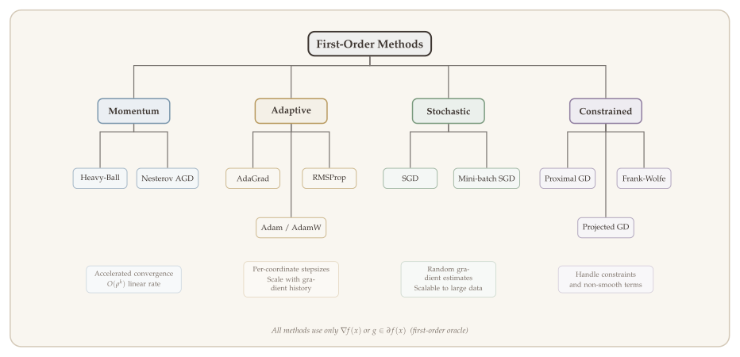
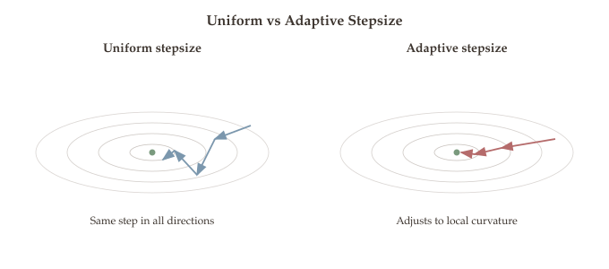
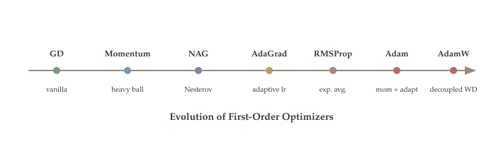
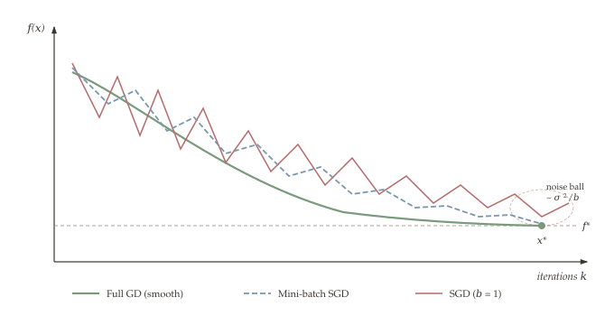
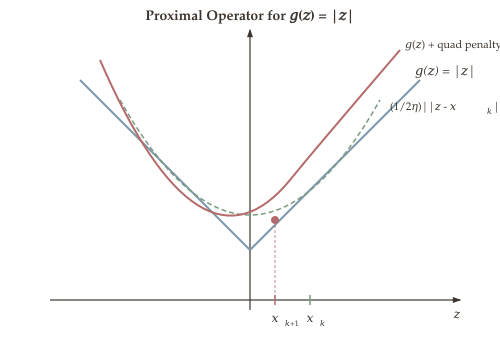

Gradient descent is simple and elegant, but it has a well-known weakness: on ill-conditioned problems, it converges painfully slowly. The iterates zigzag across narrow valleys, wasting most of their effort oscillating in high-curvature directions while barely making progress along the bottom of the valley. For a function with condition number $\kappa$, gradient descent requires $O(\kappa \log(1/\varepsilon))$ iterations --- and in machine learning applications, $\kappa$ can easily be in the thousands or millions.

This chapter introduces techniques that dramatically accelerate first-order optimization. Momentum methods smooth out the oscillatory behavior of gradient descent by incorporating information from past gradients, reducing the iteration complexity from $O(\kappa \log(1/\varepsilon))$ to $O(\sqrt{\kappa} \log(1/\varepsilon))$ --- a quadratic improvement in the dependence on the condition number. Adaptive learning rate methods (AdaGrad, RMSProp, Adam) go further by automatically adjusting the step size in each coordinate direction, effectively rescaling the problem to reduce its condition number. We then turn to stochastic gradient descent (SGD), which makes optimization on massive datasets tractable by replacing full gradient evaluations with cheap, noisy estimates, and to proximal gradient methods, which extend gradient descent to handle nonsmooth objectives such as the $\ell_1$ penalty.

These methods form the backbone of modern deep learning optimization. Nearly every large-scale neural network trained today uses some variant of Adam or SGD with momentum. Understanding why these methods work --- and when they can fail --- is essential for both practitioners and theorists.

::: {.callout-tip}
## Companion Notebooks

Hands-on Python notebooks accompany this chapter. Click a badge to open in Google Colab.

- [](https://colab.research.google.com/github/ZhuoranYang/zhuoran-yale-teaching/blob/main/SDS431/notebooks/11-gd-adagrad-rmsprop-adam.ipynb) **Optimizer Comparison** --- comparing GD, AdaGrad, RMSProp, Adam, and Heavy Ball on Beale and Rosenbrock functions
- [](https://colab.research.google.com/github/ZhuoranYang/zhuoran-yale-teaching/blob/main/SDS431/notebooks/12-pytorch-optimizers.ipynb) **Tour of PyTorch Optimizers** --- experimenting with PyTorch's built-in optimizers at different learning rates
- [](https://colab.research.google.com/github/ZhuoranYang/zhuoran-yale-teaching/blob/main/SDS431/notebooks/18-learning-rate-schedules.ipynb) **Learning Rate Schedules** --- step, cosine, and warm-up scheduling in PyTorch
:::

## What Will Be Covered {#sec-overview}

- Gradient descent recap and the role of the condition number
- Polyak's heavy-ball momentum method and its convergence on quadratics
- Nesterov's accelerated gradient method and its convergence on general convex functions
- Adaptive learning rate methods: AdaGrad, RMSProp, and Adam
- Stochastic gradient descent for finite-sum objectives and minibatch variants
- Proximal gradient methods for composite (smooth + nonsmooth) objectives

{#fig-optimizer-taxonomy}

## Gradient Descent Recap {#gd-recap}

Recall the gradient descent update with constant stepsize:
(See [Part 5.1](06-gradient-descent.qmd) for the full derivation of gradient descent and its convergence analysis.)
$$x^{k+1} = x^k - \alpha \cdot \nabla f(x^k).$$

As we will show in later lectures, if $f$ is twice-differentiable and $\nabla^2 f$ is bounded (as defined in [Part 3](04-convex-functions.qmd)):
$$m \cdot \mathbf{I}_n \preceq \nabla^2 f(x) \preceq M \cdot \mathbf{I}_n,$$

let $\kappa = \frac{M}{m} \geq 1$ be defined as the **condition number** of $f$. Then setting $\alpha = \frac{1}{M}$, we have:

$$\begin{aligned}
f(x^{k+1}) - f(x^*) &\leq \exp(-k/\kappa) \cdot \bigl[f(x^1) - f(x^*)\bigr], \\
\|x^{k+1} - x^*\|_2 &\leq \exp(-k/\kappa) \cdot \|x^k - x^*\|_2.
\end{aligned}$$

Thus, to achieve an $\varepsilon$-approximate minimizer, the number of GD updates (queries to the gradient oracle) is:

$$\text{Iteration complexity} = O\!\bigl(\kappa \cdot \log(1/\varepsilon)\bigr).$$ {#eq-gd-complexity}

### Quadratic Example {#gd-quadratic}

::: {#exm-gd-quadratic}
## Gradient Descent on a Quadratic

Consider $f(x) = \frac{1}{2} x^\top A x - b^\top x$, where $A$ is PSD with $m \mathbf{I} \preceq A \preceq M \mathbf{I}$. Then $x^* = A^{-1}b$ and $\kappa = M/m$.

The GD update becomes:
$$x^{k+1} = x^k - \alpha \cdot (Ax^k - b) = x^k - \alpha \cdot (Ax^k - Ax^*) = (\mathbf{I} - \alpha A)\, x^k + \alpha A\, x^*.$$

Taking the difference with $x^*$:
$$\begin{aligned}
\|x^{k+1} - x^*\|_2 &= \|(\mathbf{I} - \alpha A)(x^k - x^*)\|_2 = \|(\mathbf{I} - \alpha A)^k (x^1 - x^*)\|_2 \\
&\leq \|(\mathbf{I} - \alpha A)^k\|_2 \cdot \|x^1 - x^*\|_2 \\
&\leq \bigl(\rho(\mathbf{I} - \alpha A) + o(1)\bigr)^k \cdot \|x^1 - x^*\|_2.
\end{aligned}$$
:::

::: {.proof}
*Deriving the Rate.*
The eigenvalues of $(\mathbf{I} - \alpha A)$ with $\alpha = 1/M$ are bounded in:
$$\bigl[1 - \alpha M, \; 1 - \alpha m\bigr] = \bigl[0, \; 1 - 1/\kappa\bigr].$$

Thus $\rho(\mathbf{I} - \alpha A) \leq 1 - 1/\kappa$. Substituting into the spectral radius bound above, and using the standard inequality $1 - t \leq \exp(-t)$ for $t \geq 0$, we obtain:
$$\|x^{k+1} - x^*\|_2 \leq \Bigl(1 - \frac{1}{\kappa}\Bigr)^k \|x^1 - x^*\| \leq \exp(-k/\kappa) \cdot \|x^1 - x^*\|_2.$$

To achieve $\varepsilon$-error $\|x^k - x^*\|_2 \leq \varepsilon$, we need:
$$k = O\!\Bigl(\kappa \cdot \log\!\bigl(\tfrac{\|x^1 - x^*\|_2}{\varepsilon}\bigr)\Bigr) = O\!\bigl(\kappa \cdot \log(1/\varepsilon)\bigr),$$
when $\|x^1 - x^*\|_2$ is of constant order. Hence we conclude that the iteration complexity of gradient descent on this quadratic is $O(\kappa \cdot \log(1/\varepsilon))$. $\blacksquare$
:::

### Remarks on GD {#gd-remarks}

::: {.callout-tip}
## Remarks

1. **Condition number dependence:** For the quadratic case, iteration complexity is linear in $\kappa$. If $A$ is ill-conditioned, then GD needs more iterations.
2. **Descent property:** We can show the objective value decays at each step. Why? Because $\nabla f(x^k)$ is a descent direction.
3. **Optimal stepsize choice:** $\alpha^* = \frac{2}{m + M}$, which gives a slightly better rate:
   $$\|x^{k+1} - x^*\|_2 \leq \Bigl(1 - \frac{2}{\kappa+1}\Bigr) \cdot \|x^k - x^*\|_2.$$
   Note that $\frac{2}{m+M} \geq \frac{2}{2M} = \frac{1}{M}$, the stepsize we used in the previous bound.
:::

## Momentum Methods {#momentum}

The $O(\kappa \cdot \log(1/\varepsilon))$ complexity of gradient descent (@eq-gd-complexity) becomes prohibitively large when the condition number $\kappa$ is high. The key idea of momentum methods is to break this bottleneck by incorporating information from previous iterates. The previous methods are of the form $x^{k+1} = x^k + \alpha^k \cdot d^k$, where the descent direction $d^k$ is computed based on the *current gradient* $\nabla f(x^k)$.

Momentum methods propose to also incorporate **"past gradients"** $\{\nabla f(x^\ell),\, \ell < k\}$ when updating $x^k$.

::: {.callout-tip}
## Why Momentum?

The trajectory of GD bounces back and forth in the **high curvature directions**, and makes slow progress in **low curvature directions**.

By adding past gradients, we smooth out the trajectory. Momentum methods are first-order (gradient-based) methods.
:::

::: {.figure-container}
```{ojs}
//| echo: false
//| label: fig-momentum-intuition
//| fig-cap: "Figure 8.1: GD oscillates on an ill-conditioned quadratic. Momentum smooths out the trajectory, accelerating convergence."

{
  const M_ = 20, m_ = 1;
  const kappa = M_ / m_;
  const x0 = [5, 5];
  const alphaGD = 2 / (m_ + M_);
  const alphaHB = Math.pow(2 / (Math.sqrt(m_) + Math.sqrt(M_)), 2);
  const betaHB = Math.pow((Math.sqrt(kappa) - 1) / (Math.sqrt(kappa) + 1), 2);

  function ellipsePoints(a, b, cx, cy, n) {
    const xs = [], ys = [];
    for (let i = 0; i <= n; i++) {
      const t = 2 * Math.PI * i / n;
      xs.push(cx + a * Math.cos(t));
      ys.push(cy + b * Math.sin(t));
    }
    return {x: xs, y: ys};
  }

  function gdTrajectory(M, m, x0, alpha, nIter) {
    const path = [[x0[0], x0[1]]];
    let x = [x0[0], x0[1]];
    for (let i = 0; i < nIter; i++) {
      x = [x[0] - alpha * M * x[0], x[1] - alpha * m * x[1]];
      path.push([x[0], x[1]]);
    }
    return path;
  }

  function hbTrajectory(M, m, x0, alpha, beta, nIter) {
    const path = [[x0[0], x0[1]]];
    let x = [x0[0], x0[1]], xp = [x0[0], x0[1]];
    for (let i = 0; i < nIter; i++) {
      const xn = [
        x[0] - alpha * M * x[0] + beta * (x[0] - xp[0]),
        x[1] - alpha * m * x[1] + beta * (x[1] - xp[1])
      ];
      xp = x; x = xn;
      path.push([x[0], x[1]]);
    }
    return path;
  }

  const gdPath = gdTrajectory(M_, m_, x0, alphaGD, 40);
  const hbPath = hbTrajectory(M_, m_, x0, alphaHB, betaHB, 40);

  const contourData = [10, 50, 125, 250].map(c => {
    const a = Math.sqrt(2*c/M_), b = Math.sqrt(2*c/m_);
    const pts = ellipsePoints(a, b, 0, 0, 80);
    return {x: pts.x, y: pts.y, mode: 'lines', line: {color: '#d5cdc4', width: 1}, showlegend: false, hoverinfo: 'skip'};
  });

  const traces = [
    ...contourData,
    {x: gdPath.map(p=>p[0]), y: gdPath.map(p=>p[1]), mode: 'lines+markers',
      line: {color: '#ad8480', width: 2}, marker: {size: 3, color: '#ad8480'},
      name: 'Gradient Descent'},
    {x: hbPath.map(p=>p[0]), y: hbPath.map(p=>p[1]), mode: 'lines+markers',
      line: {color: '#7b97ad', width: 2}, marker: {size: 3, color: '#7b97ad'},
      name: 'Heavy-Ball Momentum'},
    {x: [0], y: [0], mode: 'markers', marker: {color: '#b56b6b', size: 12, symbol: 'star'},
      name: 'Optimum x*'},
  ];

  const layout = {
    title: {text: 'GD vs. Momentum on Ill-Conditioned Quadratic (\u03BA = 20)'},
    xaxis: {title: 'x\u2081', range: [-6, 6]},
    yaxis: {title: 'x\u2082', range: [-6, 6], scaleanchor: 'x'},
    showlegend: true,
    legend: {x: 0.55, y: 1},
    margin: {t: 48, b: 50, l: 55, r: 20},
    width: 700, height: 500
  };

  const div = DOM.element('div');
  Plotly.newPlot(div, traces, layout, {responsive: true, displayModeBar: false});
  return div;
}
```
:::

### Polyak's Heavy-Ball Method {#polyak}

::: {.callout-important}
## Algorithm: Polyak's Momentum (Heavy-Ball Method)

**Update rule:**
$$x^{k+1} = x^k - \alpha \cdot \nabla f(x^k) + \beta \cdot (x^k - x^{k-1}).$$ {#eq-heavy-ball-update}

Parameters:

- $\alpha$: stepsize
- $\beta \in [0, 1)$: momentum parameter

The term $\beta(x^k - x^{k-1})$ is the **momentum** term.
:::

**Another way to view the momentum update.** Define $z^k = \frac{1}{\alpha}(x^{k-1} - x^k)$. Then:
$$\begin{cases} z^{k+1} = \beta \cdot z^k + \nabla f(x^k) \\ x^{k+1} = x^k - \alpha \cdot z^{k+1} \end{cases}$$

Expanding the recursion:
$$z^{k+1} = \nabla f(x^k) + \beta \cdot \nabla f(x^{k-1}) + \beta^2 \cdot \nabla f(x^{k-2}) + \cdots + \beta^{k-1} \nabla f(x^1).$$

This contains all **past gradient evaluations**, with exponential damping.

- $\beta = 0$ reduces to standard GD.
- $\beta < 1$ ensures the past gradients are damped (if $\beta = 1$, $\nabla f(x^1)$ would be added in each step without decay).

::: {.callout-tip}
## Remark: Alternative Form

The momentum method is sometimes written as:
$$\begin{cases} m^{k+1} = \beta \cdot m^k + (1 - \beta)\,\nabla f(x^k) \\ x^{k+1} = x^k - \alpha \cdot m^{k+1} \end{cases}$$

This is equivalent to the previous form with $\widetilde{\alpha} = \alpha(1-\beta)$.
:::

### Intuition of Momentum {#momentum-intuition}

In practice, $\beta$ is set to a constant that is **close to 1** (e.g., 0.9 or 0.999).

::: {.callout-note appearance="simple"}
**Intuition of momentum:**

- In **high curvature directions**, the gradients cancel each other out => momentum damps oscillations.
- In **low curvature directions**, the gradients point to the same direction => momentum increases the stepsize in low curvature directions.
:::

::: {.figure-container}
```{ojs}
//| echo: false
//| label: fig-stepsize-effect
//| fig-cap: "Figure 8.2: Effect of stepsize on optimization trajectory. Too small: slow progress. Too large: oscillations. Much too large: instability."

{
  const M_ = 10, m_ = 1;
  const x0 = [4, 4];

  function ellipsePoints2(a, b, cx, cy, n) {
    const xs = [], ys = [];
    for (let i = 0; i <= n; i++) {
      const t = 2 * Math.PI * i / n;
      xs.push(cx + a * Math.cos(t));
      ys.push(cy + b * Math.sin(t));
    }
    return {x: xs, y: ys};
  }

  function gdTraj2(M, m, x0, alpha, nIter) {
    const path = [[x0[0], x0[1]]];
    let x = [x0[0], x0[1]];
    for (let i = 0; i < nIter; i++) {
      x = [x[0] - alpha * M * x[0], x[1] - alpha * m * x[1]];
      path.push([x[0], x[1]]);
    }
    return path;
  }

  const small = gdTraj2(M_, m_, x0, 0.02, 50);
  const good = gdTraj2(M_, m_, x0, 2/(m_+M_), 50);
  const large = gdTraj2(M_, m_, x0, 0.18, 50);

  const contours = [5, 20, 80].map(c => {
    const a = Math.sqrt(2*c/M_), b = Math.sqrt(2*c/m_);
    const pts = ellipsePoints2(a, b, 0, 0, 80);
    return {x: pts.x, y: pts.y, mode: 'lines', line: {color: '#d5cdc4', width: 1}, showlegend: false, hoverinfo: 'skip'};
  });

  const traces = [
    ...contours,
    {x: small.slice(0,30).map(p=>p[0]), y: small.slice(0,30).map(p=>p[1]), mode: 'lines+markers',
      line: {color: '#7a9a7e', width: 2}, marker: {size: 3}, name: '\u03B1 too small'},
    {x: good.slice(0,30).map(p=>p[0]), y: good.slice(0,30).map(p=>p[1]), mode: 'lines+markers',
      line: {color: '#7b97ad', width: 2}, marker: {size: 3}, name: '\u03B1 optimal'},
    {x: large.slice(0,20).map(p=>p[0]), y: large.slice(0,20).map(p=>p[1]), mode: 'lines+markers',
      line: {color: '#b56b6b', width: 2}, marker: {size: 3}, name: '\u03B1 too large'},
    {x: [0], y: [0], mode: 'markers', marker: {color: '#8a6e5e', size: 10, symbol: 'star'}, name: 'x*'},
  ];

  const layout = {
    xaxis: {title: 'x\u2081', range: [-6, 6]},
    yaxis: {title: 'x\u2082', range: [-6, 6], scaleanchor: 'x'},
    showlegend: true,
    margin: {t: 20, b: 50, l: 55, r: 20},
    width: 700, height: 500
  };

  const div = DOM.element('div');
  Plotly.newPlot(div, traces, layout, {responsive: true, displayModeBar: false});
  return div;
}
```
:::

::: {.callout-tip}
## Remarks on Heavy-Ball

- The stepsize $\alpha$ usually needs to be tuned (e.g., grid search). Practically, $\alpha$ is often between 0.001 and 0.1.
- $\alpha$ too small --- slow progress; $\alpha$ too large --- oscillations; $\alpha$ much too large --- instability.
- As the update direction is perturbed by momentum, generally the objectives $\{f(x^k)\}$ generated by the heavy-ball method are **not monotonically decreasing**.
- We can only prove its convergence in the quadratic case. In this case, momentum is better than GD.
- In practice, overall momentum is better than GD and almost never hurts.
:::

### Improved Convergence of Heavy-Ball Method {#hb-convergence}

We now formalize the convergence advantage of momentum. The key insight is to lift the iteration into a higher-dimensional space by tracking both the current and previous iterates, which turns the heavy-ball recursion into a linear dynamical system governed by a companion matrix $T$. The convergence rate is then determined by the spectral radius of $T$, and by choosing $\alpha$ and $\beta$ optimally we can minimize this spectral radius.

::: {#thm-heavy-ball-convergence}
## Theorem 8.1 (Heavy-Ball Convergence on Quadratics)

Consider $f(x) = \frac{1}{2} x^\top A x - b^\top x$ with $m \mathbf{I}_n \preceq A \preceq M \cdot \mathbf{I}_n$. Then $\nabla f(x) = Ax - b = A(x - x^*)$ with $x^* = A^{-1}b$.

The heavy-ball updates satisfy:
$$x^{k+1} - x^* = \bigl[(1+\beta)\mathbf{I} - \alpha A\bigr](x^k - x^*) - \beta(x^{k-1} - x^*).$$

Define $w^k = x^k - x^*$. In matrix form:
$$\begin{pmatrix} w^{k+1} \\ w^k \end{pmatrix} = \underbrace{\begin{pmatrix} (1+\beta)\mathbf{I} - \alpha A & -\beta \mathbf{I} \\ \mathbf{I} & \mathbf{0} \end{pmatrix}}_{T} \begin{pmatrix} w^k \\ w^{k-1} \end{pmatrix}.$$

Using recursion: $\displaystyle\left\|\binom{w^{k+2}}{w^{k+1}}\right\|_2 \leq \|T^k\|_2 \cdot \left\|\binom{w^2}{w^1}\right\|_2 \leq \bigl(\rho(T) + \varepsilon\bigr)^k \cdot \left\|\binom{w^2}{w^1}\right\|_2,$

where $\rho(T) = \max\{|\lambda_i(T)|\}$ is the **spectral radius** of $T$.
:::

This result shows that the convergence rate of the heavy-ball method on quadratics is governed by the spectral radius of a $2n \times 2n$ companion matrix $T$. By choosing $\alpha$ and $\beta$ to minimize this spectral radius, we can achieve a faster rate than plain gradient descent.

Given the spectral radius characterization above, we can now derive the optimal choice of step size and momentum parameter that minimizes $\rho(T)$ and determine the resulting iteration complexity.

::: {#cor-heavy-ball-optimal-params}
## Corollary 8.2: Optimal Parameters for Heavy-Ball

The optimal parameters are:
$$\alpha = \Bigl(\frac{2}{\sqrt{m} + \sqrt{M}}\Bigr)^2, \qquad \beta = \Bigl(\frac{\sqrt{M} - \sqrt{m}}{\sqrt{M} + \sqrt{m}}\Bigr)^2 = \Bigl(\frac{\sqrt{\kappa} - 1}{\sqrt{\kappa} + 1}\Bigr)^2.$$

The spectral radius is:
$$\rho(T) = \frac{\sqrt{\kappa} - 1}{\sqrt{\kappa} + 1} = 1 - \frac{2}{\sqrt{\kappa} + 1}.$$

After $K = O\!\bigl(\sqrt{\kappa} \cdot \log(1/\varepsilon)\bigr)$ iterations, we find an $\varepsilon$-approximate solution.
$$\text{Iteration complexity (Heavy-Ball)} = O\!\bigl(\sqrt{\kappa} \cdot \log(1/\varepsilon)\bigr).$$ {#eq-hb-complexity}
:::

In other words, by tuning the stepsize and momentum parameter optimally, the heavy-ball method replaces the $\kappa$ dependence in the GD complexity (@eq-gd-complexity) with $\sqrt{\kappa}$. This is a substantial speedup, especially for ill-conditioned problems where $\kappa$ is large.

::: {.callout-note appearance="simple"}
**Comparison with standard GD:**

- GD with $\alpha = \frac{2}{m+M}$: iteration complexity $K = O(\kappa \cdot \log(1/\varepsilon))$.
- Heavy-ball (momentum): iteration complexity $K = O(\sqrt{\kappa} \cdot \log(1/\varepsilon))$.
- Momentum improves from $\kappa \cdot \log(1/\varepsilon)$ to $\sqrt{\kappa} \cdot \log(1/\varepsilon)$.
- $\alpha_{\text{momentum}} = \bigl(\frac{2}{\sqrt{m}+\sqrt{M}}\bigr)^2 \approx \frac{4}{M} \approx 2 \cdot \alpha_{\text{GD}}$ (when $\kappa$ is large).
- $\beta_{\text{momentum}} \approx 1$.
:::

## Nesterov's Accelerated Gradient (NAG) {#nag}

The heavy-ball method achieves the optimal $O(\sqrt{\kappa}\log(1/\varepsilon))$ rate on quadratics, but its convergence guarantee does not extend to general smooth convex functions. Nesterov's accelerated gradient method makes a seemingly minor modification --- evaluating the gradient at a "lookahead" point rather than the current iterate --- that upgrades the convergence theory to cover all smooth strongly convex objectives. This makes NAG one of the most important algorithms in convex optimization.

::: {.callout-important}
## Algorithm: Nesterov's Accelerated Gradient

**Update:**
$$x^{k+1} = x^k + \beta(x^k - x^{k-1}) - \alpha \cdot \nabla f\!\bigl(x^k + \beta(x^k - x^{k-1})\bigr).$$ {#eq-nag-update}

Equivalently, defining an intermediate point $y^{k+1}$:

```
Nesterov:
  y^{k+1} = x^k + beta * (x^k - x^{k-1})     // first add momentum
  x^{k+1} = y^{k+1} - alpha * grad f(y^{k+1}) // then apply gradient
```

Compare with Heavy-ball:

```
Heavy-ball:
  y^{k+1} = x^k - alpha * grad f(x^k)         // first apply gradient
  x^{k+1} = y^{k+1} + beta * (x^k - x^{k-1}) // then add momentum
```
:::

{#fig-nesterov-momentum}

**Key difference:** Heavy-ball (@eq-heavy-ball-update) computes the gradient at $x^k$, then adds momentum. Nesterov (@eq-nag-update) first adds momentum, then computes the gradient at the "look-ahead" point.

NAG is a modified version of the heavy-ball method with **faster convergence** than GD. Crucially, the convergence theory applies to **general convex functions**, not just quadratics.

### NAG Optimal Parameters {#nag-params}

The key question is whether the accelerated $O(\sqrt{\kappa})$ rate of the heavy-ball method --- which was only proven for quadratics --- extends to general smooth strongly convex functions. Nesterov showed that with the right choice of parameters, the "look-ahead" gradient evaluation achieves exactly this. The following result gives the optimal parameters and the resulting convergence guarantee.

::: {#cor-nag-convergence}
## Corollary 8.3: NAG Convergence

The optimal parameters are:
$$\alpha_{\text{NAG}} = \frac{4}{m + 3M}, \qquad \beta_{\text{NAG}} = \frac{\sqrt{3\kappa + 1} - 2}{\sqrt{3\kappa + 1} + 2}.$$

Convergence rate:
$$\|x^{k+1} - x^*\|_2 \leq \exp\!\Bigl(-\frac{2k}{\sqrt{3\kappa + 1}}\Bigr).$$

Iteration complexity:
$$\text{Iteration complexity (NAG)} = O\!\bigl(\sqrt{\kappa} \cdot \log(1/\varepsilon)\bigr).$$ {#eq-nag-complexity}

See the Nesterov book for the full analysis.
:::

Nesterov's accelerated gradient achieves the same $O(\sqrt{\kappa} \cdot \log(1/\varepsilon))$ rate as the heavy-ball method (compare @eq-nag-complexity with @eq-hb-complexity), but with a crucial advantage: this rate is provably achieved for all smooth strongly convex functions, not just quadratics. This makes NAG a foundational algorithm in convex optimization theory.

The following figure shows the three methods on the ill-conditioned quadratic $f(x) = \frac{1}{2}(x_1^2 + \kappa\, x_2^2)$. Drag the slider to increase the condition number and observe how GD develops increasingly severe oscillations, while Nesterov's method maintains a smooth path to the optimum.

```{=html}
<style>
  .interactive-figure-container {
    font-family: 'Palatino Linotype', 'Palatino', 'Book Antiqua', 'Georgia', serif;
    background: #f0ebe5; border-radius: 8px; padding: 24px 20px 16px 20px;
    margin: 28px auto; max-width: 900px;
    box-shadow: 0 2px 12px rgba(61,53,48,0.08);
  }
  .interactive-figure-container h3 {
    font-family: 'Palatino Linotype', 'Palatino', 'Book Antiqua', 'Georgia', serif;
    color: #3d3530; font-size: 1.15em; font-weight: 600; margin: 0 0 6px 0;
  }
  .interactive-figure-container .fig-subtitle {
    color: #968a80; font-size: 0.92em; margin: 0 0 16px 0; line-height: 1.5;
  }
  .interactive-figure-container .slider-row {
    display: flex; align-items: center; gap: 14px; margin: 14px 0 8px 0; flex-wrap: wrap;
  }
  .interactive-figure-container .slider-row label {
    font-size: 0.95em; color: #3d3530; min-width: 80px;
  }
  .interactive-figure-container .slider-row input[type="range"] {
    flex: 1; min-width: 180px; max-width: 420px; accent-color: #7b97ad; height: 6px;
  }
  .interactive-figure-container .slider-row .slider-value {
    font-size: 0.95em; color: #b8995e; font-weight: 600; min-width: 60px;
  }
  .interactive-figure-container .info-box {
    background: #faf7f3; border-left: 3px solid #7b97ad; border-radius: 0 4px 4px 0;
    padding: 10px 14px; margin: 10px 0 4px 0; font-size: 0.88em; color: #3d3530; line-height: 1.6;
  }
</style>

<div class="interactive-figure-container" id="mom-wrapper">
  <h3>GD vs. Heavy Ball vs. Nesterov</h3>
  <p class="fig-subtitle">
    Quadratic: f(x) = &frac12;(x<sub>1</sub>&sup2; + &kappa; x<sub>2</sub>&sup2;)
    &emsp;|&emsp; Starting point: (4, 1) &emsp;|&emsp; 60 iterations
  </p>
  <div class="slider-row">
    <label for="mom-kappa">&kappa; =</label>
    <input type="range" id="mom-kappa" min="1" max="50" step="1" value="15">
    <span class="slider-value" id="mom-kappa-val">15</span>
  </div>
  <div id="mom-plot"></div>
  <div class="info-box" id="mom-info">
    Drag the slider to change the condition number.
  </div>
</div>

<script>
(function() {
  var C = {
    bg: '#f0ebe5', plotBg: '#faf7f3', text: '#3d3530', grid: '#e0d9d1',
    axis: '#968a80', blue: '#7b97ad', gold: '#b8995e', sage: '#7a9a7e',
    terracotta: '#c47a6a', lavender: '#907ea0', rosewood: '#ad8480'
  };
  var font = {family: "'Palatino Linotype','Palatino','Book Antiqua','Georgia',serif", color: C.text};
  var plotCfg = {displayModeBar: false, responsive: true};
  var x0 = [4.0, 1.0];
  var nIter = 60;

  function runGD(kappa) {
    var mu = 1, L = kappa;
    var eta = 2.0 / (mu + L);
    var path = [[x0[0], x0[1]]];
    var x = [x0[0], x0[1]];
    for (var k = 0; k < nIter; k++) {
      var g0 = x[0], g1 = kappa * x[1];
      x = [x[0] - eta*g0, x[1] - eta*g1];
      path.push([x[0], x[1]]);
    }
    return path;
  }

  function runHB(kappa) {
    var mu = 1, L = kappa;
    var sqrtK = Math.sqrt(kappa);
    var eta = 4.0 / ((Math.sqrt(mu) + Math.sqrt(L))*(Math.sqrt(mu) + Math.sqrt(L)));
    var beta = ((sqrtK - 1) / (sqrtK + 1)) * ((sqrtK - 1) / (sqrtK + 1));
    var path = [[x0[0], x0[1]]];
    var x = [x0[0], x0[1]];
    var xprev = [x0[0], x0[1]];
    for (var k = 0; k < nIter; k++) {
      var g0 = x[0], g1 = kappa * x[1];
      var xnew0 = x[0] - eta*g0 + beta*(x[0]-xprev[0]);
      var xnew1 = x[1] - eta*g1 + beta*(x[1]-xprev[1]);
      xprev = [x[0], x[1]];
      x = [xnew0, xnew1];
      path.push([x[0], x[1]]);
    }
    return path;
  }

  function runNAG(kappa) {
    var mu = 1, L = kappa;
    var sqrtK = Math.sqrt(kappa);
    var eta = 4.0 / ((Math.sqrt(mu) + Math.sqrt(L))*(Math.sqrt(mu) + Math.sqrt(L)));
    var beta = ((sqrtK - 1) / (sqrtK + 1)) * ((sqrtK - 1) / (sqrtK + 1));
    var path = [[x0[0], x0[1]]];
    var x = [x0[0], x0[1]];
    var xprev = [x0[0], x0[1]];
    for (var k = 0; k < nIter; k++) {
      /* Nesterov: evaluate gradient at lookahead point */
      var y0 = x[0] + beta*(x[0]-xprev[0]);
      var y1 = x[1] + beta*(x[1]-xprev[1]);
      var g0 = y0, g1 = kappa * y1;
      var xnew0 = x[0] + beta*(x[0]-xprev[0]) - eta*g0;
      var xnew1 = x[1] + beta*(x[1]-xprev[1]) - eta*g1;
      xprev = [x[0], x[1]];
      x = [xnew0, xnew1];
      path.push([x[0], x[1]]);
    }
    return path;
  }

  function makeContours(kappa) {
    /* Create contour data for f(x) = 0.5*(x1^2 + kappa*x2^2) */
    var nx = 80, ny = 80;
    var xr = [-1.5, 5.5], yr = [-2.5, 2.5];
    var xv = [], yv = [], zv = [];
    for (var j = 0; j < ny; j++) {
      var row = [];
      var yval = yr[0] + (yr[1]-yr[0])*j/(ny-1);
      if (j === 0) { for (var i = 0; i < nx; i++) xv.push(xr[0] + (xr[1]-xr[0])*i/(nx-1)); }
      yv.push(yval);
      for (var i = 0; i < nx; i++) {
        var xval = xv[i];
        row.push(0.5*(xval*xval + kappa*yval*yval));
      }
      zv.push(row);
    }
    return {x: xv, y: yv, z: zv};
  }

  function update(kappa) {
    var gd = runGD(kappa);
    var hb = runHB(kappa);
    var nag = runNAG(kappa);

    var ctr = makeContours(kappa);

    var gdX = gd.map(function(p){return p[0];}), gdY = gd.map(function(p){return p[1];});
    var hbX = hb.map(function(p){return p[0];}), hbY = hb.map(function(p){return p[1];});
    var nagX = nag.map(function(p){return p[0];}), nagY = nag.map(function(p){return p[1];});

    /* Final f values */
    var fGD = 0.5*(gdX[nIter]*gdX[nIter] + kappa*gdY[nIter]*gdY[nIter]);
    var fHB = 0.5*(hbX[nIter]*hbX[nIter] + kappa*hbY[nIter]*hbY[nIter]);
    var fNAG = 0.5*(nagX[nIter]*nagX[nIter] + kappa*nagY[nIter]*nagY[nIter]);

    var traces = [
      {x: ctr.x, y: ctr.y, z: ctr.z, type: 'contour',
       colorscale: [[0,'#faf7f3'],[0.3,'#e0d9d1'],[0.6,'#c8bfb5'],[1,'#968a80']],
       contours: {start: 0.5, end: 15, size: 1.5},
       showscale: false, hoverinfo: 'skip', name: ''},
      {x: gdX, y: gdY, mode: 'lines+markers', line: {color: C.blue, width: 2},
       marker: {size: 3, color: C.blue}, name: 'GD', legendgroup: 'gd'},
      {x: hbX, y: hbY, mode: 'lines+markers', line: {color: C.gold, width: 2},
       marker: {size: 3, color: C.gold}, name: 'Heavy Ball', legendgroup: 'hb'},
      {x: nagX, y: nagY, mode: 'lines+markers', line: {color: C.sage, width: 2},
       marker: {size: 3, color: C.sage}, name: 'Nesterov', legendgroup: 'nag'},
      /* Starting point */
      {x: [x0[0]], y: [x0[1]], mode: 'markers',
       marker: {size: 12, color: C.terracotta, symbol: 'diamond', line: {width: 1.5, color: 'white'}},
       name: 'Start', showlegend: false},
      /* Optimum */
      {x: [0], y: [0], mode: 'markers',
       marker: {size: 10, color: C.terracotta, symbol: 'star', line: {width: 1.5, color: 'white'}},
       name: 'Optimum', showlegend: false}
    ];

    var axisStyle = {
      gridcolor: C.grid, gridwidth: 1, zerolinecolor: C.axis, zerolinewidth: 1.5,
      linecolor: C.axis, linewidth: 1,
      tickfont: {size: 13, family: font.family, color: font.color},
      titlefont: {size: 15, family: font.family, color: font.color}
    };

    var layout = {
      paper_bgcolor: C.bg, plot_bgcolor: C.plotBg, font: font, height: 480,
      margin: {t: 30, b: 58, l: 64, r: 20},
      xaxis: Object.assign({}, axisStyle, {title: 'x\u2081', range: [-1.5, 5.5]}),
      yaxis: Object.assign({}, axisStyle, {title: 'x\u2082', range: [-2.5, 2.5], scaleanchor: 'x'}),
      showlegend: true,
      legend: {x: 0.70, y: 0.98, bgcolor: 'rgba(250,247,243,0.85)',
               bordercolor: C.grid, borderwidth: 1,
               font: {size: 12, family: font.family, color: font.color}},
      hovermode: 'closest'
    };

    var info = 'After ' + nIter + ' iterations &ensp;|&ensp; '
            + '<span style="color:' + C.blue + '">GD: f = ' + fGD.toExponential(2) + '</span> &ensp; '
            + '<span style="color:' + C.gold + '">HB: f = ' + fHB.toExponential(2) + '</span> &ensp; '
            + '<span style="color:' + C.sage + '">NAG: f = ' + fNAG.toExponential(2) + '</span>';
    document.getElementById('mom-info').innerHTML = info;

    Plotly.react('mom-plot', traces, layout, plotCfg);
  }

  document.getElementById('mom-kappa').addEventListener('input', function() {
    var kappa = parseInt(this.value);
    document.getElementById('mom-kappa-val').textContent = kappa;
    update(kappa);
  });

  update(15);
})();
</script>
```

## Adaptive Learning Rates (Stepsizes) {#adaptive}

While momentum methods reduce the dependence on the condition number from $\kappa$ to $\sqrt{\kappa}$, they still use the **same stepsize in each direction** of $x$. This is undesirable because it does not utilize the curvature --- actually we want to move slower along high curvature directions, and move faster along low curvature directions.

This motivates **adaptive methods**, which use the "variance of gradient" to weight the gradient updates. We will introduce **AdaGrad**, **RMSProp**, and **Adam**. These methods are popular in training neural networks. Convergence theory for these methods is out of the scope of this course.

{#fig-uniform-vs-adaptive}

@fig-uniform-vs-adaptive contrasts the two strategies on an elongated quadratic (elliptic contours indicate very different curvature along the two axes). With a uniform stepsize (left), the iterates zig-zag: the step is too large in the high-curvature (short-axis) direction and too small in the low-curvature (long-axis) direction. An adaptive method (right) rescales each coordinate by the inverse of its accumulated gradient magnitude, taking larger steps along the flat direction and smaller steps along the steep direction, producing a much more direct path to the optimum.

### AdaGrad (Adaptive Gradient) {#adagrad}

::: {.callout-important}
## Algorithm: AdaGrad

**Update rule:**
$$x^{k+1} = x^k - \alpha \cdot (G^k + \varepsilon \mathbf{I})^{-1/2}\, g^k,$$

where:
$$g^k = \nabla f(x^k), \qquad G^k = \sum_{\ell=1}^{k} g^\ell (g^\ell)^\top = \sum_{\ell=1}^{k} \nabla f(x^\ell)\,[\nabla f(x^\ell)]^\top.$$

$\varepsilon$ is a small number to avoid non-invertibility of $G^k$.

Computing $(G^k + \varepsilon \mathbf{I})^{-1/2}$ is computationally intensive. **Simplified version:** use $\text{diag}(G^k)$ to approximate $G^k$:
$$x_j^{k+1} = x_j^k - \alpha \cdot \frac{g_j(x^k)}{\sqrt{\sum_{\ell=1}^{k} [g_j(x^\ell)]^2 + \varepsilon}}, \quad \forall\, j \in [n],$$

where $g_j(x) = \frac{\partial f}{\partial x_j}(x)$.
:::

::: {.callout-tip}
## Remark: Properties of AdaGrad

- Step sizes tend to **decrease proportionally to the curvature** of the objective function. When "gradient variance" is large (high curvature direction), the stepsize is small.
- **Potential problem:** Convergence might be slow because $G_j^k = \sum_{\ell=1}^{k}[g_j(x^\ell)]^2 = G_j^{k-1} + [g_j(x^k)]^2$ is monotonically increasing. Thus the effective stepsize $\frac{\alpha}{\sqrt{G_j^k}}$ may get very small.
:::

### RMSProp (Root Mean-Square Propagation) {#rmsprop}

::: {.callout-important}
## Algorithm: RMSProp

Instead of having $G_j^k = G_j^{k-1} + [g_j(x^k)]^2$, we use an **exponential moving average**:
$$G_j^k = \beta \cdot G_j^{k-1} + (1-\beta)\,[g_j(x^k)]^2, \qquad \beta \text{ close to } 1 \;(\beta \approx 0.9).$$

**Update:**
$$x_j^{k+1} = x_j^k - \frac{\alpha}{\sqrt{G_j^k + \varepsilon}} \cdot g_j(x^k), \quad \forall\, j \in [n].$$

- Uses a decay factor $\beta$ to "forget" past gradient variance.
- Less aggressive than AdaGrad in terms of shrinking step sizes.
:::

### Adam (Adaptive Momentum Optimization) {#adam}

::: {.callout-important}
## Algorithm: Adam

**Idea:** Combine heavy-ball momentum with RMSProp.

**Updates:**
$$\begin{aligned}
m_j^{k+1} &= \beta_1 \cdot m_j^k + (1-\beta_1)\,\nabla f(x^k)_j, \\
G_j^{k+1} &= \beta_2 \cdot G_j^k + (1-\beta_2)\,[g_j(x^k)]^2, \qquad \forall\, j \in [n].
\end{aligned}$$

**Parameter update:**
$$x_j^{k+1} = x_j^k - \alpha \cdot \frac{m_j^{k+1}}{\sqrt{G_j^{k+1} + \varepsilon}}, \qquad \forall\, j \in [n].$$ {#eq-adam-update}

Typical hyperparameters: $\beta_1 = 0.9$, $\beta_2 = 0.99$ (or $0.999$).

In other words, for each decision variable $x_j$:
$$\begin{aligned}
\text{momentum} &\leftarrow \beta_1 \cdot \text{momentum} + (1-\beta_1)\,\frac{\partial f}{\partial x_j}, \\
\text{weight} &\leftarrow \beta_2 \cdot \text{weight} + (1-\beta_2)\,\Bigl(\frac{\partial f}{\partial x_j}\Bigr)^2, \\
x_j &\leftarrow x_j - \alpha \cdot \frac{\text{momentum}}{\sqrt{\text{weight} + \varepsilon}}.
\end{aligned}$$
:::

::: {.callout-tip}
## Remark

Adam and RMSProp are popular in deep learning. Adam combines the benefits of both **momentum** (smoothing gradient direction) and **adaptive learning rates** (per-coordinate scaling).
:::

{#fig-adam-components}

@fig-adam-components traces the data flow inside Adam. Each gradient $g_t$ feeds into two parallel streams: the **first-moment** estimate $m_t$ (an exponential moving average of $g_t$, the momentum branch in blue) and the **second-moment** estimate $v_t$ (an exponential moving average of $g_t^2$, the RMSProp branch in red). The update divides the bias-corrected first moment $\widehat{m}_t$ by $\sqrt{\widehat{v}_t} + \varepsilon$, so each coordinate is scaled by the inverse of its typical gradient magnitude — combining directional smoothing from momentum with per-coordinate adaptivity from RMSProp.

### Weight Decay vs. L2 Regularization {#weight-decay}

The Adam update rule (@eq-adam-update) divides each gradient component by the square root of its accumulated second moment. While this adaptive scaling is powerful for optimization, it introduces a subtle interaction with regularization that must be handled carefully. A common technique to prevent overfitting in machine learning is **L2 regularization** (also called **ridge regularization**), which adds a penalty $\frac{\lambda}{2}\|\theta\|_2^2$ to the loss:

$$\min_\theta \; \mathcal{L}(\theta) + \frac{\lambda}{2}\|\theta\|_2^2.$$

For standard SGD, L2 regularization and **weight decay** are mathematically equivalent. However, for Adam, they are *not* --- and confusing the two leads to subtle but significant training issues.

#### SGD: L2 Regularization = Weight Decay {#sgd-equivalence}

With L2 regularization, the gradient becomes $\nabla \mathcal{L}(\theta) + \lambda\theta$. The SGD update is:

$$\theta \leftarrow \theta - \alpha\bigl(\nabla \mathcal{L}(\theta) + \lambda\theta\bigr) = (1 - \alpha\lambda)\,\theta - \alpha\,\nabla \mathcal{L}(\theta).$$

With weight decay (shrinking parameters directly by a factor at each step):

$$\theta \leftarrow \theta - \alpha\,\nabla \mathcal{L}(\theta) - \alpha\lambda\,\theta = (1 - \alpha\lambda)\,\theta - \alpha\,\nabla \mathcal{L}(\theta).$$

These are identical. For SGD, "L2 regularization" and "weight decay" are two names for the same operation.

#### Adam: L2 Regularization $\neq$ Weight Decay {#adam-l2-problem}

Now apply Adam to the L2-regularized objective. The gradient is $g = \nabla \mathcal{L}(\theta) + \lambda\theta$. Adam computes:

$$m \leftarrow \beta_1 m + (1-\beta_1)\,g, \qquad v \leftarrow \beta_2 v + (1-\beta_2)\,g^2,$$
$$\theta_j \leftarrow \theta_j - \alpha \cdot \frac{\widehat{m}_j}{\sqrt{\widehat{v}_j} + \varepsilon}.$$

The weight decay term $\lambda\theta_j$ is included in $g$, so it gets divided by $\sqrt{\widehat{v}_j}$. This means:

- For parameters with **large accumulated gradients** (large $\widehat{v}_j$): the effective decay $\frac{\lambda\theta_j}{\sqrt{\widehat{v}_j}}$ is **small**.
- For parameters with **small accumulated gradients** (small $\widehat{v}_j$): the effective decay is **large**.

This is the **opposite** of what we want --- weight decay should shrink all parameters uniformly, but Adam's adaptive scaling distorts it.

::: {.callout-warning}
## The Core Problem

Adam's per-coordinate adaptive learning rate interferes with L2 regularization. The regularization penalty, which should apply uniformly to all parameters, gets non-uniformly scaled by the second moment estimate $\widehat{v}$. Frequently updated parameters receive less decay than they should, while rarely updated parameters receive more.
:::

{#fig-adam-l2-vs-adamw}

### AdamW (Adam with Decoupled Weight Decay) {#adamw}

::: {.callout-important}
## Algorithm: AdamW

The fix is simple: **decouple** weight decay from the gradient computation. Instead of adding $\lambda\theta$ to the gradient before Adam processes it, apply weight decay directly to the parameters *after* the Adam update.

**Updates:**
$$\begin{aligned}
g^k &= \nabla \mathcal{L}(\theta^k) & &\text{(gradient of loss only, no L2 term)} \\
m^{k+1} &= \beta_1 \cdot m^k + (1-\beta_1)\,g^k, \\
v^{k+1} &= \beta_2 \cdot v^k + (1-\beta_2)\,(g^k)^2, \\
\theta^{k+1}_j &= \theta^k_j - \alpha\,\frac{\widehat{m}^{k+1}_j}{\sqrt{\widehat{v}^{k+1}_j} + \varepsilon} - \alpha\lambda\,\theta^k_j. & &\text{(weight decay applied directly)}
\end{aligned}$$

Equivalently: $\theta^{k+1} = (1 - \alpha\lambda)\,\theta^k - \alpha\,\frac{\widehat{m}^{k+1}}{\sqrt{\widehat{v}^{k+1}} + \varepsilon}.$
:::

The key difference: in AdamW, the decay $\alpha\lambda\,\theta^k_j$ is **not** divided by $\sqrt{\widehat{v}_j}$, so all parameters are decayed at the same rate regardless of their gradient history. This recovers the intended behavior of weight decay.

::: {.callout-note appearance="simple"}
**Side-by-side comparison:**

| | Adam + L2 Reg | AdamW |
|---|---|---|
| Gradient | $g = \nabla\mathcal{L}(\theta) + \lambda\theta$ | $g = \nabla\mathcal{L}(\theta)$ |
| Decay mechanism | $\lambda\theta$ scaled by $1/\sqrt{\widehat{v}}$ | $\lambda\theta$ applied directly |
| Effective decay | Non-uniform across parameters | Uniform across parameters |
| Equivalent to SGD+WD? | No | Yes (in the limit $\beta_1, \beta_2 \to 0$) |

In practice, AdamW with weight decay $\lambda \approx 0.01$ is the default optimizer for training Transformers (GPT, BERT, etc.).
:::

{#fig-optimizer-timeline}

::: {.figure-container}
```{ojs}
//| echo: false
//| label: fig-method-comparison
//| fig-cap: "Figure 8.3: Comparison of first-order methods on an ill-conditioned quadratic. Trajectories show how momentum and adaptive methods converge faster."

{
  const M_ = 20, m_ = 1, kappa = 20;
  const x0 = [5, 5];
  const nIt = 60;

  const alphaGD = 2/(m_+M_);
  const alphaHB = Math.pow(2/(Math.sqrt(m_)+Math.sqrt(M_)), 2);
  const betaHB = Math.pow((Math.sqrt(kappa)-1)/(Math.sqrt(kappa)+1), 2);
  const alphaNAG = 4/(m_+3*M_);
  const betaNAG = (Math.sqrt(3*kappa+1)-2)/(Math.sqrt(3*kappa+1)+2);

  function ellipsePoints3(a, b, cx, cy, n) {
    const xs = [], ys = [];
    for (let i = 0; i <= n; i++) {
      const t = 2 * Math.PI * i / n;
      xs.push(cx + a * Math.cos(t));
      ys.push(cy + b * Math.sin(t));
    }
    return {x: xs, y: ys};
  }

  function gdTraj3(M, m, x0, alpha, nIter) {
    const path = [[x0[0], x0[1]]];
    let x = [x0[0], x0[1]];
    for (let i = 0; i < nIter; i++) {
      x = [x[0] - alpha * M * x[0], x[1] - alpha * m * x[1]];
      path.push([x[0], x[1]]);
    }
    return path;
  }

  function hbTraj3(M, m, x0, alpha, beta, nIter) {
    const path = [[x0[0], x0[1]]];
    let x = [x0[0], x0[1]], xp = [x0[0], x0[1]];
    for (let i = 0; i < nIter; i++) {
      const xn = [
        x[0] - alpha * M * x[0] + beta * (x[0] - xp[0]),
        x[1] - alpha * m * x[1] + beta * (x[1] - xp[1])
      ];
      xp = x; x = xn;
      path.push([x[0], x[1]]);
    }
    return path;
  }

  const gdP = gdTraj3(M_, m_, x0, alphaGD, nIt);
  const hbP = hbTraj3(M_, m_, x0, alphaHB, betaHB, nIt);

  // NAG
  let x = [x0[0], x0[1]], xp = [x0[0], x0[1]];
  const nagP = [[x0[0], x0[1]]];
  for (let i = 0; i < nIt; i++) {
    const y0 = x[0] + betaNAG*(x[0]-xp[0]);
    const y1 = x[1] + betaNAG*(x[1]-xp[1]);
    const xn = [y0 - alphaNAG*M_*y0, y1 - alphaNAG*m_*y1];
    xp = x; x = xn;
    nagP.push([x[0], x[1]]);
  }

  const contours = [10, 50, 125, 250].map(c => {
    const a = Math.sqrt(2*c/M_), b = Math.sqrt(2*c/m_);
    const pts = ellipsePoints3(a, b, 0, 0, 80);
    return {x: pts.x, y: pts.y, mode: 'lines', line: {color: '#d5cdc4', width: 1}, showlegend: false, hoverinfo: 'skip'};
  });

  const traces = [
    ...contours,
    {x: gdP.map(p=>p[0]), y: gdP.map(p=>p[1]), mode: 'lines+markers',
      line: {color: '#ad8480', width: 2}, marker: {size: 2.5}, name: 'GD'},
    {x: hbP.map(p=>p[0]), y: hbP.map(p=>p[1]), mode: 'lines+markers',
      line: {color: '#7b97ad', width: 2}, marker: {size: 2.5}, name: 'Heavy-Ball'},
    {x: nagP.map(p=>p[0]), y: nagP.map(p=>p[1]), mode: 'lines+markers',
      line: {color: '#7a9a7e', width: 2}, marker: {size: 2.5}, name: 'Nesterov'},
    {x: [0], y: [0], mode: 'markers', marker: {color: '#b56b6b', size: 12, symbol: 'star'},
      name: 'x*'},
  ];

  const layout = {
    title: {text: 'Trajectories: GD vs. Heavy-Ball vs. Nesterov (\u03BA = 20)'},
    xaxis: {title: 'x\u2081', range: [-6, 6]},
    yaxis: {title: 'x\u2082', range: [-6, 6], scaleanchor: 'x'},
    showlegend: true,
    legend: {x: 0.55, y: 1},
    margin: {t: 48, b: 50, l: 55, r: 20},
    width: 700, height: 500
  };

  const div = DOM.element('div');
  Plotly.newPlot(div, traces, layout, {responsive: true, displayModeBar: false});
  return div;
}
```
:::

::: {.figure-container}
```{ojs}
//| echo: false
//| label: fig-convergence-rates
//| fig-cap: "Figure 8.4: Convergence rates of GD vs. Heavy-Ball momentum. The $O(\\sqrt{\\kappa}\\,\\log(1/\\varepsilon))$ complexity of momentum is a significant improvement over $O(\\kappa\\,\\log(1/\\varepsilon))$ for GD."

{
  const M_ = 20, m_ = 1, kappa = 20;
  const nIt = 80;
  const x0 = [5, 5];

  const alphaGD = 2/(m_+M_);
  const alphaHB = Math.pow(2/(Math.sqrt(m_)+Math.sqrt(M_)), 2);
  const betaHB = Math.pow((Math.sqrt(kappa)-1)/(Math.sqrt(kappa)+1), 2);
  const alphaNAG = 4/(m_+3*M_);
  const betaNAG = (Math.sqrt(3*kappa+1)-2)/(Math.sqrt(3*kappa+1)+2);

  function gdTraj4(M, m, x0, alpha, nIter) {
    const path = [[x0[0], x0[1]]];
    let x = [x0[0], x0[1]];
    for (let i = 0; i < nIter; i++) {
      x = [x[0] - alpha * M * x[0], x[1] - alpha * m * x[1]];
      path.push([x[0], x[1]]);
    }
    return path;
  }

  function hbTraj4(M, m, x0, alpha, beta, nIter) {
    const path = [[x0[0], x0[1]]];
    let x = [x0[0], x0[1]], xp = [x0[0], x0[1]];
    for (let i = 0; i < nIter; i++) {
      const xn = [
        x[0] - alpha * M * x[0] + beta * (x[0] - xp[0]),
        x[1] - alpha * m * x[1] + beta * (x[1] - xp[1])
      ];
      xp = x; x = xn;
      path.push([x[0], x[1]]);
    }
    return path;
  }

  const gdP = gdTraj4(M_, m_, x0, alphaGD, nIt);
  const gdF = gdP.map(p => 0.5*(M_*p[0]*p[0] + m_*p[1]*p[1]));

  const hbP = hbTraj4(M_, m_, x0, alphaHB, betaHB, nIt);
  const hbF = hbP.map(p => 0.5*(M_*p[0]*p[0] + m_*p[1]*p[1]));

  // NAG
  let x = [x0[0], x0[1]], xp = [x0[0], x0[1]];
  const nagF = [0.5*(M_*x[0]*x[0] + m_*x[1]*x[1])];
  for (let i = 0; i < nIt; i++) {
    const y0 = x[0]+betaNAG*(x[0]-xp[0]);
    const y1 = x[1]+betaNAG*(x[1]-xp[1]);
    const xn = [y0-alphaNAG*M_*y0, y1-alphaNAG*m_*y1];
    xp = x; x = xn;
    nagF.push(0.5*(M_*x[0]*x[0]+m_*x[1]*x[1]));
  }

  const iters = Array.from({length: nIt+1}, (_, i) => i);

  const traces = [
    {x: iters, y: gdF.map(v => Math.max(v, 1e-16)), mode: 'lines',
      line: {color: '#ad8480', width: 2.5}, name: 'GD: O(\u03BA log 1/\u03B5)'},
    {x: iters, y: hbF.map(v => Math.max(Math.abs(v), 1e-16)), mode: 'lines',
      line: {color: '#7b97ad', width: 2.5}, name: 'Heavy-Ball: O(\u221A\u03BA log 1/\u03B5)'},
    {x: iters, y: nagF.map(v => Math.max(Math.abs(v), 1e-16)), mode: 'lines',
      line: {color: '#7a9a7e', width: 2.5}, name: 'Nesterov: O(\u221A\u03BA log 1/\u03B5)'},
  ];

  const layout = {
    title: {text: 'f(x^k) vs. Iteration (log scale, \u03BA = 20)'},
    xaxis: {title: 'Iteration k', range: [0, nIt]},
    yaxis: {title: 'f(x^k)', type: 'log', range: [-10, 3]},
    showlegend: true,
    legend: {x: 0.4, y: 1},
    margin: {t: 48, b: 50, l: 65, r: 20},
    width: 700, height: 500
  };

  const div = DOM.element('div');
  Plotly.newPlot(div, traces, layout, {responsive: true, displayModeBar: false});
  return div;
}
```
:::

::: {.callout-note appearance="simple"}
**Summary of iteration complexities** (strongly convex quadratics):

- **Gradient Descent:** $O\!\bigl(\kappa \cdot \log(1/\varepsilon)\bigr)$
- **Heavy-Ball Momentum:** $O\!\bigl(\sqrt{\kappa} \cdot \log(1/\varepsilon)\bigr)$
- **Nesterov's Accelerated Gradient:** $O\!\bigl(\sqrt{\kappa} \cdot \log(1/\varepsilon)\bigr)$
- **AdaGrad / RMSProp / Adam:** Widely used in practice; convergence theory is more nuanced.
:::

## Stochastic Gradient Descent {#sgd}

The momentum and adaptive methods developed above still assume that computing the full gradient $\nabla f(x)$ is feasible at every iteration. In modern machine learning, however, the objective is typically a sum over millions of data points, $f(x) = \frac{1}{m}\sum_{i=1}^{m} f_i(x)$, and evaluating the full gradient is prohibitively expensive. Stochastic gradient descent (SGD) addresses this by replacing the exact gradient with a cheap, noisy estimate obtained from a single randomly sampled data point. This simple idea --- trading accuracy per step for computational savings --- is what makes it possible to train models on massive datasets. In practice, stochastic gradients are combined with the momentum and adaptive scaling techniques from the previous sections (e.g., SGD with momentum, Adam) to achieve both computational efficiency and fast convergence.

### Finite-Sum Objectives {#finite-sum}

In machine learning problems, the objective functions often have a **"finite-sum" form**. That is,

$$f(x) = \frac{1}{m} \sum_{i=1}^{m} f_i(x), \quad \text{where } f_1, \ldots, f_m : \mathbb{R}^n \to \mathbb{R}.$$ {#eq-finite-sum}

#### Empirical Risk Minimization {#erm}

::: {#exm-erm}
## Empirical Risk Minimization

$(X, Y)$: some random variables satisfying some statistical relationship ("statistical model").

- $X$: input
- $Y$: output / label

To estimate the model, we collect data $\mathcal{D} = \{(x_i, y_i),\, i \in [m]\}$ and estimate the underlying model within some model class.

**Model class:** $f_\theta : \mathcal{X} \mapsto \mathcal{Y}$. The function $f_\theta(x)$ predicts the output associated with $x$.

**Loss function:** $\ell : \mathcal{Y} \times \mathcal{Y} \to \mathbb{R}$ measures how good the prediction is.

- Least-squares loss: $\ell(y, y') = (y - y')^2$
- Log-loss (cross entropy): $\ell(y, y') = -y \cdot \log(y') - (1-y) \log(1-y')$

Then ERM wants to find the model that best fits the data:

$$\mathcal{L}_n(\theta) = \frac{1}{m} \sum_{i=1}^{m} \ell\bigl(y_i,\, f_\theta(x_i)\bigr), \quad \widehat{\theta}_{\text{ERM}} = \min_{\theta} \mathcal{L}_n(\theta).$$

This is a finite-sum objective with $f_i(\theta) = \ell\bigl(y_i,\, f_\theta(x_i)\bigr)$. Each term $f_i$ depends on only one data point $(x_i, y_i)$, which makes it possible to estimate the gradient cheaply by sampling a single data point rather than evaluating the entire sum.
:::

#### Examples of ERM {#erm-examples}

::: {#exm-regression-classification}
## Regression and Classification

**1. Linear regression:**

$$\ell(y, y') = (y - y')^2, \quad f_\theta(x) = x^\top \theta.$$

**2. Neural network regression:**

$$\ell(y, y') = (y - y')^2, \quad f_\theta(x) = W_2 \sigma(W_1 x).$$

**3. Logistic regression (classification):**

$$\ell(y, y') = -\bigl(y \log(y') + (1-y) \log(1-y')\bigr), \quad f_\theta(x) = \frac{1}{1 - \exp(\theta^\top x)}.$$
:::

### The SGD Algorithm {#sgd-algorithm}

Consider the finite-sum objective $f(x) = \frac{1}{m}\sum_{i=1}^m f_i(x)$.

::: {.callout-important}
## Algorithm: Stochastic Gradient Descent (SGD)

```
Update:
  Sample i^k ~ Unif([m]).
  x^{k+1} = x^k - alpha^k * g(x^k, i^k),

  where g(x, i) = nabla f_i(x).
```
:::

#### Unbiased Gradient Estimate {#sgd-unbiased}

Why is this correct? Because the stochastic gradient is an **unbiased** estimator of the full gradient:

$$\mathbb{E}\bigl[g(x, i^k)\bigr] = \frac{1}{m} \sum_{i=1}^{m} \nabla f_i(x) = \nabla f(x), \quad i^k \sim \text{Unif}([m]).$$

#### Noise and Cumulative Error {#sgd-noise}

Intuitively, the descent direction of SGD is

$$\nabla f_i(x^k) = \nabla f(x^k) + \varepsilon^k,$$

where $\varepsilon^k$ is a noise term with $\mathbb{E}[\varepsilon^k] = 0$ and $\text{Var}(\varepsilon^k) \leq \sigma^2$ for some $\sigma > 0$.

After $K$ iterations, the update becomes approximately

$$x^{k+1} \approx x^k - \alpha^k \cdot \nabla f(x^k) - \alpha^k \cdot \varepsilon^k.$$

The **cumulative noise** after $K$ steps is approximately $\sum_{k=1}^{K} \alpha^k \cdot \varepsilon^k$.

::: {.callout-tip}
## Remark: Controlling Cumulative Noise

If $\varepsilon^k \sim N(0, \sigma^2)$, then $\sum_{k=1}^{K} \alpha^k \varepsilon^k \sim N\!\left(0, \sigma^2 \sum_{k=1}^{K} (\alpha^k)^2\right)$.

Two competing requirements on the step sizes:

- We want the cumulative noise to be finite: $\sum_{k=1}^{\infty} (\alpha^k)^2 < \infty$.
- We want SGD to move sufficiently far: $\sum_{k=1}^{\infty} \alpha^k = +\infty$.
:::

{#fig-sgd-noise}

### Convergence of SGD {#sgd-convergence}

The key question for SGD is: how fast does it converge despite the noise in each gradient estimate? Since each stochastic gradient $\nabla f_i(x^k)$ deviates from the true gradient $\nabla f(x^k)$, we need a decaying step size to ensure that the cumulative noise remains controlled. The following theorem quantifies the resulting convergence rate.

::: {#thm-sgd-convergence}
## Convergence of SGD (Theorem 9.1)

When $f$ is an $L$-Lipschitz continuous convex function, with step size $\alpha^k = O\!\left(\frac{1}{\sqrt{k}}\right)$, we have

$$\mathbb{E}\bigl[f(\bar{x}^K)\bigr] \leq f(x^*) + C \sqrt{\frac{\sigma^2 \cdot \|x^1 - x^*\|^2}{K}}$$ {#eq-sgd-convergence}

for some constant $C$, where $\bar{x}^K = \frac{1}{K}\sum_{k=1}^{K} x^k$ and the expectation is with respect to the randomness of stochastic gradients.
:::

This theorem establishes that SGD converges at a rate of $O(1/\sqrt{K})$ in expectation (@eq-sgd-convergence), which is slower than the $O(1/K)$ rate of full gradient descent. The slower rate is the price we pay for the cheaper per-iteration cost of sampling a single gradient. Notice that the bound depends on the gradient noise variance $\sigma^2$: when $\sigma^2 = 0$ (no noise, i.e., full GD), the bound recovers the standard GD rate.

::: {.callout-note appearance="simple"}
Setting $\alpha^k = O\!\left(\frac{1}{\sqrt{k}}\right)$ (decaying stepsizes):

- SGD converges at a rate $\frac{1}{\sqrt{K}}$ in expectation.
- To get an $\varepsilon$-approximate solution, we need $O\!\left(\frac{1}{\varepsilon^2}\right)$ iterations.
:::

### Minibatch SGD {#minibatch}

#### GD vs. SGD Trade-off {#gd-vs-sgd}

The SGD convergence rate (@eq-sgd-convergence) raises a natural question: can we interpolate between the low per-iteration cost of SGD and the fast convergence of full GD? Consider the finite-sum objective (@eq-finite-sum) $f = \frac{1}{m}\sum_{i=1}^m f_i$.

::: {.callout-tip}
## Remark: SGD vs. GD

**SGD:** Sample 1 random function ($\nabla f_i$, $i \sim \text{Unif}([m])$) --- large randomness.

- Use decaying stepsize $\alpha_k = O(1/\sqrt{k})$ to control the noise.
- Low computational cost per iteration.
- High iteration complexity (slow convergence).

**GD:** Use all functions to compute gradient. No randomness.
(See [Part 5.1](06-gradient-descent.qmd) for gradient descent fundamentals.)

- Constant stepsize $\alpha^k = 1/M$ where $\nabla^2 f \preceq M \cdot I_n$.
- High computational cost per iteration.
- Low iteration complexity (fast convergence).
:::

Is there anything in between? Yes --- **Minibatch SGD** interpolates between GD and SGD.

#### Minibatch SGD Algorithm {#minibatch-algo}

::: {.callout-important}
## Algorithm: Minibatch SGD

Let $B \in [m]$ be the **batch size**.

- In the $k$-th iteration, sample $B$ functions from $\{f_i,\, i \in [m]\}$ uniformly at random ($\binom{m}{B}$ choices).
- Let the sampled functions be $\{f_{i_1}, \ldots, f_{i_B}\}$.

```
Update:
  x^{k+1} = x^k - alpha^k * (1/B) * sum_{l=1}^{B} nabla f_{i_l}(x^k)
```

Special cases:

- $B = m \implies$ GD
- $B = 1 \implies$ SGD
:::

::: {.callout-tip}
## Remark

1. Minibatch SGD is very popular in deep learning.
2. $\alpha^k$ is often chosen to be a small constant.
3. Minibatch stochastic gradient can be combined with momentum, Adagrad, RMSprop, Adam, etc.
:::

## Proximal Gradient Methods {#proximal}

Having addressed the computational challenge of large-scale smooth optimization via SGD and minibatch methods, we now turn to a different challenge. So far we only introduced methods for solving $\min_{x \in \mathbb{R}^n} f(x)$ with $f$ continuously differentiable.

What if:

1. $f$ is **not smooth** (differentiable)?
2. There is a **constraint** $x \in \mathcal{C}$?

There are variants of GD for these two cases, which are unified under the family of **proximal gradient methods**.

::: {#exm-lasso}
## Non-smooth Optimization --- Lasso

$$\min_{\theta \in \mathbb{R}^d} \; L(\theta) = \|y - X\theta\|_2^2 + \lambda \|\theta\|_1.$$

The $\ell_1$-norm $\|\theta\|_1$ is **not differentiable** at $\theta = 0$.
:::

::: {#exm-constrained-ls}
## Constrained Optimization --- Least Squares under an $\ell_p$-Ball

$$\min_{\theta} \; \|y - X\theta\|_2^2 \quad \text{s.t.} \quad \theta \in \mathcal{C} = \bigl\{w \in \mathbb{R}^d : \|w\| \leq R\bigr\}.$$
:::

### Composite Objective Functions {#composite}

::: {#def-composite-objective}
## Composite Objective (Definition 9.2)

**Composite objective functions** are functions that can be written as

$$f(x) = g(x) + h(x),$$

where:

- $g$ is convex and **differentiable**.
- $h$ is not differentiable but **"simple"** (we will see what "simple" means).
:::

The composite structure separates the objective into a smooth part $g$ (which we can handle with standard gradient steps) and a nonsmooth part $h$ (which we handle through a proximal operator). This splitting allows us to exploit the smoothness of $g$ for fast convergence while accommodating the nonsmoothness of $h$.

::: {#exm-composite-problems}
## Lasso and Constrained Least Squares as Composite Problems

**Lasso:** $g(\theta) = \|y - A\theta\|_2^2$, $\;h(\theta) = \|\theta\|_1$.

**Constrained least squares:** $g(\theta) = \|y - A\theta\|_2^2$, $\;h(\theta) = \mathcal{I}_\mathcal{C}(\theta) = \begin{cases} \infty & \theta \notin \mathcal{C}, \\ 0 & \theta \in \mathcal{C}. \end{cases}$
:::

Since $f$ is not differentiable, we cannot directly run GD on $f$. Instead, since $g$ is smooth, let us consider GD on $g$.

A GD step on $g$ gives:

$$y = x - \alpha \cdot \nabla g(x) = \operatorname*{arg\,min}_{z \in \mathbb{R}^n} \left\{ g(x) + \nabla g(x)^\top (z - x) + \frac{1}{2\alpha}\|x - z\|_2^2 \right\}.$$

The expression inside the argmin is a **surrogate of $g(z)$** --- a quadratic upper bound.

Motivated by such a representation of GD, we consider the **one-step update from $x$**:

$$\begin{aligned}
&\operatorname*{arg\,min}_{z} \left\{ g(x) + \nabla g(x)^\top (z - x) + \frac{1}{2\alpha}\|x - z\|_2^2 + h(z) \right\} \\
&= \operatorname*{arg\,min}_{z} \left\{ \frac{1}{2\alpha}\|z - [x - \alpha \cdot \nabla g(x)]\|_2^2 + h(z) \right\},
\end{aligned}$$

where the second line follows by completing the square.

### Proximal Mapping {#proximal-mapping}

::: {#def-proximal-mapping}
## Proximal Mapping (Definition 9.3)

The **proximal mapping** induced by $h$ is defined as

$$\text{prox}_{\alpha, h}(x) = \operatorname*{arg\,min}_{z} \left\{ \frac{1}{2\alpha}\|x - z\|_2^2 + h(z) \right\}.$$ {#eq-proximal-mapping}
:::

Intuitively, the proximal mapping finds the point $z$ that balances two objectives: staying close to $x$ (the quadratic penalty) and having a small value of $h(z)$. The parameter $\alpha$ controls this trade-off --- larger $\alpha$ puts more weight on minimizing $h$.

{#fig-proximal-operator}

{#fig-proximal-decomposition}

### Proximal Gradient Descent {#proximal-gd}

::: {.callout-important}
## Algorithm: Proximal Gradient Descent

```
For k = 0, 1, 2, ...:
  // Gradient step on g
  z^{k+1} = x^k - alpha^k * nabla g(x^k)

  // Proximal step for h
  x^{k+1} = prox_{alpha^k, h}(z^{k+1})
```

**Choice of $\alpha^k$:** according to the property of $g$. If $g$ is $M$-smooth, then $\alpha^k = 1/M$.
:::

### Convergence {#proximal-convergence}

A natural concern is whether introducing the nonsmooth term $h$ slows down convergence. Remarkably, it does not: as long as the smooth component $g$ is $M$-smooth, the proximal gradient method converges at the same $O(1/k)$ rate as gradient descent on a purely smooth function.

::: {#thm-proximal-convergence}
## Convergence of Proximal Gradient Descent (Theorem 9.4)

If $g$ is convex and $M$-smooth, and $h$ is convex, then setting $\alpha^k = \frac{1}{M}$, we have

$$f(x^{k+1}) - f(x^*) \leq \frac{M}{2k} \|x^1 - x^*\|_2^2.$$ {#eq-proximal-convergence}
:::

This result is remarkable: even though the composite objective $f = g + h$ may be nonsmooth, the proximal gradient method converges at the same $O(1/k)$ rate as gradient descent on smooth functions. The nonsmoothness of $h$ is entirely absorbed by the proximal step.

::: {.callout-tip}
## Remark

This convergence result is the **same as GD** with $f$ being $M$-smooth. Here $f = g + h$ is not smooth. Thus, using proximal gradient, we "get smoothness in $f$ for free."

$g$ is convex and $M$-smooth $\iff 0 \preceq \nabla^2 g(x) \preceq M \cdot I_n$ for all $x \in \text{dom}(g)$.
:::

### Examples of Simple $h$ {#simple-h}

The convergence guarantee (@eq-proximal-convergence) is only useful if we can efficiently evaluate the proximal mapping (@eq-proximal-mapping). To implement proximal gradient, we need to implement the proximal mapping $\text{prox}_{\alpha, h}(x) = \operatorname*{arg\,min}_{z} \left\{ \frac{1}{2\alpha}\|z - x\|_2^2 + h(z) \right\}$, which itself involves an optimization problem.

::: {.callout-note appearance="simple"}
$h$ is called **"simple"** if the proximal mapping can be easily implemented (i.e., has a closed-form solution or can be computed very efficiently).
:::

#### 1. Soft Thresholding ($\ell_1$-norm) {#soft-threshold}

The most important example of a proximal operator arises from the $\ell_1$-norm penalty $h(x) = \lambda\|x\|_1$, which is central to sparse estimation. The resulting proximal mapping has a beautiful closed-form solution that shrinks each coordinate toward zero, producing exact sparsity.

::: {#def-soft-thresholding}
## Soft Thresholding Operator (Definition 9.5)

For $h(x) = \lambda \|x\|_1$, the proximal mapping is

$$\text{prox}_{\alpha, h}(x) = S_{\lambda\alpha}(x),$$

where $S_{\lambda\alpha} : \mathbb{R}^n \to \mathbb{R}^n$ is the **soft thresholding operator**:

$$[S_{\lambda\alpha}(x)]_j = \begin{cases} x_j - \lambda\alpha & \text{if } x_j > \lambda\alpha, \\ 0 & \text{if } |x_j| \leq \lambda\alpha, \\ x_j + \lambda\alpha & \text{if } x_j < -\lambda\alpha. \end{cases}$$ {#eq-soft-threshold}
:::

The soft thresholding operator (@eq-soft-threshold) shrinks each coordinate toward zero and sets small coordinates exactly to zero. This is what produces the sparsity-inducing effect of the $\ell_1$ penalty: coordinates with magnitude below the threshold $\lambda\alpha$ are driven to exactly zero.

::: {.callout-tip}
## Remark: Solving Lasso via Proximal Gradient

The derivation of soft thresholding involves subgradients, which is not covered in this course.

Then, the Lasso problem can be solved via:

$$\theta^{k+1} = S_{\alpha\lambda}\!\left(\theta^k + \alpha \cdot X^\top (y - X \theta^k)\right).$$
:::

#### 2. Projection (Indicator Function) {#projection}

When the nonsmooth term $h$ is the indicator function of a constraint set $\mathcal{C}$, the proximal mapping reduces to a familiar geometric operation: Euclidean projection. This connection shows that constrained optimization is a special case of the proximal framework.

::: {#def-projection-proximal}
## Projection as Proximal Mapping (Definition 9.6)

For the indicator function $h(x) = \mathcal{I}_\mathcal{C}(x) = \begin{cases} \infty & x \notin \mathcal{C}, \\ 0 & x \in \mathcal{C}, \end{cases}$

the proximal mapping becomes

$$\text{prox}_{\alpha, h}(x) = \operatorname*{arg\,min}_{z} \left\{ \frac{1}{2\alpha}\|x - z\|_2^2 + \mathcal{I}_\mathcal{C}(z) \right\} = \operatorname*{arg\,min}_{z \in \mathcal{C}} \|x - z\|_2^2 =: P_\mathcal{C}(x),$$

the **projection** of $x$ onto $\mathcal{C}$.
:::

This shows that projection onto a convex set is a special case of the proximal mapping. When $h$ is the indicator function for a constraint set $\mathcal{C}$, the proximal step simply finds the closest feasible point.

Combining the projection interpretation of the proximal mapping with the proximal gradient algorithm immediately yields one of the most widely used constrained optimization methods.

::: {#cor-projected-gd}
## Projected Gradient Descent (Corollary 9.7)

When $h = \mathcal{I}_\mathcal{C}$, proximal gradient descent becomes:

$$x^{k+1} = P_\mathcal{C}\!\left(x^k - \alpha \cdot \nabla g(x^k)\right),$$

also known as the **projected gradient descent**.
:::

Projected gradient descent has a natural two-step interpretation: first take a gradient step as if the problem were unconstrained, then project back onto the feasible set $\mathcal{C}$. This is one of the most widely used algorithms for constrained convex optimization.

::: {.callout-tip}
## Looking Ahead

In Part 5.4, we study constrained non-smooth optimization---subgradients, projected subgradient descent, and the Frank-Wolfe (conditional gradient) method.
:::

## Summary {.unnumbered}

- **Momentum methods.** Heavy-ball momentum adds a fraction of the previous step ($\beta(x^k - x^{k-1})$) to the gradient update, damping oscillations; Nesterov's accelerated gradient evaluates the gradient at a "lookahead" point, achieving the optimal $O(\sqrt{\kappa}\log(1/\varepsilon))$ rate for smooth convex optimization.
- **Adaptive learning rates.** AdaGrad accumulates squared gradients to give infrequent features larger updates; RMSProp uses an exponential moving average to prevent the learning rate from vanishing; Adam combines momentum with RMSProp and includes bias correction. AdamW (Adam with decoupled weight decay) is the default optimizer for training large-scale deep learning models.
- **Iteration complexity.** On strongly convex quadratics, GD needs $O(\kappa \log(1/\varepsilon))$ iterations while momentum methods (Heavy-Ball, Nesterov) need only $O(\sqrt{\kappa}\log(1/\varepsilon))$---a significant improvement when $\kappa$ is large.
- **Stochastic gradient descent (SGD).** For finite-sum objectives $f(\theta) = \frac{1}{n}\sum_{i=1}^{n} f_i(\theta)$, SGD replaces the full gradient with a single-sample (or minibatch) estimate, reducing per-iteration cost from $O(n)$ to $O(1)$ at the expense of variance. Minibatch SGD with batch size $B$ reduces gradient variance by a factor of $B$ while increasing per-iteration cost by $B$.
- **Proximal gradient descent.** For composite objectives $g(\theta) + h(\theta)$ where $g$ is smooth and $h$ is convex but non-smooth (e.g., $h = \lambda\|\theta\|_1$), the proximal operator handles the non-smooth part exactly, recovering the same $O(1/k)$ rate as smooth gradient descent.
- **Soft thresholding.** The proximal operator of the $\ell_1$ penalty is the soft-thresholding operator $\mathcal{S}_{\alpha\lambda}(x) = \operatorname{sign}(x)\max(|x| - \alpha\lambda, 0)$, which drives small coefficients to exactly zero---enabling sparse solutions for Lasso.

### First-Order Methods Comparison {.unnumbered}

| Method | Update rule (key idea) | Iteration complexity | Strengths |
|---|---|---|---|
| **GD** | $x^{k+1} = x^k - \alpha \nabla f(x^k)$ | $O(\kappa \log \tfrac{1}{\varepsilon})$ | Simple, reliable |
| **Heavy-Ball** | adds $\beta(x^k - x^{k-1})$ | $O(\sqrt{\kappa} \log \tfrac{1}{\varepsilon})$ | Damps oscillations |
| **Nesterov AGD** | gradient at lookahead point | $O(\sqrt{\kappa} \log \tfrac{1}{\varepsilon})$ | Optimal for smooth convex |
| **AdaGrad** | per-coordinate adaptive $\alpha$ | problem-dependent | Sparse / NLP tasks |
| **Adam** | momentum + RMSProp + bias correction | problem-dependent | Default for deep learning |
| **SGD** | stochastic gradient estimate | $O(1/\varepsilon^2)$ | Scalable to large datasets |
| **Proximal GD** | gradient step + proximal step | $O(1/\varepsilon)$ | Handles nonsmooth $h$ |
