Gradient descent is simple and elegant, but it has a well-known weakness: on ill-conditioned problems, it converges painfully slowly. The iterates zigzag across narrow valleys, wasting most of their effort oscillating in high-curvature directions while barely making progress along the bottom of the valley. For a function with condition number $\kappa$, gradient descent requires $O(\kappa \log(1/\varepsilon))$ iterations --- and in machine learning applications, $\kappa$ can easily be in the thousands or millions.

This chapter introduces techniques that dramatically accelerate first-order optimization. Momentum methods smooth out the oscillatory behavior of gradient descent by incorporating information from past gradients, reducing the iteration complexity from $O(\kappa \log(1/\varepsilon))$ to $O(\sqrt{\kappa} \log(1/\varepsilon))$ --- a quadratic improvement in the dependence on the condition number. Adaptive learning rate methods (AdaGrad, RMSProp, Adam) go further by automatically adjusting the step size in each coordinate direction, effectively rescaling the problem to reduce its condition number.

These methods form the backbone of modern deep learning optimization. Nearly every large-scale neural network trained today uses some variant of Adam or SGD with momentum. Understanding why these methods work --- and when they can fail --- is essential for both practitioners and theorists.

::: {.callout-tip}
## Companion Notebooks

Hands-on Python notebooks accompany this chapter. Click a badge to open in Google Colab.

- [](https://colab.research.google.com/github/ZhuoranYang/sds431-notes/blob/main/notebooks/07a-gd-adagrad-rmsprop-adam.ipynb) **Optimizer Comparison** --- comparing GD, AdaGrad, RMSProp, Adam, and Heavy Ball on Beale and Rosenbrock functions
- [](https://colab.research.google.com/github/ZhuoranYang/sds431-notes/blob/main/notebooks/07b-pytorch-optimizers.ipynb) **Tour of PyTorch Optimizers** --- experimenting with PyTorch's built-in optimizers at different learning rates
- [](https://colab.research.google.com/github/ZhuoranYang/sds431-notes/blob/main/notebooks/07c-learning-rate-schedules.ipynb) **Learning Rate Schedules** --- step, cosine, and warm-up scheduling in PyTorch
:::

## What Will Be Covered {.unnumbered}

This chapter develops the following topics, progressing from simple acceleration techniques to adaptive optimization:

- Gradient descent recap and the role of the condition number
- Polyak's heavy-ball momentum method and its convergence on quadratics
- Nesterov's accelerated gradient method and its convergence on general convex functions
- Adaptive learning rate methods: AdaGrad, RMSProp, Adam --- derivations, properties, and bias correction
- Weight decay vs. L2 regularization: AdamW and decoupled weight decay
- Practical PyTorch usage: training loops, learning rate schedules, and per-parameter-group configuration
- Modern matrix optimizers: Muon, Shampoo, and SOAP --- exploiting the matrix structure of neural network weights

{#fig-optimizer-taxonomy}

## Gradient Descent Recap {#gd-recap}

Recall the gradient descent update with constant stepsize:
(See [Part 5.1](06-gradient-descent.qmd) for the full derivation of gradient descent and its convergence analysis.)
$$x^{k+1} = x^k - \alpha \cdot \nabla f(x^k).$$

As we will show in later lectures, if $f$ is twice-differentiable and $\nabla^2 f$ is bounded (as defined in [Part 3](04-convex-functions.qmd)):
$$m \cdot \mathbf{I}_n \preceq \nabla^2 f(x) \preceq M \cdot \mathbf{I}_n,$$

let $\kappa = \frac{M}{m} \geq 1$ be defined as the **condition number** of $f$. Then setting $\alpha = \frac{1}{M}$, we have:

$$\begin{aligned}
f(x^{k+1}) - f(x^*) &\leq \exp(-k/\kappa) \cdot \bigl[f(x^1) - f(x^*)\bigr], \\
\|x^{k+1} - x^*\|_2 &\leq \exp(-k/\kappa) \cdot \|x^k - x^*\|_2.
\end{aligned}$$

Thus, to achieve an $\varepsilon$-approximate minimizer, the number of GD updates (queries to the gradient oracle) is:

$$\text{Iteration complexity} = O\!\bigl(\kappa \cdot \log(1/\varepsilon)\bigr).$$ {#eq-gd-complexity}

### Quadratic Example {#gd-quadratic}

::: {#exm-gd-quadratic}
## Gradient Descent on a Quadratic

Consider $f(x) = \frac{1}{2} x^\top A x - b^\top x$, where $A$ is PSD with $m \mathbf{I} \preceq A \preceq M \mathbf{I}$. Then $x^* = A^{-1}b$ and $\kappa = M/m$.

The GD update becomes:
$$x^{k+1} = x^k - \alpha \cdot (Ax^k - b) = x^k - \alpha \cdot (Ax^k - Ax^*) = (\mathbf{I} - \alpha A)\, x^k + \alpha A\, x^*.$$

Taking the difference with $x^*$:
$$\begin{aligned}
\|x^{k+1} - x^*\|_2 &= \|(\mathbf{I} - \alpha A)(x^k - x^*)\|_2 = \|(\mathbf{I} - \alpha A)^k (x^1 - x^*)\|_2 \\
&\leq \|(\mathbf{I} - \alpha A)^k\|_2 \cdot \|x^1 - x^*\|_2 \\
&\leq \bigl(\rho(\mathbf{I} - \alpha A) + o(1)\bigr)^k \cdot \|x^1 - x^*\|_2.
\end{aligned}$$
:::

::: {.proof}
*Deriving the Rate.*
The eigenvalues of $(\mathbf{I} - \alpha A)$ with $\alpha = 1/M$ are bounded in:
$$\bigl[1 - \alpha M, \; 1 - \alpha m\bigr] = \bigl[0, \; 1 - 1/\kappa\bigr].$$

Thus $\rho(\mathbf{I} - \alpha A) \leq 1 - 1/\kappa$. Substituting into the spectral radius bound above, and using the standard inequality $1 - t \leq \exp(-t)$ for $t \geq 0$, we obtain:
$$\|x^{k+1} - x^*\|_2 \leq \Bigl(1 - \frac{1}{\kappa}\Bigr)^k \|x^1 - x^*\| \leq \exp(-k/\kappa) \cdot \|x^1 - x^*\|_2.$$

To achieve $\varepsilon$-error $\|x^k - x^*\|_2 \leq \varepsilon$, we need:
$$k = O\!\Bigl(\kappa \cdot \log\!\bigl(\tfrac{\|x^1 - x^*\|_2}{\varepsilon}\bigr)\Bigr) = O\!\bigl(\kappa \cdot \log(1/\varepsilon)\bigr),$$
when $\|x^1 - x^*\|_2$ is of constant order. Hence we conclude that the iteration complexity of gradient descent on this quadratic is $O(\kappa \cdot \log(1/\varepsilon))$. $\blacksquare$
:::

### Remarks on GD {#gd-remarks}

::: {.callout-tip}
## Remarks

1. **Condition number dependence:** For the quadratic case, iteration complexity is linear in $\kappa$. If $A$ is ill-conditioned, then GD needs more iterations.
2. **Descent property:** We can show the objective value decays at each step. Why? Because $\nabla f(x^k)$ is a descent direction.
3. **Optimal stepsize choice:** $\alpha^* = \frac{2}{m + M}$, which gives a slightly better rate:
   $$\|x^{k+1} - x^*\|_2 \leq \Bigl(1 - \frac{2}{\kappa+1}\Bigr) \cdot \|x^k - x^*\|_2.$$
   Note that $\frac{2}{m+M} \geq \frac{2}{2M} = \frac{1}{M}$, the stepsize we used in the previous bound.
:::

## Momentum Methods {#momentum}

The $O(\kappa \cdot \log(1/\varepsilon))$ complexity of gradient descent (@eq-gd-complexity) becomes prohibitively large when the condition number $\kappa$ is high. The key idea of momentum methods is to break this bottleneck by incorporating information from previous iterates. The previous methods are of the form $x^{k+1} = x^k + \alpha^k \cdot d^k$, where the descent direction $d^k$ is computed based on the *current gradient* $\nabla f(x^k)$.

Momentum methods propose to also incorporate **"past gradients"** $\{\nabla f(x^\ell),\, \ell < k\}$ when updating $x^k$.

::: {.callout-tip}
## Why Momentum?

The trajectory of GD bounces back and forth in the **high curvature directions**, and makes slow progress in **low curvature directions**.

By adding past gradients, we smooth out the trajectory. Momentum methods are first-order (gradient-based) methods.
:::

```{=html}
<div class="figure-container">
  <div id="fig-momentum-intuition"></div>
  <div class="figure-caption">GD oscillates on an ill-conditioned quadratic. Momentum methods smooth out the trajectory, accelerating convergence.</div>
</div>
<script>
document.addEventListener('DOMContentLoaded', () => {
  var C = {
    bg: '#f0ebe5', plotBg: '#faf7f3', text: '#3d3530', grid: '#e0d9d1',
    axis: '#968a80', blue: '#7b97ad', gold: '#b8995e', sage: '#7a9a7e',
    terracotta: '#c47a6a'
  };
  var font = {family: "'Palatino Linotype','Palatino','Book Antiqua','Georgia',serif", color: C.text};
  const kappa = 10;
  const x0 = [5, 1];
  const nIter = 30;
  const sqK = Math.sqrt(kappa);
  /* GD: α = 2/(m+M) */
  const alphaGD = 2 / (kappa + 1);
  /* HB: α = (2/(√m+√M))², β = ((√κ-1)/(√κ+1))² */
  const alphaHB = Math.pow(2 / (1 + sqK), 2);
  const betaHB  = Math.pow((sqK - 1) / (sqK + 1), 2);
  /* NAG: α = 1/M = 1/κ, β = (√κ-1)/(√κ+1) */
  const alphaNAG = 1.0 / kappa;
  const betaNAG  = (sqK - 1) / (sqK + 1);

  function ellipsePoints(c, n) {
    const a = Math.sqrt(2*c), b = Math.sqrt(2*c/kappa);
    const xs = [], ys = [];
    for (let i = 0; i <= n; i++) { const t = 2*Math.PI*i/n; xs.push(a*Math.cos(t)); ys.push(b*Math.sin(t)); }
    return {x: xs, y: ys};
  }
  function gdTraj(x0, alpha, n) {
    const p = [[...x0]]; let x = [...x0];
    for (let i = 0; i < n; i++) { x = [x[0]-alpha*x[0], x[1]-alpha*kappa*x[1]]; p.push([...x]); }
    return p;
  }
  function hbTraj(x0, alpha, beta, n) {
    const p = [[...x0]]; let x = [...x0], xp = [...x0];
    for (let i = 0; i < n; i++) {
      const xn = [x[0]-alpha*x[0]+beta*(x[0]-xp[0]), x[1]-alpha*kappa*x[1]+beta*(x[1]-xp[1])];
      xp = x; x = xn; p.push([...x]);
    }
    return p;
  }
  function nagTraj(x0, alpha, beta, n) {
    const p = [[...x0]]; let x = [...x0], xp = [...x0];
    for (let i = 0; i < n; i++) {
      const y0 = x[0] + beta*(x[0]-xp[0]);
      const y1 = x[1] + beta*(x[1]-xp[1]);
      const xn = [y0 - alpha*y0, y1 - alpha*kappa*y1];
      xp = x; x = xn; p.push([...x]);
    }
    return p;
  }

  const gdPath = gdTraj(x0, alphaGD, nIter);
  const hbPath = hbTraj(x0, alphaHB, betaHB, nIter);
  const nagPath = nagTraj(x0, alphaNAG, betaNAG, nIter);
  const contours = [0.5, 2, 5, 10, 17.5].map(c => {
    const pts = ellipsePoints(c, 100);
    return {x: pts.x, y: pts.y, mode: 'lines', line: {color: C.grid, width: 1}, showlegend: false, hoverinfo: 'skip'};
  });
  var axisStyle = {
    gridcolor: C.grid, zerolinecolor: C.axis, linecolor: C.axis,
    tickfont: {size: 12, family: font.family, color: font.color},
    titlefont: {size: 14, family: font.family, color: font.color}
  };
  const traces = [...contours,
    {x: gdPath.map(p=>p[0]), y: gdPath.map(p=>p[1]), mode: 'lines+markers', line: {color: C.terracotta, width: 2.5}, marker: {size: 4, color: C.terracotta}, name: 'Gradient Descent'},
    {x: hbPath.map(p=>p[0]), y: hbPath.map(p=>p[1]), mode: 'lines+markers', line: {color: C.blue, width: 2.5}, marker: {size: 4, color: C.blue}, name: 'Heavy-Ball'},
    {x: nagPath.map(p=>p[0]), y: nagPath.map(p=>p[1]), mode: 'lines+markers', line: {color: C.sage, width: 2.5}, marker: {size: 4, color: C.sage}, name: 'Nesterov'},
    {x: [x0[0]], y: [x0[1]], mode: 'markers', marker: {size: 10, color: C.terracotta, symbol: 'diamond', line: {width: 1.5, color: 'white'}}, showlegend: false},
    {x: [0], y: [0], mode: 'markers', marker: {color: C.terracotta, size: 10, symbol: 'star', line: {width: 1.5, color: 'white'}}, name: 'Optimum x*'},
  ];
  const layout = {
    paper_bgcolor: C.bg, plot_bgcolor: C.plotBg, font: font,
    xaxis: Object.assign({}, axisStyle, {title: 'x\u2081', range: [-1.5, 7]}),
    yaxis: Object.assign({}, axisStyle, {title: 'x\u2082', range: [-2, 2], scaleanchor: 'x'}),
    showlegend: true,
    legend: {x: 0.55, y: 0.98, bgcolor: 'rgba(250,247,243,0.85)', bordercolor: C.grid, borderwidth: 1,
             font: {size: 12, family: font.family, color: font.color}},
    margin: {t: 20, b: 50, l: 55, r: 20}, width: 750, height: 420,
    hovermode: 'closest'
  };
  Plotly.newPlot('fig-momentum-intuition', traces, layout, {responsive: true, displayModeBar: false});
});
</script>
```

### Polyak's Heavy-Ball Method {#polyak}

::: {.callout-important}
## Algorithm: Polyak's Momentum (Heavy-Ball Method)

**Update rule:**
$$x^{k+1} = x^k - \alpha \cdot \nabla f(x^k) + \beta \cdot (x^k - x^{k-1}).$$ {#eq-heavy-ball-update}

Parameters:

- $\alpha$: stepsize
- $\beta \in [0, 1)$: momentum parameter

The term $\beta(x^k - x^{k-1})$ is the **momentum** term.
:::

**Another way to view the momentum update.** Define $z^k = \frac{1}{\alpha}(x^{k-1} - x^k)$. Then:
$$\begin{cases} z^{k+1} = \beta \cdot z^k + \nabla f(x^k) \\ x^{k+1} = x^k - \alpha \cdot z^{k+1} \end{cases}$$

Expanding the recursion:
$$z^{k+1} = \nabla f(x^k) + \beta \cdot \nabla f(x^{k-1}) + \beta^2 \cdot \nabla f(x^{k-2}) + \cdots + \beta^{k-1} \nabla f(x^1).$$

This contains all **past gradient evaluations**, with exponential damping.

- $\beta = 0$ reduces to standard GD.
- $\beta < 1$ ensures the past gradients are damped (if $\beta = 1$, $\nabla f(x^1)$ would be added in each step without decay).

::: {.callout-tip}
## Remark: Alternative Form

The momentum method is sometimes written as:
$$\begin{cases} m^{k+1} = \beta \cdot m^k + (1 - \beta)\,\nabla f(x^k) \\ x^{k+1} = x^k - \alpha \cdot m^{k+1} \end{cases}$$

This is equivalent to the previous form with $\widetilde{\alpha} = \alpha(1-\beta)$.
:::

### Intuition of Momentum {#momentum-intuition}

In practice, $\beta$ is set to a constant that is **close to 1** (e.g., 0.9 or 0.999).

::: {.callout-note appearance="simple"}
**Intuition of momentum:**

- In **high curvature directions**, the gradients cancel each other out, so momentum damps oscillations.
- In **low curvature directions**, the gradients point in the same direction, so momentum effectively increases the stepsize.
:::

::: {.callout-tip}
## Remarks on Heavy-Ball

- The stepsize $\alpha$ usually needs to be tuned (e.g., grid search). Practically, $\alpha$ is often between 0.001 and 0.1.
- $\alpha$ too small --- slow progress; $\alpha$ too large --- oscillations; $\alpha$ much too large --- instability.
- As the update direction is perturbed by momentum, generally the objectives $\{f(x^k)\}$ generated by the heavy-ball method are **not monotonically decreasing**.
- We can only prove its convergence in the quadratic case. In this case, momentum is better than GD.
- In practice, overall momentum is better than GD and almost never hurts.
:::

### Improved Convergence of Heavy-Ball Method {#hb-convergence}

We now formalize the convergence advantage of momentum. The key insight is to lift the iteration into a higher-dimensional space by tracking both the current and previous iterates, which turns the heavy-ball recursion into a linear dynamical system governed by a companion matrix $T$. The convergence rate is then determined by the spectral radius of $T$, and by choosing $\alpha$ and $\beta$ optimally we can minimize this spectral radius.

::: {#thm-heavy-ball-convergence}
## Heavy-Ball Convergence on Quadratics

Consider the quadratic $f(x) = \frac{1}{2} x^\top A x - b^\top x$ with $m \mathbf{I}_n \preceq A \preceq M \cdot \mathbf{I}_n$. Then $\nabla f(x) = Ax - b = A(x - x^*)$ with $x^* = A^{-1}b$.

The heavy-ball updates satisfy:
$$x^{k+1} - x^* = \bigl[(1+\beta)\mathbf{I} - \alpha A\bigr](x^k - x^*) - \beta(x^{k-1} - x^*).$$

Define $w^k = x^k - x^*$. In matrix form:
$$\begin{pmatrix} w^{k+1} \\ w^k \end{pmatrix} = \underbrace{\begin{pmatrix} (1+\beta)\mathbf{I} - \alpha A & -\beta \mathbf{I} \\ \mathbf{I} & \mathbf{0} \end{pmatrix}}_{T} \begin{pmatrix} w^k \\ w^{k-1} \end{pmatrix}.$$

Using recursion: $\displaystyle\left\|\binom{w^{k+2}}{w^{k+1}}\right\|_2 \leq \|T^k\|_2 \cdot \left\|\binom{w^2}{w^1}\right\|_2 \leq \bigl(\rho(T) + o(1)\bigr)^k \cdot \left\|\binom{w^2}{w^1}\right\|_2,$

where $\rho(T) = \max\{|\lambda_i(T)|\}$ is the **spectral radius** of $T$.
:::

This result shows that the convergence rate of the heavy-ball method **on quadratics** is governed by the spectral radius of a $2n \times 2n$ companion matrix $T$. The goal is now to choose $\alpha$ and $\beta$ to **minimize** $\rho(T)$.

::: {#cor-heavy-ball-optimal-params}
## Optimal Parameters for Heavy-Ball (Quadratics)

For the quadratic $f(x) = \frac{1}{2}x^\top A x - b^\top x$ with $m\mathbf{I} \preceq A \preceq M\mathbf{I}$, the optimal heavy-ball parameters are:
$$\alpha^* = \Bigl(\frac{2}{\sqrt{m} + \sqrt{M}}\Bigr)^2, \qquad \beta^* = \Bigl(\frac{\sqrt{\kappa} - 1}{\sqrt{\kappa} + 1}\Bigr)^2.$$

The resulting spectral radius and convergence rate are:
$$\rho(T) = \frac{\sqrt{\kappa} - 1}{\sqrt{\kappa} + 1}, \qquad \|x^{k+1} - x^*\|_2 \leq \Bigl(\frac{\sqrt{\kappa}-1}{\sqrt{\kappa}+1}\Bigr)^k \|x^1 - x^*\|_2.$$

Iteration complexity:
$$\text{Iteration complexity (Heavy-Ball, quadratics)} = O\!\bigl(\sqrt{\kappa} \cdot \log(1/\varepsilon)\bigr).$$ {#eq-hb-complexity}
:::

::: {.proof}
*Derivation of the optimal parameters.*
Since $A$ is symmetric, it suffices to analyze each eigenvalue $\lambda \in [m, M]$ of $A$ independently. For each $\lambda$, the companion matrix $T$ reduces to a $2 \times 2$ block:
$$T_\lambda = \begin{pmatrix} 1 + \beta - \alpha\lambda & -\beta \\ 1 & 0 \end{pmatrix}.$$

**Step 1: Characteristic polynomial.** The eigenvalues $\mu$ of $T_\lambda$ satisfy:
$$\mu^2 - (1+\beta - \alpha\lambda)\,\mu + \beta = 0.$$
Note that $\mu_1 \cdot \mu_2 = \beta$ (the product of eigenvalues equals the determinant).

**Step 2: Complex eigenvalues give modulus $\sqrt{\beta}$.** When the discriminant $(1+\beta-\alpha\lambda)^2 - 4\beta < 0$, the eigenvalues are complex conjugates with $|\mu_1| = |\mu_2| = \sqrt{\beta}$. When the eigenvalues are real, $|\mu_{\max}| \geq \sqrt{\beta}$. Therefore, $\rho(T_\lambda) \geq \sqrt{\beta}$ always, with equality when the eigenvalues are complex.

**Step 3: Ensure complex eigenvalues for all $\lambda \in [m, M]$.** We need $|1 + \beta - \alpha\lambda| \leq 2\sqrt{\beta}$ for all $\lambda \in [m, M]$. The tightest constraints are at the endpoints. Setting both to equality:
$$\begin{aligned}
1 + \beta - \alpha m &= 2\sqrt{\beta}, \\
\alpha M - 1 - \beta &= 2\sqrt{\beta}.
\end{aligned}$$

**Step 4: Solve for $\alpha$ and $\beta$.** Adding the two equations gives $\alpha = \frac{4\sqrt{\beta}}{M - m}$. Let $u = \sqrt{\beta}$. Substituting into the first equation and simplifying:
$$\frac{1+u}{1-u} = \sqrt{\kappa} \qquad \Longrightarrow \qquad u = \frac{\sqrt{\kappa} - 1}{\sqrt{\kappa} + 1}.$$

Therefore $\beta = u^2 = \bigl(\frac{\sqrt{\kappa}-1}{\sqrt{\kappa}+1}\bigr)^2$ and $\rho(T) = \sqrt{\beta} = \frac{\sqrt{\kappa}-1}{\sqrt{\kappa}+1}$. Substituting back:
$$\alpha = \frac{(1+u)^2}{M} = \frac{4\kappa}{M(\sqrt{\kappa}+1)^2} = \Bigl(\frac{2}{\sqrt{m}+\sqrt{M}}\Bigr)^2.$$

**Step 5: Iteration complexity.** Using $1 - t \leq e^{-t}$:
$$\rho(T) = 1 - \frac{2}{\sqrt{\kappa}+1} \leq \exp\!\Bigl(-\frac{2}{\sqrt{\kappa}+1}\Bigr).$$
To reach $\varepsilon$-accuracy, we need $\rho(T)^k \leq \varepsilon$, i.e., $k = O(\sqrt{\kappa}\log(1/\varepsilon))$. $\blacksquare$
:::

::: {.callout-warning}
## Limitation

The heavy-ball convergence result above is **only proven for quadratic objectives**. For a general (non-quadratic) smooth strongly convex function, the heavy-ball method with these parameters may fail to converge at the $O(\sqrt{\kappa})$ rate, or may even diverge. Nesterov's accelerated gradient, presented next, overcomes this limitation.
:::

In other words, by tuning the stepsize and momentum parameter optimally, the heavy-ball method replaces the $\kappa$ dependence in the GD complexity (@eq-gd-complexity) with $\sqrt{\kappa}$. This is a substantial speedup, especially for ill-conditioned problems where $\kappa$ is large.

::: {.callout-note appearance="simple"}
**Comparison with standard GD:**

- GD with $\alpha = \frac{2}{m+M}$: iteration complexity $K = O(\kappa \cdot \log(1/\varepsilon))$.
- Heavy-ball (momentum): iteration complexity $K = O(\sqrt{\kappa} \cdot \log(1/\varepsilon))$.
- Momentum improves from $\kappa \cdot \log(1/\varepsilon)$ to $\sqrt{\kappa} \cdot \log(1/\varepsilon)$.
- $\alpha_{\text{momentum}} = \bigl(\frac{2}{\sqrt{m}+\sqrt{M}}\bigr)^2 \approx \frac{4}{M} \approx 2 \cdot \alpha_{\text{GD}}$ (when $\kappa$ is large).
- $\beta_{\text{momentum}} \approx 1$.
:::

## Nesterov's Accelerated Gradient (NAG) {#nag}

The heavy-ball method achieves the optimal $O(\sqrt{\kappa}\log(1/\varepsilon))$ rate on quadratics, but its convergence guarantee does not extend to general smooth convex functions. A natural question arises:

> *Can we achieve the $O(\sqrt{\kappa}\log(1/\varepsilon))$ rate for **all** smooth strongly convex functions, not just quadratics?*

Nesterov's accelerated gradient (NAG) answers this affirmatively. The key idea is a seemingly minor modification to the heavy-ball update: instead of evaluating the gradient at the current iterate $x^k$, NAG first extrapolates along the momentum direction to a "lookahead" point, and then evaluates the gradient there. This reordering --- momentum first, gradient second --- is what upgrades the convergence theory from quadratics to the full class of smooth strongly convex objectives.

Recall the heavy-ball update (@eq-heavy-ball-update):
$$\underbrace{x^{k+1} = x^k - \alpha \nabla f(x^k)}_{\text{gradient step}} + \underbrace{\beta(x^k - x^{k-1})}_{\text{momentum}}.$$

The heavy-ball method first computes the gradient at the current point $x^k$, then adds the momentum term. Nesterov's method **reverses this order**:

::: {.callout-important}
## Algorithm: Nesterov's Accelerated Gradient

**Step 1 (Momentum/Extrapolation).** Compute the lookahead point:
$$y^{k+1} = x^k + \beta(x^k - x^{k-1}).$$

**Step 2 (Gradient).** Take a gradient step from the lookahead point:
$$x^{k+1} = y^{k+1} - \alpha \nabla f(y^{k+1}).$$

Combining both steps into a single update:
$$x^{k+1} = x^k + \beta(x^k - x^{k-1}) - \alpha \cdot \nabla f\!\bigl(x^k + \beta(x^k - x^{k-1})\bigr).$$ {#eq-nag-update}
:::

To highlight the structural difference, we can write both methods in two-step form:

$$\boxed{\textbf{Heavy-ball:}} \quad \begin{cases} y^{k+1} = x^k - \alpha \nabla f(x^k) & \text{(gradient at } x^k\text{)} \\ x^{k+1} = y^{k+1} + \beta(x^k - x^{k-1}) & \text{(then add momentum)} \end{cases}$$

$$\boxed{\textbf{Nesterov:}} \quad \begin{cases} y^{k+1} = x^k + \beta(x^k - x^{k-1}) & \text{(first extrapolate)} \\ x^{k+1} = y^{k+1} - \alpha \nabla f(y^{k+1}) & \text{(gradient at } y^{k+1}\text{)} \end{cases}$$

{#fig-nesterov-momentum}

**Key difference:** Heavy-ball (@eq-heavy-ball-update) computes the gradient at $x^k$, then adds momentum. Nesterov (@eq-nag-update) first adds momentum, then computes the gradient at the "look-ahead" point.

NAG is a modified version of the heavy-ball method with **faster convergence** than GD. Crucially, the convergence theory applies to **general convex functions**, not just quadratics.

::: {.callout-note appearance="simple"}
**Detailed comparison: Heavy-Ball vs. Nesterov AGD**

| | Heavy-Ball | Nesterov AGD |
|---|---|---|
| **Step 1** | Compute gradient at current point $x^k$ | Extrapolate: $y^{k+1} = x^k + \beta(x^k - x^{k-1})$ |
| **Step 2** | Add momentum: $x^{k+1} = x^k - \alpha \nabla f(x^k) + \beta(x^k - x^{k-1})$ | Compute gradient at lookahead: $x^{k+1} = y^{k+1} - \alpha \nabla f(y^{k+1})$ |
| **Order** | Gradient first, then momentum | Momentum first, then gradient |
| **Gradient evaluated at** | Current iterate $x^k$ | Lookahead point $y^{k+1} = x^k + \beta(x^k - x^{k-1})$ |
| **Optimal $\alpha$** | $\bigl(\frac{2}{\sqrt{m}+\sqrt{M}}\bigr)^2 \approx \frac{4}{M}$ | $\frac{1}{M}$ |
| **Optimal $\beta$** | $\bigl(\frac{\sqrt{\kappa}-1}{\sqrt{\kappa}+1}\bigr)^2$ | $\frac{\sqrt{\kappa}-1}{\sqrt{\kappa}+1}$ |
| **Rate** | $O(\sqrt{\kappa} \log(1/\varepsilon))$ | $O(\sqrt{\kappa} \log(1/\varepsilon))$ |
| **Convergence guarantee** | Quadratics only | All $M$-smooth, $m$-strongly convex functions |

The seemingly small change --- evaluating the gradient at a "lookahead" point instead of the current iterate --- is what allows Nesterov's method to achieve provable acceleration on the full class of smooth strongly convex functions. Heavy-ball uses a larger stepsize ($\approx 4/M$) with a squared momentum coefficient, while Nesterov uses a more conservative stepsize ($1/M$) with an unsquared momentum coefficient. This pairing makes NAG more stable: the lookahead gradient provides a corrective signal that prevents the overshoot issues that can cause heavy-ball to diverge on non-quadratic objectives.
:::

### NAG Convergence {#nag-params}

The key question is whether the accelerated $O(\sqrt{\kappa})$ rate --- which for the heavy-ball method was only proven for quadratics --- can be achieved for **all** smooth strongly convex functions. The answer is yes: by evaluating the gradient at the lookahead point, NAG achieves this rate universally.

We first derive the optimal parameters on quadratics (where the analysis is transparent), then state the general result.

**Derivation on quadratics.** For $f(x) = \frac{1}{2}x^\top A x - b^\top x$ with $m\mathbf{I} \preceq A \preceq M\mathbf{I}$, the NAG update becomes:
$$w^{k+1} = (1+\beta)(\mathbf{I} - \alpha A)\,w^k - \beta(\mathbf{I} - \alpha A)\,w^{k-1},$$
where $w^k = x^k - x^*$. For each eigenvalue $\lambda \in [m, M]$ of $A$, let $\gamma = 1 - \alpha\lambda$. The $2\times 2$ companion block is:
$$T_{\lambda}^{\text{NAG}} = \begin{pmatrix} (1+\beta)\gamma & -\beta\gamma \\ 1 & 0 \end{pmatrix},$$
with characteristic polynomial $\mu^2 - (1+\beta)\gamma\,\mu + \beta\gamma = 0$ and eigenvalue product $\mu_1 \mu_2 = \beta\gamma = \beta(1 - \alpha\lambda)$.

Unlike the heavy-ball case where $\mu_1\mu_2 = \beta$ is constant, here the product $\beta(1-\alpha\lambda)$ varies with $\lambda$. Choosing $\alpha = 1/M$ ensures $\gamma \in [0, 1-1/\kappa]$ for all $\lambda \in [m, M]$, and setting $\beta = \frac{\sqrt{\kappa}-1}{\sqrt{\kappa}+1}$ (unsquared, unlike HB) minimizes the worst-case spectral radius over all eigenvalues. The resulting spectral radius is:
$$\rho(T^{\text{NAG}}) = \frac{\sqrt{\kappa}-1}{\sqrt{\kappa}+1} = 1 - \frac{2}{\sqrt{\kappa}+1}.$$

Crucially, this same rate holds **beyond quadratics**. Nesterov proved (using an *estimate sequence* technique) that the lookahead gradient evaluation makes the convergence analysis robust to the nonlinear terms that arise in general smooth strongly convex objectives:

::: {#cor-nag-convergence}
## NAG Convergence (General Smooth Strongly Convex)

Let $f$ be $M$-smooth and $m$-strongly convex (not necessarily quadratic). With parameters:
$$\alpha_{\text{NAG}} = \frac{1}{M}, \qquad \beta_{\text{NAG}} = \frac{\sqrt{\kappa} - 1}{\sqrt{\kappa} + 1},$$

Nesterov's accelerated gradient satisfies:
$$\|x^{k+1} - x^*\|_2 \leq \Bigl(\frac{\sqrt{\kappa}-1}{\sqrt{\kappa}+1}\Bigr)^k \cdot \|x^1 - x^*\|_2 \leq \exp\!\Bigl(-\frac{2k}{\sqrt{\kappa} + 1}\Bigr) \cdot \|x^1 - x^*\|_2.$$

Iteration complexity:
$$\text{Iteration complexity (NAG)} = O\!\bigl(\sqrt{\kappa} \cdot \log(1/\varepsilon)\bigr).$$ {#eq-nag-complexity}
:::

Nesterov's accelerated gradient achieves the same $O(\sqrt{\kappa} \cdot \log(1/\varepsilon))$ rate as the heavy-ball method on quadratics (compare @eq-nag-complexity with @eq-hb-complexity), but with the crucial advantage that this rate is **provably achieved for all smooth strongly convex functions**. This makes NAG a foundational algorithm in convex optimization theory.

The following figure shows the three methods on the ill-conditioned quadratic $f(x) = \frac{1}{2}(x_1^2 + \kappa\, x_2^2)$. Drag the slider to increase the condition number and observe how GD develops increasingly severe oscillations, while Nesterov's method maintains a smooth path to the optimum.

```{=html}
<style>
  .interactive-figure-container {
    font-family: 'Palatino Linotype', 'Palatino', 'Book Antiqua', 'Georgia', serif;
    background: #f0ebe5; border-radius: 8px; padding: 24px 20px 16px 20px;
    margin: 28px auto; max-width: 900px;
    box-shadow: 0 2px 12px rgba(61,53,48,0.08);
  }
  .interactive-figure-container h3 {
    font-family: 'Palatino Linotype', 'Palatino', 'Book Antiqua', 'Georgia', serif;
    color: #3d3530; font-size: 1.15em; font-weight: 600; margin: 0 0 6px 0;
  }
  .interactive-figure-container .fig-subtitle {
    color: #968a80; font-size: 0.92em; margin: 0 0 16px 0; line-height: 1.5;
  }
  .interactive-figure-container .slider-row {
    display: flex; align-items: center; gap: 14px; margin: 14px 0 8px 0; flex-wrap: wrap;
  }
  .interactive-figure-container .slider-row label {
    font-size: 0.95em; color: #3d3530; min-width: 80px;
  }
  .interactive-figure-container .slider-row input[type="range"] {
    flex: 1; min-width: 180px; max-width: 420px; accent-color: #7b97ad; height: 6px;
  }
  .interactive-figure-container .slider-row .slider-value {
    font-family: 'JetBrains Mono', monospace; font-size: 0.95em; color: #3d3530; font-weight: 600; min-width: 60px;
  }
  .interactive-figure-container .info-box {
    background: #faf7f3; border-left: 3px solid #7b97ad; border-radius: 0 4px 4px 0;
    padding: 10px 14px; margin: 10px 0 4px 0; font-size: 0.88em; color: #3d3530; line-height: 1.6;
  }
</style>

<div class="interactive-figure-container" id="mom-wrapper">
  <h3>GD vs. Heavy Ball vs. Nesterov</h3>
  <p class="fig-subtitle">
    Quadratic: f(x) = &frac12;(x<sub>1</sub>&sup2; + &kappa; x<sub>2</sub>&sup2;)
    &emsp;|&emsp; Starting point: (4, 1) &emsp;|&emsp; 60 iterations
  </p>
  <div class="slider-row">
    <label for="mom-kappa">&kappa; =</label>
    <input type="range" id="mom-kappa" min="1" max="50" step="1" value="15">
    <span class="slider-value" id="mom-kappa-val">15</span>
  </div>
  <div id="mom-plot"></div>
  <div class="info-box" id="mom-info">
    Drag the slider to change the condition number.
  </div>
</div>

<script>
(function() {
  var C = {
    bg: '#f0ebe5', plotBg: '#faf7f3', text: '#3d3530', grid: '#e0d9d1',
    axis: '#968a80', blue: '#7b97ad', gold: '#b8995e', sage: '#7a9a7e',
    terracotta: '#c47a6a', lavender: '#907ea0', rosewood: '#ad8480'
  };
  var font = {family: "'Palatino Linotype','Palatino','Book Antiqua','Georgia',serif", color: C.text};
  var plotCfg = {displayModeBar: false, responsive: true};
  var x0 = [4.0, 1.0];
  var nIter = 60;

  function runGD(kappa) {
    var mu = 1, L = kappa;
    var eta = 2.0 / (mu + L);
    var path = [[x0[0], x0[1]]];
    var x = [x0[0], x0[1]];
    for (var k = 0; k < nIter; k++) {
      var g0 = x[0], g1 = kappa * x[1];
      x = [x[0] - eta*g0, x[1] - eta*g1];
      path.push([x[0], x[1]]);
    }
    return path;
  }

  function runHB(kappa) {
    var mu = 1, L = kappa;
    var sqrtK = Math.sqrt(kappa);
    var eta = 4.0 / ((Math.sqrt(mu) + Math.sqrt(L))*(Math.sqrt(mu) + Math.sqrt(L)));
    var beta = ((sqrtK - 1) / (sqrtK + 1)) * ((sqrtK - 1) / (sqrtK + 1));
    var path = [[x0[0], x0[1]]];
    var x = [x0[0], x0[1]];
    var xprev = [x0[0], x0[1]];
    for (var k = 0; k < nIter; k++) {
      var g0 = x[0], g1 = kappa * x[1];
      var xnew0 = x[0] - eta*g0 + beta*(x[0]-xprev[0]);
      var xnew1 = x[1] - eta*g1 + beta*(x[1]-xprev[1]);
      xprev = [x[0], x[1]];
      x = [xnew0, xnew1];
      path.push([x[0], x[1]]);
    }
    return path;
  }

  function runNAG(kappa) {
    var mu = 1, L = kappa;
    var sqrtK = Math.sqrt(kappa);
    var eta = 1.0 / L;
    var beta = (sqrtK - 1) / (sqrtK + 1);
    var path = [[x0[0], x0[1]]];
    var x = [x0[0], x0[1]];
    var xprev = [x0[0], x0[1]];
    for (var k = 0; k < nIter; k++) {
      /* Nesterov: evaluate gradient at lookahead point */
      var y0 = x[0] + beta*(x[0]-xprev[0]);
      var y1 = x[1] + beta*(x[1]-xprev[1]);
      var g0 = y0, g1 = kappa * y1;
      var xnew0 = x[0] + beta*(x[0]-xprev[0]) - eta*g0;
      var xnew1 = x[1] + beta*(x[1]-xprev[1]) - eta*g1;
      xprev = [x[0], x[1]];
      x = [xnew0, xnew1];
      path.push([x[0], x[1]]);
    }
    return path;
  }

  function makeContours(kappa) {
    /* Create contour data for f(x) = 0.5*(x1^2 + kappa*x2^2) */
    var nx = 80, ny = 80;
    var xr = [-1.5, 5.5], yr = [-2.5, 2.5];
    var xv = [], yv = [], zv = [];
    for (var j = 0; j < ny; j++) {
      var row = [];
      var yval = yr[0] + (yr[1]-yr[0])*j/(ny-1);
      if (j === 0) { for (var i = 0; i < nx; i++) xv.push(xr[0] + (xr[1]-xr[0])*i/(nx-1)); }
      yv.push(yval);
      for (var i = 0; i < nx; i++) {
        var xval = xv[i];
        row.push(0.5*(xval*xval + kappa*yval*yval));
      }
      zv.push(row);
    }
    return {x: xv, y: yv, z: zv};
  }

  function update(kappa) {
    var gd = runGD(kappa);
    var hb = runHB(kappa);
    var nag = runNAG(kappa);

    var ctr = makeContours(kappa);

    var gdX = gd.map(function(p){return p[0];}), gdY = gd.map(function(p){return p[1];});
    var hbX = hb.map(function(p){return p[0];}), hbY = hb.map(function(p){return p[1];});
    var nagX = nag.map(function(p){return p[0];}), nagY = nag.map(function(p){return p[1];});

    /* Final f values */
    var fGD = 0.5*(gdX[nIter]*gdX[nIter] + kappa*gdY[nIter]*gdY[nIter]);
    var fHB = 0.5*(hbX[nIter]*hbX[nIter] + kappa*hbY[nIter]*hbY[nIter]);
    var fNAG = 0.5*(nagX[nIter]*nagX[nIter] + kappa*nagY[nIter]*nagY[nIter]);

    var traces = [
      {x: ctr.x, y: ctr.y, z: ctr.z, type: 'contour',
       colorscale: [[0,'#ffffff'],[0.2,'#e8f0f8'],[0.4,'#cde0ef'],[0.7,'#a8c8df'],[1,'#7eaecb']],
       contours: {start: 0.5, end: 15, size: 1.5}, line: {color: '#b0c8d8', width: 0.8},
       showscale: false, hoverinfo: 'skip', name: ''},
      {x: gdX, y: gdY, mode: 'lines+markers', line: {color: '#d45d5d', width: 2.5},
       marker: {size: 3.5, color: '#d45d5d'}, name: 'GD', legendgroup: 'gd'},
      {x: hbX, y: hbY, mode: 'lines+markers', line: {color: '#2e86c1', width: 2.5},
       marker: {size: 3.5, color: '#2e86c1'}, name: 'Heavy Ball', legendgroup: 'hb'},
      {x: nagX, y: nagY, mode: 'lines+markers', line: {color: '#27ae60', width: 2.5},
       marker: {size: 3.5, color: '#27ae60'}, name: 'Nesterov', legendgroup: 'nag'},
      /* Starting point */
      {x: [x0[0]], y: [x0[1]], mode: 'markers',
       marker: {size: 12, color: '#e67e22', symbol: 'diamond', line: {width: 2, color: 'white'}},
       name: 'Start', showlegend: false},
      /* Optimum */
      {x: [0], y: [0], mode: 'markers',
       marker: {size: 10, color: '#2c3e50', symbol: 'star', line: {width: 2, color: 'white'}},
       name: 'x∗', showlegend: false}
    ];

    var axisStyle = {
      gridcolor: C.grid, gridwidth: 1, zerolinecolor: C.axis, zerolinewidth: 1.5,
      linecolor: C.axis, linewidth: 1,
      tickfont: {size: 13, family: font.family, color: font.color},
      titlefont: {size: 15, family: font.family, color: font.color}
    };

    var layout = {
      paper_bgcolor: C.bg, plot_bgcolor: C.plotBg, font: font, height: 480,
      margin: {t: 30, b: 58, l: 64, r: 20},
      xaxis: Object.assign({}, axisStyle, {title: 'x\u2081', range: [-1.5, 5.5]}),
      yaxis: Object.assign({}, axisStyle, {title: 'x\u2082', range: [-2.5, 2.5], scaleanchor: 'x'}),
      showlegend: true,
      legend: {x: 0.70, y: 0.98, bgcolor: 'rgba(250,247,243,0.85)',
               bordercolor: C.grid, borderwidth: 1,
               font: {size: 12, family: font.family, color: font.color}},
      hovermode: 'closest'
    };

    var info = 'After ' + nIter + ' iterations &ensp;|&ensp; '
            + '<span style="color:#d45d5d;font-weight:600">GD: f = ' + fGD.toExponential(2) + '</span> &ensp; '
            + '<span style="color:#2e86c1;font-weight:600">HB: f = ' + fHB.toExponential(2) + '</span> &ensp; '
            + '<span style="color:#27ae60;font-weight:600">NAG: f = ' + fNAG.toExponential(2) + '</span>';
    document.getElementById('mom-info').innerHTML = info;

    Plotly.react('mom-plot', traces, layout, plotCfg);
  }

  document.getElementById('mom-kappa').addEventListener('input', function() {
    var kappa = parseInt(this.value);
    document.getElementById('mom-kappa-val').textContent = kappa;
    update(kappa);
  });

  update(15);
})();
</script>
```

## Adaptive Learning Rates (Stepsizes) {#adaptive}

While momentum methods reduce the dependence on the condition number from $\kappa$ to $\sqrt{\kappa}$, they still use the **same stepsize in each direction** of $x$. This is undesirable because it does not utilize the curvature --- actually we want to move slower along high curvature directions, and move faster along low curvature directions.

This motivates **adaptive methods**, which use the "variance of gradient" to weight the gradient updates. We will introduce **AdaGrad**, **RMSProp**, and **Adam**. These methods are popular in training neural networks. Convergence theory for these methods is out of the scope of this course.

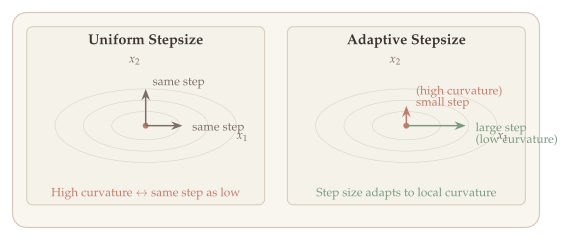{#fig-uniform-vs-adaptive}

@fig-uniform-vs-adaptive contrasts the two strategies on an elongated quadratic (elliptic contours indicate very different curvature along the two axes). With a uniform stepsize (left), the iterates zig-zag: the step is too large in the high-curvature (short-axis) direction and too small in the low-curvature (long-axis) direction. An adaptive method (right) rescales each coordinate by the inverse of its accumulated gradient magnitude, taking larger steps along the flat direction and smaller steps along the steep direction, producing a much more direct path to the optimum.

### AdaGrad (Adaptive Gradient) {#adagrad}

**Motivation.** Gradient descent uses the same step size $\alpha$ for every coordinate. But in many problems --- especially with sparse features (NLP, recommender systems) --- some coordinates receive frequent gradient updates while others are updated rarely. A coordinate that is rarely updated has accumulated less information, so we should be willing to take *larger* steps in that direction. Conversely, a frequently updated coordinate has been refined more, so smaller steps are appropriate.

AdaGrad formalizes this idea: it maintains a **per-coordinate accumulation of past squared gradients** and uses their inverse square root to scale the learning rate. Coordinates with large accumulated gradients (frequently or sharply updated) get smaller effective step sizes; coordinates with small accumulated gradients get larger ones.

::: {.callout-important}
## Algorithm: AdaGrad

At iteration $k$, let $g^k = \nabla f(x^k)$ denote the gradient. Maintain a running sum of squared gradients for each coordinate:

$$v_j^k = \sum_{\ell=1}^{k} \bigl[g_j^\ell\bigr]^2 = v_j^{k-1} + \bigl[g_j^k\bigr]^2, \qquad j = 1, \ldots, n.$$

**Update:**
$$x_j^{k+1} = x_j^k - \frac{\alpha}{\sqrt{v_j^k} + \varepsilon} \cdot g_j^k, \qquad \forall\, j \in [n],$$

where $\alpha > 0$ is the base learning rate and $\varepsilon > 0$ (e.g., $10^{-8}$) prevents division by zero.
:::

**Derivation.** The full-matrix version of AdaGrad sets $G^k = \sum_{\ell=1}^k g^\ell (g^\ell)^\top$ and updates $x^{k+1} = x^k - \alpha (G^k + \varepsilon I)^{-1/2} g^k$. The matrix $(G^k)^{-1/2}$ acts as an approximate inverse Hessian, adapting the geometry to the curvature revealed by past gradients. Since computing $(G^k)^{-1/2}$ costs $O(n^3)$, the **diagonal approximation** $v_j^k = [G^k]_{jj}$ is used in practice, reducing the cost to $O(n)$ per step.

**Properties of AdaGrad:**

- **Adaptive per-coordinate learning rates.** The effective step size for coordinate $j$ at step $k$ is $\alpha / (\sqrt{v_j^k} + \varepsilon)$. Coordinates with large accumulated gradients (high curvature or frequent updates) receive smaller steps; coordinates with small accumulated gradients receive larger steps.
- **Well-suited for sparse problems.** In NLP and recommendation, most features are zero in any given example. AdaGrad automatically gives larger updates to rare features and smaller updates to common ones, which is exactly the right behavior for learning sparse representations.
- **Monotonically decreasing step sizes.** Since $v_j^k$ only increases, the effective learning rate $\alpha / \sqrt{v_j^k}$ decreases monotonically. For convex problems, this is desirable (it mirrors a diminishing step size schedule). For nonconvex problems like neural network training, this can be **too aggressive** --- the learning rate may shrink to near zero before the model has converged, causing training to stall. This motivates RMSProp.

**In PyTorch:**

```python
optimizer = torch.optim.Adagrad(model.parameters(), lr=0.01)
```

### RMSProp (Root Mean-Square Propagation) {#rmsprop}

**Motivation.** AdaGrad's monotonically increasing denominator $v_j^k = \sum_{\ell=1}^k [g_j^\ell]^2$ is both a strength and a weakness. For convex optimization with a fixed objective, the diminishing step size guarantees convergence. But for neural network training, the loss landscape is nonstationary --- the relevant curvature changes as the network learns --- so we want the step size to *adapt* to recent curvature, not be permanently shrunk by gradients from early training.

RMSProp (proposed by Hinton in a lecture, never published as a paper) fixes this by replacing the cumulative sum with an **exponential moving average (EMA)** of squared gradients. This forgets old gradient information at a controlled rate, so the effective learning rate can increase again when recent gradients are small.

::: {.callout-important}
## Algorithm: RMSProp

Maintain an exponential moving average of squared gradients:

$$v_j^k = \beta \cdot v_j^{k-1} + (1-\beta)\,\bigl[g_j^k\bigr]^2, \qquad \beta \in (0, 1).$$

**Update:**
$$x_j^{k+1} = x_j^k - \frac{\alpha}{\sqrt{v_j^k} + \varepsilon} \cdot g_j^k, \qquad \forall\, j \in [n].$$

Typical hyperparameter: $\beta = 0.9$ (or $0.99$).
:::

**What the EMA computes.** Expanding the recursion:

$$v_j^k = (1-\beta) \sum_{\ell=1}^{k} \beta^{k-\ell} \bigl[g_j^\ell\bigr]^2.$$

This is a *weighted* average of past squared gradients, with weights that decay exponentially. The effective window length is approximately $1/(1-\beta)$: with $\beta = 0.9$, the algorithm "remembers" roughly the last 10 gradients; with $\beta = 0.99$, roughly the last 100.

**Properties of RMSProp:**

- **Non-monotonic learning rate.** Unlike AdaGrad, the effective step size $\alpha / \sqrt{v_j^k}$ can increase when recent gradients are smaller than the historical average. This makes RMSProp better suited for the nonstationary objectives encountered in deep learning.
- **Implicit curvature estimation.** Since $v_j^k \approx \mathbb{E}[(g_j^k)^2]$, dividing by $\sqrt{v_j^k}$ approximately normalizes each coordinate by its root-mean-square gradient magnitude. If coordinate $j$ has typical gradient magnitude $\sigma_j$, the effective update is $\alpha \cdot g_j^k / \sigma_j$, which has unit scale regardless of $\sigma_j$.
- **No bias correction.** RMSProp does not correct for the initialization bias when $v_j^0 = 0$ (see Adam below for the fix).

**In PyTorch:**

```python
optimizer = torch.optim.RMSprop(model.parameters(), lr=0.001, alpha=0.9)
# Note: PyTorch uses `alpha` for what we call β (the EMA decay)
```

### Adam (Adaptive Moment Estimation) {#adam}

**Motivation.** RMSProp adapts the learning rate per coordinate using second-moment information (the magnitude of recent gradients), but uses the raw gradient $g_j^k$ for the update direction. The heavy-ball method uses momentum to smooth the update direction, but with a uniform step size. **Adam** combines the best of both: it uses a first-moment EMA (momentum) for the direction and a second-moment EMA (RMSProp) for per-coordinate step size scaling.

::: {.callout-important}
## Algorithm: Adam

Initialize $m^0 = 0$, $v^0 = 0$. At each step $k = 1, 2, \ldots$:

**First moment (momentum):**
$$m_j^k = \beta_1 \cdot m_j^{k-1} + (1-\beta_1)\,g_j^k$$

**Second moment (RMSProp):**
$$v_j^k = \beta_2 \cdot v_j^{k-1} + (1-\beta_2)\,\bigl[g_j^k\bigr]^2$$

**Bias correction:**
$$\widehat{m}_j^k = \frac{m_j^k}{1 - \beta_1^k}, \qquad \widehat{v}_j^k = \frac{v_j^k}{1 - \beta_2^k}$$

**Parameter update:**
$$x_j^{k+1} = x_j^k - \alpha \cdot \frac{\widehat{m}_j^k}{\sqrt{\widehat{v}_j^k} + \varepsilon}$$ {#eq-adam-update}

Typical hyperparameters: $\beta_1 = 0.9$, $\beta_2 = 0.999$, $\varepsilon = 10^{-8}$, $\alpha = 10^{-3}$.
:::

**Why bias correction?** Both $m^k$ and $v^k$ are initialized at zero, so early iterates are biased toward zero. To see why, expand the first-moment EMA:

$$m_j^k = (1-\beta_1)\sum_{\ell=1}^{k} \beta_1^{k-\ell}\, g_j^\ell.$$

Taking expectations (assuming $\mathbb{E}[g_j^\ell] \approx \mu_j$ is roughly constant):

$$\mathbb{E}[m_j^k] = \mu_j \cdot (1-\beta_1) \sum_{\ell=1}^{k} \beta_1^{k-\ell} = \mu_j \cdot (1 - \beta_1^k).$$

This is biased: $\mathbb{E}[m_j^k] = \mu_j(1-\beta_1^k) \neq \mu_j$. Dividing by $(1-\beta_1^k)$ corrects this:

$$\mathbb{E}[\widehat{m}_j^k] = \frac{\mathbb{E}[m_j^k]}{1-\beta_1^k} = \mu_j.$$

The same argument applies to $v_j^k$ with $\beta_2$. The bias is most significant in the first few iterations (when $\beta_1^k$ and $\beta_2^k$ are not yet negligible) and vanishes as $k \to \infty$.

::: {#exm-adam-bias}
## Example: Bias Correction in Practice

With $\beta_2 = 0.999$, at step $k=1$: $v_j^1 = 0.001 \cdot [g_j^1]^2$, which underestimates the true second moment by a factor of 1000. The corrected $\widehat{v}_j^1 = v_j^1 / (1 - 0.999) = [g_j^1]^2$ recovers the unbiased estimate. By $k = 1000$: $1 - \beta_2^{1000} \approx 0.632$, so the correction is about $1.58\times$. By $k = 5000$: the correction is negligible ($\approx 1.007\times$).
:::

**Properties of Adam:**

- **Bounded effective step size.** The update $\widehat{m}_j^k / (\sqrt{\widehat{v}_j^k} + \varepsilon)$ has a natural scale. By the Cauchy--Schwarz inequality, $|\widehat{m}_j^k| \leq \sqrt{\widehat{v}_j^k}$ (since the absolute mean is at most the root-mean-square), so $|\widehat{m}_j^k / \sqrt{\widehat{v}_j^k}| \leq 1$. This means each coordinate update is bounded by $\alpha$, providing a form of **implicit gradient clipping**.
- **Scale invariance.** Multiplying all gradients by a constant $c > 0$ does not change the Adam update direction, since $\widehat{m}_j \to c\,\widehat{m}_j$ and $\sqrt{\widehat{v}_j} \to |c|\sqrt{\widehat{v}_j}$. This makes Adam robust to the scale of the loss function.
- **Default for deep learning.** Adam (and its variant AdamW) is the most widely used optimizer for training neural networks, particularly transformers. It converges well out-of-the-box with default hyperparameters.

::: {.callout-warning}
## Known Issue: Non-convergence of Adam

Adam can fail to converge even on simple convex problems. The issue is that the second-moment estimate $v_j^k$ is a *moving* average, so the effective step size can increase at inopportune times. **AMSGrad** fixes this by maintaining the running maximum of $v_j^k$: $\widehat{v}_j^k = \max(\widehat{v}_j^{k-1}, v_j^k)$, ensuring the effective learning rate is non-increasing.
:::

**In PyTorch:**

```python
optimizer = torch.optim.Adam(model.parameters(), lr=1e-3, betas=(0.9, 0.999))
```

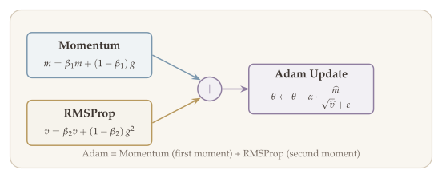{#fig-adam-components}

@fig-adam-components traces the data flow inside Adam. Each gradient $g_t$ feeds into two parallel streams: the **first-moment** estimate $m_t$ (an exponential moving average of $g_t$, the momentum branch in blue) and the **second-moment** estimate $v_t$ (an exponential moving average of $g_t^2$, the RMSProp branch in red). The update divides the bias-corrected first moment $\widehat{m}_t$ by $\sqrt{\widehat{v}_t} + \varepsilon$, so each coordinate is scaled by the inverse of its typical gradient magnitude — combining directional smoothing from momentum with per-coordinate adaptivity from RMSProp.

### Weight Decay vs. L2 Regularization {#weight-decay}

The Adam update rule (@eq-adam-update) divides each gradient component by the square root of its accumulated second moment. While this adaptive scaling is powerful for optimization, it introduces a subtle interaction with regularization that must be handled carefully. A common technique to prevent overfitting in machine learning is **L2 regularization** (also called **ridge regularization**), which adds a penalty $\frac{\lambda}{2}\|\theta\|_2^2$ to the loss:

$$\min_\theta \; \mathcal{L}(\theta) + \frac{\lambda}{2}\|\theta\|_2^2.$$

For standard SGD, L2 regularization and **weight decay** are mathematically equivalent. However, for Adam, they are *not* --- and confusing the two leads to subtle but significant training issues.

#### SGD: L2 Regularization = Weight Decay {#sgd-equivalence}

With L2 regularization, the gradient becomes $\nabla \mathcal{L}(\theta) + \lambda\theta$. The SGD update is:

$$\theta \leftarrow \theta - \alpha\bigl(\nabla \mathcal{L}(\theta) + \lambda\theta\bigr) = (1 - \alpha\lambda)\,\theta - \alpha\,\nabla \mathcal{L}(\theta).$$

With weight decay (shrinking parameters directly by a factor at each step):

$$\theta \leftarrow \theta - \alpha\,\nabla \mathcal{L}(\theta) - \alpha\lambda\,\theta = (1 - \alpha\lambda)\,\theta - \alpha\,\nabla \mathcal{L}(\theta).$$

These are identical. For SGD, "L2 regularization" and "weight decay" are two names for the same operation.

#### Adam: L2 Regularization $\neq$ Weight Decay {#adam-l2-problem}

Now apply Adam to the L2-regularized objective. The gradient is $g = \nabla \mathcal{L}(\theta) + \lambda\theta$. Adam computes:

$$m \leftarrow \beta_1 m + (1-\beta_1)\,g, \qquad v \leftarrow \beta_2 v + (1-\beta_2)\,g^2,$$
$$\theta_j \leftarrow \theta_j - \alpha \cdot \frac{\widehat{m}_j}{\sqrt{\widehat{v}_j} + \varepsilon}.$$

The weight decay term $\lambda\theta_j$ is included in $g$, so it gets divided by $\sqrt{\widehat{v}_j}$. This means:

- For parameters with **large accumulated gradients** (large $\widehat{v}_j$): the effective decay $\frac{\lambda\theta_j}{\sqrt{\widehat{v}_j}}$ is **small**.
- For parameters with **small accumulated gradients** (small $\widehat{v}_j$): the effective decay is **large**.

This is the **opposite** of what we want --- weight decay should shrink all parameters uniformly, but Adam's adaptive scaling distorts it.

::: {.callout-warning}
## The Core Problem

Adam's per-coordinate adaptive learning rate interferes with L2 regularization. The regularization penalty, which should apply uniformly to all parameters, gets non-uniformly scaled by the second moment estimate $\widehat{v}$. Frequently updated parameters receive less decay than they should, while rarely updated parameters receive more.
:::

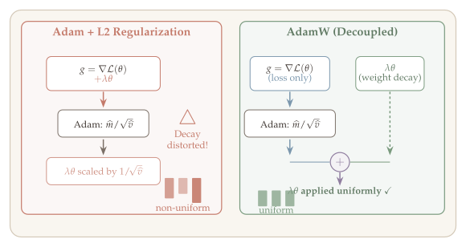{#fig-adam-l2-vs-adamw}

### AdamW (Adam with Decoupled Weight Decay) {#adamw}

::: {.callout-important}
## Algorithm: AdamW

The fix is simple: **decouple** weight decay from the gradient computation. Instead of adding $\lambda\theta$ to the gradient before Adam processes it, apply weight decay directly to the parameters *after* the Adam update.

**Updates:**
$$\begin{aligned}
g^k &= \nabla \mathcal{L}(\theta^k) & &\text{(gradient of loss only, no L2 term)} \\
m^{k+1} &= \beta_1 \cdot m^k + (1-\beta_1)\,g^k, \\
v^{k+1} &= \beta_2 \cdot v^k + (1-\beta_2)\,(g^k)^2, \\
\theta^{k+1}_j &= \theta^k_j - \alpha\,\frac{\widehat{m}^{k+1}_j}{\sqrt{\widehat{v}^{k+1}_j} + \varepsilon} - \alpha\lambda\,\theta^k_j. & &\text{(weight decay applied directly)}
\end{aligned}$$

Equivalently: $\theta^{k+1} = (1 - \alpha\lambda)\,\theta^k - \alpha\,\frac{\widehat{m}^{k+1}}{\sqrt{\widehat{v}^{k+1}} + \varepsilon}.$
:::

The key difference: in AdamW, the decay $\alpha\lambda\,\theta^k_j$ is **not** divided by $\sqrt{\widehat{v}_j}$, so all parameters are decayed at the same rate regardless of their gradient history. This recovers the intended behavior of weight decay.

::: {.callout-note appearance="simple"}
**Side-by-side comparison:**

| | Adam + L2 Reg | AdamW |
|---|---|---|
| Gradient | $g = \nabla\mathcal{L}(\theta) + \lambda\theta$ | $g = \nabla\mathcal{L}(\theta)$ |
| Decay mechanism | $\lambda\theta$ scaled by $1/\sqrt{\widehat{v}}$ | $\lambda\theta$ applied directly |
| Effective decay | Non-uniform across parameters | Uniform across parameters |
| Equivalent to SGD+WD? | No | Yes (in the limit $\beta_1, \beta_2 \to 0$) |

In practice, AdamW with weight decay $\lambda \approx 0.01$ is the default optimizer for training Transformers (GPT, BERT, etc.).
:::

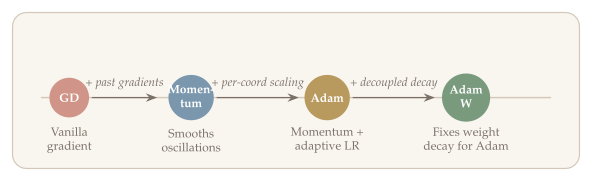{#fig-optimizer-timeline}

```{=html}
<style>
  .beale-fig-container {
    font-family: 'Palatino Linotype', 'Palatino', 'Book Antiqua', 'Georgia', serif;
    background: #f0ebe5; border-radius: 8px; padding: 24px 20px 16px 20px;
    margin: 28px auto; max-width: 1100px;
    box-shadow: 0 2px 12px rgba(61,53,48,0.08);
  }
  .beale-fig-container h3 {
    color: #3d3530; font-size: 1.15em; font-weight: 600; margin: 0 0 6px 0;
  }
  .beale-fig-container .fig-subtitle {
    color: #968a80; font-size: 0.92em; margin: 0 0 12px 0; line-height: 1.5;
  }
  .beale-fig-container .info-box {
    background: #faf7f3; border-left: 3px solid #7b97ad; border-radius: 0 4px 4px 0;
    padding: 10px 14px; margin: 10px 0 4px 0; font-size: 0.88em; color: #3d3530; line-height: 1.6;
  }
  .beale-slider-row {
    display: flex; gap: 20px; flex-wrap: wrap; align-items: center;
    margin: 0 0 14px 0; padding: 10px 14px; background: #faf7f3;
    border-radius: 6px; border: 1px solid #e0d9d1;
  }
  .beale-slider-row label {
    font-size: 0.92em; color: #3d3530; font-weight: 600; white-space: nowrap;
  }
  .beale-slider-row input[type=range] { width: 150px; accent-color: #7b97ad; cursor: pointer; }
  .beale-slider-row .lr-val {
    font-family: 'JetBrains Mono', monospace; font-size: 0.88em; color: #7b7067; min-width: 44px;
  }
</style>

<div class="beale-fig-container">
  <h3>Interactive: Adaptive Methods on the Beale Function</h3>
  <p class="fig-subtitle">
    f(x,y) = (1.5 &minus; x + xy)&sup2; + (2.25 &minus; x + xy&sup2;)&sup2; + (2.625 &minus; x + xy&sup3;)&sup2;
    &emsp;|&emsp; Minimum at (3, 0.5) &emsp;|&emsp; Start: (1, 1)
  </p>
  <div class="beale-slider-row">
    <label>AdaGrad &alpha;:</label>
    <input type="range" id="bl-ada" min="-2.5" max="0.5" step="0.05" value="-1">
    <span class="lr-val" id="bl-ada-val">0.10</span>
    <span style="width:16px"></span>
    <label>Others &alpha;:</label>
    <input type="range" id="bl-shared" min="-3" max="-0.5" step="0.05" value="-2">
    <span class="lr-val" id="bl-shared-val">0.010</span>
    <span style="width:16px"></span>
    <label>Iterations:</label>
    <input type="range" id="bl-niter" min="50" max="2000" step="50" value="500">
    <span class="lr-val" id="bl-niter-val">500</span>
  </div>
  <div style="display:flex;gap:12px;flex-wrap:wrap;">
    <div id="beale-traj" style="flex:1.2;min-width:440px;"></div>
    <div id="beale-obj" style="flex:1;min-width:340px;"></div>
  </div>
  <div class="info-box">
    <b>Left:</b> Trajectories on the Beale function contour.
    <b>Right:</b> Objective value vs. iteration (log scale).
    <b>Try:</b> Give AdaGrad a much larger &alpha; (e.g.&nbsp;1.0) &mdash; its self-regulating denominator keeps it stable.
    Heavy-Ball with momentum converges fastest at these default settings.
  </div>
</div>

<script>
(function() {
  var C = {
    bg: '#f0ebe5', plotBg: '#faf7f3', text: '#3d3530', grid: '#e0d9d1',
    axis: '#968a80', blue: '#7b97ad', gold: '#b8995e', sage: '#7a9a7e',
    terracotta: '#c47a6a', lavender: '#907ea0', rosewood: '#ad8480'
  };
  var font = {family: "'Palatino Linotype','Palatino','Book Antiqua','Georgia',serif", color: C.text};
  var plotCfg = {displayModeBar: false, responsive: true};
  var eps = 1e-8, beta1 = 0.9, beta2 = 0.999, gamma_rms = 0.9, gamma_hb = 0.9;
  var x0 = [1.0, 1.0], xstar = [3.0, 0.5];

  function beale(x) {
    var a = x[0], b = x[1];
    return Math.pow(1.5 - a + a*b, 2) + Math.pow(2.25 - a + a*b*b, 2) + Math.pow(2.625 - a + a*b*b*b, 2);
  }
  function bealeGrad(x) {
    var a = x[0], b = x[1];
    var g0 = 2*(1.5-a+a*b)*(-1+b) + 2*(2.25-a+a*b*b)*(-1+b*b) + 2*(2.625-a+a*b*b*b)*(-1+b*b*b);
    var g1 = 2*(1.5-a+a*b)*a + 2*(2.25-a+a*b*b)*(2*a*b) + 2*(2.625-a+a*b*b*b)*(3*a*b*b);
    return [g0, g1];
  }

  function runGD(alpha, N) {
    var path = [[x0[0],x0[1]]], obj = [beale(x0)], x = [x0[0],x0[1]];
    for (var k = 0; k < N; k++) {
      var g = bealeGrad(x);
      x = [x[0]-alpha*g[0], x[1]-alpha*g[1]];
      path.push([x[0],x[1]]); obj.push(beale(x));
      if (!isFinite(obj[obj.length-1])) break;
    }
    return {path:path, obj:obj};
  }
  function runAdaGrad(alpha, N) {
    var path = [[x0[0],x0[1]]], obj = [beale(x0)], x = [x0[0],x0[1]], v = [0,0];
    for (var k = 0; k < N; k++) {
      var g = bealeGrad(x);
      v[0] += g[0]*g[0]; v[1] += g[1]*g[1];
      x = [x[0]-alpha*g[0]/(Math.sqrt(v[0])+eps), x[1]-alpha*g[1]/(Math.sqrt(v[1])+eps)];
      path.push([x[0],x[1]]); obj.push(beale(x));
      if (!isFinite(obj[obj.length-1])) break;
    }
    return {path:path, obj:obj};
  }
  function runRMSProp(alpha, N) {
    var path = [[x0[0],x0[1]]], obj = [beale(x0)], x = [x0[0],x0[1]], v = [0,0];
    for (var k = 0; k < N; k++) {
      var g = bealeGrad(x);
      v[0] = gamma_rms*v[0]+(1-gamma_rms)*g[0]*g[0]; v[1] = gamma_rms*v[1]+(1-gamma_rms)*g[1]*g[1];
      x = [x[0]-alpha*g[0]/(Math.sqrt(v[0])+eps), x[1]-alpha*g[1]/(Math.sqrt(v[1])+eps)];
      path.push([x[0],x[1]]); obj.push(beale(x));
      if (!isFinite(obj[obj.length-1])) break;
    }
    return {path:path, obj:obj};
  }
  function runAdam(alpha, N) {
    var path = [[x0[0],x0[1]]], obj = [beale(x0)], x = [x0[0],x0[1]], m=[0,0], v=[0,0];
    for (var k = 0; k < N; k++) {
      var g = bealeGrad(x);
      m[0]=beta1*m[0]+(1-beta1)*g[0]; m[1]=beta1*m[1]+(1-beta1)*g[1];
      v[0]=beta2*v[0]+(1-beta2)*g[0]*g[0]; v[1]=beta2*v[1]+(1-beta2)*g[1]*g[1];
      var bc1=1-Math.pow(beta1,k+1), bc2=1-Math.pow(beta2,k+1);
      var mh0=m[0]/bc1,mh1=m[1]/bc1,vh0=v[0]/bc2,vh1=v[1]/bc2;
      x = [x[0]-alpha*mh0/(Math.sqrt(vh0)+eps), x[1]-alpha*mh1/(Math.sqrt(vh1)+eps)];
      path.push([x[0],x[1]]); obj.push(beale(x));
      if (!isFinite(obj[obj.length-1])) break;
    }
    return {path:path, obj:obj};
  }
  function runHB(alpha, N) {
    var path = [[x0[0],x0[1]]], obj = [beale(x0)], x = [x0[0],x0[1]], vp = [0,0];
    for (var k = 0; k < N; k++) {
      var g = bealeGrad(x);
      var d0 = -alpha*g[0]+gamma_hb*vp[0], d1 = -alpha*g[1]+gamma_hb*vp[1];
      x = [x[0]+d0, x[1]+d1]; vp = [d0, d1];
      path.push([x[0],x[1]]); obj.push(beale(x));
      if (!isFinite(obj[obj.length-1])) break;
    }
    return {path:path, obj:obj};
  }

  /* Contour data for Beale (computed once) */
  var nx=100, ny=100, xr=[-0.5,3.8], yr=[-0.8,1.8];
  var xv=[],yv=[],zv=[];
  for (var j=0;j<ny;j++){
    var row=[],yval=yr[0]+(yr[1]-yr[0])*j/(ny-1);
    if(j===0){for(var i=0;i<nx;i++) xv.push(xr[0]+(xr[1]-xr[0])*i/(nx-1));}
    yv.push(yval);
    for(var i=0;i<nx;i++) row.push(Math.log10(beale([xv[i],yval])+1e-10));
    zv.push(row);
  }

  var axS={gridcolor:C.grid,zerolinecolor:C.axis,linecolor:C.axis,
    tickfont:{size:11,family:font.family,color:font.color},
    titlefont:{size:13,family:font.family,color:font.color}};

  function buildPlots(aAda,aShared,N) {
    var gd=runGD(aShared,N),ada=runAdaGrad(aAda,N),rms=runRMSProp(aShared,N),adam=runAdam(aShared,N),hb=runHB(aShared,N);
    var px=function(p){return p[0];},py=function(p){return p[1];};
    var trajTraces=[
      {x:xv,y:yv,z:zv,type:'contour',
       colorscale:[[0,'#ffffff'],[0.2,'#e8f0f8'],[0.4,'#cde0ef'],[0.7,'#a8c8df'],[1,'#7eaecb']],
       contours:{start:-1,end:4,size:0.3}, line:{color:'#b0c8d8',width:0.8},showscale:false,hoverinfo:'skip',name:''},
      {x:gd.path.map(px),y:gd.path.map(py),mode:'lines+markers',
       line:{color:'#d45d5d',width:2.5},marker:{size:3},name:'GD'},
      {x:ada.path.map(px),y:ada.path.map(py),mode:'lines+markers',
       line:{color:'#e67e22',width:2.5},marker:{size:3},name:'AdaGrad'},
      {x:rms.path.map(px),y:rms.path.map(py),mode:'lines+markers',
       line:{color:'#2e86c1',width:2.5},marker:{size:3},name:'RMSProp'},
      {x:adam.path.map(px),y:adam.path.map(py),mode:'lines+markers',
       line:{color:'#27ae60',width:2.5},marker:{size:3},name:'Adam'},
      {x:hb.path.map(px),y:hb.path.map(py),mode:'lines+markers',
       line:{color:'#8e44ad',width:2.5},marker:{size:3},name:'Heavy-Ball'},
      {x:[x0[0]],y:[x0[1]],mode:'markers',
       marker:{size:11,color:'#e67e22',symbol:'diamond',line:{width:2,color:'white'}},showlegend:false,name:'start'},
      {x:[xstar[0]],y:[xstar[1]],mode:'markers',
       marker:{size:10,color:'#2c3e50',symbol:'star',line:{width:2,color:'white'}},name:'x\u2217'}
    ];

    var maxIter=Math.max(gd.obj.length,ada.obj.length,rms.obj.length,adam.obj.length,hb.obj.length);
    var iters=function(arr){return Array.from({length:arr.length},function(_,i){return i;});};
    var objTraces=[
      {x:iters(gd.obj),y:gd.obj,mode:'lines',line:{color:'#d45d5d',width:2},name:'GD',showlegend:false},
      {x:iters(ada.obj),y:ada.obj,mode:'lines',line:{color:'#e67e22',width:2},name:'AdaGrad',showlegend:false},
      {x:iters(rms.obj),y:rms.obj,mode:'lines',line:{color:'#2e86c1',width:2},name:'RMSProp',showlegend:false},
      {x:iters(adam.obj),y:adam.obj,mode:'lines',line:{color:'#27ae60',width:2},name:'Adam',showlegend:false},
      {x:iters(hb.obj),y:hb.obj,mode:'lines',line:{color:'#8e44ad',width:2},name:'Heavy-Ball',showlegend:false}
    ];
    return {trajTraces:trajTraces,objTraces:objTraces};
  }

  var layoutTraj={
    paper_bgcolor:C.bg,plot_bgcolor:C.plotBg,font:font,height:460,
    margin:{t:30,b:50,l:50,r:10},
    title:{text:'Trajectories on Beale Contour',font:{size:14,family:font.family,color:C.text}},
    xaxis:Object.assign({},axS,{title:'x',range:xr}),
    yaxis:Object.assign({},axS,{title:'y',range:yr}),
    showlegend:true,
    legend:{x:0.01,y:0.99,bgcolor:'rgba(250,247,243,0.9)',bordercolor:C.grid,borderwidth:1,
            font:{size:11,family:font.family,color:font.color}},
    hovermode:'closest'
  };
  var layoutObj={
    paper_bgcolor:C.bg,plot_bgcolor:C.plotBg,font:font,height:460,
    margin:{t:30,b:50,l:55,r:10},
    title:{text:'Objective Value',font:{size:14,family:font.family,color:C.text}},
    xaxis:Object.assign({},axS,{title:'Iteration'}),
    yaxis:Object.assign({},axS,{title:'f(x,y)',type:'log'}),
    showlegend:false,hovermode:'closest'
  };

  var initAda=Math.pow(10,-1), initShared=Math.pow(10,-2), initN=500;
  var p=buildPlots(initAda,initShared,initN);
  Plotly.newPlot('beale-traj',p.trajTraces,layoutTraj,plotCfg);
  Plotly.newPlot('beale-obj',p.objTraces,layoutObj,plotCfg);

  var slAda=document.getElementById('bl-ada'),slShared=document.getElementById('bl-shared'),slN=document.getElementById('bl-niter');
  var slAdaV=document.getElementById('bl-ada-val'),slSharedV=document.getElementById('bl-shared-val'),slNV=document.getElementById('bl-niter-val');
  function fmt(v){return v>=0.1?v.toFixed(2):v>=0.01?v.toFixed(3):v.toExponential(1);}
  function update(){
    var aA=Math.pow(10,parseFloat(slAda.value)),aS=Math.pow(10,parseFloat(slShared.value)),N=parseInt(slN.value);
    slAdaV.textContent=fmt(aA); slSharedV.textContent=fmt(aS); slNV.textContent=N;
    var q=buildPlots(aA,aS,N);
    /* update trajectory traces 1-5 */
    var tx=[],ty=[],ti=[];
    for(var i=1;i<=5;i++){tx.push(q.trajTraces[i].x);ty.push(q.trajTraces[i].y);ti.push(i);}
    Plotly.restyle('beale-traj',{x:tx,y:ty},ti);
    /* update objective traces */
    var ox=[],oy=[],oi=[];
    for(var i=0;i<5;i++){ox.push(q.objTraces[i].x);oy.push(q.objTraces[i].y);oi.push(i);}
    Plotly.restyle('beale-obj',{x:ox,y:oy},oi);
  }
  slAda.addEventListener('input',update);
  slShared.addEventListener('input',update);
  slN.addEventListener('input',update);
})();
</script>
```


```{=html}
<style>
  .gd-osc-container {
    font-family: 'Palatino Linotype', 'Palatino', 'Book Antiqua', 'Georgia', serif;
    background: #f0ebe5; border-radius: 8px; padding: 24px 20px 16px 20px;
    margin: 28px auto; max-width: 750px;
    box-shadow: 0 2px 12px rgba(61,53,48,0.08);
  }
  .gd-osc-container h3 {
    color: #3d3530; font-size: 1.15em; font-weight: 600; margin: 0 0 6px 0;
  }
  .gd-osc-container .fig-subtitle {
    color: #968a80; font-size: 0.92em; margin: 0 0 12px 0; line-height: 1.5;
  }
  .gd-osc-container .info-box {
    background: #faf7f3; border-left: 3px solid #c47a6a; border-radius: 0 4px 4px 0;
    padding: 10px 14px; margin: 10px 0 4px 0; font-size: 0.88em; color: #3d3530; line-height: 1.6;
  }
  .gd-osc-slider-row {
    display: flex; gap: 20px; flex-wrap: wrap; align-items: center;
    margin: 0 0 14px 0; padding: 10px 14px; background: #faf7f3;
    border-radius: 6px; border: 1px solid #e0d9d1;
  }
  .gd-osc-slider-row label {
    font-size: 0.92em; color: #3d3530; font-weight: 600; white-space: nowrap;
  }
  .gd-osc-slider-row input[type=range] { width: 140px; accent-color: #d45d5d; cursor: pointer; }
  .gd-osc-slider-row .sl-val {
    font-family: 'JetBrains Mono', monospace; font-size: 0.88em; color: #7b7067; min-width: 40px;
  }
</style>

<div class="gd-osc-container">
  <h3>Interactive: Gradient Descent Oscillation on Quadratics</h3>
  <p class="fig-subtitle">
    f(x) = &frac12; x<sup>T</sup>Ax, &ensp; A = diag(1, &lambda;<sub>max</sub>)
    &emsp;|&emsp; Start: (&minus;5, 5) &emsp;|&emsp; 60 iterations
  </p>
  <div class="gd-osc-slider-row">
    <label>Learning rate &alpha;:</label>
    <input type="range" id="osc-lr" min="-3" max="-0.3" step="0.02" value="-1.3">
    <span class="sl-val" id="osc-lr-val">0.050</span>
    <span style="width:16px"></span>
    <label>&lambda;<sub>max</sub> (condition number):</label>
    <input type="range" id="osc-kappa" min="2" max="100" step="1" value="20">
    <span class="sl-val" id="osc-kappa-val">20</span>
  </div>
  <div id="gd-osc-plot" style="width:100%;"></div>
  <div class="info-box">
    GD oscillates along the high-curvature direction (x<sub>2</sub>) while making slow progress along x<sub>1</sub>.
    Increasing &kappa; = &lambda;<sub>max</sub> makes oscillation worse.
    The optimal step size &alpha; = 2/(&lambda;<sub>min</sub> + &lambda;<sub>max</sub>) minimizes this zigzag.
    <b>Try:</b> set &alpha; near 2/&lambda;<sub>max</sub> to see the oscillation vanish &mdash; but convergence along x<sub>1</sub> slows dramatically.
  </div>
</div>

<script>
(function() {
  var C = {
    bg: '#f0ebe5', plotBg: '#faf7f3', text: '#3d3530', grid: '#e0d9d1',
    axis: '#968a80', blue: '#7b97ad', sage: '#7a9a7e', terracotta: '#c47a6a', rosewood: '#ad8480'
  };
  var font = {family: "'Palatino Linotype','Palatino','Book Antiqua','Georgia',serif", color: C.text};
  var plotCfg = {displayModeBar: false, responsive: true};
  var x0 = [-5, 5], nIter = 60;

  function runGD(alpha, lmax) {
    var path = [[x0[0], x0[1]]], x = [x0[0], x0[1]];
    for (var k = 0; k < nIter; k++) {
      var g0 = 1 * x[0], g1 = lmax * x[1];
      x = [x[0] - alpha * g0, x[1] - alpha * g1];
      if (Math.abs(x[0]) > 1e8 || Math.abs(x[1]) > 1e8) {
        for (var j = k + 1; j < nIter; j++) path.push([NaN, NaN]);
        break;
      }
      path.push([x[0], x[1]]);
    }
    return path;
  }

  function buildContour(lmax) {
    var nx = 60, ny = 60, xr = [-6, 6], yr = [-6, 6];
    var xv = [], yv = [], zv = [];
    for (var j = 0; j < ny; j++) {
      var row = [], yval = yr[0] + (yr[1] - yr[0]) * j / (ny - 1);
      if (j === 0) { for (var i = 0; i < nx; i++) xv.push(xr[0] + (xr[1] - xr[0]) * i / (nx - 1)); }
      yv.push(yval);
      for (var i = 0; i < nx; i++) row.push(0.5 * (xv[i] * xv[i] + lmax * yval * yval));
      zv.push(row);
    }
    return {xv: xv, yv: yv, zv: zv};
  }

  var axS = {gridcolor: C.grid, zerolinecolor: C.axis, linecolor: C.axis,
    tickfont: {size: 11, family: font.family, color: font.color},
    titlefont: {size: 13, family: font.family, color: font.color}};

  function build(alpha, lmax) {
    var c = buildContour(lmax);
    var path = runGD(alpha, lmax);
    var px = function(p) { return p[0]; }, py = function(p) { return p[1]; };
    /* Also show the optimal-LR trajectory for comparison */
    var alphaOpt = 2.0 / (1 + lmax);
    var pathOpt = runGD(alphaOpt, lmax);

    return [
      {x: c.xv, y: c.yv, z: c.zv, type: 'contour',
       colorscale: [[0,'#ffffff'],[0.2,'#e8f0f8'],[0.4,'#cde0ef'],[0.7,'#a8c8df'],[1,'#7eaecb']],
       contours: {start: 1, end: 200, size: 15}, line: {color: '#b0c8d8', width: 0.8}, showscale: false, hoverinfo: 'skip', name: ''},
      {x: path.map(px), y: path.map(py), mode: 'lines+markers',
       line: {color: '#d45d5d', width: 2.5}, marker: {size: 3.5}, name: 'Your \u03B1'},
      {x: pathOpt.map(px), y: pathOpt.map(py), mode: 'lines+markers',
       line: {color: '#27ae60', width: 2.5, dash: 'dash'}, marker: {size: 3},
       name: 'Optimal \u03B1 = 2/(\u03BB\u2081+\u03BB\u2082)'},
      {x: [x0[0]], y: [x0[1]], mode: 'markers',
       marker: {size: 11, color: '#e67e22', symbol: 'diamond', line: {width: 2, color: 'white'}}, showlegend: false},
      {x: [0], y: [0], mode: 'markers',
       marker: {size: 10, color: '#2c3e50', symbol: 'star', line: {width: 2, color: 'white'}}, name: 'x\u2217'}
    ];
  }

  var layout = {
    paper_bgcolor: C.bg, plot_bgcolor: C.plotBg, font: font, height: 480,
    margin: {t: 20, b: 50, l: 50, r: 10},
    xaxis: Object.assign({}, axS, {title: 'x\u2081 (low curvature)', range: [-6, 6]}),
    yaxis: Object.assign({}, axS, {title: 'x\u2082 (high curvature)', range: [-6, 6], scaleanchor: 'x'}),
    showlegend: true,
    legend: {x: 0.55, y: 0.99, bgcolor: 'rgba(250,247,243,0.9)', bordercolor: C.grid, borderwidth: 1,
             font: {size: 11, family: font.family, color: font.color}},
    hovermode: 'closest'
  };

  var initLR = Math.pow(10, -1.3), initKappa = 20;
  Plotly.newPlot('gd-osc-plot', build(initLR, initKappa), layout, plotCfg);

  var slLR = document.getElementById('osc-lr'), slK = document.getElementById('osc-kappa');
  var slLRV = document.getElementById('osc-lr-val'), slKV = document.getElementById('osc-kappa-val');
  function fmt(v) { return v >= 0.1 ? v.toFixed(2) : v >= 0.01 ? v.toFixed(3) : v.toExponential(1); }
  function update() {
    var a = Math.pow(10, parseFloat(slLR.value)), lmax = parseInt(slK.value);
    slLRV.textContent = fmt(a); slKV.textContent = lmax;
    var traces = build(a, lmax);
    /* Update contour (index 0) and trajectories (1-2) */
    Plotly.restyle('gd-osc-plot', {x: [traces[0].x], y: [traces[0].y], z: [traces[0].z]}, [0]);
    Plotly.restyle('gd-osc-plot', {
      x: [traces[1].x, traces[2].x], y: [traces[1].y, traces[2].y],
      name: [traces[1].name, traces[2].name]
    }, [1, 2]);
  }
  slLR.addEventListener('input', update);
  slK.addEventListener('input', update);
})();
</script>
```

```{=html}
<div id="fig-convergence-rates" style="width:100%;max-width:700px;margin:auto;"></div>
<p class="figure-caption" style="text-align:center;margin-top:0.5em;">Figure 7.1: Convergence rates of GD vs. Heavy-Ball momentum. The <em>O</em>(√κ log 1/ε) complexity of momentum is a significant improvement over <em>O</em>(κ log 1/ε) for GD.</p>
<script>
(function() {
  const M_ = 20, m_ = 1, kappa = 20;
  const nIt = 80;
  const x0 = [5, 5];

  const alphaGD = 2/(m_+M_);
  const alphaHB = Math.pow(2/(Math.sqrt(m_)+Math.sqrt(M_)), 2);
  const betaHB = Math.pow((Math.sqrt(kappa)-1)/(Math.sqrt(kappa)+1), 2);
  const alphaNAG = 1.0/M_;
  const betaNAG = (Math.sqrt(kappa)-1)/(Math.sqrt(kappa)+1);

  function gdTraj(M, m, x0, alpha, nIter) {
    const path = [[x0[0], x0[1]]];
    let x = [x0[0], x0[1]];
    for (let i = 0; i < nIter; i++) {
      x = [x[0] - alpha * M * x[0], x[1] - alpha * m * x[1]];
      path.push([x[0], x[1]]);
    }
    return path;
  }

  function hbTraj(M, m, x0, alpha, beta, nIter) {
    const path = [[x0[0], x0[1]]];
    let x = [x0[0], x0[1]], xp = [x0[0], x0[1]];
    for (let i = 0; i < nIter; i++) {
      const xn = [
        x[0] - alpha * M * x[0] + beta * (x[0] - xp[0]),
        x[1] - alpha * m * x[1] + beta * (x[1] - xp[1])
      ];
      xp = x; x = xn;
      path.push([x[0], x[1]]);
    }
    return path;
  }

  const gdP = gdTraj(M_, m_, x0, alphaGD, nIt);
  const gdF = gdP.map(p => 0.5*(M_*p[0]*p[0] + m_*p[1]*p[1]));

  const hbP = hbTraj(M_, m_, x0, alphaHB, betaHB, nIt);
  const hbF = hbP.map(p => 0.5*(M_*p[0]*p[0] + m_*p[1]*p[1]));

  // NAG
  let x = [x0[0], x0[1]], xp = [x0[0], x0[1]];
  const nagF = [0.5*(M_*x[0]*x[0] + m_*x[1]*x[1])];
  for (let i = 0; i < nIt; i++) {
    const y0 = x[0]+betaNAG*(x[0]-xp[0]);
    const y1 = x[1]+betaNAG*(x[1]-xp[1]);
    const xn = [y0-alphaNAG*M_*y0, y1-alphaNAG*m_*y1];
    xp = x; x = xn;
    nagF.push(0.5*(M_*x[0]*x[0]+m_*x[1]*x[1]));
  }

  const iters = Array.from({length: nIt+1}, (_, i) => i);

  var Cc = {bg:'#f0ebe5',plotBg:'#faf7f3',text:'#3d3530',grid:'#e0d9d1',axis:'#968a80',blue:'#7b97ad',sage:'#7a9a7e',rosewood:'#ad8480'};
  var fontc = {family:"'Palatino Linotype','Palatino','Book Antiqua','Georgia',serif",color:Cc.text};

  const traces = [
    {x: iters, y: gdF.map(v => Math.max(v, 1e-16)), mode: 'lines',
      line: {color: Cc.rosewood, width: 2.5}, name: 'GD: O(\u03BA log 1/\u03B5)'},
    {x: iters, y: hbF.map(v => Math.max(Math.abs(v), 1e-16)), mode: 'lines',
      line: {color: Cc.blue, width: 2.5}, name: 'Heavy-Ball: O(\u221A\u03BA log 1/\u03B5)'},
    {x: iters, y: nagF.map(v => Math.max(Math.abs(v), 1e-16)), mode: 'lines',
      line: {color: Cc.sage, width: 2.5}, name: 'Nesterov: O(\u221A\u03BA log 1/\u03B5)'},
  ];

  var axStyleC = {gridcolor:Cc.grid,zerolinecolor:Cc.axis,linecolor:Cc.axis,tickfont:{size:12,family:fontc.family,color:fontc.color},titlefont:{size:14,family:fontc.family,color:fontc.color}};

  const layout = {
    paper_bgcolor: Cc.bg, plot_bgcolor: Cc.plotBg, font: fontc,
    xaxis: Object.assign({}, axStyleC, {title: 'Iteration k', range: [0, nIt]}),
    yaxis: Object.assign({}, axStyleC, {title: 'f(x\u1D4F)', type: 'log', range: [-10, 3]}),
    showlegend: true,
    legend: {x: 0.4, y: 0.98, bgcolor: 'rgba(250,247,243,0.85)', bordercolor: Cc.grid, borderwidth: 1, font: {size: 12, family: fontc.family, color: fontc.color}},
    margin: {t: 20, b: 50, l: 65, r: 20},
    width: 700, height: 500,
    hovermode: 'closest'
  };

  Plotly.newPlot('fig-convergence-rates', traces, layout, {responsive: true, displayModeBar: false});
})();
</script>
```

::: {.callout-note appearance="simple"}
**Summary of iteration complexities** (strongly convex quadratics):

- **Gradient Descent:** $O\!\bigl(\kappa \cdot \log(1/\varepsilon)\bigr)$
- **Heavy-Ball Momentum:** $O\!\bigl(\sqrt{\kappa} \cdot \log(1/\varepsilon)\bigr)$
- **Nesterov's Accelerated Gradient:** $O\!\bigl(\sqrt{\kappa} \cdot \log(1/\varepsilon)\bigr)$
- **AdaGrad / RMSProp / Adam:** Widely used in practice; convergence theory is more nuanced.
:::

## Using Adam and AdamW in PyTorch {#pytorch-optimizers}

The optimizers described in this chapter are implemented in PyTorch's `torch.optim` module. Here we show the standard training pattern using Adam and AdamW --- the two most widely used optimizers for modern deep learning.

### Basic Training Loop {#basic-training-loop}

The PyTorch training loop follows a three-step pattern: (1) compute the loss, (2) backpropagate gradients, (3) update parameters.

```python
import torch
import torch.nn as nn

# Define model and data
model = nn.Sequential(
    nn.Linear(784, 256),
    nn.ReLU(),
    nn.Linear(256, 10)
)
loss_fn = nn.CrossEntropyLoss()

# Create optimizer — AdamW is the recommended default
optimizer = torch.optim.AdamW(
    model.parameters(),
    lr=1e-3,            # base learning rate α
    betas=(0.9, 0.999), # (β₁, β₂): momentum and RMSProp decay
    weight_decay=0.01   # decoupled weight decay λ
)

# Training loop
for epoch in range(num_epochs):
    for X_batch, y_batch in dataloader:
        loss = loss_fn(model(X_batch), y_batch)  # forward pass
        optimizer.zero_grad()   # clear old gradients
        loss.backward()         # compute ∇L(θ) via backpropagation
        optimizer.step()        # θ ← θ - α · m̂/(√v̂ + ε) - αλθ
```

### Combining with Learning Rate Schedules {#lr-schedule-pytorch}

In practice, Adam/AdamW is almost always combined with a learning rate schedule (see [Chapter 6](06-gradient-descent.qmd) for the theory). PyTorch provides schedulers that adjust $\alpha$ over training:

```python
from torch.optim.lr_scheduler import CosineAnnealingLR, LinearLR, SequentialLR

optimizer = torch.optim.AdamW(model.parameters(), lr=1e-3, weight_decay=0.01)

# Warmup for 1000 steps, then cosine decay
warmup = LinearLR(optimizer, start_factor=0.01, total_iters=1000)
cosine = CosineAnnealingLR(optimizer, T_max=50000)
scheduler = SequentialLR(optimizer, [warmup, cosine], milestones=[1000])

for step, (X, y) in enumerate(dataloader):
    loss = loss_fn(model(X), y)
    optimizer.zero_grad()
    loss.backward()
    optimizer.step()
    scheduler.step()  # update learning rate after each step
```

### Per-Parameter-Group Configuration {#param-groups}

For large models, different parts of the network often benefit from different hyperparameters. A common pattern is to **exclude bias and normalization parameters from weight decay** (since shrinking biases toward zero is rarely desirable):

```python
# Separate parameters into two groups
decay_params = [p for name, p in model.named_parameters()
                if p.ndim >= 2]              # weight matrices
no_decay_params = [p for name, p in model.named_parameters()
                   if p.ndim < 2]             # biases, LayerNorm

optimizer = torch.optim.AdamW([
    {"params": decay_params, "weight_decay": 0.01},
    {"params": no_decay_params, "weight_decay": 0.0}
], lr=1e-3, betas=(0.9, 0.999))
```

This configuration is standard for training transformers (GPT, BERT, ViT) and is used by virtually all large language model training codebases.

::: {.callout-tip}
## Practical Guidelines for Choosing an Optimizer

| Scenario | Recommended optimizer | Typical hyperparameters |
|---|---|---|
| **Transformers / LLMs** | AdamW + cosine schedule + warmup | $\alpha = 10^{-4}$--$10^{-3}$, $\beta_1 = 0.9$, $\beta_2 = 0.95$, WD $= 0.1$ |
| **CNNs (ResNet, etc.)** | SGD + momentum + StepLR | $\alpha = 0.1$, $\beta = 0.9$, WD $= 10^{-4}$ |
| **Fine-tuning pretrained models** | AdamW + small LR | $\alpha = 10^{-5}$--$10^{-4}$, WD $= 0.01$ |
| **Sparse / NLP (classical)** | AdaGrad | $\alpha = 0.01$--$0.1$ |
| **General-purpose default** | AdamW | $\alpha = 10^{-3}$, default $\beta$s, WD $= 0.01$ |
:::

---

## Modern Matrix Optimizers {#sec-matrix-optimizers}

The adaptive methods above --- AdaGrad, RMSProp, Adam --- adjust the learning rate *per coordinate*, using diagonal approximations to the gradient's second-moment matrix. This works well when the important curvature information is captured by per-coordinate variance. But training deep neural networks involves optimizing over **matrix-shaped parameters** --- the weight matrices $W \in \mathbb{R}^{m \times n}$ in every linear layer. Standard optimizers treat these matrices as flat vectors of $mn$ numbers, ignoring their rich structure. Recent advances have shown that exploiting the matrix geometry of parameters --- through spectral norms, SVD-based updates, and Kronecker-factored preconditioners --- can dramatically accelerate training while remaining firmly first-order methods (no Hessian computation required). This section develops the theory behind these modern optimizers and connects them to the steepest descent framework from [Chapter 6](06-gradient-descent.qmd).

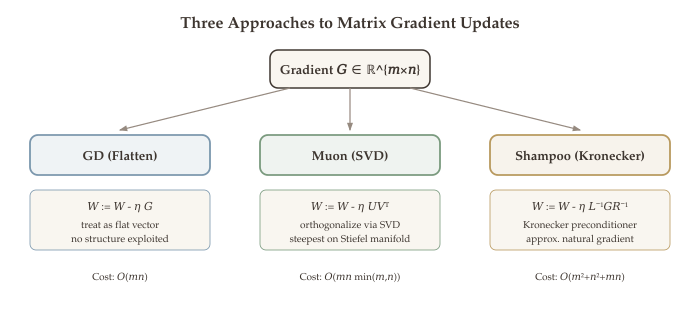{#fig-optimizer-branches}

### The Steepest Descent Framework for Matrices {#sec-matrix-steepest-descent}

Recall from [Chapter 6](06-gradient-descent.qmd) the steepest descent framework: given a norm $\|\cdot\|$, the steepest descent direction solves

$$\min_{d:\,\|d\| \leq 1} \;\langle \nabla f(x),\, d \rangle.$$ {#eq-steepest-descent-general}

Different norms yield different algorithms. For **vector** parameters, we established:

| Norm | Steepest descent direction | Algorithm |
|---|---|---|
| $\ell_2$ | $-\nabla f / \|\nabla f\|_2$ | Gradient descent |
| $\ell_1$ | $-e_j \cdot \text{sign}(\partial_j f)$ | Coordinate descent |
| $\ell_\infty$ | $-\text{sign}(\nabla f)$ | Sign gradient descent |
| Hessian ($\|\cdot\|_{\nabla^2 f}$) | $-[\nabla^2 f]^{-1} \nabla f$ | Newton's method |

For **matrix** parameters $W \in \mathbb{R}^{m \times n}$, the gradient $G = \nabla_W \mathcal{L}$ is also a matrix, and we can choose among several matrix norms:

| Norm | Definition | Steepest descent direction | Algorithm |
|---|---|---|---|
| Frobenius $\|D\|_F$ | $\sqrt{\sum_{ij} D_{ij}^2}$ | $-G / \|G\|_F$ | Gradient descent |
| Spectral $\|D\|_{\text{op}}$ | $\sigma_{\max}(D)$ | $-UV^\top$ (from SVD of $G$) | **Muon** |

The Frobenius norm treats the matrix as a flat vector --- it is simply the $\ell_2$ norm of $\text{vec}(W)$. The spectral norm is sensitive to the singular value structure, leading to qualitatively different update directions.

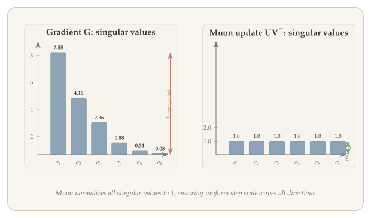{#fig-frobenius-vs-spectral}

### Muon: Steepest Descent under the Spectral Norm {#sec-muon}

The steepest descent framework (@eq-steepest-descent-general) tells us that the choice of norm determines the update direction. We now work out what happens when we choose the spectral (operator) norm for matrix parameters --- this leads to the Muon optimizer. Given a matrix parameter $W$ with gradient $G = \nabla_W \mathcal{L}$, the **spectral-norm steepest descent** problem is:

$$\min_{D:\,\|D\|_{\text{op}} \leq 1} \;\langle G,\, D \rangle_F = \min_{D:\,\|D\|_{\text{op}} \leq 1} \;\text{tr}(G^\top D).$$

::: {#thm-spectral-steepest}
## Spectral-Norm Steepest Descent

Let $G = U \Sigma V^\top$ be the (compact) SVD of the gradient $G \in \mathbb{R}^{m \times n}$. Then the solution to $\min_{\|D\|_{\text{op}} \leq 1} \text{tr}(G^\top D)$ is:

$$D^* = -U V^\top.$$

The minimum value is $-\|G\|_* = -\sum_i \sigma_i(G)$ (the negative nuclear norm of $G$).
:::

::: {.proof}
The proof uses von Neumann's trace inequality to lower-bound the objective and then verifies that $D^* = -UV^\top$ attains that bound.

**Proof.** By von Neumann's trace inequality, for any matrices $A, B \in \mathbb{R}^{m \times n}$:

$$\text{tr}(A^\top B) \leq \sum_i \sigma_i(A)\,\sigma_i(B).$$

Applying this with $A = G$ and $B = D$, and using $\|D\|_{\text{op}} \leq 1$ (so $\sigma_i(D) \leq 1$ for all $i$):

$$\text{tr}(G^\top D) \geq -\sum_i \sigma_i(G) \cdot \sigma_i(D) \geq -\sum_i \sigma_i(G) = -\|G\|_*.$$

Equality holds when $D = -UV^\top$, since $\sigma_i(-UV^\top) = 1$ for all $i$ and the singular vectors align with those of $G$. $\blacksquare$
:::

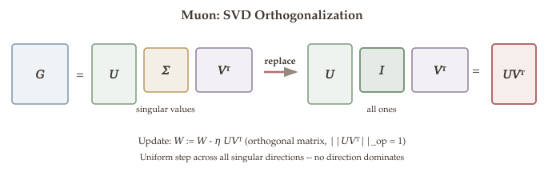{#fig-muon-svd}

The **Muon optimizer** (Momentum + Orthogonalization) applies this idea:

::: {.callout-important}
## Algorithm: Muon

For matrix parameter $W \in \mathbb{R}^{m \times n}$ with gradient $G = \nabla_W \mathcal{L}$:

1. **Momentum:** $M \leftarrow \beta \cdot M + (1-\beta)\,G$ (exponential moving average)
2. **Orthogonalize:** Compute SVD $M = U\Sigma V^\top$, set $\widetilde{M} = UV^\top$
3. **Update:** $W \leftarrow W - \alpha\,\widetilde{M}$

The orthogonalization step replaces all singular values of the momentum buffer with 1, producing a direction with unit spectral norm.
:::

::: {.callout-tip}
## Why Spectral-Norm Steepest Descent?

The key insight is that **all directions in the update receive equal "energy"** in terms of the spectral norm. Standard gradient descent can have singular values spanning orders of magnitude --- the update is dominated by a few large singular values. The orthogonalization in Muon eliminates this imbalance, analogous to how adaptive methods like Adam equalize per-coordinate scales.

In practice, Muon is applied only to the **matrix-shaped** parameters (weight matrices in linear layers), while scalar parameters (biases, layer norms) use standard Adam or AdamW.
:::

#### Practical Considerations {#sec-muon-practical}

Computing the full SVD of $M \in \mathbb{R}^{m \times n}$ costs $O(\min(m,n) \cdot mn)$, which is comparable to a matrix multiplication. In practice, Muon often uses a cheaper approximation:

- **Newton-Schulz iteration**: Approximate $UV^\top$ (the polar factor of $M$) by iterating $X \leftarrow \frac{3}{2}X - \frac{1}{2}X X^\top X$, starting from $X_0 = M / \|M\|_F$. This converges cubically and typically needs only 5--10 iterations of matrix multiplications --- which are highly optimized on GPUs.

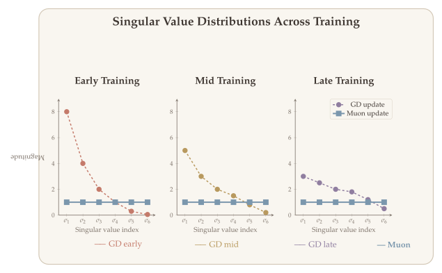{#fig-muon-vs-gd}

### Shampoo: Full-Matrix Adaptive Preconditioning {#sec-shampoo}

Muon exploits the spectral structure of the gradient through orthogonalization, but it does not accumulate historical gradient information the way adaptive methods like AdaGrad and Adam do. Shampoo takes a complementary approach: it builds a full-matrix preconditioner from gradient history, but uses Kronecker factorization to keep the cost manageable.

Recall that AdaGrad adapts the learning rate per coordinate using accumulated squared gradients. The **full-matrix** version maintains $\mathbf{G} = \sum_\ell g^\ell (g^\ell)^\top \in \mathbb{R}^{d \times d}$ and updates $\theta \leftarrow \theta - \alpha\,\mathbf{G}^{-1/2} g$. This is a much better preconditioner because it captures **correlations between coordinates**, not just per-coordinate variance. The diagonal AdaGrad is a special case that ignores all off-diagonal entries.

#### The Scalability Problem {#sec-shampoo-scalability}

For a matrix parameter $W \in \mathbb{R}^{m \times n}$, we could vectorize it as $\text{vec}(W) \in \mathbb{R}^{mn}$, but then the full-matrix AdaGrad preconditioner would be an $mn \times mn$ matrix --- storing and inverting it costs $O(m^2 n^2)$ and $O(m^3 n^3)$ respectively. For a typical Transformer layer with $m = n = 4096$, this would require storing a $16\text{M} \times 16\text{M}$ matrix. Clearly impossible.

**Shampoo** solves this by exploiting the **Kronecker structure** of the gradient outer products.

::: {#def-shampoo}
## Shampoo Preconditioner

For matrix parameter $W \in \mathbb{R}^{m \times n}$ with gradient $G^k = \nabla_W \mathcal{L}$ at step $k$, Shampoo maintains two smaller matrices:

$$L^k = \sum_{\ell=1}^{k} G^\ell (G^\ell)^\top \in \mathbb{R}^{m \times m}, \qquad R^k = \sum_{\ell=1}^{k} (G^\ell)^\top G^\ell \in \mathbb{R}^{n \times n}.$$

The **Shampoo update** is:

$$W \leftarrow W - \alpha\,(L^k)^{-1/4}\,G^k\,(R^k)^{-1/4}.$$ {#eq-shampoo-update}
:::

#### Why Kronecker Factorization Works {#sec-kronecker}

The Shampoo update (@eq-shampoo-update) applies separate left and right preconditioners rather than a single $mn \times mn$ matrix. The following theorem justifies this factorization by showing that the full preconditioner is well-approximated by a Kronecker product of the two smaller matrices.

::: {#thm-kronecker-approx}
## Kronecker Approximation

The full-matrix AdaGrad preconditioner for $\text{vec}(W)$ is $\mathbf{G} = \sum_\ell \text{vec}(G^\ell)\,\text{vec}(G^\ell)^\top \in \mathbb{R}^{mn \times mn}$. Using the identity $\text{vec}(ABC) = (C^\top \otimes A)\,\text{vec}(B)$, this admits the approximation:

$$\mathbf{G} \approx R \otimes L,$$ {#eq-kronecker-approx}

where $\otimes$ denotes the Kronecker product. Therefore:

$$\mathbf{G}^{-1/2} \approx R^{-1/2} \otimes L^{-1/2},$$

which acts on $\text{vec}(G)$ as $L^{-1/2}\, G\, R^{-1/2}$.
:::

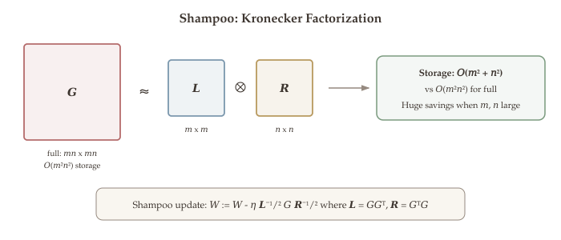{#fig-kronecker-factorization}

The fourth-root version $(L^{-1/4}, R^{-1/4})$ is used in practice for numerical stability.

::: {.callout-note appearance="simple"}
**Computational savings:**

| Approach | Storage | Per-step cost |
|---|---|---|
| Full-matrix AdaGrad | $O(m^2 n^2)$ | $O(m^3 n^3)$ |
| Shampoo | $O(m^2 + n^2)$ | $O(m^3 + n^3)$ |
| Diagonal AdaGrad | $O(mn)$ | $O(mn)$ |

Shampoo captures cross-coordinate correlations at a fraction of the cost of the full preconditioner. For $m = n = 4096$: full AdaGrad needs $\sim 10^{14}$ entries; Shampoo needs $\sim 3 \times 10^7$.
:::

{#fig-preconditioner-comparison}

### SOAP: Combining Shampoo with Adam {#sec-soap}

Shampoo captures cross-coordinate correlations via the Kronecker-factored preconditioner (@eq-kronecker-approx), but it does not include the per-coordinate adaptivity that makes Adam so effective in practice. SOAP bridges this gap by running Adam in the coordinate system defined by Shampoo's eigenbasis, combining the strengths of both methods.

**SOAP** (Shampoo Orthogonalized Adam Preconditioning) combines the best of Shampoo and Adam by running Adam in a coordinate system defined by Shampoo's preconditioner:

1. **Compute eigenbases:** Eigendecompose $L = Q_L \Lambda_L Q_L^\top$ and $R = Q_R \Lambda_R Q_R^\top$.
2. **Rotate gradient:** $\widetilde{G} = Q_L^\top G\, Q_R$ (project into the Shampoo eigenbasis).
3. **Apply Adam** to $\widetilde{G}$ (maintain momentum and second-moment estimates in the rotated basis).
4. **Rotate back:** Apply the Shampoo fourth-root scaling and rotate the update back to the original coordinates.

::: {.callout-tip}
## Why Rotate?

The eigenvectors of $L$ and $R$ identify the "natural" coordinate system for the optimization landscape --- the directions along which gradient variance is highest or lowest. Running Adam in this rotated basis means the per-coordinate adaptive learning rates align with the true principal axes of curvature, rather than the arbitrary axes of the parameter matrix.

This is the same principle behind second-order methods: adapt the coordinate system to the local geometry. SOAP does this using gradient statistics (like Adam/Shampoo) rather than the Hessian, making it practical for the large-scale non-convex problems of deep learning.
:::

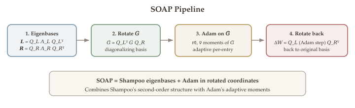{#fig-soap-pipeline}

#### Computational Cost {#sec-soap-cost}

SOAP's overhead compared to Adam comes from:

- **Eigendecompositions** of $L \in \mathbb{R}^{m \times m}$ and $R \in \mathbb{R}^{n \times n}$: $O(m^3 + n^3)$, but these need not be recomputed every step (e.g., every 100 steps suffices).
- **Rotation**: Two matrix multiplications per step: $O(m^2 n + mn^2)$.
- **Adam in rotated basis**: Same as standard Adam, $O(mn)$.

In practice, the amortized cost per step is modest, and the convergence speedup often compensates for the overhead.

### The Unified View {#sec-unified-view}

Having developed three matrix-aware optimizers --- Muon (spectral norm), Shampoo (Kronecker preconditioning), and SOAP (rotated Adam) --- we now step back and place them in a single framework that also includes the classical methods from this chapter.

All the optimizers we have studied fit the general framework:

$$x^{k+1} = x^k - \alpha^k \cdot B^k\,\nabla f(x^k),$$

differing only in the choice of the **preconditioning matrix** $B^k$:

| Method | $B^k$ | What it captures | Cost per step |
|---|---|---|---|
| GD | $I$ | Nothing | $O(n)$ |
| Sign GD | $\text{diag}(1/|g_j|)$ | Gradient sign only | $O(n)$ |
| AdaGrad/Adam | $\text{diag}(1/\sqrt{\widehat{v}_j})$ | Per-coord gradient variance | $O(n)$ |
| Muon | SVD orthogonalization | Matrix spectral structure | $O(mn \cdot \min(m,n))$ |
| Shampoo | $(L^{-1/4} \cdot R^{-1/4})$ | Cross-coord correlations | $O(m^3 + n^3)$ |
| SOAP | Shampoo eigenbasis + Adam | Correlations + variance | $O(m^3 + n^3)$ amortized |

The progression tells a clear story:

1. **GD**: Ignore all structure --- same step in every direction.
2. **Adam**: Adapt per-coordinate, using gradient variance as a proxy for curvature.
3. **Muon**: Exploit matrix structure via spectral norm --- equalize singular values.
4. **Shampoo/SOAP**: Approximate full-matrix preconditioning via Kronecker structure --- capture cross-coordinate correlations without the cost of full second-order methods.

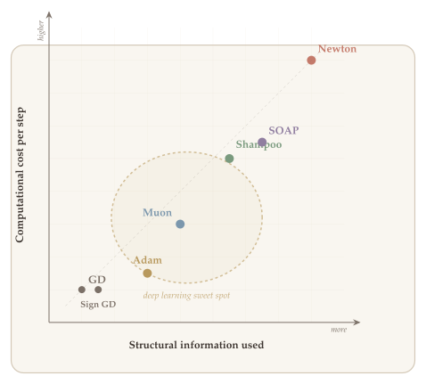{#fig-optimizer-landscape}

## Summary {.unnumbered}

- **Momentum methods.** Heavy-ball momentum adds a fraction of the previous step ($\beta(x^k - x^{k-1})$) to the gradient update, damping oscillations; Nesterov's accelerated gradient evaluates the gradient at a "lookahead" point, achieving the optimal $O(\sqrt{\kappa}\log(1/\varepsilon))$ rate for smooth convex optimization.
- **Adaptive learning rates.** AdaGrad accumulates squared gradients to give infrequent features larger updates; RMSProp uses an exponential moving average to prevent the learning rate from vanishing; Adam combines momentum with RMSProp and includes bias correction. AdamW (Adam with decoupled weight decay) is the default optimizer for training large-scale deep learning models.
- **Iteration complexity.** On strongly convex quadratics, GD needs $O(\kappa \log(1/\varepsilon))$ iterations while momentum methods (Heavy-Ball, Nesterov) need only $O(\sqrt{\kappa}\log(1/\varepsilon))$---a significant improvement when $\kappa$ is large.
- **Modern matrix optimizers.** Muon (spectral-norm steepest descent via SVD), Shampoo (Kronecker-factored preconditioning), and SOAP (Adam in Shampoo's rotated eigenbasis) exploit the matrix structure of neural network weights, capturing cross-coordinate correlations that diagonal methods like Adam miss.
- **PyTorch usage.** AdamW with cosine learning rate schedule and warmup is the standard recipe for training transformers. Per-parameter-group configuration (excluding biases from weight decay) is essential for large models.

### First-Order Methods Comparison {.unnumbered}

| Method | Update rule (key idea) | Iteration complexity | Strengths |
|---|---|---|---|
| **GD** | $x^{k+1} = x^k - \alpha \nabla f(x^k)$ | $O(\kappa \log \tfrac{1}{\varepsilon})$ | Simple, reliable |
| **Heavy-Ball** | adds $\beta(x^k - x^{k-1})$ | $O(\sqrt{\kappa} \log \tfrac{1}{\varepsilon})$ | Damps oscillations |
| **Nesterov AGD** | gradient at lookahead point | $O(\sqrt{\kappa} \log \tfrac{1}{\varepsilon})$ | Optimal for smooth convex |
| **AdaGrad** | per-coordinate adaptive $\alpha$ | problem-dependent | Sparse / NLP tasks |
| **Adam** | momentum + RMSProp + bias correction | problem-dependent | Default for deep learning |
| **AdamW** | Adam + decoupled weight decay | problem-dependent | Default for transformers |
| **Muon** | SVD orthogonalization of gradient | problem-dependent | Equalizes singular values |
| **Shampoo** | Kronecker-factored preconditioner | problem-dependent | Cross-coord correlations |
| **SOAP** | Adam in Shampoo eigenbasis | problem-dependent | Best of Shampoo + Adam |

::: {.callout-tip}
## Looking Ahead

The momentum and adaptive methods in this chapter assume we can compute the full gradient $\nabla f(x)$ at each iteration and that the objective is smooth. The next chapter addresses three practical challenges: what if the dataset is too large for full gradient computation (SGD), what if the objective is nonsmooth (proximal gradient), and what if there are constraints (Frank-Wolfe)?
:::
