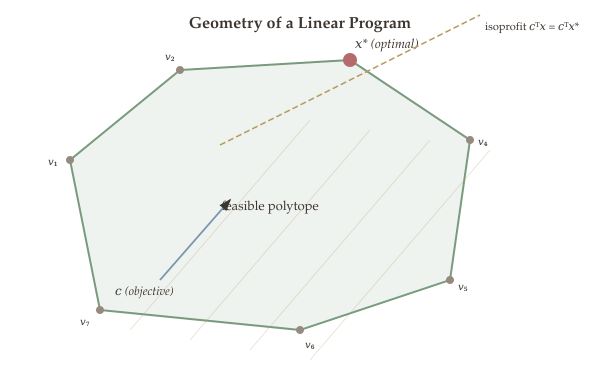

Why should we care about the geometry of linear programs? Because geometry reveals where the optimal solution must live. A linear objective function, when minimized over a polyhedron, always achieves its best value at a "corner" -- a vertex of the feasible region. This geometric insight is the foundation of the simplex method, the most widely used LP algorithm in practice, and it reduces the search for an optimal solution from an infinite continuous region to a finite set of candidate points.

In this chapter we make the notion of "corner" precise in two complementary ways. The first is geometric: an **extreme point** is a point in a convex set that cannot be written as a proper convex combination of two other points. The second is algebraic: a **vertex** is a feasible point where $n$ linearly independent constraints are binding. We prove that these two notions coincide for polyhedra, show that every nonempty polyhedron without a line has at least one extreme point, and culminate in the **Fundamental Theorem of Linear Programming**: if an LP has an optimal solution, then it has an optimal solution that is an extreme point.

This result has profound algorithmic consequences. Instead of searching over all feasible points, it suffices to examine the vertices -- and the simplex method does exactly this, moving from vertex to vertex while improving the objective at each step.

## What Will Be Covered {#sec-overview}

- The four possible cases of an LP (infeasible, unbounded, multiple optima, unique optimum)
- Extreme points and vertices: geometric and algebraic characterizations of "corner" points
- Equivalence of extreme points and vertices for polyhedra
- The Fundamental Theorem of LP and its algorithmic implications
- Vertex enumeration as a naive LP algorithm
- Converting canonical form LP to equational form via slack variables
- Basic feasible solutions (BFS) and the equivalence: extreme point = vertex = BFS
- Caratheodory's theorem as an application
- The simplex method: reduced costs, pivot selection, and the complete algorithm

## Four Possible Cases of LP {#four-cases}

Consider the linear program $\min c^\top x$ subject to $x \in \Omega$, where $\Omega = \{x : Ax \leq b,\; x \geq 0\}$ (see [Part 4](05-convex-optimization.qmd) for LP formulation and duality). There are four possible cases:

1. **Infeasible case:** $\Omega = \emptyset$.
2. **Unbounded case:** $f^* = -\infty$. In this case, $\Omega$ is also unbounded. We can push $\{x : c^\top x = t\}$ to make the value go to $-\infty$.
3. **Infinite number of optimal solutions:** $f^*$ is finite, $x^*$ is not unique. The set $\{x : c^\top x = f^*\} \cap \Omega$ corresponds to a "face" of $\Omega$. The entire face is optimal. The vector $\vec{c}$ is normal (perpendicular) to that face.
4. **Unique optimal solution:** $f^*$ is finite, $x^*$ is unique. Then $\{x : c^\top x = f^*\} \cap \Omega = x^*$, and $x^*$ is a "corner" point of $\Omega$.

We will show what "corner point" means geometrically and algebraically.

```python
#| label: fig-four-cases
#| fig-cap: "Figure 6.1: The four cases of LP illustrated in 2D."
#| echo: false

import plotly.graph_objects as go

poly_x = [0, 3, 4, 2, 0, 0]
poly_y = [0, 0, 2, 4, 3, 0]

fig = go.Figure()
fig.add_trace(go.Scatter(x=poly_x, y=poly_y, fill='toself',
    fillcolor='rgba(123,143,163,0.18)', line=dict(color='#7b97ad', width=2.5),
    name='Feasible region \u03A9', mode='lines'))
fig.add_trace(go.Scatter(x=[-1, 5], y=[3.5, 0.5], mode='lines',
    line=dict(color='#b8995e', dash='dash', width=1.5),
    name='Objective contour c<sup>T</sup>x = const'))
fig.add_trace(go.Scatter(x=[-1, 5], y=[5.5, 2.5], mode='lines',
    line=dict(color='#b8995e', dash='dash', width=1.5), showlegend=False))
fig.add_trace(go.Scatter(x=[-1, 5], y=[1.5, -1.5], mode='lines',
    line=dict(color='#b8995e', dash='dash', width=1.5), showlegend=False))
fig.add_trace(go.Scatter(x=[0], y=[0], mode='markers',
    marker=dict(color='#b56b6b', size=13, symbol='star',
    line=dict(width=1, color='white')), name='Optimal x*'))
fig.update_layout(
    title=dict(text='Unique Optimal Solution (Case 4)'),
    xaxis=dict(title='x\u2081', range=[-1.5, 5.5], zeroline=True),
    yaxis=dict(title='x\u2082', range=[-1.5, 5.5], zeroline=True, scaleanchor='x'),
    showlegend=True, margin=dict(t=48, b=50, l=55, r=20))
fig.show()
```

## Vertices and Extreme Points {#vertices-extreme-points}

We need to characterize Case 3 and Case 4. To this end, we need to answer: what does "corner points" even mean? We only have some geometric intuition. The following is a geometric definition.

### Extreme Point {#extreme-point-def}

The informal notion of a "corner point" of a polygon is intuitive, but we need a rigorous definition that works in any dimension. The following definition captures the essential property: a corner point cannot be expressed as a mixture of two other points in the set.

::: {#def-extreme-point}
## Definition 6.1 (Extreme Point)

A point $x$ is an **extreme point** of a convex set $\mathcal{C}$ if it *cannot* be written as a convex combination of any two other points in $\mathcal{C}$.

That is, if $x = \lambda y + (1-\lambda) z$ for some $y, z \in \mathcal{C}$ and $\lambda \in [0,1]$, then we have $x = y$ or $x = z$.
:::

An extreme point is a point that cannot be "decomposed" as a mixture of two other points in the set. Geometrically, extreme points are the "corners" of a convex set. For a polygon, they are the vertices; for a disk, they are the entire boundary. This concept will be crucial for understanding where LP solutions live.

```python
#| label: fig-extreme-points
#| fig-cap: "Figure 6.2: Extreme points of a polygon (green vertices) vs. non-extreme boundary points. Hover over points for details."
#| echo: false

import plotly.graph_objects as go

vx = [1, 3, 4, 3.5, 2, 0.5, 1]
vy = [0.5, 0, 1.5, 3.5, 4, 3, 0.5]
epx = [1, 3, 4, 3.5, 2, 0.5]
epy = [0.5, 0, 1.5, 3.5, 4, 3]
nepx = [2, 3.5, 3.75, 2.75, 1.25, 0.75]
nepy = [0.25, 0.75, 2.5, 3.75, 3.5, 1.75]

fig = go.Figure()
fig.add_trace(go.Scatter(x=vx, y=vy, fill='toself',
    fillcolor='rgba(122,154,126,0.2)', line=dict(color='#7a9a7e', width=2.5),
    name='Convex set C', mode='lines'))
fig.add_trace(go.Scatter(x=epx, y=epy, mode='markers',
    marker=dict(color='#7a9a7e', size=10, symbol='circle',
    line=dict(width=1.5, color='white')), name='Extreme points',
    text=[f'Extreme point {i+1}' for i in range(len(epx))], hoverinfo='text'))
fig.add_trace(go.Scatter(x=nepx, y=nepy, mode='markers',
    marker=dict(color='#968a80', size=8, symbol='x'), name='Not extreme',
    text=['Boundary point (not extreme) \u2014 convex combination of neighbors']*len(nepx),
    hoverinfo='text'))
fig.update_layout(
    xaxis=dict(range=[-0.5, 5], zeroline=False),
    yaxis=dict(range=[-0.5, 5], zeroline=False, scaleanchor='x'),
    showlegend=True, margin=dict(t=20, b=40, l=45, r=20))
fig.show()
```

::: {#exm-circle-extreme-points}
## Extreme Points of a Circle

What are the extreme points of a (filled) circle? **The entire boundary** (the circle itself). Every point on the boundary cannot be written as a convex combination of two other points in the disk.
:::

Extreme points are always on the boundary of $\mathcal{C}$. This is a *geometric* characterization. In the following, we establish an *algebraic* characterization of "corner" points.

Recall from linear algebra that vectors $a_1, a_2, \ldots, a_k$ are **linearly independent** if

$$\sum_{i=1}^{k} \alpha_i a_i = 0 \implies \alpha_i = 0 \quad \forall\, i \in [k].$$

### Linearly Independent Constraints {#lin-indep-constraints}

To build an algebraic characterization of extreme points, we need a way to determine when a system of constraints uniquely pins down a point. Linear independence of constraint normals ensures that the intersection of the corresponding hyperplanes is a single point rather than a line or higher-dimensional subspace.

::: {#def-linearly-independent-constraints}
## Definition 6.2 (Linearly Independent Constraints)

$k$ linear inequalities $a_i^\top x \leq b_i$, $i = 1, 2, \ldots, k$, are called **linearly independent** if $\{a_i\}_{i \in [k]}$ are linearly independent.
:::

Linear independence of constraints means the constraints impose genuinely different restrictions on the decision variable. When constraints are linearly dependent, their boundaries are parallel (or coincident), and they cannot "pin down" a unique point. When $n$ constraints are linearly independent, their boundaries intersect in exactly one point.

```python
#| label: fig-lin-dep-indep
#| fig-cap: "Figure 6.3: Left --- Linearly dependent constraints (parallel lines). Right --- Linearly independent constraints (crossing lines) with unique intersection."
#| echo: false

import plotly.graph_objects as go
from plotly.subplots import make_subplots

fig = make_subplots(rows=1, cols=2, subplot_titles=(
    'Linearly Dependent (parallel)', 'Linearly Independent (crossing)'))

fig.add_trace(go.Scatter(x=[-1, 5], y=[1, 7], mode='lines',
    line=dict(color='#ad8480', width=2.5),
    name='3x\u2081 \u2212 3x\u2082 = 3'), row=1, col=1)
fig.add_trace(go.Scatter(x=[-1, 5], y=[-1, 5], mode='lines',
    line=dict(color='#7b97ad', width=2.5, dash='dash'),
    name='x\u2081 \u2212 x\u2082 = 0'), row=1, col=1)
fig.add_trace(go.Scatter(x=[-1, 5], y=[3, -3], mode='lines',
    line=dict(color='#ad8480', width=2.5),
    name='a\u2081\u1d40x = b\u2081'), row=1, col=2)
fig.add_trace(go.Scatter(x=[-1, 5], y=[-1, 5], mode='lines',
    line=dict(color='#7b97ad', width=2.5),
    name='a\u2082\u1d40x = b\u2082'), row=1, col=2)
fig.add_trace(go.Scatter(x=[2], y=[2], mode='markers',
    marker=dict(color='#b56b6b', size=12, symbol='star',
    line=dict(width=1, color='white')),
    name='Intersection (vertex)',
    text=['Unique solution: intersection of 2 independent constraints'],
    hoverinfo='text'), row=1, col=2)

fig.update_xaxes(range=[-1, 5], row=1, col=1)
fig.update_yaxes(range=[-2, 5], scaleanchor='x', row=1, col=1)
fig.update_xaxes(range=[-1, 5], row=1, col=2)
fig.update_yaxes(range=[-2, 5], scaleanchor='x2', row=1, col=2)
fig.update_layout(showlegend=True, margin=dict(t=40, b=55, l=45, r=20))
fig.show()
```

In $\mathbb{R}^2$: the constraints $3x_1 - 3x_2 \leq 3$ and $x_1 - x_2 \leq 0$ are **linearly dependent** because their normal vectors are parallel. Halfspaces with parallel boundary lines are linearly dependent. Halfspaces whose boundary lines cross are linearly independent.

### Binding / Tight Constraints {#binding-constraint}

How do we characterize a "corner" point algebraically? Geometrically, it is an extreme point. Algebraically, it is the intersection of constraint boundaries -- the hyperplanes where inequality constraints hold with equality. A constraint that holds with equality at a point is said to be **binding** at that point.

::: {#def-binding-constraint}
## Definition 6.3 (Binding / Tight Constraint)

We say a constraint $a_i^\top x \leq b_i$ (where $a_i \in \mathbb{R}^n$, $b_i \in \mathbb{R}$) is **binding** (or **tight**) at a point $\bar{x}$ if $a_i^\top \bar{x} = b_i$.

In other words, $\bar{x}$ is on the boundary of the halfspace $\{x : a_i^\top x \leq b_i\}$.
:::

A binding constraint is one that is satisfied with equality at a given point -- the point lies exactly on the boundary of that constraint's halfspace. The more constraints that are binding at a point, the more "pinned down" that point is. As we will see, a vertex requires exactly $n$ linearly independent binding constraints.

::: {#exm-binding-constraints}
## Binding Constraints in 2D and 3D

**2-dimensional:** An extreme point $A$ is the intersection of two lines $\Rightarrow$ two linearly independent constraints are binding at $A$.

**3-dimensional:** An extreme point $A$ of a tetrahedron is the intersection of 3 planes (e.g., Face ABC, Face ACD, Face ABD) $\Rightarrow$ 3 linearly independent constraints are binding at $A$.

In general, in $\mathbb{R}^n$, an extreme point is determined by $n$ linearly independent binding constraints.
:::

```python
#| label: fig-tetrahedron
#| fig-cap: "Figure 6.4: A tetrahedron in 3D. Each vertex is the intersection of 3 face-planes. Hover over vertices to see binding constraints."
#| echo: false

import plotly.graph_objects as go

verts = [[0,0,3],[2,0,0],[0,2,0],[-1,-1,0]]
labels = ['A (0,0,3)', 'B (2,0,0)', 'C (0,2,0)', 'D (\u22121,\u22121,0)']

fig = go.Figure()
fig.add_trace(go.Mesh3d(
    x=[v[0] for v in verts], y=[v[1] for v in verts], z=[v[2] for v in verts],
    i=[0,0,0,1], j=[1,1,2,2], k=[2,3,3,3],
    opacity=0.25, color='#8fa3b8', name='Tetrahedron', hoverinfo='skip'))
fig.add_trace(go.Scatter3d(mode='markers+text',
    x=[v[0] for v in verts], y=[v[1] for v in verts], z=[v[2] for v in verts],
    marker=dict(color='#8a6e5e', size=5, line=dict(width=1, color='white')),
    text=labels, textposition='top center',
    textfont=dict(size=11),
    hovertext=[
        'A: 3 binding planes (ABC, ACD, ABD)',
        'B: 3 binding planes (ABC, ABD, BCD)',
        'C: 3 binding planes (ABC, ACD, BCD)',
        'D: 3 binding planes (ABD, ACD, BCD)'],
    hoverinfo='text', name='Vertices'))

edges = [[0,1],[0,2],[0,3],[1,2],[1,3],[2,3]]
for a, b in edges:
    fig.add_trace(go.Scatter3d(mode='lines',
        x=[verts[a][0], verts[b][0]],
        y=[verts[a][1], verts[b][1]],
        z=[verts[a][2], verts[b][2]],
        line=dict(color='#7b97ad', width=3),
        showlegend=False, hoverinfo='skip'))

fig.update_layout(
    scene=dict(
        xaxis=dict(title='x\u2081'),
        yaxis=dict(title='x\u2082'),
        zaxis=dict(title='x\u2083'),
        camera=dict(eye=dict(x=1.8, y=1.8, z=1.2))),
    showlegend=False, margin=dict(t=10, b=10, l=10, r=10))
fig.show()
```

### Vertex {#vertex-def}

We are now ready to give the algebraic definition of a "corner" point. A vertex is a feasible point where enough linearly independent constraints are tight to uniquely determine it -- exactly $n$ constraints in $\mathbb{R}^n$.

::: {#def-vertex}
## Definition 6.4 (Vertex)

A point $\bar{x} \in \mathbb{R}^n$ is a **vertex** of a polyhedron $P = \{x : Ax \leq b\}$ if:

1. $\bar{x}$ is **feasible**, i.e., $A\bar{x} \leq b$.
2. There exist $n$ **linearly independent** constraints that are **tight** at $\bar{x}$.
:::

The vertex definition provides an algebraic, computable criterion for identifying corners of a polyhedron: find $n$ linearly independent constraints that are simultaneously tight, then solve the resulting linear system. This is the basis for the vertex enumeration algorithm we develop later.

::: {.callout-tip}
## Remark

**Extreme point** is a *geometric* characterization of "corner" points.

**Vertex** is an *algebraic* characterization: if we can find $n$ linearly independent constraints $a_{j_1}^\top x = b_{j_1}, \ldots, a_{j_n}^\top x = b_{j_n}$ out of the $m$ constraints, then solving

$$\begin{pmatrix} a_{j_1}^\top \\ \vdots \\ a_{j_n}^\top \end{pmatrix} x = \begin{pmatrix} b_{j_1} \\ \vdots \\ b_{j_n} \end{pmatrix}$$

yields an extreme point.
:::

{#fig-lp-geometry}

### Vertex = Extreme Point {#equivalence}

::: {.callout-note appearance="simple"}
For polyhedra, **vertex = extreme point**.
:::

The geometric and algebraic characterizations of "corner" points turn out to be equivalent for polyhedra. This is a key result: it means we can use whichever characterization is more convenient -- the geometric one for intuition and proofs by contradiction, the algebraic one for computation and enumeration.

::: {#thm-equivalence-extreme-vertex}
## Theorem 6.5 (Equivalence of Extreme Point and Vertex)

Let $P = \{x \in \mathbb{R}^n \mid Ax \leq b\}$ be a nonempty polyhedron with $A \in \mathbb{R}^{m \times n}$. Let $\bar{x} \in P$. Then

$$\bar{x} \text{ is an extreme point} \iff \bar{x} \text{ is a vertex.}$$
:::

This equivalence bridges geometry and algebra: the geometric notion of "cannot be decomposed as a convex combination" is exactly the same as the algebraic notion of "has $n$ linearly independent tight constraints." This means we can use either characterization depending on which is more convenient for a given argument.

### Finite Number of Extreme Points {#finite-extreme-points}

::: {#cor-finite-extreme-points}
## Corollary 6.6

Given a finite set of linear inequalities, there can only be a **finite number** of extreme points.
:::

This is a reassuring finiteness result: although a polyhedron is a continuous set with infinitely many points, it has only finitely many "corners." This makes the strategy of searching over extreme points (which the Simplex method exploits) at least conceivable.

::: {.proof}
Since extreme points $\Leftrightarrow$ vertices, we show that the number of vertices is finite.

Suppose there are $m$ linear inequalities. We need to pick $n$ linearly independent constraints. How many choices?

Since choosing $n$ (not necessarily linearly independent) constraints out of $m$ constraints has $\binom{m}{n}$ ways, there are at most $\binom{m}{n}$ ways of choosing $n$ linearly independent constraints.

Each such set of $n$ constraints yields at most one candidate vertex by solving $Ax = b \implies x = A^{-1}b$ (when the matrix is invertible), since the solution to a system of $n$ linearly independent equations in $n$ unknowns is unique.

Therefore, the number of vertices is at most $\binom{m}{n}$, which is finite. This completes the proof. $\blacksquare$
:::

### Vertices of the LP Feasible Set {#vertices-of-lp}

::: {#cor-vertices-lp-feasible-set}
## Corollary 6.7 (Number of Vertices of the Feasible Set of LP)

Consider an LP in the canonical form:

$$\min \; c^\top x \quad \text{s.t.} \quad Ax \leq b, \; x \geq 0.$$

The feasible set $\{x \in \mathbb{R}^n : Ax \leq b, \; x \geq 0\}$ has at most $\binom{m+n}{n}$ vertices.
:::

::: {.proof}
By the previous corollary, $\{x \in \mathbb{R}^n : \widetilde{A}x \leq \widetilde{b}\}$ has at most $\binom{d}{n}$ vertices, where $\widetilde{A} \in \mathbb{R}^{d \times n}$ and $\widetilde{b} \in \mathbb{R}^d$.

We need to write $\Omega = \{x : Ax \leq b,\; x \geq 0\}$ in this form. Let

$$\widetilde{A} = \begin{pmatrix} -I_n \\ A \end{pmatrix} \in \mathbb{R}^{(m+n) \times n}, \quad \widetilde{b} = \begin{pmatrix} 0 \\ b \end{pmatrix},$$

where $-I_n$ is the negative identity matrix (encoding $x \geq 0$). Then $\Omega = \{x : \widetilde{A}x \leq \widetilde{b}\}$.

Thus, the number of vertices of $\Omega$ is at most $\binom{m+n}{n}$. This completes the proof. $\blacksquare$
:::

**Question:** Can you identify one extreme point of $\Omega$? The zero vector $\vec{0}$ is an extreme point (it is the solution to $-I \cdot x \leq 0$ with $n$ linearly independent binding constraints).

We know that the number of extreme points is finite, but do they always exist? The answer depends on the geometry of the polyhedron --- specifically, on whether it contains an entire line.

### Existence of Extreme Points {#existence}

### Containing a Line {#contain-line}

Before we can state when extreme points exist, we need to identify the one situation where they fail to exist: when the polyhedron extends infinitely in some direction and its "reverse" -- that is, when it contains an entire line.

::: {#def-contain-line}
## Definition 6.8 (Contain a Line)

A polyhedron $P$ **contains a line** if there exist $x \in P$ and $d \in \mathbb{R}^n$, $d \neq 0$, such that

$$x + \lambda d \in P \quad \forall\, \lambda \in \mathbb{R}.$$
:::

A polyhedron contains a line when it extends infinitely in both directions along some direction $d$. For example, a half-plane in $\mathbb{R}^2$ contains lines parallel to its boundary. This condition is the obstruction to having extreme points: if the polyhedron contains a line, no point on that line can be an extreme point.

```python
#| label: fig-contain-line
#| fig-cap: "Figure 6.5: Left --- An unbounded polyhedron that contains a line. Center & Right --- Bounded polyhedra that do not contain a line."
#| echo: false

import plotly.graph_objects as go
from plotly.subplots import make_subplots

fig = make_subplots(rows=1, cols=2, subplot_titles=(
    'Contains a line', 'Do not contain a line'))

fig.add_trace(go.Scatter(x=[-2, 6, 6, -2, -2], y=[1, 1, 3, 3, 1],
    fill='toself', fillcolor='rgba(122,154,126,0.2)',
    line=dict(color='#7a9a7e', width=2.5), name='Contains a line'), row=1, col=1)
fig.add_trace(go.Scatter(x=[-2, 6], y=[2, 2], mode='lines',
    line=dict(color='#b56b6b', dash='dot', width=2.5),
    name='A line inside P'), row=1, col=1)
fig.add_trace(go.Scatter(x=[2], y=[2], mode='markers',
    marker=dict(color='#b56b6b', size=8), showlegend=False), row=1, col=1)

fig.add_trace(go.Scatter(x=[9,11,12,10.5,8.5,9], y=[0.5,0,1.5,3.5,2.5,0.5],
    fill='toself', fillcolor='rgba(123,143,163,0.18)',
    line=dict(color='#7b97ad', width=2.5),
    name='No line (bounded)'), row=1, col=2)
fig.add_trace(go.Scatter(x=[15,18,17.5,15.5,15], y=[0,1,3.5,3,0],
    fill='toself', fillcolor='rgba(144,126,160,0.18)',
    line=dict(color='#907ea0', width=2.5),
    name='No line (bounded)'), row=1, col=2)

fig.update_xaxes(range=[-3, 7], row=1, col=1)
fig.update_yaxes(range=[-0.5, 4.5], scaleanchor='x', row=1, col=1)
fig.update_xaxes(range=[7.5, 19], row=1, col=2)
fig.update_yaxes(range=[-0.5, 4.5], scaleanchor='x2', row=1, col=2)
fig.update_layout(showlegend=True, margin=dict(t=40, b=55, l=45, r=20))
fig.show()
```

### Existence Theorem {#existence-thm}

We have seen that extreme points and vertices are equivalent for polyhedra (@thm-equivalence-extreme-vertex), and that their number is finite (@cor-finite-extreme-points). But do they always exist? The following theorem precisely characterizes when a polyhedron has extreme points. It tells us that extreme points exist unless the polyhedron contains an entire line -- a condition that is automatically satisfied when the polyhedron is bounded or when nonnegativity constraints are present (as in LP canonical form).

::: {#thm-existence-extreme-points}
## Theorem 6.9 (Existence of Extreme Points)

Consider a nonempty polyhedron $P$.

$$P \text{ has at least one extreme point} \iff P \text{ does not contain a line.}$$
:::

This theorem gives a clean necessary and sufficient condition for the existence of extreme points. In practice, most polyhedra arising in LP do not contain lines (e.g., nonnegativity constraints $x \geq 0$ prevent any line from lying in the feasible set), so extreme points almost always exist.

::: {#cor-polytope-extreme-point}
## Corollary 6.10

Every **polytope** (bounded polyhedron) contains at least one extreme point.
:::

Since a polytope is bounded, it cannot contain a line, so the theorem above immediately applies. This corollary guarantees that bounded LP feasible regions always have vertices to search over.

## Fundamental Theorem of LP {#fundamental-thm}

The equivalence of extreme points and vertices (@thm-equivalence-extreme-vertex), combined with the existence theorem (@thm-existence-extreme-points), sets the stage for the most important structural result in linear programming. We now arrive at the central result of LP geometry. The Fundamental Theorem tells us that the search for an optimal solution can be restricted to the extreme points of the feasible polyhedron -- a finite set. This is the theoretical justification for the simplex method and explains why linear programs, despite having infinitely many feasible points, can be solved by examining a finite number of candidates.

::: {#thm-fundamental-lp}
## Theorem 6.11 (Fundamental Theorem of LP)

Suppose the polyhedron $P = \{x : \widetilde{A}x \leq \widetilde{b}\}$ has an extreme point. Consider the LP:

$$\min_x \; c^\top x \quad \text{s.t.} \quad x \in P.$$

If there exists an optimal solution, there also exists an **optimal solution which is an extreme point**.
:::

This is the most important structural result about linear programs. It says that we never need to look at interior points of the feasible region -- the optimum is always attained at a corner. Geometrically, a linear objective "tilts" the feasible polyhedron, and the lowest point under this tilt is always a vertex (or a face containing a vertex).

**Implication:** It suffices to only search among the extreme points of the feasible polyhedron $\{x : Ax \leq b,\; x \geq 0\}$. This is just the idea of the **Simplex method**!

### Proof {#fundamental-proof}

The proof strategy is to show that the set of optimal solutions $Q$ is itself a polyhedron with at least one extreme point, and that any extreme point of $Q$ must also be an extreme point of $P$.

::: {.proof}
**Proof of the Fundamental Theorem.**

Assume there exists at least an optimal solution. The set of all optimal solutions is

$$Q = \{x : c^\top x = f^*\} \cap \{x : \widetilde{A}x \leq \widetilde{b}\} \neq \emptyset,$$

where $f^*$ is the optimal value.

In addition, $Q = \{x : c^\top x = f^*\} \cap P$ is a sub-polyhedron of $P$ (since $Q$ is a polyhedron and $Q \subseteq P$).

We have the following reasoning chain:

1. $P$ has an extreme point.
2. $\Rightarrow$ (by the Existence Theorem) $P$ does not contain a line.
3. $\Rightarrow$ (since $Q \subseteq P$) $Q$ does not contain a line.
4. $\Rightarrow$ (by the Existence Theorem) $Q$ has an extreme point, denoted by $x^*$.

*__Idea of the proof:__* Since $x^* \in Q$, we have $x^* \in P$ and $(x^*)^\top c = f^*$. If we can show that $x^*$ is also an extreme point of $P$, then we conclude the proof.

To see this, suppose $x^*$ is *not* an extreme point of $P$. Then there exist $y \neq x^*$ and $z \neq x^*$, and $\lambda \in [0,1]$ such that

$$x^* = \lambda y + (1-\lambda) z.$$

Then

$$f^* = c^\top x^* = \lambda \cdot c^\top y + (1-\lambda) \cdot c^\top z.$$

Since $f^*$ is the optimal value and $y, z \in P$ are feasible, we have $f^* \leq c^\top y$ and $f^* \leq c^\top z$. Substituting these lower bounds gives

$$f^* = \lambda \cdot c^\top y + (1-\lambda) \cdot c^\top z \geq \lambda f^* + (1-\lambda) f^* = f^*.$$

Since we have $f^*$ on both sides, the inequality must hold with equality, which forces $c^\top y = f^*$ and $c^\top z = f^*$.

This means that $y$ and $z$ are both optimal solutions of the LP as well. Thus $y, z \in Q$.

What did we show? We showed that $x^* \in Q$ can be written as $x^* = \lambda y + (1-\lambda) z$ for $y, z \neq x^*$ and $y, z \in Q$.

$\Rightarrow$ $x^*$ is **not** an extreme point of $Q$. **Contradiction** (since $x^*$ was chosen as an extreme point of $Q$).

Therefore, $x^*$ is an extreme point of $P$ and we are done. $\blacksquare$
:::

### Main Message {#main-message}

::: {.callout-note appearance="simple"}
When solving an LP, there are **three cases only**:

1. **LP is infeasible**: $\Omega = \emptyset$.
2. **LP is unbounded** ($-\infty$): $\Omega$ is unbounded, $\{x : c^\top x = t\} \cap \Omega \neq \emptyset$ for any sufficiently small $t$ (as $t \to -\infty$).
3. **LP has an optimal value** $f^*$ and at least one optimal solution $x^*$ which is a **vertex (extreme point)**.
:::

Thus, when looking for an optimal solution, it suffices to examine **only the extreme points (vertices)**.

The following interactive figure brings this result to life. Drag the slider to rotate the objective direction $c$: the parallel level-set lines ($c^\top x = \text{const}$) sweep across the polytope, and the **optimal is always at a vertex** — no matter where $c$ points. As the direction rotates, the optimal vertex jumps from corner to corner.

```{=html}
<style>
  .ftlp-container {
    font-family: 'Palatino Linotype', 'Palatino', 'Book Antiqua', 'Georgia', serif;
    background: #f0ebe5;
    border-radius: 8px;
    padding: 24px 20px 16px 20px;
    margin: 28px auto;
    max-width: 820px;
    box-shadow: 0 2px 12px rgba(61,53,48,0.08);
  }
  .ftlp-container h3 {
    font-family: 'Palatino Linotype', 'Palatino', 'Book Antiqua', 'Georgia', serif;
    color: #3d3530;
    font-size: 1.15em;
    font-weight: 600;
    margin: 0 0 6px 0;
    letter-spacing: 0.01em;
  }
  .ftlp-container .fig-subtitle {
    color: #968a80;
    font-size: 0.92em;
    margin: 0 0 16px 0;
    line-height: 1.5;
  }
  .ftlp-container .slider-row {
    display: flex;
    align-items: center;
    gap: 14px;
    margin: 14px 0 8px 0;
    flex-wrap: wrap;
  }
  .ftlp-container .slider-row label {
    font-size: 0.95em;
    color: #3d3530;
    min-width: 160px;
  }
  .ftlp-container .slider-row input[type="range"] {
    flex: 1;
    min-width: 180px;
    max-width: 420px;
    accent-color: #7b97ad;
    height: 6px;
  }
  .ftlp-container .slider-row .slider-value {
    font-size: 0.95em;
    color: #b8995e;
    font-weight: 600;
    min-width: 50px;
  }
  .ftlp-container .info-box {
    background: #faf7f3;
    border-left: 3px solid #7b97ad;
    border-radius: 0 4px 4px 0;
    padding: 10px 14px;
    margin: 10px 0 4px 0;
    font-size: 0.88em;
    color: #3d3530;
    line-height: 1.7;
  }
</style>

<div class="ftlp-container" id="ftlp-wrapper">
  <h3>Fundamental Theorem of LP Explorer</h3>
  <p class="fig-subtitle">
    Polytope: x<sub>1</sub>+x<sub>2</sub> &le; 4, &ensp;
    x<sub>1</sub>&minus;x<sub>2</sub> &le; 2, &ensp;
    &minus;x<sub>1</sub>+x<sub>2</sub> &le; 2, &ensp;
    x &ge; 0.
    &emsp; Maximize c<sup>T</sup>x over the polytope.
  </p>
  <div class="slider-row">
    <label for="ftlp-theta">Objective direction &theta; =</label>
    <input type="range" id="ftlp-theta" min="0" max="359" step="1" value="30">
    <span class="slider-value" id="ftlp-theta-val">30&deg;</span>
  </div>
  <div id="ftlp-plot"></div>
  <div class="info-box" id="ftlp-info"></div>
</div>

<script>
(function() {
  var C = {
    bg: '#f0ebe5', plotBg: '#faf7f3', text: '#3d3530', grid: '#e0d9d1',
    axis: '#968a80', blue: '#7b97ad', gold: '#b8995e', sage: '#7a9a7e',
    terracotta: '#c47a6a', lavender: '#907ea0', rosewood: '#ad8480'
  };
  var font = {family: "'Palatino Linotype','Palatino','Book Antiqua','Georgia',serif", color: C.text};

  var verts = [[0,0], [2,0], [3,1], [1,3], [0,2]];
  var polyX = [0, 2, 3, 1, 0, 0];
  var polyY = [0, 0, 1, 3, 2, 0];
  var vLabels = ['(0,0)', '(2,0)', '(3,1)', '(1,3)', '(0,2)'];
  var textPos = ['bottom right', 'bottom center', 'middle right', 'top right', 'middle left'];

  /* Centroid for arrow origin */
  var ctrX = 1.2, ctrY = 1.2;
  var cfg = {displayModeBar: false, responsive: true};

  /* Compute two endpoints of the line cx*x1 + cy*x2 = t across the view */
  function lineEnds(cx, cy, t) {
    if (Math.abs(cy) > 0.01) {
      return {x: [-1.5, 5.5], y: [(t + 1.5*cx)/cy, (t - 5.5*cx)/cy]};
    }
    var x1 = t / cx;
    return {x: [x1, x1], y: [-1.5, 5.5]};
  }

  function update(deg) {
    var th = deg * Math.PI / 180;
    var cx = Math.cos(th), cy = Math.sin(th);

    /* Objective value at each vertex */
    var vals = [], fStar = -1e9, optIdx = 0;
    for (var i = 0; i < verts.length; i++) {
      var f = cx*verts[i][0] + cy*verts[i][1];
      vals.push(f);
      if (f > fStar) { fStar = f; optIdx = i; }
    }
    var fMin = Math.min.apply(null, vals);

    /* ---- Build traces ---- */
    var tr = [];

    /* Background level-set lines (low → high, light → darker) */
    var nLines = 9;
    for (var k = 0; k < nLines; k++) {
      var t = fMin + (fStar - fMin) * k / (nLines - 1);
      var ep = lineEnds(cx, cy, t);
      var alpha = 0.10 + 0.22 * (k / (nLines - 1));
      tr.push({
        x: ep.x, y: ep.y, mode: 'lines',
        line: {color: 'rgba(123,151,173,' + alpha.toFixed(2) + ')', width: 1.2},
        showlegend: false, hoverinfo: 'skip'
      });
    }

    /* Optimal level set (gold, dashed, prominent) */
    var oep = lineEnds(cx, cy, fStar);
    tr.push({
      x: oep.x, y: oep.y, mode: 'lines',
      line: {color: C.gold, width: 3, dash: 'dash'},
      name: 'Optimal: f* = ' + fStar.toFixed(2),
      hoverinfo: 'skip'
    });

    /* Polytope */
    tr.push({
      x: polyX, y: polyY, mode: 'lines', fill: 'toself',
      fillcolor: 'rgba(122,154,126,0.18)', line: {color: C.sage, width: 2.5},
      name: 'Feasible polytope', hoverinfo: 'skip'
    });

    /* Vertices */
    for (var i = 0; i < verts.length; i++) {
      var isOpt = (i === optIdx);
      tr.push({
        x: [verts[i][0]], y: [verts[i][1]],
        mode: 'markers+text',
        marker: {
          size: isOpt ? 16 : 9,
          color: isOpt ? C.terracotta : C.blue,
          symbol: isOpt ? 'star' : 'circle',
          line: {width: isOpt ? 1.5 : 1, color: 'white'}
        },
        text: ['f=' + vals[i].toFixed(1)],
        textposition: textPos[i],
        textfont: {size: 11, color: isOpt ? C.terracotta : C.axis, family: font.family},
        name: isOpt ? 'Optimal vertex ' + vLabels[i] : vLabels[i],
        hovertext: [vLabels[i] + ', f = ' + vals[i].toFixed(3)],
        hoverinfo: 'text'
      });
    }

    /* Axis styling */
    var ax = {
      gridcolor: C.grid, gridwidth: 1, zerolinecolor: C.axis,
      zerolinewidth: 1.5, linecolor: C.axis, linewidth: 1,
      tickfont: {size: 12, family: font.family, color: font.color},
      titlefont: {size: 14, family: font.family, color: font.color}
    };

    /* Arrow annotation for objective direction c */
    var aLen = 1.1;
    var ann = [{
      x: ctrX + aLen*cx, y: ctrY + aLen*cy,
      ax: ctrX, ay: ctrY,
      xref: 'x', yref: 'y', axref: 'x', ayref: 'y',
      showarrow: true, arrowhead: 2, arrowsize: 1.5,
      arrowwidth: 2.5, arrowcolor: C.terracotta,
      text: ' c', font: {size: 14, color: C.terracotta, family: font.family},
      bgcolor: 'rgba(250,247,243,0.6)', borderpad: 2
    }];

    var layout = {
      paper_bgcolor: C.bg, plot_bgcolor: C.plotBg, font: font,
      height: 480, margin: {t: 14, b: 52, l: 56, r: 14},
      xaxis: Object.assign({title: 'x\u2081', range: [-0.8, 4.5]}, ax),
      yaxis: Object.assign({title: 'x\u2082', range: [-0.8, 4.5], scaleanchor: 'x'}, ax),
      annotations: ann,
      showlegend: true,
      legend: {x: 0.50, y: 0.01, bgcolor: 'rgba(250,247,243,0.88)',
               bordercolor: C.grid, borderwidth: 1,
               font: {size: 10.5, family: font.family, color: font.color}},
      hovermode: 'closest'
    };

    /* Info box */
    var info = '<b>Objective:</b> max c<sup>T</sup>x &ensp; with c = ('
      + cx.toFixed(2) + ', ' + cy.toFixed(2) + ')';
    info += '<br><b>Vertex values:</b> &ensp;';
    for (var i = 0; i < verts.length; i++) {
      var isOpt = (i === optIdx);
      info += (isOpt ? '<b style="color:' + C.terracotta + '">' : '<span>')
        + vLabels[i] + ': ' + vals[i].toFixed(2)
        + (isOpt ? ' \u2190 optimal</b>' : '</span>') + ' &ensp; ';
    }
    info += '<br><b>f* = ' + fStar.toFixed(2) + '</b> at vertex <b>'
      + vLabels[optIdx] + '</b>'
      + ' &ensp;\u2014&ensp; <span style="color:#968a80">The optimal is always at a vertex.</span>';
    document.getElementById('ftlp-info').innerHTML = info;

    Plotly.react('ftlp-plot', tr, layout, cfg);
  }

  document.getElementById('ftlp-theta').addEventListener('input', function() {
    var v = parseFloat(this.value);
    document.getElementById('ftlp-theta-val').textContent = v + '\u00b0';
    update(v);
  });

  update(30);
})();
</script>
```

This leads to an algorithm for LP: **enumerate all extreme points and find the best one**. But how?

### Algorithm: Enumerating Extreme Points {#algorithm}

The Fundamental Theorem (@thm-fundamental-lp) tells us that we only need to search among extreme points. The simplest approach is brute-force enumeration: check every possible vertex. We want to check all extreme points of $\Omega = \{x : Ax \leq b,\; x \geq 0\}$.

We first rewrite $\Omega$ as $\Omega = \{x : \widetilde{A}x \leq \widetilde{b}\}$, where

$$\widetilde{A} = \begin{pmatrix} -I_n \\ A \end{pmatrix} \in \mathbb{R}^{(m+n) \times n}, \quad \widetilde{b} = \begin{pmatrix} 0 \\ b \end{pmatrix} \in \mathbb{R}^{m+n}.$$

This gives us $(m+n)$ inequalities.

An extreme point of $\Omega$ corresponds to $n$ linear inequalities among $\widetilde{A}x \leq \widetilde{b}$ that are **binding** and **linearly independent**.

So the algorithm enumerates all subsets of $n$ linear inequalities and checks if there is a corresponding extreme point.

Let $I \subseteq [m+n]$ with $|I| = n$. We write $\widetilde{A}_I = (\widetilde{a}_i^\top)_{i \in I}$ and $\widetilde{b}_I = (\widetilde{b}_j)_{j \in I}$ as the submatrix of $\widetilde{A}$ and subvector of $\widetilde{b}$ with row index in $I$.

::: {.callout-important}
## Algorithm: Check All Extreme Points

```
For all I in subsets of [m+n] with |I| = n:
    If A_tilde_I is invertible:       // rows of A_tilde_I are linearly independent
        Solve linear equation: A_tilde_I x = b_tilde_I
        Define x^(I) = (A_tilde_I)^{-1} b_tilde_I    // x^(I) is an extreme point candidate
        If x^(I) in Omega:            // check feasibility
            Define f^(I) = c^T x^(I)
        Else:
            Define f^(I) = +infinity
    Else:
        Define f^(I) = +infinity
End For

Return: x* = x^(I*), f* = f^(I*), where I* = argmin_I { f^(I) }.
```
:::

::: {.callout-tip}
## Remark: Complexity

Unfortunately, $\binom{m+n}{n}$ is **exponential** in $n$. In particular, $\binom{m+n}{n} \geq n^n$.

For example, the number of extreme points of $\{x : 0 \leq x \leq \mathbf{1}\}$ (the unit hypercube) is $2^n$.

The idea of **smartly searching over vertices** (rather than enumerating all of them) leads to the **Simplex method**.
:::

The vertex enumeration algorithm makes the Fundamental Theorem concrete, but its exponential complexity ($\binom{m+n}{n}$ subsets to check) makes it impractical for all but the smallest LPs. This motivates a smarter approach: rather than examining every vertex, we want an algorithm that navigates from vertex to vertex while improving the objective at each step. The simplex method does exactly this --- and to develop it, we need to reformulate the LP in a way that makes vertex-to-vertex moves algebraically transparent.

## From Canonical Form to Equational Form {#sec-equational-form}

### Recap: Canonical Form

The **canonical form** of a linear program is

$$\min_{x \in \mathbb{R}^n} \; c^\top x \quad \text{s.t.} \quad Ax \leq b, \; x \geq 0,$$

where $A \in \mathbb{R}^{m \times n}$, $b \in \mathbb{R}^m$, and $c \in \mathbb{R}^n$. The feasible polyhedron is $P = \{x \in \mathbb{R}^n : Ax \leq b, \; x \geq 0\}$. This form is convenient for geometric visualization: the constraints $Ax \leq b$ and $x \geq 0$ carve out a polyhedron in $\mathbb{R}^n$.

However, for algebraic manipulation -- and in particular for the simplex method -- it is much more convenient to work with **equalities** rather than inequalities. We achieve this by introducing slack variables.

### Slack Variables {#sec-slack-variables}

Each inequality constraint $a_i^\top x \leq b_i$ can be converted to an equality by introducing a **slack variable** $s_i \geq 0$ that measures the gap between the right-hand side and the left-hand side:

$$s_i = b_i - a_i^\top x = b_i - \sum_{j=1}^{n} a_{ij} x_j, \quad i = 1, 2, \ldots, m.$$

In vector form, this is simply

$$s = b - Ax.$$

The constraint $a_i^\top x \leq b_i$ holds if and only if $s_i \geq 0$. When $s_i = 0$, the $i$-th constraint is **binding** (tight); when $s_i > 0$, there is "slack" in the constraint.

### The Augmented System {#sec-augmented-system}

We now define the **augmented decision variable**, **augmented cost vector**, and **augmented constraint matrix**:

$$\bar{x} = \begin{pmatrix} x \\ s \end{pmatrix} = \begin{pmatrix} x_1 \\ \vdots \\ x_n \\ s_1 \\ \vdots \\ s_m \end{pmatrix} \in \mathbb{R}^{n+m}, \qquad \bar{c} = \begin{pmatrix} c \\ 0 \end{pmatrix} \in \mathbb{R}^{n+m}, \qquad \bar{A} = \begin{pmatrix} A & I_m \end{pmatrix} \in \mathbb{R}^{m \times (n+m)}.$$

The $i$-th component of $\bar{x}$ is

$$\bar{x}_i = \begin{cases} x_i & \text{if } i \in [n], \\ s_{i-n} & \text{if } i > n. \end{cases}$$

::: {#def-equational-form}
## Definition (Equational Form of LP)

The **equational form** of the linear program $\min c^\top x$ subject to $Ax \leq b$, $x \geq 0$ is

$$\min_{\bar{x} \in \mathbb{R}^{n+m}} \; \bar{c}^\top \bar{x} \quad \text{s.t.} \quad \bar{A}\bar{x} = b, \; \bar{x} \geq 0,$$ {#eq-equational-form}

where $\bar{A} = (A \mid I_m) \in \mathbb{R}^{m \times (n+m)}$, $\bar{c} = (c^\top, 0^\top)^\top \in \mathbb{R}^{n+m}$, and $\bar{x} = (x^\top, s^\top)^\top \in \mathbb{R}^{n+m}$.
:::

**Why does this work?** Since $s = b - Ax$, we have $Ax + Is = b$, which is $\bar{A}\bar{x} = b$. The nonnegativity $\bar{x} \geq 0$ encodes both $x \geq 0$ and $s \geq 0$ (i.e., $Ax \leq b$). The objective $\bar{c}^\top \bar{x} = c^\top x + 0^\top s = c^\top x$ is unchanged.

The equational form polyhedron is

$$P_{\text{eq}} = \{\bar{x} \in \mathbb{R}^{n+m} : \bar{A}\bar{x} = b, \; \bar{x} \geq 0\}.$$

::: {.callout-tip}
## Canonical vs. Equational Form

| | Canonical Form | Equational Form |
|---|---|---|
| **Constraints** | $Ax \leq b$, $x \geq 0$ | $\bar{A}\bar{x} = b$, $\bar{x} \geq 0$ |
| **Variables** | $x \in \mathbb{R}^n$ | $\bar{x} \in \mathbb{R}^{n+m}$ |
| **Advantage** | Easy to visualize the polyhedron | Easy to manipulate the linear equations |
| **Use case** | Geometric arguments | Simplex method and algebraic proofs |
:::

```python
#| label: fig-slack-variables
#| fig-cap: "Figure 14.1: A 2D LP in canonical form (left) and its equational form interpretation (right). Slack variables measure the distance from each constraint boundary. At the optimal vertex, certain slacks are zero (binding constraints)."
#| echo: false

import plotly.graph_objects as go
from plotly.subplots import make_subplots
import numpy as np

fig = make_subplots(rows=1, cols=2, subplot_titles=(
    'Canonical Form: Feasible Region in (x\u2081, x\u2082)',
    'Slack Variables at Each Vertex'))

# Feasible region: x1 + x2 <= 4, x1 <= 3, x2 <= 3, x1,x2 >= 0
# Vertices: (0,0), (3,0), (3,1), (1,3), (0,3)
vx = [0, 3, 3, 1, 0, 0]
vy = [0, 0, 1, 3, 3, 0]

# Constraint lines
fig.add_trace(go.Scatter(x=vx, y=vy, fill='toself',
    fillcolor='rgba(123,143,163,0.18)', line=dict(color='#7b97ad', width=2.5),
    name='Feasible region', mode='lines'), row=1, col=1)

# Constraint boundary lines
x_line = np.linspace(-0.5, 4.5, 50)
fig.add_trace(go.Scatter(x=x_line, y=4-x_line, mode='lines',
    line=dict(color='#b8995e', dash='dash', width=1.5),
    name='x\u2081+x\u2082=4'), row=1, col=1)
fig.add_trace(go.Scatter(x=[3,3], y=[-0.5, 4.5], mode='lines',
    line=dict(color='#ad8480', dash='dash', width=1.5),
    name='x\u2081=3'), row=1, col=1)
fig.add_trace(go.Scatter(x=[-0.5, 4.5], y=[3,3], mode='lines',
    line=dict(color='#7a9a7e', dash='dash', width=1.5),
    name='x\u2082=3'), row=1, col=1)

# Vertices with labels
vert_x = [0, 3, 3, 1, 0]
vert_y = [0, 0, 1, 3, 3]
vert_labels = ['O(0,0)', 'A(3,0)', 'B(3,1)', 'C(1,3)', 'D(0,3)']

fig.add_trace(go.Scatter(x=vert_x, y=vert_y, mode='markers+text',
    marker=dict(color='#b56b6b', size=10, line=dict(width=1, color='white')),
    text=vert_labels, textposition=['bottom right','bottom right','top right','top right','bottom right'],
    hovertext=[
        'O: s\u2081=4, s\u2082=3, s\u2083=3 (no binding)',
        'A: s\u2081=1, s\u2082=0, s\u2083=3 (x\u2081=3 binding)',
        'B: s\u2081=0, s\u2082=0, s\u2083=2 (x\u2081+x\u2082=4, x\u2081=3 binding)',
        'C: s\u2081=0, s\u2082=2, s\u2083=0 (x\u2081+x\u2082=4, x\u2082=3 binding)',
        'D: s\u2081=1, s\u2082=3, s\u2083=0 (x\u2082=3 binding)'],
    hoverinfo='text', name='Vertices', showlegend=False), row=1, col=1)

# Right panel: bar chart of slack variables at each vertex
vertices_names = ['O(0,0)', 'A(3,0)', 'B(3,1)', 'C(1,3)', 'D(0,3)']
# s1 = 4 - x1 - x2, s2 = 3 - x1, s3 = 3 - x2
s1_vals = [4, 1, 0, 0, 1]
s2_vals = [3, 0, 0, 2, 3]
s3_vals = [3, 3, 2, 0, 0]

fig.add_trace(go.Bar(x=vertices_names, y=s1_vals, name='s\u2081 (x\u2081+x\u2082\u22644)',
    marker_color='#b8995e', opacity=0.85), row=1, col=2)
fig.add_trace(go.Bar(x=vertices_names, y=s2_vals, name='s\u2082 (x\u2081\u22643)',
    marker_color='#ad8480', opacity=0.85), row=1, col=2)
fig.add_trace(go.Bar(x=vertices_names, y=s3_vals, name='s\u2083 (x\u2082\u22643)',
    marker_color='#7a9a7e', opacity=0.85), row=1, col=2)

fig.update_xaxes(title='x\u2081', range=[-0.5, 4.5], zeroline=True, row=1, col=1)
fig.update_yaxes(title='x\u2082', range=[-0.5, 4.5], zeroline=True, scaleanchor='x', row=1, col=1)
fig.update_xaxes(title='Vertex', row=1, col=2)
fig.update_yaxes(title='Slack value', row=1, col=2)
fig.update_layout(barmode='group', showlegend=True,
    margin=dict(t=48, b=55, l=55, r=20),
    legend=dict(font=dict(size=10)))
fig.show()
```

### Why Equational Form? {#sec-why-equational}

Why go through the trouble of introducing slack variables? The key insight from the [first part of this chapter](#four-cases) is:

> $x_0 \in \mathbb{R}^n$ is an extreme point of $P = \{x : \widetilde{A}x \leq \widetilde{b}\}$ if and only if $n$ linearly independent inequality constraints are binding at $x_0$.

Recall that $\widetilde{A} = \binom{-I_n}{A}$ and $\widetilde{b} = \binom{0}{b}$, so the rows $\widetilde{a}_j = -e_j$ for $j = 1, \ldots, n$ and $\widetilde{a}_{n+i} = a_i$ for $i = 1, \ldots, m$. When an inequality $\widetilde{a}_i^\top x \leq \widetilde{b}_i$ is binding at $x_0$, the corresponding component of $\bar{x}$ is zero:

- If $i \in \{1, \ldots, n\}$: binding means $-e_i^\top x = 0$, i.e., $x_i = 0 = \bar{x}_i$.
- If $i \in \{n+1, \ldots, n+m\}$: binding means $a_{i-n}^\top x = b_{i-n}$, i.e., $s_{i-n} = b_{i-n} - a_{i-n}^\top x = 0 = \bar{x}_i$.

**Conclusion:** In the equational form, binding constraints correspond to components of $\bar{x}$ that are zero. This simple observation is the gateway to the concept of basic feasible solutions.

## Basic Solutions and Basic Feasible Solutions {#sec-bfs}

### Block Matrix Computation {#sec-block-matrix}

Before defining basic solutions, we review a useful fact from linear algebra. Let $A \in \mathbb{R}^{m \times n}$ (with $m \leq n$) and $b \in \mathbb{R}^m$. Let $\mathcal{I} \subseteq [n]$ with $|\mathcal{I}| = \ell$ be an index set. Write $A_\mathcal{I} \in \mathbb{R}^{m \times \ell}$ for the submatrix of $A$ consisting of columns indexed by $\mathcal{I}$, and $x_\mathcal{I} \in \mathbb{R}^\ell$ for the subvector of $x$ with entries in $\mathcal{I}$. Let $\mathcal{I}^c = [n] \setminus \mathcal{I}$ be the complement. Then

$$Ax = A_\mathcal{I} \, x_\mathcal{I} + A_{\mathcal{I}^c} \, x_{\mathcal{I}^c}.$$

If $|\mathcal{I}| = m$ and $A_\mathcal{I}$ is invertible, and if we set $x_{\mathcal{I}^c} = 0$, then $Ax = b$ reduces to $A_\mathcal{I} x_\mathcal{I} = b$, giving $x_\mathcal{I} = A_\mathcal{I}^{-1} b$. This is the core computation behind basic solutions.

### Basic Solution {#sec-basic-solution}

Consider the equational form system $\bar{A}\bar{x} = b$ with $\bar{A} \in \mathbb{R}^{m \times (n+m)}$, $\bar{x} \in \mathbb{R}^{n+m}$, $b \in \mathbb{R}^m$, and $\operatorname{rank}(\bar{A}) = m$.

::: {#def-basic-solution}
## Definition (Basic Solution)

Let $B = \{i_1, i_2, \ldots, i_m\} \subseteq [n+m]$ be an index set such that the columns $\bar{a}_{i_1}, \bar{a}_{i_2}, \ldots, \bar{a}_{i_m}$ of $\bar{A}$ are linearly independent (i.e., $\bar{A}_B \in \mathbb{R}^{m \times m}$ is invertible). Define

$$x_B = \bar{A}_B^{-1} b, \qquad \bar{x}^* = \begin{pmatrix} x_B \\ 0 \end{pmatrix},$$ {#eq-basic-solution}

where the entries of $\bar{x}^*$ corresponding to indices in $B$ are set to $x_B$, and all other entries are zero. Then $\bar{x}^*$ is called a **basic solution** to $\bar{A}\bar{x} = b$ with **basic variables** $x_B = \{x_{i_1}, \ldots, x_{i_m}\}$.

The set $B$ is called the **basis**, and $N = [n+m] \setminus B$ is the **non-basic** index set. The variables $x_N$ are called **non-basic variables**.
:::

The idea is simple: we select $m$ linearly independent columns of $\bar{A}$, set all other variables to zero, and solve the resulting $m \times m$ system.

```python
#| label: fig-basic-solutions
#| fig-cap: "Figure 14.2: Block structure of a basic solution. We select m columns of the augmented matrix (the basis), set the remaining variables to zero, and solve the square system."
#| echo: false

import plotly.graph_objects as go

fig = go.Figure()

# Draw the matrix A_bar
fig.add_shape(type='rect', x0=0, y0=0, x1=7, y1=4,
    line=dict(color='#7b97ad', width=2), fillcolor='rgba(123,143,163,0.08)')
fig.add_annotation(x=3.5, y=4.3, text='<b>\u0100</b>  (m \u00d7 (n+m))',
    showarrow=False, font=dict(size=14, color='#7b97ad'))

# Highlight basis columns
for col_x in [1, 3, 5]:
    fig.add_shape(type='rect', x0=col_x-0.35, y0=0.05, x1=col_x+0.35, y1=3.95,
        line=dict(color='#b8995e', width=2.5), fillcolor='rgba(184,153,94,0.15)')

fig.add_annotation(x=1, y=-0.4, text='<b>\u0101<sub>i\u2081</sub></b>',
    showarrow=False, font=dict(size=12, color='#b8995e'))
fig.add_annotation(x=3, y=-0.4, text='<b>\u0101<sub>i\u2082</sub></b>',
    showarrow=False, font=dict(size=12, color='#b8995e'))
fig.add_annotation(x=5, y=-0.4, text='<b>\u0101<sub>i\u2083</sub></b>',
    showarrow=False, font=dict(size=12, color='#b8995e'))

# x_bar vector
fig.add_shape(type='rect', x0=8.5, y0=0, x1=9.5, y1=4,
    line=dict(color='#7b97ad', width=2), fillcolor='rgba(123,143,163,0.08)')
fig.add_annotation(x=9, y=4.3, text='<b>x\u0304</b>',
    showarrow=False, font=dict(size=14, color='#7b97ad'))

# Show which entries are nonzero (basic) and zero (non-basic)
y_positions = [3.4, 2.8, 2.2, 1.6, 1.0, 0.4]
labels = ['x\u0304<sub>i\u2081</sub>', 'x\u0304<sub>2</sub>', 'x\u0304<sub>i\u2082</sub>', 'x\u0304<sub>4</sub>', 'x\u0304<sub>i\u2083</sub>', 'x\u0304<sub>6</sub>']
colors = ['#b8995e', '#968a80', '#b8995e', '#968a80', '#b8995e', '#968a80']
values = ['nonzero', '0', 'nonzero', '0', 'nonzero', '0']

for y, lab, col, val in zip(y_positions, labels, colors, values):
    fig.add_annotation(x=9, y=y, text=f'{lab}={val}',
        showarrow=False, font=dict(size=10, color=col))

# b vector
fig.add_shape(type='rect', x0=11, y0=0, x1=12, y1=4,
    line=dict(color='#7b97ad', width=2), fillcolor='rgba(123,143,163,0.08)')
fig.add_annotation(x=11.5, y=4.3, text='<b>b</b>',
    showarrow=False, font=dict(size=14, color='#7b97ad'))

# Equals sign
fig.add_annotation(x=10.25, y=2, text='=', showarrow=False,
    font=dict(size=20, color='#555'))

# Brace for basis
fig.add_annotation(x=3, y=-1.0,
    text='B = {i\u2081, i\u2082, i\u2083}  (m=3 linearly independent columns)',
    showarrow=False, font=dict(size=11, color='#b8995e'))

# Arrow showing the solve step
fig.add_annotation(x=9, y=-1.0,
    text='x<sub>B</sub> = \u0100<sub>B</sub><sup>\u207b\u00b9</sup> b,  x<sub>N</sub> = 0',
    showarrow=False, font=dict(size=11, color='#b56b6b'))

fig.update_layout(
    xaxis=dict(range=[-1, 13], showgrid=False, zeroline=False, showticklabels=False),
    yaxis=dict(range=[-1.8, 5], showgrid=False, zeroline=False, showticklabels=False, scaleanchor='x'),
    showlegend=False, margin=dict(t=10, b=10, l=10, r=10),
    plot_bgcolor='white')
fig.show()
```

### Basic Feasible Solution {#sec-bfs-def}

A basic solution need not be feasible for the LP -- the values $x_B = \bar{A}_B^{-1}b$ might contain negative entries. When the basic solution is also feasible, we get a BFS.

::: {#def-bfs}
## Definition (Basic Feasible Solution)

A basic solution (@eq-basic-solution) $\bar{x}^*$ is called a **basic feasible solution (BFS)** if $\bar{x}^* \geq 0$, i.e., if $x_B = \bar{A}_B^{-1} b \geq 0$.

That is, a BFS is a basic solution that is feasible for the equational form LP:

$$\min_{\bar{x}} \; \bar{c}^\top \bar{x} \quad \text{s.t.} \quad \bar{A}\bar{x} = b, \; \bar{x} \geq 0.$$
:::

::: {.callout-note appearance="simple"}
When we talk about BFS, we **always** work in the equational form.
:::

### Worked Example {#sec-bfs-example}

Consider the LP (in canonical form):

$$\min \; -x_2 \quad \text{s.t.} \quad -x_1 + x_2 \leq 1, \quad x_1 + x_2 \leq 2, \quad x_1 \geq 0, \quad x_2 \geq 0.$$

Here $n = 2$, $m = 2$. The equational form has

$$\bar{c} = \begin{pmatrix} 0 \\ -1 \\ 0 \\ 0 \end{pmatrix}, \quad b = \begin{pmatrix} 1 \\ 2 \end{pmatrix}, \quad \bar{A} = \begin{pmatrix} -1 & 1 & 1 & 0 \\ 1 & 1 & 0 & 1 \end{pmatrix}.$$

We enumerate all possible bases $B \subseteq \{1,2,3,4\}$ with $|B| = 2$:

| Basis $B$ | $\bar{A}_B$ | $x_B = \bar{A}_B^{-1}b$ | $\bar{x}^\top$ | Feasible? |
|---|---|---|---|---|
| $\{1,2\}$ | $\begin{psmallmatrix} -1 & 1 \\ 1 & 1 \end{psmallmatrix}$ | $\begin{psmallmatrix} 0.5 \\ 1.5 \end{psmallmatrix}$ | $(0.5, 1.5, 0, 0)$ | Yes -- BFS ($a$) |
| $\{1,3\}$ | $\begin{psmallmatrix} -1 & 1 \\ 1 & 0 \end{psmallmatrix}$ | $\begin{psmallmatrix} 2 \\ 3 \end{psmallmatrix}$ | $(2, 0, 3, 0)$ | Yes -- BFS ($b$) |
| $\{1,4\}$ | $\begin{psmallmatrix} -1 & 0 \\ 1 & 1 \end{psmallmatrix}$ | $\begin{psmallmatrix} -1 \\ 3 \end{psmallmatrix}$ | $(-1, 0, 0, 3)$ | **No** ($x_1 < 0$, point $c$) |
| $\{2,3\}$ | $\begin{psmallmatrix} 1 & 1 \\ 1 & 0 \end{psmallmatrix}$ | $\begin{psmallmatrix} 2 \\ -1 \end{psmallmatrix}$ | $(0, 2, -1, 0)$ | **No** ($s_1 < 0$) |
| $\{2,4\}$ | $\begin{psmallmatrix} 1 & 0 \\ 1 & 1 \end{psmallmatrix}$ | $\begin{psmallmatrix} 1 \\ 1 \end{psmallmatrix}$ | $(0, 1, 0, 1)$ | Yes -- BFS ($d$) |
| $\{3,4\}$ | $\begin{psmallmatrix} 1 & 0 \\ 0 & 1 \end{psmallmatrix}$ | $\begin{psmallmatrix} 1 \\ 2 \end{psmallmatrix}$ | $(0, 0, 1, 2)$ | Yes -- BFS ($e$) |

The BFS are exactly the extreme points (vertices) of the feasible polytope.

```python
#| label: fig-bfs-example
#| fig-cap: "Figure 14.3: BFS enumeration for the example LP. Green points are BFS (feasible basic solutions = extreme points). The red point is a basic solution that is infeasible. Hover for details."
#| echo: false

import plotly.graph_objects as go
import numpy as np

fig = go.Figure()

# Feasible region: -x1 + x2 <= 1, x1 + x2 <= 2, x1 >= 0, x2 >= 0
# Vertices: (0,0), (2,0), (0.5,1.5), (0,1)
poly_x = [0, 2, 0.5, 0, 0]
poly_y = [0, 0, 1.5, 1, 0]

fig.add_trace(go.Scatter(x=poly_x, y=poly_y, fill='toself',
    fillcolor='rgba(122,154,126,0.2)', line=dict(color='#7a9a7e', width=2.5),
    name='Feasible region', mode='lines'))

# Constraint lines
xx = np.linspace(-1.5, 3, 100)
fig.add_trace(go.Scatter(x=xx, y=1+xx, mode='lines',
    line=dict(color='#b8995e', dash='dash', width=1.5),
    name='\u2212x\u2081+x\u2082=1'))
fig.add_trace(go.Scatter(x=xx, y=2-xx, mode='lines',
    line=dict(color='#ad8480', dash='dash', width=1.5),
    name='x\u2081+x\u2082=2'))

# BFS points (feasible)
bfs_x = [0.5, 2, 0, 0]
bfs_y = [1.5, 0, 1, 0]
bfs_labels = ['a(0.5,1.5)', 'b(2,0)', 'd(0,1)', 'e(0,0)']
bfs_bases = ['B={1,2}', 'B={1,3}', 'B={2,4}', 'B={3,4}']

fig.add_trace(go.Scatter(x=bfs_x, y=bfs_y, mode='markers+text',
    marker=dict(color='#7a9a7e', size=11, symbol='circle',
    line=dict(width=1.5, color='white')),
    text=bfs_labels, textposition=['top left', 'bottom right', 'bottom left', 'bottom right'],
    hovertext=[f'BFS {l}<br>Basis: {b}<br>x\u0304 feasible (\u2265 0)' for l, b in zip(bfs_labels, bfs_bases)],
    hoverinfo='text', name='BFS (extreme points)'))

# Infeasible basic solution
fig.add_trace(go.Scatter(x=[-1], y=[0], mode='markers+text',
    marker=dict(color='#b56b6b', size=11, symbol='x',
    line=dict(width=1.5, color='white')),
    text=['c(-1,0)'], textposition='bottom left',
    hovertext=['Basic solution c(-1,0)<br>Basis: B={1,4}<br>INFEASIBLE (x\u2081 < 0)'],
    hoverinfo='text', name='Infeasible basic solution'))

# Objective contours
for val in [0, -0.5, -1, -1.5]:
    fig.add_trace(go.Scatter(x=[-1.5, 3], y=[-val, -val], mode='lines',
        line=dict(color='#907ea0', dash='dot', width=1),
        showlegend=False, hoverinfo='skip'))

# Optimal marker
fig.add_trace(go.Scatter(x=[0.5], y=[1.5], mode='markers',
    marker=dict(color='#b56b6b', size=15, symbol='star',
    line=dict(width=1.5, color='white')),
    name='Optimal BFS: a(0.5,1.5), f*=\u22121.5'))

fig.update_layout(
    xaxis=dict(title='x\u2081', range=[-1.8, 3.2], zeroline=True),
    yaxis=dict(title='x\u2082', range=[-0.8, 2.5], zeroline=True, scaleanchor='x'),
    showlegend=True, margin=dict(t=20, b=50, l=55, r=20),
    legend=dict(font=dict(size=10)))
fig.show()
```

{#fig-vertex-bfs}

### Extreme Point = Vertex = BFS {#sec-equivalence}

We have now defined basic feasible solutions algebraically through the equational form (@eq-equational-form). The central question is: how do BFS relate to the geometric notions of extreme points and vertices from the [first part of this chapter](#four-cases)? We established there that extreme points and vertices are equivalent for polyhedra in inequality form. We now extend this equivalence to include BFS in the equational form.

::: {#thm-equivalence}
## Theorem (Equivalence of Extreme Point, Vertex, and BFS)

Consider the equational form polyhedron

$$P_{\text{eq}} = \{\bar{x} \in \mathbb{R}^{n+m} : \bar{A}\bar{x} = b, \; \bar{x} \geq 0\},$$

where $\bar{A} \in \mathbb{R}^{m \times (n+m)}$ with $\operatorname{rank}(\bar{A}) = m$. For any $\bar{x}^* \in P_{\text{eq}}$, the following are equivalent:

1. $\bar{x}^*$ is an **extreme point** of $P_{\text{eq}}$.
2. $\bar{x}^*$ is a **vertex** of $P_{\text{eq}}$.
3. $\bar{x}^*$ is a **basic feasible solution** of the system $\bar{A}\bar{x} = b$, $\bar{x} \geq 0$.
:::

::: {.callout-note appearance="simple"}
$$\text{Extreme point} \iff \text{Vertex} \iff \text{BFS}$$
:::

The equivalence (1) $\Leftrightarrow$ (2) was established in the [first part of this chapter](#four-cases). The key new piece is the equivalence with BFS. The argument proceeds as follows.

**Vertex $\Rightarrow$ BFS.** We showed that $x_0$ is a vertex if and only if $n$ linearly independent constraints from $\widetilde{A}x \leq \widetilde{b}$ are binding at $x_0$. Let $\mathcal{I}$ be the index set of these binding constraints. In the equational form, binding means $\bar{x}_i = 0$ for $i \in \mathcal{I}$, with $|\mathcal{I}| = n$. Since $\bar{x} \in \mathbb{R}^{n+m}$ has $n+m$ components and $n$ of them are zero, at most $m$ components are nonzero. Let $\bar{\mathcal{I}} = [n+m] \setminus \mathcal{I}$ be the complement (the indices of potentially nonzero entries), so $|\bar{\mathcal{I}}| = m$. Since the binding constraints are linearly independent, the columns $\bar{A}_{\bar{\mathcal{I}}}$ are linearly independent (this follows from the relationship between the row space of $\widetilde{A}_\mathcal{I}$ and the column space of $\bar{A}_{\bar{\mathcal{I}}}$). Setting $B = \bar{\mathcal{I}}$ gives $\bar{A}_B$ invertible, $x_N = 0$, and $x_B = \bar{A}_B^{-1}b$ -- exactly a basic solution. Feasibility ($\bar{x} \geq 0$) is inherited from $\bar{x}^* \in P_{\text{eq}}$.

**BFS $\Rightarrow$ Vertex.** Conversely, if $\bar{x}^*$ is a BFS with basis $B$, then $x_N = 0$ means $n$ components of $\bar{x}$ are zero. These correspond to $n$ binding inequality constraints (from the nonnegativity constraints $\bar{x} \geq 0$). The linear independence of the columns of $\bar{A}_B$ translates to the linear independence of these binding constraint normals, so $\bar{x}^*$ is a vertex.

### Algebraic Fundamental Theorem of LP {#sec-algebraic-ftlp}

The Fundamental Theorem of LP can now be restated in purely algebraic terms, using the language of BFS.

::: {#thm-algebraic-ftlp}
## Theorem (Algebraic Fundamental Theorem of LP)

Consider an LP in equational form:

$$\min_{\bar{x} \in \mathbb{R}^{n+m}} \; \bar{c}^\top \bar{x} \quad \text{s.t.} \quad \bar{A}\bar{x} = b, \; \bar{x} \geq 0,$$

where $\bar{A} \in \mathbb{R}^{m \times (n+m)}$ has full row rank ($\operatorname{rank}(\bar{A}) = m$) and the LP is feasible.

Then if the LP has an optimal solution, it has an **optimal BFS**.
:::

::: {.proof}
By the geometric Fundamental Theorem (from the [first part of this chapter](#four-cases)), if $P_{\text{eq}}$ has an extreme point and the LP has an optimal solution, then it has an optimal extreme point. The equational form polyhedron $P_{\text{eq}} = \{\bar{x} : \bar{A}\bar{x} = b, \bar{x} \geq 0\}$ does not contain a line (the nonnegativity constraints $\bar{x} \geq 0$ prevent this), so $P_{\text{eq}}$ has at least one extreme point (by the Existence Theorem). By the equivalence theorem above, extreme points of $P_{\text{eq}}$ are exactly the BFS. Therefore, the LP has an optimal BFS. $\blacksquare$
:::

::: {#cor-finite-bfs}
## Corollary (Finite Number of BFS)

The number of basic feasible solutions is at most

$$\binom{n+m}{m},$$

which is finite (though potentially exponential in $m$).
:::

::: {.proof}
A BFS corresponds to choosing a basis $B \subseteq [n+m]$ with $|B| = m$. The number of such choices is $\binom{n+m}{m}$, and each choice yields at most one basic solution (since $\bar{A}_B$ being invertible gives a unique solution $x_B = \bar{A}_B^{-1}b$). $\blacksquare$
:::

This finiteness result is crucial: it means that the search for an optimal solution reduces to examining at most $\binom{n+m}{m}$ candidates. While this number can be exponentially large (for instance, the unit hypercube $\{x : 0 \leq x \leq \mathbf{1}\}$ has $2^n$ vertices), the simplex method avoids enumerating all of them by moving smartly from one BFS to an adjacent one.

### Caratheodory's Theorem {#sec-caratheodory}

As a beautiful application of the Fundamental Theorem, we can prove Caratheodory's theorem -- a classical result in convex geometry.

::: {#thm-caratheodory}
## Theorem (Caratheodory's Theorem)

Let $x_1, x_2, \ldots, x_n$ be $n$ points in $\mathbb{R}^m$. Let $x_0 \in \operatorname{conv}(x_1, \ldots, x_n)$. Then there exist indices $i_1, \ldots, i_{m+1} \in [n]$ such that

$$x_0 \in \operatorname{conv}(x_{i_1}, \ldots, x_{i_{m+1}}).$$

That is, $x_0$ can be written as a convex combination of at most $m+1$ of the points.
:::

::: {.proof}
Since $x_0 \in \operatorname{conv}(x_1, \ldots, x_n)$, we can write $x_0 = \sum_{i=1}^n t_i x_i$ with $\sum_{i=1}^n t_i = 1$ and $t_i \geq 0$. Let $t = (t_1, \ldots, t_n)^\top$ and $A = (x_1 \mid x_2 \mid \cdots \mid x_n) \in \mathbb{R}^{m \times n}$. Then the conditions become:

$$At = x_0, \quad \mathbf{1}^\top t = 1, \quad t \geq 0.$$

Consider the LP:

$$\min_{t} \; 0 \quad \text{s.t.} \quad At = x_0, \; \mathbf{1}^\top t = 1, \; t \geq 0.$$

This LP is feasible (by assumption) and bounded (the objective is constant). By the Algebraic Fundamental Theorem, it has an optimal BFS $t^*$. This BFS has at most $m + 1$ nonzero entries (since the constraint matrix $\binom{A}{\mathbf{1}^\top}$ has $m+1$ rows). Therefore, $x_0 = \sum_{i=1}^n t_i^* x_i$ is a convex combination using at most $m+1$ of the points. $\blacksquare$
:::

## The Simplex Method {#sec-simplex}

The Algebraic Fundamental Theorem tells us that if an optimal solution exists, there is an optimal BFS. Combined with the finiteness of BFS (@cor-finite-bfs), this reduces the LP to a combinatorial search. We now have all the ingredients to develop the **simplex method** -- a smart way to search over BFS without enumerating all $\binom{n+m}{m}$ of them.

### Setup and Notation {#sec-simplex-setup}

To simplify notation, we drop the "bar" and work directly in the equational form. Our standard form is:

$$\min_{x \in \mathbb{R}^{n+m}} \; c^\top x \quad \text{s.t.} \quad Ax = b, \; x \geq 0,$$

where $A = (A_{\text{orig}} \mid I_m) \in \mathbb{R}^{m \times (n+m)}$, $c = (c_{\text{orig}}^\top, 0^\top)^\top \in \mathbb{R}^{n+m}$, and $b \in \mathbb{R}^m$.

Let $B$ and $N$ denote the sets of **basic** and **non-basic** variable indices, respectively, with $|B| = m$. We partition:

$$A = \begin{pmatrix} A_B & A_N \end{pmatrix}, \qquad x = \begin{pmatrix} x_B \\ x_N \end{pmatrix}, \qquad c = \begin{pmatrix} c_B \\ c_N \end{pmatrix}.$$

The LP becomes:

$$\min \; z = c_B^\top x_B + c_N^\top x_N$$ {#eq-simplex-objective}

$$\text{s.t.} \quad A_B x_B + A_N x_N = b,$$ {#eq-simplex-constraint}

$$x_B \geq 0, \quad x_N \geq 0.$$

### Starting from a BFS {#sec-simplex-start}

Assume that the current basis $B$ gives a BFS. That is, $x_B^* = A_B^{-1}b \geq 0$ and $x_N^* = 0$.

::: {.callout-tip}
## Initial BFS When $b \geq 0$

If $b \geq 0$, an initial BFS always exists: set $B = \{n+1, n+2, \ldots, n+m\}$ (the slack variables). Then $A_B = I_m$, so $x_B^* = b \geq 0$, and the original variables $x_1 = x_2 = \cdots = x_n = 0$.
:::

From @eq-simplex-constraint, since $A_B$ is invertible:

$$x_B = A_B^{-1}b - A_B^{-1}A_N x_N = x_B^* - A_B^{-1}A_N x_N.$$ {#eq-basic-from-nonbasic}

### Reduced Costs {#sec-reduced-costs}

Substituting @eq-basic-from-nonbasic into @eq-simplex-objective:

$$z = c_B^\top(A_B^{-1}b - A_B^{-1}A_N x_N) + c_N^\top x_N = c_B^\top A_B^{-1}b + \left(c_N^\top - c_B^\top A_B^{-1}A_N\right) x_N.$$

::: {#def-reduced-cost}
## Definition (Reduced Cost Vector)

The **reduced cost vector** for the non-basic variables is

$$r_N = c_N - (A_B^{-1}A_N)^\top c_B = c_N - A_N^\top (A_B^{-1})^\top c_B \;\in \mathbb{R}^n.$$

The $j$-th component $r_j$ (for $j \in N$) represents the rate of change of the objective when $x_j$ increases from zero, holding other non-basic variables at zero.
:::

The objective can thus be written as

$$z = c_B^\top A_B^{-1} b + r_N^\top x_N.$$ {#eq-objective-reduced-cost}

Since $x_N = 0$ at the current BFS, the current objective value is $z^* = c_B^\top A_B^{-1}b$.

### Optimality Test {#sec-optimality-test}

From @eq-objective-reduced-cost, we can read off the optimality condition immediately.

::: {.callout-important}
## Optimality Condition

If $r_N \geq 0$ (all reduced costs are nonneg), the current BFS is **optimal**. **STOP.**

**Why?** By @eq-objective-reduced-cost, setting any $x_j$ (for $j \in N$) to a positive value will only increase the objective $z = z^* + r_N^\top x_N$, since $r_j \geq 0$ and $x_j \geq 0$.
:::

### Pivot: Choosing the Entering Variable {#sec-entering-variable}

If $r_N \not\geq 0$, there exists some $q \in N$ with $r_q < 0$. Increasing $x_q$ from zero will decrease the objective. We select $q$ as the **entering variable** (it will enter the basis).

::: {.callout-tip}
## Entering Variable Selection

Select $q \in N$ such that $r_q < 0$. A common choice is $q = \arg\min_{j \in N} r_j$ (most negative reduced cost), though any $q$ with $r_q < 0$ suffices for correctness.
:::

### Pivot: Determining the Step Size {#sec-step-size}

When we set $x_q = t > 0$ (and keep all other non-basic variables at zero), @eq-basic-from-nonbasic becomes:

$$x_B = x_B^* - t \cdot A_B^{-1} A_N e_q = x_B^* - t \cdot \Delta_{B,q},$$

where we define the **pivot column**

$$\Delta_{B,q} = A_B^{-1} A_N e_q = A_B^{-1} a_q \in \mathbb{R}^m,$$

and $a_q$ is the $q$-th column of $A$ (the column corresponding to the entering variable). The $i$-th entry $\Delta_{i,q}$ tells us how much $x_i$ (for $i \in B$) changes when $x_q$ increases by 1 unit.

We need $x_B \geq 0$, which means $x_i^* - t \cdot \Delta_{i,q} \geq 0$ for all $i \in B$.

**Case 1: $\Delta_{B,q} \leq 0$ (all entries nonpositive).** Then $x_B = x_B^* - t \cdot \Delta_{B,q} \geq x_B^* \geq 0$ for all $t > 0$. We can increase $t$ without bound, and the objective $z = z^* + r_q \cdot t \to -\infty$. The LP is **unbounded**.

**Case 2: Some $\Delta_{i,q} > 0$.** Let $S(B, q) = \{i \in B : \Delta_{i,q} > 0\}$. For each $i \in S(B,q)$, we need

$$t \leq \frac{x_i^*}{\Delta_{i,q}}.$$

The maximum feasible step is

$$t^* = \min_{i \in B : \Delta_{i,q} > 0} \frac{x_i^*}{\Delta_{i,q}}.$$

### Pivot: Choosing the Leaving Variable {#sec-leaving-variable}

The basic variable that is driven to zero (and thus leaves the basis) is

$$p = \arg\min_{i \in B : \Delta_{i,q} > 0} \frac{x_i^*}{\Delta_{i,q}}.$$

We perform the **pivot** $(p, q)$: remove $p$ from $B$, add $q$.

$$B' = B \cup \{q\} \setminus \{p\}, \qquad N' = N \cup \{p\} \setminus \{q\}.$$

After pivoting, the new BFS has $x_q = t^* > 0$, $x_p = 0$, and the objective has decreased:

$$z_{\text{new}} = z^* + r_q \cdot t^* < z^* \quad (\text{since } r_q < 0 \text{ and } t^* > 0).$$

### The Simplex Algorithm {#sec-simplex-algorithm}

Putting it all together:

::: {.callout-important}
## The Simplex Method

**Input:** An initial BFS with basis $B$, $x_B^* = A_B^{-1}b \geq 0$.

**Repeat:**

1. **Compute reduced costs:** $r_N = c_N - A_N^\top (A_B^{-1})^\top c_B$.

2. **Optimality test:** If $r_N \geq 0$, **STOP** -- the current BFS is optimal.

3. **Select entering variable:** Choose $q \in N$ with $r_q < 0$.

4. **Compute pivot column:** $\Delta_{B,q} = A_B^{-1} a_q$.

5. **Unboundedness test:** If $\Delta_{B,q} \leq 0$, **STOP** -- the LP is unbounded.

6. **Compute step size:** $t^* = \min_{i \in B : \Delta_{i,q} > 0} \dfrac{x_i^*}{\Delta_{i,q}}$.

7. **Select leaving variable:** $p = \arg\min_{i \in B : \Delta_{i,q} > 0} \dfrac{x_i^*}{\Delta_{i,q}}$.

8. **Pivot:** Update $B \leftarrow B \cup \{q\} \setminus \{p\}$, $N \leftarrow N \cup \{p\} \setminus \{q\}$. Recompute $x_B^* = A_B^{-1}b$.
:::

Each iteration moves from one BFS to an **adjacent** BFS (one that differs by exactly one basic variable) while strictly decreasing the objective (assuming nondegeneracy). Since there are finitely many BFS, the algorithm terminates.

```python
#| label: fig-simplex-path
#| fig-cap: "Figure 14.4: The simplex method traces a path along edges of the feasible polytope, moving from one BFS to an adjacent BFS, always decreasing the objective. Hover over each vertex to see the basis and objective value."
#| echo: false

import plotly.graph_objects as go
import numpy as np

fig = go.Figure()

# LP: min -2x1 - 3x2
# s.t. x1 + x2 <= 4
#      x1 + 3x2 <= 6
#      x1, x2 >= 0
# Vertices: (0,0), (4,0), (3,1), (0,2)
# Equational form: A = [1 1 1 0; 1 3 0 1], b = [4;6]

poly_x = [0, 4, 3, 0, 0]
poly_y = [0, 0, 1, 2, 0]

fig.add_trace(go.Scatter(x=poly_x, y=poly_y, fill='toself',
    fillcolor='rgba(123,143,163,0.15)', line=dict(color='#7b97ad', width=2.5),
    name='Feasible region', mode='lines'))

# Constraint lines
xx = np.linspace(-0.5, 5, 100)
fig.add_trace(go.Scatter(x=xx, y=4-xx, mode='lines',
    line=dict(color='#b8995e', dash='dash', width=1.2),
    name='x\u2081+x\u2082=4'))
fig.add_trace(go.Scatter(x=xx, y=(6-xx)/3, mode='lines',
    line=dict(color='#ad8480', dash='dash', width=1.2),
    name='x\u2081+3x\u2082=6'))

# Objective contours
for val in [0, -3, -6, -9]:
    fig.add_trace(go.Scatter(x=[-0.5, 5], y=[(-val)/3 + 0.5*(-0.5)*(-2/3), (-val)/3 + 0.5*5*(-2/3)],
        mode='lines', line=dict(color='#907ea0', dash='dot', width=1),
        showlegend=False, hoverinfo='skip'))

# BFS vertices
bfs_points = [(0, 0), (4, 0), (3, 1), (0, 2)]
bfs_labels = ['(0,0)', '(4,0)', '(3,1)', '(0,2)']
obj_values = [-2*x - 3*y for x, y in bfs_points]
bases = ['B={3,4}: slacks', 'B={1,4}: x\u2081,s\u2082', 'B={1,2}: x\u2081,x\u2082', 'B={2,4}: x\u2082,s\u2082']

fig.add_trace(go.Scatter(
    x=[p[0] for p in bfs_points], y=[p[1] for p in bfs_points],
    mode='markers+text',
    marker=dict(color='#8a6e5e', size=10, line=dict(width=1.5, color='white')),
    text=bfs_labels, textposition=['bottom right', 'bottom right', 'top right', 'top left'],
    hovertext=[f'BFS {l}<br>{b}<br>z = {v}' for l, b, v in zip(bfs_labels, bases, obj_values)],
    hoverinfo='text', name='BFS'))

# Simplex path: (0,0) -> (4,0) -> (3,1)
path_x = [0, 4, 3]
path_y = [0, 0, 1]
path_z = [-2*x - 3*y for x, y in zip(path_x, path_y)]

fig.add_trace(go.Scatter(x=path_x, y=path_y, mode='lines+markers',
    line=dict(color='#b56b6b', width=3),
    marker=dict(color='#b56b6b', size=8),
    name='Simplex path'))

# Arrows for simplex direction
fig.add_annotation(x=2, y=0.08, ax=0.5, ay=0.05, arrowhead=3,
    arrowcolor='#b56b6b', arrowwidth=2, showarrow=True,
    text='Pivot 1: z=0\u2192\u22128', font=dict(size=10, color='#b56b6b'))
fig.add_annotation(x=3.5, y=0.55, ax=3.8, ay=0.15, arrowhead=3,
    arrowcolor='#b56b6b', arrowwidth=2, showarrow=True,
    text='Pivot 2: z=\u22128\u2192\u22129', font=dict(size=10, color='#b56b6b'))

# Optimal star
fig.add_trace(go.Scatter(x=[3], y=[1], mode='markers',
    marker=dict(color='#b56b6b', size=15, symbol='star',
    line=dict(width=1.5, color='white')),
    name='Optimal: (3,1), z*=\u22129'))

fig.update_layout(
    xaxis=dict(title='x\u2081', range=[-0.8, 5.2], zeroline=True),
    yaxis=dict(title='x\u2082', range=[-0.8, 3.2], zeroline=True, scaleanchor='x'),
    showlegend=True, margin=dict(t=20, b=50, l=55, r=20),
    legend=dict(font=dict(size=10)))
fig.show()
```

### Why the Simplex Method Works {#sec-simplex-correctness}

The simplex method rests on three pillars:

1. **Finiteness of BFS.** There are at most $\binom{n+m}{m}$ basic feasible solutions. If each pivot strictly decreases the objective (which happens when the LP is nondegenerate), the algorithm cannot revisit a BFS and must terminate.

2. **Optimality certificate.** When $r_N \geq 0$, the current BFS is provably optimal: @eq-objective-reduced-cost shows that $z = z^* + r_N^\top x_N \geq z^*$ for all feasible $x_N \geq 0$.

3. **Unboundedness detection.** When $\Delta_{B,q} \leq 0$ for some $q$ with $r_q < 0$, we can construct a feasible ray along which the objective decreases without bound.

::: {.callout-tip}
## Looking Ahead

In this chapter we derived the simplex method assuming an initial BFS is available (e.g., when $b \geq 0$). What if $b$ is not nonnegative? In the next chapter, we develop the **simplex tableau** as a compact bookkeeping device, work through detailed numerical examples, and address the initialization problem via the **auxiliary LP** method. We also study pivoting rules (Dantzig's and Bland's), the phenomenon of degeneracy and cycling, and the oracle complexity of the simplex method.
:::

## Summary {.unnumbered}

- **Equational form.** Any LP can be converted to equational (standard) form $\min c^\top x$ subject to $Ax = b$, $x \geq 0$ by introducing slack variables; this canonical form is the starting point for the simplex method.
- **Basic feasible solutions (BFS).** A BFS corresponds to selecting $m$ linearly independent columns of $A$ (a basis $B$) and setting $x_B = A_B^{-1}b \geq 0$, $x_N = 0$; geometrically, each BFS is a vertex of the feasible polyhedron.
- **Vertex--BFS equivalence.** The fundamental theorem of LP establishes that vertices, extreme points, and basic feasible solutions are equivalent characterizations of the "corners" of the feasible polyhedron; if an LP has an optimal solution, it has one at a BFS.
- **Foundation for simplex.** The simplex method exploits this structure by moving from one BFS to an adjacent BFS with a lower objective value, using reduced costs to select the entering variable and the minimum-ratio test for the leaving variable.
