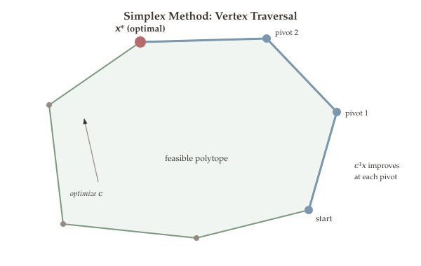

The simplex method is the most celebrated algorithm for solving linear programs. Rather than enumerating all vertices of the feasible polyhedron -- which we showed in [Part 6](09-lp-formulation-geometry.qmd) requires checking up to $\binom{m+n}{n}$ candidates -- the simplex method *smartly navigates* from one vertex to an adjacent one, improving the objective at every step. Each move is called a **pivot**, and the algorithm terminates when no further improvement is possible, certifying optimality.

In this chapter we develop the full simplex algorithm from scratch. We begin by reformulating the LP using the **simplex tableau**, a compact bookkeeping device that encodes the current basic feasible solution and all the information needed to decide the next pivot. We then describe the **pivoting** mechanism: how to choose an entering variable (which non-basic variable should become basic?) and a leaving variable (which basic variable should exit the basis?). We assemble these pieces into the complete **five-step simplex algorithm**, illustrate it on a worked numerical example, and address the critical question of **initialization** -- how to find a starting BFS when one is not immediately available. Finally, we discuss **pivoting rules** (Dantzig's rule and Bland's rule), the phenomenon of **degeneracy** and cycling, and the **oracle complexity** of the simplex method.

## What Will Be Covered {#sec-overview}

- The simplex tableau: dictionary form, relative costs, and transformed constraints
- The pivoting mechanism: entering variable, leaving variable, and the ratio test
- The full five-step simplex algorithm
- A detailed worked example tracing the simplex method through multiple iterations
- Initialization via the Auxiliary LP (Aux-LP)
- Pivoting rules: Dantzig's rule and Bland's rule
- Degeneracy, cycling, and the guarantee of termination
- Oracle complexity of the simplex method

{#fig-simplex-pivot}

## From Canonical to Equational Form {#sec-equational-form}

Recall from [Part 6](09-lp-formulation-geometry.qmd) that a linear program in **canonical form** is:

$$\min \sum_{j=1}^{n} c_j x_j \quad \text{s.t.} \quad \sum_{j=1}^{n} a_{ij} x_j \leq b_i \;\; \forall\, i \in [m], \quad x_j \geq 0 \;\; \forall\, j \in [n].$$

We convert this to **equational form** by introducing $m$ slack variables $x_{n+1}, \ldots, x_{n+m}$:

$$x_{n+i} = b_i - \sum_{j=1}^{n} a_{ij} x_j \geq 0, \quad \forall\, i \in [m].$$

The equational form LP is then:

$$\min \; c^\top x \quad \text{s.t.} \quad Ax = b, \;\; x \geq 0, \;\; x \in \mathbb{R}^{n+m},$$

where the cost vector, constraint matrix, and right-hand side are:

$$c = \begin{pmatrix} c_1 \\ \vdots \\ c_n \\ 0 \\ \vdots \\ 0 \end{pmatrix} \in \mathbb{R}^{n+m}, \quad A = \begin{pmatrix} a_{11} & \cdots & a_{1n} & 1 & 0 & \cdots & 0 \\ \vdots & & \vdots & 0 & 1 & \cdots & 0 \\ a_{m1} & \cdots & a_{mn} & 0 & 0 & \cdots & 1 \end{pmatrix} \in \mathbb{R}^{m \times (n+m)}.$$

The $m$ columns corresponding to slack variables form an identity matrix, which will play a crucial role in initialization.

## The Simplex Tableau {#sec-tableau}

The simplex tableau is the central data structure of the simplex method. It compactly represents the current basic feasible solution and all the information needed to decide the next pivot.

### Setting Up the Tableau {#sec-tableau-setup}

Let $B \subseteq [n+m]$ be a set of $m$ indices. If $B$ yields a **basic feasible solution** (BFS), we denote:

$$x_B^* = A_B^{-1} b \geq 0,$$

where $A_B$ is the $m \times m$ submatrix of $A$ formed by the columns indexed by $B$. Feasibility requires $x_B^* \geq 0$. The full BFS is $x = (x_B^*, 0)$ -- basic variables take the values $x_B^*$, non-basic variables are zero.

Writing $N = [n+m] \setminus B$ for the non-basic index set, the equational form LP becomes:

$$\min \; \zeta = c_B^\top x_B + c_N^\top x_N \quad \text{s.t.} \quad A_B x_B + A_N x_N = b, \;\; x_B, x_N \geq 0.$$

Since $A_B$ is invertible at a BFS, we can solve for $x_B$:

$$x_B = A_B^{-1} b - A_B^{-1} A_N x_N.$$

Substituting into the objective:

$$\zeta = c_B^\top (A_B^{-1} b - A_B^{-1} A_N x_N) + c_N^\top x_N = c_B^\top A_B^{-1} b + \bigl(c_N - (A_B^{-1} A_N)^\top c_B\bigr)^\top x_N.$$

::: {#def-simplex-quantities}
## Definition 15.1 (Simplex Tableau Quantities)

Given a basis $B$ with BFS $x_B^* = A_B^{-1} b \geq 0$, define:

- **Transformed RHS (current BFS values):** $\widetilde{b} = A_B^{-1} b = x_B^*$
- **Transformed constraint matrix:** $\widetilde{A} = A_B^{-1} A_N$
- **Relative cost vector:** $\widetilde{c} = c_N - \widetilde{A}^\top c_B = c_N - A_N^\top (A_B^{-\top}) c_B$
- **Current objective value:** $\widetilde{\zeta} = c_B^\top \widetilde{b} = c_B^\top A_B^{-1} b = c_B^\top x_B^*$
:::

### The Dictionary Form {#sec-dictionary}

Using these quantities, we can write the LP in **dictionary form**:

$$\min_{x_N} \; \zeta = \widetilde{\zeta} + \widetilde{c}^\top x_N \quad \text{s.t.} \quad x_B = \widetilde{b} - \widetilde{A}\, x_N, \;\; x_B, x_N \geq 0.$$ {#eq-dictionary-form}

This is equivalent to the original LP, but expressed entirely in terms of the non-basic variables $x_N$. At the current BFS, $x_N = 0$, so $x_B = \widetilde{b}$ and $\zeta = \widetilde{\zeta}$.

### The Tableau Layout {#sec-tableau-layout}

The simplex tableau is a compact matrix representation of the dictionary:

$$\text{Tableau:} \quad \begin{pmatrix} \widetilde{\zeta} & \widetilde{c}^\top \\ \widetilde{b} & -\widetilde{A} \end{pmatrix} \quad \Longleftrightarrow \quad \begin{pmatrix} \zeta \\ x_B \end{pmatrix} = \begin{pmatrix} \widetilde{\zeta} & \widetilde{c}^\top \\ \widetilde{b} & -\widetilde{A} \end{pmatrix} \begin{pmatrix} 1 \\ x_N \end{pmatrix}.$$ {#eq-tableau-form}

The **columns** correspond to non-basic variables (currently set to zero), and the **rows** correspond to basic variables (currently at positive values $\widetilde{b}$).

::: {.callout-tip}
## Reading the Tableau

- The top row gives the current objective value $\widetilde{\zeta}$ and the relative costs $\widetilde{c}^\top$.
- The remaining rows give the current BFS values $\widetilde{b}$ and the exchange coefficients $-\widetilde{A}$.
- **Optimality test:** If $\widetilde{c} \geq 0$ (all relative costs nonneg), the current BFS is optimal.
- **Pivoting** amounts to choosing a column $q \in N$ and a row $p \in B$ to swap.
:::

## Simplex Pivoting {#sec-pivoting}

With the tableau (@eq-tableau-form) encoding the current BFS and its associated data, we can now describe the mechanism that drives the simplex method forward. A **pivot** is a single iteration of the simplex method. It moves from one BFS to an adjacent BFS by swapping one variable into the basis and one out.

### Choosing the Entering Variable {#sec-entering}

The entering variable $q$ is a non-basic variable whose relative cost is negative, meaning that increasing $x_q$ from zero will decrease the objective.

::: {#def-entering-variable}
## Definition 15.2 (Entering Variable)

Choose $q \in N$ such that $\widetilde{c}_q < 0$. This means increasing $x_q$ from zero will decrease the objective value.

If no such $q$ exists (i.e., $\widetilde{c}_j \geq 0$ for all $j \in N$), then the current BFS is **optimal**.
:::

### Choosing the Leaving Variable: The Ratio Test {#sec-ratio-test}

Once we have chosen the entering variable $q$, we need to determine how much we can increase $x_q$ while keeping all basic variables nonneg. The dictionary form (@eq-dictionary-form) shows that increasing $x_q$ decreases some basic variables, and the ratio test determines the maximum feasible step.

Setting $x_j = 0$ for all $j \in N \setminus \{q\}$ and $x_q = t \geq 0$, the basic variables become:

$$x_B = \widetilde{b} - t \cdot \widetilde{A}_q,$$

where $\widetilde{A}_q$ is the $q$-th column of $\widetilde{A}$ (the column corresponding to the entering variable). For each basic variable $i \in B$:

$$x_i = \widetilde{b}_i - t \cdot \widetilde{A}_{iq}.$$

We need $x_i \geq 0$ for all $i \in B$. For any $i$ with $\widetilde{A}_{iq} > 0$, this requires $t \leq \widetilde{b}_i / \widetilde{A}_{iq}$.

::: {#def-ratio-test}
## Definition 15.3 (Ratio Test and Leaving Variable)

The maximum step size is:

$$t^* = \min\left\{\frac{\widetilde{b}_i}{\widetilde{A}_{iq}} : \widetilde{A}_{iq} > 0, \;\; i \in B\right\}.$$ {#eq-ratio-test}

- If $\widetilde{A}_{iq} \leq 0$ for all $i \in B$, then $x_q$ can be increased without bound, and the LP is **unbounded**.
- Otherwise, the **leaving variable** is:

$$p = \arg\min_{i \in B}\left\{\frac{\widetilde{b}_i}{\widetilde{A}_{iq}} : \widetilde{A}_{iq} > 0\right\}.$$
:::

### Effect of a Pivot {#sec-pivot-effect}

After pivoting with entering variable $q$ and leaving variable $p$:

- $x_p \leftarrow 0$ (leaves the basis, becomes non-basic)
- $x_q \leftarrow t^* = \widetilde{b}_p / \widetilde{A}_{pq} \geq 0$ (enters the basis)
- All other variables remain unchanged
- The basis updates: $B' = \{j \in B : j \neq p\} \cup \{q\}$, $N' = \{j \in N : j \neq q\} \cup \{p\}$

::: {.callout-tip}
## Key Properties of a Pivot

1. **Feasibility is maintained:** The ratio test ensures no basic variable becomes negative.
2. **The objective decreases (or stays the same):** The objective changes by $-t^* \cdot |\widetilde{c}_q| = \widetilde{c}_q \cdot \widetilde{b}_p / \widetilde{A}_{pq} \leq 0$ since $\widetilde{c}_q < 0$ and $\widetilde{b}_p / \widetilde{A}_{pq} \geq 0$.
3. **Degeneracy warning:** If $\widetilde{b}_p = 0$, then $t^* = 0$ and the objective does not decrease. This is the phenomenon of **degeneracy**.
:::

## The Full Simplex Algorithm {#sec-full-algorithm}

We now assemble the pieces into the complete simplex algorithm.

::: {.callout-important}
## Algorithm: The Simplex Method (5 Steps)

**Input:** A basis $B$ yielding a BFS $x_B^* = A_B^{-1} b \geq 0$.

**Step 1 (Compute tableau):** Compute $\widetilde{c}$, $\widetilde{A}$, $\widetilde{b}$, $\widetilde{\zeta}$ from the current basis $B$.

**Step 2 (Optimality check):** If $\widetilde{c}_j \geq 0$ for all $j \in N$, **STOP** -- the current BFS is **optimal**.

**Step 3 (Select entering variable):** Choose $q \in N$ with $\widetilde{c}_q < 0$ (according to some pivoting rule).

**Step 4 (Ratio test):** If $\widetilde{A}_{iq} \leq 0$ for all $i \in B$, **STOP** -- the LP is **unbounded**. Otherwise, compute:

$$t^* = \min_{i \in B}\left\{\frac{\widetilde{b}_i}{\widetilde{A}_{iq}} : \widetilde{A}_{iq} > 0\right\}, \quad p = \arg\min_{i \in B}\left\{\frac{\widetilde{b}_i}{\widetilde{A}_{iq}} : \widetilde{A}_{iq} > 0\right\}.$$

**Step 5 (Pivot):** Update $B \leftarrow (B \setminus \{p\}) \cup \{q\}$, $N \leftarrow (N \setminus \{q\}) \cup \{p\}$. Go to Step 1.
:::

```python
#| label: fig-simplex-flowchart
#| fig-cap: "Figure 15.1: Flowchart of the simplex method. The algorithm iterates through tableau computation, optimality check, entering variable selection, ratio test, and pivoting."
#| echo: false

import plotly.graph_objects as go

fig = go.Figure()

# Boxes
boxes = [
    (0.5, 0.92, 'Step 1: Compute tableau<br>(c\u0303, A\u0303, b\u0303, \u03b6\u0303)'),
    (0.5, 0.74, 'Step 2: All c\u0303\u2c7c \u2265 0 ?'),
    (0.5, 0.56, 'Step 3: Choose entering<br>variable q with c\u0303q < 0'),
    (0.5, 0.38, 'Step 4: Ratio test<br>All A\u0303\u1d62q \u2264 0 ?'),
    (0.5, 0.20, 'Step 5: Pivot<br>B \u2190 (B\\{p})\u222a{q}'),
]
colors = ['#7b97ad', '#b8995e', '#7a9a7e', '#b8995e', '#907ea0']

for (x, y, txt), col in zip(boxes, colors):
    fig.add_shape(type='rect',
        x0=x-0.22, y0=y-0.06, x1=x+0.22, y1=y+0.06,
        line=dict(color=col, width=2), fillcolor=f'rgba({int(col[1:3],16)},{int(col[3:5],16)},{int(col[5:7],16)},0.12)')
    fig.add_annotation(x=x, y=y, text=txt, showarrow=False,
        font=dict(size=11), align='center')

# Arrows between boxes (vertical flow)
for i in range(len(boxes)-1):
    fig.add_annotation(x=0.5, y=boxes[i][1]-0.06, ax=0.5, ay=boxes[i+1][1]+0.06,
        xref='x', yref='y', axref='x', ayref='y',
        showarrow=True, arrowhead=2, arrowsize=1.2, arrowcolor='#555')

# Loop back arrow from Step 5 to Step 1
fig.add_annotation(x=0.28, y=0.20, ax=0.28, ay=0.92,
    xref='x', yref='y', axref='x', ayref='y',
    showarrow=True, arrowhead=2, arrowsize=1.2, arrowcolor='#907ea0')
fig.add_annotation(x=0.22, y=0.56, text='loop', showarrow=False,
    font=dict(size=9, color='#907ea0'))

# Side labels for STOP conditions
fig.add_annotation(x=0.82, y=0.74, text='Yes \u2192 OPTIMAL', showarrow=False,
    font=dict(size=11, color='#7a9a7e'))
fig.add_annotation(x=0.82, y=0.38, text='Yes \u2192 UNBOUNDED', showarrow=False,
    font=dict(size=11, color='#b56b6b'))

fig.update_layout(
    xaxis=dict(range=[0, 1.1], visible=False),
    yaxis=dict(range=[0.08, 1.02], visible=False),
    showlegend=False, margin=dict(t=10, b=10, l=10, r=10),
    height=520, width=550)
fig.show()
```

The five-step algorithm above is the complete specification of the simplex method. To make the mechanics concrete, we now work through a small example by hand, tracing every tableau computation and pivot decision.

## Worked Example {#sec-example}

Let us trace the simplex method on a concrete LP with $n = 2$ decision variables and $m = 2$ constraints.

::: {#exm-simplex-worked}
## Simplex Method on a 2D LP

Consider the LP in canonical form:

$$\min \; -x_2 \quad \text{s.t.} \quad -x_1 + x_2 \leq 1, \;\; x_1 + x_2 \leq 2, \;\; x_1, x_2 \geq 0.$$

**Equational form.** Introduce slack variables $x_3, x_4$:

$$\min \; -\bar{c}^\top x \quad \text{s.t.} \quad \bar{A} x = b, \;\; x \geq 0, \;\; x \in \mathbb{R}^4,$$

where

$$\bar{c} = \begin{pmatrix} 0 \\ -1 \\ 0 \\ 0 \end{pmatrix}, \quad \bar{A} = \begin{pmatrix} -1 & 1 & 1 & 0 \\ 1 & 1 & 0 & 1 \end{pmatrix}, \quad b = \begin{pmatrix} 1 \\ 2 \end{pmatrix}.$$

**Enumerate all BFS.** The index set is $\{1, 2, 3, 4\}$. We choose $m = 2$ indices for $B$:

| $B$ | $A_B$ | $x_B^* = A_B^{-1}b$ | Full $x$ | Feasible? | BFS label |
|-----|--------|----------------------|----------|-----------|-----------|
| $\{1,2\}$ | $\begin{pmatrix} -1 & 1 \\ 1 & 1 \end{pmatrix}$ | $\begin{pmatrix} 0.5 \\ 1.5 \end{pmatrix}$ | $(0.5, 1.5, 0, 0)$ | Yes | $a$ |
| $\{1,3\}$ | $\begin{pmatrix} -1 & 1 \\ 1 & 0 \end{pmatrix}$ | $\begin{pmatrix} 2 \\ 3 \end{pmatrix}$ | $(2, 0, 3, 0)$ | Yes | $b$ |
| $\{1,4\}$ | $\begin{pmatrix} -1 & 0 \\ 1 & 1 \end{pmatrix}$ | $\begin{pmatrix} -1 \\ 3 \end{pmatrix}$ | $(-1, 0, 0, 3)$ | **No** | -- |
| $\{2,3\}$ | $\begin{pmatrix} 1 & 1 \\ 1 & 0 \end{pmatrix}$ | $\begin{pmatrix} 2 \\ -1 \end{pmatrix}$ | $(0, 2, -1, 0)$ | **No** | -- |
| $\{2,4\}$ | $\begin{pmatrix} 1 & 0 \\ 1 & 1 \end{pmatrix}$ | $\begin{pmatrix} 1 \\ 1 \end{pmatrix}$ | $(0, 1, 0, 1)$ | Yes | $d$ |
| $\{3,4\}$ | $\begin{pmatrix} 1 & 0 \\ 0 & 1 \end{pmatrix}$ | $\begin{pmatrix} 1 \\ 2 \end{pmatrix}$ | $(0, 0, 1, 2)$ | Yes | $e$ |

There are 4 feasible BFS: $a, b, d, e$.

**Simplex iterations.** We initialize with $B = \{3, 4\}$ (the slack variables), which gives the BFS $e = (0, 0, 1, 2)$ at the origin.

**Initialization.** $B = \{3, 4\}$, $N = \{1, 2\}$.

Compute the tableau quantities:

$$\widetilde{A} = A_B^{-1} A_N = I \cdot \begin{pmatrix} -1 & 1 \\ 1 & 1 \end{pmatrix} = \begin{pmatrix} -1 & 1 \\ 1 & 1 \end{pmatrix}, \quad \widetilde{b} = \begin{pmatrix} 1 \\ 2 \end{pmatrix}, \quad \widetilde{c} = c_N - \widetilde{A}^\top c_B = \begin{pmatrix} 0 \\ -1 \end{pmatrix} - \begin{pmatrix} 0 \\ 0 \end{pmatrix} = \begin{pmatrix} 0 \\ -1 \end{pmatrix}.$$

Since $\widetilde{c}_2 = -1 < 0$, the BFS is not optimal. We choose $q = 2$ (entering variable).

**Ratio test:** We need $t \cdot \widetilde{A}_{iq} \leq \widetilde{b}_i$ for each $i$ with $\widetilde{A}_{iq} > 0$:

$$t \cdot \begin{pmatrix} 1 \\ 1 \end{pmatrix} \leq \begin{pmatrix} 1 \\ 2 \end{pmatrix} \quad \Longrightarrow \quad t^* = \min\left\{\frac{1}{1}, \frac{2}{1}\right\} = 1, \quad p = 3.$$

**Iteration 1.** Pivot $(p, q) = (3, 2)$. Update $B = \{2, 4\}$, $N = \{1, 3\}$.

Compute the new tableau:

$$\widetilde{A} = A_B^{-1} A_N = \begin{pmatrix} 1 & 0 \\ 1 & 1 \end{pmatrix}^{-1}\begin{pmatrix} -1 & 1 \\ 1 & 0 \end{pmatrix} = \begin{pmatrix} -1 & 1 \\ 2 & -1 \end{pmatrix}, \quad \widetilde{b} = \begin{pmatrix} 1 \\ 1 \end{pmatrix}, \quad \widetilde{c} = \begin{pmatrix} -1 \\ 1 \end{pmatrix}.$$

Note: $\widetilde{c}_1 = -1 < 0$, so choose $q = 1$ (entering variable).

**Ratio test:**

$$t \cdot \begin{pmatrix} -1 \\ 2 \end{pmatrix} \leq \begin{pmatrix} 1 \\ 1 \end{pmatrix}.$$

Only $\widetilde{A}_{2,1} = 2 > 0$ (the row for index 4), so $t^* = 1/2$, $p = 4$. Pivot $(4, 1)$.

**Iteration 2.** Pivot $(p, q) = (4, 1)$. Update $B = \{1, 2\}$, $N = \{3, 4\}$.

This gives BFS $a = (0.5, 1.5, 0, 0)$ with objective $\zeta = -1.5$.

Computing the new relative costs: $\widetilde{c} \geq 0$ (both components nonneg). **STOP -- optimal!**

The simplex method found the optimal solution $x^* = (0.5, 1.5)$ with $\zeta^* = -1.5$ in two pivots, visiting BFS $e \to d \to a$.
:::

```python
#| label: fig-simplex-path
#| fig-cap: "Figure 15.2: The simplex method traces a path along edges of the feasible polytope. Starting from the origin (BFS e), it pivots to BFS d, then to the optimal BFS a. Hover over vertices for details."
#| echo: false

import plotly.graph_objects as go
import numpy as np

# Feasible region vertices (in order for polygon)
poly_x = [0, 2, 0.5, 0, 0]
poly_y = [0, 0, 1.5, 1, 0]

# BFS points
bfs = {
    'e': (0, 0, 'B={3,4}, \u03b6=0'),
    'd': (0, 1, 'B={2,4}, \u03b6=\u22121'),
    'a': (0.5, 1.5, 'B={1,2}, \u03b6=\u22121.5 (optimal)'),
    'b': (2, 0, 'B={1,3}, \u03b6=0'),
}

fig = go.Figure()

# Feasible region
fig.add_trace(go.Scatter(x=poly_x, y=poly_y, fill='toself',
    fillcolor='rgba(123,143,163,0.15)', line=dict(color='#7b97ad', width=2.5),
    name='Feasible region', mode='lines'))

# Constraint lines (extended)
# -x1 + x2 = 1
xx = np.linspace(-0.5, 3, 100)
fig.add_trace(go.Scatter(x=xx, y=xx+1, mode='lines',
    line=dict(color='#968a80', dash='dot', width=1.2),
    name='\u2212x\u2081+x\u2082=1', hoverinfo='skip'))
# x1 + x2 = 2
fig.add_trace(go.Scatter(x=xx, y=2-xx, mode='lines',
    line=dict(color='#968a80', dash='dot', width=1.2),
    name='x\u2081+x\u2082=2', hoverinfo='skip'))

# Objective contours
for val in [0, -0.5, -1, -1.5]:
    fig.add_trace(go.Scatter(x=[-0.5, 3], y=[val, val], mode='lines',
        line=dict(color='#b8995e', dash='dash', width=1),
        showlegend=(val == 0),
        name='Objective contours' if val == 0 else '',
        hoverinfo='skip'))

# Simplex path
path_x = [0, 0, 0.5]
path_y = [0, 1, 1.5]
fig.add_trace(go.Scatter(x=path_x, y=path_y, mode='lines+markers',
    line=dict(color='#b56b6b', width=3),
    marker=dict(size=10, color='#b56b6b', symbol='circle',
    line=dict(width=1.5, color='white')),
    name='Simplex path'))

# Add arrows along simplex path
fig.add_annotation(x=0, y=0.5, ax=0, ay=0.1,
    xref='x', yref='y', axref='x', ayref='y',
    showarrow=True, arrowhead=2, arrowsize=1.5, arrowcolor='#b56b6b')
fig.add_annotation(x=0.25, y=1.25, ax=0.05, ay=1.05,
    xref='x', yref='y', axref='x', ayref='y',
    showarrow=True, arrowhead=2, arrowsize=1.5, arrowcolor='#b56b6b')

# BFS labels
for label, (bx, by, info) in bfs.items():
    fig.add_trace(go.Scatter(x=[bx], y=[by], mode='markers+text',
        marker=dict(color='#8a6e5e', size=9, line=dict(width=1, color='white')),
        text=[label], textposition='top right',
        textfont=dict(size=13, color='#8a6e5e'),
        hovertext=[f'BFS {label}: ({bx},{by})<br>{info}'],
        hoverinfo='text', showlegend=False))

# Optimal star
fig.add_trace(go.Scatter(x=[0.5], y=[1.5], mode='markers',
    marker=dict(color='#b56b6b', size=15, symbol='star',
    line=dict(width=1, color='white')),
    name='Optimal: (0.5, 1.5)'))

# Iteration annotations
fig.add_annotation(x=-0.18, y=0.5, text='Iter 1', showarrow=False,
    font=dict(size=10, color='#b56b6b'))
fig.add_annotation(x=0.05, y=1.35, text='Iter 2', showarrow=False,
    font=dict(size=10, color='#b56b6b'))

fig.update_layout(
    xaxis=dict(title='x\u2081', range=[-0.5, 2.8], zeroline=True),
    yaxis=dict(title='x\u2082', range=[-0.5, 2.3], zeroline=True, scaleanchor='x'),
    showlegend=True, margin=dict(t=20, b=50, l=55, r=20))
fig.show()
```

```python
#| label: fig-tableau-iterations
#| fig-cap: "Figure 15.3: Interactive simplex tableau at each iteration. Use the dropdown to see how the tableau evolves as the simplex method pivots from one BFS to the next."
#| echo: false

import plotly.graph_objects as go
import numpy as np

# Iteration data
iterations = [
    {
        'title': 'Iteration 0: B={3,4}, N={1,2}',
        'B': [3, 4], 'N': [1, 2],
        'b_tilde': [1, 2],
        'A_tilde': [[-1, 1], [1, 1]],
        'c_tilde': [0, -1],
        'zeta': 0,
        'entering': 'q=2 (c\u0303\u2082=\u22121<0)',
        'leaving': 'p=3 (min{1/1, 2/1}=1)',
        'status': 'Not optimal: c\u0303\u2082 = \u22121 < 0'
    },
    {
        'title': 'Iteration 1: B={2,4}, N={1,3}',
        'B': [2, 4], 'N': [1, 3],
        'b_tilde': [1, 1],
        'A_tilde': [[-1, 1], [2, -1]],
        'c_tilde': [-1, 1],
        'zeta': -1,
        'entering': 'q=1 (c\u0303\u2081=\u22121<0)',
        'leaving': 'p=4 (min{\u2014, 1/2}=0.5)',
        'status': 'Not optimal: c\u0303\u2081 = \u22121 < 0'
    },
    {
        'title': 'Iteration 2: B={1,2}, N={3,4}',
        'B': [1, 2], 'N': [3, 4],
        'b_tilde': [0.5, 1.5],
        'A_tilde': [[0.5, -0.5], [0.5, 0.5]],
        'c_tilde': [0.5, 0.5],
        'zeta': -1.5,
        'entering': 'None',
        'leaving': 'None',
        'status': 'OPTIMAL: all c\u0303 \u2265 0'
    }
]

# Build table for each iteration
fig = go.Figure()

for k, it in enumerate(iterations):
    # Build header
    header = [''] + [f'x<sub>{j}</sub>' for j in it['N']]
    # Build rows
    row_obj = [f'\u03b6\u0303 = {it["zeta"]}'] + [f'{v:+.1f}' for v in it['c_tilde']]
    rows = [row_obj]
    for i_idx, i_val in enumerate(it['B']):
        row = [f'x<sub>{i_val}</sub> = {it["b_tilde"][i_idx]:.1f}']
        for j_idx in range(len(it['N'])):
            row.append(f'{-it["A_tilde"][i_idx][j_idx]:+.1f}')
        rows.append(row)

    cells_vals = list(zip(*rows))
    header_vals = header

    fill_colors = []
    for col_idx in range(len(header)):
        col_colors = []
        for row_idx in range(len(rows)):
            if row_idx == 0:
                col_colors.append('rgba(184,153,94,0.15)')
            else:
                col_colors.append('rgba(123,143,163,0.08)')
        fill_colors.append(col_colors)

    fig.add_trace(go.Table(
        header=dict(values=header_vals,
            fill_color='rgba(123,143,163,0.25)',
            font=dict(size=13), align='center', height=30),
        cells=dict(values=cells_vals,
            fill_color=fill_colors,
            font=dict(size=13), align='center', height=28),
        visible=(k == 0)
    ))

# Add dropdown buttons
buttons = []
for k, it in enumerate(iterations):
    vis = [False] * len(iterations)
    vis[k] = True
    label = it['title']
    status_text = f"<b>{it['status']}</b>"
    if it['entering'] != 'None':
        status_text += f"<br>Entering: {it['entering']}<br>Leaving: {it['leaving']}"
    buttons.append(dict(
        label=label,
        method='update',
        args=[{'visible': vis},
              {'annotations': [dict(
                  x=0.5, y=-0.15, xref='paper', yref='paper',
                  text=status_text, showarrow=False,
                  font=dict(size=12), align='center')]}]
    ))

fig.update_layout(
    updatemenus=[dict(
        type='dropdown', direction='down',
        x=0.5, xanchor='center', y=1.15, yanchor='top',
        buttons=buttons,
        font=dict(size=12))],
    annotations=[dict(
        x=0.5, y=-0.15, xref='paper', yref='paper',
        text=f"<b>{iterations[0]['status']}</b><br>Entering: {iterations[0]['entering']}<br>Leaving: {iterations[0]['leaving']}",
        showarrow=False, font=dict(size=12), align='center')],
    margin=dict(t=60, b=80, l=20, r=20), height=280)
fig.show()
```

The worked example above started from the slack-variable basis $B = \{3, 4\}$, which was immediately feasible because $b \geq 0$. But what happens when some right-hand-side entries are negative and the slack-variable basis is infeasible? We need a systematic method for finding an initial BFS.

## Simplex Initialization via Auxiliary LP {#sec-initialization}

The simplex algorithm requires an initial BFS to start. But how do we find one? This is itself a nontrivial problem. The solution is elegant: we solve an **auxiliary LP** whose feasibility is guaranteed, and whose optimal solution provides a starting BFS for the original problem.

### The Easy Case: $b \geq 0$ {#sec-easy-init}

Consider the canonical form LP with slack variables:

$$\min \; c^\top x \quad \text{s.t.} \quad Ax = b, \;\; x \geq 0, \;\; x \in \mathbb{R}^{n+m},$$

where $A$ includes the identity block from the slack variables. If $b \geq 0$ (all RHS entries are nonneg), we can immediately set:

$$B = \{n+1, n+2, \ldots, n+m\} \quad \text{(the slack variables)}.$$

This gives the BFS $x = (0, \ldots, 0, b_1, \ldots, b_m)$, which is feasible since $b \geq 0$.

### The Hard Case: Some $b_i < 0$ {#sec-hard-init}

When some $b_i < 0$, the slack-variable basis is infeasible. We construct an **auxiliary LP** by introducing a new variable $x_0 \geq 0$:

::: {#def-auxiliary-lp}
## Definition 15.4 (Auxiliary LP)

Given the original LP $\min c^\top x$ s.t. $\sum_{j=1}^n a_{ij} x_j \leq b_i$, $x_j \geq 0$, the **Auxiliary LP** is:

$$\text{(Aux-LP)} \quad \min \; x_0 \quad \text{s.t.} \quad \sum_{j=1}^{n} a_{ij} x_j - x_0 \leq b_i \;\; \forall\, i \in [m], \quad x_j \geq 0 \;\; \forall\, j \in \{0, 1, \ldots, n\}.$$
:::

The auxiliary variable $x_0$ acts as a "slack buffer" that absorbs the infeasibility: by making $x_0$ large enough, all constraints can be satisfied.

::: {#thm-aux-lp-properties}
## Theorem 15.5 (Properties of the Auxiliary LP)

The Auxiliary LP has the following properties:

1. **The Aux-LP is always feasible.** Setting $x_1 = \cdots = x_n = 0$ and $x_0 = -\min_i b_i$ (which is positive when some $b_i < 0$) gives a feasible solution. After adding slack variables, this yields a BFS with $B = \{n+1, \ldots, n+m\}$ (plus possibly $x_0$ replacing one slack).

2. **The original LP is feasible if and only if the optimal value of the Aux-LP is zero** (i.e., $x_0^* = 0$).

3. **If the Aux-LP optimal value is zero, the optimal BFS of the Aux-LP provides a starting BFS for the original LP** (after dropping $x_0$).
:::

::: {.callout-important}
## Algorithm: Simplex Initialization

1. **Check** if $b \geq 0$. If so, use $B = \{n+1, \ldots, n+m\}$ (slack variables) as the initial basis. Done.
2. **Otherwise**, formulate the Auxiliary LP and solve it using the simplex method (the Aux-LP itself has an obvious initial BFS).
3. **If** the optimal value of the Aux-LP is zero, the optimal BFS becomes the initial BFS for the original LP. Run simplex from here.
4. **If** the optimal value of the Aux-LP is positive, the original LP is **infeasible**.
:::

::: {#exm-aux-lp}
## Auxiliary LP Example

Consider the LP:

$$\min \; -x_1 + x_2 - x_3 \quad \text{s.t.} \quad 2x_1 - x_2 + 2x_3 \leq 4, \;\; 2x_1 - 3x_2 + x_3 \leq -5, \;\; -x_1 + x_2 - 2x_3 \leq -1, \;\; x_1, x_2, x_3 \geq 0.$$

Since $b_2 = -5 < 0$ and $b_3 = -1 < 0$, we cannot directly start simplex. The Auxiliary LP is:

$$\min \; x_0 \quad \text{s.t.} \quad 2x_1 - x_2 + 2x_3 - x_0 \leq 4, \;\; 2x_1 - 3x_2 + x_3 - x_0 \leq -5, \;\; -x_1 + x_2 - 2x_3 - x_0 \leq -1, \;\; x_0, x_1, x_2, x_3 \geq 0.$$

We can initialize the Aux-LP with $x_1 = x_2 = x_3 = 0$, $x_0 = 5$ (since $-\min_i b_i = 5$). Running simplex on the Aux-LP, if the optimal value is 0, we extract the BFS and continue with the original objective.
:::

With the auxiliary LP, we can now initialize the simplex method on any LP --- the last remaining gap in the algorithm. The final design choice is the pivoting rule: among all non-basic variables with negative relative cost, which one should enter the basis? This choice turns out to have deep implications for whether the algorithm terminates at all.

## Pivoting Rules {#sec-pivoting-rules}

The simplex algorithm leaves freedom in **Step 3**: how to choose the entering variable $q$ among all non-basic variables with negative relative cost. Different choices lead to different pivoting rules, with significant implications for termination and performance.

### Dantzig's Rule {#sec-dantzig}

::: {#def-dantzig-rule}
## Definition 15.6 (Dantzig's Pivoting Rule)

**Entering variable:** Choose the non-basic variable with the **most negative** relative cost:

$$q = \arg\min_{j \in N} \left\{\widetilde{c}_j : \widetilde{c}_j < 0\right\}.$$

**Leaving variable:** Perform the ratio test (@eq-ratio-test). If there are ties, break by choosing the **smallest index**:

$$p = \arg\min_{i \in B} \left\{\frac{\widetilde{b}_i}{\widetilde{A}_{iq}} : \widetilde{A}_{iq} > 0\right\}.$$
:::

Dantzig's rule is intuitive: pick the variable that decreases the objective the fastest (per unit increase). However, it has a serious flaw.

::: {.callout-warning}
## Dantzig's Rule Can Cycle

Unfortunately, the simplex method with Dantzig's rule **can run forever**. In degenerate cases, it will cycle among a few extreme points with equal objective value, never terminating.
:::

### Degeneracy and Cycling {#sec-degeneracy}

::: {#def-degeneracy}
## Definition 15.7 (Degeneracy)

A BFS is **degenerate** if some basic variable has value zero, i.e., $\widetilde{b}_i = 0$ for some $i \in B$ (equivalently, $x_B^*$ contains a zero entry).
:::

When a BFS is degenerate, a pivot may produce $t^* = 0$, meaning the objective does not improve. The basis changes but the BFS point does not move. If a sequence of such zero-step pivots returns to a previously visited basis, the algorithm **cycles** and never terminates.

::: {#exm-cycling}
## A Cycling Example

The following LP (from Beale, adapted by Marshall) cycles under Dantzig's rule:

$$\max \; \zeta = 10x_1 - 57x_2 - 9x_3 - 24x_4 \quad \text{s.t.}$$
$$0.5x_1 - 5.5x_2 - 2.5x_3 + 9x_4 \leq 0,$$
$$0.5x_1 - 1.5x_2 - 0.5x_3 + x_4 \leq 0,$$
$$x_1 \leq 1,$$
$$x_1, x_2, x_3, x_4 \geq 0.$$

The initial BFS has $\widetilde{b}_1 = \widetilde{b}_2 = 0$ (degenerate). Under Dantzig's rule, the simplex method cycles through a sequence of bases, returning to the starting basis without improving the objective.
:::

::: {#thm-cycling}
## Theorem 15.8 (Cycling and Non-Termination)

If the simplex method fails to terminate, then it must cycle -- that is, it revisits the same basis.
:::

::: {.proof}
The number of possible bases is finite (at most $\binom{n+m}{m}$). If the algorithm does not terminate, it must visit some basis twice. Since the simplex method is deterministic given a pivot rule, once it revisits a basis, it will repeat the same sequence of pivots indefinitely. $\blacksquare$
:::

### Bland's Rule {#sec-bland}

Since Dantzig's rule can cycle, we need a pivoting rule that guarantees termination. Bland's rule resolves the cycling problem by using a simple, deterministic tie-breaking strategy: always choose the variable with the **smallest index**.

::: {#def-bland-rule}
## Definition 15.9 (Bland's Pivoting Rule)

**Entering variable:** Choose the non-basic variable with **smallest index** among those with negative relative cost:

$$q = \min\left\{j \in N : \widetilde{c}_j < 0\right\}.$$

**Leaving variable:** Perform the ratio test (@eq-ratio-test). If there are ties, break by choosing the **smallest index**:

$$p = \arg\min_{i \in B}\left\{\frac{\widetilde{b}_i}{\widetilde{A}_{iq}} : \widetilde{A}_{iq} > 0\right\}, \quad \text{with ties broken by smallest } i.$$
:::

::: {#thm-bland-termination}
## Theorem 15.10 (Bland's Rule Guarantees Termination)

The simplex method with Bland's rule **always terminates**.
:::

This is a remarkable result. The simple prescription "choose the smallest index" is enough to break all possible cycling patterns, regardless of how degenerate the LP is.

::: {.callout-tip}
## Bland's Rule vs. Dantzig's Rule

| | Dantzig's Rule | Bland's Rule |
|---|---|---|
| **Entering variable** | Most negative $\widetilde{c}_j$ | Smallest index with $\widetilde{c}_j < 0$ |
| **Tie-breaking** | Smallest index | Smallest index |
| **Termination** | Not guaranteed (can cycle) | Always terminates |
| **Practice** | Often faster per iteration | Slower but safe |
:::

Bland's rule resolves the termination question: the simplex method always finishes in finitely many steps. But "finite" is a weak guarantee --- it says nothing about whether the algorithm is efficient. The natural next question is: how many pivots does the simplex method require as a function of the problem size?

### Oracle Complexity {#sec-oracle-complexity}

To analyze the efficiency of the simplex method, we use the **oracle computational model**.

### The Oracle Model {#sec-oracle-model}

In the oracle model, an iterative algorithm interacts with an **oracle** that provides information for each update:

- The **simplex algorithm** maintains the current basis $B$.
- At each iteration, it queries the oracle with the basis $B$.
- The oracle returns $\widetilde{b} = x_B^*$ (the BFS), $\widetilde{c}$ (relative costs), and $\widetilde{A}$ (transformed constraints).
- Using this information, the algorithm decides: (a) the pivot pair $(p, q)$, (b) whether the LP is unbounded ($\widetilde{A}_{iq} \leq 0$ for all $i$), or (c) whether to check feasibility via the Aux-LP.

The **oracle complexity** is the number of queries (= the number of pivots):

$$\text{Oracle complexity} = \#\text{ queries of } \{\widetilde{b}, \widetilde{c}, \widetilde{A}\} = \#\text{ pivots } (p, q).$$

### Complexity Guarantee {#sec-complexity-guarantee}

::: {.callout-warning}
## No Polynomial Bound Known

With Bland's rule, the simplex method is guaranteed to terminate in a **finite** number of pivots. However, we do not know how the number of pivots scales as a function of $m$ and $n$.

**"No guarantee beyond finiteness."**

The worst-case number of pivots can be exponential (e.g., the Klee-Minty cube requires $2^n - 1$ pivots with certain pivot rules). Whether there exists a pivot rule that guarantees a polynomial number of pivots remains one of the major open questions in optimization.
:::

Despite this worst-case behavior, the simplex method is remarkably efficient in practice. Empirically, the number of pivots is typically $O(m)$ to $O(m \log n)$ -- far from the exponential worst case. This practical efficiency, combined with the method's ability to exploit problem structure and warm-start from nearby solutions, is why simplex remains the algorithm of choice for most LP solvers.

## Simplex Method Step by Step {#sec-step-by-step}

The following visualization traces the simplex method step by step on the worked example. Use the slider to advance through iterations and observe how the entering and leaving variable selection drives the algorithm from one BFS to the next.

```python
#| label: fig-simplex-interactive
#| fig-cap: "Figure 15.4: Interactive simplex method demo. Use the slider to step through pivot iterations. The red arrow shows the direction of movement, and the highlighted vertex is the current BFS."
#| echo: false

import plotly.graph_objects as go
import numpy as np

# Feasible region
poly_x = [0, 2, 0.5, 0, 0]
poly_y = [0, 0, 1.5, 1, 0]

# Simplex path: e -> d -> a
path = [
    {'label': 'e', 'x': 0, 'y': 0, 'B': '{3,4}', 'obj': 0,
     'desc': 'Start: BFS e at origin.<br>c\u0303 = (0, \u22121). Enter q=2, leave p=3.'},
    {'label': 'd', 'x': 0, 'y': 1, 'B': '{2,4}', 'obj': -1,
     'desc': 'After pivot (3,2): BFS d.<br>c\u0303 = (\u22121, 1). Enter q=1, leave p=4.'},
    {'label': 'a', 'x': 0.5, 'y': 1.5, 'B': '{1,2}', 'obj': -1.5,
     'desc': 'After pivot (4,1): BFS a.<br>c\u0303 = (0.5, 0.5) \u2265 0. OPTIMAL!'},
]

# Non-visited BFS
other_bfs = [
    {'label': 'b', 'x': 2, 'y': 0},
]

frames = []
for step in range(len(path)):
    frame_data = []

    # Feasible region
    frame_data.append(go.Scatter(x=poly_x, y=poly_y, fill='toself',
        fillcolor='rgba(123,143,163,0.15)', line=dict(color='#7b97ad', width=2.5),
        name='Feasible region', mode='lines'))

    # Constraint lines
    xx = np.linspace(-0.5, 3, 50)
    frame_data.append(go.Scatter(x=xx.tolist(), y=(xx+1).tolist(), mode='lines',
        line=dict(color='#968a80', dash='dot', width=1), showlegend=False, hoverinfo='skip'))
    frame_data.append(go.Scatter(x=xx.tolist(), y=(2-xx).tolist(), mode='lines',
        line=dict(color='#968a80', dash='dot', width=1), showlegend=False, hoverinfo='skip'))

    # Other BFS (gray)
    for ob in other_bfs:
        frame_data.append(go.Scatter(x=[ob['x']], y=[ob['y']], mode='markers+text',
            marker=dict(color='#aaa', size=7), text=[ob['label']],
            textposition='bottom right', textfont=dict(size=10, color='#aaa'),
            showlegend=False, hoverinfo='skip'))

    # Visited path so far
    px = [p['x'] for p in path[:step+1]]
    py = [p['y'] for p in path[:step+1]]
    frame_data.append(go.Scatter(x=px, y=py, mode='lines',
        line=dict(color='#b56b6b', width=3, dash='solid'),
        name='Simplex path', showlegend=(step == 0)))

    # Visited vertices
    for k in range(step+1):
        p = path[k]
        is_current = (k == step)
        sz = 14 if is_current else 8
        sym = 'star' if (is_current and step == len(path)-1) else ('circle' if not is_current else 'diamond')
        col = '#b56b6b' if is_current else '#8a6e5e'
        frame_data.append(go.Scatter(x=[p['x']], y=[p['y']], mode='markers+text',
            marker=dict(color=col, size=sz, symbol=sym, line=dict(width=1.5, color='white')),
            text=[p['label']], textposition='top left',
            textfont=dict(size=12, color=col),
            hovertext=[f"BFS {p['label']}: ({p['x']},{p['y']})<br>B={p['B']}, \u03b6={p['obj']}"],
            hoverinfo='text', showlegend=False))

    # Arrow to next if not last
    annotations = []
    if step < len(path) - 1:
        nx = path[step+1]['x']
        ny = path[step+1]['y']
        cx = path[step]['x']
        cy = path[step]['y']
        mx = (cx + nx) / 2
        my = (cy + ny) / 2
        annotations.append(dict(x=nx, y=ny, ax=cx, ay=cy,
            xref='x', yref='y', axref='x', ayref='y',
            showarrow=True, arrowhead=3, arrowsize=1.5, arrowcolor='#b56b6b',
            arrowwidth=2))

    # Info annotation
    annotations.append(dict(
        x=0.02, y=0.02, xref='paper', yref='paper',
        text=f"<b>Step {step}: B={path[step]['B']}, \u03b6={path[step]['obj']}</b><br>{path[step]['desc']}",
        showarrow=False, font=dict(size=11), align='left',
        bgcolor='rgba(255,255,255,0.85)', bordercolor='#7b97ad', borderwidth=1))

    frames.append(go.Frame(data=frame_data, name=str(step),
        layout=go.Layout(annotations=annotations)))

# Initial figure
fig = go.Figure(data=frames[0].data, frames=frames,
    layout=go.Layout(
        xaxis=dict(title='x\u2081', range=[-0.5, 2.8], zeroline=True),
        yaxis=dict(title='x\u2082', range=[-0.5, 2.3], zeroline=True, scaleanchor='x'),
        showlegend=False,
        annotations=frames[0].layout.annotations,
        margin=dict(t=20, b=70, l=55, r=20),
        sliders=[dict(
            active=0, pad=dict(t=40),
            steps=[dict(args=[[str(k)], dict(mode='immediate',
                frame=dict(duration=0, redraw=True))],
                label=f'Step {k}', method='animate')
                for k in range(len(frames))],
            currentvalue=dict(prefix='', visible=True),
            x=0.1, len=0.8)]))
fig.show()
```

## Summary {#sec-summary}

The simplex method is a complete algorithm for linear programming. Let us recap its key components:

::: {.callout-note appearance="simple"}
## Simplex Method: Key Takeaways

1. **How to decide that an LP is feasible?** Solve the Aux-LP. The original LP is feasible if and only if the optimal value of the Aux-LP equals zero.

2. **How to initialize the simplex method?** If $b \geq 0$, use the slack-variable basis. Otherwise, solve the Aux-LP -- its optimal BFS provides the starting basis.

3. **How to decide the entering and leaving variables?** Use a pivoting rule:
   - **Bland's rule**: smallest index with negative relative cost (for entering); ratio test with smallest-index tie-breaking (for leaving).

4. **How to detect unboundedness?** During the ratio test: if $\widetilde{A}_{iq} \leq 0$ for all $i \in B$, the LP is unbounded.

5. **Does simplex terminate?** Yes, using Bland's rule. But with no known polynomial bound on the number of pivots -- "no guarantee beyond finiteness."
:::

::: {.callout-tip}
## Looking Ahead

The simplex method is extraordinarily effective in practice, typically solving LPs in $O(m)$ to $O(m \log n)$ pivots. However, its worst-case exponential complexity motivates the search for algorithms with provably polynomial guarantees. In the next chapter, we study **interior point methods**, which achieve polynomial-time complexity by traversing the interior of the feasible region rather than its boundary.
:::
