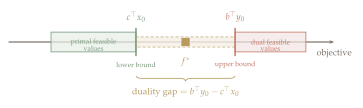
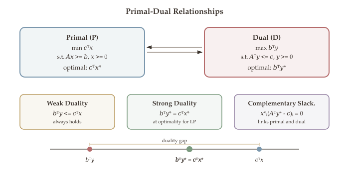
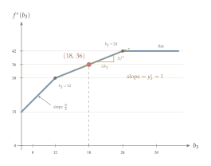
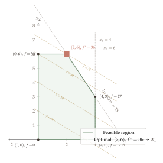

The [simplex method](10-simplex-method.qmd) finds an optimal solution by moving from vertex to vertex. But suppose the algorithm hands you a solution $x^*$ and claims it is optimal. **How do you know it is truly the best?** Simply checking feasibility is not enough --- you need a *certificate* that no feasible point can do better.

Duality theory provides exactly this certificate. The core idea: for every LP (the **primal**), there is a companion LP (the **dual**) whose feasible solutions provide **upper bounds** on the primal's optimal value. When a primal feasible value matches a dual feasible value, the gap is zero and both must be optimal. This simple idea --- bounding from both sides --- leads to one of the deepest and most useful frameworks in optimization.

## What Will Be Covered {.unnumbered}

- Motivation: certificates of optimality via upper bounds on the objective
- Constructing the dual LP from primal constraints
- Weak duality: dual feasible solutions bound the primal optimal value
- Strong duality: the primal and dual optimal values coincide
- Complementary slackness and its role in certifying optimality
- Economic interpretation of dual variables as shadow prices

## Motivation for Duality {#sec-motivation}

Consider a maximization LP (duality is most naturally stated in this form):

$$
\max_{x \in \mathbb{R}^n} \; c^\top x \quad \text{s.t.} \quad Ax \leq b, \quad x \geq 0.
$$

Let $\Omega = \{x \in \mathbb{R}^n \mid Ax \leq b, \; x \geq 0\}$ be the feasible set and $f^* = \max_{x \in \Omega} c^\top x$ the optimal value.

Suppose someone hands you a feasible point $x_0 \in \Omega$ and claims it is optimal. **How do you verify this?**

- **Lower bound (easy):** Since $x_0$ is feasible, $f_0 = c^\top x_0 \leq f^*$. Any feasible point gives a lower bound on $f^*$.
- **Upper bound (hard):** To prove $f_0 = f^*$, we need to show that *no* feasible point can do better, i.e., $f^* \leq f_0$. This requires an **upper bound** on $c^\top x$ that holds for *every* $x \in \Omega$.

::: {.callout-important}
## The Central Question

Can we systematically produce upper bounds on $c^\top x$ over all feasible $x \in \Omega$, using only the constraint data $(A, b)$? If we can find such an upper bound that equals our candidate value $f_0$, then $f_0 = f^*$ and $x_0$ is certified optimal.
:::

{#fig-duality-motivation}

## Deriving the Dual LP {#sec-deriving-dual}

We now answer the central question by systematically constructing upper bounds on the primal objective. Starting from the primal:

$$
\text{(Primal)} \quad \max_{x \in \mathbb{R}^n} \; c^\top x \quad \text{s.t.} \quad Ax \leq b, \quad x \geq 0,
$$

where $A \in \mathbb{R}^{m \times n}$, $b \in \mathbb{R}^m$, and $c \in \mathbb{R}^n$. Write the constraints row-by-row as $a_i^\top x \leq b_i$ for $i \in [m]$.

### The Multiplier Idea

The derivation follows three simple steps: **multiply**, **sum**, and **dominate**.

**Step 1: Multiply.** For each constraint $a_i^\top x \leq b_i$, introduce a **multiplier** $y_i \geq 0$. Multiplying both sides by $y_i$ preserves the inequality direction (since $y_i \geq 0$):

$$
y_i \cdot a_i^\top x \leq y_i \cdot b_i \quad \forall\, i \in [m].
$$

**Step 2: Sum.** Add all $m$ weighted inequalities:

$$
\sum_{i=1}^{m} y_i \, a_i^\top x \leq \sum_{i=1}^{m} y_i \, b_i, \qquad \text{i.e.,} \quad (A^\top y)^\top x \leq b^\top y.
$$

The left side is a *new* linear function of $x$; the right side is a constant (depending only on $y$).

**Step 3: Dominate.** If the combined left side *dominates* the objective --- meaning $A^\top y \geq c$ component-wise --- then for any feasible $x \geq 0$:

$$
c^\top x \;\leq\; (A^\top y)^\top x \;\leq\; b^\top y.
$$

The first "$\leq$" uses $A^\top y \geq c$ and $x \geq 0$; the second uses the summed constraint from Step 2. We have produced an **upper bound** $b^\top y$ on $c^\top x$ that holds for *every* feasible $x$.

### The Dual LP

To find the **tightest upper bound**, we minimize $b^\top y$ over all valid multipliers:

::: {.callout-note appearance="simple"}
$$
\text{(Dual)} \quad \min_{y \in \mathbb{R}^m} \; b^\top y \quad \text{s.t.} \quad A^\top y \geq c, \quad y \geq 0.
$$
:::

Side by side:

| **Primal LP** | **Dual LP** |
|:---:|:---:|
| $\max \; c^\top x$ | $\min \; b^\top y$ |
| s.t. $Ax \leq b$ | s.t. $A^\top y \geq c$ |
| $x \geq 0$ | $y \geq 0$ |

Notice the elegant symmetry: the primal has $n$ variables and $m$ constraints; the dual has $m$ variables and $n$ constraints. The data $(A, b, c)$ is shared --- only the roles are swapped. The constraint matrix $A$ becomes $A^\top$, the objective $c$ becomes the right-hand side, and the right-hand side $b$ becomes the objective.

The derivation above assumed the primal has only "$\leq$" constraints and nonnegative variables. In practice, LPs may contain equality constraints, "$\geq$" constraints, or free variables. The next section extends the correspondence to handle all cases.

## General Primal-Dual Correspondence {#sec-general-correspondence}

The dual we derived assumed the primal has only "$\leq$" constraints and nonneg variables. Real LPs may have equality constraints, "$\geq$" constraints, or free variables. The same multiply-sum-dominate logic extends to all cases --- the key is tracking how each constraint and variable type affects the signs.

### General Primal Form

Consider a general primal LP (maximization) with:

- $n$ decision variables $x_1, x_2, \ldots, x_n$
- Sign constraints on each $x_j$: either $x_j \geq 0$, $x_j \leq 0$, or $x_j \in \mathbb{R}$ (free)
- $m$ linear constraints $a_i^\top x \; \square \; b_i$ where $\square$ is $\leq$, $=$, or $\geq$
- Objective: $\max \; c^\top x$

### Deriving the Dual

We apply the same recipe, but must handle each case:

**Multiplier signs (from constraint types).** For each constraint $i$, the multiplier $y_i$ must have the right sign so that multiplying preserves a valid upper bound:

- $a_i^\top x \leq b_i$: need $y_i \geq 0$ (multiplying by a nonneg number preserves "$\leq$")
- $a_i^\top x \geq b_i$: need $y_i \leq 0$ (multiplying by a nonpositive number flips "$\geq$" to "$\leq$")
- $a_i^\top x = b_i$: $y_i$ is **free** (both sides are equal, so any sign works)

After summing all weighted constraints, we get $(A^\top y)^\top x \leq b^\top y$ for all feasible $x$.

**Dual constraint types (from variable signs).** We need the combined left side to dominate the objective: $(A^\top y)_j x_j \geq c_j x_j$ for all feasible $x_j$. The sign constraint on $x_j$ determines what this requires:

- $x_j \geq 0$ (can be positive): need $(A^\top y)_j \geq c_j$, so that $(A^\top y)_j x_j \geq c_j x_j$
- $x_j \leq 0$ (can be negative): need $(A^\top y)_j \leq c_j$, so the inequality flips correctly
- $x_j$ free (can be anything): need $(A^\top y)_j = c_j$ exactly (otherwise we could violate domination by choosing $x_j$ with the wrong sign)

The dual LP is: $\min\, b^\top y$ subject to these $n$ constraints and the sign constraints on $y_i$.

### Correspondence Table

::: {#tbl-correspondence}

| **Primal (max $c^\top x$)** | **Dual (min $b^\top y$)** |
|:---|:---|
| Constraint $a_i^\top x \leq b_i$ | Variable $y_i \geq 0$ |
| Constraint $a_i^\top x \geq b_i$ | Variable $y_i \leq 0$ |
| Constraint $a_i^\top x = b_i$ | Variable $y_i$ free |
| Variable $x_j \geq 0$ | Constraint $\sum_i y_i a_{ij} \geq c_j$ |
| Variable $x_j \leq 0$ | Constraint $\sum_i y_i a_{ij} \leq c_j$ |
| Variable $x_j$ free | Constraint $\sum_i y_i a_{ij} = c_j$ |

: Primal-dual correspondence rules. Each row shows how a primal element maps to a dual element.
:::

::: {.callout-tip}
## Mnemonic

There is a beautiful symmetry: **constraint type** in the primal maps to **variable sign** in the dual, and **variable sign** in the primal maps to **constraint type** in the dual. The direction of the inequality always "matches" the sign constraint in a consistent way.
:::

### Common Special Cases (Vector Formulations)

| **Primal** | **Dual** |
|:---|:---|
| $\max \; c^\top x$ s.t. $Ax \leq b$, $x \geq 0$ | $\min \; b^\top y$ s.t. $A^\top y \geq c$, $y \geq 0$ |
| $\max \; c^\top x$ s.t. $Ax \leq b$, $x \in \mathbb{R}^n$ | $\min \; b^\top y$ s.t. $A^\top y = c$, $y \geq 0$ |
| $\max \; c^\top x$ s.t. $Ax = b$, $x \geq 0$ | $\min \; b^\top y$ s.t. $A^\top y \geq c$, $y \in \mathbb{R}^m$ |

### Dual of the Dual = Primal {#sec-dual-of-dual}

A natural question: if we take the dual of the dual, do we recover the original primal? The answer is yes, confirming that duality is a **symmetric** relationship.

::: {#thm-dual-of-dual}
## Dual of the Dual is the Primal

The dual of the dual LP is the primal LP.
:::

::: {.proof}
The strategy is to rewrite the dual as a maximization problem, apply the primal-to-dual recipe, and simplify to recover the original primal.

Consider the dual problem:

$$
\min \; b^\top y \quad \text{s.t.} \quad A^\top y \geq c, \quad y \geq 0.
$$

This is equivalent to:

$$
-\max \; (-b^\top y) \quad \text{s.t.} \quad -A^\top y \leq -c, \quad y \geq 0.
$$

Now we can take its dual using the primal form with data:

$$
c \leftarrow -b, \quad A \leftarrow -A^\top, \quad b \leftarrow -c.
$$

The dual of this maximization problem is:

$$
\min \; (-c)^\top z \quad \text{s.t.} \quad (-A^\top)^\top z \geq -b, \quad z \geq 0,
$$

which simplifies to:

$$
-\min \; (-c^\top z) \quad \text{s.t.} \quad -Az \geq -b, \quad z \geq 0,
$$

i.e.,

$$
\max \; c^\top z \quad \text{s.t.} \quad Az \leq b, \quad z \geq 0.
$$

This is exactly the primal! $\blacksquare$
:::

Since the dual of the dual is the primal, there is no preferred "direction" --- we can always choose which LP to call primal and which to call dual.

With the dual LP defined and duality shown to be symmetric, we turn to the fundamental question: **what is the quantitative relationship between the primal and dual optimal values?** The answer comes in two stages --- weak duality (an inequality that always holds) and strong duality (equality at optimality).

## Weak Duality {#sec-weak-duality}

We now formalize the bounding relationship between the primal and dual. Let $\Omega_P = \{x : Ax \leq b, \; x \geq 0\}$ denote the primal feasible set and $\Omega_D = \{y : A^\top y \geq c, \; y \geq 0\}$ denote the dual feasible set.

::: {#thm-weak-duality}
## Weak Duality

If $x$ is feasible for the primal and $y$ is feasible for the dual, then

$$
c^\top x \leq b^\top y.
$$ {#eq-weak-duality}

In other words,

$$
\max_{x \in \Omega_P} c^\top x \;\leq\; \min_{y \in \Omega_D} b^\top y.
$$
:::

::: {.proof}
The strategy is to chain two inequalities: first use primal feasibility ($Ax \leq b$) to bound $b^\top y$ from below by $x^\top A^\top y$, then use dual feasibility ($A^\top y \geq c$) to bound $x^\top A^\top y$ from below by $c^\top x$.

Since $x, y$ are feasible for the primal and dual respectively, we have:

$$
b^\top y = (b - Ax)^\top y + (Ax)^\top y.
$$

Now:

- $b - Ax \geq 0$ (since $Ax \leq b$) and $y \geq 0$, so $(b - Ax)^\top y \geq 0$.
- Therefore $b^\top y \geq (Ax)^\top y = x^\top A^\top y$.

Next:

- $A^\top y \geq c$ (dual feasibility) and $x \geq 0$, so $x^\top A^\top y \geq x^\top c = c^\top x$.

Chaining together:

$$
b^\top y \geq x^\top A^\top y \geq c^\top x. \qquad \blacksquare
$$
:::

### The Duality Gap

::: {#def-duality-gap}
## Duality Gap

For any primal feasible $x$ and dual feasible $y$, the **duality gap** is

$$
\text{Gap}(x, y) = b^\top y - c^\top x.
$$ {#eq-duality-gap}
:::

By weak duality (@eq-weak-duality), $\text{Gap}(x, y) \geq 0$ for all $(x, y) \in \Omega_P \times \Omega_D$.

::: {.callout-note appearance="simple"}
## Consequences of Weak Duality

Weak duality immediately yields four important structural consequences for the primal-dual pair:

1. If we find primal feasible $x$ and dual feasible $y$ with $c^\top x = b^\top y$, then $x$ is primal optimal and $y$ is dual optimal.
2. If the primal is unbounded (objective $\to +\infty$), the dual must be **infeasible** (otherwise weak duality would give a finite upper bound).
3. If the dual is unbounded (objective $\to -\infty$), the primal must be **infeasible**.
4. The primal and dual **cannot both be unbounded** (this would violate weak duality).

Together, these consequences show that feasible dual solutions serve as certificates of optimality, and that unboundedness in one problem forces infeasibility in the other.
:::

The following interactive figure lets you explore weak duality concretely on the LP from @sec-worked-example.

**Setup.** The primal is $\max\, 3x_1 + 5x_2$ subject to $x_1 \leq 4$, $x_2 \leq 6$, $3x_1 + 2x_2 \leq 18$, $x_1, x_2 \geq 0$, with optimal value $f^* = 36$. Its dual is $\min\, 4y_1 + 6y_2 + 18y_3$ subject to $y_1 + 3y_3 \geq 3$, $y_2 + 2y_3 \geq 5$, $y \geq 0$.

**How it works.** Drag the slider to choose $y_3$. The figure automatically sets $y_1$ and $y_2$ to the tightest dual-feasible values (i.e., $y_1 = \max(0, 3 - 3y_3)$ and $y_2 = \max(0, 5 - 2y_3)$), then computes the dual bound $g(y) = 4y_1 + 6y_2 + 18y_3$.

**What to observe:**

- **Left panel:** The green region is the primal feasible set. The dashed gold line is the optimal contour $3x_1 + 5x_2 = 36$. The solid blue line is the contour at the current dual bound $g(y)$. By weak duality, this blue line must lie *above* the gold line (a higher contour value). When $y_3 = 1$, the two lines merge --- the dual bound exactly matches $f^* = 36$.
- **Right panel:** The dual bound $g(y)$ as a function of $y_3$. It is piecewise-linear and achieves its minimum at $y_3^* = 1$, where $g^* = 36 = f^*$. For any other $y_3$, the bound is strictly larger --- confirming that the gap is positive away from the dual optimum.

```{=html}
<style>
  .interactive-figure-container {
    font-family: 'Palatino Linotype', 'Palatino', 'Book Antiqua', 'Georgia', serif;
    background: #f0ebe5;
    border-radius: 8px;
    padding: 24px 20px 16px 20px;
    margin: 28px auto;
    max-width: 1100px;
    box-shadow: 0 2px 12px rgba(61,53,48,0.08);
  }
  .interactive-figure-container h3 {
    font-family: 'Palatino Linotype', 'Palatino', 'Book Antiqua', 'Georgia', serif;
    color: #3d3530;
    font-size: 1.15em;
    font-weight: 600;
    margin: 0 0 6px 0;
    letter-spacing: 0.01em;
  }
  .interactive-figure-container .fig-subtitle {
    color: #968a80;
    font-size: 0.92em;
    margin: 0 0 16px 0;
    line-height: 1.5;
  }
  .interactive-figure-container .slider-row {
    display: flex;
    align-items: center;
    gap: 14px;
    margin: 14px 0 8px 0;
    flex-wrap: wrap;
  }
  .interactive-figure-container .slider-row label {
    font-size: 0.95em;
    color: #3d3530;
    min-width: 80px;
  }
  .interactive-figure-container .slider-row input[type="range"] {
    flex: 1;
    min-width: 180px;
    max-width: 420px;
    accent-color: #7b97ad;
    height: 6px;
  }
  .interactive-figure-container .slider-row .slider-value {
    font-size: 0.95em;
    color: #b8995e;
    font-weight: 600;
    min-width: 60px;
  }
  .interactive-figure-container .panels {
    display: flex;
    gap: 12px;
    flex-wrap: wrap;
  }
  .interactive-figure-container .panels > div {
    flex: 1;
    min-width: 300px;
  }
  .interactive-figure-container .info-box {
    background: #faf7f3;
    border-left: 3px solid #7b97ad;
    border-radius: 0 4px 4px 0;
    padding: 10px 14px;
    margin: 10px 0 4px 0;
    font-size: 0.88em;
    color: #3d3530;
    line-height: 1.6;
  }
</style>

<div class="interactive-figure-container" id="lpdual-wrapper">
  <h3>LP Duality Explorer</h3>
  <p class="fig-subtitle">
    Primal: max 3x<sub>1</sub> + 5x<sub>2</sub> &ensp; s.t. &ensp;
    x<sub>1</sub> &le; 4, &ensp; x<sub>2</sub> &le; 6, &ensp;
    3x<sub>1</sub>+2x<sub>2</sub> &le; 18
    &emsp;|&emsp;
    Dual: min 4y<sub>1</sub> + 6y<sub>2</sub> + 18y<sub>3</sub> &ensp; s.t. &ensp;
    y<sub>1</sub>+3y<sub>3</sub> &ge; 3, &ensp; y<sub>2</sub>+2y<sub>3</sub> &ge; 5, &ensp;
    y &ge; 0
  </p>
  <div class="slider-row">
    <label for="lpdual-y3">y<sub>3</sub> =</label>
    <input type="range" id="lpdual-y3" min="0" max="3" step="0.02" value="1.0">
    <span class="slider-value" id="lpdual-y3-val">1.00</span>
  </div>
  <div class="panels">
    <div id="lpdual-left"></div>
    <div id="lpdual-right"></div>
  </div>
  <div class="info-box" id="lpdual-info">
    Drag the slider to explore how dual multipliers affect the upper bound.
  </div>
</div>

<script>
(function() {
  const C = {
    text: css('--fig-text') || '#3d3530',
    blue: '#7b97ad', gold: '#b8995e', sage: '#7a9a7e',
    terracotta: '#c47a6a', lavender: '#907ea0', rosewood: '#ad8480'
  };

  const fStar = 36;
  /* Feasible polygon vertices (closed) */
  const polyX = [0, 4, 4, 2, 0, 0];
  const polyY = [0, 0, 3, 6, 6, 0];

  /* Tightest dual feasible y1,y2 given y3 */
  function dualVars(y3) {
    return [Math.max(0, 3 - 3*y3), Math.max(0, 5 - 2*y3), y3];
  }
  function dualBound(y3) {
    var d = dualVars(y3);
    return 4*d[0] + 6*d[1] + 18*d[2];
  }

  /* Objective contour line 3x1+5x2=k, clipped to view */
  function contourLine(k) {
    var x1 = [], x2 = [];
    for (var t = -1; t <= 7; t += 0.1) {
      var v = (k - 3*t) / 5;
      if (v >= -1 && v <= 9) { x1.push(t); x2.push(v); }
    }
    return {x1: x1, x2: x2};
  }

  var font = {family: figFont, color: css('--fig-text')};

  /* Precompute dual bound curve */
  var y3Vals = [], gVals = [];
  for (var v = 0; v <= 3.001; v += 0.02) {
    y3Vals.push(Math.round(v*100)/100);
    gVals.push(dualBound(v));
  }

  function update(y3) {
    var d = dualVars(y3);
    var y1 = d[0], y2 = d[1];
    var g = dualBound(y3);
    var gap = g - fStar;

    /* --- Left panel: primal region + contours --- */
    var optC = contourLine(fStar);
    var dualC = contourLine(g);

    var leftTraces = [
      /* feasible polygon */
      {x: polyX, y: polyY, mode: 'lines', fill: 'toself',
       fillcolor: 'rgba(122,154,126,0.15)', line: {color: C.sage, width: 2},
       name: 'Feasible region', hoverinfo: 'skip'},
      /* primal optimal contour */
      {x: optC.x1, y: optC.x2, mode: 'lines',
       line: {color: C.gold, width: 2.5, dash: 'dash'},
       name: '3x\u2081+5x\u2082 = 36 (opt)'},
      /* dual bound contour */
      {x: dualC.x1, y: dualC.x2, mode: 'lines',
       line: {color: C.blue, width: 2.5},
       name: '3x\u2081+5x\u2082 = ' + g.toFixed(1) + ' (bound)'},
      /* optimal point */
      {x: [2], y: [6], mode: 'markers',
       marker: {size: 13, color: C.terracotta, symbol: 'star',
                line: {width: 1.5, color: 'white'}},
       name: 'x* = (2, 6)'}
    ];

    var leftLayout = themeLayout({
      height: 440,
      margin: {t: 44, b: 58, l: 64, r: 16},
      title: {text: 'Primal region & objective contours', font: {size: 15, family: figFont, color: css('--fig-text')}},
      xaxis: themeAxis('x\u2081', {range: [-0.8, 6.5]}),
      yaxis: themeAxis('x\u2082', {range: [-0.8, 8.5], scaleanchor: 'x'}),
      showlegend: true,
      legend: Object.assign(legendStyle(), {x: 0.42, y: 0.02, font: {size: 11, family: figFont, color: css('--fig-text')}}),
      hovermode: 'closest'
    });

    /* --- Right panel: dual bound curve --- */
    var tracedY3 = [], tracedG = [];
    for (var i = 0; i < y3Vals.length; i++) {
      if (y3Vals[i] <= y3 + 0.001) {
        tracedY3.push(y3Vals[i]);
        tracedG.push(gVals[i]);
      }
    }

    var rightTraces = [
      /* full curve (dimmed) */
      {x: y3Vals, y: gVals, mode: 'lines',
       line: {color: C.blue, width: 2, dash: 'dot'}, opacity: 0.35,
       name: 'g(y) full', hoverinfo: 'skip'},
      /* traced portion */
      {x: tracedY3, y: tracedG, mode: 'lines',
       line: {color: C.blue, width: 3}, name: 'Dual bound g(y)'},
      /* current point */
      {x: [y3], y: [g], mode: 'markers+text',
       marker: {size: 12, color: C.gold, line: {width: 2, color: C.text}},
       text: [g.toFixed(1)], textposition: 'top right',
       textfont: {size: 14, family: font.family, color: C.gold},
       name: 'Current', showlegend: false},
      /* f* line */
      {x: [-0.2, 3.2], y: [fStar, fStar], mode: 'lines',
       line: {color: C.terracotta, width: 1.5, dash: 'dash'},
       name: 'f* = 36'},
      /* dual optimum marker */
      {x: [1], y: [36], mode: 'markers',
       marker: {size: 11, color: C.terracotta, symbol: 'star',
                line: {width: 1.5, color: C.text}},
       name: 'y* optimal', showlegend: false}
    ];

    /* gap shading */
    if (gap > 0.2) {
      rightTraces.push({
        x: [y3-0.04, y3+0.04, y3+0.04, y3-0.04],
        y: [fStar, fStar, g, g],
        fill: 'toself', fillcolor: 'rgba(183,107,107,0.18)',
        line: {width: 0}, mode: 'lines',
        name: 'Gap', showlegend: false, hoverinfo: 'skip'
      });
    }

    var rightLayout = themeLayout({
      height: 440,
      margin: {t: 44, b: 58, l: 64, r: 16},
      title: {text: 'Dual bound g(y) = 4y\u2081+6y\u2082+18y\u2083',
              font: {size: 15, family: figFont, color: css('--fig-text')}},
      xaxis: themeAxis('y\u2083', {range: [-0.15, 3.15]}),
      yaxis: themeAxis('g(y)', {range: [30, 58]}),
      showlegend: true,
      legend: Object.assign(legendStyle(), {x: 0.38, y: 0.98, font: {size: 11, family: figFont, color: css('--fig-text')}}),
      hovermode: 'closest'
    });

    /* Info box */
    var info;
    if (gap < 0.05) {
      info = '<b>Strong duality!</b> &ensp; f* = g* = 36 &ensp; (zero duality gap)';
    } else {
      info = 'Dual bound: g(y) = ' + g.toFixed(2)
           + ' &ensp;|&ensp; Primal optimal: f* = 36'
           + ' &ensp;|&ensp; <b>Gap = ' + gap.toFixed(2) + '</b>';
    }
    info += '<br>y = (' + y1.toFixed(2) + ', ' + y2.toFixed(2) + ', ' + y3.toFixed(2) + ')'
          + ' &ensp; (tightest dual feasible for this y<sub>3</sub>)';
    document.getElementById('lpdual-info').innerHTML = info;

    Plotly.react('lpdual-left', leftTraces, leftLayout, plotlyConfig);
    Plotly.react('lpdual-right', rightTraces, rightLayout, plotlyConfig);
  }

  document.getElementById('lpdual-y3').addEventListener('input', function() {
    var y3 = parseFloat(this.value);
    document.getElementById('lpdual-y3-val').textContent = y3.toFixed(2);
    update(y3);
  });

  update(1.0);
})();
</script>
```

### Primal-Dual Possibilities {#sec-possibilities}

The Fundamental Theorem of LP says every LP is either infeasible, unbounded, or has a finite optimum. For a primal-dual pair, weak duality further constrains the combinations. Since "both unbounded" would violate @eq-weak-duality (consequence 4 above), exactly **four possibilities** remain:

| | **Primal** | **Dual** |
|:---|:---|:---|
| 1. | Infeasible | Infeasible |
| 2. | Infeasible | Unbounded ($\inf = -\infty$) |
| 3. | Unbounded ($\sup = +\infty$) | Infeasible |
| 4. | **Finite optimum $f^*$** | **Finite optimum $g^* = f^*$** |

Case 4 asserts something stronger than weak duality alone: not just that a bound exists, but that the bound is **tight**. This is the content of strong duality, which we prove next.

## Strong Duality {#sec-strong-duality}

Weak duality (@eq-weak-duality) gives an inequality. The remarkable **strong duality theorem** says that at optimality, the gap vanishes.

::: {#thm-strong-duality}
## Strong Duality

If one of (P) and (D) has a finite optimal value (and hence an optimal solution), so does the other. Moreover,

$$
\max_{x \in \Omega_P} c^\top x \;=\; \min_{y \in \Omega_D} b^\top y.
$$ {#eq-strong-duality}

That is, the duality gap is zero at optimality.
:::

### Proof via the Simplex Method {#sec-strong-duality-proof}

The proof is constructive: we run the simplex method on the primal and extract a dual feasible solution directly from the final tableau, then show it achieves the same objective value.

::: {.proof}
**Proof of Strong Duality.**

Suppose the primal $\max\, c^\top x$ s.t. $Ax \leq b$, $x \geq 0$ has a finite optimal value $f^*$. Adding slack variables $w = b - Ax \geq 0$, the equational form is

$$
\max \; c^\top x \quad \text{s.t.} \quad \begin{pmatrix} A & I \end{pmatrix} \begin{pmatrix} x \\ w \end{pmatrix} = b, \quad x \geq 0, \quad w \geq 0.
$$

This LP has $n + m$ variables and $m$ equality constraints. The augmented cost vector is $(c^\top, 0^\top)^\top$ (original variables carry cost $c_j$; slack variables carry cost $0$).

Run the [simplex method](10-simplex-method.qmd) on this LP to obtain an optimal BFS with basis $B$. Let $\mathbf{A}_B$ denote the $m \times m$ submatrix of $(A \mid I)$ formed by the basic columns, and let $c_B$ denote the corresponding cost coefficients.

**Step 1: Define the candidate dual solution.**

$$
y^* \;=\; (\mathbf{A}_B^{-1})^\top c_B \;\in\; \mathbb{R}^m.
$$

This is the **simplex multiplier** vector --- the same object that appears implicitly in the reduced cost formulas of the simplex method.

**Step 2: Show $y^*$ is dual feasible.**

At the optimal BFS of a maximization LP, every nonbasic variable has a **nonpositive** reduced cost (otherwise we could improve the objective by bringing it into the basis). We check two types of variables:

- *Original variable $x_j$:* Its column in $(A \mid I)$ is $a_j$ (the $j$-th column of $A$). Its reduced cost is

$$
\bar{c}_j = c_j - c_B^\top \mathbf{A}_B^{-1} a_j = c_j - (y^*)^\top a_j \;\leq\; 0,
$$

which gives $(A^\top y^*)_j \geq c_j$. Since this holds for every $j \in [n]$, we have $A^\top y^* \geq c$. (If $x_j$ is basic, its reduced cost is zero by definition, so the inequality still holds.)

- *Slack variable $w_i$:* Its column in $(A \mid I)$ is $e_i$ (the $i$-th standard basis vector). Its reduced cost is

$$
\bar{c}_{n+i} = 0 - c_B^\top \mathbf{A}_B^{-1} e_i = -y_i^* \;\leq\; 0,
$$

which gives $y_i^* \geq 0$. Therefore $y^* \geq 0$.

Combining: $y^*$ satisfies $A^\top y^* \geq c$ and $y^* \geq 0$, so it is **dual feasible**.

**Step 3: Show the objectives match.**

At the optimal BFS, all nonbasic variables are zero, so

$$
f^* = c^\top x^* = c_B^\top x_B^* = c_B^\top \mathbf{A}_B^{-1} b = (y^*)^\top b = b^\top y^*.
$$

**Conclusion.** We have constructed $y^*$ that is dual feasible with $b^\top y^* = f^*$. By weak duality, $b^\top y^* \geq \min_{y \in \Omega_D} b^\top y \geq f^*$. Since $b^\top y^* = f^*$, all inequalities are equalities: $y^*$ is dual optimal and the duality gap is zero. $\blacksquare$
:::

::: {.callout-note appearance="simple"}
## Key Insight

The simplex method simultaneously solves both the primal and the dual! The optimal dual variables are the **simplex multipliers** $y^* = (\mathbf{A}_B^{-1})^\top c_B$, and each $y_i^*$ equals the **negative of the reduced cost** of the $i$-th slack variable $w_i$. You never need to solve the dual LP separately --- it comes for free from the primal simplex tableau.
:::

{#fig-lp-duality-relationships}

@fig-lp-duality-relationships summarizes the three pillars of LP duality: **weak duality** (the dual always bounds the primal), **strong duality** (the bounds meet at optimality), and **complementary slackness** (which links the structure of optimal solutions). The number line at the bottom illustrates the duality gap shrinking to zero at the optimal pair $(x^*, y^*)$.

The algebraic proof is constructive: the simplex method produces dual variables for free. But is there a more intuitive, geometric understanding of *why* duality works?

## Geometric Interpretation {#sec-geometric}

The algebraic derivation tells us *what* the dual is. A geometric picture reveals *why* it works.

### Shooting a Ray Through the Polytope

Consider the feasible polytope $P = \{x \in \mathbb{R}^n : Ax \leq b, \; x \geq 0\}$ with the origin inside (which holds whenever $b \geq 0$). Imagine standing at the origin and firing a ray in the direction of an objective vector $c$:

$$
x(\alpha) = \alpha \cdot c, \qquad \alpha \geq 0.
$$

**How far can the ray travel before exiting the polytope?** Each constraint $a_i^\top x \leq b_i$ acts as a wall. Along the ray:

$$
a_i^\top (\alpha c) = \alpha \, (a_i^\top c) \leq b_i \quad \Longleftrightarrow \quad \alpha \leq \frac{b_i}{a_i^\top c},
$$

provided $a_i^\top c > 0$ (if $a_i^\top c \leq 0$, the ray runs parallel to or away from wall $i$, which never blocks it). The ray exits through the **most restrictive wall**:

$$
\alpha^* = \min_{i \,:\, a_i^\top c > 0} \frac{b_i}{a_i^\top c}.
$$

### Combining Walls: The Dual Perspective

Each wall provides an individual bound on $\alpha$. But the dual does something cleverer: it **combines walls** with nonnegative weights $y_1, \ldots, y_m \geq 0$. Adding up $y_i \cdot (a_i^\top x \leq b_i)$ yields:

$$
\left(\sum_{i=1}^m y_i \, a_i\right)^\top x \;\leq\; \sum_{i=1}^m y_i \, b_i = b^\top y.
$$

If the combined normal dominates $c$ (meaning $A^\top y \geq c$), then for *every* feasible $x \geq 0$:

$$
c^\top x \;\leq\; (A^\top y)^\top x \;\leq\; b^\top y.
$$

The first "$\leq$" uses $A^\top y \geq c$ and $x \geq 0$; the second uses $Ax \leq b$ and $y \geq 0$. The quantity $b^\top y$ bounds the objective over the *entire* polytope — not just along the ray. The dual LP $\min\, b^\top y$ subject to $A^\top y \geq c$, $y \geq 0$ finds the **tightest such combined barrier**.

::: {.callout-note appearance="simple"}
## The Geometric Essence of LP Duality

The primal-dual pair captures a push-versus-block contest between the objective and the constraints:

- **Primal** = push the objective forward as far as the polytope allows
- **Dual** = combine constraint walls to form the tightest barrier against forward progress
- **Weak duality** = the barrier always lies ahead of the farthest reachable point
- **Strong duality** = at optimality, the barrier *exactly touches* the farthest reachable point

In short, duality theory tells us that the tightest combined barrier exactly meets the farthest reachable point --- there is never a gap between what the polytope permits and what the constraints can certify.
:::

**Connection to duality.** The ray picture illustrates the *primal* side: how far can we push in direction $c$ before a wall stops us? Each wall $a_i^\top x \leq b_i$ gives an individual bound $\alpha \leq b_i / (a_i^\top c)$. The tightest wall determines the exit point. The *dual* side does something more powerful: instead of using one wall at a time, it **combines walls** with weights $y_1, \ldots, y_m \geq 0$ to create a synthetic barrier that bounds the objective over the *entire* polytope, not just along a single ray. The dual LP finds the tightest such combination.

Drag the slider below to rotate the ray direction $\theta$. As the angle changes, different constraint walls become the binding barrier. The colored dots mark where each wall would block the ray; the **star** marks the ray's exit point. The **diamond** marks the LP-optimal vertex, and the dashed line shows the dual barrier $c^\top x = b^\top y^*$. The stacked bar decomposes the dual bound into each wall's contribution.

```{=html}
<div class="interactive-figure-container" id="geo-wrapper">
  <h3>Ray Through Polytope</h3>
  <p class="fig-subtitle">
    Polytope: x<sub>1</sub> &le; 4, &ensp; x<sub>2</sub> &le; 6, &ensp;
    3x<sub>1</sub>+2x<sub>2</sub> &le; 18, &ensp; x &ge; 0.
    &emsp; The ray exits through the tightest wall; the dual combines walls to certify the LP optimum.
  </p>
  <div class="slider-row">
    <label for="geo-theta">Direction &theta; =</label>
    <input type="range" id="geo-theta" min="5" max="85" step="0.5" value="59">
    <span class="slider-value" id="geo-theta-val">59&deg;</span>
  </div>
  <div id="geo-plot"></div>
  <div class="info-box" id="geo-info"></div>
</div>

<script>
(function() {
  var C = {
    text: css('--fig-text') || '#3d3530',
    blue: '#7b97ad', gold: '#b8995e', sage: '#7a9a7e',
    terracotta: '#c47a6a', lavender: '#907ea0', rosewood: '#ad8480'
  };
  var font = {family: figFont, color: css('--fig-text')};

  var polyX = [0, 4, 4, 2, 0, 0], polyY = [0, 0, 3, 6, 6, 0];
  var verts = [[0,0], [4,0], [4,3], [2,6], [0,6]];
  var walls = [
    {a: [1, 0], b: 4, label: 'x\u2081 \u2264 4', color: C.blue,
     lx: [4, 4], ly: [-0.5, 8]},
    {a: [0, 1], b: 6, label: 'x\u2082 \u2264 6', color: C.sage,
     lx: [-0.5, 7], ly: [6, 6]},
    {a: [3, 2], b: 18, label: '3x\u2081+2x\u2082 \u2264 18', color: C.terracotta,
     lx: [-0.5, 6.5], ly: [9.75, -0.75]}
  ];
  var cfg = plotlyConfig;
  var thCrit = Math.atan(2/3); /* transition angle ~33.69 deg */

  /* Dual optimal solution via complementary slackness.
     theta < thCrit  => optimum at (4,3): binding x1<=4, 3x1+2x2<=18
     theta >= thCrit => optimum at (2,6): binding x2<=6, 3x1+2x2<=18 */
  function dualSol(cx, cy) {
    if (Math.atan2(cy, cx) <= thCrit)
      return [cx - 1.5*cy, 0, 0.5*cy];
    return [0, cy - (2/3)*cx, (1/3)*cx];
  }

  /* Liang-Barsky line clip to axis rectangle */
  function clipLn(x1, y1, x2, y2, xlo, xhi, ylo, yhi) {
    var dx = x2 - x1, dy = y2 - y1;
    var p = [-dx, dx, -dy, dy];
    var q = [x1 - xlo, xhi - x1, y1 - ylo, yhi - y1];
    var t0 = 0, t1 = 1;
    for (var i = 0; i < 4; i++) {
      if (Math.abs(p[i]) < 1e-10) { if (q[i] < 0) return null; }
      else {
        var r = q[i] / p[i];
        if (p[i] < 0) { if (r > t0) t0 = r; }
        else { if (r < t1) t1 = r; }
      }
    }
    return t0 <= t1 ? [x1 + t0*dx, y1 + t0*dy, x1 + t1*dx, y1 + t1*dy] : null;
  }

  function update(deg) {
    var th = deg * Math.PI / 180, cx = Math.cos(th), cy = Math.sin(th);

    /* Ray: individual wall bounds on alpha */
    var bounds = [];
    for (var i = 0; i < walls.length; i++) {
      var d = walls[i].a[0]*cx + walls[i].a[1]*cy;
      if (d > 1e-9) bounds.push({a: walls[i].b / d, i: i});
    }
    bounds.sort(function(a, b) { return a.a - b.a; });
    var aS = bounds[0].a, eX = aS*cx, eY = aS*cy;

    /* LP optimum: max c^T v over vertices */
    var bestVal = -1e9, bv = 0;
    for (var v = 0; v < verts.length; v++) {
      var val = cx*verts[v][0] + cy*verts[v][1];
      if (val > bestVal) { bestVal = val; bv = v; }
    }
    var oX = verts[bv][0], oY = verts[bv][1];

    /* Dual solution and wall contributions */
    var y = dualSol(cx, cy);
    var ctr = [y[0]*4, y[1]*6, y[2]*18];
    var dVal = ctr[0] + ctr[1] + ctr[2];

    /* Level set line c^T x = bestVal through optimal vertex */
    var lc = clipLn(oX - 12*cy, oY + 12*cx, oX + 12*cy, oY - 12*cx,
                    -0.5, 7.0, -0.5, 8.0);

    var rE = aS * 1.2;
    var tr = [
      /* polytope */
      {x: polyX, y: polyY, mode: 'lines', fill: 'toself',
       fillcolor: 'rgba(122,154,126,0.10)', line: {color: C.sage, width: 2},
       name: 'Feasible region', hoverinfo: 'skip'},
      /* constraint boundary lines */
      {x: walls[0].lx, y: walls[0].ly, mode: 'lines',
       line: {color: C.blue, width: 1.2, dash: 'dot'}, opacity: 0.35,
       showlegend: false, hoverinfo: 'skip'},
      {x: walls[1].lx, y: walls[1].ly, mode: 'lines',
       line: {color: C.sage, width: 1.2, dash: 'dot'}, opacity: 0.35,
       showlegend: false, hoverinfo: 'skip'},
      {x: walls[2].lx, y: walls[2].ly, mode: 'lines',
       line: {color: C.terracotta, width: 1.2, dash: 'dot'}, opacity: 0.35,
       showlegend: false, hoverinfo: 'skip'}
    ];

    /* dual barrier level set */
    if (lc) {
      tr.push({x: [lc[0], lc[2]], y: [lc[1], lc[3]], mode: 'lines',
        line: {color: C.lavender, width: 2.5, dash: 'dashdot'},
        name: 'Dual barrier', hoverinfo: 'skip'});
    }

    /* ray: solid to exit, dashed beyond */
    tr.push({x: [0, eX], y: [0, eY], mode: 'lines',
      line: {color: C.gold, width: 3},
      name: 'Ray x = \u03b1c', hoverinfo: 'skip'});
    tr.push({x: [eX, rE*cx], y: [eY, rE*cy], mode: 'lines',
      line: {color: C.gold, width: 1.5, dash: 'dash'}, opacity: 0.3,
      showlegend: false, hoverinfo: 'skip'});

    /* wall hit points */
    for (var j = 0; j < bounds.length; j++) {
      var w = walls[bounds[j].i], al = bounds[j].a;
      var hx = al*cx, hy = al*cy, bind = (j === 0);
      if (!bind && (hx > 7 || hy > 8.2 || hx < -0.5 || hy < -0.5)) continue;
      tr.push({x: [hx], y: [hy], mode: 'markers',
        marker: {size: bind ? 13 : 8, color: w.color,
                 symbol: bind ? 'star' : 'circle',
                 line: {width: bind ? 1.5 : 0.8, color: 'white'}},
        name: (bind ? 'Exit: ' : 'Wall ') + w.label,
        hovertext: ['\u03b1 = ' + al.toFixed(2) + (bind ? ' (binding)' : '')],
        hoverinfo: 'text'});
    }

    /* LP optimal vertex */
    tr.push({x: [oX], y: [oY], mode: 'markers',
      marker: {size: 12, color: C.lavender, symbol: 'diamond',
               line: {width: 1.5, color: 'white'}},
      name: 'Optimum x*',
      hovertext: ['c\u1d40x* = ' + bestVal.toFixed(2)],
      hoverinfo: 'text'});

    /* x* label */
    tr.push({x: [oX + 0.35], y: [oY + 0.3], mode: 'text',
      text: ['x*'], textfont: {size: 13, color: C.lavender, family: font.family},
      showlegend: false, hoverinfo: 'skip'});

    /* origin */
    tr.push({x: [0], y: [0], mode: 'markers',
      marker: {size: 5, color: C.text}, showlegend: false, hoverinfo: 'skip'});

    /* c label on ray */
    var lr = Math.min(aS * 0.4, 2.5);
    tr.push({x: [lr*cx + 0.25*cy], y: [lr*cy - 0.25*cx], mode: 'text',
      text: ['c'], textfont: {size: 15, color: C.gold, family: font.family},
      showlegend: false, hoverinfo: 'skip'});

    Plotly.react('geo-plot', tr, themeLayout({
      height: 470, margin: {t: 10, b: 48, l: 52, r: 150},
      xaxis: themeAxis('x\u2081', {range: [-0.8, 7.2]}),
      yaxis: themeAxis('x\u2082', {range: [-0.8, 8.5], scaleanchor: 'x'}),
      showlegend: true,
      legend: Object.assign(legendStyle(), {
        x: 1.02, y: 1, xanchor: 'left', yanchor: 'top',
        font: {size: 11, family: figFont, color: css('--fig-text')}
      }),
      hovermode: 'closest'
    }), cfg);

    /* --- Info box --- */
    var info = '<b>Direction:</b> c = (' + cx.toFixed(3) + ', ' + cy.toFixed(3) + ')';

    /* individual wall bounds */
    info += '<br><b>Wall bounds on \u03b1:</b> &ensp;';
    for (var j = 0; j < bounds.length; j++) {
      var w = walls[bounds[j].i], al = bounds[j].a, bind = (j === 0);
      info += '<span style="color:' + w.color + '">\u25cf</span> '
        + w.label + ': \u03b1 \u2264 ' + al.toFixed(2)
        + (bind ? ' <b>\u2190 exit</b>' : '') + ' &ensp; ';
    }

    /* primal and dual values */
    info += '<br><b>Ray exit:</b> \u03b1* = ' + aS.toFixed(2)
      + ' &emsp; <b>LP optimum:</b> c<sup>T</sup>x* = ' + bestVal.toFixed(2)
      + ' at (' + oX + ',\u2009' + oY + ')';
    info += '<br><b>Dual certificate:</b> y* = ('
      + y[0].toFixed(3) + ',\u2009' + y[1].toFixed(3) + ',\u2009' + y[2].toFixed(3) + ')';

    /* stacked bar: dual bound decomposition */
    var tot = Math.max(dVal, 0.01);
    info += '<div style="margin:5px 0 2px;display:flex;align-items:center;gap:8px;">'
      + '<span style="font-size:0.85em;color:#968a80;">b<sup>T</sup>y*\u2009=</span>'
      + '<div style="flex:1;max-width:400px;display:flex;height:22px;border-radius:4px;'
      + 'overflow:hidden;border:1px solid #d4c9b8;">';
    var blab = ['4y\u2081', '6y\u2082', '18y\u2083'];
    var cols = [C.blue, C.sage, C.terracotta];
    for (var k = 0; k < 3; k++) {
      if (ctr[k] > 0.005) {
        var pct = 100 * ctr[k] / tot;
        info += '<div style="width:' + pct.toFixed(1) + '%;background:' + cols[k]
          + ';display:flex;align-items:center;justify-content:center;'
          + 'color:#fff;font-size:' + (pct > 18 ? '0.78' : '0.68') + 'em;'
          + 'font-weight:600;text-shadow:0 1px 2px rgba(0,0,0,0.35);">'
          + (pct > 14 ? blab[k] + '\u2009=\u2009' + ctr[k].toFixed(2) : ctr[k].toFixed(1))
          + '</div>';
      }
    }
    info += '</div><span style="font-size:0.92em;font-weight:600;color:#3d3530;">'
      + '=\u2009' + dVal.toFixed(2) + '</span></div>';

    info += '<div style="font-size:0.82em;color:#968a80;margin-top:1px;">'
      + 'Strong duality: c<sup>T</sup>x* = b<sup>T</sup>y* = ' + dVal.toFixed(2)
      + ' \u2014 the combined barrier touches the optimum exactly.</div>';

    document.getElementById('geo-info').innerHTML = info;
  }

  document.getElementById('geo-theta').addEventListener('input', function() {
    var v = parseFloat(this.value);
    document.getElementById('geo-theta-val').textContent = v.toFixed(0) + '\u00b0';
    update(v);
  });

  update(59);
})();
</script>
```

The geometric picture -- pushing forward against combined barriers -- gives powerful intuition for why weak duality holds (the barrier is always ahead) and why strong duality is remarkable (the barrier touches the farthest reachable point). We now move from geometry to economics, asking what the dual variables tell us about the sensitivity of the optimal value to changes in the problem data.

## Sensitivity Analysis and Shadow Prices {#sec-sensitivity}

So far, duality has told us about the *value* of the optimal solution. But in practice, we also want to know: **if we change the problem slightly, how does the optimal value respond?** For instance, if a factory has 100 units of a resource and could acquire 1 more, how much additional profit would that yield? The dual variables answer exactly this question.

### Perturbed Primal

Consider a **perturbed primal** LP where we change $b$ to $b + \Delta$:

$$
\text{(P')} \quad \max \; c^\top x \quad \text{s.t.} \quad Ax \leq b + \Delta, \quad x \geq 0.
$$

The corresponding perturbed dual is:

$$
\text{(D')} \quad \min \; (b + \Delta)^\top y \quad \text{s.t.} \quad A^\top y \geq c, \quad y \geq 0.
$$

**Key observations:**

1. The dual feasible set $\Omega_D = \{y : A^\top y \geq c, \; y \geq 0\}$ does **not change** when we perturb $b$. Only the dual objective changes from $b^\top y$ to $(b + \Delta)^\top y$.

2. If $\Delta$ is sufficiently small, the dual problems (D) and (D') have the **same optimal solution** $y^*$ (because the set of BFS vertices is discrete and does not change for small perturbations of the objective).

3. By strong duality:
$$
\text{OptVal}(\text{P'}) - \text{OptVal}(\text{P}) = (b + \Delta)^\top y^* - b^\top y^* = \Delta^\top y^*.
$$

### Shadow Price Interpretation

::: {#def-shadow-price}
## Shadow Price

The optimal dual variable $y_i^*$ is called the **shadow price** of the $i$-th constraint. It measures the rate of change of the optimal value with respect to the $i$-th constraint's right-hand side:

$$
y_i^* = \frac{\partial}{\partial b_i} \text{OptVal}(\text{LP}(A, b, c)).
$$
:::

Intuitively, $y^* = (y_1^*, \ldots, y_m^*)$ reflects how much the objective changes when we change each constraint by one unit. In economics, $y_i^*$ represents the **marginal value** of relaxing the $i$-th constraint -- if the constraint $a_i^\top x \leq b_i$ represents a resource limit, then $y_i^*$ is the price one should be willing to pay for one additional unit of that resource.

{#fig-sensitivity}

::: {.callout-tip}
## Economic Interpretation

Consider a production planning LP where the decision variables and parameters have the following economic meaning:

- $x_j$ = amount of product $j$ to produce
- $c_j$ = profit per unit of product $j$
- $b_i$ = available amount of resource $i$
- $a_{ij}$ = amount of resource $i$ needed per unit of product $j$

Under this interpretation, the optimal dual variable $y_i^*$ is the **marginal value of resource $i$**: how much additional profit we could earn if we had one more unit of resource $i$. A resource with $y_i^* = 0$ is not a bottleneck (the constraint is not tight at optimality); a resource with $y_i^* > 0$ is scarce and limits our profit.
:::

Shadow prices tell us how the optimal value changes with perturbations to the right-hand side, but they do not directly characterize the structure of optimal solutions. For that, we need a pointwise condition linking primal and dual optima: complementary slackness.

## Complementary Slackness {#sec-complementary-slackness}

Strong duality (@eq-strong-duality) tells us that the optimal values match, but says nothing about the *structure* of optimal solutions. Which constraints are binding? Which variables are positive? Complementary slackness answers both questions: it provides a precise, pointwise link between optimal primal and dual solutions.

### Slack Variables

We need notation for "how much room" each constraint has. Define the **primal slack** $w_i = b_i - \sum_{j=1}^n a_{ij} x_j$ (nonneg when $x$ is primal feasible; zero when the $i$-th constraint is tight) and the **dual slack** $z_j = \sum_{i=1}^m a_{ij} y_i - c_j$ (nonneg when $y$ is dual feasible; zero when the $j$-th dual constraint is tight).

::: {#thm-complementary-slackness}
## Complementary Slackness

Suppose $x = (x_1, \ldots, x_n)^\top$ is primal feasible and $y = (y_1, \ldots, y_m)^\top$ is dual feasible. Then $x$ and $y$ are optimal for the primal and dual problems respectively **if and only if**

$$
x_j \cdot z_j = 0 \quad \forall\, j \in [n] \qquad \text{and} \qquad w_i \cdot y_i = 0 \quad \forall\, i \in [m].
$$

Equivalently, in vector form: $x^\top z = 0$ and $y^\top w = 0$.
:::

::: {.callout-note appearance="simple"}
## In Words

At an optimal pair $(x^*, y^*)$, every variable-constraint pair exhibits a **complementary** relationship:

- **Primal side:** If $x_j^* > 0$ (variable is active), then $z_j = 0$ (dual constraint is tight). If $z_j > 0$ (dual constraint has slack), then $x_j^* = 0$ (variable is inactive).
- **Dual side:** If $y_i^* > 0$ (multiplier is active), then $w_i = 0$ (primal constraint is tight). If $w_i > 0$ (primal constraint has slack), then $y_i^* = 0$ (multiplier is inactive).

There is never slack on both sides simultaneously --- hence the name "complementary slackness."
:::

::: {.proof}
**Proof of Complementary Slackness.**

The strategy is to express the duality gap as a sum of nonnegative terms, then use the fact that strong duality forces the gap to zero, which in turn forces each individual term to vanish.

Recall from the proof of weak duality that for any primal feasible $x$ and dual feasible $y$:

$$
c^\top x = (c - A^\top y)^\top x + y^\top A x = (c - A^\top y)^\top x + y^\top (Ax - b) + y^\top b. \quad (\star)
$$

Rearranging: the duality gap is

$$
\text{Gap}(x, y) = b^\top y - c^\top x = x^\top (A^\top y - c) + y^\top (b - Ax) = x^\top z + y^\top w.
$$

Now:

- $A^\top y \geq c$ and $x \geq 0$ imply $(c - A^\top y)^\top x \leq 0$, i.e., $x^\top z \geq 0$.
- $Ax \leq b$ and $y \geq 0$ imply $y^\top (b - Ax) \geq 0$, i.e., $y^\top w \geq 0$.

So $\text{Gap}(x, y) = x^\top z + y^\top w \geq 0$, with each term nonnegative.

By strong duality, $(x, y)$ is optimal if and only if $\text{Gap}(x, y) = 0$. Since both $x^\top z \geq 0$ and $y^\top w \geq 0$, the gap is zero if and only if both terms vanish:

$$
x^\top z = 0 \quad \text{and} \quad y^\top w = 0.
$$

Since $x_j \geq 0$ and $z_j \geq 0$ for all $j$, the condition $x^\top z = \sum_j x_j z_j = 0$ holds if and only if $x_j z_j = 0$ for all $j$. Similarly, $y^\top w = 0$ if and only if $y_i w_i = 0$ for all $i$. $\blacksquare$
:::

### Using Complementary Slackness

Complementary slackness is one of the most practically useful results in LP theory. Here are three concrete ways to use it:

**1. Recovering the dual from the primal.** Given an optimal primal $x^*$, complementary slackness tells you which dual constraints must be tight. For each $j$ with $x_j^* > 0$, you know $z_j = 0$, i.e., $(A^\top y)_j = c_j$. These tight constraints form a linear system that you solve for $y^*$. (This is exactly what the worked example in @sec-worked-example demonstrates.)

**2. Verifying optimality.** Given candidate solutions $x$ (primal feasible) and $y$ (dual feasible), compute the slacks $w_i = b_i - a_i^\top x$ and $z_j = (A^\top y)_j - c_j$, then check that $x_j z_j = 0$ for all $j$ and $y_i w_i = 0$ for all $i$. If all products vanish, the pair is optimal --- no need to solve anything.

**3. Identifying binding constraints.** At optimality, complementary slackness reveals the *active set* --- the constraints that are tight. If $y_i^* > 0$, the $i$-th primal constraint must be binding ($w_i = 0$). If $y_i^* = 0$, the constraint may or may not be binding but it is not "pushing" against the optimum. This structural information is essential for sensitivity analysis and for understanding which constraints matter.

## Worked Example {#sec-worked-example}

Let us trace through a complete example to see all the duality results in action.

::: {#exm-duality-example}
## Complete Duality Example

Consider the primal LP:

$$
\max \; 3x_1 + 5x_2 \quad \text{s.t.} \quad x_1 \leq 4, \quad x_2 \leq 6, \quad 3x_1 + 2x_2 \leq 18, \quad x_1, x_2 \geq 0.
$$

**Step 1: Write the dual.** With $A = \begin{pmatrix} 1 & 0 \\ 0 & 1 \\ 3 & 2 \end{pmatrix}$, $b = \begin{pmatrix} 4 \\ 6 \\ 18 \end{pmatrix}$, $c = \begin{pmatrix} 3 \\ 5 \end{pmatrix}$:

$$
\min \; 4y_1 + 6y_2 + 18y_3 \quad \text{s.t.} \quad y_1 + 3y_3 \geq 3, \quad y_2 + 2y_3 \geq 5, \quad y_1, y_2, y_3 \geq 0.
$$

**Step 2: Solve the primal.** By vertex enumeration or the simplex method, the optimal solution is $x^* = (2, 6)$ with $f^* = 3(2) + 5(6) = 36$.

**Step 3: Check complementary slackness.** The primal slack variables are:
$$
w_1 = 4 - 2 = 2, \quad w_2 = 6 - 6 = 0, \quad w_3 = 18 - 3(2) - 2(6) = 0.
$$

By complementary slackness, $w_i y_i = 0$ for all $i$:

- $w_1 = 2 > 0 \implies y_1^* = 0$
- $w_2 = 0$ and $w_3 = 0$: $y_2^*, y_3^*$ can be nonzero

Also, $x_1^* = 2 > 0 \implies z_1 = 0$, i.e., $y_1^* + 3y_3^* = 3$, and $x_2^* = 6 > 0 \implies z_2 = 0$, i.e., $y_2^* + 2y_3^* = 5$.

From $y_1^* = 0$: $3y_3^* = 3 \implies y_3^* = 1$. Then $y_2^* + 2(1) = 5 \implies y_2^* = 3$.

**Step 4: Verify strong duality.** $b^\top y^* = 4(0) + 6(3) + 18(1) = 36 = f^*$. The duality gap is zero!

**Step 5: Shadow prices.** $y_1^* = 0$ means the constraint $x_1 \leq 4$ is not binding (we have slack $w_1 = 2$), so relaxing it has no effect on the optimum. $y_2^* = 3$ means that increasing the bound on $x_2$ by one unit (from 6 to 7) would increase the optimal profit by approximately 3. $y_3^* = 1$ means relaxing the combined resource constraint by one unit increases profit by approximately 1.
:::

{#fig-worked-example}

## Summary {#sec-summary}

::: {.callout-note appearance="simple"}
## Key Takeaways

1. **Every LP has a dual LP** obtained by the multiply-sum-dominate recipe: weight constraints by multipliers $y \geq 0$, sum to get a combined inequality, require the left side to dominate $c$. The dual minimizes the resulting upper bound.

2. **Weak duality** always holds: $c^\top x \leq b^\top y$ for every primal feasible $x$ and dual feasible $y$. If the gap is zero, both solutions are optimal.

3. **Strong duality** holds at optimality: $c^\top x^* = b^\top y^*$. The simplex multipliers $y^* = (\mathbf{A}_B^{-1})^\top c_B$ are automatically dual optimal.

4. **Shadow prices** ($y_i^*$) measure the sensitivity of the optimal value to changes in the right-hand side: $y_i^* = \partial f^* / \partial b_i$.

5. **Complementary slackness** characterizes optimality pointwise: at an optimal pair, if a variable is positive, the corresponding constraint is tight, and vice versa.

6. The **four possibilities** for a primal-dual pair are: both infeasible, primal infeasible & dual unbounded, primal unbounded & dual infeasible, or both finite optimal (with zero duality gap).
:::

::: {.callout-tip}
## Looking Ahead

Duality theory is not just a theoretical curiosity -- it is the engine behind some of the most important LP algorithms. In the [next chapter](12-dual-simplex.qmd), we will see how the **dual simplex method** maintains dual feasibility and works toward primal feasibility, essentially solving the dual LP while recovering a primal solution. We will also explore how duality underpins important [LP applications](13-lp-applications.qmd) including two-person zero-sum games and robust optimization.
:::
