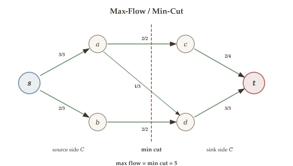
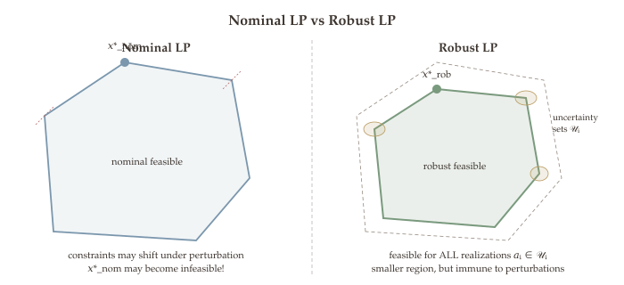
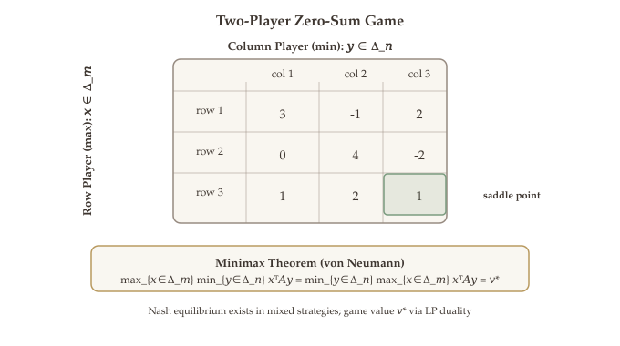

Linear programming is not merely an abstract mathematical framework -- it is a powerful modeling tool that captures a remarkable range of combinatorial and network optimization problems. In this chapter we explore one of the most celebrated connections in optimization: the relationship between **maximum flow** and **minimum cut** in a network, and how LP duality provides an elegant proof of their equivalence.

We begin with the max-flow problem, which asks how much "stuff" (goods, data, fluid) can be pushed through a capacitated network from a source to a sink. We then introduce the min-cut problem, which asks for the cheapest way to disconnect the source from the sink. These two problems appear very different -- one is a continuous LP, the other a combinatorial optimization -- yet LP duality reveals they have the same optimal value. The key to this connection is the theory of **integral polyhedra** and **totally unimodular matrices**, which guarantees that certain LP relaxations are automatically tight.

## The Max-Flow Problem {#sec-max-flow}

### Transportation Networks {#sec-transportation}

Many real-world problems involve moving goods, data, or resources through a network with limited capacity. The **max-flow problem** provides a clean mathematical formulation for these scenarios.

Consider a **directed graph** $G = (V, \mathcal{E})$ with two distinguished vertices:

- A **source** $s \in V$: where flow originates
- A **sink** $t \in V$: where flow is absorbed
- Each edge $e \in \mathcal{E}$ has a **capacity** $u_e \geq 0$: the maximum amount of flow that can traverse edge $e$

The goal is to push as much flow as possible from $s$ to $t$ while respecting the capacity constraints and conservation of flow at every intermediate node.

```python
#| label: fig-network-flow
#| fig-cap: "A transportation network with source s (left, red) and sink t (right, red). Edge labels show flow/capacity. Hover over edges for details."
#| echo: false

import plotly.graph_objects as go

# Node positions for a layered network
node_labels = ['s', 'a', 'b', 'c', 'd', 't']
node_x = [0, 1, 1, 2, 2, 3]
node_y = [1, 2, 0, 2, 0, 1]

# Edges: (from, to, capacity, flow)
edges = [
    (0, 1, 3, 3),   # s -> a, cap 3, flow 3
    (0, 2, 4, 4),   # s -> b, cap 4, flow 4
    (1, 2, 1, 0),   # a -> b, cap 1, flow 0
    (1, 3, 2, 2),   # a -> c, cap 2, flow 2
    (2, 4, 5, 4),   # b -> d, cap 5, flow 4
    (1, 4, 2, 1),   # a -> d, cap 2, flow 1
    (3, 5, 2, 2),   # c -> t, cap 2, flow 2
    (4, 5, 5, 5),   # d -> t, cap 5, flow 5
]

fig = go.Figure()

# Draw edges as lines with arrows
for (i, j, cap, flow) in edges:
    x0, y0 = node_x[i], node_y[i]
    x1, y1 = node_x[j], node_y[j]
    # Shorten the line slightly so it doesn't overlap with nodes
    dx, dy = x1 - x0, y1 - y0
    length = (dx**2 + dy**2)**0.5
    shrink = 0.12
    sx0 = x0 + shrink * dx / length
    sy0 = y0 + shrink * dy / length
    sx1 = x1 - shrink * dx / length
    sy1 = y1 - shrink * dy / length

    color = '#7b97ad' if flow < cap else '#b56b6b'
    fig.add_trace(go.Scatter(
        x=[sx0, sx1], y=[sy0, sy1], mode='lines',
        line=dict(color=color, width=2 + 2 * flow / max(e[3] for e in edges if e[3] > 0)),
        hoverinfo='text',
        hovertext=f'{node_labels[i]} -> {node_labels[j]}: flow={flow}, capacity={cap}',
        showlegend=False
    ))
    # Arrowhead
    mx, my = (sx0 + sx1) / 2, (sy0 + sy1) / 2
    fig.add_annotation(
        x=sx1, y=sy1, ax=sx0, ay=sy0,
        xref='x', yref='y', axref='x', ayref='y',
        showarrow=True, arrowhead=2, arrowsize=1.5, arrowwidth=1.5,
        arrowcolor=color
    )
    # Label at midpoint
    offset_x = -0.08 * dy / length
    offset_y = 0.08 * dx / length
    fig.add_annotation(
        x=mx + offset_x, y=my + offset_y,
        text=f'{flow}/{cap}', showarrow=False,
        font=dict(size=11, color='#555')
    )

# Draw nodes
node_colors = ['#b56b6b', '#8fa3b8', '#8fa3b8', '#8fa3b8', '#8fa3b8', '#b56b6b']
fig.add_trace(go.Scatter(
    x=node_x, y=node_y, mode='markers+text',
    marker=dict(color=node_colors, size=28, line=dict(width=2, color='white')),
    text=node_labels, textposition='middle center',
    textfont=dict(color='white', size=14, family='Arial Black'),
    hovertext=[f'Node {l}' + (' (source)' if l == 's' else ' (sink)' if l == 't' else '')
               for l in node_labels],
    hoverinfo='text', showlegend=False
))

fig.update_layout(
    xaxis=dict(visible=False, range=[-0.5, 3.5]),
    yaxis=dict(visible=False, range=[-0.5, 2.5], scaleanchor='x'),
    margin=dict(t=20, b=20, l=20, r=20),
    plot_bgcolor='rgba(0,0,0,0)'
)
fig.show()
```

### LP Formulation of Max-Flow {#sec-max-flow-lp}

We assign a **decision variable** $x_e$ to each edge $e \in \mathcal{E}$, representing the amount of flow along that edge. The max-flow problem is then a linear program:

::: {.callout-important}
## Max-Flow LP

$$
\begin{aligned}
\max \quad & \sum_{(s,v) \in \mathcal{E}} x_{(s,v)} \\
\text{s.t.} \quad & 0 \leq x_e \leq u_e \quad \forall\, e \in \mathcal{E} \quad &\text{(capacity constraints)} \\
& \sum_{(u,v) \in \mathcal{E}} x_{(u,v)} = \sum_{(v,w) \in \mathcal{E}} x_{(v,w)} \quad \forall\, v \in V \setminus \{s, t\} \quad &\text{(flow conservation)}
\end{aligned}
$$ {#eq-max-flow-lp}

The **objective** maximizes total flow leaving the source. The **capacity constraints** ensure flow on each edge is between 0 and the edge capacity. The **flow conservation constraints** require that at every intermediate node, total in-flow equals total out-flow.
:::

Note the key structural features of this LP:

- **Number of decision variables:** $|\mathcal{E}|$ (one per edge)
- **Number of inequality constraints:** $|\mathcal{E}|$ (capacity upper bounds; nonnegativity is also $|\mathcal{E}|$ constraints)
- **Number of equality constraints:** $|V| - 2$ (flow conservation at each non-source/non-sink node)

These counts will be important when we derive the dual LP and connect it to the min-cut problem.

## The Min-Cut Problem {#sec-min-cut}

Having formulated max-flow as an LP (@eq-max-flow-lp), we now turn to its combinatorial counterpart. Our goal is to show that these two seemingly different problems have the same optimal value --- a deep fact that follows from LP duality.

### Cuts and Their Capacity {#sec-cuts}

While max-flow asks "how much can we push through?", the min-cut problem asks "what is the cheapest bottleneck?" -- the cheapest way to sever all paths from $s$ to $t$.

::: {#def-cut}
## Definition (Cut)

A **cut** in a directed graph $G = (V, \mathcal{E})$ with source $s$ and sink $t$ is a partition of $V$ into two sets $C$ and $\bar{C} = V \setminus C$ such that $s \in C$ and $t \in \bar{C}$.
:::

The **capacity** of a cut $C$ is the total capacity of all edges crossing from $C$ to $\bar{C}$:

$$
\text{Capacity}(C) = \sum_{\substack{(u,v) \in \mathcal{E} \\ u \in C,\; v \in \bar{C}}} u_{(u,v)}.
$$

Intuitively, low-capacity cuts are **bottlenecks** in the network. The flow from $s$ to $t$ is bounded by the capacity of any cut, because all flow must cross from the source side to the sink side.

::: {#def-min-cut}
## Definition (Min-Cut Problem)

The **min-cut problem** asks for the cut $C^*$ with minimum capacity:

$$
\min_{C \subseteq V:\; s \in C,\; t \notin C} \; \text{Capacity}(C).
$$
:::

```python
#| label: fig-min-cut
#| fig-cap: "The same network with a minimum cut shown. The orange region contains the source side S = {s, a, b}. Edges crossing the cut (red, dashed) have total capacity 2 + 5 = 7, which equals the max flow."
#| echo: false

import plotly.graph_objects as go
import plotly.colors as pc

node_labels = ['s', 'a', 'b', 'c', 'd', 't']
node_x = [0, 1, 1, 2, 2, 3]
node_y = [1, 2, 0, 2, 0, 1]

# Edges: (from, to, capacity)
edges = [
    (0, 1, 3), (0, 2, 4), (1, 2, 1), (1, 3, 2),
    (2, 4, 5), (1, 4, 2), (3, 5, 2), (4, 5, 5)
]

# Min-cut: S = {s, b}, T = {a, c, d, t} -- but let's use S = {s, a} which gives capacity 1+2+2 = 5
# Actually, from the notes: flow = 7, cut {s, a, b} gives capacity = a->c (2) + b->d (5) = 7
# Wait: also a->d (2), so 2 + 5 + 2 = 9. Let me recalculate.
# S = {s, a}, cut edges: a->b? no, s->b (4), a->c (2), a->d (2) = 8.
# S = {s}, cut edges: s->a (3), s->b (4) = 7. That matches flow=7!
# So min-cut S = {s}, capacity = 3 + 4 = 7.

cut_S = {0}  # S = {s}

fig = go.Figure()

# Draw the cut region
fig.add_shape(
    type='rect', x0=-0.4, y0=-0.3, x1=0.45, y1=2.4,
    fillcolor='rgba(181,155,94,0.15)', line=dict(color='#b59b5e', width=2, dash='dash')
)
fig.add_annotation(x=-0.25, y=2.35, text='Cut S', showarrow=False,
                   font=dict(size=13, color='#b59b5e', family='Georgia'))

# Draw edges
for (i, j, cap) in edges:
    x0, y0 = node_x[i], node_y[i]
    x1, y1 = node_x[j], node_y[j]
    dx, dy = x1 - x0, y1 - y0
    length = (dx**2 + dy**2)**0.5
    shrink = 0.12
    sx0 = x0 + shrink * dx / length
    sy0 = y0 + shrink * dy / length
    sx1 = x1 - shrink * dx / length
    sy1 = y1 - shrink * dy / length

    crosses_cut = (i in cut_S) and (j not in cut_S)
    color = '#b56b6b' if crosses_cut else '#7b97ad'
    dash = 'dash' if crosses_cut else 'solid'
    width = 3.5 if crosses_cut else 2

    fig.add_trace(go.Scatter(
        x=[sx0, sx1], y=[sy0, sy1], mode='lines',
        line=dict(color=color, width=width, dash=dash),
        hoverinfo='text',
        hovertext=f'{node_labels[i]} -> {node_labels[j]}: cap={cap}' +
                  (' [CROSSES CUT]' if crosses_cut else ''),
        showlegend=False
    ))
    fig.add_annotation(
        x=sx1, y=sy1, ax=sx0, ay=sy0,
        xref='x', yref='y', axref='x', ayref='y',
        showarrow=True, arrowhead=2, arrowsize=1.5, arrowwidth=1.5,
        arrowcolor=color
    )
    mx, my = (sx0 + sx1) / 2, (sy0 + sy1) / 2
    offset_x = -0.08 * dy / length
    offset_y = 0.08 * dx / length
    label_text = f'<b>{cap}</b>' if crosses_cut else f'{cap}'
    fig.add_annotation(
        x=mx + offset_x, y=my + offset_y,
        text=label_text, showarrow=False,
        font=dict(size=11, color='#b56b6b' if crosses_cut else '#555')
    )

# Draw nodes
node_colors = ['#b56b6b' if idx in cut_S else '#8fa3b8' for idx in range(len(node_labels))]
node_colors[-1] = '#b56b6b'
fig.add_trace(go.Scatter(
    x=node_x, y=node_y, mode='markers+text',
    marker=dict(color=node_colors, size=28, line=dict(width=2, color='white')),
    text=node_labels, textposition='middle center',
    textfont=dict(color='white', size=14, family='Arial Black'),
    hoverinfo='text',
    hovertext=[f'{l} (in S)' if idx in cut_S else f'{l} (in T)'
               for idx, l in enumerate(node_labels)],
    showlegend=False
))

fig.add_annotation(x=1.5, y=-0.45, text='Cut capacity = 3 + 4 = 7 = Max flow',
                   showarrow=False, font=dict(size=12, color='#b56b6b'))

fig.update_layout(
    xaxis=dict(visible=False, range=[-0.6, 3.5]),
    yaxis=dict(visible=False, range=[-0.7, 2.6], scaleanchor='x'),
    margin=dict(t=20, b=20, l=20, r=20),
    plot_bgcolor='rgba(0,0,0,0)'
)
fig.show()
```

### Integer Programming Formulation of Min-Cut {#sec-min-cut-ip}

The min-cut problem can be formulated as an **integer program**. For each node $v \in V$, introduce a binary variable:

$$
z_v = \begin{cases} 1 & \text{if } v \in C \text{ (source side)} \\ 0 & \text{if } v \in \bar{C} \text{ (sink side)} \end{cases}
$$

An edge $(u,v)$ crosses the cut from $C$ to $\bar{C}$ if and only if $u \in C$ and $v \notin C$, i.e., $z_u = 1$ and $z_v = 0$. We can capture this with $\max\{0, z_u - z_v\}$. The capacity of the cut is then:

$$
\text{Capacity}(C) = \sum_{(u,v) \in \mathcal{E}} \max\{0, z_u - z_v\} \cdot u_{(u,v)}.
$$

::: {.callout-important}
## Min-Cut as an Integer Program

$$
\begin{aligned}
\min \quad & \sum_{(u,v) \in \mathcal{E}} \max\{0, z_u - z_v\} \cdot u_{(u,v)} \\
\text{s.t.} \quad & z_v \in \{0, 1\} \quad \forall\, v \in V \\
& z_s = 1, \quad z_t = 0
\end{aligned}
$$ {#eq-min-cut-ip}
:::

To convert this into a more standard form, we introduce auxiliary variables $b_{(u,v)} \geq 0$ for each edge, with $b_{(u,v)} \geq z_u - z_v$. Together with $b_{(u,v)} \geq 0$, this gives $b_{(u,v)} \geq \max\{0, z_u - z_v\}$:

$$
\begin{aligned}
\min \quad & \sum_{(u,v) \in \mathcal{E}} b_{(u,v)} \cdot u_{(u,v)} \\
\text{s.t.} \quad & b_{(u,v)} \geq z_u - z_v \quad \forall\, (u,v) \in \mathcal{E} \\
& b_{(u,v)}, z_u, z_v \in \{0, 1\} \\
& z_s = 1, \quad z_t = 0
\end{aligned}
$$

## The LP Relaxation and Duality Connection {#sec-lp-relaxation-duality}

We now connect the max-flow LP (@eq-max-flow-lp) and the min-cut IP (@eq-min-cut-ip) through LP duality. The key step is to take the dual of the max-flow LP and observe that it is exactly the LP relaxation of the min-cut problem.

### Dual of the Max-Flow LP {#sec-dual-max-flow}

The dual of the max-flow LP (@eq-max-flow-lp) can be derived using the techniques from [LP duality](11-lp-duality.qmd). The derivation (left as an exercise) yields:

::: {.callout-important}
## Dual of Max-Flow LP (LP-Relaxed Min-Cut)

$$
\begin{aligned}
\min \quad & \sum_{(u,v) \in \mathcal{E}} b_{(u,v)} \cdot u_{(u,v)} \\
\text{s.t.} \quad & b_{(u,v)} + z_v - z_u \geq 0 \quad \forall\, (u,v) \in \mathcal{E} \\
& b_{(u,v)} \geq 0 \quad \forall\, (u,v) \in \mathcal{E} \\
& z_s = 1 \quad \text{(source)} \\
& z_t = 0 \quad \text{(sink)}
\end{aligned}
$$ {#eq-dual-max-flow}

Here $b_{(u,v)} \geq 0$ are the dual variables corresponding to the capacity constraints, and $z_v \in \mathbb{R}$ (unrestricted) are the dual variables corresponding to the flow conservation equality constraints at each node.
:::

### Comparing the Dual LP with the Min-Cut IP {#sec-compare}

Now observe the structural similarity between the dual LP (@eq-dual-max-flow) and the min-cut integer program (@eq-min-cut-ip):

| Feature | Dual LP (LP-Relaxed Min-Cut) | Min-Cut IP |
|---------|------------------------------|------------|
| Objective | $\min \sum b_{(u,v)} u_{(u,v)}$ | $\min \sum b_{(u,v)} u_{(u,v)}$ |
| Edge variables | $b_{(u,v)} \geq z_u - z_v$, $b_{(u,v)} \geq 0$ | $b_{(u,v)} \geq z_u - z_v$, $b_{(u,v)} \geq 0$ |
| Node variables | $z_v \in \mathbb{R}$ (unrestricted) | $z_v \in \{0, 1\}$ |
| Source/Sink | $z_s = 1$, $z_t = 0$ | $z_s = 1$, $z_t = 0$ |

These two problems share the **same objective** and **same constraint structure**, but the LP relaxation allows $z_v$ to take any real value, while the IP requires $z_v \in \{0,1\}$. Since the feasible set of the IP is contained in the feasible set of the LP:

$$
\{z : z_v \in \{0,1\}\} \subseteq \{z : z_v \in \mathbb{R}\},
$$

the LP relaxation provides a **lower bound** on the IP:

$$
\text{Optimal value of LP-Relaxed Min-Cut} \leq \text{Optimal value of Min-Cut IP}.
$$

### The Chain of Inequalities {#sec-chain}

We can now assemble the key relationship:

$$
\underbrace{\text{Capacity of min-cut}}_{\text{IP optimal}} \;\geq\; \underbrace{\text{LP-relaxed min-cut optimal}}_{\text{dual LP optimal}} \;=\; \underbrace{\text{Value of max-flow}}_{\text{primal LP optimal}}.
$$

The equality follows from [strong duality](11-lp-duality.qmd): both the primal (max-flow) and dual (LP-relaxed min-cut) are feasible (zero flow is feasible for the primal; setting $z_s = 1$, $z_t = 0$, $z_v = 0$ for all other $v$, and $b_{(u,v)} = 1$ for all edges gives a feasible dual solution). Therefore neither problem is unbounded, strong duality applies, and the optimal values coincide.

The remarkable fact is that the inequality $\geq$ is actually an **equality**. This is the content of the celebrated Max-Flow Min-Cut Theorem.

## The Max-Flow Min-Cut Theorem {#sec-max-flow-min-cut}

{#fig-max-flow-min-cut}

::: {#thm-max-flow-min-cut}
## Theorem (Max-Flow Min-Cut)

In any directed network $G = (V, \mathcal{E})$ with source $s$, sink $t$, and edge capacities $u_e \geq 0$:

$$
\text{Maximum flow from } s \text{ to } t \;=\; \text{Minimum cut capacity}.
$$
:::

This theorem is one of the cornerstones of combinatorial optimization. It says that the maximum amount of flow that can be pushed through a network is exactly equal to the capacity of the smallest bottleneck (minimum cut).

### Proof via LP Duality {#sec-proof-max-flow-min-cut}

The proof has three steps: (1) use strong duality to equate max-flow with the LP-relaxed min-cut, (2) show via a clipping argument that the LP relaxation has an optimal solution in $[0,1]$, and (3) invoke the total unimodularity of the constraint matrix to obtain an integral optimal solution.

::: {.proof}
**Proof of the Max-Flow Min-Cut Theorem.**

From the chain of inequalities in @sec-chain, we already know:

$$
\text{Max flow} = \text{LP-relaxed min-cut optimal} \leq \text{Min-cut capacity (IP optimal)}.
$$

It remains to show that the LP relaxation is **tight**, i.e., that the LP-relaxed min-cut has the same optimal value as the integer min-cut. We will show this in two steps.

**Step 1: Reformulating the dual LP.** In the dual LP (@eq-dual-max-flow), the constraints $b_{(u,v)} \geq z_u - z_v$ and $b_{(u,v)} \geq 0$ together imply $b_{(u,v)} \geq \max\{0, z_u - z_v\}$. At optimality, the minimization drives $b_{(u,v)}$ down to this lower bound, so the dual LP is equivalent to:

$$
\begin{aligned}
\min \quad & \sum_{(u,v) \in \mathcal{E}} u_{(u,v)} \cdot \max\{0, z_u - z_v\} \quad &\text{(LP-3)} \\
\text{s.t.} \quad & z \in \mathbb{R}^{|V|}, \quad z_s = 1, \quad z_t = 0.
\end{aligned}
$$

Note that $z$ is unrestricted. We want to show that (LP-3) has an optimal solution satisfying $z_u \in [0,1]$ for all $u \in V$, and moreover that this solution is integral (i.e., $z_u \in \{0, 1\}$).

**Step 2: Clipping to [0,1].** Given any optimal solution $z^*$ of (LP-3), define the **clipped** solution:

$$
\widetilde{z}_u = \text{clip}_{[0,1]}(z^*_u) = \max\{0, \min\{z^*_u, 1\}\} \quad \forall\, u \in V.
$$

We claim that clipping does not increase the objective. Consider any edge $(u,v) \in \mathcal{E}$:

- **Case 1:** $z^*_u \leq z^*_v$. Then $\max\{0, z^*_u - z^*_v\} = 0$. Since $\text{clip}_{[0,1]}$ is monotone, $\widetilde{z}_u \leq \widetilde{z}_v$, so $\max\{0, \widetilde{z}_u - \widetilde{z}_v\} = 0$. The contribution is unchanged.

- **Case 2:** $z^*_u > z^*_v$ and both are above 1 or both are below 0. Then $\max\{0, z^*_u - z^*_v\} > 0$, but after clipping both values are mapped to the same endpoint (both to 1 or both to 0), so $\max\{0, \widetilde{z}_u - \widetilde{z}_v\} = 0$. The contribution decreases.

- **Case 3:** $z^*_u > 1 \geq z^*_v$. Then $z^*_u - z^*_v > 1 - z^*_v \geq \text{clip}_{[0,1]}(z^*_u) - \text{clip}_{[0,1]}(z^*_v) = 1 - \widetilde{z}_v$. The contribution decreases.

- **Case 4:** $z^*_v < 0 \leq z^*_u$. Then $z^*_u - z^*_v > z^*_u - 0 \geq \widetilde{z}_u - \widetilde{z}_v$. The contribution decreases.

In all cases, each term in the objective either stays the same or decreases. Since $\widetilde{z}_s = \text{clip}_{[0,1]}(1) = 1$ and $\widetilde{z}_t = \text{clip}_{[0,1]}(0) = 0$, the clipped solution is feasible with an objective value no larger than the original. By optimality of $z^*$, the clipped solution $\widetilde{z}$ is also optimal, with $\widetilde{z}_u \in [0,1]$ for all $u$.

Therefore the dual LP (LP-3) is equivalent to:

$$
\begin{aligned}
\min \quad & \sum_{(u,v) \in \mathcal{E}} \max\{0, z_u - z_v\} \cdot u_{(u,v)} \quad &\text{(LP-4)} \\
\text{s.t.} \quad & 0 \leq z_u \leq 1 \quad \forall\, u \in V \\
& z_s = 1, \quad z_t = 0
\end{aligned}
$$

**Step 3: Integrality.** We will show in @sec-tum that the constraint matrix of this LP is **totally unimodular** (TUM). By the Integral Polyhedron Theorem (@thm-integral-polyhedron), every vertex of the feasible polyhedron has integer coordinates. Since the LP has an optimal solution at a vertex (by the Fundamental Theorem of LP), there exists an optimal solution with $z_u \in \{0, 1\}$ for all $u$.

An integral optimal solution $z^*$ with $z^*_v \in \{0,1\}$, $z^*_s = 1$, $z^*_t = 0$ defines a valid cut $C = \{v : z^*_v = 1\}$ with capacity equal to the LP optimal value. Therefore:

$$
\text{Min-cut capacity} \leq \text{Capacity of cut } C = \text{LP-relaxed min-cut optimal} = \text{Max flow}.
$$

Combined with the earlier inequality $\text{Max flow} \leq \text{Min-cut capacity}$, we conclude:

$$
\text{Max flow} = \text{Min-cut capacity}. \quad \blacksquare
$$
:::

## LP Relaxation of Integer Programs {#sec-lp-relaxation-ip}

The proof of the Max-Flow Min-Cut Theorem relied on the LP relaxation being "tight" -- the LP optimal value equaling the IP optimal value. This tightness is not always guaranteed; it is a special structural property. We now develop the general theory that explains when LP relaxations are tight, culminating in the notion of totally unimodular matrices.

### The Relaxation Gap {#sec-relaxation-gap}

Consider a general **integer program** (IP):

$$
\min \; c^\top x \quad \text{s.t.} \quad Ax \leq b, \quad x \in \mathbb{Z}_+^n,
$$

where $\mathbb{Z}_+^n = \{x \in \mathbb{Z}^n : x \geq 0\}$ denotes the nonnegative integers. Its **LP relaxation** simply drops the integrality constraint:

$$
\min \; c^\top x \quad \text{s.t.} \quad Ax \leq b, \quad x \geq 0.
$$

Since $\{x : Ax \leq b, \; x \in \mathbb{Z}_+^n\} \subseteq \{x : Ax \leq b, \; x \geq 0\}$, the LP relaxation has a larger feasible set, and therefore:

$$
\text{Optimal value of LP relaxation} \leq \text{Optimal value of IP}.
$$

The LP relaxation always provides a **lower bound** (for minimization problems). The question is: when is this bound tight?

```python
#| label: fig-lp-relaxation
#| fig-cap: "LP relaxation vs. integer program. Black dots are integer feasible points. The blue region is the LP feasible set. The LP optimum (star) may not be integer, creating a relaxation gap."
#| echo: false

import plotly.graph_objects as go
import numpy as np

# Polyhedron vertices (LP feasible region)
poly_x = [0, 3.5, 4, 2.5, 0, 0]
poly_y = [0, 0, 1.5, 3.5, 3, 0]

fig = go.Figure()

# LP feasible region
fig.add_trace(go.Scatter(x=poly_x, y=poly_y, fill='toself',
    fillcolor='rgba(123,143,163,0.15)', line=dict(color='#7b97ad', width=2.5),
    name='LP feasible region', mode='lines'))

# Integer points inside the polyhedron
int_points_x = []
int_points_y = []
int_points_outside_x = []
int_points_outside_y = []

from matplotlib.path import Path
poly_path = Path(list(zip(poly_x, poly_y)))

for ix in range(0, 5):
    for iy in range(0, 5):
        if poly_path.contains_point((ix, iy)):
            int_points_x.append(ix)
            int_points_y.append(iy)
        elif 0 <= ix <= 4.5 and 0 <= iy <= 4:
            int_points_outside_x.append(ix)
            int_points_outside_y.append(iy)

fig.add_trace(go.Scatter(x=int_points_x, y=int_points_y, mode='markers',
    marker=dict(color='#3a3a3a', size=8, symbol='circle'),
    name='Integer feasible points',
    hovertext=[f'({x},{y})' for x, y in zip(int_points_x, int_points_y)],
    hoverinfo='text'))

fig.add_trace(go.Scatter(x=int_points_outside_x, y=int_points_outside_y, mode='markers',
    marker=dict(color='#cccccc', size=5, symbol='circle'),
    name='Integer grid (infeasible)',
    hoverinfo='skip'))

# LP optimum (not integer)
fig.add_trace(go.Scatter(x=[3.5], y=[0], mode='markers',
    marker=dict(color='#b56b6b', size=14, symbol='star',
    line=dict(width=1, color='white')),
    name='LP optimum (3.5, 0)'))

# IP optimum
fig.add_trace(go.Scatter(x=[3], y=[0], mode='markers',
    marker=dict(color='#7a9a7e', size=14, symbol='diamond',
    line=dict(width=1, color='white')),
    name='IP optimum (3, 0)'))

# Objective direction
fig.add_annotation(x=4.2, y=0.5, ax=3.5, ay=0.5,
    showarrow=True, arrowhead=2, arrowwidth=2, arrowcolor='#b8995e',
    text='c', font=dict(size=13, color='#b8995e'))

fig.update_layout(
    xaxis=dict(title='x&#8321;', range=[-0.5, 5], zeroline=True),
    yaxis=dict(title='x&#8322;', range=[-0.5, 4.5], zeroline=True, scaleanchor='x'),
    showlegend=True, margin=dict(t=20, b=50, l=55, r=20))
fig.show()
```

### Integral Polyhedra {#sec-integral-polyhedra}

The LP relaxation is tight precisely when the LP optimum happens to be an integer point. By the Fundamental Theorem of LP, the optimum is attained at a vertex of the feasible polyhedron. So the relaxation is tight for every objective $c$ if and only if every vertex of the polyhedron is integral.

::: {#def-integral-polyhedron}
## Definition (Integral Polyhedron)

A polyhedron $P = \{x : Ax \leq b, \; x \geq 0\}$ is called **integral** if every vertex (extreme point) of $P$ has integer coordinates.
:::

If $P$ is integral, then for any linear objective $c$, the LP $\min\{c^\top x : x \in P\}$ has an optimal solution that is an integer point (by the Fundamental Theorem of LP). This means the LP relaxation is tight:

$$
\min\{c^\top x : x \in P, \; x \in \mathbb{Z}^n\} = \min\{c^\top x : x \in P\}.
$$

The question becomes: how do we recognize when a polyhedron is integral?

## Totally Unimodular Matrices {#sec-tum}

### Definition and Examples {#sec-tum-def}

Having identified integral polyhedra as the key to tight LP relaxations, we now present the most powerful sufficient condition: total unimodularity of the constraint matrix.

::: {#def-tum}
## Definition (Totally Unimodular Matrix)

A matrix $A \in \mathbb{R}^{m \times n}$ is **totally unimodular** (TUM) if every square submatrix of $A$ has determinant in $\{-1, 0, +1\}$.
:::

Note that this condition applies to **every** square submatrix, not just the full matrix. In particular:

- Every $1 \times 1$ submatrix (i.e., every entry) must be in $\{-1, 0, +1\}$
- Every $2 \times 2$ submatrix must have determinant in $\{-1, 0, +1\}$
- And so on, up to the largest square submatrix

::: {#exm-tum-incidence}
## Incidence Matrix of a Bipartite Graph

Consider a bipartite graph with vertex sets $X$ and $Y$, and edges from $X$ to $Y$. The **incidence matrix** $A$ has rows indexed by vertices and columns indexed by edges, with $A_{v,e} = 1$ if vertex $v$ is an endpoint of edge $e$, and $A_{v,e} = 0$ otherwise.

For example, with $X = \{a, b\}$, $Y = \{c, d, e\}$, and edges $(a,c)$, $(a,d)$, $(a,e)$, $(b,d)$, $(b,e)$:

$$
A = \begin{pmatrix} 1 & 1 & 1 & 0 & 0 \\ 0 & 0 & 0 & 1 & 1 \\ 1 & 0 & 0 & 0 & 0 \\ 0 & 1 & 0 & 1 & 0 \\ 0 & 0 & 1 & 0 & 1 \end{pmatrix}
$$

This matrix is totally unimodular. More generally, the **incidence matrix of any bipartite graph is TUM**.
:::

### The Integral Polyhedron Theorem {#sec-integral-polyhedron-thm}

The following theorem is the bridge between TUM and integral polyhedra. It is the key ingredient needed to complete the proof of the Max-Flow Min-Cut Theorem.

::: {#thm-integral-polyhedron}
## Theorem (Integral Polyhedron via TUM)

Let $A \in \mathbb{R}^{m \times n}$ be a totally unimodular matrix and $b \in \mathbb{Z}^m$ an integer vector. Then:

1. $P_1 = \{x : Ax \leq b\}$ is an integral polyhedron.
2. $P_2 = \{x : Ax \leq b, \; x \geq 0\}$ is an integral polyhedron.
:::

The proof uses Cramer's rule: at any vertex the binding constraints form an invertible submatrix whose determinant is $\pm 1$ by TUM, so the vertex coordinates are automatically integers.

::: {.proof}
**Proof of the Integral Polyhedron Theorem.**

We prove part (2); part (1) is similar. Let $x^*$ be any vertex of $P_2$. By the definition of a vertex, there exist $n$ linearly independent binding constraints at $x^*$. Let $\widehat{A} \in \mathbb{R}^{n \times n}$ be the submatrix of the constraint matrix corresponding to these $n$ binding constraints, and let $\widehat{b} \in \mathbb{R}^n$ be the corresponding right-hand side. Then $x^*$ is the unique solution to:

$$
\widehat{A} x^* = \widehat{b}.
$$

Since the rows of $\widehat{A}$ are linearly independent, $\widehat{A}$ is invertible. By **Cramer's rule**, the $j$-th component of $x^*$ is:

$$
x^*_j = \frac{\det(\widehat{A}_j)}{\det(\widehat{A})},
$$

where $\widehat{A}_j$ is the matrix $\widehat{A}$ with its $j$-th column replaced by $\widehat{b}$.

Now we use the TUM property:

- $\widehat{A}$ is a square submatrix of $A$ (possibly augmented with rows of $\pm I$, which preserves TUM), so $\det(\widehat{A}) \in \{-1, +1\}$ (it cannot be 0 since $\widehat{A}$ is invertible).
- $\widehat{A}_j$ has the same rows as $\widehat{A}$ except one column is replaced by $\widehat{b} \in \mathbb{Z}^n$. Since $\det(\widehat{A}) = \pm 1$, $\widehat{A}$ is an integer matrix, and $\widehat{b}$ is an integer vector, $\det(\widehat{A}_j) \in \mathbb{Z}$.

Therefore:

$$
x^*_j = \frac{\det(\widehat{A}_j)}{\pm 1} = \pm \det(\widehat{A}_j) \in \mathbb{Z}.
$$

Every component of $x^*$ is an integer, so every vertex of $P_2$ is integral. $\blacksquare$
:::

::: {.callout-tip}
## Key Insight

The proof reveals why TUM is so powerful: at any vertex, the basis matrix has determinant $\pm 1$, which means Cramer's rule produces integer solutions whenever the right-hand side is integral. This is a much stronger property than simply requiring $A$ to have integer entries.
:::

## Why the Max-Flow LP Relaxation is Tight {#sec-why-tight}

Armed with the Integral Polyhedron Theorem (@thm-integral-polyhedron) and the theory of TUM matrices, we can now complete the proof of the Max-Flow Min-Cut Theorem by showing that the constraint matrix of the dual LP (@eq-dual-max-flow) is totally unimodular.

::: {#lem-incidence-tum}
## Lemma (Node-Edge Incidence Matrix is TUM)

The constraint matrix of the LP:

$$
\begin{aligned}
\min \quad & \sum_{(u,v) \in \mathcal{E}} b_{(u,v)} \cdot u_{(u,v)} \\
\text{s.t.} \quad & b_{(u,v)} + z_v - z_u \geq 0 \quad \forall\, (u,v) \in \mathcal{E} \\
& b_{(u,v)} \geq 0 \quad \forall\, (u,v) \in \mathcal{E} \\
& z_s = 1, \quad z_t = 0
\end{aligned}
$$

is totally unimodular.
:::

The constraint matrix arises from the **node-edge incidence matrix** of the directed graph $G = (V, \mathcal{E})$. For a directed graph, the incidence matrix $M \in \mathbb{R}^{|V| \times |\mathcal{E}|}$ is defined by:

$$
M_{v,e} = \begin{cases} +1 & \text{if edge } e \text{ enters node } v \\
-1 & \text{if edge } e \text{ leaves node } v \\
0 & \text{otherwise}
\end{cases}
$$

It is a classical result in combinatorics that the **node-edge incidence matrix of any directed graph is TUM**. The constraint matrix of the dual LP is built from this incidence matrix (with identity blocks for the $b$ variables), and augmenting a TUM matrix with identity rows/columns preserves the TUM property.

By the Integral Polyhedron Theorem (@thm-integral-polyhedron), since the constraint matrix is TUM and the right-hand side $(0, \ldots, 0, 1, 0)$ is integral, the feasible polyhedron of the dual LP is **integral**. Therefore the LP optimal solution is an integer point, and the LP relaxation of the min-cut is tight.

This completes the chain:

$$
\text{Max flow} \;=\; \text{LP-relaxed min-cut} \;=\; \text{Min-cut capacity}.
$$

```python
#| label: fig-relaxation-comparison
#| fig-cap: "Comparison of LP relaxation (continuous) vs. integer program for a small min-cut instance. The LP solution assigns fractional z-values to nodes, while the IP solution assigns binary values. For this network (with TUM structure), the optimal values coincide."
#| echo: false

import plotly.graph_objects as go
from plotly.subplots import make_subplots

fig = make_subplots(rows=1, cols=2, subplot_titles=(
    'LP Relaxation (fractional z)', 'Integer Solution (binary z)'),
    horizontal_spacing=0.12)

# Simple 4-node network: s -> a -> t, s -> b -> t
# Capacities: s->a: 3, s->b: 4, a->t: 3, b->t: 4
node_labels = ['s', 'a', 'b', 't']
nx_pos = {0: (0, 1), 1: (1, 1.8), 2: (1, 0.2), 3: (2, 1)}
edges_info = [(0,1,3), (0,2,4), (1,3,3), (2,3,4)]

# LP solution: z_s=1, z_a=0.5, z_b=0.5, z_t=0
lp_z = [1.0, 0.5, 0.5, 0.0]
# IP solution: z_s=1, z_a=1, z_b=1, z_t=0 (cut = {a->t:3, b->t:4} = 7)
# Or: z_s=1, z_a=0, z_b=0, z_t=0 (cut = {s->a:3, s->b:4} = 7)
ip_z = [1, 0, 0, 0]

for col, z_vals, title_suffix in [(1, lp_z, 'LP'), (2, ip_z, 'IP')]:
    # Draw edges
    for (i, j, cap) in edges_info:
        x0, y0 = nx_pos[i]
        x1, y1 = nx_pos[j]
        zi, zj = z_vals[i], z_vals[j]
        flow_across = max(0, zi - zj)
        color = '#b56b6b' if flow_across > 0 else '#7b97ad'
        width = 1.5 + 2 * flow_across

        fig.add_trace(go.Scatter(
            x=[x0, x1], y=[y0, y1], mode='lines',
            line=dict(color=color, width=width),
            hovertext=f'{node_labels[i]}->{node_labels[j]}: cap={cap}, max(0,z_i-z_j)={flow_across:.1f}',
            hoverinfo='text', showlegend=False
        ), row=1, col=col)

        mx, my = (x0+x1)/2, (y0+y1)/2
        fig.add_annotation(x=mx, y=my, text=f'u={cap}', showarrow=False,
                          font=dict(size=10, color='#555'),
                          xref=f'x{col}' if col > 1 else 'x',
                          yref=f'y{col}' if col > 1 else 'y')

    # Draw nodes with z-values as colors
    for idx in range(4):
        x, y = nx_pos[idx]
        z = z_vals[idx]
        # Color from blue (z=0) to red (z=1)
        r = int(181 * z + 143 * (1 - z))
        g = int(107 * z + 163 * (1 - z))
        b_col = int(107 * z + 163 * (1 - z))
        color = f'rgb({r},{g},{b_col})'

        fig.add_trace(go.Scatter(
            x=[x], y=[y], mode='markers+text',
            marker=dict(color=color, size=30, line=dict(width=2, color='white')),
            text=f'{node_labels[idx]}<br>z={z:.1f}',
            textposition='bottom center',
            textfont=dict(size=10),
            hovertext=f'{node_labels[idx]}: z={z}',
            hoverinfo='text', showlegend=False
        ), row=1, col=col)

# Annotations for objective values
fig.add_annotation(x=1, y=-0.2, text='Obj = 3(0.5) + 4(0.5) = 3.5',
                   showarrow=False, font=dict(size=11, color='#b56b6b'),
                   xref='x', yref='y')
fig.add_annotation(x=1, y=-0.2, text='Obj = 3 + 4 = 7',
                   showarrow=False, font=dict(size=11, color='#b56b6b'),
                   xref='x2', yref='y2')

for col in [1, 2]:
    xref = 'x' if col == 1 else 'x2'
    yref = 'y' if col == 1 else 'y2'
    fig.update_xaxes(visible=False, range=[-0.4, 2.4], row=1, col=col)
    fig.update_yaxes(visible=False, range=[-0.6, 2.3], scaleanchor=xref, row=1, col=col)

fig.update_layout(margin=dict(t=40, b=30, l=20, r=20), plot_bgcolor='rgba(0,0,0,0)')
fig.show()
```

::: {.callout-note appearance="simple"}
The LP relaxation being tight for this problem is **not a coincidence** -- it is a structural consequence of the totally unimodular property of graph incidence matrices. This same TUM structure guarantees tight LP relaxations for many other network optimization problems, including the transportation problem, shortest path, and bipartite matching.
:::

## Summary {#sec-summary-flow}

The main results of the first part of this chapter form a beautiful logical chain:

1. **Max-flow** is an LP; its dual is the **LP-relaxed min-cut**.
2. By **strong duality**: max-flow value = LP-relaxed min-cut value.
3. The LP-relaxed min-cut value $\leq$ integer min-cut value (LP relaxation is a lower bound).
4. The constraint matrix of the LP-relaxed min-cut is the **node-edge incidence matrix** of a directed graph, which is **totally unimodular**.
5. By the **Integral Polyhedron Theorem** (TUM + integer RHS $\Rightarrow$ integral polyhedron), the LP relaxation is tight.
6. Therefore: **max flow = min cut**.

The theory of totally unimodular matrices provides a powerful lens for identifying when LP relaxations of integer programs are tight. Whenever the constraint matrix is TUM and the right-hand side is integral, we get an integral polyhedron "for free," and LP solvers can be used to solve the corresponding integer program exactly -- with no need for branch-and-bound or other combinatorial search methods.

The Max-Flow Min-Cut Theorem is just one application of LP duality in combinatorial optimization. In the remainder of this chapter, we explore two further applications -- **robust LP** and **zero-sum games** -- where LP duality again provides surprising structural insights.

In practice, the parameters of a linear program -- the cost vector $c$, the right-hand side $b$, or the constraint vectors $a_i$ -- may not be known exactly. They could be estimated from noisy data, subject to modeling errors, or inherently stochastic. A natural question arises: how should we solve an LP when we are uncertain about its parameters?

**Robust optimization** answers this by adopting a worst-case perspective: we optimize assuming that an adversary picks the most unfavorable parameters from a given uncertainty set. This minimax viewpoint connects LP to game theory in a profound way. When the uncertainty sets are polyhedral, the robust LP can be reformulated as a single, larger LP via [LP duality](11-lp-duality.qmd) -- a striking demonstration of duality's power.

This connection motivates the second half of the chapter: **two-player zero-sum matrix games**. We show that computing Nash equilibria in such games reduces to solving a pair of dual LPs, and that strong duality guarantees the existence of a game value and optimal mixed strategies for both players.

## Robust LP {#sec-robust-lp}

### Motivation {#sec-robust-motivation}

Consider a linear program in the following form:

$$
\min_{x} \; c^\top x \quad \text{s.t.} \quad a_i^\top x \leq b_i, \;\; i \in [m], \quad x \in \mathbb{R}^n.
$$

For simplicity, we drop the constraint $x \geq 0$ from the canonical form. (If $x \geq 0$ is present, it can be absorbed by writing it as $-I \cdot x \leq 0$.)

The parameters $(c, b, \{a_i\}_{i \in [m]})$ define the LP. In practice, these parameters are sometimes **unknown** or **stochastic**. To handle such uncertainty, **robust LP** assumes that:

1. The parameters are selected from some **uncertainty sets**.
2. We want to find the optimal value for the **worst instance** in the uncertainty set.

### Robust LP Formulation {#sec-robust-formulation}

Mathematically, let $\mathcal{U}_i$ be the uncertainty set of $a_i \in \mathbb{R}^n$ (with $\mathcal{U}_i \subseteq \mathbb{R}^n$). The robust LP is formulated as:

$$
\boxed{\text{Robust-LP:} \quad \min_{x} \; c^\top x \quad \text{s.t.} \quad a_i^\top x \leq b_i \;\; \forall \, a_i \in \mathcal{U}_i, \;\; i = 1, 2, \ldots, m.}
$$ {#eq-robust-lp}

For any choice $\{a_i\} \in \{\mathcal{U}_i\}$, define the feasible region:

$$
\Omega(\{a_i\}) = \{x : a_i^\top x \leq b_i, \; i \in [m]\}.
$$

Then the robust LP can equivalently be written as:

$$
\min \; c^\top x \quad \text{s.t.} \quad x \in \bigcap_{\substack{\{a_i\} \in \{\mathcal{U}_i\}}} \Omega(\{a_i\}).
$$

The feasible set of the robust LP is the intersection of **all** feasible regions $\Omega(\{a_i\})$ over every possible realization of the uncertain parameters.

::: {.callout-tip}
## WLOG: Deterministic Objective

Without loss of generality, we can assume the objective $c^\top x$ and the right-hand side $b \in \mathbb{R}^m$ are **deterministic**. The reasons are:

**(a)** If $c$ is uncertain with $c \in \mathcal{U}_c$, we can introduce an auxiliary variable $\alpha$ and reformulate:

$$
\max_{x} \min_{c \in \mathcal{U}_c} c^\top x \iff \max_{x, \alpha} \; \alpha \quad \text{s.t.} \quad \alpha \leq c^\top x \;\; \forall \, c \in \mathcal{U}_c, \;\; x \in \Delta_m.
$$

This converts the uncertain objective into deterministic constraints with a deterministic objective $\alpha$.

**(b)** If $b_i$ is uncertain with $b_i \in [\check{b}_i, \widehat{b}_i]$, the worst case for the optimizer is the smallest $b_i$, so we will always choose $\check{b}_i$. The binding constraint is $\{x : a_i^\top x \leq b\}_{b \in [\check{b}_i, \widehat{b}_i]}$, which is tightest at $b = \check{b}_i$.
:::

### Game-Theoretic Interpretation {#sec-game-interpretation}

The robust LP formulation (@eq-robust-lp) has a natural adversarial interpretation that motivates the connection to game theory developed in the second half of this chapter. We can view robust LP as a **game** between an **Optimizer** and an **Adversary**:

- **Optimizer** picks $x \in \mathbb{R}^n$.
- **Adversary** picks a feasible region $\Omega(\{a_i\})$ by choosing $\{a_i\}$ from the uncertainty sets.
- The **cost** of the Optimizer is:

$$
\text{cost}(x, \{a_i\}) = \begin{cases} c^\top x & \text{if } x \text{ is feasible, i.e., } x \in \Omega(\{a_i\}), \\ +\infty & \text{if } x \text{ is infeasible.} \end{cases}
$$

- The Optimizer's goal is to achieve the **smallest cost**, while the Adversary wants to jeopardize that.

What should the Optimizer do? Consider the **worst-case scenario**: find the most pessimistic solution -- the best reward assuming the Adversary always chooses the most challenging feasible set.

- For any $x \in \mathbb{R}^n$, if there exists $\{a_i\}$ such that $\Omega(\{a_i\}) \not\ni x$, then the Adversary will choose that $\{a_i\}$, making the cost $+\infty$.
- Thus, the Optimizer can only choose from $\{x : x \in \Omega(\{a_i\}) \;\; \forall \, a_i \in \mathcal{U}_i\}$.

::: {#def-minimax}
## Definition (Minimax Strategy)

The Optimizer's strategy of choosing $x$ to minimize the worst-case cost is called a **minimax strategy**. The robust LP is precisely the minimax formulation:

$$
\min_{x} \; \max_{\{a_i\} \in \{\mathcal{U}_i\}} \; \text{cost}(x, \{a_i\}).
$$
:::

::: {.callout-note appearance="simple"}
Depending on the exact form of the uncertainty set $\mathcal{U}_i$, the robust LP itself might not be an LP. In the following, we focus on a special case where the uncertainty sets are **polyhedra**.
:::

{#fig-robust-optimization}

### Robust LP with Polytopical Uncertainty {#sec-polytopical-uncertainty}

Having established the minimax interpretation of robust LP, we now show that when the uncertainty sets are polyhedral, the robust LP can be reformulated as a single, larger LP. The key tool is [LP duality](11-lp-duality.qmd).

Suppose each uncertainty set is a polyhedron:

$$
\mathcal{U}_i = \{a_i \in \mathbb{R}^n : D_i a_i \leq d_i\}, \quad \forall \, i \in [m],
$$

where $D_i \in \mathbb{R}^{k_i \times n}$ and $d_i \in \mathbb{R}^{k_i}$ are given as input. Then the robust LP becomes:

$$
\min_{x} \; c^\top x \quad \text{s.t.} \quad \left[\max_{\substack{a_i \in \mathbb{R}^n \\ D_i a_i \leq d_i}} a_i^\top x \right] \leq b_i, \quad \forall \, i = 1, 2, \ldots, m. \tag{LP-in-LP-1}
$$

This is an LP with another LP in the constraint. Each constraint requires that the **maximum** of $a_i^\top x$ over the uncertainty set $\mathcal{U}_i$ is at most $b_i$.

#### Taking the Dual of the Inner LP {#sec-inner-dual}

Because we only care about the optimal value of the LP in the constraint, we can take its **dual** and apply [strong duality](11-lp-duality.qmd).

The inner LP for each constraint $i$ is:

$$
\max_{a_i} \; a_i^\top x \quad \text{s.t.} \quad D_i a_i \leq d_i, \quad a_i \in \mathbb{R}^n.
$$

Taking the dual (with dual variable $p_i \in \mathbb{R}^{k_i}$):

$$
\min_{p_i} \; p_i^\top d_i \quad \text{s.t.} \quad D_i^\top p_i = x, \quad p_i \geq 0, \quad p_i \in \mathbb{R}^{k_i}.
$$

By strong duality, the primal and dual have the **same optimal value** (assuming the inner LP is feasible and bounded). Substituting, the LP-in-LP becomes:

$$
\min_{x} \; c^\top x \quad \text{s.t.} \quad \left[\min_{\substack{p_i \in \mathbb{R}^{k_i} \\ D_i^\top p_i = x \\ p_i \geq 0}} p_i^\top d_i \right] \leq b_i, \quad i \in [m]. \tag{LP-in-LP-2}
$$

#### Combining into a Single LP {#sec-single-lp}

Now we have a **minimization inside a minimization**. Since both the outer and inner problems are minimizations over the same objective direction, we can combine them and write a single big LP:

::: {.callout-note appearance="simple"}
$$
\boxed{\text{(LP-3):} \quad \min_{\substack{x \in \mathbb{R}^n \\ p_i \in \mathbb{R}^{k_i}}} \; c^\top x \quad \text{s.t.} \quad p_i^\top d_i \leq b_i, \quad D_i^\top p_i = x, \quad p_i \geq 0, \quad \forall \, i = 1, 2, \ldots, m.}
$$
:::

This is a **single LP** in the variables $(x, p_1, \ldots, p_m)$. The robust LP with polyhedral uncertainty has been converted into a standard LP!

#### Equivalence of LP-in-LP and LP-3 {#sec-equivalence-proof}

::: {#thm-lp-equivalence}
## Theorem (Equivalence of LP-in-LP-2 and LP-3)

The formulations (LP-in-LP-2) and (LP-3) have the same optimal value and the same set of optimal $x$.
:::

::: {.proof}
We prove that every feasible solution of one formulation can be mapped to a feasible solution of the other with the same (or better) objective value.

**Direction 1: LP-in-LP-2 $\Rightarrow$ LP-3.**

Suppose $x^*$ is feasible for (LP-in-LP-2). Then for each $i \in [m]$, the inner minimization

$$
\min_{p_i} \; p_i^\top d_i \quad \text{s.t.} \quad D_i^\top p_i = x^*, \quad p_i \geq 0
$$

has a solution $p_i^*$ satisfying $(p_i^*)^\top d_i \leq b_i$. This means:

$$
(p_i^*)^\top d_i \leq b_i, \quad D_i^\top p_i^* - x^* = 0, \quad p_i^* \geq 0.
$$

Therefore $(x^*, p_1^*, \ldots, p_m^*)$ is feasible for (LP-3), and the optimal value of (LP-3) $\leq c^\top x^* =$ optimal value of (LP-in-LP-2).

**Direction 2: LP-3 $\Rightarrow$ LP-in-LP-2.**

Suppose $(\widetilde{x}, \widetilde{p}_1, \ldots, \widetilde{p}_m)$ is feasible for (LP-3). Then for each $i$:

$$
(\widetilde{p}_i)^\top d_i \leq b_i, \quad D_i^\top \widetilde{p}_i = \widetilde{x}, \quad \widetilde{p}_i \geq 0.
$$

Thus $\widetilde{p}_i$ is feasible for the inner minimization at $x = \widetilde{x}$, and:

$$
\min_{\substack{p_i : D_i^\top p_i = \widetilde{x} \\ p_i \geq 0}} p_i^\top d_i \leq (\widetilde{p}_i)^\top d_i \leq b_i.
$$

Therefore $\widetilde{x}$ is feasible for (LP-in-LP-2), and the optimal value of (LP-in-LP-2) $\leq c^\top \widetilde{x} =$ optimal value of (LP-3).

Combining both directions, the two formulations have the same optimal value. $\blacksquare$
:::

```python
#| label: fig-robust-lp-2d
#| fig-cap: "Figure 19.1: Robust LP in 2D. The blue region is the nominal feasible set. The gray region is the robust feasible set --- the intersection over all possible constraint realizations from the uncertainty sets. The robust optimal solution is more conservative but guaranteed feasible."
#| echo: false

import plotly.graph_objects as go
import numpy as np

fig = go.Figure()

# Nominal feasible region (a single realization)
nom_x = [0, 4, 3, 0.5, 0, 0]
nom_y = [0, 0, 2, 3.5, 3, 0]
fig.add_trace(go.Scatter(x=nom_x, y=nom_y, fill='toself',
    fillcolor='rgba(123,151,173,0.12)', line=dict(color='#7b97ad', width=2, dash='dash'),
    name='Nominal feasible region', mode='lines'))

# Robust feasible region (intersection over uncertainty)
rob_x = [0.3, 3.2, 2.5, 0.8, 0.3, 0.3]
rob_y = [0.3, 0.5, 1.8, 2.8, 2.2, 0.3]
fig.add_trace(go.Scatter(x=rob_x, y=rob_y, fill='toself',
    fillcolor='rgba(143,163,184,0.25)', line=dict(color='#6a8296', width=2.5),
    name='Robust feasible region', mode='lines'))

# Show a few perturbed constraint lines to illustrate uncertainty
theta_vals = np.linspace(-0.15, 0.15, 5)
for k, theta in enumerate(theta_vals):
    a1, a2 = 1 + theta, 0.5 - theta
    # a1*x1 + a2*x2 = 3.5
    x_line = np.array([-0.5, 5])
    y_line = (3.5 - a1 * x_line) / a2
    fig.add_trace(go.Scatter(x=x_line, y=y_line, mode='lines',
        line=dict(color='rgba(181,107,107,0.3)', width=1),
        showlegend=(k == 0),
        name='Perturbed constraints' if k == 0 else None,
        hoverinfo='skip'))

# Objective contours
for val in [1, 2, 3, 4]:
    fig.add_trace(go.Scatter(x=[-0.5, 5], y=[val + 0.25, val - 2.5],
        mode='lines', line=dict(color='#b8995e', dash='dot', width=1),
        showlegend=False, hoverinfo='skip'))

# Nominal optimal
fig.add_trace(go.Scatter(x=[0], y=[0], mode='markers',
    marker=dict(color='#7b97ad', size=11, symbol='diamond',
    line=dict(width=1.5, color='white')),
    name='Nominal optimum',
    hovertext='Nominal optimum (0, 0)', hoverinfo='text'))

# Robust optimal
fig.add_trace(go.Scatter(x=[0.3], y=[0.3], mode='markers',
    marker=dict(color='#b56b6b', size=13, symbol='star',
    line=dict(width=1.5, color='white')),
    name='Robust optimum',
    hovertext='Robust optimum: more conservative but guaranteed feasible',
    hoverinfo='text'))

fig.add_annotation(x=1.6, y=3.4, text='Uncertainty shifts<br>constraint boundaries',
    showarrow=True, arrowhead=2, ax=50, ay=-30,
    font=dict(size=10, color='#968a80'))

fig.update_layout(
    xaxis=dict(title='x<sub>1</sub>', range=[-0.8, 5.2], zeroline=True),
    yaxis=dict(title='x<sub>2</sub>', range=[-0.8, 4.5], zeroline=True, scaleanchor='x'),
    showlegend=True, margin=dict(t=20, b=50, l=55, r=20))
fig.show()
```

## Two-Player Matrix Games {#sec-matrix-games}

The minimax structure that appeared in robust LP (@eq-robust-lp) also arises naturally in game theory. We now develop the theory of two-player zero-sum games and show that finding optimal strategies reduces to solving a pair of dual LPs.

### Setup {#sec-game-setup}

Consider a game between **Alice** and **Bob**:

- Alice has $m$ actions to choose from: $\mathcal{A} = \{a_1, a_2, \ldots, a_m\}$.
- Bob has $n$ actions to choose from: $\mathcal{B} = \{b_1, b_2, \ldots, b_n\}$.
- They take actions **simultaneously**: Alice picks $a_i \in \mathcal{A}$, Bob picks $b_j \in \mathcal{B}$.
- Then they each receive some **payoff**: Alice receives $A_{ij}$, Bob receives $B_{ij}$.
- The matrices $A, B \in \mathbb{R}^{m \times n}$ are called **payoff matrices**.
- The goal of each player is to obtain larger payoffs, in the face of the other player's action.

The two-player matrix game (also known as a **two-player normal-form game**) is denoted as $(A, B)$.

### Zero-Sum Games {#sec-zero-sum}

::: {#def-zero-sum}
## Definition (Zero-Sum Game)

A two-player matrix game $(A, B)$ is a **zero-sum game** if

$$
A + B = 0 \in \mathbb{R}^{m \times n}.
$$

That is, one player's gain is the other player's loss.
:::

In a zero-sum game, $B = -A$, so we only need the single matrix $A$:

- **Alice's payoff matrix**: $A$. Alice wants to **maximize** her payoff $A_{ij}$.
- **Bob's payoff matrix**: $-A$. Bob wants to maximize $-A_{ij}$, i.e., **minimize** $A_{ij}$.

Alice is called the **max-player** and Bob is called the **min-player**. Such a game is also called "competitive" and the players are opponents.

### Pure and Mixed Strategies {#sec-strategies}

::: {#def-pure-strategy}
## Definition (Pure Strategy)

A **pure strategy** is a deterministic choice of a single action: $a_i \in \mathcal{A}$ for Alice or $b_j \in \mathcal{B}$ for Bob. There are $m$ pure strategies for Alice and $n$ for Bob.
:::

::: {#def-mixed-strategy}
## Definition (Mixed Strategy)

A **mixed strategy** is a probability distribution over the action set. Formally, define the **probability simplex** in $\mathbb{R}^k$:

$$
\Delta_k = \left\{(p_1, \ldots, p_k) : p_\ell \geq 0 \;\; \forall \, \ell \in [k], \;\; \sum_{\ell=1}^{k} p_\ell = 1 \right\} = \left\{x \in \mathbb{R}^k : \mathbf{1}^\top x = 1, \; x \geq 0\right\}.
$$

- **Alice's space of mixed strategies**: $\Delta_m$. A mixed strategy $x \in \Delta_m$ means Alice plays action $a_i$ with probability $x_i$.
- **Bob's space of mixed strategies**: $\Delta_n$. A mixed strategy $y \in \Delta_n$ means Bob plays action $b_j$ with probability $y_j$.
:::

#### Expected Payoff {#sec-expected-payoff}

When Alice plays $x \in \Delta_m$ and Bob plays $y \in \Delta_n$:

- The **expected payoff** received by Alice is $x^\top A y$.
- Bob receives payoff $-x^\top A y$ in expectation.

Why? Because:

$$
x^\top A y = \sum_{i=1}^{m} \sum_{j=1}^{n} A_{ij} \cdot x_i \cdot y_j,
$$

where $A_{ij}$ is the payoff of the action pair $(a_i, b_j)$, and $x_i \cdot y_j = \mathbb{P}(\text{Alice plays } a_i \text{ and Bob plays } b_j)$.

#### Example: Rock-Paper-Scissors {#sec-rps-example}

The classic game of Rock-Paper-Scissors is a zero-sum game with payoff matrix:

$$
A = \begin{pmatrix} 0 & -1 & 1 \\ 1 & 0 & -1 \\ -1 & 1 & 0 \end{pmatrix}, \quad \text{rows: Alice (R, P, S)}, \quad \text{columns: Bob (R, P, S)}.
$$

For example, if Alice plays Rock ($i=1$) and Bob plays Scissors ($j=3$), Alice receives $A_{13} = 1$ (a win), and Bob receives $-1$ (a loss).

```python
#| label: fig-rps-matrix
#| fig-cap: "Figure 19.2: Payoff matrix for Rock-Paper-Scissors. Green cells indicate Alice wins (+1), red cells indicate Alice loses (-1), and gray cells are draws (0)."
#| echo: false

import plotly.graph_objects as go
import numpy as np

A = np.array([[0, -1, 1],
              [1, 0, -1],
              [-1, 1, 0]])

actions = ['Rock', 'Paper', 'Scissors']

colors = []
for i in range(3):
    row = []
    for j in range(3):
        if A[i, j] == 1:
            row.append('rgba(122,154,126,0.35)')
        elif A[i, j] == -1:
            row.append('rgba(181,107,107,0.35)')
        else:
            row.append('rgba(150,138,128,0.2)')
    colors.append(row)

text_vals = [[f'{A[i,j]:+d}' for j in range(3)] for i in range(3)]

fig = go.Figure(data=go.Heatmap(
    z=A[::-1],
    x=actions,
    y=actions[::-1],
    text=text_vals[::-1],
    texttemplate='%{text}',
    textfont=dict(size=22),
    colorscale=[
        [0, 'rgba(181,107,107,0.45)'],
        [0.5, 'rgba(150,138,128,0.2)'],
        [1, 'rgba(122,154,126,0.45)']
    ],
    showscale=False,
    hovertemplate='Alice: %{y}<br>Bob: %{x}<br>Payoff: %{text}<extra></extra>'
))

fig.update_layout(
    xaxis=dict(title='Bob', side='top', tickfont=dict(size=14)),
    yaxis=dict(title='Alice', tickfont=dict(size=14)),
    margin=dict(t=60, b=30, l=80, r=30),
    width=400, height=400,
    annotations=[
        dict(x=0.5, y=-0.12, xref='paper', yref='paper',
             text='<span style="color:#7a9a7e">Green = Alice wins</span> | '
                  '<span style="color:#b56b6b">Red = Alice loses</span> | '
                  '<span style="color:#968a80">Gray = Draw</span>',
             showarrow=False, font=dict(size=11))
    ]
)
fig.show()
```

### Designing Optimal Strategies via LP {#sec-optimal-strategies}

#### Alice's Perspective {#sec-alice-perspective}

Suppose Bob's strategy is known to be $y \in \Delta_n$. Then Alice can solve an LP to find her best mixed strategy:

$$
\max_{x \in \Delta_m} \; c_y^\top x, \quad \text{where} \quad c_y = Ay.
$$

But in practice, $c_y$ depends on the strategy of Bob. The objective coefficient $c_y$ lies in the uncertainty set:

$$
c_y \in \mathcal{U}_A = \{c = Ay : y \in \Delta_n\}.
$$

Similar to the robust LP setting, Alice should be **pessimistic** -- assuming Bob always does the best against Alice. This leads to the formulation:

$$
\max_{x \in \Delta_m} \min_{y \in \Delta_n} \; x^\top A y.
$$ {#eq-alice-maximin}

#### Bob's Best Response is a Pure Strategy {#sec-pure-best-response}

Before converting @eq-alice-maximin into an LP, we need a structural result about the inner minimization. Let us treat Alice's problem as a robust LP. The uncertainty set is $\mathcal{U}_A = \{c = Ay : y \in \Delta_n\}$. Following the robust LP framework:

$$
\max_{x, \alpha} \; \alpha \quad \text{s.t.} \quad \alpha \leq c^\top x \;\; \forall \, c \in \mathcal{U}_A, \quad x \in \Delta_m.
$$

This is equivalent to:

$$
\max_{x \in \mathbb{R}^m, \alpha \in \mathbb{R}} \; \alpha \quad \text{s.t.} \quad \alpha \leq \min_{\substack{y \in \Delta_n}} x^\top A y, \quad x \in \Delta_m.
$$

The key insight is that the inner minimization $\min_{y \in \Delta_n} x^\top A y$ has a **closed-form solution**.

Write $A = (\alpha_1 \; \alpha_2 \; \cdots \; \alpha_n)$ where $\alpha_j \in \mathbb{R}^m$ is the $j$-th column of $A$. Then:

$$
x^\top A y = \sum_{j=1}^{n} y_j \cdot \alpha_j^\top x.
$$

This is a linear function of $y$ being minimized over the simplex $\Delta_n$.

::: {#prp-pure-best-response}
## Proposition (Bob's Best Response)

When Alice's strategy $x \in \Delta_m$ is fixed, Bob has a best strategy which is a **pure strategy**:

$$
\min_{y \in \Delta_n} \; x^\top A y = \min_{j \in [n]} \; \alpha_j^\top x.
$$

The optimal $y^*$ is given by $y_j^* = 1$ if $j = \arg\min_{\ell \in [n]} \{\alpha_\ell^\top x\}$ and $y_j^* = 0$ otherwise.
:::

::: {.proof}
The inner problem $\min_{y \in \Delta_n} x^\top A y$ is equivalent to:

$$
\min_{y} \; \sum_{j=1}^{n} y_j \cdot \alpha_j^\top x \quad \text{s.t.} \quad y_j \geq 0, \quad \sum_{j=1}^{n} y_j = 1.
$$

This is a linear program over the simplex $\Delta_n$. By the Fundamental Theorem of LP, the minimum is attained at a vertex of $\Delta_n$. The vertices of $\Delta_n$ are the standard basis vectors $e_1, \ldots, e_n$, which correspond to pure strategies. Therefore:

$$
\min_{y \in \Delta_n} x^\top A y = \min_{j \in [n]} \; e_j^\top (\alpha_1^\top x, \ldots, \alpha_n^\top x)^\top = \min_{j \in [n]} \; \alpha_j^\top x. \qquad \blacksquare
$$
:::

### Alice's LP {#sec-alice-lp}

Using the proposition, Alice's problem becomes:

$$
\max_{x \in \mathbb{R}^m, \alpha \in \mathbb{R}} \; \alpha \quad \text{s.t.} \quad \alpha \leq \min_{j \in [n]} \{\alpha_j^\top x\}, \quad x \in \Delta_m.
$$

The constraint $\alpha \leq \min_j \{\alpha_j^\top x\}$ is equivalent to $\alpha \leq \alpha_j^\top x$ for all $j \in [n]$, which can be written as:

$$
\alpha \cdot \mathbf{1}_n \leq A^\top x.
$$

This gives Alice's LP:

::: {.callout-note appearance="simple"}
$$
\boxed{\text{(A-LP):} \quad \max_{x, \alpha} \; \alpha \quad \text{s.t.} \quad \alpha \cdot \mathbf{1}_n - A^\top x \leq 0, \quad x^\top \mathbf{1}_m = 1, \quad x \geq 0.}
$$
:::

In matrix form, with decision variable $(x, \alpha)^\top$:

$$
\max \; \begin{pmatrix} 0_m \\ 1 \end{pmatrix}^\top \begin{pmatrix} x \\ \alpha \end{pmatrix} \quad \text{s.t.} \quad \begin{pmatrix} -A^\top & \mathbf{1}_n \\ \mathbf{1}_m^\top & 0 \end{pmatrix} \begin{pmatrix} x \\ \alpha \end{pmatrix} \leq \begin{pmatrix} 0_n \\ 1 \end{pmatrix}, \quad x \geq 0, \; \alpha \in \mathbb{R}.
$$

This is an LP. It has an optimal solution $(x^*, \alpha^*)$ with optimal value $f^* = \alpha^*$. (The problem is bounded because $\|A\|_{\max}$ provides an upper bound on $\alpha$.)

Note that $\alpha \in \mathbb{R}$ (unrestricted in sign), so the last dual constraint corresponding to $\alpha$ will be an equality.

### Bob's LP {#sec-bob-lp}

Now we take the **dual** of (A-LP). The dual is:

$$
\min \; \begin{pmatrix} 0_n \\ 1 \end{pmatrix}^\top \begin{pmatrix} y \\ \beta \end{pmatrix} \quad \text{s.t.} \quad \begin{pmatrix} -A & \mathbf{1}_m \\ \mathbf{1}_n^\top & 0 \end{pmatrix} \begin{pmatrix} y \\ \beta \end{pmatrix} \geq \begin{pmatrix} 0_m \\ 1 \end{pmatrix}, \quad y \geq 0, \; \beta \in \mathbb{R}.
$$

Since $y \geq 0$, the first primal constraints become "$\leq$" in the dual. Since $\beta \in \mathbb{R}$ (unrestricted), the last primal constraint becomes "$=$" in the dual.

Writing this out:

:::
$$
\boxed{\text{(B-LP):} \quad \min_{y, \beta} \; \beta \quad \text{s.t.} \quad \beta \cdot \mathbf{1}_m - A y \geq 0, \quad y^\top \mathbf{1}_n = 1, \quad y \geq 0.}
$$
:::

Equivalently: $\min_{y, \beta} \; \beta$ subject to $\beta \geq (Ay)_i$ for all $i \in [m]$, $y^\top \mathbf{1}_n = 1$, $y \geq 0$.

This is precisely **Bob's optimization problem**: minimize the worst-case payoff to Alice, over all mixed strategies $y \in \Delta_n$.

{#fig-minimax-game}

### Nash Equilibrium via Strong Duality {#sec-nash-equilibrium}

We have shown that Alice's problem is the LP (A-LP) and Bob's problem is its dual (B-LP). By [strong duality](11-lp-duality.qmd), the optimal values of the primal (A-LP) and dual (B-LP) are equal:

$$
\alpha^* = \beta^*.
$$

This common value is called the **value of the game**.

The optimal solutions $(x^*, \alpha^*)$ of (A-LP) and $(y^*, \beta^*)$ of (B-LP) give a pair of mixed strategies $(x^*, y^*)$.

::: {#def-nash-equilibrium}
## Definition (Nash Equilibrium)

A pair of mixed strategies $(\widetilde{x}, \widetilde{y})$ is a **Nash Equilibrium (NE)** of the zero-sum game if:

$$
\begin{cases} x^\top A \widetilde{y} \leq \widetilde{x}^\top A \widetilde{y} & \forall \, x \in \Delta_m, \\ \widetilde{x}^\top A \widetilde{y} \leq \widetilde{x}^\top A y & \forall \, y \in \Delta_n. \end{cases}
$$

In other words, when Alice plays $\widetilde{x}$, Bob's optimal play is $\widetilde{y}$. And if Bob plays $\widetilde{y}$, Alice's optimal play is $\widetilde{x}$. **Neither player can unilaterally improve their payoff by deviating.**
:::

::: {#thm-nash-equilibrium}
## Theorem (Nash Equilibrium from LP Duality)

The pair $(x^*, y^*)$ obtained from the optimal solutions of (A-LP) and (B-LP) is a Nash Equilibrium of the zero-sum game.
:::

The proof combines the LP feasibility constraints from (A-LP) and (B-LP) with the equality $\alpha^* = \beta^*$ from strong duality to establish the saddle-point inequalities.

::: {.proof}
From the constraints of (A-LP) and (B-LP), and strong duality:

**Step 1.** From the feasibility of $(x^*, \alpha^*)$ for (A-LP):

$$
\alpha^* \cdot \mathbf{1}_n \leq A^\top x^*.
$$

Multiplying both sides by any $y \in \Delta_n$ (note $\mathbf{1}_n^\top y = 1$):

$$
\alpha^* = \alpha^* (\mathbf{1}_n^\top y) \leq (x^*)^\top A y, \quad \forall \, y \in \Delta_n.
$$

**Step 2.** From the feasibility of $(y^*, \beta^*)$ for (B-LP):

$$
\beta^* \cdot \mathbf{1}_m \geq A y^*.
$$

Multiplying both sides by any $x \in \Delta_m$ (note $\mathbf{1}_m^\top x = 1$):

$$
\beta^* = \beta^* (\mathbf{1}_m^\top x) \geq x^\top A y^*, \quad \forall \, x \in \Delta_m.
$$

**Step 3.** By strong duality: $\alpha^* = \beta^*$.

Combining Steps 1--3:

$$
x^\top A y^* \leq \beta^* = \alpha^* \leq (x^*)^\top A y, \quad \forall \, x \in \Delta_m, \; \forall \, y \in \Delta_n.
$$

Setting $y = y^*$ in Step 1 and $x = x^*$ in Step 2:

$$
\alpha^* \leq (x^*)^\top A y^* \leq \beta^* = \alpha^*.
$$

Therefore $(x^*)^\top A y^* = \alpha^* = \beta^*$, and:

$$
x^\top A y^* \leq (x^*)^\top A y^* \leq (x^*)^\top A y, \quad \forall \, x \in \Delta_m, \; \forall \, y \in \Delta_n.
$$

This is exactly the definition of Nash Equilibrium. $\blacksquare$
:::

::: {.callout-note appearance="simple"}
## The Minimax Theorem

The result above is a constructive proof of von Neumann's **Minimax Theorem** (1928): for every finite two-player zero-sum game,

$$
\max_{x \in \Delta_m} \min_{y \in \Delta_n} x^\top A y = \min_{y \in \Delta_n} \max_{x \in \Delta_m} x^\top A y = \alpha^* = \beta^*.
$$

The max-min equals the min-max, and this common value is the **value of the game**.
:::

```python
#| label: fig-game-strategies
#| fig-cap: "Figure 19.3: Optimal mixed strategies for a zero-sum game solved via LP duality. Left: Alice's and Bob's optimal strategy distributions. Right: The game value and Nash equilibrium payoff structure."
#| echo: false

import plotly.graph_objects as go
from plotly.subplots import make_subplots
import numpy as np
from scipy.optimize import linprog

# Solve Rock-Paper-Scissors via LP
# A-LP: max alpha s.t. alpha * 1 <= A^T x, 1^T x = 1, x >= 0
# Rewrite as min -alpha
# Variables: [x1, x2, x3, alpha]
A_game = np.array([[0, -1, 1],
                    [1, 0, -1],
                    [-1, 1, 0]])

# min -alpha
c_lp = np.array([0, 0, 0, -1])

# Inequality: alpha * 1 - A^T x <= 0  =>  -A^T x + alpha * 1 <= 0
A_ub = np.hstack([-A_game.T, np.ones((3, 1))])
b_ub = np.zeros(3)

# Equality: x1 + x2 + x3 = 1
A_eq = np.array([[1, 1, 1, 0]])
b_eq = np.array([1])

bounds = [(0, None), (0, None), (0, None), (None, None)]

res = linprog(c_lp, A_ub=A_ub, b_ub=b_ub, A_eq=A_eq, b_eq=b_eq, bounds=bounds, method='highs')

x_star = res.x[:3]
alpha_star = res.x[3]

# Bob's LP (dual): by symmetry of RPS, y* = (1/3, 1/3, 1/3)
y_star = np.array([1/3, 1/3, 1/3])

actions = ['Rock', 'Paper', 'Scissors']

fig = make_subplots(rows=1, cols=2,
    subplot_titles=("Optimal Mixed Strategies", "Payoff Under NE"),
    specs=[[{"type": "bar"}, {"type": "bar"}]])

# Alice's strategy
fig.add_trace(go.Bar(
    x=actions, y=x_star,
    marker_color='rgba(123,151,173,0.7)',
    marker_line=dict(color='#7b97ad', width=1.5),
    name="Alice's strategy x*",
    text=[f'{v:.3f}' for v in x_star],
    textposition='outside',
    hovertemplate='Action: %{x}<br>Probability: %{y:.4f}<extra></extra>'
), row=1, col=1)

# Bob's strategy
fig.add_trace(go.Bar(
    x=actions, y=y_star,
    marker_color='rgba(181,107,107,0.6)',
    marker_line=dict(color='#b56b6b', width=1.5),
    name="Bob's strategy y*",
    text=[f'{v:.3f}' for v in y_star],
    textposition='outside',
    hovertemplate='Action: %{x}<br>Probability: %{y:.4f}<extra></extra>'
), row=1, col=1)

# Payoff structure: show x^T A e_j for each of Bob's pure strategies
payoffs_bob_pure = A_game.T @ x_star  # A^T x* = payoff when Bob plays each pure strategy
payoffs_alice_pure = A_game @ y_star   # A y* = payoff when Alice plays each pure strategy

fig.add_trace(go.Bar(
    x=actions,
    y=payoffs_alice_pure,
    marker_color='rgba(123,151,173,0.5)',
    marker_line=dict(color='#7b97ad', width=1.5),
    name="Alice's payoff (A y*)<sub>i</sub>",
    text=[f'{v:.3f}' for v in payoffs_alice_pure],
    textposition='outside',
    hovertemplate='Alice plays %{x}<br>Expected payoff: %{y:.4f}<extra></extra>'
), row=1, col=2)

fig.add_trace(go.Bar(
    x=actions,
    y=payoffs_bob_pure,
    marker_color='rgba(181,107,107,0.5)',
    marker_line=dict(color='#b56b6b', width=1.5),
    name="Bob's payoff (A<sup>T</sup>x*)<sub>j</sub>",
    text=[f'{v:.3f}' for v in payoffs_bob_pure],
    textposition='outside',
    hovertemplate="Bob plays %{x}<br>Alice's expected payoff: %{y:.4f}<extra></extra>"
), row=1, col=2)

# Game value line
fig.add_hline(y=alpha_star, line=dict(color='#b8995e', dash='dash', width=2),
    annotation_text=f'Game value = {alpha_star:.3f}',
    annotation_position='top right',
    annotation_font=dict(color='#b8995e', size=11),
    row=1, col=2)

fig.update_yaxes(title_text='Probability', range=[0, 0.5], row=1, col=1)
fig.update_yaxes(title_text='Expected Payoff', range=[-0.15, 0.15], row=1, col=2)
fig.update_layout(
    barmode='group',
    showlegend=True,
    legend=dict(orientation='h', yanchor='bottom', y=-0.25, xanchor='center', x=0.5),
    margin=dict(t=50, b=100, l=55, r=20))
fig.show()
```

```python
#| label: fig-general-game
#| fig-cap: "Figure 19.4: Solving a general 3x4 zero-sum game via LP. The bar charts show the optimal mixed strategies, and the heatmap shows the payoff matrix with the game value annotated."
#| echo: false

import plotly.graph_objects as go
from plotly.subplots import make_subplots
import numpy as np
from scipy.optimize import linprog

# A more interesting asymmetric game: 3 x 4
A_game = np.array([[ 3, -1,  2,  0],
                    [-2,  4, -3,  1],
                    [ 1,  0,  2, -1]])

m, n = A_game.shape

# Solve A-LP: max alpha s.t. alpha*1_n <= A^T x, 1^T x = 1, x >= 0
c_alice = np.zeros(m + 1)
c_alice[-1] = -1  # min -alpha

A_ub_alice = np.hstack([-A_game.T, np.ones((n, 1))])
b_ub_alice = np.zeros(n)
A_eq_alice = np.zeros((1, m + 1))
A_eq_alice[0, :m] = 1
b_eq_alice = np.array([1])
bounds_alice = [(0, None)] * m + [(None, None)]

res_alice = linprog(c_alice, A_ub=A_ub_alice, b_ub=b_ub_alice,
                     A_eq=A_eq_alice, b_eq=b_eq_alice,
                     bounds=bounds_alice, method='highs')
x_star = res_alice.x[:m]
alpha_star = res_alice.x[m]

# Solve B-LP: min beta s.t. beta*1_m >= A y, 1^T y = 1, y >= 0
c_bob = np.zeros(n + 1)
c_bob[-1] = 1  # min beta

A_ub_bob = np.hstack([A_game, -np.ones((m, 1))])
b_ub_bob = np.zeros(m)
A_eq_bob = np.zeros((1, n + 1))
A_eq_bob[0, :n] = 1
b_eq_bob = np.array([1])
bounds_bob = [(0, None)] * n + [(None, None)]

res_bob = linprog(c_bob, A_ub=A_ub_bob, b_ub=b_ub_bob,
                   A_eq=A_eq_bob, b_eq=b_eq_bob,
                   bounds=bounds_bob, method='highs')
y_star = res_bob.x[:n]
beta_star = res_bob.x[n]

alice_labels = [f'a<sub>{i+1}</sub>' for i in range(m)]
bob_labels = [f'b<sub>{j+1}</sub>' for j in range(n)]

fig = make_subplots(rows=1, cols=3,
    subplot_titles=("Alice's Strategy x*", "Payoff Matrix A", "Bob's Strategy y*"),
    column_widths=[0.25, 0.5, 0.25])

# Alice's strategy
fig.add_trace(go.Bar(
    x=alice_labels, y=x_star,
    marker_color='rgba(123,151,173,0.7)',
    marker_line=dict(color='#7b97ad', width=1.5),
    name="x*",
    text=[f'{v:.2f}' for v in x_star],
    textposition='outside'
), row=1, col=1)

# Payoff matrix heatmap
text_matrix = [[f'{A_game[i,j]}' for j in range(n)] for i in range(m)]
fig.add_trace(go.Heatmap(
    z=A_game[::-1],
    x=bob_labels,
    y=alice_labels[::-1],
    text=text_matrix[::-1],
    texttemplate='%{text}',
    textfont=dict(size=16),
    colorscale=[
        [0, 'rgba(181,107,107,0.5)'],
        [0.5, 'rgba(200,195,188,0.3)'],
        [1, 'rgba(122,154,126,0.5)']
    ],
    showscale=False,
    hovertemplate='Alice: %{y}, Bob: %{x}<br>Payoff: %{text}<extra></extra>'
), row=1, col=2)

# Bob's strategy
fig.add_trace(go.Bar(
    x=bob_labels, y=y_star,
    marker_color='rgba(181,107,107,0.6)',
    marker_line=dict(color='#b56b6b', width=1.5),
    name="y*",
    text=[f'{v:.2f}' for v in y_star],
    textposition='outside'
), row=1, col=3)

fig.update_yaxes(title_text='Probability', range=[0, 1.0], row=1, col=1)
fig.update_yaxes(range=[0, 1.0], row=1, col=3)
fig.update_layout(
    showlegend=False,
    margin=dict(t=50, b=50, l=55, r=20),
    annotations=[
        dict(x=0.5, y=-0.12, xref='paper', yref='paper',
             text=f'Game value: \u03b1* = \u03b2* = {alpha_star:.4f}',
             showarrow=False, font=dict(size=13, color='#b8995e'))
    ])
fig.show()
```

## Summary {#sec-summary}

::: {.callout-note appearance="simple"}
## Key Takeaways

**Robust LP:**

1. When LP parameters are uncertain, robust LP optimizes for the worst-case realization from the uncertainty sets.
2. The robust LP has a natural game-theoretic interpretation: the optimizer plays a **minimax strategy** against an adversary.
3. When the uncertainty sets are **polyhedral**, the robust LP reduces to a single LP via duality -- the LP-in-LP structure collapses by taking the dual of the inner problem and applying strong duality.

**Two-Player Zero-Sum Games:**

4. A zero-sum game is fully characterized by a single payoff matrix $A$. Alice (max-player) and Bob (min-player) have opposing objectives.
5. Mixed strategies are probability distributions over actions. The expected payoff under mixed strategies $(x, y)$ is $x^\top A y$.
6. When one player's strategy is fixed, the other player's best response is always a **pure strategy** (a vertex of the simplex).
7. Alice's optimal mixed strategy is found by solving (A-LP); Bob's by solving (B-LP), which is the dual of (A-LP).
8. By **strong duality**, the LP solutions yield a **Nash Equilibrium** where $\alpha^* = \beta^* = $ game value, and neither player can unilaterally improve.
:::

::: {.callout-tip}
## Looking Ahead

The connection between robust optimization and game theory runs deep. In subsequent chapters, we will see how these ideas extend to more general optimization settings, including semidefinite programming relaxations and online optimization, where the minimax framework provides both algorithms and lower bounds.
:::
