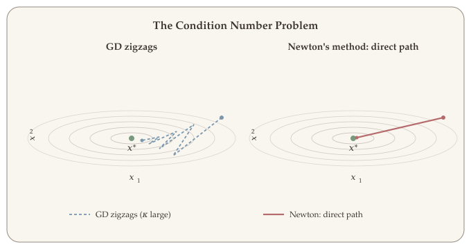
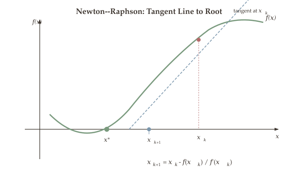
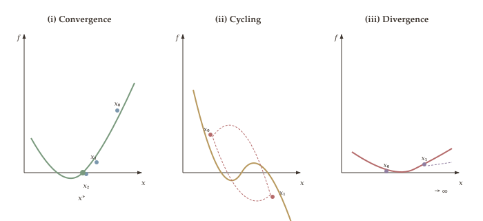
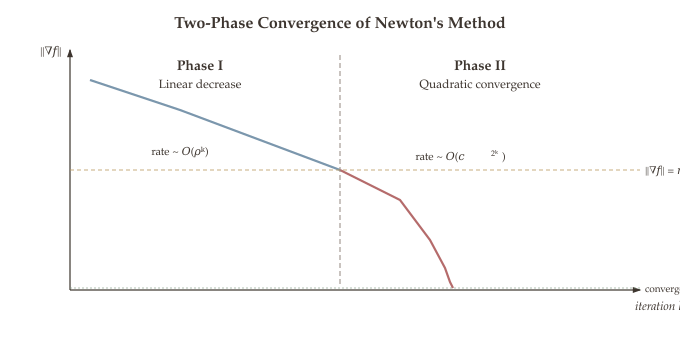

In [Part 7](06-gradient-descent.qmd) we introduced gradient descent and saw that it only uses first-order information --- the gradient --- to choose a search direction. While simple and broadly applicable, gradient descent can be frustratingly slow on ill-conditioned problems, zigzagging across narrow valleys for thousands of iterations. Newton's method overcomes this limitation by incorporating second-order information --- the Hessian matrix --- to adapt each step to the local curvature of the objective function, achieving dramatically faster convergence near the optimum.

::: {.callout-tip}
## Companion Notebook

Hands-on Python notebook accompanies this chapter. Click the badge to open in Google Colab.

- [](https://colab.research.google.com/github/ZhuoranYang/zhuoran-yale-teaching/blob/main/SDS431/notebooks/22-newton-method.ipynb) **Newton's Method** --- convergence analysis, failure modes, Newton fractals, and comparison with gradient descent
:::

## What Will Be Covered {#sec-newton-overview}

- Why first-order methods struggle on ill-conditioned problems, and how second-order information helps
- Newton's method: definition, descent property, and quadratic approximation interpretation
- Newton-Raphson method for root finding and its connection to Newton's method
- Convergence behaviors: convergence, cycling, and divergence of Newton-Raphson
- The Newton decrement and affine invariance
- Backtracking line search for damped Newton's method
- Two-phase convergence theory: linear progress followed by quadratic convergence
- Comparison with gradient descent: cost, convergence, and condition number sensitivity

## From First-Order to Second-Order Methods {#sec-first-to-second}

Recall from [Part 7](06-gradient-descent.qmd) that gradient descent updates via

$$x^{k+1} = x^k - \alpha \cdot \nabla f(x^k).$$

The negative gradient is the steepest descent direction under the $\ell_2$-norm, and it guarantees decrease in $f$ for a sufficiently small step size. However, gradient descent treats all directions equally: it does not account for the fact that the function may curve sharply in some directions and gently in others.

::: {.callout-note appearance="simple"}
**The condition number problem.** If the Hessian satisfies $m I \preceq \nabla^2 f(x) \preceq M I$, the condition number is $\kappa = M/m$. Gradient descent needs $O(\kappa \log(1/\varepsilon))$ iterations. When $\kappa$ is large (the function has a narrow, elongated valley), the iterates oscillate across the valley and converge very slowly.
:::

**Second-order methods** fix this by using the Hessian $\nabla^2 f(x)$ to rescale the gradient. Instead of moving uniformly in all directions, Newton's method takes a large step along directions where the curvature is small (the function is flat) and a small step along directions where the curvature is large (the function is steep). This effectively "spherifies" the problem, removing the dependence on the condition number.

{#fig-condition-number}

```python
#| label: fig-ill-conditioning
#| fig-cap: "Gradient descent vs. Newton's method on an ill-conditioned quadratic. Gradient descent zigzags along the narrow valley while Newton's method converges in a single step."
#| echo: false

import numpy as np
import plotly.graph_objects as go

# Ill-conditioned quadratic: f(x,y) = 10*x^2 + y^2
a_val, b_val = 10.0, 1.0
x_range = np.linspace(-5, 5, 200)
y_range = np.linspace(-5, 5, 200)
X, Y = np.meshgrid(x_range, y_range)
Z = a_val * X**2 + b_val * Y**2

# GD trajectory
alpha_gd = 0.08
x_gd = np.array([4.0, 4.0])
gd_traj = [x_gd.copy()]
for _ in range(20):
    grad = np.array([2*a_val*x_gd[0], 2*b_val*x_gd[1]])
    x_gd = x_gd - alpha_gd * grad
    gd_traj.append(x_gd.copy())
gd_traj = np.array(gd_traj)

# Newton trajectory (converges in 1 step for quadratic)
x_nt = np.array([4.0, 4.0])
nt_traj = [x_nt.copy()]
H_inv = np.diag([1/(2*a_val), 1/(2*b_val)])
grad_nt = np.array([2*a_val*x_nt[0], 2*b_val*x_nt[1]])
x_nt = x_nt - H_inv @ grad_nt
nt_traj.append(x_nt.copy())
nt_traj = np.array(nt_traj)

fig = go.Figure()
fig.add_trace(go.Contour(x=x_range.tolist(), y=y_range.tolist(), z=Z.tolist(),
    colorscale=[[0, '#f5f0e8'], [0.3, '#b8995e'], [0.6, '#ad8480'], [1, '#907ea0']],
    showscale=False, contours=dict(start=2, end=200, size=15),
    line=dict(width=0.5), opacity=0.7, name=''))
fig.add_trace(go.Scatter(x=gd_traj[:15, 0].tolist(), y=gd_traj[:15, 1].tolist(),
    mode='lines+markers', line=dict(color='#7b97ad', width=2.5),
    marker=dict(color='#7b97ad', size=5), name='Gradient Descent'))
fig.add_trace(go.Scatter(x=nt_traj[:, 0].tolist(), y=nt_traj[:, 1].tolist(),
    mode='lines+markers', line=dict(color='#b56b6b', width=2.5),
    marker=dict(color='#b56b6b', size=8, symbol='diamond'), name="Newton's Method"))
fig.add_trace(go.Scatter(x=[0], y=[0], mode='markers',
    marker=dict(color='#7a9a7e', size=12, symbol='star'), name='Optimum'))
fig.update_layout(
    xaxis=dict(title='x₁', range=[-5, 5]),
    yaxis=dict(title='x₂', range=[-5, 5], scaleanchor='x'),
    showlegend=True, legend=dict(x=0.02, y=0.98),
    margin=dict(t=20, b=50, l=55, r=20))
fig.show()
```

## Newton's Method {#sec-newton-method}

We now formally define Newton's method and establish that its search direction is always a descent direction when the Hessian is positive definite.

::: {#def-newton-update}
## Definition 18.1 (Newton's Method)

Let $f : \mathbb{R}^n \to \mathbb{R}$ be twice continuously differentiable with $\nabla^2 f(x) \succ 0$ (positive definite) at the current iterate $x^k$. The **Newton update** is:

$$x^{k+1} = x^k - \bigl[\nabla^2 f(x^k)\bigr]^{-1} \nabla f(x^k).
$$ {#eq-newton-update}

The **Newton direction** is

$$d_{\mathrm{nt}}(x) = -\bigl[\nabla^2 f(x)\bigr]^{-1} \nabla f(x),
$$ {#eq-newton-direction}

and the step size is $\alpha = 1$ (the "pure" or "full" Newton step).
:::

The Newton direction can be seen as solving a linear system: we compute $d_{\mathrm{nt}}$ by solving $\nabla^2 f(x)\, d = -\nabla f(x)$. In practice, we never explicitly invert the Hessian --- we solve this linear system using Cholesky factorization or other methods, which is more numerically stable.

::: {#thm-newton-descent}
## Theorem 18.2 (Newton Direction is a Descent Direction)

Let $f$ be differentiable at $x$ with $\nabla f(x) \neq 0$, and suppose $\nabla^2 f(x) \succ 0$. Then the Newton direction $d_{\mathrm{nt}}(x) = -[\nabla^2 f(x)]^{-1}\nabla f(x)$ is a descent direction.
:::

The proof is a direct verification: substituting the Newton direction (@eq-newton-direction) into the descent condition and using positive definiteness of the Hessian.

::: {.proof}
**Proof.** We need to verify the descent condition from [Part 7](06-gradient-descent.qmd): $\nabla f(x)^\top d_{\mathrm{nt}} < 0$. Substituting the definition:

$$\nabla f(x)^\top d_{\mathrm{nt}} = -\nabla f(x)^\top \bigl[\nabla^2 f(x)\bigr]^{-1} \nabla f(x).$$

Since $\nabla^2 f(x) \succ 0$, its inverse $[\nabla^2 f(x)]^{-1}$ is also positive definite. Therefore, for any nonzero vector $v$, we have $v^\top [\nabla^2 f(x)]^{-1} v > 0$. Setting $v = \nabla f(x) \neq 0$:

$$\nabla f(x)^\top d_{\mathrm{nt}} = -\nabla f(x)^\top \bigl[\nabla^2 f(x)\bigr]^{-1} \nabla f(x) < 0.$$

Hence $d_{\mathrm{nt}}$ is a descent direction. $\blacksquare$
:::

Intuitively, the Newton direction points "more directly" toward the minimum than the negative gradient does. While the negative gradient follows the steepest slope, the Newton direction accounts for curvature, so it avoids the zigzag behavior that plagues gradient descent on ill-conditioned problems.

## Quadratic Approximation Interpretation {#sec-quadratic-approx}

We have established that the Newton direction (@eq-newton-direction) is a descent direction. The deepest insight into Newton's method is that each Newton step minimizes a local quadratic model of the objective function --- this explains why the method converges so rapidly near the optimum.

::: {#def-quadratic-model}
## Definition 18.3 (Local Quadratic Model)

The **second-order Taylor approximation** of $f$ around a point $x$ is:

$$\widehat{f}_x(y) = f(x) + \langle \nabla f(x),\, y - x \rangle + \frac{1}{2}(y - x)^\top \nabla^2 f(x)\, (y - x).
$$ {#eq-quadratic-model}

When $\nabla^2 f(x) \succ 0$, $\widehat{f}_x$ is a strictly convex quadratic function of $y$.
:::

Setting the gradient of $\widehat{f}_x(y)$ (@eq-quadratic-model) with respect to $y$ to zero:

$$\nabla_y \widehat{f}_x(y) = \nabla f(x) + \nabla^2 f(x)(y - x) = 0 \implies y = x - [\nabla^2 f(x)]^{-1}\nabla f(x).$$

This is exactly the Newton update (@eq-newton-update). So the Newton step moves to the **exact minimizer** of the local quadratic approximation.

::: {.callout-tip}
## Key Insight: One-Step Convergence for Quadratics

If $f$ is an actual quadratic function, i.e., $f(x) = \frac{1}{2}x^\top P x + q^\top x + r$ with $P \succ 0$, then the quadratic approximation equals $f$ exactly. Therefore, Newton's method converges in **exactly one iteration** from any starting point, since minimizing the quadratic model is the same as minimizing $f$ itself.
:::

This explains the remarkable speed of Newton's method: near the optimum, any smooth function looks approximately quadratic, so Newton's method behaves as if it were solving a quadratic problem --- and on quadratic problems, it is exact.

```python
#| label: fig-quadratic-approx
#| fig-cap: "Newton's method as quadratic approximation. The blue curve is the true function f(x). The gold dashed curve is the quadratic approximation at the current iterate (red dot). The Newton step moves to the minimizer of the quadratic (green diamond), which is much closer to the true minimum."
#| echo: false

import numpy as np
import plotly.graph_objects as go

# 1D function: f(x) = x^4/4 - x^2 + 2x + 3 (nonquadratic, convex for x > ~0.8)
def f_true(x):
    return 0.25*x**4 - x**2 + 2*x + 3

def f_grad(x):
    return x**3 - 2*x + 2

def f_hess(x):
    return 3*x**2 - 2

x_current = 3.0
f_val = f_true(x_current)
g_val = f_grad(x_current)
h_val = f_hess(x_current)

# Newton step
x_newton = x_current - g_val / h_val

# Quadratic approximation
def f_quad(y):
    return f_val + g_val*(y - x_current) + 0.5*h_val*(y - x_current)**2

x_plot = np.linspace(-1, 4.5, 300)
f_plot = f_true(x_plot)
q_plot = f_quad(x_plot)

fig = go.Figure()
fig.add_trace(go.Scatter(x=x_plot.tolist(), y=f_plot.tolist(),
    mode='lines', line=dict(color='#7b97ad', width=3), name='f(x)'))
fig.add_trace(go.Scatter(x=x_plot.tolist(), y=q_plot.tolist(),
    mode='lines', line=dict(color='#b8995e', width=2.5, dash='dash'),
    name='Quadratic approx'))
fig.add_trace(go.Scatter(x=[x_current], y=[f_val],
    mode='markers', marker=dict(color='#b56b6b', size=12), name='Current iterate'))
fig.add_trace(go.Scatter(x=[x_newton], y=[f_true(x_newton)],
    mode='markers', marker=dict(color='#7a9a7e', size=12, symbol='diamond'),
    name='Newton step'))
# Arrow from current to newton
fig.add_annotation(x=x_newton, y=f_true(x_newton),
    ax=x_current, ay=f_val,
    xref='x', yref='y', axref='x', ayref='y',
    showarrow=True, arrowhead=3, arrowsize=1.5,
    arrowcolor='#968a80', arrowwidth=2)
fig.update_layout(
    xaxis=dict(title='x', range=[-1, 4.5]),
    yaxis=dict(title='f(x)', range=[-2, 25]),
    showlegend=True, legend=dict(x=0.02, y=0.98),
    margin=dict(t=20, b=50, l=55, r=20))
fig.show()
```

## Newton-Raphson Method {#sec-newton-raphson}

The Newton update (@eq-newton-update) for optimization is closely related to a classical technique for solving nonlinear equations. Understanding this connection provides both a geometric picture and a useful computational tool.

### Root Finding with Newton-Raphson {#sec-root-finding}

::: {#def-newton-raphson}
## Definition 18.4 (Newton-Raphson Method)

Given a differentiable function $F : \mathbb{R}^n \to \mathbb{R}^n$, the **Newton-Raphson method** for solving $F(x) = 0$ iterates:

$$x^{k+1} = x^k - \bigl[J_F(x^k)\bigr]^{-1} F(x^k),$$

where $J_F(x)$ is the **Jacobian matrix** of $F$ at $x$.
:::

{#fig-newton-raphson-tangent}

::: {.callout-note appearance="simple"}
**Connection to optimization.** Newton's method for minimizing $f(x)$ is equivalent to applying Newton-Raphson to the equation $\nabla f(x) = 0$, since the Jacobian of $\nabla f$ is the Hessian $\nabla^2 f$.
:::

### Geometric Interpretation in 1D {#sec-geometric-1d}

In one dimension, $F : \mathbb{R} \to \mathbb{R}$, and the update simplifies to:

$$x^{k+1} = x^k - \frac{F(x^k)}{F'(x^k)}.$$

The geometric interpretation is clean: at the point $(x^k, F(x^k))$, draw the tangent line to the graph of $F$. The next iterate $x^{k+1}$ is where this tangent line crosses the $x$-axis.

```python
#| label: fig-newton-raphson
#| fig-cap: "Newton-Raphson geometric interpretation. At each iterate, we draw the tangent line (dashed) to F(x) and move to its x-intercept. The iterates converge rapidly to the root."
#| echo: false

import numpy as np
import plotly.graph_objects as go

# F(x) = x^2 - 9, root at x = 3
def F_func(x):
    return x**2 - 9

def F_prime(x):
    return 2*x

x_plot = np.linspace(-1, 7, 300)

fig = go.Figure()
fig.add_trace(go.Scatter(x=x_plot.tolist(), y=F_func(x_plot).tolist(),
    mode='lines', line=dict(color='#7b97ad', width=3), name='F(x) = x² − 9'))
fig.add_hline(y=0, line=dict(color='#968a80', width=1, dash='dot'))

colors = ['#b56b6b', '#b8995e', '#7a9a7e']
x_k = 6.0
for i in range(3):
    f_k = F_func(x_k)
    fp_k = F_prime(x_k)
    x_next = x_k - f_k / fp_k
    # Tangent line from (x_k, f_k) to (x_next, 0)
    t_x = np.linspace(min(x_next, x_k) - 0.3, max(x_next, x_k) + 0.3, 50)
    t_y = f_k + fp_k * (t_x - x_k)
    fig.add_trace(go.Scatter(x=t_x.tolist(), y=t_y.tolist(),
        mode='lines', line=dict(color=colors[i], width=1.8, dash='dash'),
        name=f'Tangent at x{i}', showlegend=False))
    fig.add_trace(go.Scatter(x=[x_k], y=[f_k],
        mode='markers', marker=dict(color=colors[i], size=10),
        name=f'x{i} = {x_k:.3f}'))
    fig.add_trace(go.Scatter(x=[x_next], y=[0],
        mode='markers', marker=dict(color=colors[i], size=7, symbol='x'),
        showlegend=False))
    x_k = x_next

fig.add_trace(go.Scatter(x=[3], y=[0], mode='markers',
    marker=dict(color='#7a9a7e', size=12, symbol='star'), name='Root (x = 3)'))
fig.update_layout(
    xaxis=dict(title='x', range=[-1, 7]),
    yaxis=dict(title='F(x)', range=[-12, 30]),
    showlegend=True, legend=dict(x=0.02, y=0.98),
    margin=dict(t=20, b=50, l=55, r=20))
fig.show()
```

### Example: Computing Square Roots {#sec-sqrt-example}

::: {#exm-sqrt}
## Computing $\sqrt{a}$ via Newton-Raphson

To compute $\sqrt{a}$, solve $F(x) = x^2 - a = 0$. Since $F'(x) = 2x$, the Newton-Raphson update is:

$$x^{k+1} = x^k - \frac{(x^k)^2 - a}{2x^k} = \frac{1}{2}\left(x^k + \frac{a}{x^k}\right).$$

This is the **Babylonian method**, one of the oldest algorithms in mathematics. Starting from $x^0 = a$, it converges extremely quickly --- for $a = 2$, we get:

| Iteration | $x^k$ | Error $\|x^k - \sqrt{2}\|$ |
|:---------:|:------:|:---------------------------:|
| 0 | 2.000000 | 0.586 |
| 1 | 1.500000 | 0.086 |
| 2 | 1.416667 | 0.00245 |
| 3 | 1.414216 | 0.0000021 |
| 4 | 1.414214 | $< 10^{-12}$ |
:::

## Convergence Behaviors of Newton-Raphson {#sec-convergence-behaviors}

Newton-Raphson does not always converge. Its behavior depends critically on the function and the starting point. We illustrate three possibilities.

{#fig-convergence-behaviors}

### 1. Convergence {#sec-nr-converge}

**Example:** $F(x) = x^2 - 9$ with $x^0 > 0$. The update is $x^{k+1} = \frac{1}{2}(x^k + 9/x^k)$, and the iterates converge monotonically to the root $x = 3$.

### 2. Cycling {#sec-nr-cycle}

**Example:** $F(x) = x^3 - 2x + 2$. Starting from $x^0 = 0$:

$$x^1 = 0 - \frac{0 - 0 + 2}{0 - 2} = 1, \qquad x^2 = 1 - \frac{1 - 2 + 2}{3 - 2} = 0.$$

The iterates cycle between 0 and 1 forever, never reaching the root.

### 3. Divergence {#sec-nr-diverge}

**Example:** $F(x) = x^{1/3}$. The update gives $x^{k+1} = x^k - \frac{x^{1/3}}{\frac{1}{3}x^{-2/3}} = x^k - 3x^k = -2x^k$. So $|x^{k+1}| = 2|x^k|$ --- the iterates diverge.

::: {.callout-warning}
## Newton's Method is Sensitive to Initialization

These examples illustrate that Newton's method can converge, cycle, or diverge depending on the starting point and the function. In optimization, we mitigate this by using a **backtracking line search** (see @sec-backtracking) to guarantee that each step decreases the objective. But for general root-finding problems, convergence from arbitrary starting points is not guaranteed.

When $F(x) = 0$ has multiple solutions, the basins of attraction for different roots can have a fractal boundary, leading to chaotic sensitivity to the initial point.
:::

With these examples in mind, the key takeaway is that Newton-Raphson convergence depends sensitively on the starting point and the function's geometry. In optimization, we address this by combining Newton's direction with a line search that guarantees decrease, as we will see in @sec-backtracking.

## The Newton Decrement {#sec-newton-decrement}

The Newton decrement provides a natural stopping criterion for Newton's method that is superior to simply checking $\|\nabla f(x)\|$.

::: {#def-newton-decrement}
## Definition 18.5 (Newton Decrement)

The **Newton decrement** at a point $x$ is defined as:

$$\lambda(x) = \sqrt{\nabla f(x)^\top \bigl[\nabla^2 f(x)\bigr]^{-1} \nabla f(x)}.
$$ {#eq-newton-decrement}

Equivalently, in terms of the Newton direction $d_{\mathrm{nt}}(x)$:

$$\lambda(x) = \sqrt{d_{\mathrm{nt}}(x)^\top \nabla^2 f(x)\, d_{\mathrm{nt}}(x)}.$$
:::

The Newton decrement has several important properties that make it the "right" measure of proximity to the optimum.

**Property 1: Rate of decrease.** Let $g(\alpha) = f(x + \alpha\, d_{\mathrm{nt}}(x))$. Then:

$$g'(0) = \nabla f(x)^\top d_{\mathrm{nt}}(x) = -\nabla f(x)^\top [\nabla^2 f(x)]^{-1} \nabla f(x) = -\lambda(x)^2.$$

So $\lambda(x)^2$ measures how fast $f$ decreases when we take a Newton step.

**Property 2: Duality gap estimate.** The difference between $f(x)$ and the minimum of the local quadratic model is:

$$f(x) - \inf_y \widehat{f}_x(y) = \frac{1}{2}\lambda(x)^2.$$

This means $\frac{1}{2}\lambda(x)^2$ serves as a **surrogate for the suboptimality** $f(x) - f^*$. We can use $\frac{1}{2}\lambda(x)^2 \leq \varepsilon$ as a stopping criterion.

**Property 3: Affine invariance.** Unlike the gradient norm $\|\nabla f(x)\|_2$, the Newton decrement is **invariant under affine changes of coordinates**. If $T$ is any invertible matrix and we define $\bar{f}(y) = f(Ty)$, then:

$$\lambda_{\bar{f}}(y) = \lambda_f(Ty).$$

::: {.callout-tip}
## Why Affine Invariance Matters

The gradient norm $\|\nabla f(x)\|_2$ depends on the coordinate system. If you rescale the variables (e.g., measure distance in meters vs. kilometers), the gradient norm changes, and gradient descent behaves differently. The Newton decrement --- and Newton's method itself --- is invariant to such rescaling. This means Newton's method automatically adapts to the "natural" geometry of the problem.

Formally, if $\bar{f}(y) = f(Ty)$ and we run Newton's method on $\bar{f}$, the iterates satisfy $y^{k} = T^{-1} x^k$, where $x^k$ are the Newton iterates on $f$. The trajectories are identical up to the coordinate transformation.
:::

**Property 4: Steepest descent under the Hessian norm.** Newton's method can be interpreted as steepest descent under the local Hessian norm $\|u\|_{\nabla^2 f(x)} = \sqrt{u^\top \nabla^2 f(x)\, u}$. The Newton decrement is:

$$\lambda(x) = \|d_{\mathrm{nt}}(x)\|_{\nabla^2 f(x)} = \|\nabla f(x)\|_{\nabla^2 f(x)^{-1}}.$$

## Backtracking Line Search {#sec-backtracking}

The Newton decrement (@eq-newton-decrement) tells us how close we are to optimality, but pure Newton's method (with step size $\alpha = 1$) can fail even on convex functions when the iterate is far from the optimum. The quadratic approximation may be a poor model of $f$, causing the full Newton step to overshoot or even increase the objective value.

The fix is **damped Newton's method**: use the Newton direction but choose the step size via a backtracking line search to guarantee decrease.

::: {#def-backtracking}
## Definition 18.6 (Backtracking Line Search)

Given parameters $\beta \in (0,1)$ and $c \in (0, 1/2)$, and a descent direction $d$:

1. Start with $\alpha = 1$.
2. While the **Armijo condition** is violated, i.e., while
$$f(x + \alpha\, d) > f(x) + c \cdot \alpha \cdot \nabla f(x)^\top d,
$$
set $\alpha \leftarrow \beta \cdot \alpha$.
3. Return $\alpha$.
:::

The Armijo condition ensures that $f$ decreases by at least a fraction $c$ of the decrease predicted by the linear approximation. Typical choices are $\beta = 0.5$ and $c = 0.01$.

::: {.callout-note appearance="simple"}
**How it works.** We try the step sizes $\alpha = 1, \beta, \beta^2, \beta^3, \ldots$ and accept the first one that provides sufficient decrease. Near the optimum, where the quadratic model is accurate, the full step $\alpha = 1$ is accepted, and we get pure Newton convergence.
:::

```python
#| label: fig-armijo
#| fig-cap: "The Armijo condition for backtracking line search. The step size is acceptable when f(x + α d) lies below the Armijo line (green). The region where α is accepted is shaded."
#| echo: false

import numpy as np
import plotly.graph_objects as go

# 1D illustration: f(x) with x current, d = Newton direction
# Use f(t) = (t-1)^4 + 0.5*(t-1)^2, current at t=3
def phi(alpha):
    t = 3.0 - 2.5 * alpha  # x + alpha * d, where x=3, d=-2.5
    return (t - 1)**4 + 0.5*(t - 1)**2

f_x = phi(0)
grad_d = -2.5 * (4*(3.0-1)**3 + 2*0.5*(3.0-1))  # nabla f(x)^T d

c_val = 0.2
alpha_range = np.linspace(0, 1.2, 300)
phi_vals = np.array([phi(a) for a in alpha_range])
tangent_vals = f_x + grad_d * alpha_range
armijo_vals = f_x + c_val * grad_d * alpha_range

# Find acceptable region
acceptable = phi_vals <= armijo_vals + 1e-6
acc_start = alpha_range[np.argmax(acceptable)] if np.any(acceptable) else 0
# Find end of acceptable region
if np.any(acceptable):
    last_acc = np.where(acceptable)[0][-1]
    acc_end = alpha_range[last_acc]
else:
    acc_end = 0

fig = go.Figure()
fig.add_trace(go.Scatter(x=alpha_range.tolist(), y=phi_vals.tolist(),
    mode='lines', line=dict(color='#7b97ad', width=3), name='f(x + α d)'))
fig.add_trace(go.Scatter(x=alpha_range.tolist(), y=tangent_vals.tolist(),
    mode='lines', line=dict(color='#968a80', width=2, dash='dot'),
    name='f(x) + α ∇f(x)ᵀd'))
fig.add_trace(go.Scatter(x=alpha_range.tolist(), y=armijo_vals.tolist(),
    mode='lines', line=dict(color='#7a9a7e', width=2.5, dash='dash'),
    name=f'f(x) + c·α ∇f(x)ᵀd  (c={c_val})'))
# Shade acceptable region
if acc_end > 0:
    fill_alpha = alpha_range[(alpha_range >= 0) & (alpha_range <= acc_end)]
    fill_armijo = f_x + c_val * grad_d * fill_alpha
    fill_bottom = np.full_like(fill_alpha, min(phi_vals) - 2)
    fig.add_trace(go.Scatter(
        x=np.concatenate([fill_alpha, fill_alpha[::-1]]).tolist(),
        y=np.concatenate([fill_armijo, fill_bottom]).tolist(),
        fill='toself', fillcolor='rgba(122,154,126,0.15)',
        line=dict(width=0), name='Acceptable region', showlegend=True))
fig.update_layout(
    xaxis=dict(title='Step size α', range=[0, 1.2]),
    yaxis=dict(title='Objective value'),
    showlegend=True, legend=dict(x=0.45, y=0.98),
    margin=dict(t=20, b=50, l=55, r=20))
fig.show()
```

## Convergence Theory {#sec-convergence-theory}

The following theorem establishes the remarkable two-phase convergence behavior of Newton's method with backtracking line search. It explains why Newton's method is slow far from the optimum but extremely fast once it gets close.

### Assumptions {#sec-assumptions}

We require three regularity conditions on $f$:

1. **Strong convexity:** $\nabla^2 f(x) \succeq m I$ for all $x$ (for some $m > 0$).
2. **Smoothness:** $\nabla^2 f(x) \preceq M I$ for all $x$ (for some $M > 0$).
3. **Lipschitz Hessian:** $\|\nabla^2 f(x) - \nabla^2 f(y)\| \leq L\|x - y\|$ for all $x, y$.

The first two conditions are standard --- they appeared in the convergence analysis of gradient descent. The third condition is new: it says the curvature of $f$ does not change too abruptly. This is what allows the quadratic approximation to be accurate near the optimum.

::: {#thm-two-phase}
## Theorem 18.7 (Two-Phase Convergence of Newton's Method)

Under the assumptions above, there exist constants $\eta > 0$ and $\gamma > 0$ with $0 < \eta \leq m^2/L$ such that Newton's method with backtracking line search satisfies:

**Phase I (Damped Newton phase):** When $\|\nabla f(x^k)\|_2 \geq \eta$, using step size $\alpha^k$ from backtracking (which satisfies $\alpha^k \geq m/M$):

$$f(x^{k+1}) - f(x^k) \leq -\gamma,
$$

i.e., the objective decreases by at least a fixed constant at every iteration.

**Phase II (Pure Newton phase):** When $\|\nabla f(x^k)\|_2 < \eta$, the backtracking line search accepts the full step $\alpha^k = 1$, and:

$$\frac{L}{2m^2}\|\nabla f(x^{k+1})\|_2 \leq \left(\frac{L}{2m^2}\|\nabla f(x^k)\|_2\right)^2,
$$

i.e., the (scaled) gradient norm **squares** at every iteration --- quadratic convergence.
:::

{#fig-two-phase-convergence}

::: {.callout-tip}
## What Does Two-Phase Convergence Mean in Practice?

**Phase I** (far from optimum): Each iteration makes **constant progress**, decreasing $f$ by at least $\gamma$. After at most $\frac{f(x^0) - f^*}{\gamma}$ iterations, the gradient norm drops below $\eta$ and we enter Phase II.

**Phase II** (near optimum): The error **squares** at each iteration. If the scaled gradient norm is $10^{-1}$ at the start of Phase II, it becomes $10^{-2}$, then $10^{-4}$, then $10^{-8}$, then $10^{-16}$, then $10^{-32}$, then $10^{-64}$ --- achieving machine precision in about **6 iterations**. This doubly-exponential decay is the hallmark of quadratic convergence.
:::

### Iteration Complexity {#sec-iteration-complexity}

The total number of Newton iterations to achieve $\|\nabla f(x^k)\|_2 \leq \varepsilon$ is:

$$K(\varepsilon) = \underbrace{\frac{f(x^0) - p^*}{\gamma}}_{\text{Phase I}} + \underbrace{\log_2 \log_2\!\left(\frac{2m^2}{L^2 \varepsilon}\right)}_{\text{Phase II}}.
$$

::: {.callout-note appearance="simple"}
The Phase II contribution is a **double logarithm** --- it grows incredibly slowly. For example, $\log_2 \log_2(10^{64}) \approx \log_2(213) \approx 8$. So Phase II takes a negligible number of iterations regardless of the target accuracy.
:::

### Proof Sketch {#sec-proof-sketch}

We outline the key ideas behind each phase without full details.

::: {.proof}
**Proof sketch.**

**Phase I:** When $\|\nabla f(x^k)\| \geq \eta$, the Newton direction is well-defined and provides a descent direction. The backtracking line search finds a step size $\alpha^k \geq m/M$ (this follows from the quadratic upper bound implied by $\nabla^2 f \preceq MI$). By the Armijo condition:

$$f(x^{k+1}) \leq f(x^k) + c \cdot \alpha^k \cdot \nabla f(x^k)^\top d_{\mathrm{nt}} \leq f(x^k) - c \cdot \frac{m}{M} \cdot \frac{\|\nabla f(x^k)\|^2}{M} \leq f(x^k) - \gamma,$$

where $\gamma = c \cdot m \cdot \eta^2 / M^2 > 0$.

**Phase II:** When $\|\nabla f(x^k)\| < \eta \leq m^2/L$, the iterate is close enough to $x^*$ that the quadratic model is very accurate. By the Lipschitz Hessian condition, the error in the quadratic approximation is bounded by $\frac{L}{6}\|y - x\|^3$. This leads to:

$$\|\nabla f(x^{k+1})\| \leq \frac{L}{2m^2}\|\nabla f(x^k)\|^2,$$

and since $\|\nabla f(x^k)\| < \eta \leq m^2/L$, the full step $\alpha = 1$ satisfies the Armijo condition, so backtracking accepts it. $\blacksquare$
:::

The two-phase convergence analysis reveals the fundamental advantage of Newton's method: the doubly-exponential convergence in Phase II makes the total iteration count nearly independent of the target accuracy. The price for this speed is the cubic per-iteration cost of solving the Newton system. This naturally leads to the question: when does the per-step cost pay for itself?

## Comparison with Gradient Descent {#sec-comparison}

::: {.callout-note appearance="simple"}

| | **Gradient Descent** | **Newton's Method** |
|:---|:---|:---|
| **Information used** | Gradient (first-order) | Gradient + Hessian (second-order) |
| **Per-iteration cost** | $O(n)$ | $O(n^3)$ (solving $n \times n$ linear system) |
| **Convergence rate** | Linear: $O(\kappa \log(1/\varepsilon))$ | Quadratic (Phase II): ~6 iters to machine precision |
| **Condition number sensitivity** | High ($\kappa = M/m$) | Low (affine invariant) |
| **Memory** | $O(n)$ | $O(n^2)$ (store Hessian) |
| **Robustness** | Converges from any start (with small $\alpha$) | May need line search far from optimum |
| **Best for** | Large-scale, low-accuracy | Moderate-scale, high-accuracy |
:::

The key tradeoff is **per-iteration cost vs. number of iterations**. Gradient descent is cheap per iteration ($O(n)$) but may need many iterations (especially when $\kappa$ is large). Newton's method is expensive per iteration ($O(n^3)$) but needs very few iterations. In practice:

- For **small to moderate** $n$ (up to a few thousand), Newton's method is often preferred because the cubic cost is affordable and convergence is fast.
- For **large** $n$ (millions of parameters, as in deep learning), Newton's method is impractical. This is where first-order methods (SGD, Adam) and quasi-Newton methods (L-BFGS) dominate.

```python
#| label: fig-convergence-comparison
#| fig-cap: "Convergence comparison on a 2D quadratic with condition number 20. Gradient descent (blue) converges linearly, while Newton's method (red) converges in a single iteration. The y-axis is log-scale."
#| echo: false

import numpy as np
import plotly.graph_objects as go

# f(x) = 0.5 * x^T A x, A = diag(20, 1)
A = np.diag([20.0, 1.0])
x_star = np.zeros(2)

# GD with optimal step size 1/M = 1/20
x_gd = np.array([5.0, 5.0])
alpha_gd = 1.0 / 20.0
gd_fvals = []
for k in range(50):
    fval = 0.5 * x_gd @ A @ x_gd
    gd_fvals.append(fval)
    grad = A @ x_gd
    x_gd = x_gd - alpha_gd * grad

# Newton
x_nt = np.array([5.0, 5.0])
nt_fvals = []
for k in range(50):
    fval = 0.5 * x_nt @ A @ x_nt
    nt_fvals.append(fval)
    if np.linalg.norm(A @ x_nt) < 1e-15:
        nt_fvals.extend([nt_fvals[-1]] * (50 - len(nt_fvals)))
        break
    grad = A @ x_nt
    d = -np.linalg.solve(A, grad)
    x_nt = x_nt + d

# Pad Newton values
while len(nt_fvals) < 50:
    nt_fvals.append(nt_fvals[-1])

iters = list(range(50))
# Replace zeros with small value for log scale
gd_plot = [max(v, 1e-16) for v in gd_fvals]
nt_plot = [max(v, 1e-16) for v in nt_fvals]

fig = go.Figure()
fig.add_trace(go.Scatter(x=iters, y=gd_plot,
    mode='lines+markers', line=dict(color='#7b97ad', width=2.5),
    marker=dict(size=4), name='Gradient Descent'))
fig.add_trace(go.Scatter(x=iters, y=nt_plot,
    mode='lines+markers', line=dict(color='#b56b6b', width=2.5),
    marker=dict(size=4), name="Newton's Method"))
fig.update_layout(
    xaxis=dict(title='Iteration k', range=[0, 30]),
    yaxis=dict(title='f(x^k) − f*', type='log', range=[-16, 3]),
    showlegend=True, legend=dict(x=0.55, y=0.98),
    margin=dict(t=20, b=50, l=65, r=20))
fig.show()
```

::: {.callout-tip}
## Looking Ahead

Newton's method forms the foundation for **interior point methods**, which extend second-order optimization to handle inequality constraints. In the next chapter, we will see how the barrier method reduces a constrained optimization problem to a sequence of unconstrained problems, each solved by Newton's method. The same two-phase convergence theory carries over, making interior point methods both theoretically elegant and practically efficient.
:::

## Summary {.unnumbered}

- **Second-order curvature adaptation.** Newton's method updates via $x^{k+1} = x^k - [\nabla^2 f(x^k)]^{-1}\nabla f(x^k)$, using the Hessian to rescale the gradient according to local curvature---effectively removing the condition number dependence that plagues gradient descent.
- **Quadratic convergence.** Near the optimum, Newton's method converges quadratically: the error satisfies $\|x^{k+1} - x^*\| \leq C\|x^k - x^*\|^2$, meaning the number of correct digits roughly doubles each iteration.
- **Two-phase convergence.** With backtracking line search (damped Newton), the method exhibits two phases: a damped phase where $f(x^k) - f^*$ decreases linearly by a constant per step, followed by a pure Newton phase with quadratic convergence once the iterates are close to $x^*$.
- **Newton decrement.** The quantity $\lambda(x) = (\nabla f(x)^\top [\nabla^2 f(x)]^{-1} \nabla f(x))^{1/2}$ serves as an affine-invariant measure of proximity to optimality and a natural stopping criterion: the method has converged when $\lambda(x)^2 / 2 \leq \varepsilon$.


---

## Modern Matrix Optimizers

Having seen how Newton's method exploits second-order curvature information through the Hessian, we now turn to modern optimizers that exploit the *matrix structure* of neural network parameters. These methods connect to the steepest descent framework under different matrix norms.

Training deep neural networks involves optimizing over **matrix-shaped parameters** --- the weight matrices $W \in \mathbb{R}^{m \times n}$ in every linear layer. Standard optimizers like gradient descent and Adam treat these matrices as flat vectors of $mn$ numbers, ignoring their rich structure. Recent advances in optimization have shown that exploiting the matrix geometry of parameters --- through spectral norms, SVD-based updates, and Kronecker-factored preconditioners --- can dramatically accelerate training. This chapter develops the theory behind these modern optimizers and connects them to the steepest descent framework from [Part 7](06-gradient-descent.qmd).

{#fig-optimizer-branches}

## What Will Be Covered {#sec-matrix-optimizer-overview}

- Why matrix structure matters for optimization in deep learning
- Steepest descent under different matrix norms (Frobenius vs. spectral)
- Muon: steepest descent under the spectral norm via SVD
- Shampoo: full-matrix adaptive preconditioning via Kronecker factorization
- SOAP: combining Shampoo with Adam in a rotated coordinate system
- A unified view of the optimizer design space

## The Steepest Descent Framework for Matrices {#sec-matrix-steepest-descent}

Recall from [Part 7](06-gradient-descent.qmd) the steepest descent framework: given a norm $\|\cdot\|$, the steepest descent direction solves

$$\min_{d:\,\|d\| \leq 1} \;\langle \nabla f(x),\, d \rangle.$$ {#eq-steepest-descent-general}

Different norms yield different algorithms. For **vector** parameters, we established:

| Norm | Steepest descent direction | Algorithm |
|---|---|---|
| $\ell_2$ | $-\nabla f / \|\nabla f\|_2$ | Gradient descent |
| $\ell_1$ | $-e_j \cdot \text{sign}(\partial_j f)$ | Coordinate descent |
| $\ell_\infty$ | $-\text{sign}(\nabla f)$ | Sign gradient descent |
| Hessian ($\|\cdot\|_{\nabla^2 f}$) | $-[\nabla^2 f]^{-1} \nabla f$ | Newton's method ([Chapter 18](14-newton-method.qmd)) |

For **matrix** parameters $W \in \mathbb{R}^{m \times n}$, the gradient $G = \nabla_W \mathcal{L}$ is also a matrix, and we can choose among several matrix norms:

| Norm | Definition | Steepest descent direction | Algorithm |
|---|---|---|---|
| Frobenius $\|D\|_F$ | $\sqrt{\sum_{ij} D_{ij}^2}$ | $-G / \|G\|_F$ | Gradient descent |
| Spectral $\|D\|_{\text{op}}$ | $\sigma_{\max}(D)$ | $-UV^\top$ (from SVD of $G$) | **Muon** |

The Frobenius norm treats the matrix as a flat vector --- it is simply the $\ell_2$ norm of $\text{vec}(W)$. The spectral norm is sensitive to the singular value structure, leading to qualitatively different update directions.

```python
#| label: fig-frobenius-vs-spectral
#| fig-cap: "Figure 20.1: Singular values of the gradient G vs. the Muon update UV^T. Gradient descent preserves the (often skewed) singular value distribution; Muon equalizes all singular values to 1."
#| echo: false

import plotly.graph_objects as go
from plotly.subplots import make_subplots
import numpy as np

np.random.seed(42)
m, n = 8, 6
G = np.random.randn(m, n)
G = G @ np.diag([5, 3, 1.5, 0.5, 0.2, 0.05])  # skewed spectrum
U, S, Vt = np.linalg.svd(G, full_matrices=False)

fig = make_subplots(rows=1, cols=2, subplot_titles=[
    "Gradient G: singular values", "Muon update UV<sup>T</sup>: singular values"
])

fig.add_trace(go.Bar(
    x=[f"σ{i+1}" for i in range(len(S))], y=S,
    marker_color=['#7b97ad', '#7a9a7e', '#b8995e', '#ad8480', '#907ea0', '#968a80'],
    showlegend=False
), row=1, col=1)

fig.add_trace(go.Bar(
    x=[f"σ{i+1}" for i in range(len(S))], y=[1.0]*len(S),
    marker_color=['#7b97ad', '#7a9a7e', '#b8995e', '#ad8480', '#907ea0', '#968a80'],
    showlegend=False
), row=1, col=2)

fig.update_yaxes(title_text="Singular value", row=1, col=1)
fig.update_yaxes(title_text="Singular value", range=[0, max(S)*1.1], row=1, col=2)
fig.update_layout(height=400, margin=dict(t=40, b=50, l=55, r=20))
fig.show()
```

## Muon: Steepest Descent under the Spectral Norm {#sec-muon}

The steepest descent framework (@eq-steepest-descent-general) tells us that the choice of norm determines the update direction. We now work out what happens when we choose the spectral (operator) norm for matrix parameters --- this leads to the Muon optimizer. Given a matrix parameter $W$ with gradient $G = \nabla_W \mathcal{L}$, the **spectral-norm steepest descent** problem is:

$$\min_{D:\,\|D\|_{\text{op}} \leq 1} \;\langle G,\, D \rangle_F = \min_{D:\,\|D\|_{\text{op}} \leq 1} \;\text{tr}(G^\top D).$$

::: {#thm-spectral-steepest}
## Theorem 20.1 (Spectral-Norm Steepest Descent)

Let $G = U \Sigma V^\top$ be the (compact) SVD of the gradient $G \in \mathbb{R}^{m \times n}$. Then the solution to $\min_{\|D\|_{\text{op}} \leq 1} \text{tr}(G^\top D)$ is:

$$D^* = -U V^\top.$$

The minimum value is $-\|G\|_* = -\sum_i \sigma_i(G)$ (the negative nuclear norm of $G$).
:::

::: {.proof}
The proof uses von Neumann's trace inequality to lower-bound the objective and then verifies that $D^* = -UV^\top$ attains that bound.

**Proof.** By von Neumann's trace inequality, for any matrices $A, B \in \mathbb{R}^{m \times n}$:

$$\text{tr}(A^\top B) \leq \sum_i \sigma_i(A)\,\sigma_i(B).$$

Applying this with $A = G$ and $B = D$, and using $\|D\|_{\text{op}} \leq 1$ (so $\sigma_i(D) \leq 1$ for all $i$):

$$\text{tr}(G^\top D) \geq -\sum_i \sigma_i(G) \cdot \sigma_i(D) \geq -\sum_i \sigma_i(G) = -\|G\|_*.$$

Equality holds when $D = -UV^\top$, since $\sigma_i(-UV^\top) = 1$ for all $i$ and the singular vectors align with those of $G$. $\blacksquare$
:::

{#fig-muon-svd}

The **Muon optimizer** (Momentum + Orthogonalization) applies this idea:

::: {.callout-important}
## Algorithm: Muon

For matrix parameter $W \in \mathbb{R}^{m \times n}$ with gradient $G = \nabla_W \mathcal{L}$:

1. **Momentum:** $M \leftarrow \beta \cdot M + (1-\beta)\,G$ (exponential moving average)
2. **Orthogonalize:** Compute SVD $M = U\Sigma V^\top$, set $\widetilde{M} = UV^\top$
3. **Update:** $W \leftarrow W - \alpha\,\widetilde{M}$

The orthogonalization step replaces all singular values of the momentum buffer with 1, producing a direction with unit spectral norm.
:::

::: {.callout-tip}
## Why Spectral-Norm Steepest Descent?

The key insight is that **all directions in the update receive equal "energy"** in terms of the spectral norm. Standard gradient descent can have singular values spanning orders of magnitude --- the update is dominated by a few large singular values. The orthogonalization in Muon eliminates this imbalance, analogous to how Newton's method eliminates the condition-number dependence by using the Hessian norm.

In practice, Muon is applied only to the **matrix-shaped** parameters (weight matrices in linear layers), while scalar parameters (biases, layer norms) use standard Adam or AdamW (see [Part 8](07-momentum-adaptive-sgd.qmd)).
:::

### Practical Considerations {#sec-muon-practical}

Computing the full SVD of $M \in \mathbb{R}^{m \times n}$ costs $O(\min(m,n) \cdot mn)$, which is comparable to a matrix multiplication. In practice, Muon often uses a cheaper approximation:

- **Newton-Schulz iteration**: Approximate $UV^\top$ (the polar factor of $M$) by iterating $X \leftarrow \frac{3}{2}X - \frac{1}{2}X X^\top X$, starting from $X_0 = M / \|M\|_F$. This converges cubically and typically needs only 5--10 iterations of matrix multiplications --- which are highly optimized on GPUs.

```python
#| label: fig-muon-vs-gd
#| fig-cap: "Figure 20.2: Singular value distributions of gradient vs. Muon update across training. GD updates have highly non-uniform spectra (dominated by top singular values), while Muon equalizes the spectrum."
#| echo: false

import plotly.graph_objects as go
import numpy as np

np.random.seed(0)

# Simulate gradient spectra at different training stages
stages = ['Early training', 'Mid training', 'Late training']
spectra = [
    [8, 4, 2, 1, 0.3, 0.05],
    [5, 3, 2, 1.5, 0.8, 0.2],
    [3, 2.5, 2, 1.8, 1.2, 0.5],
]
colors_gd = ['#b56b6b', '#ad8480', '#968a80']
colors_muon = ['#7b97ad', '#7a9a7e', '#b8995e']

fig = go.Figure()

x_labels = [f"σ{i+1}" for i in range(6)]
for i, (stage, spec) in enumerate(zip(stages, spectra)):
    fig.add_trace(go.Scatter(
        x=x_labels, y=spec, mode='lines+markers',
        line=dict(color=colors_gd[i], width=2, dash='dash'),
        marker=dict(size=7), name=f'GD — {stage}'
    ))
    fig.add_trace(go.Scatter(
        x=x_labels, y=[1.0]*6, mode='lines+markers',
        line=dict(color=colors_muon[i], width=2),
        marker=dict(size=7, symbol='diamond'), name=f'Muon — {stage}',
        visible='legendonly' if i > 0 else True
    ))

fig.update_xaxes(title_text="Singular value index")
fig.update_yaxes(title_text="Magnitude", range=[0, 9])
fig.update_layout(height=450, margin=dict(t=20, b=50, l=55, r=20),
                  legend=dict(x=0.55, y=0.98))
fig.show()
```

## Shampoo: Full-Matrix Adaptive Preconditioning {#sec-shampoo}

Muon exploits the spectral structure of the gradient through orthogonalization, but it does not accumulate historical gradient information the way adaptive methods like AdaGrad and Adam do. Shampoo takes a complementary approach: it builds a full-matrix preconditioner from gradient history, but uses Kronecker factorization to keep the cost manageable.

AdaGrad (see [Part 8](07-momentum-adaptive-sgd.qmd)) adapts the learning rate per coordinate using accumulated squared gradients. For vector parameters $\theta \in \mathbb{R}^d$, the simplified AdaGrad update is $\theta_j \leftarrow \theta_j - \alpha\,g_j / \sqrt{G_j + \varepsilon}$ where $G_j = \sum_\ell (g_j^\ell)^2$.

The **full-matrix** version maintains $\mathbf{G} = \sum_\ell g^\ell (g^\ell)^\top \in \mathbb{R}^{d \times d}$ and updates $\theta \leftarrow \theta - \alpha\,\mathbf{G}^{-1/2} g$. This is a much better preconditioner because it captures **correlations between coordinates**, not just per-coordinate variance. The diagonal AdaGrad is a special case that ignores all off-diagonal entries.

### The Scalability Problem {#sec-shampoo-scalability}

For a matrix parameter $W \in \mathbb{R}^{m \times n}$, we could vectorize it as $\text{vec}(W) \in \mathbb{R}^{mn}$, but then the full-matrix AdaGrad preconditioner would be an $mn \times mn$ matrix --- storing and inverting it costs $O(m^2 n^2)$ and $O(m^3 n^3)$ respectively. For a typical Transformer layer with $m = n = 4096$, this would require storing a $16\text{M} \times 16\text{M}$ matrix. Clearly impossible.

**Shampoo** solves this by exploiting the **Kronecker structure** of the gradient outer products.

::: {#def-shampoo}
## Definition 20.2 (Shampoo Preconditioner)

For matrix parameter $W \in \mathbb{R}^{m \times n}$ with gradient $G^k = \nabla_W \mathcal{L}$ at step $k$, Shampoo maintains two smaller matrices:

$$L^k = \sum_{\ell=1}^{k} G^\ell (G^\ell)^\top \in \mathbb{R}^{m \times m}, \qquad R^k = \sum_{\ell=1}^{k} (G^\ell)^\top G^\ell \in \mathbb{R}^{n \times n}.$$

The **Shampoo update** is:

$$W \leftarrow W - \alpha\,(L^k)^{-1/4}\,G^k\,(R^k)^{-1/4}.$$ {#eq-shampoo-update}
:::

### Why Kronecker Factorization Works {#sec-kronecker}

The Shampoo update (@eq-shampoo-update) applies separate left and right preconditioners rather than a single $mn \times mn$ matrix. The following theorem justifies this factorization by showing that the full preconditioner is well-approximated by a Kronecker product of the two smaller matrices.

::: {#thm-kronecker-approx}
## Theorem 20.3 (Kronecker Approximation)

The full-matrix AdaGrad preconditioner for $\text{vec}(W)$ is $\mathbf{G} = \sum_\ell \text{vec}(G^\ell)\,\text{vec}(G^\ell)^\top \in \mathbb{R}^{mn \times mn}$. Using the identity $\text{vec}(ABC) = (C^\top \otimes A)\,\text{vec}(B)$, this admits the approximation:

$$\mathbf{G} \approx R \otimes L,$$ {#eq-kronecker-approx}

where $\otimes$ denotes the Kronecker product. Therefore:

$$\mathbf{G}^{-1/2} \approx R^{-1/2} \otimes L^{-1/2},$$

which acts on $\text{vec}(G)$ as $L^{-1/2}\, G\, R^{-1/2}$.
:::

{#fig-kronecker-factorization}

The fourth-root version $(L^{-1/4}, R^{-1/4})$ is used in practice for numerical stability.

::: {.callout-note appearance="simple"}
**Computational savings:**

| Approach | Storage | Per-step cost |
|---|---|---|
| Full-matrix AdaGrad | $O(m^2 n^2)$ | $O(m^3 n^3)$ |
| Shampoo | $O(m^2 + n^2)$ | $O(m^3 + n^3)$ |
| Diagonal AdaGrad | $O(mn)$ | $O(mn)$ |

Shampoo captures cross-coordinate correlations at a fraction of the cost of the full preconditioner. For $m = n = 4096$: full AdaGrad needs $\sim 10^{14}$ entries; Shampoo needs $\sim 3 \times 10^7$.
:::

```python
#| label: fig-preconditioner-comparison
#| fig-cap: "Figure 20.3: The preconditioner structures. Diagonal AdaGrad uses only the diagonal; Shampoo captures left and right correlations via Kronecker factorization; full-matrix AdaGrad captures everything but is intractable."
#| echo: false

import plotly.graph_objects as go
from plotly.subplots import make_subplots
import numpy as np

fig = make_subplots(rows=1, cols=3, subplot_titles=[
    'Diagonal AdaGrad', 'Shampoo (L ⊗ R)', 'Full-Matrix AdaGrad'
])

n = 12

# Diagonal
diag_mat = np.eye(n) * np.random.uniform(0.5, 2, n)
fig.add_trace(go.Heatmap(z=diag_mat, colorscale=[[0, '#faf7f3'], [1, '#7b97ad']],
    showscale=False), row=1, col=1)

# Kronecker
L = np.random.randn(4, 4); L = L @ L.T + np.eye(4)
R = np.random.randn(3, 3); R = R @ R.T + np.eye(3)
kron = np.kron(R, L)
kron = kron / kron.max()
fig.add_trace(go.Heatmap(z=kron, colorscale=[[0, '#faf7f3'], [1, '#7a9a7e']],
    showscale=False), row=1, col=2)

# Full
full = np.random.randn(n, n); full = full @ full.T + np.eye(n)
full = full / full.max()
fig.add_trace(go.Heatmap(z=full, colorscale=[[0, '#faf7f3'], [1, '#b8995e']],
    showscale=False), row=1, col=3)

fig.update_layout(height=350, margin=dict(t=40, b=20, l=20, r=20))
fig.show()
```

## SOAP: Combining Shampoo with Adam {#sec-soap}

Shampoo captures cross-coordinate correlations via the Kronecker-factored preconditioner (@eq-kronecker-approx), but it does not include the per-coordinate adaptivity that makes Adam so effective in practice. SOAP bridges this gap by running Adam in the coordinate system defined by Shampoo's eigenbasis, combining the strengths of both methods.

**SOAP** (Shampoo Orthogonalized Adam Preconditioning) combines the best of Shampoo and Adam by running Adam in a coordinate system defined by Shampoo's preconditioner:

1. **Compute eigenbases:** Eigendecompose $L = Q_L \Lambda_L Q_L^\top$ and $R = Q_R \Lambda_R Q_R^\top$.
2. **Rotate gradient:** $\widetilde{G} = Q_L^\top G\, Q_R$ (project into the Shampoo eigenbasis).
3. **Apply Adam** to $\widetilde{G}$ (maintain momentum and second-moment estimates in the rotated basis).
4. **Rotate back:** Apply the Shampoo fourth-root scaling and rotate the update back to the original coordinates.

::: {.callout-tip}
## Why Rotate?

The eigenvectors of $L$ and $R$ identify the "natural" coordinate system for the optimization landscape --- the directions along which gradient variance is highest or lowest. Running Adam in this rotated basis means the per-coordinate adaptive learning rates align with the true principal axes of curvature, rather than the arbitrary axes of the parameter matrix.

This is the same principle behind Newton's method: adapt the coordinate system to the local geometry. SOAP does this using gradient statistics (like Adam/Shampoo) rather than the Hessian (like Newton), making it practical for the large-scale non-convex problems of deep learning.
:::

{#fig-soap-pipeline}

### Computational Cost {#sec-soap-cost}

SOAP's overhead compared to Adam comes from:

- **Eigendecompositions** of $L \in \mathbb{R}^{m \times m}$ and $R \in \mathbb{R}^{n \times n}$: $O(m^3 + n^3)$, but these need not be recomputed every step (e.g., every 100 steps suffices).
- **Rotation**: Two matrix multiplications per step: $O(m^2 n + mn^2)$.
- **Adam in rotated basis**: Same as standard Adam, $O(mn)$.

In practice, the amortized cost per step is modest, and the convergence speedup often compensates for the overhead.

## The Unified View {#sec-unified-view}

Having developed three matrix-aware optimizers --- Muon (spectral norm), Shampoo (Kronecker preconditioning), and SOAP (rotated Adam) --- we now step back and place them in a single framework that also includes the classical methods from earlier chapters.

All the optimizers we have studied fit the general framework from [Part 7](06-gradient-descent.qmd):

$$x^{k+1} = x^k - \alpha^k \cdot B^k\,\nabla f(x^k),$$

differing only in the choice of the **preconditioning matrix** $B^k$:

| Method | $B^k$ | What it captures | Cost per step |
|---|---|---|---|
| GD | $I$ | Nothing | $O(n)$ |
| Sign GD | $\text{diag}(1/|g_j|)$ | Gradient sign only | $O(n)$ |
| Newton | $[\nabla^2 f]^{-1}$ | Local curvature (Hessian) | $O(n^3)$ |
| AdaGrad/Adam | $\text{diag}(1/\sqrt{\widehat{v}_j})$ | Per-coord gradient variance | $O(n)$ |
| Muon | SVD orthogonalization | Matrix spectral structure | $O(mn \cdot \min(m,n))$ |
| Shampoo | $(L^{-1/4} \cdot R^{-1/4})$ | Cross-coord correlations | $O(m^3 + n^3)$ |
| SOAP | Shampoo eigenbasis + Adam | Correlations + variance | $O(m^3 + n^3)$ amortized |

The progression tells a clear story:

1. **GD**: Ignore all structure --- same step in every direction.
2. **Adam**: Adapt per-coordinate, using gradient variance as a proxy for curvature.
3. **Newton**: Use exact curvature (Hessian) --- perfect for convex problems, impractical for deep learning.
4. **Muon**: Exploit matrix structure via spectral norm --- equalize singular values.
5. **Shampoo/SOAP**: Approximate full-matrix preconditioning via Kronecker structure --- capture cross-coordinate correlations without the cost of full second-order methods.

```python
#| label: fig-optimizer-landscape
#| fig-cap: "Figure 20.4: The optimizer design space. Moving right adds more structural information about the optimization landscape; moving up increases computational cost. The sweet spot for deep learning lies in the upper-middle region."
#| echo: false

import plotly.graph_objects as go

methods = ['GD', 'Sign GD', 'Adam/AdamW', 'Muon', 'Shampoo', 'SOAP', 'Newton']
info = [1, 1.5, 3, 4, 5.5, 6.5, 8]
cost = [1, 1, 1.5, 3, 5, 5.5, 8]
colors = ['#968a80', '#968a80', '#b8995e', '#7b97ad', '#7a9a7e', '#907ea0', '#b56b6b']
sizes = [12, 12, 16, 16, 16, 16, 14]

fig = go.Figure()

fig.add_trace(go.Scatter(
    x=info, y=cost, mode='markers+text', text=methods,
    textposition=['bottom center', 'top center', 'bottom center',
                  'top center', 'bottom center', 'top center', 'bottom center'],
    textfont=dict(size=12),
    marker=dict(color=colors, size=sizes, line=dict(width=1.5, color='white')),
    showlegend=False
))

# Sweet spot region
import numpy as np
theta = np.linspace(0, 2*np.pi, 100)
cx, cy = 4.5, 3.5
fig.add_trace(go.Scatter(
    x=cx + 2.5*np.cos(theta), y=cy + 2.2*np.sin(theta),
    mode='lines', line=dict(color='#b8995e', width=2, dash='dot'),
    name='Deep learning sweet spot', fill='toself',
    fillcolor='rgba(184,153,94,0.08)'
))

fig.update_xaxes(title_text="Structural information used", range=[0, 9],
                 showticklabels=False)
fig.update_yaxes(title_text="Computational cost per step", range=[0, 9],
                 showticklabels=False)
fig.update_layout(height=500, margin=dict(t=20, b=50, l=55, r=20),
                  legend=dict(x=0.02, y=0.98))
fig.show()
```

Having surveyed the full optimizer design space, the central lesson emerges: as we move from gradient descent to Newton's method to the modern matrix optimizers, each step incorporates richer structural information about the problem --- per-coordinate variance, full Hessian curvature, or the spectral geometry of weight matrices --- at a progressively higher (but manageable) computational cost.

::: {.callout-tip}
## Looking Ahead

The optimizers in this chapter --- Muon, Shampoo, SOAP --- represent the frontier of practical optimization for deep learning. They achieve much of the benefit of second-order methods (Newton, interior point) at a fraction of the cost, by exploiting the specific structure of neural network parameters. In the next part of the course, we turn to **linear programming**, where the structure of the problem admits even more specialized and powerful algorithms.
:::
