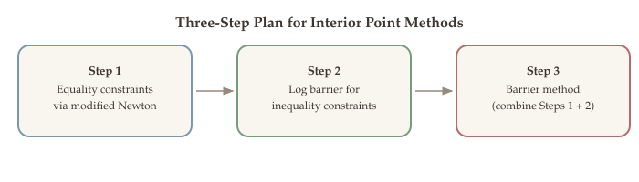
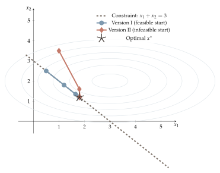
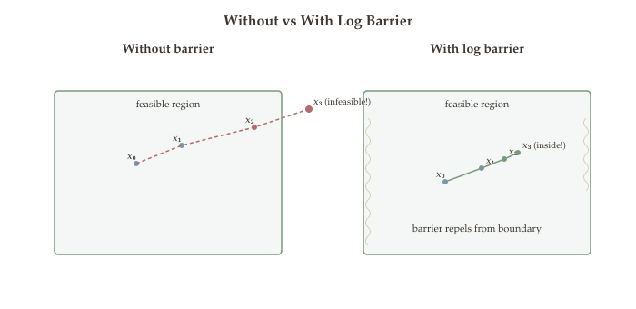
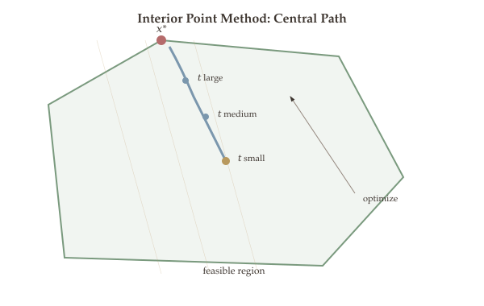
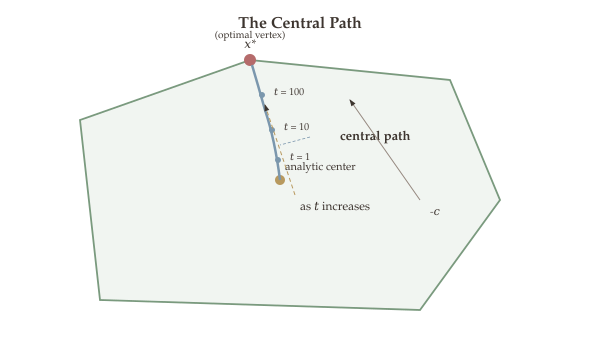
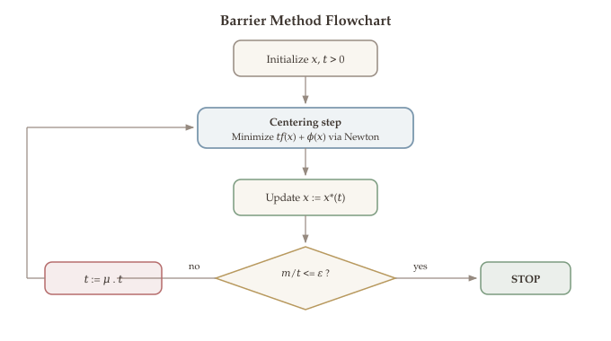
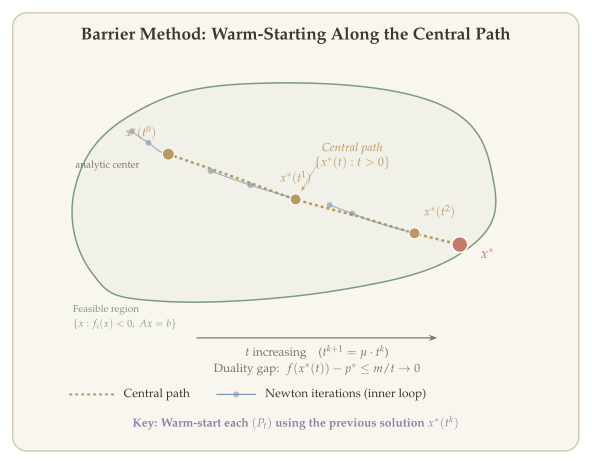

Newton's method gives us a powerful tool for unconstrained optimization, converging quadratically near a solution. But most real-world problems come with inequality constraints --- budgets, capacity limits, non-negativity requirements --- that Newton's method cannot handle directly. Interior point methods extend Newton's method to constrained problems by replacing hard inequality constraints with a smooth logarithmic penalty, then systematically tightening the penalty until the solution converges to the true optimum. These methods are the engine behind modern optimization solvers such as MOSEK, Gurobi's barrier solver, and CVXPY's default backend.

::: {.callout-tip}
## Companion Notebook

Hands-on Python notebook accompanies this chapter. Click the badge to open in Google Colab.

-  **Equality-Constrained Newton** --- implementing the equality-constrained Newton method step by step
:::

## What Will Be Covered {.unnumbered}

- From unconstrained to constrained optimization: the challenge of inequality constraints
- Equality-constrained Newton's method: feasible start (Version I) and infeasible start (Version II)
- The constrained Newton decrement as a stopping criterion
- The logarithmic barrier function and its approximation properties
- The central path and its connection to perturbed KKT conditions
- The barrier method algorithm: centering, parameter update, and convergence
- A worked LP example with the central path
- Interactive demo: implementing the barrier method in Python

## From Unconstrained to Constrained Optimization {#sec-unconstrained-to-constrained}

In [Chapter 18](14-newton-method.qmd), we developed Newton's method for unconstrained optimization: given a twice-differentiable function $f$, Newton's method iterates $x^{k+1} = x^k - [\nabla^2 f(x^k)]^{-1} \nabla f(x^k)$ and converges quadratically near the optimum. But most optimization problems of practical interest have constraints.

The general convex optimization problem takes the form:

$$
\begin{aligned}
\min_{x \in \mathbb{R}^n} \quad & f(x) \\
\text{subject to} \quad & f_i(x) \leq 0, \quad i = 1, 2, \ldots, m \\
& Ax = b,
\end{aligned}
$$

where $f$ and $f_1, \ldots, f_m$ are convex, $A \in \mathbb{R}^{p \times n}$ with $\operatorname{rank}(A) = p$. By the theory of [Part 5](05-convex-optimization.qmd), optimality is characterized by the KKT conditions.

**Our plan** for this chapter:

1. Handle **equality constraints** first by modifying Newton's method.
2. Incorporate **inequality constraints** via a logarithmic barrier function.
3. Combine both into the **barrier method** (interior point method).

{#fig-three-step-plan}

## Equality-Constrained Newton's Method {#sec-equality-newton}

We begin with the simpler problem of equality-constrained optimization:

$$
\min_{x \in \mathbb{R}^n} \; f(x) \quad \text{subject to} \quad Ax = b,
$$

where $f$ is convex and twice differentiable, $A \in \mathbb{R}^{p \times n}$ with $\operatorname{rank}(A) = p$.

There are three natural approaches to this problem:

1. **Eliminate constraints**: substitute $x = Fz + x_0$ where $AF = 0$ and $Ax_0 = b$, reducing to an unconstrained problem in $z$.
2. **Solve the dual problem**: form the Lagrangian and optimize the dual.
3. **Equality-constrained Newton** (our focus): directly apply a Newton-like iteration that respects the constraint $Ax = b$.

### Optimality Conditions {#sec-equality-kkt}

::: {#thm-equality-kkt}
## KKT Conditions for Equality-Constrained Problems

Suppose $f$ is convex and differentiable and $\operatorname{rank}(A) = p$. Then $x^*$ is optimal for $\min f(x)$ subject to $Ax = b$ if and only if there exists $\nu^* \in \mathbb{R}^p$ such that:

$$
\nabla f(x^*) + A^\top \nu^* = 0, \qquad Ax^* = b.
$$ {#eq-equality-kkt}
:::

The first condition says the gradient of $f$ must be a linear combination of the rows of $A$ at optimality --- the gradient is "absorbed" by the constraints. The second condition says $x^*$ must be feasible.

### Version I: Feasible Start Newton {#sec-feasible-newton}

Suppose we start from a feasible point $x$ with $Ax = b$. We want to find a descent direction $d$ that keeps us feasible. Replacing $f$ by its second-order Taylor approximation around $x$:

$$
\min_{d} \; f(x) + \nabla f(x)^\top d + \frac{1}{2} d^\top \nabla^2 f(x) \, d \quad \text{subject to} \quad Ad = 0.
$$

The constraint $Ad = 0$ ensures that after updating $x \leftarrow x + \alpha d$, we still satisfy $A(x + \alpha d) = Ax + \alpha Ad = b + 0 = b$.

Writing the KKT conditions for this quadratic subproblem yields the **Newton system**:

$$
\begin{pmatrix} \nabla^2 f(x) & A^\top \\ A & 0 \end{pmatrix} \begin{pmatrix} d \\ w \end{pmatrix} = \begin{pmatrix} -\nabla f(x) \\ 0 \end{pmatrix}.
$$ {#eq-newton-kkt-system}

::: {#def-kkt-matrix}
## KKT Matrix

The block matrix

$$
K = \begin{pmatrix} \nabla^2 f(x) & A^\top \\ A & 0 \end{pmatrix}
$$

is called the **KKT matrix**. It is invertible whenever $\nabla^2 f(x) \succ 0$ on the null space of $A$ and $\operatorname{rank}(A) = p$.
:::

**The algorithm** (Feasible Start Newton):

1. Start with $x^0$ satisfying $Ax^0 = b$.
2. At each iteration, solve the Newton system to get the direction $d$.
3. Perform a backtracking line search: $x \leftarrow x + \alpha \cdot d$.
4. Stop when the Newton decrement is small.

::: {.callout-tip}
## Remark: Feasibility is Preserved

If $Ax = b$ and $Ad = 0$, then $A(x + \alpha d) = b$ for any step size $\alpha$. The feasible-start Newton method automatically stays on the constraint surface.
:::

### Version II: Infeasible Start (Primal-Dual Newton) {#sec-infeasible-newton}

What if we do not have a feasible starting point? We can still apply Newton's method by treating the KKT conditions (@eq-equality-kkt) as a system of nonlinear equations to be solved.

Define the KKT residual:

$$
F(x, \nu) = \begin{pmatrix} \nabla f(x) + A^\top \nu \\ Ax - b \end{pmatrix}.
$$

The KKT conditions say $F(x^*, \nu^*) = 0$. Applying Newton-Raphson to this system, we linearize $F$ at the current $(x, \nu)$ and solve:

$$
\begin{pmatrix} \nabla^2 f(x) & A^\top \\ A & 0 \end{pmatrix} \begin{pmatrix} \Delta x \\ \Delta \nu \end{pmatrix} = -\begin{pmatrix} \nabla f(x) + A^\top \nu \\ Ax - b \end{pmatrix}.
$$

::: {#thm-primal-dual-properties}
## Properties of Primal-Dual Newton

The infeasible-start Newton method has the following properties:

1. **No feasibility requirement**: the starting point need not satisfy $Ax = b$.
2. **Joint updates**: both primal variable $x$ and dual variable $\nu$ are updated simultaneously.
3. **Quadratic convergence**: locally, the iterates converge quadratically to a KKT point.
4. **One-step feasibility**: if the full step $\alpha = 1$ is taken, then $A(x + \Delta x) = b$. That is, the iterate becomes feasible after a single full Newton step.
:::

::: {.proof}
**Proof (of Property 4).** From the second block row of the Newton system: $A \Delta x = -(Ax - b) = b - Ax$. Therefore $A(x + \Delta x) = Ax + A\Delta x = Ax + (b - Ax) = b$. $\blacksquare$
:::

### Connecting the Two Versions {#sec-connecting-versions}

The two versions solve the same KKT system (@eq-newton-kkt-system), just with different right-hand sides. When the current iterate $x$ is already feasible ($Ax = b$) and we set $\nu = w$ (the dual variable from the Newton system), the right-hand side of Version II becomes:

$$
-\begin{pmatrix} \nabla f(x) + A^\top w \\ Ax - b \end{pmatrix} = -\begin{pmatrix} \nabla f(x) + A^\top w \\ 0 \end{pmatrix}.
$$

Comparing with Version I, both solve the same linear system with the same matrix --- only the right-hand side differs. When $x$ is feasible, Version I and Version II produce the same Newton direction $d = \Delta x$.

{#fig-feasible-vs-infeasible}

::: {.callout-note appearance="simple"}
The KKT matrix is the same in both versions --- it is the KKT matrix of the quadratic subproblem. The only difference is the right-hand side: Version I has zero in the second block (because $Ax = b$), while Version II has the residual $Ax - b$.
:::

## Newton Decrement for Constrained Problems {#sec-constrained-decrement}

Just as the Newton decrement provides a stopping criterion for unconstrained Newton's method, we need an analogous quantity for the equality-constrained setting.

::: {#def-constrained-decrement}
## Constrained Newton Decrement

Let $d_{\mathrm{nt}}(x)$ be the Newton direction obtained from the KKT system. The **constrained Newton decrement** is:

$$
\lambda(x) = \sqrt{d_{\mathrm{nt}}(x)^\top \nabla^2 f(x) \, d_{\mathrm{nt}}(x)}.
$$
:::

The Newton decrement measures the quality of the quadratic approximation at the current point, restricted to the feasible subspace.

::: {#thm-decrement-gap}
## Interpretation of the Newton Decrement

The constrained Newton decrement satisfies:

$$
f(x) - \inf\{f(x + v) + \nabla f(x)^\top v + \tfrac{1}{2} v^\top \nabla^2 f(x) v \mid Av = 0\} = \frac{1}{2}\lambda(x)^2.
$$

That is, $\frac{1}{2}\lambda(x)^2$ is the gap between the current objective value and the minimum of the quadratic model on the feasible subspace.
:::

In practice, we stop the equality-constrained Newton method when $\lambda(x) \leq \epsilon$ for some tolerance $\epsilon > 0$.

## Going Beyond Equality Constraints --- The Log Barrier {#sec-log-barrier}

We now tackle the general convex optimization problem with both inequality and equality constraints:

$$
\min_{x} \; f(x) \quad \text{s.t.} \quad f_i(x) \leq 0, \; i = 1, \ldots, m, \quad Ax = b.
$$

### Why Newton Alone Is Not Enough {#sec-why-barrier}

The KKT conditions for this problem include complementary slackness $\lambda_i f_i(x) = 0$ with $\lambda_i \geq 0$ and $f_i(x) \leq 0$. These conditions involve inequalities and a product-equals-zero condition that are inherently non-smooth --- Newton's method, which relies on differentiability, cannot handle them directly.

{#fig-barrier-vs-no-barrier}

**The idea**: replace the hard inequality constraints with a smooth penalty function that blows up as we approach the boundary.

### From Indicator to Barrier {#sec-indicator-to-barrier}

The original problem is equivalent to:

$$
\min_{x} \; f(x) + \sum_{i=1}^{m} \mathbb{I}_{(-\infty, 0]}(f_i(x)) \quad \text{s.t.} \quad Ax = b,
$$

where the indicator function $\mathbb{I}_{(-\infty, 0]}(u) = 0$ if $u \leq 0$ and $+\infty$ otherwise. This reformulation folds the inequality constraints into the objective, but the indicator is not differentiable --- we cannot apply Newton's method.

::: {#def-log-barrier-approx}
## Logarithmic Barrier Approximation

The **logarithmic barrier approximation** to the indicator function is:

$$
\widehat{I}_t(u) = -\frac{1}{t}\log(-u), \qquad \operatorname{dom}(\widehat{I}_t) = \{u : u < 0\},
$$

where $t > 0$ is a parameter controlling the accuracy of the approximation.
:::

This approximation has three key properties:

- **Convex and differentiable** on its domain $\{u < 0\}$.
- **Blows up** as $u \to 0^-$: $-\frac{1}{t}\log(-u) \to +\infty$, enforcing strict inequality.
- **Tightens** as $t \to \infty$: the approximation approaches the indicator function.

### The Barrier Function and Barrier Problem {#sec-barrier-function}

::: {#def-log-barrier}
## Logarithmic Barrier Function

The **logarithmic barrier function** for the inequality constraints $f_i(x) \leq 0$ is:

$$
\phi(x) = -\sum_{i=1}^{m} \log(-f_i(x)),
$$

with $\operatorname{dom}(\phi) = \{x : f_i(x) < 0 \; \forall \, i\}$ (the strictly feasible set).
:::

{#fig-log-barrier}

Note that $\phi(x) \to +\infty$ as $x$ approaches the boundary of the feasible region (i.e., as any $f_i(x) \to 0^-$). This "barrier" prevents iterates from leaving the interior of the feasible set.

::: {#def-barrier-problem}
## Barrier Problem

For parameter $t > 0$, the **barrier problem** $(P_t)$ is:

$$
\min_{x} \; t \cdot f(x) + \phi(x) \quad \text{subject to} \quad Ax = b.
$$ {#eq-barrier-problem}

Equivalently, dividing by $t$:

$$
\min_{x} \; f(x) + \frac{1}{t}\phi(x) \quad \text{subject to} \quad Ax = b.
$$
:::

The barrier problem (@eq-barrier-problem) is an equality-constrained problem --- we can solve it using the equality-constrained Newton method from the previous section, applying the KKT system (@eq-newton-kkt-system) with $f$ replaced by $t \cdot f + \phi$!

### Gradient and Hessian of the Barrier {#sec-barrier-derivatives}

To apply Newton's method to $(P_t)$, we need the gradient and Hessian of $\phi$:

$$
\nabla \phi(x) = \sum_{i=1}^{m} \frac{1}{-f_i(x)} \nabla f_i(x),
$$

$$
\nabla^2 \phi(x) = \sum_{i=1}^{m} \frac{1}{f_i(x)^2} \nabla f_i(x) \nabla f_i(x)^\top + \sum_{i=1}^{m} \frac{1}{-f_i(x)} \nabla^2 f_i(x).
$$

::: {.callout-warning}
## The Tradeoff in Choosing $t$

- **Large $t$**: the barrier $(1/t)\phi(x)$ is small, so $x^*(t)$ is close to the true optimum. But the Hessian of $\phi$ varies rapidly near the boundary, making Newton's method converge slowly.
- **Small $t$**: the barrier is dominant, and $x^*(t)$ lies deep in the interior of the feasible set --- far from optimal but easy to find with Newton.

This tradeoff motivates the **path-following** strategy: start with small $t$, solve $(P_t)$, then gradually increase $t$.
:::

## The Central Path {#sec-central-path}

As we vary $t > 0$, the solutions $x^*(t)$ of the barrier problem (@eq-barrier-problem) trace out a curve through the interior of the feasible set. This curve is the **central path**, and it is the geometric backbone of interior point methods.

::: {#def-central-path}
## Central Path

The **central path** is the set $\{x^*(t) : t > 0\}$, where $x^*(t)$ is the unique solution to the barrier problem $(P_t)$.
:::

{#fig-central-path}

{#fig-central-path-diagram}

::: {#thm-central-path-properties}
## Properties of the Central Path

Assume $f, f_1, \ldots, f_m$ are convex, the problem satisfies Slater's condition, and $\operatorname{rank}(A) = p$. Then:

1. **Strict feasibility**: $f_i(x^*(t)) < 0$ for all $i$, and $Ax^*(t) = b$.
2. **Convergence**: $x^*(t) \to x^*$ (an optimal solution) as $t \to \infty$.
3. **Perturbed KKT**: each central path point satisfies

$$
t \, \nabla f(x^*(t)) + \nabla \phi(x^*(t)) + A^\top \nu(t) = 0, \qquad Ax^*(t) = b.
$$

4. **Dual recovery**: the central path induces dual variables

$$
\lambda_i^*(t) = \frac{-1}{t \cdot f_i(x^*(t))} > 0, \qquad i = 1, \ldots, m.
$$

5. **Duality gap bound**: $f(x^*(t)) - p^* \leq m/t$, where $p^*$ is the optimal value of the original problem.
:::

Property 5 is the most important for algorithm design: it tells us exactly how close $x^*(t)$ is to optimal, and we can achieve any desired accuracy by choosing $t$ large enough.

::: {.proof}
**Proof sketch (of the duality gap bound).** The optimality condition for $(P_t)$ gives $t \nabla f(x^*(t)) + \sum_{i=1}^{m} \frac{1}{-f_i(x^*(t))} \nabla f_i(x^*(t)) + A^\top \nu(t) = 0$. Setting $\lambda_i^*(t) = \frac{-1}{t \cdot f_i(x^*(t))}$, this becomes $\nabla f(x^*(t)) + \sum_i \lambda_i^*(t) \nabla f_i(x^*(t)) + \frac{1}{t} A^\top \nu(t) = 0$, which is the stationarity condition of the Lagrangian. The dual objective evaluated at $(\lambda^*(t), \nu(t)/t)$ satisfies:

$$
g(\lambda^*(t), \nu(t)/t) \geq f(x^*(t)) - \sum_{i=1}^{m} \lambda_i^*(t) f_i(x^*(t)) - m/t = f(x^*(t)) - m/t.
$$

Wait --- more carefully, $\lambda_i^*(t) f_i(x^*(t)) = \frac{-1}{t \cdot f_i(x^*(t))} \cdot f_i(x^*(t)) = \frac{1}{t}$ for each $i$. Summing gives $\sum_i \lambda_i^*(t) f_i(x^*(t)) = -m/t$. Since $g(\lambda^*(t), \nu(t)/t) \leq p^*$ (weak duality) and the duality gap is $f(x^*(t)) - g(\lambda^*(t), \nu(t)/t) = m/t$, we conclude $f(x^*(t)) - p^* \leq m/t$. $\blacksquare$
:::

::: {.callout-note appearance="simple"}
The central path traces a smooth curve through the **interior** of the feasible set, converging to the optimal solution as $t \to \infty$. This is why these methods are called "interior point" methods --- they stay strictly inside the feasible region, never touching the boundary until the limit.
:::

## Example: The LP Central Path {#sec-lp-central-path}

To build intuition, consider a concrete LP in two dimensions:

$$
\min_{x \in \mathbb{R}^2} \; c^\top x \quad \text{subject to} \quad a_i^\top x \leq b_i, \quad i = 1, \ldots, m.
$$

The barrier function specializes to:

$$
\phi(x) = -\sum_{i=1}^{m} \log(b_i - a_i^\top x),
$$

and the barrier gradient becomes $\nabla \phi(x) = \sum_{i=1}^{m} \frac{a_i}{b_i - a_i^\top x} = A^\top d$, where $d_i = 1/(b_i - a_i^\top x)$.

The central path point $x^*(t)$ satisfies:

$$
t \cdot c + \nabla \phi(x^*(t)) = 0.
$$

At $t = 0$, this gives $\nabla \phi(x^*(0)) = 0$, which is the **analytic center** of the polytope --- the point that maximizes the product of distances to the constraint boundaries. As $t \to \infty$, $x^*(t)$ moves toward the optimal vertex, tracing a smooth arc through the interior.

{#fig-lp-central-path}

## Interpreting the Central Path via Perturbed KKT {#sec-perturbed-kkt}

The duality gap bound $f(x^*(t)) - p^* \leq m/t$ gives a quantitative measure of optimality. The central path also has an elegant interpretation through the lens of KKT conditions, revealing why interior point methods converge to a true KKT point. At each point along the path, the KKT conditions are "almost" satisfied, with a controlled perturbation.

::: {#thm-perturbed-kkt}
## Perturbed KKT Conditions

The central path point $(x^*(t), \lambda^*(t), \nu^*(t))$ satisfies:

1. **Primal feasibility (strict)**: $f_i(x^*(t)) < 0$ for all $i$, and $Ax^*(t) = b$.
2. **Dual feasibility**: $\lambda_i^*(t) = \frac{-1}{t \cdot f_i(x^*(t))} > 0$ for all $i$.
3. **Stationarity**: $\nabla f(x^*(t)) + \sum_{i=1}^{m} \lambda_i^*(t) \nabla f_i(x^*(t)) + A^\top \nu^*(t) = 0$.
4. **Perturbed complementary slackness**: $\lambda_i^*(t) \cdot f_i(x^*(t)) = -\frac{1}{t}$ for all $i$.
:::

Compare condition 4 with exact complementary slackness, which requires $\lambda_i \cdot f_i(x^*) = 0$. The perturbation $-1/t$ vanishes as $t \to \infty$, so the central path converges to an exact KKT point.

::: {.callout-tip}
## Remark: Uniform Perturbation

The perturbed complementary slackness $\lambda_i f_i = -1/t$ is the **same** for every constraint $i$. This means the central path "treats all constraints equally" --- it does not prematurely decide which constraints will be active at the optimum. This is one reason interior point methods are numerically stable.
:::

## The Barrier Method {#sec-barrier-method}

Having established the central path, the duality gap bound $m/t$, and the perturbed KKT interpretation, we now have all the ingredients to state the full barrier method (also called the **path-following interior point method**).

::: {#def-barrier-method}
## Barrier Method

**Input**: strictly feasible $x^0$ (with $f_i(x^0) < 0$ for all $i$ and $Ax^0 = b$), initial $t^0 > 0$, growth factor $\mu > 1$, tolerance $\varepsilon > 0$.

**Repeat**:

1. **Centering step**: Starting from the current $x$, use equality-constrained Newton's method to (approximately) minimize $t \cdot f(x) + \phi(x)$ subject to $Ax = b$. Let $x^*(t)$ denote the result.
2. **Update**: $x \leftarrow x^*(t)$.
3. **Increase $t$**: $t \leftarrow \mu \cdot t$.
4. **Stop** if $m/t \leq \varepsilon$.

**Output**: $x$ (an $\varepsilon$-optimal solution).
:::

{#fig-barrier-flowchart}

The key insight is **warm starting**: we initialize the centering step for parameter $\mu t$ using the solution $x^*(t)$ from the previous centering step. Since $\mu t$ is not too far from $t$ (provided $\mu$ is moderate), $x^*(t)$ is a good starting point, and Newton's method converges in just a few iterations.

{#fig-barrier-warmstart}

### Convergence of the Barrier Method {#sec-barrier-convergence}

::: {#thm-barrier-convergence}
## Convergence of the Barrier Method

After solving the barrier problem $(P_{t^k})$ where $t^k = \mu^k \cdot t^0$:

$$
f(x^k) - p^* \leq \frac{m}{\mu^k \cdot t^0}.
$$

The number of outer iterations to reach $\varepsilon$-accuracy is:

$$
K = \left\lceil \frac{\log(m / (\varepsilon \cdot t^0))}{\log \mu} \right\rceil.
$$
:::

::: {.proof}
**Proof.** After $k$ outer iterations, $t^k = \mu^k t^0$. By the duality gap bound (@thm-central-path-properties, Property 5), $f(x^k) - p^* \leq m/t^k = m/(\mu^k t^0)$. Setting $m/(\mu^k t^0) \leq \varepsilon$ and solving for $k$ gives the result. $\blacksquare$
:::

### Choosing the Parameters {#sec-parameter-choice}

The barrier method has three parameters: $t^0$, $\mu$, and the accuracy of each centering step. The choice involves a tradeoff:

- **$\mu$ too small** (e.g., $\mu = 1.01$): each outer step makes little progress, so we need many outer iterations (many barrier problems to solve).
- **$\mu$ too large** (e.g., $\mu = 100$): the warm-starting advantage is lost, so each centering step requires many Newton iterations.
- **$t^0$ too small**: the initial central path point is far from optimal, requiring many outer iterations.
- **$t^0$ too large**: the first centering step is expensive (poor initialization for Newton).

Typical choices in practice: $\mu \in [2, 50]$ and $t^0 = m / (f(x^0) - p^{\text{est}})$ where $p^{\text{est}}$ is an estimate of $p^*$.

::: {.callout-tip}
## Complexity of the Barrier Method

With careful parameter tuning (specifically $\mu = 1 + 1/\sqrt{m}$), the barrier method achieves an $\varepsilon$-optimal solution in $O(\sqrt{m} \cdot \log(m/\varepsilon))$ Newton steps total. Each Newton step costs $O(n^3)$ for a dense problem (dominated by solving the KKT system). This polynomial-time complexity was a major theoretical breakthrough --- unlike the simplex method, interior point methods have provably efficient worst-case behavior.
:::

{#fig-barrier-convergence}

The barrier method thus achieves polynomial-time convergence for general convex programs with inequality constraints, inheriting the quadratic convergence of Newton's method at each centering step. We now place it alongside the other optimization algorithms developed in this course.

## Comparison of Methods {#sec-comparison}

The following table summarizes the methods we have studied for solving optimization problems:

| Method | Constraints Handled | Per-Iteration Cost | Convergence |
|---|---|---|---|
| Gradient Descent | None | $O(n)$ | Linear |
| Newton's Method | None (or equality) | $O(n^3)$ | Quadratic |
| Simplex | LP only | Variable | Finite (exponential worst case) |
| Barrier / Interior Point | General convex | $O(n^3)$ per Newton step | $O(\sqrt{m} \log(1/\varepsilon))$ Newton steps |

::: {.callout-note appearance="simple"}
The barrier method combines Newton's quadratic convergence (for each centering step) with a systematic outer loop (increasing $t$) to handle inequality constraints. The total work is polynomial in the problem size, making it suitable for large-scale problems.
:::

## Looking Ahead {#sec-looking-ahead}

::: {.callout-note}
## Interior Point Methods in Practice

Interior point methods are the theoretical backbone of modern optimization solvers. Several widely used software packages implement variants of the barrier method:

- **MOSEK**: uses a homogeneous self-dual interior point method for LP, SOCP, and SDP.
- **Gurobi**: offers both simplex and barrier (interior point) solvers; the barrier solver is often faster on large, dense problems.
- **CVXPY / SCS**: the default backend for CVXPY uses operator-splitting methods, but CVXPY can also call MOSEK's interior point solver for higher accuracy.

The ideas in this chapter --- log barriers, central paths, and perturbed KKT conditions --- extend naturally to second-order cone programs (SOCP) and semidefinite programs (SDP), forming the basis of **conic optimization**. While we will not cover these extensions in detail, the intuition is the same: replace conic constraints with barrier functions and follow the central path.

For a deeper treatment of interior point methods, including self-concordant barriers, primal-dual interior point methods, and complexity bounds for conic programs, see Boyd & Vandenberghe, Chapter 11, or the monograph by Nesterov and Nemirovskii, *Interior-Point Polynomial Algorithms in Convex Programming* (1994).
:::

## Summary {.unnumbered}

- **From unconstrained to constrained.** Interior point methods handle inequality constraints $f_i(x) \leq 0$ by replacing them with the logarithmic barrier $\phi(x) = -\sum_{i=1}^{m}\log(-f_i(x))$, converting the constrained problem into a sequence of unconstrained problems $\min_x\; t\, f_0(x) + \phi(x)$ for increasing $t$.
- **Central path.** As $t \to \infty$, the minimizers $x^*(t)$ trace a smooth curve---the central path---through the strict interior of the feasible region, converging to the true constrained optimum; each point on the path satisfies perturbed KKT conditions with duality gap $m/t$.
- **Barrier method.** The algorithm alternates between a centering step (solving the barrier problem via Newton's method) and a parameter update ($t \leftarrow \mu \cdot t$ with $\mu > 1$); after $O(\sqrt{m}\log(m/\varepsilon))$ outer iterations, the duality gap drops below $\varepsilon$.
- **Equality-constrained Newton.** For problems with equality constraints $Ax = b$, Newton's method is modified to solve the KKT system jointly for the primal step $\Delta x$ and dual variable $\nu$, ensuring feasibility is maintained throughout.

### Second-Order Methods Comparison {.unnumbered}

{#fig-second-order-hierarchy}

| Method | Per-iteration cost | Convergence | Handles constraints | Key idea |
|---|---|---|---|---|
| **Newton** | $O(n^3)$ Hessian solve | Quadratic (local) | Unconstrained / equality | Curvature-adapted step |
| **Ellipsoid** | $O(n^2)$ ellipsoid update | $O(n^2 \log(1/\varepsilon))$ | Convex (via oracle) | Volume shrinking |
| **Interior Point** | $O(n^3)$ Newton centering | $O(\sqrt{m}\log(1/\varepsilon))$ outer | Inequality + equality | Log-barrier + central path |
