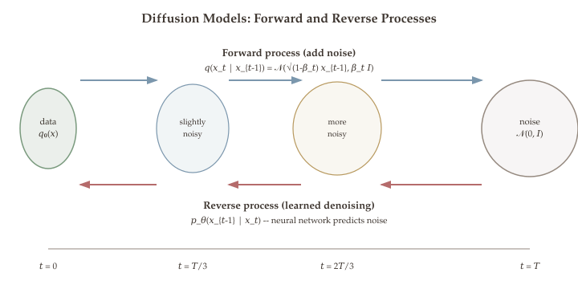

::: {.callout-tip}
## Remark: Prerequisites

- [Part 5.1](06-gradient-descent.qmd): gradient-based optimization
- [Part 2](02-math-background.qmd): probability, chain rule, backpropagation
:::

How can we generate photorealistic images from scratch? How do systems like Stable Diffusion and DALL-E 3 produce stunning artwork from a text prompt? The answer lies in a surprisingly simple and elegant idea: learn to reverse the process of adding noise. If we gradually corrupt an image by adding Gaussian noise until it becomes indistinguishable from pure static, and then train a neural network to undo each tiny noise step, we obtain a generative model that can conjure realistic images out of random noise.

Diffusion models represent one of the most successful applications of the optimization techniques we have developed throughout this course. Training a diffusion model reduces to a regression problem --- predicting the noise that was added at each step --- solved via the very stochastic gradient descent and backpropagation methods from earlier lectures. The mathematical framework connecting the forward noising process to the reverse denoising process draws on probability, variational inference, and the theory of stochastic processes. Yet the final algorithm is remarkably simple: sample noise, predict it with a neural network, and take a gradient step.

::: {.callout-tip}
## Companion Notebooks

Hands-on Python notebooks accompany this chapter. Click a badge to open in Google Colab.

- [](https://colab.research.google.com/github/ZhuoranYang/zhuoran-yale-teaching/blob/main/SDS431/notebooks/19-tiny-ddpm.ipynb) **Tiny DDPM** --- training a minimal denoising diffusion model from scratch
- [](https://colab.research.google.com/github/ZhuoranYang/zhuoran-yale-teaching/blob/main/SDS431/notebooks/20-stable-diffusion.ipynb) **Stable Diffusion Pipeline** --- end-to-end walkthrough of text-to-image generation with Stable Diffusion
- [](https://colab.research.google.com/github/ZhuoranYang/zhuoran-yale-teaching/blob/main/SDS431/notebooks/21-stable-diffusion-encoder-decoder.ipynb) **Stable Diffusion Encoder/Decoder** --- exploring the VAE encoder and decoder components
:::

This chapter develops the full mathematical pipeline behind DDPM (Denoising Diffusion Probabilistic Models), from the variance-preserving forward process and its closed-form marginals, through the Evidence Lower Bound (ELBO) that motivates the training objective, to the noise-prediction reparameterization that makes training work in practice.

## What Will Be Covered {#sec-overview}

- The forward diffusion process: noise schedules and variance preservation
- Closed-form marginal distributions $q(x_t \mid x_0)$
- The reverse denoising process and image generation
- The Evidence Lower Bound (ELBO) and its decomposition
- Noise prediction and the simplified DDPM training objective
- DDPM training and sampling algorithms

## Introduction to Diffusion Models {#introduction}

Denoising diffusion models consist of two processes:

- **Forward diffusion process (fixed):** gradually adds Gaussian noise to input data, transforming an image into pure noise.
- **Reverse denoising process (learned):** learns to generate data from noise by iteratively denoising, using a neural network.

::: {.callout-tip}
## Remark: Key References

- Sohl-Dickstein et al., *Deep Unsupervised Learning using Nonequilibrium Thermodynamics*, ICML 2015
- Ho et al., *Denoising Diffusion Probabilistic Models* (DDPM), NeurIPS 2020
- Song et al., *Score-Based Generative Modeling through Stochastic Differential Equations*, ICLR 2021
:::

{#fig-diffusion-forward-reverse}

The central design questions are:

1. **How to design the forward process?** In particular, how to choose the noise schedule?
2. **How to design the reverse process?** What is the optimization objective for training the neural network $\mu_\theta$, and what architecture to use?

## Forward Diffusion Process {#forward-process}

Starting from a data point $x_0 \sim P_{\text{data}}$, we construct a sequence $x_0, x_1, \ldots, x_T$ by adding i.i.d. Gaussian noise at each step:

$$x_t = \sqrt{1 - \beta_t}\, x_{t-1} + \sqrt{\beta_t}\, \varepsilon_{t-1}, \qquad \varepsilon_t \overset{\text{iid}}{\sim} \mathcal{N}(0, I_d).$$

Equivalently, the conditional density of $x_t$ given $x_{t-1}$ is:

$$q(x_t \mid x_{t-1}) = \mathcal{N}\!\left(x_t;\; \sqrt{1-\beta_t}\, x_{t-1},\; \beta_t\, I\right).$$

The joint distribution over the entire forward chain factorizes as a Markov chain:

$$q(x_{1:T} \mid x_0) = \prod_{t=1}^{T} q(x_t \mid x_{t-1}).$$

### Noise Schedule {#noise-schedule}

The noise schedule $\{\beta_t\}_{t=1}^{T}$ controls how quickly information is destroyed:

- $\beta_t$ is close to 0 when $t$ is small (gentle noise at the start).
- $\beta_t$ grows over time so that $x_T \approx \mathcal{N}(0, I_d)$ by the end.
- In practice (DDPM): $\beta_1 = \beta_{\min} \approx 10^{-3}$, $\beta_T = \beta_{\max} \approx 0.02$, with linear interpolation between them. The number of steps $T$ is typically 1000.

```{=html}
<div class="figure-container">
  <div id="fig-noise-schedule"></div>
  <div class="figure-caption">Figure 11.1: Linear noise schedule β_t and cumulative signal retention ᾱ_t = ∏(1−β_i). As t grows, ᾱ_t → 0 and the signal vanishes.</div>
</div>
```

### Why $\sqrt{1-\beta_t}$ and $\sqrt{\beta_t}$? {#variance-preservation}

::: {#thm-variance-preservation}
## Theorem 11.1 (Variance Preservation)

For any $a, b \in \mathbb{R}$, define the recursion $X_t = a\, X_{t-1} + b\, \varepsilon_{t-1}$. If we want $X_T \to \mathcal{N}(0, I_d)$ in distribution as $T \to \infty$, then we need

$$a = \sqrt{1-\beta}, \qquad b = \sqrt{\beta} \qquad \text{for some } \beta \in (0, 1].$$
:::

This result explains why the diffusion coefficients take the specific form $\sqrt{1-\beta_t}$ and $\sqrt{\beta_t}$: they are the unique choice (up to parameterization) that preserves unit variance across the recursion, ensuring the process converges to standard Gaussian noise regardless of the starting distribution.

::: {.proof}
By unrolling the recursion:

$$X_t = a^t X_0 + b\left(\varepsilon_{t-1} + a\,\varepsilon_{t-2} + \cdots + a^{t-1}\varepsilon_0\right).$$

The variance of the noise term is:

$$\operatorname{Var}(\text{noise}) = b^2 (1 + a^2 + a^4 + \cdots + a^{2(t-1)}) I = b^2 \cdot \frac{1 - a^{2t}}{1 - a^2}\, I.$$

For convergence to $\mathcal{N}(0, I)$, we need two conditions: (1) the signal component $a^t X_0$ must vanish, which requires $|a| < 1$; and (2) as $t \to \infty$, the noise variance must tend to $I$, giving $\frac{b^2}{1 - a^2} = 1$, hence $a^2 + b^2 = 1$. Setting $a = \sqrt{1-\beta}$ and $b = \sqrt{\beta}$ satisfies both conditions. This completes the proof. $\blacksquare$
:::

::: {.callout-tip}
## Remark: Trigonometric Analogy

The condition $a^2 + b^2 = 1$ is analogous to $\sin^2\theta + \cos^2\theta = 1$. Writing $v = \cos\theta \cdot x + \sin\theta \cdot y$ with $\operatorname{Var}(x) = 1$ preserves variance: $\operatorname{Var}(v) = 1$. The diffusion coefficients $\sqrt{1-\beta_t}$ and $\sqrt{\beta_t}$ play exactly this role.
:::

### Closed-Form Distribution: $q(x_t \mid x_0)$ {#closed-form}

A key advantage of the Gaussian forward process is that we can compute the marginal distribution of $x_t$ given $x_0$ in closed form, without iterating through all intermediate steps.

::: {#def-cumulative-noise}
## Definition 11.1 (Cumulative Noise Parameters)

Let $\alpha_t = 1 - \beta_t$ and define the cumulative product:

$$\bar{\alpha}_t = \prod_{i=1}^{t} \alpha_i = \prod_{i=1}^{t} (1 - \beta_i).$$
:::

The parameter $\bar{\alpha}_t$ measures how much of the original signal survives after $t$ steps of noise addition. When $\bar{\alpha}_t \approx 1$, the data point $x_0$ is mostly preserved; when $\bar{\alpha}_t \approx 0$, the signal has been almost entirely replaced by noise.

::: {#thm-marginal-forward}
## Theorem 11.2 (Marginal Distribution of Forward Process)

The conditional distribution of $x_t$ given $x_0$ is:

$$q(x_t \mid x_0) = \mathcal{N}\!\left(x_t;\; \sqrt{\bar{\alpha}_t}\, x_0,\; (1 - \bar{\alpha}_t)\, I_d\right).$$

Equivalently, we can sample $x_t$ directly as:

$$x_t = \sqrt{\bar{\alpha}_t}\, x_0 + \sqrt{1 - \bar{\alpha}_t}\, \varepsilon, \qquad \varepsilon \sim \mathcal{N}(0, I_d).$$
:::

This is a crucial result for practical implementation: it allows us to sample $x_t$ at any arbitrary timestep $t$ directly from $x_0$ without simulating the entire Markov chain step by step. This makes training efficient, since we can randomly sample a timestep $t$ and immediately compute the noisy input $x_t$ for the loss function.

::: {.proof}
We derive this by recursive substitution. Starting from $x_t = \sqrt{\alpha_t}\, x_{t-1} + \sqrt{1-\alpha_t}\, \varepsilon_{t-1}$:

$$x_t = \sqrt{\alpha_t \alpha_{t-1}}\, x_{t-2} + \sqrt{1-\alpha_t}\, \varepsilon_{t-1} + \sqrt{\alpha_t(1-\alpha_{t-1})}\, \varepsilon_{t-2}.$$

Since $\varepsilon_{t-1}$ and $\varepsilon_{t-2}$ are independent standard Gaussians, the sum of the two independent Gaussian noise terms has variance $(1-\alpha_t) + \alpha_t(1-\alpha_{t-1}) = 1 - \alpha_t \alpha_{t-1}$. So we can write:

$$w_{t-2} \sim \mathcal{N}(0, (1 - \alpha_t\alpha_{t-1})\, I).$$

Applying this merging of Gaussian noise terms recursively down to $x_0$, we accumulate the product $\bar{\alpha}_t = \prod_{i=1}^t \alpha_i$ as the signal coefficient and $1 - \bar{\alpha}_t$ as the total noise variance. Hence we conclude the proof. $\blacksquare$
:::

::: {.callout-note appearance="simple"}
**Summary of the Forward Process:**

$$x_t \sim \mathcal{N}\!\left(\sqrt{\bar\alpha_t}\, x_0,\; (1-\bar\alpha_t)\, I\right).$$

As $t \to T$, $\bar\alpha_t \to 0$, so $x_T \approx \mathcal{N}(0, I)$ --- pure noise.
:::

```{=html}
<div class="figure-container">
  <div id="fig-forward-process"></div>
  <div class="figure-caption">Figure 11.2: The forward diffusion process in 1D. A data point x_0 is gradually corrupted: the signal coefficient √ᾱ_t shrinks while the noise variance 1−ᾱ_t grows.</div>
</div>
```

## Reverse Denoising Process {#reverse-process}

The **reverse process** starts from pure noise $\widetilde{x}_T \sim \mathcal{N}(0, I_d)$ and iteratively denoises using a learned neural network. The joint distribution of the reverse chain is:

$$p_\theta(\widetilde{x}_{0:T}) = p(\widetilde{x}_T) \prod_{t=1}^{T} p_\theta(\widetilde{x}_{t-1} \mid \widetilde{x}_t),$$

where:

- $p(\widetilde{x}_T) = \mathcal{N}(\widetilde{x}_T; 0, I_d)$ is the starting distribution (pure noise).
- Each reverse step is parameterized as a Gaussian:

$$p_\theta(\widetilde{x}_{t-1} \mid \widetilde{x}_t) = \mathcal{N}\!\left(\widetilde{x}_{t-1};\; \mu_\theta(\widetilde{x}_t, t),\; \sigma_t^2\, I\right).$$

Here $\mu_\theta(\cdot, \cdot)$ is a **trainable neural network** (typically a U-Net / denoising autoencoder) that takes the current noisy image $\widetilde{x}_t$ and timestep $t$ as input, and predicts the denoised mean.

### Generating an Image {#generation}

::: {.callout-important}
## Algorithm: Image Generation Procedure

Once the network $\mu_\theta$ is trained and the variance schedule $\{\sigma_t^2\}_{t=1}^T$ is fixed:

1. Sample $\widetilde{x}_T \sim \mathcal{N}(0, I_d)$.
2. For $t = T, T-1, \ldots, 1$: sample $\widetilde{x}_{t-1} \sim \mathcal{N}\!\left(\mu_\theta(\widetilde{x}_t, t),\; \sigma_t^2 I\right)$.
3. Output $\widetilde{x}_0$.

**Goal:** The distribution of $\widetilde{x}_0$ should match $P_{\text{data}}$, so the generated images look realistic.
:::

::: {.callout-tip}
## Remark: Mental Picture

The forward process maps data $x_0 \sim P_{\text{data}}$ through a chain $x_0 \to x_1 \to \cdots \to x_T \approx \mathcal{N}(0, I)$. The reverse process runs backwards: $\widetilde{x}_T \sim \mathcal{N}(0, I) \to \widetilde{x}_{T-1} \to \cdots \to \widetilde{x}_0$. When $T$ is sufficiently large, the forward endpoint $x_T$ and the reverse starting point $\widetilde{x}_T$ have nearly the same distribution $\mathcal{N}(0, I)$. If the reverse transitions closely match the true posterior $q(x_{t-1} \mid x_t)$, then $\widetilde{x}_0$ will be distributed like real data.
:::

## Evidence Lower Bound (ELBO) {#elbo}

The key question is: *how do we train $\mu_\theta$?* There are two major approaches:

1. Derive the continuous-time limit (stochastic differential equation) and then the Reverse SDE.
2. View the forward and reverse processes as two joint distributions over $(x_0, x_1, \ldots, x_T)$ and minimize their divergence. This leads to the **Evidence Lower Bound (ELBO)**.

We focus on the ELBO approach.

### ELBO for a Simplified Model {#elbo-simplified}

Consider a simplified setting with just one latent variable $z$ (i.e., $T=1$):

- $x \sim f_0(\cdot)$: signal with unknown parameters.
- $q(z \mid x)$: a noisy channel that generates observation $z$ from signal $x$.
- $p(z)$: a noise distribution, e.g., $\mathcal{N}(0, I)$.
- $p_\theta(x \mid z)$: a neural-network-based denoising method.

The marginal likelihood under our model is:

$$p_\theta(x) = \int p(z)\, p_\theta(x \mid z)\, dz.$$

We want to maximize $\sum_{i=1}^n \log p_\theta(x_i)$ (MLE). But the integral makes direct optimization hard.

::: {#thm-elbo}
## Theorem 11.3 (Evidence Lower Bound)

For any conditional distribution $q(z \mid x)$ (called the *variational distribution*) and for all $x$:

$$\log p_\theta(x) \geq \mathbb{E}_{z \sim q(\cdot \mid x)}\!\left[\log p_\theta(x, z) - \log q(z \mid x)\right] = \text{ELBO}(\theta).$$
:::

The ELBO provides a tractable lower bound on the log-likelihood, which is typically intractable to compute directly due to the integral over latent variables. By maximizing this lower bound instead of the true log-likelihood, we obtain a principled training objective. The tighter the bound (i.e., the smaller the KL gap), the closer the ELBO is to the true objective.

### Proof of the ELBO {#elbo-proof}

::: {.proof}
Note that $p_\theta(x) = \int p_\theta(x, z)\, dz$ and $p_\theta(x, z) = p(z) \cdot p_\theta(x \mid z)$. Also, for any distribution $q(z \mid x)$, we have $\int q(z \mid x)\, dz = 1$. Thus:

$$\log p_\theta(x) = \log p_\theta(x) \cdot \int q(z \mid x)\, dz = \int q(z \mid x) \cdot \log p_\theta(x)\, dz. \quad \text{(1)}$$

Using $p_\theta(x, z) = p_\theta(x) \cdot p_\theta(z \mid x)$, we write:

$$\log p_\theta(x) = \log p_\theta(x, z) - \log p_\theta(z \mid x). \quad \text{(2)}$$

Substituting (2) into (1) and separating the terms involving $q(z \mid x)$:

$$\log p_\theta(x) = \int q(z \mid x) \log \frac{p_\theta(x, z)}{q(z \mid x)}\, dz \;+\; \int q(z \mid x) \log \frac{q(z \mid x)}{p_\theta(z \mid x)}\, dz.$$

The first term is the ELBO. The second term is $D_{\text{KL}}(q(z \mid x) \,\|\, p_\theta(z \mid x)) \geq 0$. Since $\log p_\theta(x) = \text{ELBO} + \text{KL} \geq \text{ELBO}$, we conclude the proof. $\blacksquare$
:::

::: {.callout-tip}
## Remark

The ELBO holds for *all* choices of $q(\cdot \mid x)$. Ideally, we want $q(z \mid x) \approx p_\theta(z \mid x)$ so that the KL gap is small and the ELBO is tight. When the KL term is small, maximizing the ELBO is nearly equivalent to maximizing the log-likelihood.

**Alternative proof via Jensen's inequality** (using Jensen's inequality from convex function theory --- see [Part 3](04-convex-functions.qmd))**:** Since $\log$ is concave, $\mathbb{E}[f(Z)] \leq f(\mathbb{E}[Z])$, giving directly:

$$\log p_\theta(x) = \log \int \frac{p_\theta(x, z)}{q(z \mid x)} q(z \mid x)\, dz \geq \mathbb{E}_{z \sim q(\cdot \mid x)}\!\left[\log \frac{p_\theta(x, z)}{q(z \mid x)}\right].$$
:::

### ELBO for Diffusion Models {#elbo-diffusion}

Now we apply the ELBO framework to the full diffusion model with $T$ steps. We have two processes:

::: {#def-forward-reverse}
## Definition 11.2 (Forward and Reverse Joint Distributions)

**Forward process** (fixed, acts as variational distribution):

$$q(\{x_t\}_{t=0}^T) = P_{\text{data}}(x_0) \prod_{t=1}^{T} q_t(x_t \mid x_{t-1}), \quad q_t(x' \mid x) = \mathcal{N}(x';\, \sqrt{1-\beta_t}\, x,\, \beta_t I).$$

**Reverse process** (learned, parameterized by $\theta$):

$$p_\theta(\{\widetilde{x}_t\}_{t=1}^T) = p(\widetilde{x}_T) \prod_{t=1}^{T} p_\theta(\widetilde{x}_{t-1} \mid \widetilde{x}_t), \quad p(\widetilde{x}_T) = \mathcal{N}(\widetilde{x}_T; 0, I_d).$$

Each $p_\theta(\widetilde{x}_{t-1} \mid \widetilde{x}_t)$ is a neural-network-based conditional Gaussian distribution.
:::

The forward process serves as the "variational distribution" in the ELBO framework: it defines how latent variables $(x_1, \ldots, x_T)$ are generated from data $x_0$. The reverse process is the generative model we wish to train. The goal is to make the learned reverse transitions match the true posterior of the forward process as closely as possible.

The training objective is to maximize the ELBO, which decomposes into:

$$\text{ELBO}(\theta) = \mathbb{E}_{q}\!\left[\log \frac{p_\theta(x_{0:T})}{q(x_{1:T} \mid x_0)}\right].$$

After careful algebraic manipulation, the diffusion ELBO breaks into three types of terms:

::: {.callout-note appearance="simple"}
**Decomposition of the Diffusion ELBO:**

1. **Reconstruction term:** $\mathbb{E}_q[\log p_\theta(x_0 \mid x_1)]$ --- how well the model reconstructs data from the first latent.
2. **Prior matching term:** $-D_{\text{KL}}(q(x_T \mid x_0) \,\|\, p(x_T))$ --- forward endpoint should match $\mathcal{N}(0, I)$.
3. **Denoising matching terms:** $-\sum_{t=2}^{T} \mathbb{E}_q\!\left[D_{\text{KL}}(q(x_{t-1} \mid x_t, x_0) \,\|\, p_\theta(x_{t-1} \mid x_t))\right]$ --- the learned reverse step should match the true posterior at each timestep.
:::

## Training Objective and Noise Prediction {#training-objective}

The dominant terms in the ELBO are the denoising matching KL divergences. Since both $q(x_{t-1} \mid x_t, x_0)$ and $p_\theta(x_{t-1} \mid x_t)$ are Gaussian, the KL divergence reduces to comparing their means (the variances can be set to match).

Ho et al. (2020) showed that instead of predicting the mean $\mu_\theta(x_t, t)$ directly, it is more effective to **predict the noise**. The reparameterization is:

$$\mu_\theta(x_t, t) = \frac{1}{\sqrt{\alpha_t}}\!\left(x_t - \frac{\beta_t}{\sqrt{1-\bar\alpha_t}}\, \epsilon_\theta(x_t, t)\right),$$

where $\epsilon_\theta(x_t, t)$ is a neural network that predicts the noise $\varepsilon$ that was added. The simplified training loss becomes:

::: {.callout-note appearance="simple"}
**DDPM Simplified Loss:**

$$\mathcal{L}_{\text{simple}}(\theta) = \mathbb{E}_{t, x_0, \varepsilon}\!\left[\left\|\varepsilon - \epsilon_\theta\!\left(\sqrt{\bar\alpha_t}\, x_0 + \sqrt{1-\bar\alpha_t}\, \varepsilon,\; t\right)\right\|^2\right],$$

where $t \sim \text{Uniform}(\{1, \ldots, T\})$, $x_0 \sim P_{\text{data}}$, and $\varepsilon \sim \mathcal{N}(0, I)$.
:::

::: {.callout-tip}
## Remark: Why Noise Prediction Works

Since $x_t = \sqrt{\bar\alpha_t}\, x_0 + \sqrt{1-\bar\alpha_t}\, \varepsilon$, predicting the noise $\varepsilon$ is equivalent to predicting $x_0$. Empirically, training the network to predict $\varepsilon$ leads to better sample quality than directly predicting $x_0$ or $\mu$. This is because the noise prediction objective gives equal weight to all noise levels.
:::

### DDPM Training Algorithm {#ddpm-algorithm}

::: {.callout-important}
## Algorithm: DDPM Training

```
repeat
    // Sample a data point and random timestep
    x_0 ~ P_data
    t ~ Uniform({1, ..., T})
    epsilon ~ N(0, I)
    // Compute noisy sample and take gradient step
    x_t <- sqrt(alpha_bar_t) * x_0 + sqrt(1 - alpha_bar_t) * epsilon
    Take gradient step on grad_theta ||epsilon - epsilon_theta(x_t, t)||^2
until converged
```
:::

### DDPM Sampling Algorithm {#ddpm-sampling}

::: {.callout-important}
## Algorithm: DDPM Sampling

```
// Start from pure noise
x_T ~ N(0, I)
for t = T, T-1, ..., 1 do
    z ~ N(0, I) if t > 1, else z = 0
    x_{t-1} = (1/sqrt(alpha_t)) * (x_t - (beta_t/sqrt(1 - alpha_bar_t)) * epsilon_theta(x_t, t)) + sigma_t * z
end for
return x_0
```
:::

```{=html}
<div class="figure-container">
  <div id="fig-score-function"></div>
  <div class="figure-caption">Figure 11.3: Score function ∇_x log q(x_t) for a Gaussian mixture at different noise levels. At high noise (large t), the score field is smooth and points toward the global center. At low noise (small t), it resolves individual modes.</div>
</div>
```

## Interactive Demo {#interactive-demo}

The following code demonstrates the forward diffusion process on a 1D Gaussian mixture. You can modify the noise schedule and number of steps to see how the data distribution transforms into pure noise.

```python
#| eval: false
import numpy as np

# Parameters
T = 50            # number of diffusion steps
n_samples = 5000  # number of data points
beta_min, beta_max = 1e-3, 0.02

# Linear noise schedule
betas = np.linspace(beta_min, beta_max, T)
alphas = 1.0 - betas
alpha_bar = np.cumprod(alphas)

# Sample from a Gaussian mixture (3 modes)
np.random.seed(42)
modes = [-3.0, 0.0, 4.0]
weights = [0.3, 0.4, 0.3]
x0 = np.zeros(n_samples)
for i in range(n_samples):
    k = np.random.choice(len(modes), p=weights)
    x0[i] = modes[k] + 0.5 * np.random.randn()

# Forward diffusion at selected timesteps
steps_to_show = [0, 5, 15, 30, 49]
print("Forward Diffusion Process (1D Gaussian Mixture)")
print("=" * 50)
for t_idx in steps_to_show:
    if t_idx == 0:
        xt = x0.copy()
    else:
        eps = np.random.randn(n_samples)
        xt = np.sqrt(alpha_bar[t_idx]) * x0 + np.sqrt(1 - alpha_bar[t_idx]) * eps
    mean_val = np.mean(xt)
    std_val = np.std(xt)
    print(f"t={t_idx:3d}  alpha_bar={alpha_bar[min(t_idx, T-1)]:.4f}"
          f"  mean={mean_val:+.3f}  std={std_val:.3f}")

print()
print(f"At t={T-1}: alpha_bar = {alpha_bar[-1]:.6f}")
print(f"Signal nearly destroyed: sqrt(alpha_bar) = {np.sqrt(alpha_bar[-1]):.4f}")
print(f"Noise dominates: sqrt(1-alpha_bar) = {np.sqrt(1-alpha_bar[-1]):.4f}")
```

::: {.callout-tip}
## Remark: Looking Ahead

In the final lecture, we study the transformer architecture---attention mechanisms, positional encoding, and how optimization principles underpin training modern large language models.
:::

```{=html}
<!-- Plotly.js for interactive figures -->
<script src="https://cdn.plot.ly/plotly-2.35.0.min.js" charset="utf-8"></script>

<script>
document.addEventListener('DOMContentLoaded', () => {

  const plotlyConfig = {responsive: true, displayModeBar: false};
  const figFont = '"Source Serif 4", Georgia, "Times New Roman", serif';

  function css(v) { return getComputedStyle(document.documentElement).getPropertyValue(v).trim(); }

  function legendStyle() {
    return {
      font: {family: figFont, size: 13, color: css('--fig-text') || '#3d3530'},
      bgcolor: (css('--fig-bg') || '#f0ebe5') + 'dd',
      bordercolor: css('--fig-grid') || '#e0d9d1',
      borderwidth: 1,
    };
  }

  function themeLayout(extra = {}) {
    return Object.assign({
      paper_bgcolor: css('--fig-bg') || '#f0ebe5',
      plot_bgcolor: css('--fig-plot-bg') || '#faf7f3',
      font: { family: figFont, color: css('--fig-text') || '#3d3530', size: 14 },
    }, extra);
  }

  function themeAxis(title, extra = {}) {
    return Object.assign({
      title: {text: title, font: {family: figFont, size: 14}},
      gridcolor: css('--fig-grid') || '#e0d9d1',
      zerolinecolor: css('--fig-grid') || '#e0d9d1',
      linecolor: css('--fig-axis') || '#968a80',
      tickfont: {family: figFont, size: 12, color: css('--fig-axis') || '#968a80'},
    }, extra);
  }

  function renderNoiseSchedule() {
    const el = document.getElementById('fig-noise-schedule');
    if (!el) return;
    const T = 1000;
    const betaMin = 1e-4, betaMax = 0.02;
    const ts = [], betas = [], alphaBars = [];
    let ab = 1.0;
    for (let t = 1; t <= T; t++) {
      const beta = betaMin + (betaMax - betaMin) * (t - 1) / (T - 1);
      ts.push(t);
      betas.push(beta);
      ab *= (1 - beta);
      alphaBars.push(ab);
    }
    const layout = themeLayout({
      margin: { t: 30, r: 30, b: 50, l: 60 },
      height: 360,
      xaxis: themeAxis('Timestep t'),
      yaxis: themeAxis('Value'),
      showlegend: true,
      legend: Object.assign(legendStyle(), {x: 0.55, y: 0.95}),
    });
    Plotly.newPlot('fig-noise-schedule', [
      { x: ts, y: betas, name: '\u03B2\u209C', line: { color: '#ad8480', width: 2 } },
      { x: ts, y: alphaBars, name: '\u0101\u209C', line: { color: '#8fa3b8', width: 2.5 } },
    ], layout, plotlyConfig);
  }

  function renderForwardProcess() {
    const el = document.getElementById('fig-forward-process');
    if (!el) return;
    const T = 200, betaMin = 1e-3, betaMax = 0.03;
    const alphaBar = [];
    let ab = 1.0;
    for (let t = 0; t < T; t++) {
      const beta = betaMin + (betaMax - betaMin) * t / (T - 1);
      ab *= (1 - beta);
      alphaBar.push(ab);
    }
    const xRange = [];
    for (let x = -8; x <= 8; x += 0.05) xRange.push(x);

    function gaussPdf(x, mu, sigma) {
      return Math.exp(-0.5 * ((x - mu) / sigma) ** 2) / (sigma * Math.sqrt(2 * Math.PI));
    }
    function mixturePdf(x, abT) {
      const modes = [-3, 0, 4], wts = [0.3, 0.4, 0.3], sigmaData = 0.5;
      let p = 0;
      for (let k = 0; k < 3; k++) {
        const mu = Math.sqrt(abT) * modes[k];
        const sigma = Math.sqrt(abT * sigmaData * sigmaData + (1 - abT));
        p += wts[k] * gaussPdf(x, mu, sigma);
      }
      return p;
    }

    const steps = [0, 10, 50, 100, 199];
    const colors = ['#8fa3b8', '#7a9a7e', '#b8995e', '#ad8480', '#b56b6b'];
    const traces = steps.map((t, i) => {
      const abVal = t === 0 ? 1.0 : alphaBar[t];
      const y = xRange.map(x => mixturePdf(x, abVal));
      return {
        x: xRange, y: y,
        name: t === 0 ? 't = 0 (data)' : `t = ${t}`,
        line: { color: colors[i], width: 2, dash: t === 199 ? 'dash' : 'solid' },
        fill: t === 0 ? 'tozeroy' : undefined,
        fillcolor: t === 0 ? 'rgba(143,163,184,0.15)' : undefined,
      };
    });

    const layout = themeLayout({
      margin: { t: 30, r: 30, b: 50, l: 60 },
      height: 380,
      xaxis: themeAxis('x'),
      yaxis: themeAxis('Density'),
      showlegend: true,
      legend: Object.assign(legendStyle(), {x: 0.7, y: 0.95}),
    });
    Plotly.newPlot('fig-forward-process', traces, layout, plotlyConfig);
  }

  function renderScoreFunction() {
    const el = document.getElementById('fig-score-function');
    if (!el) return;
    const modes = [-3, 0, 4], wts = [0.3, 0.4, 0.3], sigmaData = 0.5;
    const xRange = [];
    for (let x = -8; x <= 8; x += 0.1) xRange.push(x);

    function gaussPdf(x, mu, sigma) {
      return Math.exp(-0.5 * ((x - mu) / sigma) ** 2) / (sigma * Math.sqrt(2 * Math.PI));
    }

    function scoreAt(x, noiseVar) {
      let p = 0, dp = 0;
      for (let k = 0; k < 3; k++) {
        const sigma2 = sigmaData * sigmaData + noiseVar;
        const sigma = Math.sqrt(sigma2);
        const g = gaussPdf(x, modes[k], sigma);
        p += wts[k] * g;
        dp += wts[k] * g * (-(x - modes[k]) / sigma2);
      }
      return p > 1e-10 ? dp / p : 0;
    }

    const noises = [0.01, 0.5, 2.0, 8.0];
    const labels = ['Low noise (t small)', 'Medium-low', 'Medium-high', 'High noise (t large)'];
    const colors = ['#8fa3b8', '#7a9a7e', '#b8995e', '#b56b6b'];

    const traces = noises.map((nv, i) => ({
      x: xRange,
      y: xRange.map(x => scoreAt(x, nv)),
      name: labels[i],
      line: { color: colors[i], width: 2 },
    }));

    const layout = themeLayout({
      margin: { t: 30, r: 30, b: 50, l: 60 },
      height: 380,
      xaxis: themeAxis('x'),
      yaxis: themeAxis('Score: d/dx log q(x)'),
      showlegend: true,
      legend: Object.assign(legendStyle(), {x: 0.02, y: 0.98}),
    });
    Plotly.newPlot('fig-score-function', traces, layout, plotlyConfig);
  }

  renderNoiseSchedule();
  renderForwardProcess();
  renderScoreFunction();
});
</script>
```

## Summary {.unnumbered}

- **Forward diffusion process.** Starting from data $x_0 \sim q(x_0)$, the forward process adds Gaussian noise over $T$ steps via $q(x_t | x_{t-1}) = \mathcal{N}(x_t;\, \sqrt{1-\beta_t}\, x_{t-1},\, \beta_t I)$; the closed-form marginal is $q(x_t | x_0) = \mathcal{N}(x_t;\, \sqrt{\bar\alpha_t}\, x_0,\, (1-\bar\alpha_t)I)$ where $\bar\alpha_t = \prod_{s=1}^{t}(1-\beta_s)$.
- **Reverse process and denoising.** The generative model learns a reverse Markov chain $p_\theta(x_{t-1}|x_t)$ that removes noise step-by-step; the neural network $\epsilon_\theta(x_t, t)$ predicts the noise added at each step.
- **ELBO and training objective.** The variational lower bound decomposes into per-step KL divergences; the simplified DDPM loss reduces to $\mathbb{E}_{t, x_0, \epsilon}\bigl[\|\epsilon - \epsilon_\theta(\sqrt{\bar\alpha_t}\, x_0 + \sqrt{1-\bar\alpha_t}\, \epsilon,\, t)\|^2\bigr]$---a denoising score-matching objective.
- **Score matching connection.** The score function $\nabla_{x_t} \log q(x_t)$ points toward higher-density regions; the denoising network implicitly estimates this score, linking diffusion models to score-based generative modeling.
