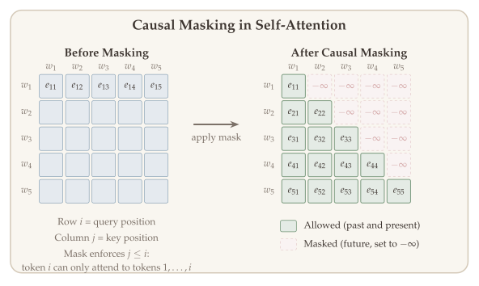
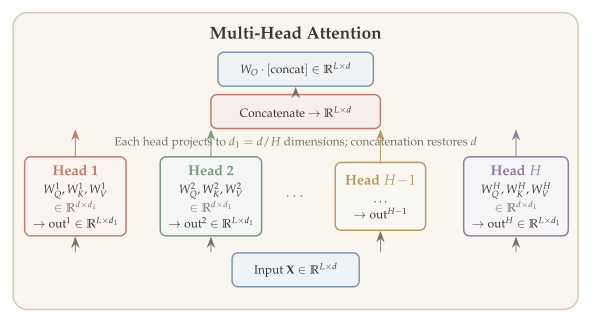
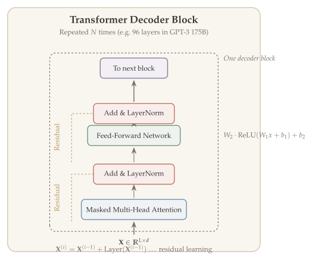

In 2017, a team at Google published a paper titled "Attention Is All You Need." The architecture it introduced --- the **Transformer** --- has since become the foundation of virtually every major AI system: ChatGPT and GPT-4 (OpenAI), Claude (Anthropic), Gemini (Google), LLaMA (Meta), and many more. Beyond language, transformers power image generation (DALL-E, Stable Diffusion), protein structure prediction (AlphaFold), code completion (Copilot), and even chip design.

What makes the transformer so powerful? At its core, it is built from a small set of mathematical operations we have studied throughout this course --- matrix multiplications, softmax normalization, and elementwise nonlinearities --- all trained end-to-end with gradient descent. The key innovation is the **attention mechanism**: a learned, content-dependent weighted average that allows every token in a sequence to dynamically gather information from every other token. This simple idea, combined with positional encodings, residual connections, and layer normalization, scales to networks with hundreds of billions of parameters.

This chapter develops the transformer architecture from the ground up. We start with how words become vectors, build up the attention mechanism step by step, assemble the full decoder architecture, and conclude by analyzing the parameter count of GPT-3 to build concrete intuition for the scale of modern language models.

::: {.callout-tip}
## Companion Notebooks

Companion notebooks for this chapter are coming soon.
:::

## What Will Be Covered {.unnumbered}

- Language tasks and three types of transformer models
- Token embedding, positional encoding, and the softmax prediction head
- The attention mechanism: cross attention and self-attention
- Multi-head attention, causal masking, MLP layers
- Residual connections and layer normalization
- Full transformer decoder architecture
- GPT-3 parameter analysis

## From Words to Predictions: The Big Picture {#sec-big-picture}

Before diving into details, let us sketch the full pipeline of an autoregressive language model like GPT. The model takes a sequence of words (tokens), processes them through many layers, and outputs a probability distribution over what word comes next.

::: {.callout-note appearance="simple"}
**The Transformer Pipeline** (using GPT-3 as reference):

| Stage | Description | Size |
|:------|:------------|:-----|
| **Input** | Token sequence $w_1, \ldots, w_L$ (one-hot) | $L \times V$ |
| **Embedding** | Map tokens to vectors: $x_i = W_E w_i + \text{pe}_i$ | $L \times d$ |
| **Transformer blocks** | 96 layers of attention + MLP + normalization | $L \times d$ |
| **Unembedding** | Project to vocabulary: $W_U z_\ell$ | $L \times V$ |
| **Softmax** | Probability distribution over next token | $L \times V$ |

Here $V = 50{,}257$ (vocabulary), $d = 12{,}288$ (model dimension), $L = 2{,}048$ (context window).
:::

We will now build each component from scratch.

## Motivation: Why Transformers? {#sec-motivation}

### The Landscape of AI Models {#sec-landscape}

Transformers have become the universal architecture across AI:

- **Language:** GPT-4, Claude, LLaMA, Gemini --- all decoder-only transformers
- **Vision:** Vision Transformer (ViT) matches or exceeds CNNs on image classification
- **Protein science:** AlphaFold2 uses attention to predict 3D protein structures
- **Multimodal:** DALL-E 3, Stable Diffusion use transformers for text-conditioned image generation

Today, transformer-based models dominate the LMSYS Chatbot Arena Leaderboard, with models like GPT-4, Claude, and Gemini at the top.

### Language Tasks {#sec-language-tasks}

::: {#def-language-tasks}
## Two Main Types of Language Tasks

Language tasks broadly fall into two categories:

**1. Generative tasks** (conditional generation): translation, summarization, code generation, dialogue.
$$\mathbb{P}(\text{output text} \mid \text{input text / image}).$$

**2. Discriminative tasks** (classification): sentiment analysis, part-of-speech tagging, spam detection.
$$\mathbb{P}(\text{label} \mid \text{input text}).$$
:::

This distinction directly determines which transformer architecture is appropriate.

## Three Types of Transformer Models {#sec-three-types}

Depending on the task, transformers come in three variants that differ in how information flows through the model.

### Encoder-Only (Feature Extraction) {#sec-encoder-only}

::: {#def-encoder-only}
## Encoder-Only Transformer

Creates a **sequence of contextual features** from the input.

- **Input:** tokens $w_1, \ldots, w_L$
- **Output:** features $z_1, z_2, \ldots, z_L \in \mathbb{R}^d$
- **Key property:** each $z_\ell$ depends on the **entire** input $\{w_1, \ldots, w_L\}$ (bidirectional attention)
- **Use case:** downstream classification (sentiment, NER, part-of-speech)
- **Examples:** BERT, Vision Transformer (ViT)
:::

### Decoder-Only (Autoregressive Generation) {#sec-decoder-only}

::: {#def-decoder-only}
## Decoder-Only Transformer

Generates text one token at a time, left to right.

- **Input:** tokens $w_1, w_2, \ldots, w_L$
- **Output:** features $z_1, z_2, \ldots, z_L$
- **Key property:** each $z_\ell$ depends only on $w_1, \ldots, w_\ell$ (**autoregressive** --- cannot look into the future)
- Predict $w_{\ell+1}$ from $z_\ell$ via a **softmax prediction layer**
- **Examples:** GPT family, LLaMA, Mistral, Claude
:::

### Encoder-Decoder {#sec-encoder-decoder}

::: {#def-encoder-decoder}
## Encoder-Decoder Transformer

The original architecture from "Attention Is All You Need" (Vaswani et al., 2017). The encoder processes the input into features; the decoder autoregressively generates the output, attending to encoder features via **cross attention**.

- **Use case:** machine translation, summarization
- **Example:** T5, the original Transformer
:::

::: {.callout-tip}
## Remark: Current Landscape

Decoder-only models dominate modern practice. They can handle both generative and discriminative tasks, making encoder-only and encoder-decoder architectures largely superseded. The main exception is Vision Transformer (ViT), which is encoder-only.
:::

## Token Embedding {#sec-token-embedding}

The first step is to convert discrete words into continuous vectors that a neural network can process.

::: {#def-token-embedding}
## Word/Token Embedding

Each word $w$ (a one-hot vector in $\mathbb{R}^V$) is mapped to a dense vector $x_w \in \mathbb{R}^d$ via a learned **embedding matrix** $W_E \in \mathbb{R}^{d \times V}$:
$$x_i = W_E \, w_i \in \mathbb{R}^d.$$

For GPT-3: $V = 50{,}257$ (vocabulary size), $d = 12{,}288$ (embedding dimension), $L = 2{,}048$ (context length).
:::

The embedding matrix converts sparse one-hot vectors in a very high-dimensional space ($\mathbb{R}^V$) into dense, continuous vectors in a much lower-dimensional space ($\mathbb{R}^d$). This is essential because all subsequent operations --- attention, MLP layers, optimization --- operate on continuous vectors.

::: {.callout-tip}
## Remark: Why Embeddings Work

Word embeddings equip words with geometric structure. Similar words end up **close** in the embedding space (measured by cosine similarity $\cos(u,v) = u^\top v / (\|u\|\|v\|)$). Famously, Word2Vec and GloVe embeddings capture semantic analogies as linear relationships:

$$\text{king} - \text{man} + \text{woman} \approx \text{queen}.$$

Once words live in Euclidean space, we can apply calculus, linear algebra, and all the optimization tools from this course.
:::

```{=html}
<div class="figure-container">
  <div id="fig-word-embedding"></div>
  <div class="figure-caption">Figure 18.1: Word embeddings projected to 2D via PCA. Semantically similar words cluster together, and analogical relationships appear as parallel displacements.</div>
</div>
```

## Prediction Head and Softmax {#sec-prediction-head}

At the output end, the transformer produces a vector $z_\ell \in \mathbb{R}^d$ at each position. For next-token prediction, we need a probability distribution over the vocabulary. The **softmax function** converts raw scores into probabilities.

::: {#def-softmax}
## Softmax Function

For any vector of real numbers $v = (v_1, \ldots, v_N) \in \mathbb{R}^N$:

$$\text{Softmax}(v)_i = \frac{\exp(v_i)}{\sum_{j=1}^{N} \exp(v_j)}, \qquad i = 1, \ldots, N.$$

This produces a valid probability distribution: all entries are positive and sum to one. Larger logits receive exponentially more probability mass, making softmax a "soft" version of argmax.
:::

::: {.callout-tip}
## Remark: Unembedding + Softmax

The transformer output $z_\ell \in \mathbb{R}^d$ is mapped to vocabulary-sized logits via the **unembedding matrix** $W_U \in \mathbb{R}^{V \times d}$, then softmax produces a distribution:

$$\underbrace{W_U}_{\mathbb{R}^{V \times d}} \cdot z_\ell \in \mathbb{R}^V \xrightarrow{\text{Softmax}} \mathbb{P}(w_{\ell+1} \mid w_1, \ldots, w_\ell) \in \Delta_V.$$
:::

### Loss Function: Cross-Entropy {#sec-loss-function}

The natural training objective is to maximize the probability of the correct next token at each position, leading to the cross-entropy loss.

::: {#def-cross-entropy}
## Cross-Entropy Loss (Maximum Likelihood)

At each position $\ell$, the transformer outputs a distribution $p_\ell \in \Delta_V$ over the vocabulary. The next-token label is $w_{\ell+1}$. The training loss is:

$$\mathcal{L}(\theta) = -\sum_{\ell=1}^{L-1} \log \mathbb{P}_\theta(w_{\ell+1} \mid w_1, \ldots, w_\ell).$$

This is equivalent to **maximum likelihood estimation (MLE)**, and is minimized via gradient descent with backpropagation.
:::

### Autoregressive Generation {#sec-autoregressive-generation}

::: {#exm-autoregressive}
## Autoregressive Generation

Given the prompt "My name is X.", generation proceeds step by step:

| Step | Context | Prediction |
|:-----|:--------|:-----------|
| 1 | "My name is X." | $\mathbb{P}(\text{"I"} \mid \text{prompt})$ |
| 2 | "My name is X. I" | $\mathbb{P}(\text{"am"} \mid \text{context})$ |
| 3 | "My name is X. I am" | $\mathbb{P}(\text{"a"} \mid \text{context})$ |
| 4 | "My name is X. I am a" | $\mathbb{P}(\text{"Yale"} \mid \text{context})$ |
| 5 | "My name is X. I am a Yale" | $\mathbb{P}(\text{"student"} \mid \text{context})$ |

Each generated word is appended to the input for the next prediction. This is why decoder-only models are called **autoregressive**: the output at each step feeds back as input.
:::

## The Attention Mechanism {#sec-attention}

The central innovation of the transformer is **attention**: a mechanism that computes a weighted average of values, where the weights are determined by learned similarity between a query and a set of keys.

::: {#def-attention}
## Attention

Given a set of vector *values* and a vector *query*, **attention** computes a **weighted sum of the values**, dependent on the query. The query *attends to* the values.

- In **attention**, the query matches all keys *softly* (weights between 0 and 1).
- In a **lookup table**, the query matches one key exactly.

Attention is just a **weighted average** --- but it becomes very powerful when the weights are learned!
:::

### Cross Attention {#sec-cross-attention}

We first formalize attention where the query comes from one source and the key-value pairs from another (this generalizes to self-attention later).

::: {#thm-cross-attention}
## Cross Attention Formula

Given (key, value) pairs $\{(k_i, v_i)\}_{i \in [L]}$ with $k_i \in \mathbb{R}^{d_k}$, $v_i \in \mathbb{R}^{d_v}$, and a query $q \in \mathbb{R}^{d_k}$:

1. **Similarity scores:** $e_i = q^\top k_i$ for each $i \in [L]$

2. **Attention weights** (via softmax with scaling):
$$\alpha_i = \frac{\exp(q^\top k_i / \sqrt{d_k})}{\sum_{j=1}^{L} \exp(q^\top k_j / \sqrt{d_k})}$$

3. **Output** (weighted sum of values):
$$h = \sum_{i=1}^{L} \alpha_i \cdot v_i \in \mathbb{R}^{d_v}$$
:::

The $1/\sqrt{d_k}$ scaling factor prevents the dot products from growing too large in high dimensions, which would push softmax into near-zero gradient regions.

::: {.callout-tip}
## Remark: Why Scale by $1/\sqrt{d_k}$?

If the entries of $q$ and $k_i$ are independent with zero mean and unit variance, then $q^\top k_i$ has variance $d_k$. The scaling ensures the variance of the logits is approximately 1, keeping softmax in a well-behaved regime.
:::

### Self-Attention {#sec-self-attention}

The breakthrough insight of the transformer is to apply attention *within a single sequence* --- the queries, keys, and values are all computed from the same input. This is **self-attention**.

{#fig-self-attention}

::: {#def-self-attention}
## Self-Attention

Given post-embedding sequence $X = (x_1, \ldots, x_L) \in \mathbb{R}^{L \times d}$, we compute:

$$Q = X W_Q, \quad K = X W_K, \quad V = X W_V \quad \in \mathbb{R}^{L \times d_k},$$

where $W_Q, W_K, W_V \in \mathbb{R}^{d \times d_k}$ are learnable weight matrices. At position $\ell$:

$$\alpha_{\ell j} = \frac{\exp(q_\ell^\top k_j / \sqrt{d_k})}{\sum_{s=1}^{L} \exp(q_\ell^\top k_s / \sqrt{d_k})} = \frac{\exp(x_\ell^\top W_Q^\top W_K x_j / \sqrt{d_k})}{\sum_{s=1}^{L} \exp(x_\ell^\top W_Q^\top W_K x_s / \sqrt{d_k})},$$

and the output is: $h_\ell = \sum_{j=1}^{L} \alpha_{\ell j} \cdot v_j = \sum_{j=1}^{L} \alpha_{\ell j} \cdot (W_V x_j)$.
:::

::: {.callout-important}
## Algorithm: Self-Attention in Matrix Form

Given input $X \in \mathbb{R}^{L \times d}$:

1. Compute projections: $Q = XW_Q$, $K = XW_K$, $V = XW_V$
2. Compute attention scores: $E = QK^\top \in \mathbb{R}^{L \times L}$
3. Scale and normalize: $A = \text{Softmax}(E / \sqrt{d_k}) \in \mathbb{R}^{L \times L}$
4. Output: $H = AV = \text{Softmax}(QK^\top / \sqrt{d_k}) \cdot V \in \mathbb{R}^{L \times d_k}$
:::

```{=html}
<div class="figure-container">
  <div id="fig-attention-heatmap"></div>
  <div class="figure-caption">Figure 18.2: Attention weight matrix for a short sentence. Each row shows how much a token attends to every other token. The pattern reveals that tokens attend most strongly to semantically related words.</div>
</div>
```

### Permutation Invariance {#sec-permutation-invariance}

::: {#cor-permutation-invariance}
## Permutation Invariance

The attention output $h = \sum_{i=1}^{L} \alpha_i \cdot v_i$ is unchanged if we permute the key-value pairs $\{(k_i, v_i)\}_{i \in [L]}$.
:::

This means self-attention treats its input as a **set**, not a sequence. Since word order clearly matters in language ("the cat chased the dog" $\neq$ "the dog chased the cat"), we must explicitly inject positional information. This leads to the next section.

## Three Challenges and Their Solutions {#sec-challenges}

Self-attention is a powerful building block, but it has three limitations that must be addressed before it can serve as the basis for a language model:

| **Challenge** | **Solution** |
|:------------|:-------------|
| No notion of token order (permutation invariant) | **Positional embedding** |
| Can see future tokens during training | **Causal masking** |
| Output is a linear weighted average (no nonlinearity) | **MLP / feed-forward layers** |

We address each in turn.

### Positional Embedding {#sec-position-embedding}

Since self-attention is permutation invariant, we explicitly encode position by adding a **positional embedding** to each token embedding:

::: {#def-positional-embedding}
## Positional Embedding

The embedding of (token, position) is additive:
$$x_i = W_E \, w_i + \text{pe}_i \in \mathbb{R}^d,$$

where $\text{pe}_i \in \mathbb{R}^d$ encodes position $i$ in the sequence.
:::

There are three major approaches:

**1. Absolute (learned) embedding.** Each position $\ell$ gets a learnable vector $\text{pe}_\ell \in \mathbb{R}^d$. Simple but cannot generalize beyond the training context length.

**2. Sinusoidal encoding** (Vaswani et al., 2017). Use fixed sinusoidal functions at different frequencies:

$$\vec{p}_t = \begin{pmatrix} \sin(\omega_1 \cdot t) \\ \cos(\omega_1 \cdot t) \\ \sin(\omega_2 \cdot t) \\ \cos(\omega_2 \cdot t) \\ \vdots \\ \sin(\omega_{d/2} \cdot t) \\ \cos(\omega_{d/2} \cdot t) \end{pmatrix}, \qquad \omega_k = \frac{1}{10000^{2k/d}}.$$

Low-frequency sinusoids vary slowly across positions (capturing coarse position), while high-frequency ones oscillate rapidly (capturing fine position). The key insight is that relative position information is encoded via rotation matrices: $\vec{p}_{t+\Delta}$ can be expressed as a linear function of $\vec{p}_t$.

**3. Rotary Position Embedding (RoPE).** Used in LLaMA and most modern models. Encodes relative positions $i - j$ directly into the attention score:
$$\alpha_i = \text{Softmax}\!\left(\{q_i^\top(k_j + \vec{P}_{i-j})\}_{j \in [L]}\right).$$

```{=html}
<div class="figure-container">
  <div id="fig-positional-encoding"></div>
  <div class="figure-caption">Figure 18.3: Sinusoidal positional encoding. Each row is a position (0 to 127), each column a dimension of the encoding vector. Low-frequency dimensions (left) vary slowly, while high-frequency dimensions (right) oscillate rapidly.</div>
</div>
```

### Causal Masking {#sec-causal-masking}

For autoregressive generation, token $\ell$ must not attend to future tokens $j > \ell$. We enforce this by masking.

::: {#def-causal-masking}
## Causal Masking

Set the attention score to $-\infty$ for all future positions:

$$\text{Masked Attention} = \text{Softmax}\!\left(\frac{QK^\top}{\sqrt{d_k}} + M\right) V, \qquad M_{\ell j} = \begin{cases} 0 & \text{if } j \leq \ell, \\ -\infty & \text{if } j > \ell. \end{cases}$$

After softmax, the $-\infty$ entries become zero, so each token can only attend to itself and previous tokens.
:::

{#fig-causal-masking width=100%}

::: {.callout-tip}
## Remark: Encoder vs. Decoder Masking

- **Encoder-only** (BERT): uses **global** attention --- every token sees every other token.
- **Decoder-only** (GPT): uses **causal** masking --- tokens can only look backward.
:::

### MLP / Feed-Forward Layer {#sec-mlp-layer}

The self-attention output $\sum_j \alpha_{\ell j} \cdot W_V x_j$ is a weighted average of linear functions --- stacking more attention layers without nonlinearities would just produce another weighted average. To give the model nonlinear expressivity, we add a pointwise MLP after each attention layer.

::: {#def-mlp-layer}
## Feed-Forward (MLP) Layer

A 2-layer neural network applied independently at each position $\ell \in [L]$:

$$\text{MLP}(x) = W_2 \cdot \sigma(W_1 x + b_1) + b_2,$$

where $\sigma$ is a nonlinearity (ReLU or GELU), $W_1 \in \mathbb{R}^{d_f \times d}$, $W_2 \in \mathbb{R}^{d \times d_f}$.

Typically $d_f = 4d$ (the MLP expands the dimension by 4x, applies the nonlinearity, then projects back).
:::

## Multi-Head Attention {#sec-multi-head}

A single attention head can only capture one type of relationship between tokens. In practice, language has many simultaneous structures --- syntactic dependencies, semantic similarity, coreference --- that require different attention patterns. **Multi-head attention** runs multiple attention operations in parallel, each with its own learned projections.

::: {#def-multi-head-attention}
## Multi-Head Attention

Let $H$ be the number of attention heads. Each head $h$ has its own projection matrices $W_Q^h, W_K^h, W_V^h \in \mathbb{R}^{d \times d_k}$, where $d_k = d / H$.

For each head $h$:
$$\text{head}^h = \text{Attention}(XW_Q^h, XW_K^h, XW_V^h) \in \mathbb{R}^{L \times d_k}.$$

The outputs from all heads are concatenated and mixed via an output matrix $W_O \in \mathbb{R}^{d \times d}$:

$$\text{MultiHead}(X) = W_O \begin{pmatrix} \text{head}^1 \\ \vdots \\ \text{head}^H \end{pmatrix} \in \mathbb{R}^{L \times d}.$$
:::

{#fig-multi-head-attention width=100%}

::: {.callout-tip}
## Remark: What Different Heads Learn

Empirically, different heads specialize in different patterns:

- Some heads attend to the **previous token** (bigram patterns)
- Some heads attend to **syntactic heads** (subject-verb agreement)
- Some heads attend to **semantically similar** words
- Some heads form **induction heads** that copy patterns from earlier in the context
:::

## Residual Connections and Layer Normalization {#sec-residual-layernorm}

A transformer stacks dozens (or nearly a hundred) layers of attention and MLP blocks. Training such deep networks requires two critical ingredients.

### Residual Connections {#sec-residual}

::: {#def-residual-connection}
## Residual Connection

Instead of $X^{(i)} = \text{Layer}(X^{(i-1)})$, we use:
$$X^{(i)} = X^{(i-1)} + \text{Layer}(X^{(i-1)}).$$

This biases the mapping toward the identity, so each layer only needs to learn "the residual" --- a small correction to its input.
:::

Residual connections provide a direct gradient pathway from the output back to early layers, preventing the vanishing gradient problem. From an optimization perspective, they smooth the loss landscape.

### Layer Normalization {#sec-layer-norm}

::: {#def-layer-normalization}
## Layer Normalization

For a vector $x \in \mathbb{R}^d$, compute:

- Mean: $\mu = \frac{1}{d} \sum_{j=1}^{d} x_j$
- Standard deviation: $\sigma = \sqrt{\frac{1}{d} \sum_{j=1}^{d} (x_j - \mu)^2}$
- Normalization: $\text{LayerNorm}(x) = \frac{x - \mu}{\sigma + \varepsilon}$

Applied independently to each token's feature vector $x_1, x_2, \ldots, x_L$.
:::

Layer normalization ensures that the inputs to each sub-layer have consistent scale, preventing the magnitude of activations from growing or shrinking uncontrollably across layers.

## The Full Transformer Decoder {#sec-full-architecture}

We now assemble all components into the complete architecture.

::: {.callout-note appearance="simple"}
**The Transformer Decoder** is a stack of identical **blocks**. Each block consists of:

1. **(Masked) Multi-Head Self-Attention**
2. **Add & Norm** (residual connection + layer normalization)
3. **Feed-Forward Network** (MLP)
4. **Add & Norm**

Two design variants: **Post-norm** (original) applies LayerNorm after each sub-layer. **Pre-norm** (more common now) applies LayerNorm before each sub-layer, yielding better training stability.
:::

{#fig-transformer-decoder width=100%}

::: {.callout-tip}
## Remark: Revisiting the Three Model Types

- **Encoder-only** (BERT): no causal masking; trained by masking random tokens and predicting them.
- **Decoder-only** (GPT): causal masking; trained to predict the next token.
- **Encoder-decoder** (T5): encoder uses global attention; decoder uses causal masking and attends to encoder features via cross attention at each layer.
:::

## Understanding GPT-3: Parameter Analysis {#sec-gpt3-exercise}

To build concrete intuition for the scale of modern language models, let us count the parameters of GPT-3.

### GPT-3 Model Variants {#sec-gpt3-variants}

| Model | Parameters | Layers | $d_\text{model}$ | Heads | $d_\text{head}$ |
|:------|:-----------|:-------|:------------------|:------|:-----------------|
| GPT-3 Small | 125M | 12 | 768 | 12 | 64 |
| GPT-3 Medium | 350M | 24 | 1,024 | 16 | 64 |
| GPT-3 Large | 760M | 24 | 1,536 | 16 | 96 |
| GPT-3 XL | 1.3B | 24 | 2,048 | 24 | 128 |
| GPT-3 6.7B | 6.7B | 32 | 4,096 | 32 | 128 |
| GPT-3 13B | 13.0B | 40 | 5,140 | 40 | 128 |
| **GPT-3 175B** | **175.0B** | **96** | **12,288** | **96** | **128** |

Note: $d_\text{model} = n_\text{heads} \times d_\text{head}$ in all cases.

### Counting Parameters {#sec-counting-params}

::: {.callout-important}
## Algorithm: GPT-3 175B Parameter Count

Let $d = 12{,}288$, $V = 50{,}257$, $L = 2{,}048$, $n_\text{layers} = 96$.

**1. Word embedding:** $W_E \in \mathbb{R}^{V \times d}$ $\Rightarrow$ $V \cdot d \approx 617\text{M}$

**2. Position embedding:** $W_{PE} \in \mathbb{R}^{L \times d}$ $\Rightarrow$ $L \cdot d \approx 25\text{M}$

**3. Self-attention per layer:** $W_Q, W_K, W_V \in \mathbb{R}^{d \times d}$ (each is $H$ heads of $d \times d_k$, totaling $d \times d$), plus $W_O \in \mathbb{R}^{d \times d}$ $\Rightarrow$ $4d^2$ per layer

**4. MLP per layer:** $W_1 \in \mathbb{R}^{4d \times d}$, $W_2 \in \mathbb{R}^{d \times 4d}$ $\Rightarrow$ $8d^2$ per layer

**Total** (neglecting biases and layer norms):

$$\text{Parameters} = V \cdot d + L \cdot d + 12d^2 \times n_\text{layers} \approx 174{,}074{,}267{,}648 \approx 174 \times 10^9.$$

This is 99.5% of the reported 175B parameter count!
:::

```{=html}
<div class="figure-container">
  <div id="fig-param-breakdown"></div>
  <div class="figure-caption">Figure 18.4: Parameter distribution in GPT-3 175B. The vast majority of parameters (over 99%) reside in the 96 transformer blocks, with attention and MLP layers each contributing roughly equally.</div>
</div>
```

## Transformer Circuits and the Residual Stream {#sec-transformer-circuits}

A useful perspective on transformers comes from viewing the residual connections as a **residual stream** --- a persistent information highway that each attention and MLP layer reads from and writes to.

::: {#thm-single-layer-attention}
## Single-Layer Attention-Only Transformer

For a single-layer, attention-only transformer, the output logits can be written as:

$$T(X) = X \underbrace{W_E^\top W_U^\top}_{\text{direct path (residual)}} + \sum_{h=1}^{H} A^h \cdot X \cdot \underbrace{W_E^\top (W_{OV}^h)^\top W_U^\top}_{\text{attention path}},$$

where $A^h = \text{Softmax}(X W_{QK}^h X^\top)$ is the attention pattern for head $h$, $W_{QK}^h = W_Q^{h\top} W_K^h / \sqrt{d_k}$ is the **QK-circuit** (which tokens to attend to), and $W_{OV}^h = W_O^h W_V^h$ is the **OV-circuit** (what information to move).
:::

This decomposition reveals that each attention head performs two distinct functions: the QK-circuit determines **where** to look, while the OV-circuit determines **what** to copy. The residual stream provides a direct path from input to output, so each layer only needs to make incremental contributions.

::: {.callout-tip}
## Remark: Mechanistic Interpretability

This "circuits" perspective has led to a growing field of **mechanistic interpretability**, which aims to reverse-engineer the algorithms learned by transformers by studying the QK and OV circuits of individual attention heads. Researchers have identified specific heads that perform induction (pattern completion), heads that handle syntax, and heads that track entities across long contexts.
:::

```{=html}
<!-- Plotly.js for interactive figures -->
<script src="https://cdn.plot.ly/plotly-2.35.0.min.js" charset="utf-8"></script>

<script>
document.addEventListener('DOMContentLoaded', () => {

  const plotlyConfig = {responsive: true, displayModeBar: false};
  const figFont = '"Source Serif 4", Georgia, "Times New Roman", serif';

  function css(v) { return getComputedStyle(document.documentElement).getPropertyValue(v).trim(); }

  function legendStyle() {
    return {
      font: {family: figFont, size: 13, color: css('--fig-text') || '#3d3530'},
      bgcolor: (css('--fig-bg') || '#f0ebe5') + 'dd',
      bordercolor: css('--fig-grid') || '#e0d9d1',
      borderwidth: 1,
    };
  }

  function themeLayout(extra = {}) {
    return Object.assign({
      paper_bgcolor: css('--fig-bg') || '#f0ebe5',
      plot_bgcolor: css('--fig-plot-bg') || '#faf7f3',
      font: { family: figFont, color: css('--fig-text') || '#3d3530', size: 14 },
    }, extra);
  }

  function themeAxis(title, extra = {}) {
    return Object.assign({
      title: {text: title, font: {family: figFont, size: 14}},
      gridcolor: css('--fig-grid') || '#e0d9d1',
      zerolinecolor: css('--fig-grid') || '#e0d9d1',
      linecolor: css('--fig-axis') || '#968a80',
      tickfont: {family: figFont, size: 12, color: css('--fig-axis') || '#968a80'},
    }, extra);
  }

  // ──────────── Word Embedding Visualization ────────────
  function renderWordEmbedding() {
    const el = document.getElementById('fig-word-embedding');
    if (!el) return;
    // Simulated 2D PCA projection of word embeddings
    const words = {
      // Royalty cluster
      'king': [2.1, 1.8], 'queen': [1.5, 2.4], 'prince': [2.5, 2.2], 'princess': [1.9, 2.8],
      // Animals
      'cat': [-1.8, -0.5], 'dog': [-1.2, -0.8], 'fish': [-2.2, -1.2], 'bird': [-1.5, -1.5],
      // Actions
      'run': [0.5, -2.0], 'walk': [0.8, -1.5], 'swim': [-0.2, -2.3], 'fly': [0.1, -1.8],
      // People
      'man': [1.0, 0.5], 'woman': [0.4, 1.1], 'boy': [1.4, 0.2], 'girl': [0.8, 0.8],
    };
    const groups = {
      'Royalty': ['king', 'queen', 'prince', 'princess'],
      'Animals': ['cat', 'dog', 'fish', 'bird'],
      'Actions': ['run', 'walk', 'swim', 'fly'],
      'People': ['man', 'woman', 'boy', 'girl'],
    };
    const colors = {'Royalty': '#b8995e', 'Animals': '#7a9a7e', 'Actions': '#7b97ad', 'People': '#c47a6a'};
    const traces = [];
    for (const [group, wordList] of Object.entries(groups)) {
      traces.push({
        x: wordList.map(w => words[w][0]),
        y: wordList.map(w => words[w][1]),
        text: wordList,
        mode: 'markers+text',
        textposition: 'top center',
        textfont: {family: figFont, size: 13, color: colors[group]},
        marker: {size: 10, color: colors[group], symbol: 'circle'},
        name: group,
        type: 'scatter',
      });
    }
    // Analogy arrow: king - man + woman ≈ queen
    traces.push({
      x: [2.1, 0.4+2.1-1.0], y: [1.8, 1.1+1.8-0.5],
      mode: 'lines', line: {color: '#3d3530', width: 1.5, dash: 'dot'},
      showlegend: false,
    });
    traces.push({
      x: [1.0, 0.4], y: [0.5, 1.1],
      mode: 'lines', line: {color: '#907ea0', width: 1.5, dash: 'dot'},
      showlegend: false,
    });
    Plotly.newPlot(el, traces, themeLayout({
      height: 420, margin: {t: 30, r: 30, b: 50, l: 60},
      xaxis: themeAxis('PCA Dimension 1', {zeroline: false}),
      yaxis: themeAxis('PCA Dimension 2', {zeroline: false}),
      showlegend: true,
      legend: Object.assign(legendStyle(), {x: 0.01, y: 0.99}),
    }), plotlyConfig);
  }

  // ──────────── Attention Heatmap ────────────
  function renderAttentionHeatmap() {
    const el = document.getElementById('fig-attention-heatmap');
    if (!el) return;
    const tokens = ['The', 'cat', 'sat', 'on', 'the', 'mat'];
    const n = tokens.length;
    // Simulated attention weights (row = query, col = key)
    const attn = [
      [0.40, 0.15, 0.10, 0.10, 0.15, 0.10],  // The
      [0.10, 0.35, 0.10, 0.05, 0.05, 0.35],  // cat → mat
      [0.05, 0.40, 0.30, 0.10, 0.05, 0.10],  // sat → cat
      [0.05, 0.05, 0.15, 0.30, 0.05, 0.40],  // on → mat
      [0.35, 0.05, 0.05, 0.10, 0.35, 0.10],  // the → The
      [0.05, 0.30, 0.10, 0.15, 0.05, 0.35],  // mat → cat
    ];
    Plotly.newPlot(el, [{
      z: attn, x: tokens, y: tokens,
      type: 'heatmap',
      colorscale: [[0, '#faf7f3'], [0.25, '#d4c9b8'], [0.5, '#b8995e'], [0.75, '#ad8480'], [1, '#7b4b3a']],
      showscale: true,
      colorbar: {title: {text: 'Weight', font: {family: figFont, size: 12}}, tickfont: {family: figFont, size: 11}},
      hovertemplate: 'Query: %{y}<br>Key: %{x}<br>Weight: %{z:.2f}<extra></extra>',
    }], themeLayout({
      height: 420, margin: {t: 30, r: 80, b: 60, l: 80},
      xaxis: {title: {text: 'Key', font: {family: figFont, size: 14}}, tickfont: {family: figFont, size: 13}, side: 'bottom'},
      yaxis: {title: {text: 'Query', font: {family: figFont, size: 14}}, tickfont: {family: figFont, size: 13}, autorange: 'reversed'},
    }), plotlyConfig);
  }

  // ──────────── Positional Encoding Heatmap ────────────
  function renderPositionalEncoding() {
    const el = document.getElementById('fig-positional-encoding');
    if (!el) return;
    const nPos = 128, dModel = 64;
    const pe = [];
    for (let pos = 0; pos < nPos; pos++) {
      const row = [];
      for (let i = 0; i < dModel; i++) {
        const dimIdx = Math.floor(i / 2);
        const omega = 1 / Math.pow(10000, 2 * dimIdx / dModel);
        row.push(i % 2 === 0 ? Math.sin(omega * pos) : Math.cos(omega * pos));
      }
      pe.push(row);
    }
    Plotly.newPlot(el, [{
      z: pe, type: 'heatmap',
      colorscale: [[0, '#7b97ad'], [0.5, '#faf7f3'], [1, '#c47a6a']],
      showscale: true,
      colorbar: {title: {text: 'Value', font: {family: figFont, size: 12}}, tickfont: {family: figFont, size: 11}},
      hovertemplate: 'Position: %{y}<br>Dimension: %{x}<br>Value: %{z:.3f}<extra></extra>',
    }], themeLayout({
      height: 420, margin: {t: 30, r: 80, b: 60, l: 70},
      xaxis: themeAxis('Encoding Dimension'),
      yaxis: themeAxis('Position', {autorange: 'reversed'}),
    }), plotlyConfig);
  }

  // ──────────── GPT-3 Parameter Breakdown ────────────
  function renderParamBreakdown() {
    const el = document.getElementById('fig-param-breakdown');
    if (!el) return;
    const d = 12288, nLayers = 96, V = 50257, L = 2048;
    const embed = V * d;
    const posEmbed = L * d;
    const attnPerLayer = 4 * d * d;
    const mlpPerLayer = 8 * d * d;
    const totalAttn = attnPerLayer * nLayers;
    const totalMlp = mlpPerLayer * nLayers;
    const labels = ['Word Embedding', 'Position Embedding', 'Attention (96 layers)', 'MLP (96 layers)'];
    const values = [embed, posEmbed, totalAttn, totalMlp];
    const colors = ['#b8995e', '#907ea0', '#7b97ad', '#7a9a7e'];
    Plotly.newPlot(el, [{
      labels: labels, values: values,
      type: 'pie',
      marker: {colors: colors, line: {color: '#f0ebe5', width: 2}},
      textinfo: 'label+percent',
      textfont: {family: figFont, size: 13},
      hovertemplate: '%{label}<br>%{value:,.0f} params<br>%{percent}<extra></extra>',
      hole: 0.35,
    }], themeLayout({
      height: 400, margin: {t: 30, r: 30, b: 30, l: 30},
      showlegend: false,
    }), plotlyConfig);
  }

  renderWordEmbedding();
  renderAttentionHeatmap();
  renderPositionalEncoding();
  renderParamBreakdown();
});
</script>
```

## Summary {.unnumbered}

- **Token embedding.** Discrete words are mapped to dense vectors $x_i = W_E w_i \in \mathbb{R}^d$ via a learned embedding matrix; positional information is added as $x_i + \text{pe}_i$.
- **Attention mechanism.** The core operation computes $\text{Attention}(Q,K,V) = \text{softmax}(QK^\top / \sqrt{d_k}) V$, where queries, keys, and values are linear projections of the input; each token attends to all other tokens with learned, content-dependent weights.
- **Positional encoding.** Since self-attention is permutation invariant, positional embeddings (sinusoidal or learned) inject sequence-order information; causal masking further enforces autoregressive structure by preventing attention to future tokens.
- **Transformer block.** Each block applies multi-head self-attention followed by a position-wise MLP, with residual connections and layer normalization around each sub-layer, enabling stable training of very deep models.
- **Multi-head attention.** Running $H$ attention heads in parallel with independent projections lets the model capture diverse relational patterns; outputs are concatenated and projected back to the model dimension.
- **Scale.** GPT-3 175B has 96 layers, $d = 12{,}288$, and 96 attention heads; over 99% of its $\sim$174B parameters reside in the attention ($4d^2$ per layer) and MLP ($8d^2$ per layer) weights.
